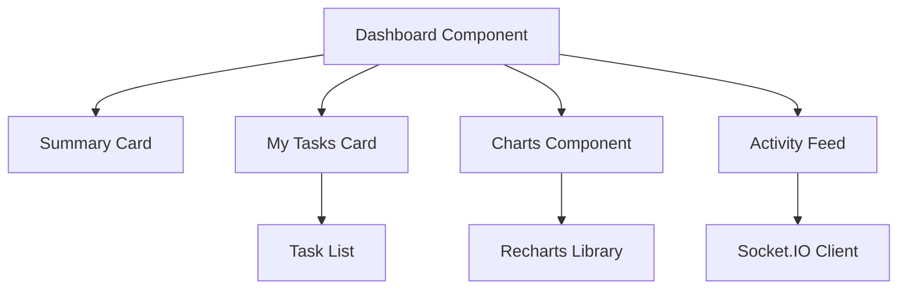

# Epic PRD: 대시보드 및 리포팅

## 문서 정보

| 항목 | 내용 |
|------|------|
| Epic ID | EPIC-001 |
| Epic 이름 | 대시보드 및 리포팅 |
| 문서 버전 | 1.1 |
| 작성일 | 2024-12-06 |
| 수정일 | 2024-12-06 |
| 상태 | Draft |
| Epic 유형 | 기능 (Feature) |
| 상위 프로젝트 | jjiban (찌반) |
| 원본 PRD | `jjiban-prd.md` |

---

## 1. Epic 개요

### 1.1 Epic 비전

**"프로젝트 전체 현황을 한눈에 파악하는 대시보드"**

jjiban의 메인 화면으로, 프로젝트 요약, 내 할 일, 최근 활동, 진행률 차트를 표시합니다. 사용자가 로그인 후 가장 먼저 보는 화면으로, 프로젝트 상태를 빠르게 파악할 수 있도록 합니다.

### 1.2 범위 (Scope)

**포함:**
- 프로젝트 요약 (Epic, Task 개수, 진행률)
- 내 할 일 (담당 Task 목록)
- 최근 활동 피드
- 진행률 차트 (Epic별, 상태별)
- 빠른 액션 (새 Task 생성, 검색)

**제외:**
- 고급 분석 (번다운 차트, 속도 차트) - v2.0에서 고려
- 커스터마이징 가능한 위젯 - v2.0에서 고려

### 1.3 성공 지표

- ✅ 대시보드 로딩 시간 < 2초
- ✅ 사용자 만족도 > 4.0/5.0
- ✅ 대시보드 방문율 > 80% (일일 활성 사용자 기준)

---

## 2. 상세 요구사항

### 2.1 기능 요구사항

#### 2.1.1 대시보드 레이아웃

```
┌────────────────────────────────────────────────────────────────┐
│ 🏠 jjiban > Dashboard                                          │
├────────────────────────────────────────────────────────────────┤
│                                                                │
│ ┌──────────────────────┐ ┌──────────────────────┐             │
│ │ 📊 프로젝트 요약      │ │ 📋 내 할 일          │             │
│ │                      │ │                      │             │
│ │ Epic: 9개            │ │ TASK-101: OAuth 구현 │             │
│ │ Task: 87개           │ │ TASK-105: 테스트 작성│             │
│ │ 완료율: 65%          │ │ TASK-112: 문서 업데이트│           │
│ └──────────────────────┘ └──────────────────────┘             │
│                                                                │
│ ┌─────────────────────────────────────────────────┐            │
│ │ 📈 진행률 차트                                   │            │
│ │ [Bar Chart: Epic별 진행률]                       │            │
│ └─────────────────────────────────────────────────┘            │
│                                                                │
│ ┌─────────────────────────────────────────────────┐            │
│ │ 🔔 최근 활동                                     │            │
│ │ • 홍길동님이 TASK-101 상태를 '구현'으로 변경     │            │
│ │ • 김철수님이 EPIC-002에 리뷰 코멘트 작성         │            │
│ │ • TASK-089 통합 테스트 완료                      │            │
│ └─────────────────────────────────────────────────┘            │
│                                                                │
└────────────────────────────────────────────────────────────────┘
```

#### 2.1.2 프로젝트 요약 카드

```tsx
<SummaryCard>
  <Metric label="Epic" value={9} change="+2" />
  <Metric label="Task" value={87} change="+15" />
  <Metric label="완료율" value="65%" trend="up" />
  <Metric label="이번 주 완료" value={12} />
</SummaryCard>
```

**표시 정보:**
- Epic 총 개수 (증감 표시)
- Task 총 개수 (증감 표시)
- 전체 완료율 (진행률 바)
- 이번 주 완료된 Task 수

#### 2.1.3 내 할 일 (My Tasks)

```tsx
<MyTasksCard>
  <TaskList
    tasks={myTasks}
    sortBy="dueDate"
    groupBy="status"
  />
</MyTasksCard>
```

**표시 정보:**
- 담당자가 나인 Task 목록
- 상태별 그룹핑
- 마감일 표시 (D-day)
- 우선순위 표시
- 클릭 시 Task 상세 화면 이동

#### 2.1.4 진행률 차트

**A. Epic별 진행률 (Bar Chart)**

```
EPIC-001: 프로젝트 관리  ████████░░ 80%
EPIC-002: 워크플로우    ██████░░░░ 60%
EPIC-003: 문서 관리     ███░░░░░░░ 30%
```

**B. 상태별 분포 (Pie Chart)**

```
[Pie Chart]
- Todo: 25%
- 진행 중: 40%
- 완료: 35%
```

**C. 시간에 따른 진행률 (Line Chart)**

```
[Line Chart]
X축: 날짜 (최근 30일)
Y축: 완료 Task 수
```

#### 2.1.5 최근 활동 피드

```tsx
<ActivityFeed>
  <ActivityItem
    user="홍길동"
    action="상태 변경"
    target="TASK-101"
    timestamp="5분 전"
  />
  <ActivityItem
    user="김철수"
    action="코멘트 작성"
    target="EPIC-002"
    timestamp="1시간 전"
  />
</ActivityFeed>
```

**활동 유형:**
- Task 생성/수정/삭제
- 상태 변경
- 담당자 변경
- 코멘트 작성
- 문서 업데이트

#### 2.1.6 빠른 액션

```
[+ 새 Task] [🔍 검색] [📋 내 할 일 전체 보기]
```

**기능:**
- 새 Task 생성 모달
- 전역 검색 바
- 내 할 일 전체 보기 (백로그로 이동)

### 2.2 비기능 요구사항

#### 2.2.1 성능
- 대시보드 로딩 시간: < 2초
- 차트 렌더링: < 500ms
- 실시간 업데이트: WebSocket 또는 5초 폴링

#### 2.2.2 사용성
- 모바일 반응형 지원
- 카드 순서 변경 가능 (드래그&드롭)
- 빈 상태 표시 (프로젝트 없을 때)

### 2.3 제약사항

- 차트 라이브러리: Recharts 또는 Chart.js
- 실시간 업데이트: Socket.IO 또는 polling

---

## 3. 기술적 고려사항

### 3.1 아키텍처



### 3.2 기술 스택

| 레이어 | 기술 | 비고 |
|--------|------|------|
| Frontend | React + TypeScript | |
| 차트 | Recharts | 반응형 차트 |
| 실시간 | Socket.IO | 활동 피드 업데이트 |
| 상태 관리 | Zustand | 대시보드 데이터 |
| 스타일링 | Tailwind CSS | |

### 3.3 의존성

**선행 Epic:**
- EPIC-P01 (사용자 관리) - 인증 및 "내 할 일" 필터링
- 프로젝트 초기 설정 (docs/SETUP.md) - React, Ant Design, Recharts

**병렬 Epic:**
- EPIC-002 (프로젝트 관리) - Epic/Task 데이터 제공

**외부 의존성:**
- recharts ^2.x
- socket.io-client ^4.x

---

## 4. Feature (Chain) 목록

이 Epic은 다음 Feature들로 구성됩니다:

- [ ] FEATURE-001-001: 대시보드 레이아웃 및 라우팅 (담당: 미정, 예상: 0.5주)
- [ ] FEATURE-001-002: 프로젝트 요약 카드 (담당: 미정, 예상: 1주)
- [ ] FEATURE-001-003: 내 할 일 카드 (담당: 미정, 예상: 1주)
- [ ] FEATURE-001-004: 진행률 차트 (Recharts) (담당: 미정, 예상: 1.5주)
- [ ] FEATURE-001-005: 최근 활동 피드 (담당: 미정, 예상: 1주)

---

## 5. 일정 및 마일스톤

| 마일스톤 | 목표일 | 산출물 | 상태 |
|----------|--------|--------|------|
| M1: 설계 완료 | 미정 | 대시보드 와이어프레임 | 예정 |
| M2: 기본 카드 완료 | 미정 | 요약, 내 할 일 카드 | 예정 |
| M3: 차트 완료 | 미정 | 진행률 차트 | 예정 |
| M4: 실시간 업데이트 | 미정 | 활동 피드 | 예정 |

---

## 6. 리스크 및 이슈

| 리스크 | 영향도 | 발생 가능성 | 완화 전략 | 담당 |
|--------|--------|------------|-----------|------|
| 차트 렌더링 성능 저하 | Medium | Medium | 데이터 집계 최적화 | 미정 |
| 실시간 업데이트 복잡도 | Medium | Low | 초기에는 polling 사용 | 미정 |
| 빈 상태 처리 | Low | High | 명확한 안내 문구 | 미정 |

---

## 7. 품질 기준

### 7.1 완료 조건 (Definition of Done)

- [ ] 프로젝트 요약 카드 정상 작동
- [ ] 내 할 일 목록 정상 표시
- [ ] 3개 이상의 차트 구현
- [ ] 최근 활동 피드 정상 작동
- [ ] 반응형 레이아웃 지원
- [ ] 로딩 시간 < 2초
- [ ] 단위 테스트 커버리지 80% 이상

### 7.2 검수 기준

- 대시보드가 빠르게 로딩됨
- 차트가 명확하고 이해하기 쉬움
- 내 할 일이 정확하게 표시됨
- 빈 상태 시 안내 문구 표시

---

## 부록

### A. 용어 정의

| 용어 | 정의 |
|------|------|
| Summary Card | 프로젝트 요약 정보를 보여주는 카드 |
| Activity Feed | 최근 활동을 시간 순으로 보여주는 피드 |
| Metric | 측정 가능한 지표 (Epic 수, Task 수 등) |

### B. 참고 자료

- 원본 PRD: `jjiban-prd.md` (섹션 6.1)
- Recharts: https://recharts.org/
- Socket.IO: https://socket.io/

### C. 변경 이력

| 버전 | 날짜 | 변경 내용 | 작성자 |
|------|------|-----------|--------|
| 1.0 | 2024-12-06 | 초안 작성 | Claude |
| 1.1 | 2024-12-06 | 기능 Epic으로 재분류 (EPIC-C06 → EPIC-001) | Claude |
