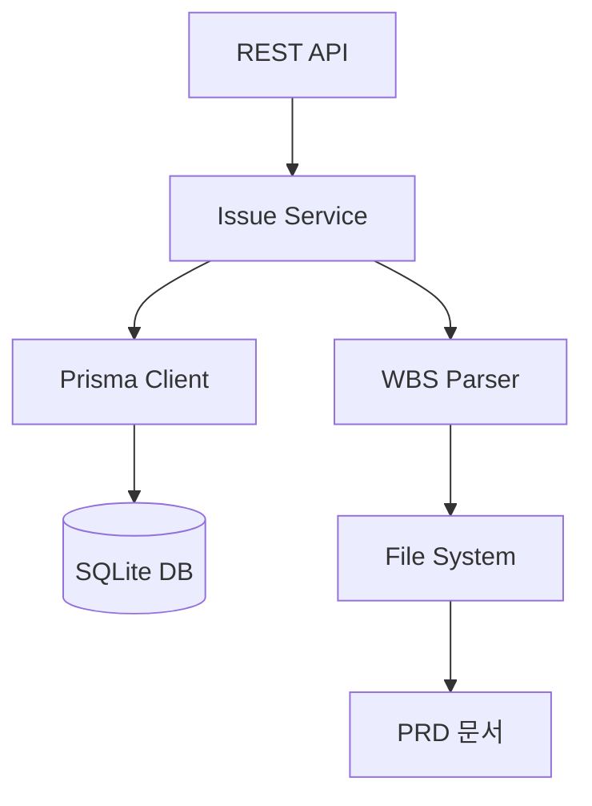

# Epic PRD: 프로젝트 및 이슈 관리 시스템

## 문서 정보

| 항목 | 내용 |
|------|------|
| Epic ID | EPIC-001 |
| Epic 이름 | 프로젝트 및 이슈 관리 시스템 |
| 문서 버전 | 1.0 |
| 작성일 | 2024-12-06 |
| 상태 | Draft |
| 상위 프로젝트 | jjiban (찌반) |
| 원본 PRD | `jjiban-prd.md` |

---

## 1. Epic 개요

### 1.1 Epic 비전

**"4단계 계층 구조로 프로젝트를 체계적으로 관리하는 시스템"**

jjiban의 핵심 기능으로, Epic → Chain → Module → Task 4단계 계층 구조를 관리합니다. WBS(Work Breakdown Structure) 자동 생성, DB 동기화, 이슈 생명주기 관리를 제공합니다.

### 1.2 범위 (Scope)

**포함:**
- 4단계 계층 구조 관리 (Epic/Chain/Module/Task)
- 이슈 타입 (Task, Bug, Technical Task, Spike)
- WBS 자동 생성 및 DB 동기화
- 이슈 CRUD (생성, 읽기, 수정, 삭제)
- 이슈 관계 (상위/하위, 의존성)
- 마일스톤 관리

**제외:**
- 워크플로우 상태 전환 (EPIC-002에서 처리)
- 칸반/Gantt UI (EPIC-004, EPIC-005에서 처리)
- 문서 저장 (EPIC-003에서 처리)

### 1.3 성공 지표

- ✅ 이슈 CRUD 성공률 100%
- ✅ WBS 동기화 정확도 100%
- ✅ 평균 API 응답 시간 < 200ms
- ✅ 계층 구조 무결성 유지

---

## 2. 상세 요구사항

### 2.1 기능 요구사항

#### 2.1.1 4단계 계층 구조

```
📦 Epic (프로젝트)
│   대규모 기능/목표 (1~24개월 단위)
│   예: "MES 시스템 구축"
│
├── 📋 Feature (Chain)
│   │   출시 가능한 기능 단위
│   │   예: "부재료 관리"
│   │
│   ├── 📖 User Story (Module)
│   │   │   사용자 관점 요구사항
│   │   │   예: "입고 관리"
│   │   │
│   │   ├── ✅ Task (실제 작업 단위)
│   │   │   구체적 개발 작업 - LLM 실행의 핵심 단위
│   │   │   예: "입고 공통 프로시저 구현"
│   │   │
│   │   └── 🐛 Bug
│   │       버그 수정
│   │
│   └── 🔧 Technical Task
│       비기능 작업 (리팩토링, 인프라)

└── 🔬 Spike
    기술 조사/PoC (시간 제한)

🎯 Milestone
    시간 기반 릴리즈 마커
```

#### 2.1.2 이슈 타입별 속성

**A. Epic**

```typescript
interface Epic {
  id: string;                  // EPIC-001
  name: string;                // "프로젝트 관리 시스템"
  description: string;
  prdPath: string;             // "./projects/EPIC-001-project-management/epic-prd.md"
  startDate: Date;
  targetDate: Date;
  status: 'active' | 'completed' | 'archived';
  plId: string;                // Project Leader ID
  chains: Chain[];
}
```

**B. Chain (Feature)**

```typescript
interface Chain {
  id: string;                  // CHAIN-001
  epicId: string;
  name: string;                // "WBS 자동 생성"
  description: string;
  pl: string;                  // PL 이름
  prdPath: string;
  basicDesignPath: string;
  startDate: Date;
  targetDate: Date;
  status: string;              // planning, in_progress, completed
  modules: Module[];
}
```

**C. Module (User Story)**

```typescript
interface Module {
  id: string;                  // MODULE-001
  chainId: string;
  name: string;                // "계층 구조 설계"
  userStory: string;           // "As a PM, I want..."
  assignee: string;
  acceptanceCriteria: string[];
  prdPath: string;
  basicDesignPath: string;
  status: string;
  tasks: Task[];
}
```

**D. Task**

```typescript
interface Task {
  id: string;                  // TASK-001
  moduleId: string;
  name: string;                // "DB 스키마 설계"
  description: string;
  type: 'task' | 'bug' | 'technical-task' | 'spike';

  // 워크플로우
  status: string;              // todo, basic_design, detail_design, ...
  statusSymbol: string;        // [ ], [bd], [dd], ...

  // 담당 및 우선순위
  assigneeId: string;
  pl: string;
  priority: 'low' | 'medium' | 'high' | 'critical';

  // 일정
  estimatedHours: number;
  actualHours: number;
  startDate: Date;
  dueDate: Date;

  // 문서 및 코드
  branchName: string;
  documentPath: string;        // Task 폴더 경로

  // 태그 및 LLM 이력
  labels: string[];
  llmExecutions: LLMExecution[];
}
```

#### 2.1.3 이슈 CRUD API

**A. Epic 생성**

```typescript
POST /api/epics
{
  "name": "프로젝트 관리 시스템",
  "description": "4단계 계층 구조 관리",
  "prdPath": "./projects/EPIC-001-project-management/epic-prd.md",
  "targetDate": "2024-12-31",
  "plId": "USER-001"
}
```

**B. Chain 생성**

```typescript
POST /api/chains
{
  "epicId": "EPIC-001",
  "name": "WBS 자동 생성",
  "description": "PRD 문서에서 Chain 추출",
  "pl": "홍길동"
}
```

**C. Task 생성**

```typescript
POST /api/tasks
{
  "moduleId": "MODULE-001",
  "name": "DB 스키마 설계",
  "description": "Prisma Schema 작성",
  "type": "task",
  "assigneeId": "USER-001",
  "priority": "high",
  "estimatedHours": 8
}
```

**D. 계층 구조 조회**

```typescript
GET /api/epics/:id/tree

// 응답
{
  "id": "EPIC-001",
  "name": "프로젝트 관리 시스템",
  "chains": [
    {
      "id": "CHAIN-001",
      "name": "WBS 자동 생성",
      "modules": [
        {
          "id": "MODULE-001",
          "name": "계층 구조 설계",
          "tasks": [
            { "id": "TASK-001", "name": "DB 스키마 설계" }
          ]
        }
      ]
    }
  ]
}
```

#### 2.1.4 WBS 자동 생성 및 DB 동기화

**명령어:**

```bash
# Epic PRD에서 Chain 목록 추출 → DB 생성/업데이트
jjiban wbs sync --epic epic-prd.md

# Chain PRD에서 Module 목록 추출
jjiban wbs sync --chain chain-prd.md

# Module PRD에서 Task 목록 추출
jjiban wbs sync --module module-prd.md

# 전체 프로젝트 동기화
jjiban wbs sync --all --project EPIC-001
```

**문서 파싱 포맷:**

```markdown
# Epic: MES 구축

## Chain 목록
- [ ] CHAIN-001: 부재료 관리 (PL: 홍길동, 2024-01-15 ~ 2024-03-31)
- [ ] CHAIN-002: 조업 관리 (PL: 김철수, 2024-02-01 ~ 2024-06-30)
```

**Merge 전략:**

| 상황 | 동작 | 우선순위 |
|------|------|----------|
| ID가 DB에 없음 | INSERT | 문서 |
| ID가 DB에 있음 | UPDATE | 문서 (이름, 설명) + DB (진행 상태) |
| 문서에 없는 ID | 유지 또는 archived | DB |

#### 2.1.5 마일스톤 관리

```typescript
interface Milestone {
  id: string;                  // MILESTONE-001
  name: string;                // "v1.0 Release"
  dueDate: Date;
  description: string;
  status: 'planned' | 'in_progress' | 'completed';
  tasks: Task[];               // 연결된 Task 목록
}
```

### 2.2 비기능 요구사항

#### 2.2.1 성능
- 이슈 조회 API: < 200ms
- 대량 생성 (100개): < 2초
- 계층 구조 트리 조회: < 500ms

#### 2.2.2 데이터 무결성
- 외래 키 제약 (Cascade 삭제)
- Epic 삭제 시 하위 모두 삭제
- 고아 Task 방지

#### 2.2.3 확장성
- 최대 Epic: 100개
- Epic당 최대 Chain: 50개
- Chain당 최대 Module: 100개
- Module당 최대 Task: 500개

### 2.3 제약사항

- Prisma ORM 필수 (EPIC-C11)
- Task는 Module 없이 독립 생성 불가

---

## 3. 기술적 고려사항

### 3.1 아키텍처



### 3.2 기술 스택

| 레이어 | 기술 | 비고 |
|--------|------|------|
| Backend | Node.js (Express/Fastify) | REST API |
| ORM | Prisma | 타입 안전 |
| Database | SQLite | EPIC-C11 |
| 문서 파싱 | gray-matter + marked | Markdown 파서 |
| 검증 | Zod | 입력 검증 |

### 3.3 의존성

**선행 Epic:**
- EPIC-C11 (데이터 관리) - DB 스키마 필요

**병렬 Epic:**
- EPIC-003 (문서 관리) - PRD 파일 저장 구조

**후행 Epic (이 Epic에 의존):**
- EPIC-002 (워크플로우 엔진) - Task 상태 전환
- EPIC-004 (칸반 보드 UI) - 이슈 조회/표시
- EPIC-005 (Gantt 차트 UI) - 일정 조회/표시

**외부 의존성:**
- @prisma/client ^5.x
- gray-matter ^4.x (Markdown frontmatter 파싱)
- marked ^9.x (Markdown 파싱)

---

## 4. Feature (Chain) 목록

이 Epic은 다음 Feature들로 구성됩니다:

- [ ] FEATURE-001-001: 4단계 계층 구조 설계 및 DB 스키마 (담당: 미정, 예상: 1주)
- [ ] FEATURE-001-002: 이슈 CRUD API (Epic/Chain/Module/Task) (담당: 미정, 예상: 2주)
- [ ] FEATURE-001-003: WBS 자동 생성 및 DB 동기화 (담당: 미정, 예상: 2주)
- [ ] FEATURE-001-004: 마일스톤 관리 (담당: 미정, 예상: 1주)
- [ ] FEATURE-001-005: 이슈 관계 및 의존성 (담당: 미정, 예상: 1주)

---

## 5. 일정 및 마일스톤

| 마일스톤 | 목표일 | 산출물 | 상태 |
|----------|--------|--------|------|
| M1: 설계 완료 | 미정 | DB 스키마, API 명세 | 예정 |
| M2: CRUD API 완료 | 미정 | 이슈 생성/조회 API | 예정 |
| M3: WBS 동기화 완료 | 미정 | 문서 파싱 및 DB Merge | 예정 |
| M4: 테스트 완료 | 미정 | 통합 테스트 리포트 | 예정 |

---

## 6. 리스크 및 이슈

| 리스크 | 영향도 | 발생 가능성 | 완화 전략 | 담당 |
|--------|--------|------------|-----------|------|
| 계층 구조 복잡도 | Medium | Medium | 명확한 규칙 정의 | 미정 |
| WBS 파싱 오류 | High | Medium | 엄격한 문서 포맷 검증 | 미정 |
| 대량 데이터 성능 저하 | Medium | Low | 쿼리 최적화, 인덱싱 | 미정 |

---

## 7. 품질 기준

### 7.1 완료 조건 (Definition of Done)

- [ ] 4단계 계층 구조 DB 스키마 완료
- [ ] 이슈 CRUD API 정상 작동
- [ ] WBS 자동 생성 및 DB 동기화 작동
- [ ] 마일스톤 관리 기능 완료
- [ ] API 응답 시간 < 200ms
- [ ] 단위 테스트 커버리지 90% 이상
- [ ] 통합 테스트 통과

### 7.2 검수 기준

- Epic → Chain → Module → Task 계층 생성 가능
- WBS 명령어로 PRD에서 DB 동기화 성공
- Cascade 삭제 정상 작동
- 고아 Task 발생하지 않음

---

## 부록

### A. 용어 정의

| 용어 | 정의 |
|------|------|
| WBS | Work Breakdown Structure, 작업 분할 구조 |
| Epic | 프로젝트 레벨의 대규모 목표 |
| Chain | Feature의 다른 이름, 출시 단위 |
| Module | User Story의 다른 이름 |
| Task | 실제 작업 단위, LLM 실행 단위 |

### B. 참고 자료

- 원본 PRD: `jjiban-prd.md` (섹션 2.1, 2.3.5)
- Prisma 문서: https://www.prisma.io/docs
- gray-matter: https://github.com/jonschlinkert/gray-matter

### C. 변경 이력

| 버전 | 날짜 | 변경 내용 | 작성자 |
|------|------|-----------|--------|
| 1.0 | 2024-12-06 | 초안 작성 | Claude |
