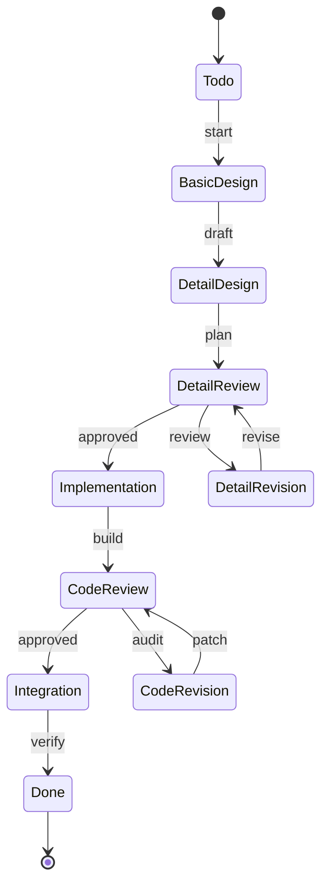

# Epic PRD: 워크플로우 엔진

## 문서 정보

| 항목 | 내용 |
|------|------|
| Epic ID | EPIC-002 |
| Epic 이름 | 워크플로우 엔진 |
| 문서 버전 | 1.0 |
| 작성일 | 2024-12-06 |
| 상태 | Draft |
| 상위 프로젝트 | jjiban (찌반) |
| 원본 PRD | `jjiban-prd.md` |

---

## 1. Epic 개요

### 1.1 Epic 비전

**"Task의 생명주기를 자동으로 관리하는 워크플로우 엔진"**

Task가 Todo → 기본설계 → 상세설계 → 구현 → 테스트 → 완료까지 9단계를 거치며, 각 단계마다 자동으로 문서를 생성하고 품질 게이트를 통과하도록 합니다.

### 1.2 범위 (Scope)

**포함:**
- 9단계 워크플로우 (Todo ~ 완료)
- 상태 전환 명령어 (start, draft, plan, review, build 등)
- 2개의 품질 게이트 (설계 리뷰, 코드 리뷰)
- 자동 문서 생성 트리거
- 워크플로우 이력 관리

**제외:**
- 실제 문서 생성 로직 (EPIC-003)
- LLM 실행 (EPIC-007)

### 1.3 성공 지표

- ✅ 상태 전환 성공률 100%
- ✅ 워크플로우 규칙 위반 0건
- ✅ 문서 자동 생성 정확도 100%

---

## 2. 상세 요구사항

### 2.1 기능 요구사항

#### 2.1.1 9단계 워크플로우

```
[Todo] --start--> [기본설계] --draft--> [상세설계] --plan-->
[상세설계리뷰] --review/approved--> [구현] --build-->
[코드리뷰] --audit/approved--> [통합테스트] --verify--> [완료]
```

#### 2.1.2 상태 전환 명령어

```typescript
// Task 상태 전환 API
POST /api/tasks/:id/transition
{
  "command": "start",      // start, draft, plan, review, revise, build, etc.
  "comment": "설계 시작",
  "metadata": {}
}
```

**명령어 목록:**
- `start`: Todo → 기본설계
- `draft`: 기본설계 → 상세설계
- `plan`: 상세설계 → 상세설계리뷰
- `review`: 설계 변경 요청
- `revise`: 설계 재검토
- `approved`: 승인 (설계리뷰 → 구현 또는 코드리뷰 → 통합테스트)
- `build`: 구현 → 코드리뷰
- `audit`: 코드 변경 요청
- `patch`: 코드 재검토
- `verify`: 통합테스트 → 완료
- `done`: 완료

#### 2.1.3 품질 게이트

**설계 리뷰 게이트:**
```
[상세설계리뷰]
  │
  ├─ approved → [구현]
  └─ review → [상세설계개선] → revise → [상세설계리뷰]
```

**코드 리뷰 게이트:**
```
[코드리뷰]
  │
  ├─ approved → [통합테스트]
  └─ audit → [개선적용] → patch → [코드리뷰]
```

#### 2.1.4 자동 문서 생성 트리거

```typescript
interface WorkflowStep {
  state: string;
  command: string;
  documentTemplate: string;
  nextStates: string[];
}

const workflowSteps: WorkflowStep[] = [
  {
    state: 'todo',
    command: 'start',
    documentTemplate: '00-prd.md',
    nextStates: ['basic_design']
  },
  {
    state: 'basic_design',
    command: 'draft',
    documentTemplate: '01-basic-design.md',
    nextStates: ['detail_design']
  },
  // ...
];
```

### 2.2 비기능 요구사항

#### 2.2.1 성능
- 상태 전환: < 100ms
- 워크플로우 이력 조회: < 200ms

#### 2.2.2 신뢰성
- 트랜잭션 보장 (상태 전환 원자성)
- 롤백 지원

---

## 3. 기술적 고려사항

### 3.1 아키텍처



### 3.2 기술 스택

| 레이어 | 기술 | 비고 |
|--------|------|------|
| Backend | Node.js + TypeScript | 상태 머신 |
| ORM | Prisma | Task 업데이트 |
| 검증 | Zod | 상태 전환 규칙 |

### 3.3 의존성

**선행 Epic:**
- EPIC-001 (프로젝트 관리) - Task 데이터 모델

**병렬 Epic:**
- EPIC-003 (문서 관리) - 문서 템플릿
- EPIC-007 (LLM 터미널) - 명령어 실행

---

## 4. Feature (Chain) 목록

- [ ] FEATURE-002-001: 워크플로우 상태 머신 설계 (담당: 미정, 예상: 1주)
- [ ] FEATURE-002-002: 상태 전환 API 및 검증 (담당: 미정, 예상: 2주)
- [ ] FEATURE-002-003: 품질 게이트 로직 (담당: 미정, 예상: 1.5주)
- [ ] FEATURE-002-004: 자동 문서 생성 트리거 (담당: 미정, 예상: 1주)
- [ ] FEATURE-002-005: 워크플로우 이력 관리 (담당: 미정, 예상: 1주)
- [ ] FEATURE-002-006: 롤백 및 에러 처리 (담당: 미정, 예상: 0.5주)

---

## 5. 일정 및 마일스톤

| 마일스톤 | 목표일 | 산출물 | 상태 |
|----------|--------|--------|------|
| M1: 설계 완료 | 미정 | 상태 다이어그램 | 예정 |
| M2: 상태 전환 구현 | 미정 | 워크플로우 API | 예정 |
| M3: 품질 게이트 구현 | 미정 | 리뷰 사이클 | 예정 |
| M4: 테스트 완료 | 미정 | 통합 테스트 | 예정 |

---

## 부록

### A. 용어 정의

| 용어 | 정의 |
|------|------|
| 워크플로우 | Task의 상태 전환 프로세스 |
| 품질 게이트 | 특정 조건을 만족해야 통과 가능한 검증 단계 |
| 상태 머신 | 유한 상태 자동 기계 (Finite State Machine) |

### B. 참고 자료

- 원본 PRD: `jjiban-prd.md` (섹션 2.2)

### C. 변경 이력

| 버전 | 날짜 | 변경 내용 | 작성자 |
|------|------|-----------|--------|
| 1.0 | 2024-12-06 | 초안 작성 | Claude |
