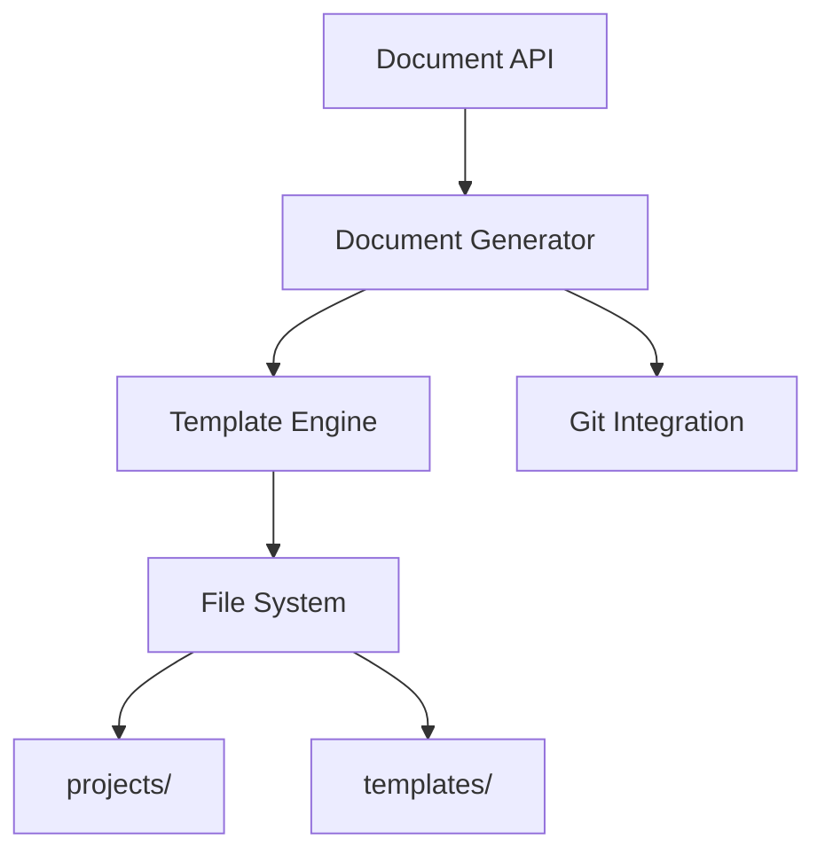

# Epic PRD: 문서 관리 시스템

## 문서 정보

| 항목 | 내용 |
|------|------|
| Epic ID | EPIC-003 |
| Epic 이름 | 문서 관리 시스템 |
| 문서 버전 | 1.0 |
| 작성일 | 2024-12-06 |
| 상태 | Draft |
| 상위 프로젝트 | jjiban (찌반) |
| 원본 PRD | `jjiban-prd.md` |

---

## 1. Epic 개요

### 1.1 Epic 비전

**"하이브리드 방식의 체계적인 프로젝트 문서 관리"**

SQLite DB (메타데이터)와 파일 시스템 (문서 컨텐츠)을 결합한 하이브리드 방식으로 프로젝트 문서를 관리합니다. Git 버전 관리, Markdown 템플릿, 자동 문서 생성을 제공합니다.

### 1.2 범위 (Scope)

**포함:**
- 하이브리드 문서 저장 (DB + File System)
- 계층별 PRD 문서 (Epic/Chain/Module/Task)
- Task 워크플로우 문서 (00~09 번호 체계)
- Markdown 템플릿 시스템
- Git 버전 관리 연동
- Working Copy 방식 (최신 버전 명확화)

**제외:**
- 문서 편집 UI (외부 에디터 사용)
- 문서 검색 (EPIC-C08에서 처리)

### 1.3 성공 지표

- ✅ 문서 생성 성공률 100%
- ✅ 문서 경로 무결성 100%
- ✅ Git 연동 정상 작동

---

## 2. 상세 요구사항

### 2.1 기능 요구사항

#### 2.1.1 폴더 구조

```
projects/
├── {epic-id}-{epic-name}/
│   ├── epic-prd.md
│   │
│   └── {chain-id}-{chain-name}/
│       ├── chain-prd.md
│       ├── chain-basic-design.md
│       │
│       └── {module-id}-{module-name}/
│           ├── module-prd.md
│           ├── module-basic-design.md
│           │
│           └── {task-id}-{task-name}/
│               ├── 00-prd.md
│               ├── 01-basic-design.md
│               ├── 02-detail-design.md               # 최신 버전
│               ├── 03-detail-design-review-{llm}-{n}.md
│               ├── 05-implementation.md              # 최신 버전
│               ├── 05-tdd-test-results.md
│               ├── 05-e2e-test-results.md
│               ├── 06-code-review-{llm}-{n}.md
│               ├── 08-integration-test.md
│               ├── 09-manual.md
│               ├── .archive/                         # 이전 버전 백업
│               │   ├── 02-detail-design-v1-{timestamp}.md
│               │   └── 05-implementation-v1-{timestamp}.md
│               └── logs/
```

#### 2.1.2 문서 네이밍 규칙

**계층별 문서:**

| 레벨 | 폴더 형식 | PRD 문서 | 기본설계 문서 |
|------|----------|----------|---------------|
| Epic | `{epic-id}-{epic-name}/` | `epic-prd.md` | - |
| Chain | `{chain-id}-{chain-name}/` | `chain-prd.md` | `chain-basic-design.md` |
| Module | `{module-id}-{module-name}/` | `module-prd.md` | `module-basic-design.md` |
| Task | `{task-id}-{task-name}/` | `00-prd.md` | `01-basic-design.md` |

**Task 워크플로우 문서:**

| 번호 | 단계 | 파일명 | 버전 관리 |
|------|------|--------|-----------|
| `00` | PRD | `00-prd.md` | 단일 버전 |
| `01` | 기본설계 | `01-basic-design.md` | 단일 버전 |
| `02` | 상세설계 | `02-detail-design.md` | **직접 수정** + Git |
| `03` | 설계 리뷰 | `03-detail-design-review-{llm}-{n}.md` | 순차 누적 |
| `05` | 구현 | `05-implementation.md` | **직접 수정** + Git |
| `05` | TDD 테스트 | `05-tdd-test-results.md` | 단일 버전 |
| `05` | E2E 테스트 | `05-e2e-test-results.md` | 단일 버전 |
| `06` | 코드 리뷰 | `06-code-review-{llm}-{n}.md` | 순차 누적 |
| `08` | 통합 테스트 | `08-integration-test.md` | 단일 버전 |
| `09` | 매뉴얼 | `09-manual.md` | 단일 버전 |

#### 2.1.3 Markdown 템플릿

**templates 폴더:**
```
templates/
├── epic-prd-template.md
├── chain-prd-template.md
├── module-prd-template.md
├── task/
│   ├── 00-prd-template.md
│   ├── 01-basic-design-template.md
│   ├── 02-detail-design-template.md
│   └── ...
```

**템플릿 변수:**
```markdown
# Epic PRD: {{EPIC_NAME}}

## 문서 정보

| 항목 | 내용 |
|------|------|
| Epic ID | {{EPIC_ID}} |
| 작성일 | {{DATE}} |
```

#### 2.1.4 문서 생성 API

```typescript
POST /api/documents/generate
{
  "taskId": "TASK-001",
  "templateType": "02-detail-design",
  "variables": {
    "TASK_NAME": "Google OAuth 구현",
    "DATE": "2024-12-06"
  }
}
```

#### 2.1.5 Git 버전 관리

**.gitignore:**
```gitignore
# SQLite DB (제외)
.jjiban/jjiban.db
.jjiban/server.pid

# 로그 (제외)
*.log

# 문서는 추적
!projects/**/*.md

# 백업은 제외 (선택적)
.archive/
```

**Git 자동 커밋:**
```typescript
// 문서 생성 시 자동 커밋
async function createDocument(taskId, template) {
  const filePath = await generateDocument(taskId, template);
  await git.add(filePath);
  await git.commit(`docs: Generate ${template} for ${taskId}`);
}
```

### 2.2 비기능 요구사항

#### 2.2.1 성능
- 문서 생성: < 500ms
- 문서 조회: < 100ms

#### 2.2.2 신뢰성
- 파일 I/O 에러 처리
- 경로 유효성 검증

---

## 3. 기술적 고려사항

### 3.1 아키텍처



### 3.2 기술 스택

| 레이어 | 기술 | 비고 |
|--------|------|------|
| Backend | Node.js + TypeScript | |
| 템플릿 엔진 | Handlebars | 변수 치환 |
| Git | simple-git | Node.js Git 라이브러리 |
| 파일 I/O | fs-extra | 파일 시스템 유틸리티 |
| Markdown | gray-matter + marked | 파싱 |

### 3.3 의존성

**선행 Epic:**
- EPIC-001 (프로젝트 관리) - Task 폴더 경로

**병렬 Epic:**
- EPIC-002 (워크플로우 엔진) - 문서 생성 트리거

---

## 4. Feature (Chain) 목록

- [ ] FEATURE-003-001: 폴더 구조 및 네이밍 규칙 (담당: 미정, 예상: 1주)
- [ ] FEATURE-003-002: Markdown 템플릿 시스템 (담당: 미정, 예상: 1.5주)
- [ ] FEATURE-003-003: 문서 생성 API (담당: 미정, 예상: 1주)
- [ ] FEATURE-003-004: Git 버전 관리 연동 (담당: 미정, 예상: 0.5주)

---

## 5. 일정 및 마일스톤

| 마일스톤 | 목표일 | 산출물 | 상태 |
|----------|--------|--------|------|
| M1: 설계 완료 | 미정 | 폴더 구조 명세 | 예정 |
| M2: 템플릿 시스템 구현 | 미정 | Handlebars 템플릿 | 예정 |
| M3: 문서 생성 API 구현 | 미정 | Document API | 예정 |
| M4: Git 연동 완료 | 미정 | 자동 커밋 | 예정 |

---

## 부록

### A. 용어 정의

| 용어 | 정의 |
|------|------|
| Working Copy | 항상 최신 버전인 파일 (직접 수정) |
| Archive | 이전 버전 백업 폴더 |
| Template Engine | 변수를 치환하여 문서 생성하는 엔진 |

### B. 참고 자료

- 원본 PRD: `jjiban-prd.md` (섹션 2.3)

### C. 변경 이력

| 버전 | 날짜 | 변경 내용 | 작성자 |
|------|------|-----------|--------|
| 1.0 | 2024-12-06 | 초안 작성 | Claude |
