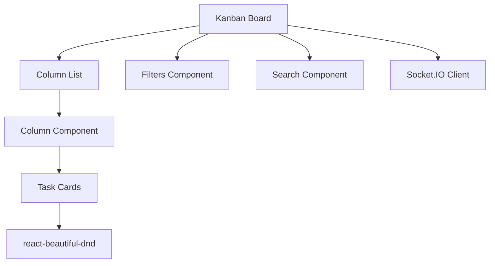

# Epic PRD: 칸반 보드 UI

## 문서 정보

| 항목 | 내용 |
|------|------|
| Epic ID | EPIC-004 |
| Epic 이름 | 칸반 보드 UI |
| 문서 버전 | 1.0 |
| 작성일 | 2024-12-06 |
| 상태 | Draft |
| 상위 프로젝트 | jjiban (찌반) |
| 원본 PRD | `jjiban-prd.md` |

---

## 1. Epic 개요

### 1.1 Epic 비전

**"드래그 앤 드롭으로 Task를 관리하는 직관적인 칸반 보드"**

jjiban의 메인 작업 화면으로, Task를 상태별 컬럼으로 구분하여 표시하고, 드래그&드롭으로 상태를 변경할 수 있습니다. 필터링, 검색, 컨텍스트 메뉴를 통해 효율적인 작업 관리를 제공합니다.

### 1.2 범위 (Scope)

**포함:**
- 상태별 컬럼 레이아웃 (Todo, 기본설계, 상세설계, ...)
- 드래그 앤 드롭 (react-beautiful-dnd)
- Task 카드 (제목, 담당자, 우선순위, 라벨)
- 필터링 (담당자, 타입, 라벨)
- 검색 (제목, 설명, ID)
- 컨텍스트 메뉴 (LLM 명령어, 문서 열기, 이동, 편집)
- 실시간 업데이트 (WebSocket)

**제외:**
- Task 상세 편집 (EPIC-006)
- 실제 상태 전환 로직 (EPIC-002)

### 1.3 성공 지표

- ✅ 드래그 앤 드롭 성공률 > 99%
- ✅ 렌더링 성능 60fps 유지
- ✅ 필터링 응답 시간 < 100ms

---

## 2. 상세 요구사항

### 2.1 기능 요구사항

#### 2.1.1 칸반 보드 레이아웃

```
┌────────────────────────────────────────────────────────────────────────────┐
│ 🏠 jjiban > Project Alpha > 칸반 보드                                      │
├────────────────────────────────────────────────────────────────────────────┤
│ [필터: 담당자 ▼] [타입 ▼] [라벨 ▼]           🔍 검색...      [+ 새 이슈]  │
├────────────────────────────────────────────────────────────────────────────┤
│ ┌──────────┐ ┌──────────┐ ┌──────────┐ ┌──────────┐ ┌──────────┐          │
│ │ 상세설계 │ │ 설계리뷰 │ │ 구현     │ │ 코드리뷰 │ │ 완료     │          │
│ │    3     │ │    2     │ │    4     │ │    2     │ │   10     │          │
│ ├──────────┤ ├──────────┤ ├──────────┤ ├──────────┤ ├──────────┤          │
│ │┌────────┐│ │┌────────┐│ │┌────────┐│ │┌────────┐│ │┌────────┐│          │
│ ││TASK-101││ ││TASK-098││ ││TASK-089││ ││TASK-087││ ││TASK-075││          │
│ ││────────││ ││────────││ ││────────││ ││────────││ ││────────││          │
│ ││OAuth   ││ ││결제 API││ ││대시보드││ ││검색    ││ ││인증    ││          │
│ ││구현    ││ ││연동    ││ ││차트    ││ ││기능    ││ ││완료    ││          │
│ ││        ││ ││        ││ ││        ││ ││        ││ ││        ││          │
│ ││✅ Task ││ ││✅ Task ││ ││✅ Task ││ ││✅ Task ││ ││✅ Task ││          │
│ ││👤 홍길동││ ││👤 김철수││ ││👤 홍길동││ ││👤 박민수││ ││👤 이영희││          │
│ │└────────┘│ │└────────┘│ │└────────┘│ │└────────┘│ │└────────┘│          │
│ └──────────┘ └──────────┘ └──────────┘ └──────────┘ └──────────┘          │
└────────────────────────────────────────────────────────────────────────────┘
```

#### 2.1.2 Task 카드 컴포넌트

```tsx
<TaskCard
  task={{
    id: 'TASK-101',
    title: 'Google OAuth 구현',
    type: 'task',
    assignee: { name: '홍길동', avatar: '...' },
    priority: 'high',
    labels: ['backend', 'security']
  }}
  onDragStart={handleDragStart}
  onContextMenu={handleContextMenu}
  onClick={handleClick}
/>
```

#### 2.1.3 드래그 앤 드롭

```tsx
import { DragDropContext, Droppable, Draggable } from 'react-beautiful-dnd';

<DragDropContext onDragEnd={handleDragEnd}>
  {columns.map(column => (
    <Droppable droppableId={column.id} key={column.id}>
      {(provided) => (
        <Column ref={provided.innerRef} {...provided.droppableProps}>
          {column.tasks.map((task, index) => (
            <Draggable draggableId={task.id} index={index} key={task.id}>
              {(provided) => (
                <TaskCard
                  ref={provided.innerRef}
                  {...provided.draggableProps}
                  {...provided.dragHandleProps}
                  task={task}
                />
              )}
            </Draggable>
          ))}
          {provided.placeholder}
        </Column>
      )}
    </Droppable>
  ))}
</DragDropContext>
```

#### 2.1.4 컨텍스트 메뉴

```
┌────────────────────────────────┐
│ TASK-101: OAuth 구현           │
├────────────────────────────────┤
│ 🤖 LLM 명령어                  │
│ ├── 설계 문서 초안 생성        │
│ ├── 요구사항 분석              │
│ ├── 기술 스택 제안             │
│ └── 보안 검토 요청             │
├────────────────────────────────┤
│ 📄 문서                        │
│ ├── design.md 열기             │
│ └── 새 문서 생성               │
├────────────────────────────────┤
│ 📋 이동                        │
│ ├── → 설계리뷰                 │
│ └── → 상세설계 (되돌리기)      │
├────────────────────────────────┤
│ ✏️ 편집                        │
│ 🗑️ 삭제                        │
└────────────────────────────────┘
```

#### 2.1.5 필터링 및 검색

```tsx
<KanbanFilters
  filters={{
    assignee: ['홍길동', '김철수'],
    type: ['task', 'bug'],
    labels: ['backend', 'frontend'],
    priority: ['high', 'critical']
  }}
  onFilterChange={handleFilterChange}
/>

<SearchBar
  placeholder="제목, 설명, ID로 검색..."
  onSearch={handleSearch}
/>
```

### 2.2 비기능 요구사항

#### 2.2.1 성능
- 초기 렌더링: < 1초 (100개 Task)
- 드래그 앤 드롭: 60fps 유지
- 필터링: < 100ms

#### 2.2.2 사용성
- 키보드 단축키 (j/k: 상하 이동, Enter: 열기)
- 반응형 레이아웃 (최소 1280px)
- 빈 컬럼 표시

---

## 3. 기술적 고려사항

### 3.1 아키텍처



### 3.2 기술 스택

| 레이어 | 기술 | 비고 |
|--------|------|------|
| Frontend | React + TypeScript | |
| Drag&Drop | react-beautiful-dnd | |
| 상태 관리 | Zustand | 보드 상태 |
| 스타일링 | Tailwind CSS | |
| 실시간 | Socket.IO | Task 업데이트 |

### 3.3 의존성

**선행 Epic:**
- EPIC-C01 (Portal) - 레이아웃
- EPIC-C04 (컴포넌트) - TaskCard, Filter
- EPIC-001 (프로젝트 관리) - Task 데이터

---

## 4. Feature (Chain) 목록

- [ ] FEATURE-004-001: 칸반 보드 레이아웃 및 컬럼 (담당: 미정, 예상: 1주)
- [ ] FEATURE-004-002: Task 카드 컴포넌트 (담당: 미정, 예상: 1주)
- [ ] FEATURE-004-003: 드래그 앤 드롭 (담당: 미정, 예상: 1.5주)
- [ ] FEATURE-004-004: 필터링 및 검색 (담당: 미정, 예상: 1주)
- [ ] FEATURE-004-005: 컨텍스트 메뉴 및 실시간 업데이트 (담당: 미정, 예상: 1주)

---

## 부록

### A. 용어 정의

| 용어 | 정의 |
|------|------|
| Kanban | 작업을 시각화하여 관리하는 방법론 |
| Drag and Drop | 마우스로 객체를 끌어서 이동하는 인터랙션 |
| Context Menu | 우클릭 시 나타나는 메뉴 |

### B. 참고 자료

- 원본 PRD: `jjiban-prd.md` (섹션 3.1)
- react-beautiful-dnd: https://github.com/atlassian/react-beautiful-dnd

### C. 변경 이력

| 버전 | 날짜 | 변경 내용 | 작성자 |
|------|------|-----------|--------|
| 1.0 | 2024-12-06 | 초안 작성 | Claude |
