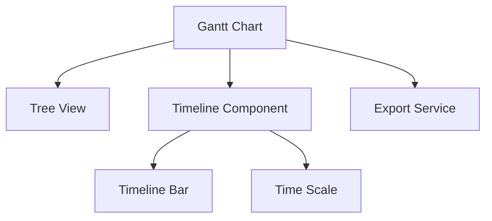

# Epic PRD: Gantt 차트 UI

## 문서 정보

| 항목 | 내용 |
|------|------|
| Epic ID | EPIC-005 |
| Epic 이름 | Gantt 차트 UI |
| 문서 버전 | 1.0 |
| 작성일 | 2024-12-06 |
| 상태 | Draft |
| 상위 프로젝트 | jjiban (찌반) |
| 원본 PRD | `jjiban-prd.md` |

---

## 1. Epic 개요

### 1.1 Epic 비전

**"프로젝트 일정을 시각화하는 타임라인 차트"**

Epic → Chain → Module → Task 계층 구조를 타임라인으로 표시하고, 드래그로 일정을 조정할 수 있습니다. 진행률, 의존성, 마일스톤을 시각적으로 표현합니다.

### 1.2 범위 (Scope)

**포함:**
- 계층 구조 트리 뷰 (펼침/접힘)
- 타임라인 바 (시작일, 종료일, 진행률)
- 드래그 일정 조정
- 마일스톤 표시
- 필터링 (타입, 담당자, 날짜 범위)
- 내보내기 (PNG, PDF, CSV)

**제외:**
- 의존성 화살표 (v1.1에서 고려)
- 리소스 관리 (v2.0에서 고려)

### 1.3 성공 지표

- ✅ 렌더링 성능: 100개 Task < 2초
- ✅ 드래그 일정 조정 성공률 > 99%
- ✅ 내보내기 정상 작동

---

## 2. 상세 요구사항

### 2.1 기능 요구사항

#### 2.1.1 Gantt 차트 레이아웃

```
┌────────────────────────────────────────────────────────────────────────────────────┐
│ 🏠 jjiban > Project Alpha > Gantt 차트                                             │
├────────────────────────────────────────────────────────────────────────────────────┤
│ [+ 만들기 ▼] [프로젝트 포함 ▼] [기준선 ▼] [필터 ▼]    🔍 검색...    [⬚][🔍+][🔍-] │
├──────────────────────────────────────────┬─────────────────────────────────────────┤
│                                          │          11월 2025        12월 2025     │
│ ID   타입          제목        상태      │ 47  48  49  50  51  01  02  03  04  05  │
├──────────────────────────────────────────┼─────────────────────────────────────────┤
│ 16  📦 EPIC       ▼ New website  지정됨  │ ████████████████████████████████████    │
│ 22   📋 FEATURE    Feature carousel      │     ████████                            │
│ 18   📖 USER STORY  Product tour  New    │         ████████████                    │
│ 20    ✅ TASK       Wireframes   진행중  │                         ████████        │
│ 32  🎯 MILESTONE   Release v1.0  New     │                         ◆               │
└──────────────────────────────────────────┴─────────────────────────────────────────┘
```

#### 2.1.2 계층 구조 트리

```tsx
<GanttTree
  data={[
    {
      id: 'EPIC-001',
      type: 'Epic',
      title: 'Project Management',
      status: 'active',
      startDate: '2024-11-01',
      endDate: '2025-01-31',
      progress: 65,
      children: [
        {
          id: 'CHAIN-001',
          type: 'Chain',
          title: 'WBS System',
          ...
        }
      ]
    }
  ]}
  expandedKeys={expandedKeys}
  onToggleExpand={handleToggle}
/>
```

#### 2.1.3 타임라인 바 컴포넌트

```tsx
<TimelineBar
  task={{
    id: 'TASK-001',
    startDate: '2024-12-01',
    endDate: '2024-12-15',
    progress: 40
  }}
  scale="week"  // day, week, month
  onDragEnd={handleDragEnd}
/>
```

**진행률 표시:**
```
████████░░░░░░░░  40%
```

#### 2.1.4 드래그 일정 조정

```tsx
// 시작일/종료일 드래그
<DraggableTimelineBar
  onDragStart={handleDragStart}
  onDrag={handleDrag}
  onDragEnd={(newStartDate, newEndDate) => {
    updateTaskDates(taskId, newStartDate, newEndDate);
  }}
/>
```

#### 2.1.5 내보내기

```typescript
// PNG 내보내기
exportToPNG(ganttElement);

// PDF 내보내기
exportToPDF(ganttData);

// CSV 내보내기
exportToCSV(ganttData);
```

### 2.2 비기능 요구사항

#### 2.2.1 성능
- 100개 Task 렌더링: < 2초
- 드래그 성능: 60fps
- 확대/축소: < 500ms

#### 2.2.2 사용성
- 마우스 휠 확대/축소
- 키보드 네비게이션 (방향키)

---

## 3. 기술적 고려사항

### 3.1 아키텍처



### 3.2 기술 스택

| 레이어 | 기술 | 비고 |
|--------|------|------|
| Gantt 라이브러리 | DHTMLX Gantt / Frappe Gantt | 또는 D3.js 커스텀 |
| Frontend | React + TypeScript | |
| 스타일링 | Tailwind CSS | |
| 내보내기 | html2canvas (PNG), jsPDF (PDF) | |

### 3.3 의존성

**선행 Epic:**
- EPIC-C01 (Portal) - 레이아웃
- EPIC-001 (프로젝트 관리) - Task 일정 데이터

---

## 4. Feature (Chain) 목록

- [ ] FEATURE-005-001: 계층 구조 트리 뷰 (담당: 미정, 예상: 1.5주)
- [ ] FEATURE-005-002: 타임라인 바 렌더링 (담당: 미정, 예상: 1.5주)
- [ ] FEATURE-005-003: 드래그 일정 조정 (담당: 미정, 예상: 1주)
- [ ] FEATURE-005-004: 내보내기 (PNG/PDF/CSV) (담당: 미정, 예상: 0.5주)

---

## 부록

### A. 용어 정의

| 용어 | 정의 |
|------|------|
| Gantt Chart | 프로젝트 일정을 시각화한 바 차트 |
| Timeline | 시간 축 |
| Milestone | 프로젝트 주요 이정표 |

### B. 참고 자료

- 원본 PRD: `jjiban-prd.md` (섹션 3.2)
- DHTMLX Gantt: https://dhtmlx.com/docs/products/dhtmlxGantt/
- Frappe Gantt: https://frappe.io/gantt

### C. 변경 이력

| 버전 | 날짜 | 변경 내용 | 작성자 |
|------|------|-----------|--------|
| 1.0 | 2024-12-06 | 초안 작성 | Claude |
