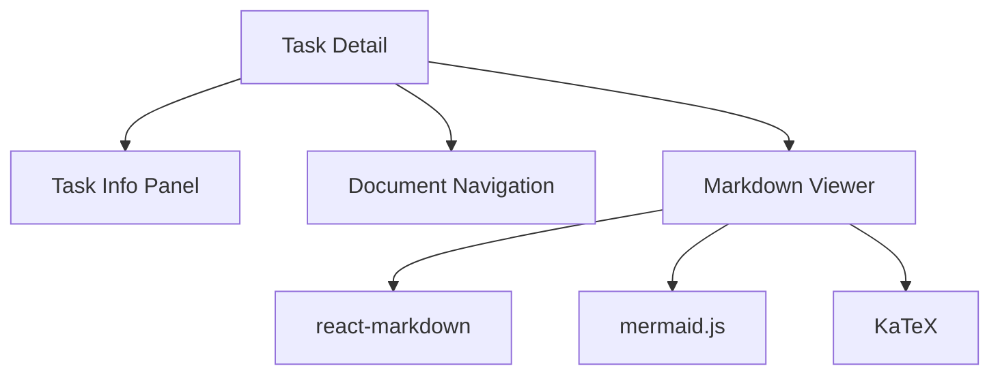

# Epic PRD: Task 상세 및 문서 뷰어

## 문서 정보

| 항목 | 내용 |
|------|------|
| Epic ID | EPIC-006 |
| Epic 이름 | Task 상세 및 문서 뷰어 |
| 문서 버전 | 1.0 |
| 작성일 | 2024-12-06 |
| 상태 | Draft |
| 상위 프로젝트 | jjiban (찌반) |
| 원본 PRD | `jjiban-prd.md` |

---

## 1. Epic 개요

### 1.1 Epic 비전

**"Task의 모든 정보를 한 화면에서 관리하는 통합 뷰"**

Task 상세 정보, 문서 목록, Markdown 뷰어, LLM 터미널을 하나의 화면에 통합하여 효율적인 작업 환경을 제공합니다.

### 1.2 범위 (Scope)

**포함:**
- Task 상세 정보 (제목, 설명, 담당자, 일정, 상태)
- 문서 목록 (00-prd.md ~ 09-manual.md)
- Markdown 뷰어 (GFM, 코드 하이라이팅, Mermaid)
- 문서 네비게이션 (트리 뷰, 최근 파일)
- 파일 diff 표시

**제외:**
- 문서 편집 (외부 에디터 사용)
- LLM 터미널 (EPIC-007)

### 1.3 성공 지표

- ✅ Markdown 렌더링: < 500ms
- ✅ 문서 전환: < 200ms
- ✅ Mermaid 다이어그램 정상 렌더링

---

## 2. 상세 요구사항

### 2.1 기능 요구사항

#### 2.1.1 Task 상세 화면 레이아웃

```
┌────────────────────────────────────────────────────────────────────┐
│ TASK-001: Google OAuth 인증 구현                    [상세설계] ▼   │
├────────────────────────────────────────────────────────────────────┤
│  ┌──────────────────────┐  ┌────────────────────────────────────┐ │
│  │ [기본 정보]          │  │ [문서]                        [+]  │ │
│  │                      │  │  📄 00-prd.md                      │ │
│  │ 담당자: 홍길동       │  │  📄 01-basic-design.md             │ │
│  │ 상태: 상세설계       │  │  📄 02-detail-design.md            │ │
│  │ 우선순위: High       │  │                                    │ │
│  │ 브랜치: feature/auth │  │  [문서 미리보기]                   │ │
│  │                      │  │  ┌──────────────────────────────┐  │ │
│  │ [설명]               │  │  │ # 상세설계: Google OAuth    │  │ │
│  │ Google OAuth 2.0을   │  │  │ ## 1. 개요                   │  │ │
│  │ 사용한 소셜 로그인   │  │  │ ```mermaid                   │  │ │
│  │ 기능을 구현한다.     │  │  │ sequenceDiagram              │  │ │
│  │                      │  │  │   User->>+App: Login         │  │ │
│  └──────────────────────┘  └──────────────────────────────────┘ │ │
└────────────────────────────────────────────────────────────────────┘
```

#### 2.1.2 Markdown 뷰어

```tsx
<MarkdownViewer
  content={markdownContent}
  options={{
    gfm: true,              // GitHub Flavored Markdown
    breaks: true,
    highlight: true,         // 코드 하이라이팅
    mermaid: true,           // Mermaid 다이어그램
    math: true               // KaTeX 수식
  }}
/>
```

**지원 기능:**
- **GFM**: 체크박스, 테이블, 취소선
- **코드 하이라이팅**: 다중 언어 (JS, TS, Python, Java 등)
- **Mermaid 다이어그램**: 시퀀스, 플로우, 간트
- **수식 렌더링**: KaTeX
- **목차**: 자동 생성 (H2, H3)
- **복사 버튼**: 코드 블록

#### 2.1.3 문서 네비게이션

```tsx
<DocumentNav
  documents={[
    { name: '00-prd.md', path: '...', size: '2.3 KB', modifiedAt: '2024-12-05' },
    { name: '01-basic-design.md', path: '...', size: '5.1 KB', modifiedAt: '2024-12-06' },
    ...
  ]}
  currentDoc="02-detail-design.md"
  onSelect={handleDocSelect}
/>
```

**기능:**
- 트리 뷰 (폴더/파일)
- 최근 파일 (5개)
- 검색 (파일명)
- 정렬 (이름, 수정일, 크기)

#### 2.1.4 파일 Diff 표시

```tsx
<FileDiff
  original={originalContent}
  modified={modifiedContent}
  language="markdown"
  theme="github"
/>
```

**사용 사례:**
- `02-detail-design.md` 수정 전후 비교
- `05-implementation.md` 수정 전후 비교

### 2.2 비기능 요구사항

#### 2.2.1 성능
- Markdown 렌더링: < 500ms
- 문서 전환: < 200ms
- Mermaid 렌더링: < 1초

#### 2.2.2 사용성
- 키보드 단축키 (Ctrl+F: 검색, Ctrl+P: 파일 선택)
- 다크 모드 지원

---

## 3. 기술적 고려사항

### 3.1 아키텍처



### 3.2 기술 스택

| 레이어 | 기술 | 비고 |
|--------|------|------|
| Markdown | react-markdown + remark-gfm | |
| 코드 하이라이팅 | react-syntax-highlighter | |
| Mermaid | mermaid.js | |
| 수식 | remark-math + rehype-katex | |
| Diff | react-diff-viewer | |

### 3.3 의존성

**선행 Epic:**
- EPIC-C01 (Portal) - 레이아웃
- EPIC-C04 (컴포넌트) - 패널, 버튼
- EPIC-001 (프로젝트 관리) - Task 데이터
- EPIC-003 (문서 관리) - 문서 경로

---

## 4. Feature (Chain) 목록

- [ ] FEATURE-006-001: Task 상세 정보 패널 (담당: 미정, 예상: 1주)
- [ ] FEATURE-006-002: 문서 목록 및 네비게이션 (담당: 미정, 예상: 1주)
- [ ] FEATURE-006-003: Markdown 뷰어 (GFM, 하이라이팅) (담당: 미정, 예상: 1.5주)
- [ ] FEATURE-006-004: Mermaid 및 수식 렌더링 (담당: 미정, 예상: 1주)

---

## 부록

### A. 용어 정의

| 용어 | 정의 |
|------|------|
| GFM | GitHub Flavored Markdown |
| Mermaid | 텍스트 기반 다이어그램 도구 |
| KaTeX | 수식 렌더링 라이브러리 |
| Diff | 파일 변경 사항 비교 |

### B. 참고 자료

- 원본 PRD: `jjiban-prd.md` (섹션 3.3)
- react-markdown: https://github.com/remarkjs/react-markdown
- Mermaid: https://mermaid.js.org/

### C. 변경 이력

| 버전 | 날짜 | 변경 내용 | 작성자 |
|------|------|-----------|--------|
| 1.0 | 2024-12-06 | 초안 작성 | Claude |
