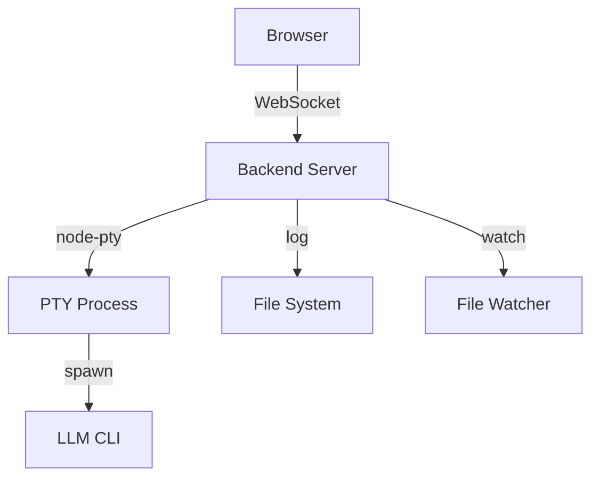

# Epic PRD: LLM 통합 웹 터미널

## 문서 정보

| 항목 | 내용 |
|------|------|
| Epic ID | EPIC-007 |
| Epic 이름 | LLM 통합 웹 터미널 |
| 문서 버전 | 1.0 |
| 작성일 | 2024-12-06 |
| 상태 | Draft |
| 상위 프로젝트 | jjiban (찌반) |
| 원본 PRD | `jjiban-prd.md` |

---

## 1. Epic 개요

### 1.1 Epic 비전

**"웹 브라우저에서 LLM CLI를 실행하는 통합 터미널"**

칸반 카드의 컨텍스트 메뉴에서 LLM 명령어를 선택하면 웹 터미널이 열리고, Claude Code, Gemini CLI 등 LLM CLI가 실행됩니다. 실시간 출력, 대화형 입력, 실행 결과 파일 표시를 지원합니다.

### 1.2 범위 (Scope)

**포함:**
- 웹 터미널 UI (xterm.js)
- LLM CLI 실행 (node-pty)
- 실시간 출력 스트리밍 (WebSocket)
- 대화형 입력 지원 (Y/N 확인, 추가 질문)
- 세션 관리 (Task별 독립 세션)
- 실행 이력 및 로그 저장
- 실행 결과 파일 표시

**제외:**
- LLM CLI 설치 (사용자가 직접 설치)
- 프롬프트 템플릿 작성 (별도 설정)

### 1.3 성공 지표

- ✅ 터미널 응답 시간 < 100ms
- ✅ LLM CLI 실행 성공률 > 95%
- ✅ 세션 안정성 (비정상 종료 < 1%)

---

## 2. 상세 요구사항

### 2.1 기능 요구사항

#### 2.1.1 웹 터미널 UI

```
┌────────────────────────────────────────────────────────────┐
│ [LLM 터미널] TASK-001: Google OAuth 구현    [전체화면] [X]  │
├────────────────────────────────────────────────────────────┤
│                                                            │
│ $ claude                                                   │
│ > 설계 문서를 분석하고 있습니다...                          │
│ > 02-detail-design.md 파일을 읽었습니다.                  │
│ >                                                          │
│ > ## 분석 결과                                             │
│ > 1. OAuth 플로우가 잘 정의되어 있습니다.                 │
│ > 2. 토큰 갱신 로직 추가를 권장합니다.                    │
│ >                                                          │
│ > Would you like me to implement the token refresh logic? (y/n) │
│ > _                                                        │
│                                                            │
│ [입력창]                                          [전송]   │
└────────────────────────────────────────────────────────────┘
```

**xterm.js 설정:**
```typescript
const terminal = new Terminal({
  cursorBlink: true,
  fontSize: 14,
  fontFamily: 'Monaco, Consolas, monospace',
  theme: {
    background: '#1e1e1e',
    foreground: '#d4d4d4'
  },
  rows: 30,
  cols: 120
});
```

#### 2.1.2 LLM CLI 실행

**지원 LLM CLI:**
- Claude Code: `claude`
- Gemini CLI: `gemini`
- OpenAI Codex: `codex`

**실행 예시:**
```typescript
// 백엔드에서 node-pty로 LLM CLI 실행
import * as pty from 'node-pty';

const ptyProcess = pty.spawn('claude', [], {
  name: 'xterm-color',
  cols: 120,
  rows: 30,
  cwd: taskDocumentPath,
  env: process.env
});

// 출력 스트리밍
ptyProcess.on('data', (data) => {
  socket.emit('terminal:output', data);
});

// 입력 전달
socket.on('terminal:input', (data) => {
  ptyProcess.write(data);
});
```

#### 2.1.3 실시간 출력 스트리밍 (WebSocket)

```
[Browser]          [Backend]           [LLM CLI]
    │                  │                    │
    ├──socket.emit───→ │                    │
    │  'terminal:start'│──pty.spawn()───→   │
    │                  │                    │
    │                  │ ←──stdout/stderr── │
    │ ←─socket.emit─── │                    │
    │ 'terminal:output'│                    │
    │                  │                    │
    ├──socket.emit───→ │                    │
    │  'terminal:input'│──pty.write()───→   │
```

#### 2.1.4 세션 관리

```typescript
interface TerminalSession {
  id: string;                 // SESSION-001
  taskId: string;             // TASK-001
  userId: string;
  command: string;            // 'claude'
  status: 'running' | 'completed' | 'error';
  startedAt: Date;
  endedAt?: Date;
  logPath: string;            // logs/TASK-001-session-1.log
}
```

**세션 목록 조회:**
```typescript
GET /api/terminal/sessions?taskId=TASK-001

// 응답
[
  {
    "id": "SESSION-001",
    "taskId": "TASK-001",
    "command": "claude",
    "status": "completed",
    "startedAt": "2024-12-06T10:00:00Z",
    "endedAt": "2024-12-06T10:15:00Z",
    "logPath": "logs/TASK-001-session-1.log"
  }
]
```

#### 2.1.5 실행 결과 파일 표시

```
┌────────────────────────────────────────┐
│ 실행 결과 파일                         │
├────────────────────────────────────────┤
│ ✅ 02-detail-design.md (수정됨)        │
│ ✅ 05-implementation.md (생성됨)       │
│ ✅ 05-tdd-test-results.md (생성됨)     │
├────────────────────────────────────────┤
│ [파일 diff 보기]                       │
└────────────────────────────────────────┘
```

**파일 변경 감지:**
```typescript
// 파일 변경 모니터링
import chokidar from 'chokidar';

const watcher = chokidar.watch(taskDocumentPath, {
  ignored: /^\./,
  persistent: true
});

watcher
  .on('add', path => socket.emit('file:created', path))
  .on('change', path => socket.emit('file:modified', path));
```

### 2.2 비기능 요구사항

#### 2.2.1 성능
- 터미널 응답 시간: < 100ms
- 대용량 출력 처리 (버퍼링)

#### 2.2.2 신뢰성
- 세션 타임아웃: 1시간
- 최대 동시 세션: 10개
- 비정상 종료 시 자동 정리

---

## 3. 기술적 고려사항

### 3.1 아키텍처



### 3.2 기술 스택

| 레이어 | 기술 | 비고 |
|--------|------|------|
| Frontend | xterm.js | 웹 터미널 |
| Backend | Node.js + Socket.IO | 실시간 통신 |
| PTY | node-pty | LLM CLI 실행 |
| 파일 감시 | chokidar | 파일 변경 감지 |
| 로그 | Winston | 세션 로그 |

### 3.3 의존성

**선행 Epic:**
- EPIC-C05 (시스템 설정) - LLM 설정 파일
- EPIC-003 (문서 관리) - Task 문서 경로

**병렬 Epic:**
- EPIC-006 (Task 상세) - 터미널 UI 통합

---

## 4. Feature (Chain) 목록

- [ ] FEATURE-007-001: 웹 터미널 UI (xterm.js) (담당: 미정, 예상: 1.5주)
- [ ] FEATURE-007-002: LLM CLI 실행 (node-pty) (담당: 미정, 예상: 2주)
- [ ] FEATURE-007-003: 실시간 출력 스트리밍 (WebSocket) (담당: 미정, 예상: 1주)
- [ ] FEATURE-007-004: 세션 관리 및 로그 저장 (담당: 미정, 예상: 1주)
- [ ] FEATURE-007-005: 실행 결과 파일 표시 (담당: 미정, 예상: 0.5주)

---

## 부록

### A. 용어 정의

| 용어 | 정의 |
|------|------|
| PTY | Pseudo-Terminal, 가상 터미널 |
| xterm.js | 웹 기반 터미널 에뮬레이터 |
| WebSocket | 양방향 실시간 통신 프로토콜 |

### B. 참고 자료

- 원본 PRD: `jjiban-prd.md` (섹션 3.4, 4.4)
- xterm.js: https://xtermjs.org/
- node-pty: https://github.com/microsoft/node-pty

### C. 변경 이력

| 버전 | 날짜 | 변경 내용 | 작성자 |
|------|------|-----------|--------|
| 1.0 | 2024-12-06 | 초안 작성 | Claude |
