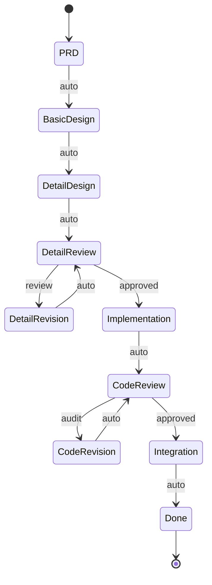

# Epic PRD: 워크플로우 자동화 (Auto-Pilot)

## 문서 정보

| 항목 | 내용 |
|------|------|
| Epic ID | EPIC-008 |
| Epic 이름 | 워크플로우 자동화 (Auto-Pilot) |
| 문서 버전 | 1.0 |
| 작성일 | 2024-12-06 |
| 상태 | Draft |
| 상위 프로젝트 | jjiban (찌반) |
| 원본 PRD | `jjiban-prd.md` |

---

## 1. Epic 개요

### 1.1 Epic 비전

**"Task의 전체 워크플로우를 자동으로 실행하는 Auto-Pilot 시스템"**

사용자가 "Auto-Workflow"를 시작하면, 시스템이 [상세설계 → 설계리뷰 → 구현 → 코드리뷰 → 완료]의 전 과정을 자동으로 실행합니다. 완전 자동 모드와 반자동 모드를 지원합니다.

### 1.2 범위 (Scope)

**포함:**
- 완전 자동 모드 (Fully Automated)
- 반자동 모드 (Human-in-the-Loop)
- 파이프라인 실행 엔진
- 에러 처리 및 재시도
- 실행 이력 및 결과 리포트

**제외:**
- LLM 프롬프트 최적화 (v1.1에서 개선)
- 병렬 Task 실행 (v2.0에서 고려)

### 1.3 성공 지표

- ✅ 워크플로우 자동 완료율 > 80%
- ✅ 품질 게이트 통과율 > 70%
- ✅ 평균 실행 시간 < 2시간 (Task 복잡도에 따라 다름)

---

## 2. 상세 요구사항

### 2.1 기능 요구사항

#### 2.1.1 완전 자동 모드 (Fully Automated)

**실행 흐름:**
```
[PRD 작성] (수동)
  ↓ 자동
[기본설계 생성]
  ↓ 자동
[상세설계 생성]
  ↓ 자동
[설계 리뷰]
  ├─ approved → [구현]
  └─ review → [설계 개선] → [재리뷰] (자동 반복)
       ↓ 자동 (승인될 때까지)
[구현 (TDD + E2E 테스트)]
  ↓ 자동
[코드 리뷰]
  ├─ approved → [통합 테스트]
  └─ audit → [코드 개선] → [재리뷰] (자동 반복)
       ↓ 자동 (승인될 때까지)
[통합 테스트]
  ↓ 자동
[완료 (매뉴얼 생성)]
```

**실행 예시:**
```typescript
POST /api/workflows/auto
{
  "taskId": "TASK-001",
  "mode": "fully_automated",
  "options": {
    "maxRetries": 3,          // 리뷰 재시도 최대 횟수
    "timeout": 7200,          // 2시간 타임아웃
    "llmProvider": "claude"   // LLM 제공자
  }
}
```

#### 2.1.2 반자동 모드 (Human-in-the-Loop)

**실행 흐름:**
```
[PRD 작성] (수동)
  ↓ 자동
[기본설계 생성]
  ⏸️ 승인 대기 (사용자 검토)
  ↓ 승인
[상세설계 생성]
  ⏸️ 승인 대기
  ↓ 승인
[설계 리뷰]
  ...
```

**승인 대기 화면:**
```
┌────────────────────────────────────────────┐
│ 🛑 승인 대기: 기본설계 완료                │
├────────────────────────────────────────────┤
│ 01-basic-design.md 문서가 생성되었습니다.  │
│                                            │
│ [문서 미리보기]                            │
│ ┌──────────────────────────────────────┐  │
│ │ # 기본설계: Google OAuth             │  │
│ │ ## 1. 개요                            │  │
│ │ ...                                   │  │
│ └──────────────────────────────────────┘  │
│                                            │
│ [✅ 승인] [✏️ 수정 후 승인] [❌ 거부]      │
└────────────────────────────────────────────┘
```

#### 2.1.3 파이프라인 실행 엔진

```typescript
interface WorkflowPipeline {
  id: string;
  taskId: string;
  mode: 'fully_automated' | 'human_in_loop';
  status: 'running' | 'waiting_approval' | 'completed' | 'failed';
  currentStep: string;
  steps: WorkflowStep[];
  startedAt: Date;
  completedAt?: Date;
}

interface WorkflowStep {
  name: string;              // 'basic_design', 'detail_design', ...
  status: 'pending' | 'running' | 'completed' | 'failed';
  command: string;           // 'draft', 'plan', ...
  llmExecution?: {
    sessionId: string;
    startedAt: Date;
    completedAt?: Date;
    resultFiles: string[];
  };
  retries: number;
  maxRetries: number;
  error?: string;
}
```

#### 2.1.4 에러 처리 및 재시도

**재시도 전략:**
```typescript
async function executeStep(step: WorkflowStep) {
  for (let i = 0; i < step.maxRetries; i++) {
    try {
      await runLLMCommand(step.command);
      return { success: true };
    } catch (error) {
      logger.error(`Step ${step.name} failed, retry ${i + 1}/${step.maxRetries}`);
      if (i === step.maxRetries - 1) {
        return { success: false, error };
      }
      await sleep(5000); // 5초 대기 후 재시도
    }
  }
}
```

**에러 유형:**
- LLM CLI 실행 실패
- 문서 생성 실패
- 타임아웃
- 품질 게이트 반복 초과 (maxRetries)

#### 2.1.5 실행 이력 및 결과 리포트

```
┌────────────────────────────────────────────────────────────┐
│ 워크플로우 실행 결과: TASK-001                             │
├────────────────────────────────────────────────────────────┤
│ 시작: 2024-12-06 10:00                                     │
│ 완료: 2024-12-06 11:45 (총 1시간 45분)                     │
│ 모드: 완전 자동                                            │
├────────────────────────────────────────────────────────────┤
│ ✅ 기본설계 (5분)                                          │
│ ✅ 상세설계 (10분)                                         │
│ ✅ 설계 리뷰 (15분, 1회 재시도)                            │
│ ✅ 구현 (45분)                                             │
│ ✅ 코드 리뷰 (20분, 2회 재시도)                            │
│ ✅ 통합 테스트 (5분)                                       │
│ ✅ 완료 (5분)                                              │
├────────────────────────────────────────────────────────────┤
│ 생성된 문서:                                               │
│ - 01-basic-design.md                                       │
│ - 02-detail-design.md                                      │
│ - 03-detail-design-review-claude-1.md                      │
│ - 05-implementation.md                                     │
│ - 05-tdd-test-results.md                                   │
│ - 05-e2e-test-results.md                                   │
│ - 06-code-review-claude-1.md                               │
│ - 08-integration-test.md                                   │
│ - 09-manual.md                                             │
├────────────────────────────────────────────────────────────┤
│ [로그 다운로드] [문서 확인] [Task 상세 보기]              │
└────────────────────────────────────────────────────────────┘
```

### 2.2 비기능 요구사항

#### 2.2.1 성능
- 평균 실행 시간: < 2시간 (Task 복잡도에 따라 다름)
- 병렬 실행: 향후 지원

#### 2.2.2 신뢰성
- 실행 중단 시 재시작 가능
- 진행 상황 자동 저장

---

## 3. 기술적 고려사항

### 3.1 아키텍처



### 3.2 기술 스택

| 레이어 | 기술 | 비고 |
|--------|------|------|
| 파이프라인 엔진 | Node.js + TypeScript | |
| 상태 관리 | Prisma (DB 저장) | |
| 작업 큐 | Bull (Redis) | 비동기 실행 |
| 실시간 업데이트 | Socket.IO | 진행 상황 푸시 |

### 3.3 의존성

**선행 Epic:**
- EPIC-002 (워크플로우 엔진) - 상태 전환 로직
- EPIC-007 (LLM 터미널) - LLM CLI 실행

---

## 4. Feature (Chain) 목록

- [ ] FEATURE-008-001: 완전 자동 모드 파이프라인 (담당: 미정, 예상: 2주)
- [ ] FEATURE-008-002: 반자동 모드 및 승인 대기 (담당: 미정, 예상: 1주)
- [ ] FEATURE-008-003: 에러 처리 및 재시도 (담당: 미정, 예상: 1주)

---

## 부록

### A. 용어 정의

| 용어 | 정의 |
|------|------|
| Auto-Pilot | 워크플로우 자동 실행 시스템 |
| Human-in-the-Loop | 사람의 승인이 필요한 반자동 모드 |
| Pipeline | 순차적으로 실행되는 작업 흐름 |

### B. 참고 자료

- 원본 PRD: `jjiban-prd.md` (섹션 3.5)

### C. 변경 이력

| 버전 | 날짜 | 변경 내용 | 작성자 |
|------|------|-----------|--------|
| 1.0 | 2024-12-06 | 초안 작성 | Claude |
