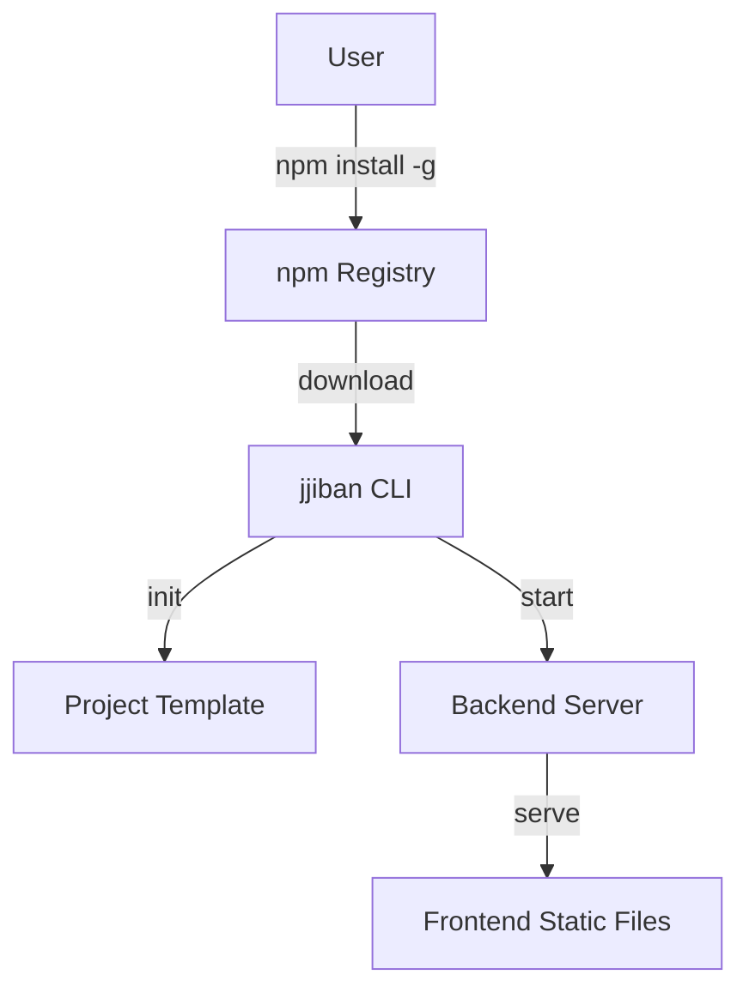

# Epic PRD: CLI 패키지 및 배포 시스템

## 문서 정보

| 항목 | 내용 |
|------|------|
| Epic ID | EPIC-009 |
| Epic 이름 | CLI 패키지 및 배포 시스템 |
| 문서 버전 | 1.0 |
| 작성일 | 2024-12-06 |
| 상태 | Draft |
| 상위 프로젝트 | jjiban (찌반) |
| 원본 PRD | `jjiban-prd.md` |

---

## 1. Epic 개요

### 1.1 Epic 비전

**"npm install -g jjiban 한 줄로 설치하는 온프레미스 칸반 도구"**

jjiban을 npm CLI 패키지로 배포하여 Redmine, GitLab처럼 로컬에서 쉽게 설치하고 실행할 수 있도록 합니다. 프로젝트 초기화, 서버 시작/종료, DB 마이그레이션, 업데이트를 CLI 명령어로 제공합니다.

### 1.2 범위 (Scope)

**포함:**
- npm CLI 패키지 구조
- 명령어: init, start, stop, migrate, status, update
- 프로젝트 초기화 (템플릿 복사)
- 서버 관리 (시작/종료/상태 확인)
- DB 마이그레이션
- Docker 지원 (선택적)
- 업데이트 및 백업/복원

**제외:**
- 클라우드 배포 (AWS/Azure) - v2.0에서 고려
- 멀티 서버 클러스터링 - v2.0에서 고려

### 1.3 성공 지표

- ✅ npm 설치 성공률 > 99%
- ✅ 프로젝트 초기화 < 1분
- ✅ 서버 시작 < 10초
- ✅ npm 다운로드 수 (추적)

---

## 2. 상세 요구사항

### 2.1 기능 요구사항

#### 2.1.1 npm CLI 패키지 구조

```
jjiban/
├── packages/
│   ├── cli/                          # CLI 도구 (배포 대상)
│   │   ├── bin/
│   │   │   └── jjiban.js             # CLI 진입점
│   │   ├── commands/
│   │   │   ├── init.js               # 프로젝트 초기화
│   │   │   ├── start.js              # 서버 시작
│   │   │   ├── stop.js               # 서버 종료
│   │   │   ├── migrate.js            # DB 마이그레이션
│   │   │   ├── status.js             # 서버 상태 확인
│   │   │   └── update.js             # 버전 업데이트 체크
│   │   ├── templates/                # 프로젝트 템플릿
│   │   │   ├── .jjiban/
│   │   │   │   ├── config.json
│   │   │   │   └── llm-config.yaml
│   │   │   ├── projects/
│   │   │   ├── templates/
│   │   │   └── .gitignore
│   │   ├── server/                   # 번들된 백엔드 (빌드 결과)
│   │   │   ├── dist/
│   │   │   │   └── main.js
│   │   │   └── prisma/
│   │   ├── web/                      # 번들된 프론트엔드 (빌드 결과)
│   │   │   └── dist/
│   │   └── package.json
```

**package.json:**
```json
{
  "name": "jjiban",
  "version": "1.0.0",
  "description": "AI-Assisted Development Kanban Tool",
  "bin": {
    "jjiban": "./bin/jjiban.js"
  },
  "files": [
    "bin",
    "commands",
    "templates",
    "server",
    "web"
  ],
  "keywords": ["kanban", "llm", "ai", "project-management"],
  "engines": {
    "node": ">=18.0.0"
  }
}
```

#### 2.1.2 CLI 명령어

**A. jjiban init <name>**

```bash
$ jjiban init my-kanban-project

✨ Creating jjiban project...
📁 Creating directory: my-kanban-project/
📄 Copying templates...
⚙️  Initializing configuration files...
💾 Creating SQLite database...
🔄 Running database migrations...
✅ Project initialized successfully!

Next steps:
  cd my-kanban-project
  jjiban start
```

**B. jjiban start**

```bash
$ jjiban start

🚀 Starting jjiban server...
📦 Loading configuration: .jjiban/config.json
💾 Checking database: .jjiban/jjiban.db
🔄 Running migrations (if needed)...
✅ Server started successfully!

🌐 Web UI: http://localhost:3000
📄 Logs: .jjiban/logs/server.log

Press Ctrl+C to stop the server
```

**C. jjiban stop**

```bash
$ jjiban stop

🛑 Stopping jjiban server...
🔍 Reading PID file: .jjiban/server.pid
✅ Server stopped successfully!
```

**D. jjiban migrate**

```bash
$ jjiban migrate

🔄 Running database migrations...
✅ Applied 3 migrations successfully

# 리셋 옵션
$ jjiban migrate --reset
⚠️  WARNING: This will delete all data!
Are you sure? (y/N): y
🗑️  Resetting database...
✅ Database reset complete
```

**E. jjiban status**

```bash
$ jjiban status

✓ Server is running (PID: 12345)
✓ Port: 3000
✓ Database: .jjiban/jjiban.db (SQLite)
✓ Uptime: 2 hours 34 minutes
✓ Memory: 125 MB
```

**F. jjiban update**

```bash
$ jjiban update

🔍 Checking for updates...
📦 Current version: 1.0.0
📦 Latest version: 1.1.0

✨ New version available!
Run: npm install -g jjiban@latest
```

#### 2.1.3 프로젝트 초기화

**생성되는 구조:**
```
my-kanban-project/
├── .jjiban/
│   ├── config.json              # 프로젝트 설정
│   ├── llm-config.yaml          # LLM 연결 설정
│   ├── jjiban.db                # SQLite 데이터베이스
│   └── server.pid               # 서버 PID (실행 중일 때)
│
├── projects/                    # 프로젝트 문서 루트
│   └── README.md
│
├── templates/                   # 문서 템플릿
│   ├── epic-prd-template.md
│   ├── chain-prd-template.md
│   └── ...
│
├── package.json
├── README.md
└── .gitignore
```

#### 2.1.4 서버 관리

**서버 시작 로직:**
```typescript
// commands/start.js
import { spawn } from 'child_process';
import fs from 'fs-extra';

export async function startServer(options) {
  const port = options.port || 3000;

  // 1. 설정 파일 검증
  const config = await loadConfig('.jjiban/config.json');

  // 2. DB 마이그레이션 실행
  await runMigrations();

  // 3. 백엔드 서버 시작
  const serverProcess = spawn('node', ['server/dist/main.js'], {
    env: { ...process.env, PORT: port },
    detached: true,
    stdio: 'ignore'
  });

  // 4. PID 파일 저장
  fs.writeFileSync('.jjiban/server.pid', serverProcess.pid.toString());

  // 5. 브라우저 자동 열기 (옵션)
  if (options.open) {
    await openBrowser(`http://localhost:${port}`);
  }

  console.log(`✅ Server started on http://localhost:${port}`);
}
```

#### 2.1.5 Docker 지원 (선택적)

**Dockerfile:**
```dockerfile
FROM node:18-alpine

WORKDIR /app

# jjiban CLI 설치
RUN npm install -g jjiban

# 프로젝트 초기화
RUN jjiban init jjiban-project

WORKDIR /app/jjiban-project

# 포트 노출
EXPOSE 3000

# 볼륨 마운트 포인트
VOLUME ["/app/jjiban-project/.jjiban", "/app/jjiban-project/projects"]

# 서버 시작
CMD ["jjiban", "start"]
```

**docker-compose.yml:**
```yaml
version: '3.8'

services:
  jjiban:
    image: jjiban/jjiban:latest
    ports:
      - "3000:3000"
    volumes:
      - ./data:/app/jjiban-project/.jjiban
      - ./projects:/app/jjiban-project/projects
    environment:
      - NODE_ENV=production
      - ANTHROPIC_API_KEY=${ANTHROPIC_API_KEY}
      - GOOGLE_API_KEY=${GOOGLE_API_KEY}
    restart: unless-stopped
```

#### 2.1.6 업데이트 및 백업

**버전 업데이트:**
```bash
# 1. 현재 버전 확인
jjiban --version

# 2. 업데이트 체크
jjiban update

# 3. 최신 버전 설치
npm install -g jjiban@latest

# 4. 데이터 마이그레이션 (자동)
jjiban migrate
```

**백업/복원:**
```bash
# 백업 (SQLite DB + 문서)
cp -r .jjiban backup-$(date +%Y%m%d)/
cp -r projects backup-$(date +%Y%m%d)/

# 복원
cp -r backup-20241205/.jjiban .
cp -r backup-20241205/projects .
```

### 2.2 비기능 요구사항

#### 2.2.1 성능
- 프로젝트 초기화: < 1분
- 서버 시작: < 10초
- npm 설치: < 2분

#### 2.2.2 호환성
- Node.js 18+
- Windows, macOS, Linux 지원
- SQLite (내장)

---

## 3. 기술적 고려사항

### 3.1 아키텍처



### 3.2 기술 스택

| 레이어 | 기술 | 비고 |
|--------|------|------|
| CLI | Commander.js | 명령어 파싱 |
| 인터랙션 | inquirer | 사용자 입력 |
| 스피너 | ora | 로딩 표시 |
| 색상 | chalk | 터미널 색상 |
| 백엔드 | Node.js (번들됨) | Express/Fastify |
| 프론트엔드 | React (번들됨) | 정적 파일 |

### 3.3 의존성

**선행 Epic:**
- 모든 Epic (패키지에 포함됨)

**외부 의존성:**
- commander ^11.x
- inquirer ^9.x
- ora ^7.x
- chalk ^5.x

---

## 4. Feature (Chain) 목록

- [ ] FEATURE-009-001: npm CLI 패키지 구조 및 빌드 (담당: 미정, 예상: 1.5주)
- [ ] FEATURE-009-002: init/start/stop 명령어 (담당: 미정, 예상: 2주)
- [ ] FEATURE-009-003: migrate/status/update 명령어 (담당: 미정, 예상: 1주)
- [ ] FEATURE-009-004: 프로젝트 템플릿 및 초기화 (담당: 미정, 예상: 1주)
- [ ] FEATURE-009-005: Docker 지원 및 배포 자동화 (담당: 미정, 예상: 1.5주)
- [ ] FEATURE-009-006: npm 배포 및 릴리즈 프로세스 (담당: 미정, 예상: 0.5주)

---

## 5. 일정 및 마일스톤

| 마일스톤 | 목표일 | 산출물 | 상태 |
|----------|--------|--------|------|
| M1: CLI 구조 완료 | 미정 | package.json, 명령어 구조 | 예정 |
| M2: 핵심 명령어 구현 | 미정 | init, start, stop | 예정 |
| M3: npm 배포 | 미정 | 퍼블릭 패키지 | 예정 |
| M4: Docker 지원 | 미정 | Dockerfile, 이미지 | 예정 |

---

## 부록

### A. 용어 정의

| 용어 | 정의 |
|------|------|
| CLI | Command Line Interface |
| npm | Node Package Manager |
| Monorepo | 단일 저장소에서 여러 패키지 관리 |
| PID | Process ID |

### B. 참고 자료

- 원본 PRD: `jjiban-prd.md` (섹션 5)
- Commander.js: https://github.com/tj/commander.js
- npm 배포 가이드: https://docs.npmjs.com/cli/publish

### C. 변경 이력

| 버전 | 날짜 | 변경 내용 | 작성자 |
|------|------|-----------|--------|
| 1.0 | 2024-12-06 | 초안 작성 | Claude |
