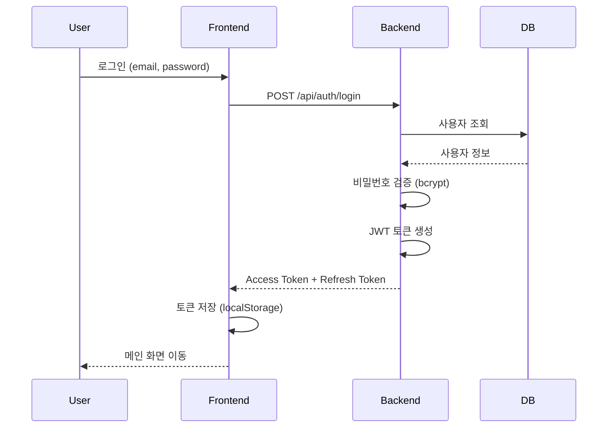
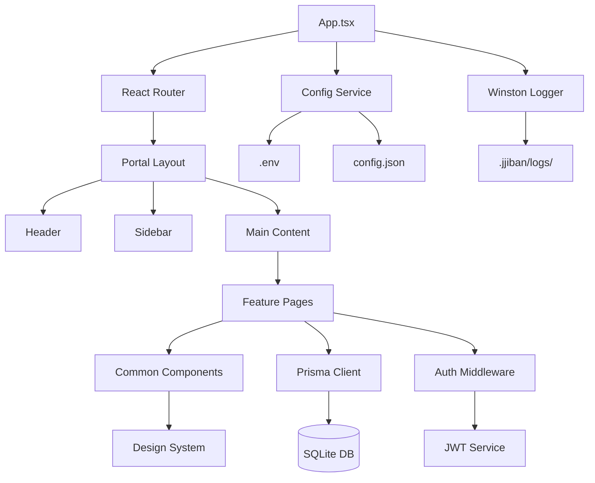

# Epic PRD: 플랫폼 인프라

## 문서 정보

| 항목 | 내용 |
|------|------|
| Epic ID | EPIC-P01 |
| Epic 이름 | 플랫폼 인프라 (사용자 관리 & 시스템 운영) |
| 문서 버전 | 2.0 |
| 작성일 | 2024-12-06 |
| 수정일 | 2024-12-06 |
| 상태 | Draft |
| Epic 유형 | 플랫폼 (Platform) - 시스템 실행 필수 기능 |
| 상위 프로젝트 | jjiban (찌반) |
| 원본 PRD | `jjiban-prd.md` |

---

## 1. Epic 개요

### 1.1 Epic 비전

**"시스템 실행에 필수적인 모든 플랫폼 인프라"**

jjiban 프로젝트가 작동하기 위해 반드시 필요한 모든 기능을 통합 관리합니다. 사용자 인증, Portal, 보안, 데이터베이스, CI/CD 등 사용자가 명시하지 않았더라도 시스템이 안정적으로 실행되기 위한 필수 인프라를 제공합니다.

### 1.2 범위 (Scope)

**포함:**
- **사용자 관리**: 로그인, JWT 인증, RBAC, 프로필 관리
- **Portal 시스템**: 헤더, 사이드바, 네비게이션, 레이아웃
- **디자인 시스템**: 공통 컴포넌트, 색상, 타이포그래피
- **데이터 계층**: Prisma Schema, 데이터베이스 초기화
- **시스템 설정**: config.json, llm-config.yaml, 환경 변수, 로깅
- **에러 처리 & 보안**: Error Handler, CORS, Helmet, XSS 방지
- **DevOps**: Git 전략, CI/CD 파이프라인

**제외:**
- 비즈니스 로직 (각 기능 Epic에서 구현)
- 소셜 로그인, 2FA (v2.0)

### 1.3 성공 지표

- ✅ 로그인 성공률 > 99%
- ✅ 인증 응답 시간 < 500ms
- ✅ 보안 취약점 0건 (OWASP Top 10 기준)
- ✅ 모든 기능 Epic이 Portal 레이아웃 사용
- ✅ 디자인 시스템 컴포넌트 재사용률 > 80%
- ✅ CI/CD 파이프라인 성공률 > 95%
- ✅ 데이터베이스 마이그레이션 성공률 100%

---

## 2. 상세 요구사항

### 2.1 기능 요구사항

#### 2.1.1 사용자 관리 (User Management)

**A. User 테이블 스키마**
```prisma
model User {
  id        String   @id @default(cuid())
  email     String   @unique
  password  String   // bcrypt 해시
  name      String
  role      String   @default("Developer")  // Admin, ProjectManager, Developer, Viewer
  createdAt DateTime @default(now())
  updatedAt DateTime @updatedAt

  assignedTasks  Task[]
  plProjects     Epic[]
}
```

**B. 로그인 화면**
```
┌────────────────────────────────────┐
│        jjiban 로그인               │
│                                    │
│  이메일: [________________]        │
│  비밀번호: [________________]      │
│  [ ] 로그인 상태 유지              │
│                                    │
│  [      로그인      ]              │
│  비밀번호를 잊으셨나요?             │
└────────────────────────────────────┘
```

**기능:**
- 이메일 + 비밀번호 인증
- "로그인 상태 유지" 옵션 (Refresh Token)
- 유효성 검사 (이메일 형식, 필수 입력)
- 에러 메시지 표시

**C. JWT 인증 흐름**


**토큰 구조:**
- **Access Token**: 15분 유효, 모든 API 요청에 포함
- **Refresh Token**: 7일 유효, Access Token 갱신용

**D. 역할 기반 접근 제어 (RBAC)**

| 역할 | 권한 | 설명 |
|------|------|------|
| **Admin** | 모든 권한 | 시스템 관리자 |
| **ProjectManager** | 프로젝트 생성/삭제, 사용자 할당 | 프로젝트 리더 |
| **Developer** | Task 생성/수정, 문서 읽기/쓰기 | 개발자 |
| **Viewer** | 읽기 전용 | 관찰자 |

**권한 체크 예시:**
```typescript
// Middleware
export const requireRole = (allowedRoles: string[]) => {
  return (req: Request, res: Response, next: NextFunction) => {
    if (!allowedRoles.includes(req.user.role)) {
      return res.status(403).json({ error: 'Forbidden' });
    }
    next();
  };
};

// 사용
app.delete('/api/projects/:id',
  requireRole(['Admin', 'ProjectManager']),
  deleteProject
);
```

**E. 사용자 등록**
```
┌────────────────────────────────────┐
│        사용자 등록                 │
│  이름: [________________]          │
│  이메일: [________________]        │
│  비밀번호: [________________]      │
│  (8자 이상, 영문+숫자 조합)         │
│  비밀번호 확인: [________________]  │
│  [      등록      ]                │
└────────────────────────────────────┘
```

**기능:**
- 이메일 중복 확인
- 비밀번호 강도 검사 (8자 이상, 영문+숫자)
- 비밀번호 확인 일치 검증

**F. 비밀번호 찾기**
```
1. 이메일 입력
2. 인증 코드 전송 (이메일)
3. 인증 코드 확인 (10분 유효)
4. 새 비밀번호 설정
5. 모든 세션 무효화
```

#### 2.1.2 Portal 시스템

**A. 전역 헤더**
```
┌────────────────────────────────────────────────┐
│ 🏠 jjiban  [프로젝트 ▼]  🔍 검색  👤 사용자 ▼ │
└────────────────────────────────────────────────┘
```

**구성 요소:**
- 로고 및 프로젝트명
- 프로젝트 선택 드롭다운
- 전역 검색 바
- 사용자 프로필 메뉴

**B. 사이드바 네비게이션**
```
┌─────────────────┐
│ 📊 대시보드      │
│ 📋 칸반 보드     │
│ 📅 Gantt 차트   │
│ 📝 백로그        │
│ ───────────────  │
│ ⚙️ 설정         │
└─────────────────┘
```

**C. 레이아웃 템플릿**
- 기본 레이아웃 (Header + Sidebar + Main)
- 전체 화면 레이아웃 (터미널)
- 분할 레이아웃 (Task 상세)

#### 2.1.3 디자인 시스템

**A. 색상 팔레트**
```css
/* Primary Colors */
--primary-100: #e6f7ff;
--primary-500: #1890ff;
--primary-700: #096dd9;

/* Semantic Colors */
--success: #52c41a;
--warning: #faad14;
--error: #f5222d;
```

**B. 공통 컴포넌트**
- Button (primary, secondary, danger, ghost)
- Input (text, password, textarea)
- Select (드롭다운)
- Modal (다이얼로그)
- DataTable (정렬, 필터링, 페이지네이션)
- Form (폼 컨트롤)
- Tree (계층 구조)

**C. UI 프레임워크**
- Ant Design 또는 Shadcn
- Tailwind CSS (유틸리티 클래스)

#### 2.1.4 데이터 계층

**A. Prisma Schema (통합)**

**User 테이블** (섹션 2.1.1 참조)

**Epic/Chain/Module/Task 테이블**
```prisma
model Epic {
  id          String   @id @default(cuid())
  name        String
  description String?
  prdPath     String?
  startDate   DateTime?
  targetDate  DateTime?
  status      String   @default("active")
  plId        String?
  createdAt   DateTime @default(now())
  updatedAt   DateTime @updatedAt

  pl          User?    @relation(fields: [plId], references: [id])
  chains      Chain[]
}

model Chain {
  id              String   @id @default(cuid())
  epicId          String
  name            String
  description     String?
  status          String   @default("planning")
  createdAt       DateTime @default(now())
  updatedAt       DateTime @updatedAt

  epic            Epic     @relation(fields: [epicId], references: [id], onDelete: Cascade)
  modules         Module[]
}

model Module {
  id                  String   @id @default(cuid())
  chainId             String
  name                String
  userStory           String?
  status              String   @default("todo")
  createdAt           DateTime @default(now())
  updatedAt           DateTime @updatedAt

  chain               Chain    @relation(fields: [chainId], references: [id], onDelete: Cascade)
  tasks               Task[]
}

model Task {
  id              String   @id @default(cuid())
  moduleId        String
  name            String
  description     String?
  type            String   @default("task")
  status          String   @default("todo")
  statusSymbol    String   @default("[ ]")
  assigneeId      String?
  priority        String   @default("medium")
  estimatedHours  Int?
  actualHours     Int?
  startDate       DateTime?
  dueDate         DateTime?
  createdAt       DateTime @default(now())
  updatedAt       DateTime @updatedAt

  module          Module   @relation(fields: [moduleId], references: [id], onDelete: Cascade)
  assignee        User?    @relation(fields: [assigneeId], references: [id])
}
```

**B. 데이터베이스 초기화**
```bash
cd packages/server
npx prisma migrate dev --name init
npx prisma generate
```

#### 2.1.5 시스템 설정, 에러 처리 & 보안

**A. 환경 변수 관리 (.env)**
```bash
# LLM API Keys
ANTHROPIC_API_KEY=sk-ant-xxx
GOOGLE_API_KEY=AIzaSyxxx

# Database
DATABASE_URL=file:./.jjiban/jjiban.db

# JWT Secret (EPIC-P01)
JWT_SECRET=your-secret-key-here
JWT_EXPIRES_IN=15m

# Server
NODE_ENV=development
PORT=3000
LOG_LEVEL=info
```

**보안 주의사항:**
- `.env` 파일은 Git에 커밋하지 않음 (`.gitignore` 추가)
- `.env.example` 템플릿 제공
- 프로덕션 환경에서는 Vault 또는 Secrets Manager 사용

**B. 프로젝트 설정 (config.json)**
```json
{
  "name": "jjiban-project",
  "version": "1.0.0",
  "port": 3000,
  "database": {
    "type": "sqlite",
    "path": ".jjiban/jjiban.db"
  },
  "features": {
    "terminal": true,
    "llm": true,
    "autoWorkflow": true
  },
  "paths": {
    "projects": "./projects",
    "logs": ".jjiban/logs"
  }
}
```

**C. LLM 연결 설정 (llm-config.yaml)**
```yaml
providers:
  - name: claude
    enabled: true
    apiKey: ${ANTHROPIC_API_KEY}
    model: claude-3-5-sonnet-20241022

  - name: gemini
    enabled: true
    apiKey: ${GOOGLE_API_KEY}
    model: gemini-2.0-flash-exp

defaultProvider: claude
```

**D. 로깅 시스템 (Winston)**
```typescript
import winston from 'winston';

export const logger = winston.createLogger({
  level: process.env.LOG_LEVEL || 'info',
  format: winston.format.combine(
    winston.format.timestamp(),
    winston.format.json()
  ),
  transports: [
    new winston.transports.File({
      filename: '.jjiban/logs/error.log',
      level: 'error'
    }),
    new winston.transports.File({
      filename: '.jjiban/logs/combined.log'
    }),
    new winston.transports.Console()
  ]
});
```

**로그 레벨:**
- `error`: 시스템 오류, 예외
- `warn`: 경고 메시지
- `info`: 정보성 로그
- `debug`: 디버깅용 로그

**E. 전역 에러 처리**

**Express 에러 핸들러 (Backend)**
```typescript
// packages/server/src/middleware/errorHandler.ts
import { Request, Response, NextFunction } from 'express';
import { logger } from '../utils/logger';

export const errorHandler = (
  err: Error,
  req: Request,
  res: Response,
  next: NextFunction
) => {
  logger.error('Unhandled error', {
    error: err.message,
    stack: err.stack,
    path: req.path,
    method: req.method
  });

  res.status(500).json({
    error: 'Internal Server Error',
    message: process.env.NODE_ENV === 'development' ? err.message : undefined
  });
};
```

**React 에러 바운더리 (Frontend)**
```tsx
// packages/web/src/components/ErrorBoundary.tsx
import React from 'react';

class ErrorBoundary extends React.Component<
  { children: React.ReactNode },
  { hasError: boolean; error?: Error }
> {
  constructor(props: any) {
    super(props);
    this.state = { hasError: false };
  }

  static getDerivedStateFromError(error: Error) {
    return { hasError: true, error };
  }

  componentDidCatch(error: Error, errorInfo: React.ErrorInfo) {
    console.error('React error caught:', error, errorInfo);
  }

  render() {
    if (this.state.hasError) {
      return (
        <div style={{ padding: '20px', textAlign: 'center' }}>
          <h2>⚠️ 오류가 발생했습니다</h2>
          <p>페이지를 새로고침해주세요.</p>
          {process.env.NODE_ENV === 'development' && (
            <details style={{ marginTop: '20px', textAlign: 'left' }}>
              <summary>에러 상세</summary>
              <pre>{this.state.error?.stack}</pre>
            </details>
          )}
        </div>
      );
    }
    return this.props.children;
  }
}

export default ErrorBoundary;
```

**사용 예시:**
```tsx
// App.tsx
import ErrorBoundary from './components/ErrorBoundary';

function App() {
  return (
    <ErrorBoundary>
      <Router>
        <Routes>...</Routes>
      </Router>
    </ErrorBoundary>
  );
}
```

**F. 보안 설정**

**CORS 설정 (Cross-Origin Resource Sharing)**
```typescript
// packages/server/src/middleware/cors.ts
import cors from 'cors';

export const corsOptions = {
  origin: process.env.NODE_ENV === 'development'
    ? ['http://localhost:3000', 'http://localhost:5173']
    : ['https://yourdomain.com'],
  credentials: true,
  methods: ['GET', 'POST', 'PUT', 'DELETE', 'PATCH'],
  allowedHeaders: ['Content-Type', 'Authorization']
};

// app.ts
app.use(cors(corsOptions));
```

**Helmet (보안 헤더)**
```typescript
import helmet from 'helmet';

app.use(helmet({
  contentSecurityPolicy: {
    directives: {
      defaultSrc: ["'self'"],
      scriptSrc: ["'self'", "'unsafe-inline'"],
      styleSrc: ["'self'", "'unsafe-inline'"],
      imgSrc: ["'self'", "data:", "https:"],
    }
  },
  hsts: {
    maxAge: 31536000,
    includeSubDomains: true,
    preload: true
  }
}));
```

**XSS 방지 (입력 Sanitization)**
```typescript
import validator from 'validator';

export const sanitizeInput = (input: string): string => {
  return validator.escape(input.trim());
};

// 사용 예시
app.post('/api/tasks', (req, res) => {
  const taskName = sanitizeInput(req.body.name);
  const description = sanitizeInput(req.body.description);
  // ...
});
```

**Rate Limiting (요청 제한)**
```typescript
import rateLimit from 'express-rate-limit';

const limiter = rateLimit({
  windowMs: 15 * 60 * 1000, // 15분
  max: 100, // IP당 100개 요청
  message: '너무 많은 요청이 발생했습니다. 잠시 후 다시 시도해주세요.'
});

app.use('/api/', limiter);
```

#### 2.1.6 DevOps

**A. Git 전략**
```
main (프로덕션)
  └── develop (개발)
       ├── feature/EPIC-001-dashboard
       ├── feature/EPIC-002-project-management
       └── hotfix/bug-fix-123
```

**커밋 메시지 규칙:**
```
feat: 새로운 기능 추가
fix: 버그 수정
docs: 문서 수정
refactor: 코드 리팩토링
test: 테스트 코드
chore: 빌드 설정
```

**B. CI/CD 파이프라인 (GitHub Actions)**
```yaml
name: CI/CD Pipeline

on:
  push:
    branches: [main, develop]
  pull_request:
    branches: [main, develop]

jobs:
  build-and-test:
    runs-on: ubuntu-latest
    steps:
      - uses: actions/checkout@v3
      - uses: actions/setup-node@v3
        with:
          node-version: '18'
      - run: npm ci
      - run: npm run build
      - run: npm run test
      - run: npm run lint

  deploy:
    needs: build-and-test
    if: github.ref == 'refs/heads/main'
    runs-on: ubuntu-latest
    steps:
      - run: npm publish
```

### 2.2 비기능 요구사항

#### 2.2.1 성능
- Portal 초기 렌더링: < 1초
- 화면 전환: < 200ms
- 컴포넌트 렌더링: < 16ms (60fps)
- 데이터베이스 쿼리: < 100ms (평균)
- 로그인 응답 시간: < 500ms
- CI/CD 빌드: < 5분

#### 2.2.2 보안
- HTTPS 필수 (프로덕션)
- CORS 정책 적용
- XSS/CSRF 방지
- Rate Limiting 적용
- 환경 변수 암호화 저장
- SQL Injection 방지 (Prisma ORM)
- 비밀번호 암호화 (bcrypt, salt rounds: 10)
- JWT Secret Key 환경 변수 관리

#### 2.2.3 접근성
- WCAG AA 준수
- 키보드 네비게이션 지원
- ARIA 라벨 적용

#### 2.2.4 확장성
- SQLite → PostgreSQL 마이그레이션 가능
- 컴포넌트 Tree Shaking 지원
- 모듈화된 구조

### 2.3 제약사항

- Node.js 18+ 필수
- React 18+ 필수
- TypeScript 필수

---

## 3. 기술적 고려사항

### 3.1 아키텍처



### 3.2 기술 스택

| 레이어 | 기술 | 비고 |
|--------|------|------|
| Frontend | React 18 + TypeScript | SPA |
| 라우팅 | React Router v6 | 중첩 라우트 |
| UI Framework | Ant Design / Shadcn | 컴포넌트 라이브러리 |
| 스타일링 | Tailwind CSS | 유틸리티 우선 |
| 상태 관리 | Zustand | 전역 상태 |
| 인증 | JWT (jsonwebtoken) | Access + Refresh Token |
| 암호화 | bcrypt | 비밀번호 해싱 |
| Database | SQLite + Prisma | ORM |
| 로깅 | Winston | 구조화된 로그 |
| 보안 | CORS, Helmet, Validator | 보안 헤더 & XSS 방지 |
| CI/CD | GitHub Actions | 자동화 |

### 3.3 의존성

**선행 Epic:**
- 없음 (최우선 구축 대상)

**후행 Epic (이 Epic에 의존):**
- 모든 기능 Epic (EPIC-001 ~ EPIC-010)

**외부 의존성:**
- react ^18.x
- react-router-dom ^6.x
- antd ^5.x (또는 @shadcn/ui)
- @prisma/client ^5.x
- winston ^3.x
- tailwindcss ^3.x
- **jsonwebtoken ^9.x** (JWT 인증)
- **bcrypt ^5.x** (비밀번호 해싱)
- dotenv ^16.x (환경 변수)
- cors ^2.x (CORS)
- helmet ^7.x (보안 헤더)
- express-rate-limit ^7.x (요청 제한)
- validator ^13.x (입력 검증)

---

## 4. Feature (Chain) 목록

이 Epic은 다음 Feature들로 구성됩니다:

- [ ] FEATURE-P01-001: 사용자 관리 (User 테이블, 로그인, JWT, RBAC) (담당: 미정, 예상: 3주)
  - User 테이블 스키마 설계 및 Prisma 설정
  - 로그인/로그아웃 UI 및 API
  - JWT 인증 및 토큰 관리 (Access Token, Refresh Token)
  - 사용자 등록 및 프로필 관리
  - 역할 기반 접근 제어 (RBAC: Admin, ProjectManager, Developer, Viewer)
  - 비밀번호 찾기 및 재설정
- [ ] FEATURE-P01-002: Portal & 레이아웃 시스템 (담당: 미정, 예상: 2주)
- [ ] FEATURE-P01-003: 디자인 시스템 & 공통 컴포넌트 (담당: 미정, 예상: 3주)
- [ ] FEATURE-P01-004: 데이터베이스 스키마 (Epic/Chain/Module/Task) (담당: 미정, 예상: 1주)
- [ ] FEATURE-P01-005: 시스템 설정, 로깅, 에러 처리 & 보안 (담당: 미정, 예상: 1.5주)
  - 환경 변수 관리 (.env, dotenv)
  - 프로젝트 설정 (config.json, llm-config.yaml)
  - 로깅 시스템 (Winston)
  - 전역 에러 처리 (Express Error Handler, React Error Boundary)
  - 보안 설정 (CORS, Helmet, XSS 방지, Rate Limiting)
- [ ] FEATURE-P01-006: CI/CD 파이프라인 (담당: 미정, 예상: 1주)

---

## 5. 일정 및 마일스톤

| 마일스톤 | 목표일 | 산출물 | 상태 |
|----------|--------|--------|------|
| M1: Portal 완료 | 미정 | 레이아웃 시스템 | 예정 |
| M2: 디자인 시스템 완료 | 미정 | 공통 컴포넌트 | 예정 |
| M3: 데이터 계층 완료 | 미정 | Prisma Schema | 예정 |
| M4: DevOps 완료 | 미정 | CI/CD 파이프라인 | 예정 |

---

## 6. 리스크 및 이슈

| 리스크 | 영향도 | 발생 가능성 | 완화 전략 | 담당 |
|--------|--------|------------|-----------|------|
| JWT Secret Key 유출 | High | Low | 환경 변수 관리, Key Rotation | 미정 |
| 레이아웃 변경 시 모든 화면 영향 | High | Medium | 버전 관리, 단계적 적용 | 미정 |
| 컴포넌트 과도한 추상화 | Medium | Medium | YAGNI 원칙 준수 | 미정 |
| SQLite 동시 접속 제한 | Medium | Low | PostgreSQL 마이그레이션 계획 | 미정 |
| CI/CD 무료 티어 제한 | Medium | Low | 빌드 최적화 | 미정 |

---

## 7. 품질 기준

### 7.1 완료 조건 (Definition of Done)

**사용자 관리:**
- [ ] User 테이블 스키마 정의 완료
- [ ] 로그인/로그아웃 정상 작동
- [ ] JWT 토큰 생성 및 검증 완료
- [ ] Refresh Token 자동 갱신 작동
- [ ] 비밀번호 암호화 (bcrypt) 적용
- [ ] RBAC 권한 체크 정상 작동
- [ ] 사용자 등록 및 프로필 관리 완료
- [ ] 비밀번호 찾기 및 재설정 완료

**Portal & 디자인:**
- [ ] Portal 레이아웃 구현 완료 (Header, Sidebar)
- [ ] React Router 통합 완료
- [ ] 공통 컴포넌트 10개 이상 구현
- [ ] Storybook 문서화 완료

**데이터 & 시스템:**
- [ ] Prisma Schema 정의 완료 (User, Epic, Chain, Module, Task)
- [ ] SQLite DB 초기화 성공
- [ ] 환경 변수 로드 정상 작동 (.env)
- [ ] 시스템 설정 파일 로드 정상 작동 (config.json)
- [ ] Winston 로거 정상 작동

**에러 처리 & 보안:**
- [ ] Express 에러 핸들러 구현 완료
- [ ] React Error Boundary 구현 완료
- [ ] CORS 정책 적용 완료
- [ ] Helmet 보안 헤더 적용 완료
- [ ] XSS 방지 Sanitization 구현
- [ ] Rate Limiting 적용 완료
- [ ] OWASP Top 10 보안 점검 통과

**DevOps:**
- [ ] GitHub Actions CI/CD 작동
- [ ] 단위 테스트 커버리지 80% 이상
- [ ] Lighthouse 접근성 점수 90점 이상

### 7.2 검수 기준

**사용자 관리:**
- 잘못된 비밀번호 입력 시 명확한 에러 메시지
- 토큰 만료 시 자동 재로그인 유도
- 역할별 접근 제어 정상 작동 (Admin vs Developer)
- 로그인 응답 시간 < 500ms

**Portal & UI:**
- 모든 기능 Epic이 Portal 레이아웃 사용 가능
- 화면 전환이 부드럽고 빠름 (< 200ms)
- 컴포넌트가 Storybook에서 정상 작동

**시스템 & 보안:**
- 데이터베이스 마이그레이션 정상 작동
- 전역 에러가 적절히 처리되고 로그에 기록됨
- 보안 헤더가 모든 응답에 포함됨
- XSS 공격 입력이 sanitize됨
- Rate Limiting이 작동하여 과도한 요청 차단
- CI/CD 파이프라인 자동 실행
- 로그 파일 정상 생성

---

## 부록

### A. 용어 정의

| 용어 | 정의 |
|------|------|
| JWT | JSON Web Token, 사용자 인증용 토큰 |
| RBAC | Role-Based Access Control, 역할 기반 접근 제어 |
| Access Token | 짧은 유효 기간의 인증 토큰 (15분) |
| Refresh Token | 긴 유효 기간의 갱신 토큰 (7일) |
| Portal | 애플리케이션의 공통 레이아웃 프레임워크 |
| Design System | 색상, 타이포그래피, 간격 등의 디자인 규칙 체계 |
| Prisma | TypeScript ORM |
| Winston | Node.js 구조화된 로깅 라이브러리 |

### B. 참고 자료

- 원본 PRD: `jjiban-prd.md`
- 통합 Epic:
  - EPIC-P01 (사용자 관리) - 통합됨
  - EPIC-C01: Portal
  - EPIC-C03: DevOps
  - EPIC-C04: 공통 컴포넌트
  - EPIC-C05: 시스템 설정
  - EPIC-C11: 데이터 관리
- JWT 공식 문서: https://jwt.io/
- OWASP Top 10: https://owasp.org/www-project-top-ten/
- React Router: https://reactrouter.com/
- Ant Design: https://ant.design/
- Prisma: https://www.prisma.io/
- Winston: https://github.com/winstonjs/winston

### C. 변경 이력

| 버전 | 날짜 | 변경 내용 | 작성자 |
|------|------|-----------|--------|
| 1.0 | 2024-12-06 | 초안 작성 (사용자 관리) | Claude |
| 2.0 | 2024-12-06 | 모든 플랫폼 인프라 통합 (사용자 관리, Portal, 보안, 로깅, DevOps) | Claude |
