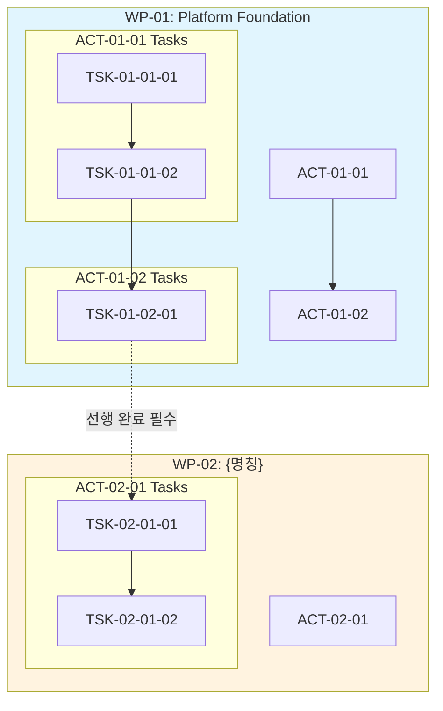

# /wbs - PRD 기반 WBS 생성

> **PRD → WBS 자동 변환**: PRD 문서를 분석하여 issue-structure.md 기반의 계층적 WBS를 생성합니다.

## 트리거
- PRD 문서를 이슈 계층 구조로 분할이 필요한 경우
- 체계적인 WBS(Work Breakdown Structure) 생성이 필요한 경우
- Task category별 워크플로우 적용이 필요한 경우

## 사용법
```bash
/wf:wbs [PRD 파일 경로]
/wf:wbs [PRD 파일 경로] --scale [large|medium|small]

# 예시
/wf:wbs .jjiban/jjiban/prd.md
/wf:wbs .jjiban/jjiban/prd.md --scale large
```

## 핵심 특징
- **issue-structure 기반**: Waterfall WBS 계층 구조 준수
- **프로젝트 규모 자동 산정**: 대규모/중간규모/소규모 자동 판별
- **규모별 계층 구조**: 4단계(대규모) / 3단계(중간) / 2단계(소규모)
- **Task category별 워크플로우**: development, defect, infrastructure 구분
- **워크플로우 상태 표시**: `[ ]`, `[bd]`, `[dd]`, `[dr]`, `[im]`, `[cr]`, `[ts]`, `[xx]`
- **MECE 원칙**: 상호 배타적 + 전체 포괄 분할
- **일정 자동 계산**: category별 기간 추정 + 의존성 기반 일정 산출
- **상세 Task 정의**: 목적, 주요 작업, 산출물, 인수 기준 포함
- **선행 의존성 명시**: WP/ACT/TSK 레벨별 Predecessor 표기

---

## 계층 구조 (issue-structure-waterfall.md 기준)

```
Project (프로젝트) - 6~24개월
├── Work Package #1 (주요 기능 묶음) - 1~3개월
│   ├── Activity #1.1 (세부 활동) - 1~4주
│   │   ├── Task #1.1.1 (실제 작업) - 1일~1주
│   │   ├── Task #1.1.2
│   │   └── Task #1.1.3
│   └── Activity #1.2
│       └── Task #1.2.1
├── Work Package #2
│   └── Activity #2.1
│       └── Task #2.1.1
└── Work Package #3
    └── Task #3.1 (Activity 생략 가능)
```

### 계층 타입

| 레벨 | 명칭 | 설명 | 기간 |
|------|------|------|------|
| Level 1 | **Project** | 전체 프로젝트 | 6~24개월 |
| Level 2 | **Work Package** | 주요 기능 단위의 작업 묶음 | 1~3개월 |
| Level 3 | **Activity** | 세부 활동 단위 | 1~4주 |
| Level 4 | **Task** | 실제 수행 작업 단위 | 1일~1주 |

### Task category (통합 구조)

```
Task (단일 이슈 타입)
├── category: "development"      # 신규 기능 개발 → 전체 워크플로우 (10단계)
├── category: "defect"           # 결함 수정 → 간소화 워크플로우 (7단계)
└── category: "infrastructure"   # 인프라/기술 작업 → 유연 워크플로우 (6단계)
```

---

## 프로젝트 규모 산정

### 규모 판별 기준

| 기준 | 대규모 | 중간 규모 | 소규모 |
|------|--------|----------|--------|
| **예상 기간** | 12개월+ | 6~12개월 | 3~6개월 |
| **팀 규모** | 10명+ | 5~10명 | 1~5명 |
| **기능 영역 수** | 5개+ | 3~5개 | 1~3개 |
| **예상 Task 수** | 50개+ | 20~50개 | 20개 미만 |

### 규모별 계층 구조

#### 대규모 프로젝트 (4단계)

```
Project
├── Work Package #1 ─────────── 1~3개월
│   ├── Activity #1.1 ───────── 1~4주
│   │   ├── Task [development]
│   │   ├── Task [defect]
│   │   └── Task [infrastructure]
│   └── Activity #1.2
│       └── Task
├── Work Package #2
│   └── Activity
│       └── Task
└── Work Package #3
    └── Task (Activity 생략 가능)
```

#### 중간 규모 프로젝트 (3단계)

```
Project
├── Work Package #1 ─────────── 1~3개월
│   ├── Task [development]
│   ├── Task [defect]
│   └── Task [infrastructure]
└── Work Package #2
    └── Task
```

#### 소규모 프로젝트 (2단계)

```
Project
├── Task [development]
│   └── Sub-Task (깊이 제한 2단계)
├── Task [defect]
└── Task [infrastructure]
```

---

## 워크플로우 상태 기호

### development 카테고리 (전체 워크플로우)

| 단계 | 상태 기호 | 명령어 | 설명 | 생성 문서 |
|------|----------|--------|------|----------|
| 1 | `[ ]` | - | Todo | - |
| 2 | `[bd]` | `start` | 기본설계 | `00-prd.md`, `01-basic-design.md` |
| 3 | `[dd]` | `draft` | 상세설계 | `02-detail-design.md` |
| 4 | `[dr]` | `plan` | 설계리뷰 | `03-detail-design-review-{llm}-{n}.md` |
| 5 | `[dr]` | `revise` | 설계개선 | `02-detail-design.md` (수정) |
| 6 | `[im]` | `build` | 구현 | `05-implementation.md`, `05-tdd-test-results.md` |
| 7 | `[cr]` | `audit` | 코드리뷰 | `06-code-review-{llm}-{n}.md` |
| 8 | `[cr]` | `patch` | 개선적용 | `05-implementation.md` (수정) |
| 9 | `[ts]` | `verify` | 통합테스트 | `08-integration-test.md` |
| 10 | `[xx]` | `done` | 완료 | `09-manual.md` |

**품질 게이트**: 설계리뷰 + 코드리뷰

### defect 카테고리 (간소화 워크플로우)

| 단계 | 상태 기호 | 명령어 | 설명 | 생성 문서 |
|------|----------|--------|------|----------|
| 1 | `[ ]` | - | Todo | - |
| 2 | `[an]` | `start` | 분석 | `defect-analysis.md` |
| 3 | `[fx]` | `analyze` | 수정 | `05-implementation.md` |
| 4 | `[cr]` | `fix` | 코드리뷰 | `06-code-review-{llm}-{n}.md` |
| 5 | `[cr]` | `audit` | 수정보완 | `05-implementation.md` (수정) |
| 6 | `[ts]` | `patch` | 테스트 | `defect-test-results.md` |
| 7 | `[xx]` | `verify` | 완료 | - |

**품질 게이트**: 코드리뷰

### infrastructure 카테고리 (유연 워크플로우)

| 단계 | 상태 기호 | 명령어 | 설명 | 생성 문서 |
|------|----------|--------|------|----------|
| 1 | `[ ]` | - | Todo | - |
| 2 | `[ds]` | `start` | 설계 (선택) | `tech-design.md` |
| 3 | `[im]` | `design`/`skip` | 구현 | `05-implementation.md` |
| 4 | `[cr]` | `build` | 코드리뷰 | `06-code-review-{llm}-{n}.md` |
| 5 | `[cr]` | `audit` | 개선적용 | `05-implementation.md` (수정) |
| 6 | `[xx]` | `patch` | 완료 | - |

**품질 게이트**: 코드리뷰

---

## 자동 실행 플로우

### 1단계: PRD 분석 및 프로젝트 규모 산정

**Auto-Persona**: architect + analyzer

**자동 실행**:
1. PRD 파일 읽기 및 구조 분석
2. `issue-structure-waterfall.md` 참조 경로 확인
3. **프로젝트 규모 산정**:
   - PRD 섹션 수 계산
   - 기능 영역 분석 (핵심/플랫폼/지원)
   - 예상 복잡도 측정
4. **규모 결정**: large / medium / small
5. 사용자에게 규모 확인 (옵션)

**규모 산정 알고리즘**:
```
IF (기능영역 >= 5) AND (예상기간 >= 12개월) THEN large
ELSE IF (기능영역 >= 3) AND (예상기간 >= 6개월) THEN medium
ELSE small
```

### 2단계: PRD 섹션 → Work Package 매핑

**Auto-Persona**: architect

**PRD 섹션 매핑 규칙**:

| PRD 섹션 | Work Package 매핑 |
|----------|------------------|
| 3. 핵심 기능 (Core Features) | WP-01 ~ WP-0N (핵심) |
| 4. 플랫폼 기능 (Platform Features) | WP-0N+1 ~ WP-0M (플랫폼) |
| 5. 지원 기능 (Support Features) | WP-0M+1 ~ WP-0K (지원) |

**대규모 프로젝트 필수 Work Package**:
- WP-01: Platform Foundation (플랫폼 기반)
  - 포털/레이아웃
  - 디자인 시스템
  - 데이터베이스/ORM
  - 사용자 관리/인증
  - 시스템 설정/로깅
  - 보안
  - DevOps/인프라

### 3단계: Work Package → Activity 분해

**Auto-Persona**: architect + analyzer

**분해 기준**:
1. **사용자 관점 기능**: 명확한 기능 단위
2. **1~4주 규모**: 적절한 크기 검증
3. **독립적 테스트 가능**: 단독 테스트 가능 여부
4. **MECE 원칙 적용**: 중복 없이 전체 포괄

### 4단계: Activity → Task 분해 및 category 분류

**Auto-Persona**: architect + scribe

**Task 분류 기준**:

| category | 식별 기준 | 워크플로우 |
|----------|----------|-----------|
| **development** | 신규 기능 구현, 설계 필요 | 전체 (10단계) |
| **defect** | 결함 수정, 기존 코드 패치 | 간소화 (7단계) |
| **infrastructure** | 리팩토링, 인프라, 성능개선 | 유연 (6단계) |

**Task 크기 검증**:
- 최소: 4시간
- 권장: 1~3일
- 최대: 1주
- 1주 초과 시 분할 권장

### 5단계: 프로젝트 시작일 확인 및 일정 계산

**Auto-Persona**: analyzer

**시작일 자동 설정**:
1. PRD에 시작일이 명시되어 있으면 사용
2. 없으면 **오늘 날짜**를 기본값으로 자동 설정
3. 나중에 `/schedule` 또는 JSON 직접 수정으로 조정 가능

> **원칙**: 일정은 자동 추정 후 수동 조정. 초기 계획에서 막히지 않고 빠르게 WBS 생성.

**일정 자동 계산 알고리즘**:

#### 5.1 Task 기간 추정 (category별 기본값)

| category | 기본 기간 | 범위 | 설명 |
|----------|----------|------|------|
| **development** | 5일 | 3~7일 | 설계+구현+리뷰 포함 |
| **defect** | 2일 | 1~3일 | 분석+수정+검증 |
| **infrastructure** | 3일 | 2~5일 | 설정/리팩토링 |

**복잡도 조정**:
- Task 설명에 "복잡", "대규모", "전체" 키워드 → +50%
- Task 설명에 "단순", "간단", "수정" 키워드 → -30%
- Backend + Frontend 모두 포함 → +2일

#### 5.2 Activity 기간 계산

```
Activity 기간 = max(병렬 Task들의 기간) + 버퍼(10%)
             또는
             sum(순차 Task들의 기간) + 버퍼(10%)
```

- 같은 Activity 내 Task들은 **병렬 실행 가능**으로 가정
- 명시적 의존성이 있으면 순차 계산

#### 5.3 Work Package 기간 계산

```
WP 시작일 = max(의존 WP들의 종료일) + 1일
WP 기간 = sum(Activity 기간) + 버퍼(15%)
WP 종료일 = WP 시작일 + WP 기간
```

#### 5.4 의존성 기반 일정 조정

**의존성 규칙**:
1. WP 레벨 의존성: `WP-02`가 `WP-01`에 의존 → WP-02 시작일 = WP-01 종료일 + 1
2. Activity 레벨 의존성: 같은 WP 내 순차 실행
3. Task 레벨 의존성: `blockedBy` 필드로 명시

**Critical Path 계산**:
```
1. 모든 Task의 Early Start/Early Finish 계산 (Forward Pass)
2. 모든 Task의 Late Start/Late Finish 계산 (Backward Pass)
3. Float = 0인 Task들이 Critical Path
4. Project 종료일 = 마지막 Task의 Early Finish
```

#### 5.5 일정 계산 예시

```
프로젝트 시작일: 2026-01-15

WP-01: Platform Foundation (의존성 없음)
├── ACT-01-01: 프로젝트 관리 (5일)
│   ├── TSK-01-01-01 [development]: 3일 → 01-15 ~ 01-17
│   ├── TSK-01-01-02 [development]: 5일 → 01-15 ~ 01-21 (병렬)
│   └── TSK-01-01-03 [infrastructure]: 2일 → 01-15 ~ 01-16 (병렬)
│   Activity 종료: 01-21 + 버퍼 = 01-22
├── ACT-01-02: WP 관리 (3일)
│   ├── TSK-01-02-01 [development]: 3일 → 01-23 ~ 01-27
│   Activity 종료: 01-28
WP-01 종료: 01-28 + 버퍼 = 01-30

WP-02: Workflow Engine (WP-01에 의존)
├── 시작일: 01-31 (WP-01 종료 + 1)
├── ACT-02-01: ...
WP-02 종료: 02-XX
```

### 6단계: WBS 문서 생성

**Auto-Persona**: scribe

**생성 파일**: `.jjiban/{project}/wbs.md`

---

## 출력 형식

### 대규모 프로젝트 WBS 템플릿 (4단계)

```markdown
# {프로젝트명} WBS (Work Breakdown Structure)

## 문서 정보

| 항목 | 내용 |
|------|------|
| 문서 버전 | 1.0 |
| 작성일 | {오늘 날짜} |
| 기준 문서 | {PRD 파일 경로} |
| 이슈 구조 | issue-structure-waterfall.md |
| **프로젝트 규모** | **대규모 (4단계)** |
| 계층 구조 | Project → Work Package → Activity → Task |

---

## 프로젝트 개요

**Project: {프로젝트명}**
- 기간: {예상 기간}
- 목표: {프로젝트 비전}
- 규모 근거: 기능영역 {N}개, 예상 Task {M}개

---

## WBS 구조

### WP-01: Platform Foundation (핵심 기능)

| 항목 | 내용 |
|------|------|
| **ID** | WP-01 |
| **명칭** | Platform Foundation |
| **목적** | {프로젝트의 기반이 되는 핵심 플랫폼 구축. 인증, 데이터베이스, 공통 컴포넌트 등 전체 시스템의 근간 마련} |
| **범위** | {포함: 인증/권한, DB 스키마, 공통 UI, 로깅 / 제외: 비즈니스 도메인 기능} |
| **구축일자** | {YYYY-MM-DD} ~ {YYYY-MM-DD} |
| **우선순위** | 높음 |
| **선행 WP** | 없음 (프로젝트 시작) |
| **후행 WP** | WP-02, WP-03 |
| **주요 산출물** | 인증 시스템, DB 스키마, 공통 컴포넌트 라이브러리 |

#### ACT-01-01: {Activity명}

| 항목 | 내용 |
|------|------|
| **ID** | ACT-01-01 |
| **명칭** | {Activity명} |
| **목적** | {이 Activity가 달성하고자 하는 구체적인 목표 및 가치} |
| **범위** | {포함 항목 및 제외 항목 명시} |
| **구축일자** | {YYYY-MM-DD} ~ {YYYY-MM-DD} |
| **선행 ACT** | 없음 (WP 시작) |
| **후행 ACT** | ACT-01-02 |
| **주요 산출물** | {이 Activity 완료 시 생성되는 결과물} |

##### TSK-01-01-01: {Task명} `[development]`

- [ ] **TSK-01-01-01**: {Task명}

| 항목 | 내용 |
|------|------|
| **Category** | `development` |
| **목적** | {이 Task가 해결하는 문제 또는 제공하는 가치} |
| **선행 TSK** | 없음 (Activity 시작) |
| **후행 TSK** | TSK-01-01-02 |
| **예상 기간** | {N}일 |

**주요 작업**:
1. {Backend 작업: API 엔드포인트 설계 및 구현}
2. {Backend 작업: 비즈니스 로직 구현}
3. {Frontend 작업: UI 컴포넌트 구현}
4. {Frontend 작업: 상태 관리 및 API 연동}
5. {테스트: 단위 테스트 작성}

**산출물**:
- `src/api/{endpoint}.ts` - API 엔드포인트
- `src/services/{service}.ts` - 비즈니스 로직
- `src/components/{Component}.tsx` - UI 컴포넌트
- `tests/{test-file}.spec.ts` - 테스트 코드

**인수 기준 (Acceptance Criteria)**:
- [ ] {기능 동작 조건 1}
- [ ] {기능 동작 조건 2}
- [ ] {성능 기준: 응답시간 < Nms}
- [ ] {테스트 커버리지 >= N%}

**요구사항 추적**: REQ-XXX, REQ-YYY

---

##### TSK-01-01-02: {Task명} `[infrastructure]`

- [ ] **TSK-01-01-02**: {Task명}

| 항목 | 내용 |
|------|------|
| **Category** | `infrastructure` |
| **목적** | {인프라/설정 작업의 목적 및 기대 효과} |
| **선행 TSK** | TSK-01-01-01 |
| **후행 TSK** | 없음 (다음 Activity로 이동) |
| **예상 기간** | {N}일 |

**주요 작업**:
1. {환경 설정 작업}
2. {인프라 구성 작업}
3. {빌드/배포 파이프라인 설정}

**산출물**:
- `config/{config-file}` - 설정 파일
- `.github/workflows/{workflow}.yml` - CI/CD 파이프라인
- `docker-compose.yml` - 컨테이너 구성

**인수 기준 (Acceptance Criteria)**:
- [ ] {설정 완료 조건}
- [ ] {동작 검증 조건}

---

#### ACT-01-02: {Activity명}

| 항목 | 내용 |
|------|------|
| **ID** | ACT-01-02 |
| **명칭** | {Activity명} |
| **목적** | {이 Activity가 달성하고자 하는 구체적인 목표} |
| **구축일자** | {YYYY-MM-DD} ~ {YYYY-MM-DD} |
| **선행 ACT** | ACT-01-01 |
| **후행 ACT** | 없음 (다음 WP로 이동) |

##### TSK-01-02-01: {Task명} `[development]`

- [ ] **TSK-01-02-01**: {Task명}

| 항목 | 내용 |
|------|------|
| **Category** | `development` |
| **목적** | {Task 목적} |
| **선행 TSK** | TSK-01-01-02 (ACT-01-01 완료 후) |
| **후행 TSK** | 없음 |
| **예상 기간** | {N}일 |

**주요 작업**:
1. {작업 1}
2. {작업 2}

**산출물**:
- {산출물 목록}

**인수 기준**: REQ-XXX

---

### WP-02: {Work Package명} (플랫폼 기능)

| 항목 | 내용 |
|------|------|
| **ID** | WP-02 |
| **명칭** | {Work Package명} |
| **목적** | {이 WP가 달성하고자 하는 비즈니스 목표 및 사용자 가치} |
| **범위** | {포함 항목 / 제외 항목} |
| **구축일자** | {YYYY-MM-DD} ~ {YYYY-MM-DD} |
| **우선순위** | 중간 |
| **선행 WP** | WP-01 (Platform Foundation 완료 필수) |
| **후행 WP** | WP-03 |
| **주요 산출물** | {이 WP 완료 시 생성되는 주요 결과물} |

#### ACT-02-01: {Activity명}

| 항목 | 내용 |
|------|------|
| **ID** | ACT-02-01 |
| **명칭** | {Activity명} |
| **목적** | {Activity 목적} |
| **구축일자** | {YYYY-MM-DD} ~ {YYYY-MM-DD} |
| **선행 ACT** | 없음 (WP 시작) 또는 ACT-01-02 (이전 WP 마지막 Activity) |
| **후행 ACT** | {다음 Activity} |

##### TSK-02-01-01: {Task명} `[development]`

- [ ] **TSK-02-01-01**: {Task명}

| 항목 | 내용 |
|------|------|
| **Category** | `development` |
| **목적** | {Task가 해결하는 문제 또는 제공하는 기능} |
| **선행 TSK** | TSK-01-02-01 (WP-01 완료 후) 또는 없음 |
| **후행 TSK** | TSK-02-01-02 |
| **예상 기간** | {N}일 |

**주요 작업**:
1. {Backend: API 설계 및 구현}
2. {Backend: 데이터 모델 정의}
3. {Frontend: 화면 컴포넌트 구현}
4. {Frontend: Form 유효성 검증}
5. {통합: API 연동 및 테스트}

**산출물**:
- `src/api/{endpoint}.ts`
- `src/models/{model}.ts`
- `src/pages/{Page}.tsx`
- `src/components/{Form}.tsx`

**인수 기준 (Acceptance Criteria)**:
- [ ] {사용자 시나리오 1 동작 확인}
- [ ] {사용자 시나리오 2 동작 확인}
- [ ] {에러 처리 및 예외 상황 대응}
- [ ] {성능 요구사항 충족}

**요구사항 추적**: REQ-XXX

---

##### TSK-02-01-02: {Task명} `[defect]`

- [ ] **TSK-02-01-02**: {Task명}

| 항목 | 내용 |
|------|------|
| **Category** | `defect` |
| **심각도** | {critical \| major \| minor \| trivial} |
| **목적** | {결함 현상 설명 및 수정 목적} |
| **선행 TSK** | TSK-02-01-01 (해당 기능 구현 완료 후) |
| **후행 TSK** | 없음 |
| **예상 기간** | {N}일 |

**결함 상세**:
- **현상**: {버그 발생 시 관찰되는 현상}
- **원인**: {분석된 근본 원인}
- **영향 범위**: {결함이 미치는 기능/사용자 범위}

**주요 작업**:
1. {원인 분석}
2. {수정 구현}
3. {회귀 테스트}

**산출물**:
- {수정된 파일 목록}
- `tests/{regression-test}.spec.ts`

**인수 기준**:
- [ ] {결함 현상 해소 확인}
- [ ] {회귀 테스트 통과}
- [ ] {기존 기능 영향 없음 확인}

---

### WP-03: {Work Package명} (지원 기능)

| 항목 | 내용 |
|------|------|
| **ID** | WP-03 |
| **명칭** | {Work Package명} |
| **목적** | {지원 기능의 목적 및 사용자 편의성 향상 목표} |
| **범위** | {포함 항목 / 제외 항목} |
| **구축일자** | {YYYY-MM-DD} ~ {YYYY-MM-DD} |
| **우선순위** | 낮음 |
| **선행 WP** | WP-01, WP-02 (핵심 기능 완료 필수) |
| **후행 WP** | 없음 (프로젝트 종료) |
| **주요 산출물** | {지원 기능 관련 산출물} |

...

---

## 워크플로우 상태 범례

| 기호 | 상태 | category | 설명 |
|------|------|----------|------|
| `[ ]` | Todo | 공통 | 대기 중 |
| `[bd]` | 기본설계 | development | PRD 분석, 비즈니스 설계 중 |
| `[dd]` | 상세설계 | development | 기술 설계 중 |
| `[dr]` | 설계리뷰/개선 | development | 설계 검증 중 |
| `[an]` | 분석 | defect | 원인 분석 중 |
| `[fx]` | 수정 | defect | 버그 수정 중 |
| `[ds]` | 설계 | infrastructure | 기술 설계 중 |
| `[im]` | 구현 | 공통 | 코드 작성 중 |
| `[cr]` | 코드리뷰/개선 | 공통 | 코드 검증 중 |
| `[ts]` | 통합테스트 | development, defect | 테스트 중 |
| `[xx]` | 완료 | 공통 | 작업 완료 |

---

## 일정 요약

| 항목 | 값 |
|------|-----|
| **프로젝트 시작일** | {YYYY-MM-DD} |
| **프로젝트 종료일 (예상)** | {YYYY-MM-DD} |
| **총 기간 (예상)** | {N}일 (약 {M}개월) |
| **Critical Path** | WP-01 → WP-02 → WP-03 |

### Work Package 일정

| Work Package | 시작일 | 종료일 | 기간 | 의존성 |
|--------------|--------|--------|------|--------|
| WP-01: Platform Foundation | {시작} | {종료} | {N}일 | 없음 |
| WP-02: {명칭} | {시작} | {종료} | {N}일 | WP-01 |
| WP-03: {명칭} | {시작} | {종료} | {N}일 | WP-01, WP-02 |

---

## 진행률 요약

| Work Package | 총 Task | 완료 | 진행률 |
|--------------|---------|------|--------|
| WP-01: Platform Foundation | N | 0 | 0% |
| WP-02: {명칭} | N | 0 | 0% |
| WP-03: {명칭} | N | 0 | 0% |
| **전체** | **N** | **0** | **0%** |

---

## 의존성 다이어그램

### WP 레벨 의존성

```mermaid
graph LR
    subgraph "프로젝트 흐름"
        WP1[WP-01: Platform Foundation] --> WP2[WP-02: {명칭}]
        WP1 --> WP3[WP-03: {명칭}]
        WP2 --> WP3
    end

    style WP1 fill:#e1f5fe
    style WP2 fill:#fff3e0
    style WP3 fill:#f3e5f5
```

### 상세 의존성 (Activity/Task 레벨)



### 의존성 매트릭스

| Task ID | 선행 Task | 후행 Task | 의존 유형 |
|---------|----------|----------|----------|
| TSK-01-01-01 | - | TSK-01-01-02 | FS (Finish-to-Start) |
| TSK-01-01-02 | TSK-01-01-01 | TSK-01-02-01 | FS |
| TSK-01-02-01 | TSK-01-01-02 | TSK-02-01-01 | FS (WP 간) |
| TSK-02-01-01 | TSK-01-02-01 | TSK-02-01-02 | FS |
| TSK-02-01-02 | TSK-02-01-01 | - | - |

**의존 유형 설명**:
- **FS (Finish-to-Start)**: 선행 Task 완료 후 후행 Task 시작 (기본값)
- **SS (Start-to-Start)**: 선행 Task 시작 후 후행 Task 시작 가능
- **FF (Finish-to-Finish)**: 선행 Task 완료 후 후행 Task 완료 가능
- **SF (Start-to-Finish)**: 선행 Task 시작 후 후행 Task 완료 가능

---

## 변경 이력

| 버전 | 날짜 | 변경 내용 |
|------|------|-----------|
| 1.0 | {오늘 날짜} | 최초 생성 |
```

---

### 중간 규모 프로젝트 WBS 템플릿 (3단계)

```markdown
# {프로젝트명} WBS (Work Breakdown Structure)

## 문서 정보

| 항목 | 내용 |
|------|------|
| 문서 버전 | 1.0 |
| 작성일 | {오늘 날짜} |
| 기준 문서 | {PRD 파일 경로} |
| 이슈 구조 | issue-structure-waterfall.md |
| **프로젝트 규모** | **중간 규모 (3단계)** |
| 계층 구조 | Project → Work Package → Task |

---

## 프로젝트 개요

**Project: {프로젝트명}**
- 기간: {예상 기간}
- 목표: {프로젝트 비전}
- 규모 근거: 기능영역 {N}개, 예상 Task {M}개

> Activity 계층 생략

---

## WBS 구조

### WP-01: {Work Package명}

| 항목 | 내용 |
|------|------|
| **ID** | WP-01 |
| **명칭** | {Work Package명} |
| **목적** | {이 WP가 달성하고자 하는 비즈니스 목표} |
| **범위** | {포함 항목 / 제외 항목} |
| **구축일자** | {YYYY-MM-DD} ~ {YYYY-MM-DD} |
| **우선순위** | 높음 |
| **선행 WP** | 없음 (프로젝트 시작) |
| **후행 WP** | WP-02 |
| **주요 산출물** | {WP 완료 시 산출물} |

#### TSK-01-01: {Task명} `[development]`

- [ ] **TSK-01-01**: {Task명}

| 항목 | 내용 |
|------|------|
| **Category** | `development` |
| **목적** | {Task가 해결하는 문제 또는 제공하는 기능} |
| **선행 TSK** | 없음 (WP 시작) |
| **후행 TSK** | TSK-01-02 |
| **예상 기간** | {N}일 |

**주요 작업**:
1. {Backend: API 설계 및 구현}
2. {Backend: 비즈니스 로직 구현}
3. {Frontend: UI 컴포넌트 구현}
4. {통합: API 연동 및 테스트}

**산출물**:
- `src/api/{endpoint}.ts`
- `src/components/{Component}.tsx`

**인수 기준 (Acceptance Criteria)**:
- [ ] {기능 동작 조건 1}
- [ ] {기능 동작 조건 2}

**요구사항 추적**: REQ-XXX

---

#### TSK-01-02: {Task명} `[infrastructure]`

- [ ] **TSK-01-02**: {Task명}

| 항목 | 내용 |
|------|------|
| **Category** | `infrastructure` |
| **목적** | {인프라 작업 목적} |
| **선행 TSK** | TSK-01-01 |
| **후행 TSK** | 없음 (다음 WP로 이동) |
| **예상 기간** | {N}일 |

**주요 작업**:
1. {설정 작업}
2. {인프라 구성}

**산출물**:
- `config/{config-file}`

**인수 기준**: {완료 조건}

---

### WP-02: {Work Package명}

| 항목 | 내용 |
|------|------|
| **ID** | WP-02 |
| **명칭** | {Work Package명} |
| **목적** | {WP 목적} |
| **구축일자** | {YYYY-MM-DD} ~ {YYYY-MM-DD} |
| **우선순위** | 중간 |
| **선행 WP** | WP-01 |
| **후행 WP** | 없음 (프로젝트 종료) |

#### TSK-02-01: {Task명} `[development]`

- [ ] **TSK-02-01**: {Task명}

| 항목 | 내용 |
|------|------|
| **Category** | `development` |
| **목적** | {Task 목적} |
| **선행 TSK** | TSK-01-02 (WP-01 완료 후) |
| **후행 TSK** | TSK-02-02 |
| **예상 기간** | {N}일 |

**주요 작업**:
1. {Backend 작업}
2. {Frontend 작업}

**산출물**: {산출물 목록}

**인수 기준**: REQ-XXX

---

#### TSK-02-02: {Task명} `[defect]`

- [ ] **TSK-02-02**: {Task명}

| 항목 | 내용 |
|------|------|
| **Category** | `defect` |
| **심각도** | major |
| **목적** | {결함 수정 목적} |
| **선행 TSK** | TSK-02-01 |
| **후행 TSK** | 없음 |
| **예상 기간** | {N}일 |

**결함 상세**:
- **현상**: {버그 현상}
- **원인**: {분석된 원인}
- **영향 범위**: {영향 범위}

**주요 작업**:
1. {원인 분석}
2. {수정 구현}
3. {테스트}

**인수 기준**:
- [ ] {결함 해소 확인}
- [ ] {회귀 테스트 통과}
```

---

### 소규모 프로젝트 WBS 템플릿 (2단계)

```markdown
# {프로젝트명} WBS (Work Breakdown Structure)

## 문서 정보

| 항목 | 내용 |
|------|------|
| 문서 버전 | 1.0 |
| 작성일 | {오늘 날짜} |
| 기준 문서 | {PRD 파일 경로} |
| 이슈 구조 | issue-structure-waterfall.md |
| **프로젝트 규모** | **소규모 (2단계)** |
| 계층 구조 | Project → Task |

---

## 프로젝트 개요

**Project: {프로젝트명}**
- 기간: {예상 기간}
- 목표: {프로젝트 비전}

> Work Package, Activity 계층 생략

---

## WBS 구조

### TSK-01: {Task명} `[development]`

- [ ] **TSK-01**: {Task명}

| 항목 | 내용 |
|------|------|
| **Category** | `development` |
| **목적** | {Task가 해결하는 문제 또는 제공하는 기능} |
| **선행 TSK** | 없음 (프로젝트 시작) |
| **후행 TSK** | TSK-02 |
| **예상 기간** | {N}일 |

**주요 작업**:
1. {Backend: API 설계 및 구현}
2. {Backend: 비즈니스 로직}
3. {Frontend: UI 컴포넌트}
4. {테스트 작성}

**산출물**:
- `src/api/{endpoint}.ts`
- `src/components/{Component}.tsx`

**인수 기준 (Acceptance Criteria)**:
- [ ] {기능 동작 조건}

**요구사항 추적**: REQ-XXX

---

### TSK-02: {Task명} `[infrastructure]`

- [ ] **TSK-02**: {Task명}

| 항목 | 내용 |
|------|------|
| **Category** | `infrastructure` |
| **목적** | {인프라 작업 목적} |
| **선행 TSK** | TSK-01 |
| **후행 TSK** | TSK-03 |
| **예상 기간** | {N}일 |

**주요 작업**:
1. {설정 작업}
2. {인프라 구성}

**산출물**:
- `config/{config-file}`

**인수 기준**: {완료 조건}

---

### TSK-03: {Task명} `[development]`

- [ ] **TSK-03**: {Task명}

| 항목 | 내용 |
|------|------|
| **Category** | `development` |
| **목적** | {Task 목적} |
| **선행 TSK** | TSK-02 |
| **후행 TSK** | 없음 (프로젝트 종료) |
| **예상 기간** | {N}일 |

**주요 작업**:
1. {Backend 작업}
2. {Frontend 작업}

**Sub-Tasks**:

##### TSK-03-01: {Sub-Task명}

| 항목 | 내용 |
|------|------|
| **목적** | {Backend 구현 목적} |
| **선행 TSK** | 없음 (TSK-03 시작) |
| **후행 TSK** | TSK-03-02 |

**주요 작업**: {Backend 구현 상세}

---

##### TSK-03-02: {Sub-Task명}

| 항목 | 내용 |
|------|------|
| **목적** | {Frontend 구현 목적} |
| **선행 TSK** | TSK-03-01 |
| **후행 TSK** | 없음 |

**주요 작업**: {Frontend 구현 상세}

**요구사항 추적**: REQ-XXX
```

---

## PRD 섹션 → WBS 매핑 규칙

### jjiban-prd.md 기준 매핑

| PRD 섹션 | Work Package | 설명 |
|----------|--------------|------|
| 3.1 작업 분류 체계 (WBS) | WP-01: Core - Issue Management | 이슈 관리 |
| 3.2 워크플로우 관리 | WP-02: Core - Workflow | 워크플로우 |
| 3.3 문서 관리 | WP-03: Core - Document | 문서 관리 |
| 3.4 LLM 통합 | WP-04: Core - LLM Integration | LLM 통합 |
| 4.1 포털 및 레이아웃 | WP-05: Platform - Portal | 포털/레이아웃 |
| 4.2 사용자 관리 및 인증 | WP-06: Platform - Auth | 인증/권한 |
| 4.3 프로젝트 설정 | WP-07: Platform - Settings | 프로젝트 설정 |
| 4.4 시스템 설정 | WP-08: Platform - System | 시스템 설정 |
| 5.1 알림 및 협업 | WP-09: Support - Notification | 알림/협업 |
| 5.2 검색 및 필터 | WP-10: Support - Search | 검색/필터 |
| 5.3 마일스톤 관리 | WP-11: Support - Milestone | 마일스톤 |
| 5.4 백업 및 복원 | WP-12: Support - Backup | 백업/복원 |
| 5.5 모니터링 및 헬스체크 | WP-13: Support - Monitoring | 모니터링 |
| 5.6 감사 및 이력 | WP-14: Support - Audit | 감사/이력 |
| 5.7 에러 처리 | WP-15: Support - Error | 에러 처리 |

---

## MECE 원칙 검증

### 상호 배타적 (Mutually Exclusive) 체크리스트

| 검증 항목 | 대규모 | 중간 규모 | 소규모 |
|----------|--------|----------|--------|
| Work Package 기능 영역 중복 없음 | ✅ | ✅ | - |
| Activity 기능 중복 없음 | ✅ | - | - |
| Task 중복 없음 | ✅ | ✅ | ✅ |

### 전체 포괄 (Collectively Exhaustive) 체크리스트

| 검증 항목 | 대규모 | 중간 규모 | 소규모 |
|----------|--------|----------|--------|
| PRD 전체 범위 포함 | ✅ | ✅ | ✅ |
| 핵심 기능 포함 | ✅ | ✅ | ✅ |
| 플랫폼 기능 포함 | ✅ | ✅ | ✅ |
| 지원 기능 포함 | ✅ | ✅ | ✅ |

---

## 고급 옵션

```bash
# 규모 강제 지정
/wbs --scale large .jjiban/jjiban/prd.md
/wbs --scale medium .jjiban/myapp/prd.md
/wbs --scale small .jjiban/tool/prd.md

# 특정 category만 포함
/wbs --category development .jjiban/jjiban/prd.md

# 규모 산정만 실행 (WBS 생성 없이)
/wbs --estimate-only .jjiban/jjiban/prd.md

# 시작일 지정
/wbs --start-date 2026-01-15 .jjiban/jjiban/prd.md

# 일정 계산 없이 WBS만 생성
/wbs --no-schedule .jjiban/jjiban/prd.md
```

### 옵션 설명

| 옵션 | 설명 | 기본값 |
|------|------|--------|
| `--scale [large\|medium\|small]` | 프로젝트 규모 강제 지정 | 자동 산정 |
| `--category [type]` | 특정 category만 포함 | 전체 |
| `--estimate-only` | 규모 산정만 실행 | - |
| `--start-date [YYYY-MM-DD]` | 프로젝트 시작일 지정 | 오늘 날짜 |
| `--no-schedule` | 일정 계산 생략 (구조만 생성) | - |
| `--buffer [%]` | 버퍼 비율 조정 | 15% |

---

## 다음 단계

### 대규모 프로젝트
```
1. WBS 검토 및 수정
2. Task 우선순위 결정
3. 일정 및 담당자 할당
4. /design:detail → Task별 상세설계 수행
5. /dev:implement → Task별 TDD 구현 시작
```

### 중간/소규모 프로젝트
```
1. WBS 검토 및 수정
2. Task 우선순위 결정
3. /design:detail → Task별 상세설계 수행
4. /dev:implement → Task별 TDD 구현 시작
```

---

## 산출물 위치

| 산출물 | 경로 |
|--------|------|
| WBS 문서 | `.jjiban/{project}/wbs.md` |

**예시**:
- `.jjiban/jjiban/wbs.md`
- `.jjiban/myapp/wbs.md`

---

## 성공 기준

- **요구사항 커버리지**: PRD 모든 기능이 Task로 분해됨
- **적정 규모**: 모든 Task가 1일~1주 범위 내
- **추적성**: 각 Task에 PRD 요구사항 ID 매핑 완료
- **워크플로우 준비**: 모든 Task에 상태 기호 및 category 표시
- **상세 정의**: 모든 Task에 목적, 주요 작업, 산출물, 인수 기준 포함
- **선행 의존성 명시**: 모든 WP/ACT/TSK에 선행/후행 관계 정의 완료
- **의존성 무결성**: 순환 의존성 없음, 모든 선행 Task 식별 완료


---

## 참조 문서

- `issue-structure-waterfall.md`: 이슈 계층 구조 정의
- `.jjiban/{project}/prd.md`: 프로젝트 요구사항 문서
- `/wf:draft`: Task별 상세설계 수행
- `/wf:build`: Task별 TDD 기반 구현

<!--
jjiban 프로젝트 - Command Documentation
author: 장종익 
Command: wbs
Category: planning
Version: 1.0
-->
