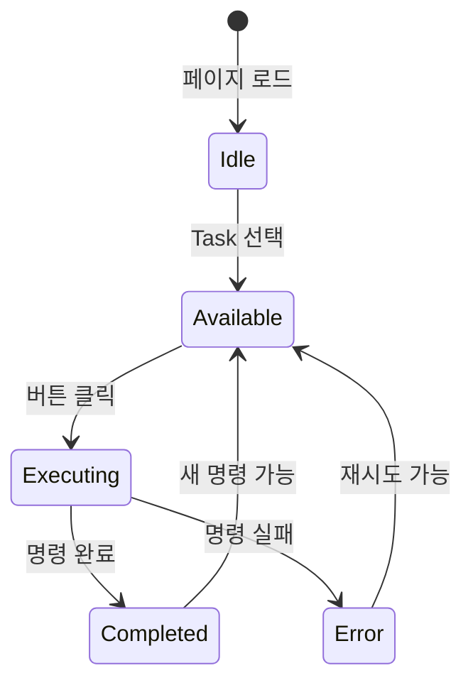

# 화면설계 (011-ui-design.md)

**Version:** 1.0.0 — **Last Updated:** 2025-12-17

---

## 0. 문서 메타데이터

| 항목 | 내용 |
|------|------|
| Task ID | TSK-02-01 |
| Task명 | 워크플로우 액션 UI |
| Category | development |
| 상태 | [bd] 기본설계 |
| 작성일 | 2025-12-17 |
| 작성자 | Claude |

---

## 1. 화면 목록

| 화면 ID | 화면명 | 설명 |
|---------|--------|------|
| SCR-01 | WorkflowActions | 워크플로우 버튼 그룹 전체 |
| SCR-02 | WorkflowButton 상태별 | 버튼 4가지 상태 변화 |

---

## 2. 화면 흐름



---

## 3. 화면 상세 설계

### SCR-01: WorkflowActions

**위치**: TaskDetailPanel 하단

**레이아웃**:
```
┌─────────────────────────────────────────────────────────────────┐
│ 워크플로우                                                       │
├─────────────────────────────────────────────────────────────────┤
│ ┌────────────────────────────────────────────────────────────┐  │
│ │ 명령어 버튼 그룹 (flex wrap, gap-2)                          │  │
│ │                                                            │  │
│ │  [시작]  [UI설계]  [상세설계]  [리뷰]  [적용]  [구현]          │  │
│ │  [테스트]  [코드리뷰]  [패치]  [검증]  [완료]                  │  │
│ │  [수정]  [생략]                                             │  │
│ │                                                            │  │
│ └────────────────────────────────────────────────────────────┘  │
│                                                                 │
│ ─────────────────────── Divider ───────────────────────────     │
│                                                                 │
│ ┌────────────────────────────────────────────────────────────┐  │
│ │ 자동실행 (flex, gap-2)                                       │  │
│ │                                                            │  │
│ │  [▶ Run]  [▶▶ Auto]  [■ 중지]                                │  │
│ │                                                            │  │
│ └────────────────────────────────────────────────────────────┘  │
└─────────────────────────────────────────────────────────────────┘
```

**CSS 클래스**:
```css
.workflow-actions {
  @apply p-4 surface-ground border-round;
}
.workflow-buttons {
  @apply flex flex-wrap gap-2 mb-3;
}
.workflow-auto-buttons {
  @apply flex gap-2;
}
```

---

### SCR-02: WorkflowButton 상태별

**버튼 상태 4가지**:

| 상태 | severity | disabled | loading | 스타일 |
|------|----------|----------|---------|--------|
| 사용 가능 | 명령어별 | false | false | 활성 버튼 |
| 사용 불가 | secondary | true | false | 흐린 버튼 + 커서 not-allowed |
| 실행 중 | 명령어별 | true | true | 스피너 표시 |
| 완료 | success | false | false | 체크 아이콘 (일시) |

**버튼 레이아웃**:
```
┌─────────────────────────┐
│  [아이콘]  라벨           │
│   16px    텍스트          │
└─────────────────────────┘
```

**버튼 크기**: `size="small"` (PrimeVue)

---

## 4. 컴포넌트별 상세

### 4.1 WorkflowActions

**Props**:
| Prop | Type | Required | Default | 설명 |
|------|------|----------|---------|------|
| task | WbsTask | Yes | - | 현재 Task 정보 |
| isExecuting | boolean | No | false | 실행 중 여부 |

**Events**:
| Event | Payload | 설명 |
|-------|---------|------|
| execute | `{ command: string }` | 명령어 실행 요청 |

**Slots**:
- 없음

---

### 4.2 WorkflowButton

**Props**:
| Prop | Type | Required | Default | 설명 |
|------|------|----------|---------|------|
| command | WorkflowCommand | Yes | - | 명령어 정보 |
| disabled | boolean | No | false | 비활성 여부 |
| loading | boolean | No | false | 로딩 여부 |

**Events**:
| Event | Payload | 설명 |
|-------|---------|------|
| click | - | 버튼 클릭 |

**Tooltip**:
- disabled 상태: "현재 상태에서 사용할 수 없습니다"
- 정상 상태: 없음

---

### 4.3 WorkflowAutoActions

**Props**:
| Prop | Type | Required | Default | 설명 |
|------|------|----------|---------|------|
| isExecuting | boolean | No | false | 실행 중 여부 |

**Events**:
| Event | Payload | 설명 |
|-------|---------|------|
| run | - | Run 버튼 클릭 |
| auto | - | Auto 버튼 클릭 |
| stop | - | 중지 버튼 클릭 |

---

## 5. 상태별 화면 변화

### 5.1 category: development, status: [ ]

```
활성:   [시작]
비활성: [UI설계] [상세설계] [리뷰] [적용] [구현] [테스트]
        [코드리뷰] [패치] [검증] [완료] [수정] [생략]
```

### 5.2 category: development, status: [bd]

```
활성:   [UI설계] [상세설계]
비활성: [시작] [리뷰] [적용] [구현] [테스트]
        [코드리뷰] [패치] [검증] [완료] [수정] [생략]
```

### 5.3 category: development, status: [dd]

```
활성:   [리뷰] [적용] [구현]
비활성: [시작] [UI설계] [상세설계] [테스트]
        [코드리뷰] [패치] [검증] [완료] [수정] [생략]
```

### 5.4 category: development, status: [im]

```
활성:   [테스트] [코드리뷰] [패치] [검증]
비활성: [시작] [UI설계] [상세설계] [리뷰] [적용] [구현]
        [완료] [수정] [생략]
```

### 5.5 category: defect, status: [an]

```
활성:   [수정]
비활성: 나머지 전부
```

### 5.6 category: infrastructure, status: [ ]

```
활성:   [시작] [생략]
비활성: 나머지 전부
```

---

## 6. 반응형 설계

| Breakpoint | 레이아웃 변화 |
|------------|--------------|
| >= 1024px | 한 줄에 7~8개 버튼 |
| 768~1023px | 한 줄에 5~6개 버튼 |
| < 768px | 한 줄에 3~4개 버튼 |

`flex-wrap` 적용으로 자동 줄바꿈

---

## 7. 접근성 설계

| 항목 | 구현 |
|------|------|
| 키보드 네비게이션 | Tab으로 버튼 이동 |
| ARIA 레이블 | `aria-label="워크플로우 {명령어} 실행"` |
| 비활성 피드백 | `aria-disabled="true"`, tooltip |
| 로딩 상태 | `aria-busy="true"` |
| 포커스 표시 | PrimeVue 기본 포커스 링 |

---

## 8. SVG 와이어프레임

### 8.1 WorkflowActions 전체 레이아웃

파일: `ui-assets/workflow-actions.svg`

```
기본 상태 (development, status: [bd])
- UI설계, 상세설계 버튼 활성
- 나머지 버튼 비활성 (흐림)
- 자동실행 버튼 그룹 하단
```

---

## 9. 관련 문서

- 기본설계: `010-basic-design.md`
- PRD 섹션 3.3~3.5: 워크플로우 액션 바
- TRD 섹션 5.3: WorkflowActions 컴포넌트

---

<!--
author: Claude
Version: 1.0.0
-->
