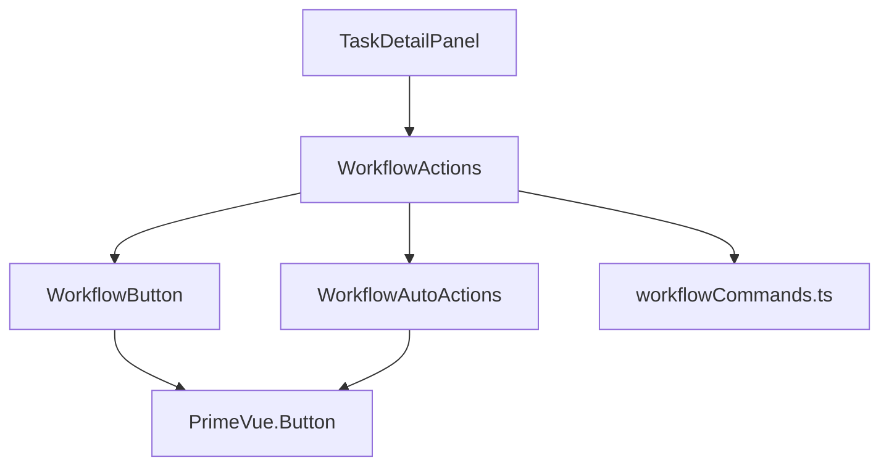
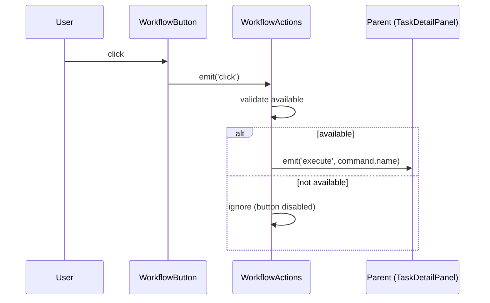
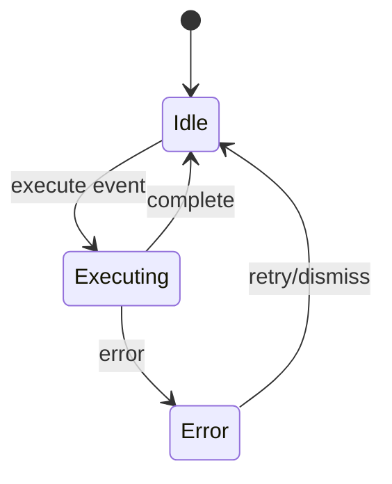

# 상세설계 (020-detail-design.md)

**Version:** 1.0.0 — **Last Updated:** 2025-12-17

---

## 0. 문서 메타데이터

| 항목 | 내용 |
|------|------|
| Task ID | TSK-02-01 |
| Task명 | 워크플로우 액션 UI |
| Category | development |
| 상태 | [dd] 상세설계 |
| 작성일 | 2025-12-17 |
| 작성자 | Claude |

### 상위 문서 참조

| 문서 유형 | 경로 | 참조 섹션 |
|----------|------|----------|
| 기본설계 | `010-basic-design.md` | 전체 |
| 화면설계 | `011-ui-design.md` | 섹션 3, 4 |
| PRD | `.jjiban/projects/jjiban개선/prd.md` | 섹션 2.2, 3.3~3.5 |
| TRD | `.jjiban/projects/jjiban개선/trd.md` | 섹션 5.3, 6 |

---

## 1. 모듈 구조

### 1.1 디렉토리 구조

```
app/components/workflow/
├── WorkflowActions.vue       # 워크플로우 액션 컨테이너
├── WorkflowButton.vue        # 개별 명령어 버튼
└── WorkflowAutoActions.vue   # 자동실행 버튼 그룹

app/utils/
└── workflowCommands.ts       # 명령어 정의 상수
```

### 1.2 의존성 관계



---

## 2. 타입 정의

### 2.1 WorkflowCommand 인터페이스

| 필드 | 타입 | 필수 | 설명 |
|------|------|------|------|
| name | string | Yes | 명령어 식별자 (예: 'start', 'build') |
| label | string | Yes | 버튼 표시 텍스트 |
| icon | string | Yes | PrimeIcons 클래스명 |
| severity | ButtonSeverity | Yes | PrimeVue Button severity |
| availableStatuses | string[] | Yes | 사용 가능한 상태 코드 목록 |
| categories | TaskCategory[] | Yes | 사용 가능한 카테고리 목록 |

### 2.2 ButtonSeverity 타입

| 값 | 용도 |
|---|------|
| 'primary' | 주요 명령어 (start) |
| 'info' | 설계 명령어 (ui, draft) |
| 'secondary' | 보조 명령어 (review, apply, test, audit, patch, skip) |
| 'warning' | 구현 명령어 (build) |
| 'success' | 완료 명령어 (verify, done) |
| 'danger' | 수정 명령어 (fix) |

### 2.3 TaskCategory 타입

| 값 | 설명 |
|---|------|
| 'development' | 개발 Task |
| 'defect' | 결함 Task |
| 'infrastructure' | 인프라 Task |

---

## 3. 컴포넌트 상세 설계

### 3.1 WorkflowActions

**역할**: 워크플로우 명령어 버튼 그룹 컨테이너

#### Props

| Prop | Type | Required | Default | 설명 |
|------|------|----------|---------|------|
| task | WbsTask | Yes | - | 현재 Task 정보 (status, category 포함) |
| isExecuting | boolean | No | false | 명령어 실행 중 여부 |
| executingCommand | string \| null | No | null | 현재 실행 중인 명령어 이름 |

#### Events

| Event | Payload | 설명 |
|-------|---------|------|
| execute | string | 실행할 명령어 이름 |

#### Computed Properties

| 이름 | 반환 타입 | 설명 |
|------|----------|------|
| filteredCommands | FilteredCommand[] | 가용성 필터링된 명령어 목록 |

#### FilteredCommand 구조

| 필드 | 타입 | 설명 |
|------|------|------|
| ...WorkflowCommand | - | 기본 명령어 정보 |
| available | boolean | 현재 상태/카테고리에서 사용 가능 여부 |

---

### 3.2 WorkflowButton

**역할**: 개별 워크플로우 명령어 버튼

#### Props

| Prop | Type | Required | Default | 설명 |
|------|------|----------|---------|------|
| command | WorkflowCommand | Yes | - | 명령어 정보 |
| disabled | boolean | No | false | 비활성 여부 |
| loading | boolean | No | false | 로딩 상태 |

#### Events

| Event | Payload | 설명 |
|-------|---------|------|
| click | - | 버튼 클릭 |

#### 렌더링 로직

| 조건 | severity | disabled | loading |
|------|----------|----------|---------|
| 사용 가능 | command.severity | false | false |
| 사용 불가 | 'secondary' | true | false |
| 실행 중 | command.severity | true | true |

---

### 3.3 WorkflowAutoActions

**역할**: 자동실행 버튼 그룹 (run, auto, stop)

#### Props

| Prop | Type | Required | Default | 설명 |
|------|------|----------|---------|------|
| isExecuting | boolean | No | false | 실행 중 여부 |

#### Events

| Event | Payload | 설명 |
|-------|---------|------|
| run | - | Run 버튼 클릭 |
| auto | - | Auto 버튼 클릭 |
| stop | - | 중지 버튼 클릭 |

#### 버튼 구성

| 버튼 | label | icon | severity | 조건 |
|------|-------|------|----------|------|
| Run | Run | pi-play | success | 항상 표시 |
| Auto | Auto | pi-forward | info | 항상 표시 |
| 중지 | 중지 | pi-stop | danger | isExecuting=true 일 때만 표시 |

---

## 4. 명령어 정의 상수

### 4.1 WORKFLOW_COMMANDS 배열

| name | label | icon | severity | availableStatuses | categories |
|------|-------|------|----------|-------------------|------------|
| start | 시작 | pi-play | primary | `[ ]` | all |
| ui | UI설계 | pi-palette | info | `[bd]` | development |
| draft | 상세설계 | pi-pencil | info | `[bd]` | development |
| review | 리뷰 | pi-eye | secondary | `[dd]` | development |
| apply | 적용 | pi-check | secondary | `[dd]` | development |
| build | 구현 | pi-wrench | warning | `[dd]` | development, infrastructure |
| test | 테스트 | pi-bolt | secondary | `[im]` | development |
| audit | 코드리뷰 | pi-search | secondary | `[im]`, `[fx]` | all |
| patch | 패치 | pi-file-edit | secondary | `[im]`, `[fx]` | all |
| verify | 검증 | pi-verified | success | `[im]`, `[fx]` | development, defect |
| done | 완료 | pi-check-circle | success | `[vf]`, `[im]` | all |
| fix | 수정 | pi-wrench | danger | `[an]` | defect |
| skip | 생략 | pi-forward | secondary | `[ ]` | infrastructure |

### 4.2 isCommandAvailable 함수

**입력**

| 파라미터 | 타입 | 설명 |
|----------|------|------|
| command | WorkflowCommand | 검사할 명령어 |
| status | string | Task 현재 상태 |
| category | TaskCategory | Task 카테고리 |

**출력**: boolean

**로직**:
1. command.availableStatuses에 status 포함 여부 확인
2. command.categories에 category 포함 여부 확인
3. 둘 다 true일 때만 true 반환

---

## 5. 상태 흐름

### 5.1 버튼 클릭 시퀀스



### 5.2 실행 상태 변화



---

## 6. 스타일 설계

### 6.1 CSS 클래스 구조

| 클래스 | 적용 대상 | Tailwind 클래스 |
|--------|----------|-----------------|
| workflow-actions | 컨테이너 | p-4 surface-ground border-round |
| workflow-buttons | 버튼 그룹 | flex flex-wrap gap-2 mb-3 |
| workflow-auto-buttons | 자동실행 그룹 | flex gap-2 |

### 6.2 버튼 스타일

| 속성 | 값 |
|------|---|
| size | small |
| outlined | false (기본) |
| rounded | false |

---

## 7. 접근성 구현

### 7.1 ARIA 속성

| 컴포넌트 | 속성 | 값 |
|----------|------|---|
| WorkflowButton | aria-label | `워크플로우 ${label} 실행` |
| WorkflowButton (disabled) | aria-disabled | true |
| WorkflowButton (loading) | aria-busy | true |
| WorkflowActions | role | group |
| WorkflowActions | aria-label | 워크플로우 명령어 |

### 7.2 키보드 네비게이션

| 키 | 동작 |
|---|------|
| Tab | 다음 버튼으로 이동 |
| Shift+Tab | 이전 버튼으로 이동 |
| Enter/Space | 버튼 클릭 |

---

## 8. 일관성 검증

### 8.1 CHK-PRD (PRD ↔ 기본설계)

| 항목 | PRD | 기본설계 | 결과 |
|------|-----|----------|------|
| 명령어 개수 | 15개 (2.1) | 13개 (run/auto 제외) | ✅ PASS |
| 가용성 규칙 | 2.2 | 3.4 | ✅ PASS |
| 버튼 상태 | 3.5 | FR-003 | ✅ PASS |

### 8.2 CHK-BD (기본설계 ↔ 상세설계)

| 항목 | 기본설계 | 상세설계 | 결과 |
|------|----------|----------|------|
| 컴포넌트 구조 | 3.1 | 1.2 | ✅ PASS |
| Props/Events | 3.2 | 섹션 3 | ✅ PASS |
| 명령어 정의 | 3.3 | 4.1 | ✅ PASS |

### 8.3 CHK-UI (화면설계 ↔ 상세설계)

| 항목 | 화면설계 | 상세설계 | 결과 |
|------|----------|----------|------|
| 레이아웃 | SCR-01 | 6.1 | ✅ PASS |
| Props | 4.1~4.3 | 섹션 3 | ✅ PASS |
| 접근성 | 섹션 7 | 섹션 7 | ✅ PASS |

---

## 9. 관련 문서

- 기본설계: `010-basic-design.md`
- 화면설계: `011-ui-design.md`
- 추적성 매트릭스: `025-traceability-matrix.md`
- 테스트 명세: `026-test-specification.md`

---

<!--
author: Claude
Version: 1.0.0
-->
