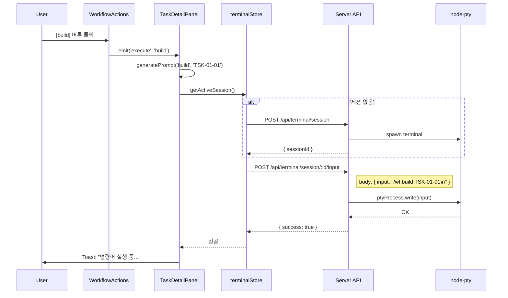
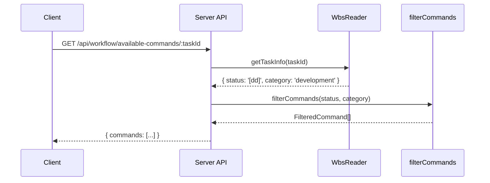

# 기본설계 (010-basic-design.md)

**Template Version:** 1.0.0 — **Last Updated:** 2025-12-17

---

## 0. 문서 메타데이터

| 항목 | 내용 |
|------|------|
| Task ID | TSK-02-02 |
| Task명 | 워크플로우 프롬프트 생성 |
| Category | development |
| 상태 | [bd] 기본설계 |
| 작성일 | 2025-12-17 |
| 작성자 | Claude |

### 상위 문서 참조

| 문서 유형 | 경로 | 참조 섹션 |
|----------|------|----------|
| PRD | `.jjiban/projects/jjiban개선/prd.md` | 섹션 1.4, 2.1, 2.2 |
| TRD | `.jjiban/projects/jjiban개선/trd.md` | 섹션 4, 5 |

---

## 1. 목적 및 범위

### 1.1 목적

워크플로우 버튼 클릭 시 프롬프트 문자열(`/wf:<command> <taskId>`)을 생성하여 터미널 세션에 자동 입력함으로써, 사용자가 수동으로 명령어를 타이핑하지 않고 원클릭으로 워크플로우를 실행할 수 있도록 합니다.

### 1.2 범위

**포함 범위**:
- 워크플로우 버튼 클릭 시 프롬프트 문자열 생성 로직
- 터미널 세션에 프롬프트 자동 입력 기능
- GET /api/workflow/available-commands/:taskId API (상태/카테고리 기반 필터링)
- WorkflowActions 컴포넌트의 execute 이벤트 처리

**제외 범위**:
- 터미널 세션 관리 → TSK-01-03 (이미 구현됨)
- 실행 상태 관리 → TSK-03-01, TSK-03-02 (이미 구현됨)
- 타입 정의 및 스토어 → TSK-02-03
- 워크플로우 명령어 훅 → TSK-03-03

---

## 2. 요구사항 분석

### 2.1 기능 요구사항

| ID | 요구사항 | 우선순위 | PRD 참조 |
|----|----------|----------|----------|
| FR-001 | 버튼 클릭 시 프롬프트 문자열 생성 (`/wf:build TSK-01-01`) | High | 섹션 1.4 |
| FR-002 | 터미널 세션에 프롬프트 입력 전송 (POST /api/terminal/session/:id/input) | High | 섹션 4.3 |
| FR-003 | Task 상태/카테고리 기반 사용 가능 명령어 필터링 API | High | 섹션 2.2, 4.4 |
| FR-004 | 터미널 세션이 없는 경우 자동 생성 | Medium | - |
| FR-005 | 명령어 실행 실패 시 에러 처리 | Medium | - |

### 2.2 비기능 요구사항

| ID | 요구사항 | 기준 |
|----|----------|------|
| NFR-001 | 프롬프트 생성 및 전송 응답 시간 | < 200ms |
| NFR-002 | API 응답 시간 | < 100ms |
| NFR-003 | 에러 메시지 명확성 | 사용자 친화적 메시지 |

---

## 3. 설계 방향

### 3.1 아키텍처 개요

```
┌────────────────────────────────────────────────────────┐
│ WorkflowActions                                         │
│   ↓ execute 이벤트 ('build')                            │
├────────────────────────────────────────────────────────┤
│ TaskDetailPanel                                         │
│   1. 프롬프트 생성: "/wf:build TSK-01-01"               │
│   2. 터미널 세션 확인/생성                               │
│   3. POST /api/terminal/session/:id/input               │
├────────────────────────────────────────────────────────┤
│ Server: Terminal API                                    │
│   → node-pty로 터미널에 입력 전송                       │
│   → 사용자가 Enter 누른 것처럼 동작                      │
└────────────────────────────────────────────────────────┘
```

### 3.2 핵심 로직

#### 3.2.1 프롬프트 문자열 생성

**입력**:
- commandName: string (예: 'build')
- taskId: string (예: 'TSK-01-01')

**출력**:
- prompt: string (예: '/wf:build TSK-01-01\n')

**규칙**:
- 형식: `/wf:<command> <taskId>\n`
- 자동실행 명령어는 다른 형식 사용:
  - run: `/wf:run\n` (taskId 불필요)
  - auto: `/wf:auto <taskId>\n`

#### 3.2.2 터미널 입력 전송

**전제 조건**:
- 터미널 세션이 존재하고 'connected' 상태여야 함
- 세션이 없으면 자동 생성

**프로세스**:
1. terminalStore에서 activeSessionId 확인
2. 세션 없으면 → createSession(taskId, projectId)
3. 세션 있으면 → sendInput(sessionId, prompt)

#### 3.2.3 사용 가능 명령어 필터링 API

**목적**: 서버 측에서 Task 상태/카테고리를 읽어 클라이언트가 요청 시 필터링된 명령어 목록 제공

**필요성**:
- wbs.md 파일 읽기는 서버에서만 가능
- 클라이언트는 항상 최신 상태 기반 필터링 필요

---

## 4. 사용자 시나리오

### 4.1 정상 흐름 (Happy Path)

```
시나리오: 사용자가 워크플로우 버튼 클릭으로 명령어 실행

1. 사용자: TSK-01-01 Task 상세 패널 열기
2. 시스템: Task 상태 [dd], 카테고리 development 확인
3. 시스템: WorkflowActions에 'build' 버튼 활성화 표시
4. 사용자: [구현] 버튼 클릭
5. 시스템: 프롬프트 생성 "/wf:build TSK-01-01\n"
6. 시스템: 터미널 세션 확인 (activeSessionId 존재)
7. 시스템: POST /api/terminal/session/:id/input 호출
8. 시스템: 터미널에 명령어 자동 입력 및 실행
9. 사용자: 터미널 다이얼로그에서 실행 결과 확인
```

### 4.2 대안 흐름 (터미널 세션 없음)

```
시나리오: 터미널 세션이 없는 상태에서 버튼 클릭

1-5. (정상 흐름과 동일)
6. 시스템: 터미널 세션 없음 감지
7. 시스템: POST /api/terminal/session 호출 (세션 생성)
8. 시스템: 생성된 sessionId로 activeSessionId 설정
9. 시스템: POST /api/terminal/session/:id/input 호출
10. 시스템: 터미널에 명령어 자동 입력 및 실행
```

### 4.3 에러 흐름 (세션 생성 실패)

```
시나리오: 터미널 세션 생성 실패

1-7. (대안 흐름과 동일)
8. 시스템: 세션 생성 실패 (서버 에러)
9. 시스템: Toast 에러 메시지 표시 "터미널 세션 생성 실패"
10. 사용자: 다시 시도 또는 수동 터미널 열기
```

---

## 5. 비즈니스 규칙

### 5.1 프롬프트 생성 규칙

| 명령어 타입 | 형식 | 예시 |
|------------|------|------|
| 일반 명령어 | `/wf:<command> <taskId>` | `/wf:build TSK-01-01` |
| run 명령어 | `/wf:run` | `/wf:run` |
| auto 명령어 | `/wf:auto <taskId>` | `/wf:auto TSK-01-01` |

### 5.2 세션 관리 규칙

| 상황 | 동작 |
|------|------|
| activeSessionId 없음 | 자동으로 새 세션 생성 |
| activeSessionId 있음 | 기존 세션 재사용 |
| 세션 상태 'connected' 아님 | 세션 재생성 |

### 5.3 명령어 필터링 규칙

PRD 섹션 2.2 참조 (카테고리별 명령어 가용성)

---

## 6. 데이터 흐름

### 6.1 프롬프트 전송 시퀀스



### 6.2 available-commands API 흐름



---

## 7. 기술적 결정

| 결정 | 고려 옵션 | 선택 | 근거 |
|------|----------|------|------|
| 프롬프트 전송 방식 | WebSocket, SSE, REST API | REST API (POST) | PRD 4.2 - SSE는 출력용, 입력은 POST |
| 세션 자동 생성 | 수동/자동 | 자동 생성 | 사용자 편의성 향상 |
| 명령어 필터링 위치 | 클라이언트/서버 | 서버 + 클라이언트 | 서버 API로 최신 상태 보장, 클라이언트는 로컬 필터링 |
| 에러 처리 | Alert, Toast, Modal | Toast | 비침습적, 일시적 알림 |

---

## 8. 인수 기준

- [ ] AC-01: 'build' 버튼 클릭 시 `/wf:build TSK-01-01\n` 프롬프트가 생성된다
- [ ] AC-02: 터미널 세션이 없으면 자동으로 세션을 생성한다
- [ ] AC-03: 생성된 프롬프트가 터미널에 자동 입력된다
- [ ] AC-04: GET /api/workflow/available-commands/:taskId가 필터링된 명령어 목록을 반환한다
- [ ] AC-05: 세션 생성 실패 시 에러 Toast가 표시된다
- [ ] AC-06: run/auto 명령어는 올바른 형식으로 프롬프트가 생성된다

---

## 9. 리스크 및 의존성

### 9.1 리스크

| 리스크 | 영향 | 완화 방안 |
|--------|------|----------|
| 터미널 세션 타임아웃 | Medium | 세션 상태 확인 후 재생성 |
| 네트워크 지연 | Low | 로딩 스피너 표시 |
| 명령어 실행 실패 | High | 에러 메시지 + 재시도 옵션 |

### 9.2 의존성

| 의존 대상 | 유형 | 설명 |
|----------|------|------|
| TSK-01-03 | 선행 완료 | 터미널 세션 API 필수 |
| TSK-02-01 | 선행 완료 | WorkflowActions 컴포넌트 필수 |
| terminalStore | 동시 개발 | TSK-02-03에서 정의 예정 |

---

## 10. 다음 단계

- `/wf:draft` 명령어로 상세설계 진행
- 020-detail-design.md에서 API 스키마, 컴포넌트 로직 상세 정의

---

## 관련 문서

- PRD: `.jjiban/projects/jjiban개선/prd.md`
- TRD: `.jjiban/projects/jjiban개선/trd.md`
- 선행 Task: `../TSK-02-01/`
- 상세설계: `020-detail-design.md` (다음 단계)

---

<!--
author: Claude
Template Version: 1.0.0
-->
