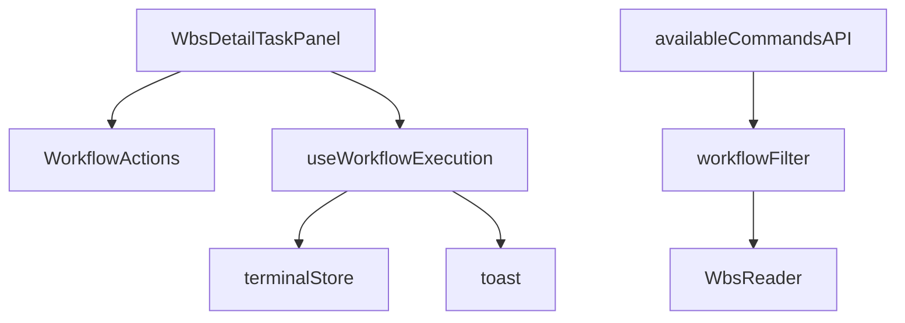
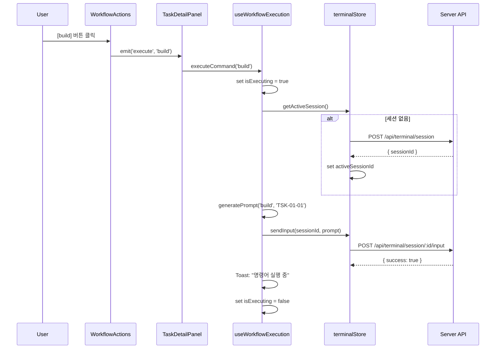
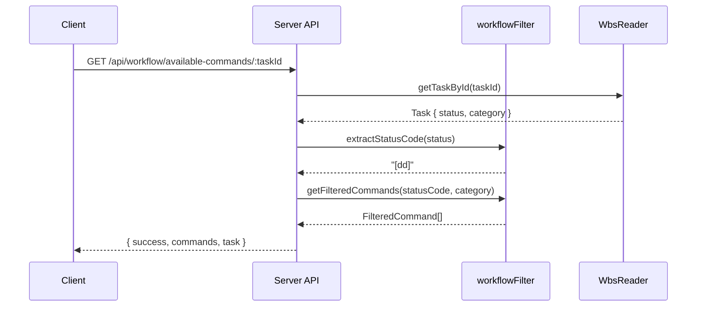

# 상세설계 (020-detail-design.md)

**Version:** 1.0.0 — **Last Updated:** 2025-12-17

---

## 0. 문서 메타데이터

| 항목 | 내용 |
|------|------|
| Task ID | TSK-02-02 |
| Task명 | 워크플로우 프롬프트 생성 |
| Category | development |
| 상태 | [dd] 상세설계 |
| 작성일 | 2025-12-17 |
| 작성자 | Claude |

### 상위 문서 참조

| 문서 유형 | 경로 | 참조 섹션 |
|----------|------|----------|
| 기본설계 | `010-basic-design.md` | 전체 |
| PRD | `.jjiban/projects/jjiban개선/prd.md` | 섹션 1.4, 4.3, 4.4 |
| TRD | `.jjiban/projects/jjiban개선/trd.md` | 섹션 4, 5 |

---

## 1. 모듈 구조

### 1.1 디렉토리 구조

```
app/components/wbs/detail/
└── WbsDetailTaskPanel.vue          # 수정: execute 이벤트 처리 추가

app/composables/
└── useWorkflowExecution.ts         # 신규: 워크플로우 실행 로직

server/api/workflow/
└── available-commands/
    └── [taskId].get.ts              # 신규: 사용 가능 명령어 API

server/utils/
└── workflowFilter.ts                # 신규: 명령어 필터링 로직
```

### 1.2 의존성 관계



---

## 2. 타입 정의

### 2.1 Composable 타입

```typescript
// app/composables/useWorkflowExecution.ts

interface WorkflowExecutionOptions {
  /** Task ID */
  taskId: string
  /** 프로젝트 ID */
  projectId: string
  /** Toast 사용 여부 */
  useToast?: boolean
}

interface WorkflowExecutionResult {
  /** 명령어 실행 함수 */
  executeCommand: (commandName: string) => Promise<void>
  /** 실행 중 여부 */
  isExecuting: Ref<boolean>
  /** 현재 실행 중인 명령어 */
  executingCommand: Ref<string | null>
  /** 에러 메시지 */
  error: Ref<string | null>
}
```

### 2.2 API 타입

```typescript
// types/api.ts

interface AvailableCommandsRequest {
  taskId: string
}

interface AvailableCommandsResponse {
  success: boolean
  commands: FilteredCommand[]
  task?: {
    status: string
    category: TaskCategory
  }
  error?: string
}

interface TerminalInputRequest {
  input: string
}

interface TerminalInputResponse {
  success: boolean
  error?: string
}
```

---

## 3. Composable 상세 설계

### 3.1 useWorkflowExecution

**역할**: 워크플로우 명령어 실행 로직 캡슐화

#### 3.1.1 함수 시그니처

```typescript
export function useWorkflowExecution(
  options: WorkflowExecutionOptions
): WorkflowExecutionResult
```

#### 3.1.2 내부 상태

| 상태 | 타입 | 초기값 | 설명 |
|------|------|--------|------|
| isExecuting | Ref\<boolean\> | false | 명령어 실행 중 여부 |
| executingCommand | Ref\<string \| null\> | null | 현재 실행 중인 명령어 |
| error | Ref\<string \| null\> | null | 에러 메시지 |

#### 3.1.3 generatePrompt 함수

**목적**: 명령어와 taskId로 프롬프트 문자열 생성

```typescript
function generatePrompt(commandName: string, taskId: string): string {
  // run 명령어는 taskId 불필요
  if (commandName === 'run') {
    return '/wf:run\n'
  }

  // auto 명령어
  if (commandName === 'auto') {
    return `/wf:auto ${taskId}\n`
  }

  // 일반 명령어
  return `/wf:${commandName} ${taskId}\n`
}
```

**입출력 예시**:

| commandName | taskId | 출력 |
|-------------|--------|------|
| 'build' | 'TSK-01-01' | `/wf:build TSK-01-01\n` |
| 'start' | 'TSK-02-01' | `/wf:start TSK-02-01\n` |
| 'run' | 'TSK-01-01' | `/wf:run\n` |
| 'auto' | 'TSK-01-01' | `/wf:auto TSK-01-01\n` |

#### 3.1.4 ensureSession 함수

**목적**: 터미널 세션 존재 확인 및 자동 생성

```typescript
async function ensureSession(): Promise<string | null> {
  const terminalStore = useTerminalStore()

  // 1. activeSessionId 확인
  if (terminalStore.activeSessionId) {
    const session = terminalStore.sessions.get(terminalStore.activeSessionId)

    // 세션 상태 확인
    if (session && session.status === 'connected') {
      return terminalStore.activeSessionId
    }
  }

  // 2. 세션 없으면 생성
  try {
    const sessionId = await terminalStore.createSession(
      options.taskId,
      options.projectId
    )
    return sessionId
  } catch (err) {
    error.value = '터미널 세션 생성 실패'
    return null
  }
}
```

**반환값**:
- 성공: sessionId (string)
- 실패: null

#### 3.1.5 executeCommand 함수

**목적**: 명령어 실행 전체 프로세스 관리

```typescript
async function executeCommand(commandName: string): Promise<void> {
  // 1. 실행 중이면 무시
  if (isExecuting.value) {
    console.warn('Already executing a command')
    return
  }

  // 2. 상태 설정
  isExecuting.value = true
  executingCommand.value = commandName
  error.value = null

  try {
    // 3. 세션 확보
    const sessionId = await ensureSession()
    if (!sessionId) {
      throw new Error('세션 생성 실패')
    }

    // 4. 프롬프트 생성
    const prompt = generatePrompt(commandName, options.taskId)

    // 5. 터미널 입력 전송
    await terminalStore.sendInput(sessionId, prompt)

    // 6. 성공 Toast
    if (options.useToast !== false) {
      const toast = useToast()
      toast.add({
        severity: 'info',
        summary: '명령어 실행 중',
        detail: `워크플로우 ${commandName} 실행 중...`,
        life: 3000
      })
    }

  } catch (err) {
    // 7. 에러 처리
    error.value = err.message || '명령어 실행 실패'

    if (options.useToast !== false) {
      const toast = useToast()
      toast.add({
        severity: 'error',
        summary: '실행 실패',
        detail: error.value,
        life: 5000
      })
    }

  } finally {
    // 8. 상태 초기화
    isExecuting.value = false
    executingCommand.value = null
  }
}
```

---

## 4. 컴포넌트 수정

### 4.1 WbsDetailTaskPanel.vue

**수정 내용**: WorkflowActions의 execute 이벤트 처리 추가

#### 4.1.1 새로운 Imports

```typescript
import { useWorkflowExecution } from '~/composables/useWorkflowExecution'
```

#### 4.1.2 Composable 사용

```typescript
// selectedTask가 있을 때만 초기화
const workflowExecution = computed(() => {
  if (!selectedTask.value) return null

  return useWorkflowExecution({
    taskId: selectedTask.value.id,
    projectId: selectedTask.value.projectId || 'jjiban',
    useToast: true
  })
})
```

#### 4.1.3 이벤트 핸들러

```typescript
/**
 * WorkflowActions의 execute 이벤트 처리
 */
async function handleWorkflowExecute(commandName: string) {
  if (!workflowExecution.value) return

  await workflowExecution.value.executeCommand(commandName)
}

/**
 * WorkflowActions의 run 이벤트 처리
 */
async function handleWorkflowRun() {
  if (!workflowExecution.value) return

  await workflowExecution.value.executeCommand('run')
}

/**
 * WorkflowActions의 auto 이벤트 처리
 */
async function handleWorkflowAuto() {
  if (!workflowExecution.value) return

  await workflowExecution.value.executeCommand('auto')
}

/**
 * WorkflowActions의 stop 이벤트 처리
 */
async function handleWorkflowStop() {
  // TSK-03-03에서 구현 예정
  console.log('Stop workflow execution')
}
```

#### 4.1.4 Template 수정

```vue
<template>
  <div class="wbs-detail-task-panel">
    <!-- 기존 섹션들 -->
    <WbsDetailTaskBasicInfo ... />
    <WbsDetailTaskProgress ... />
    <WbsDetailTaskDocuments ... />
    <WbsDetailTaskHistory ... />

    <!-- WorkflowActions: 이벤트 핸들러 추가 -->
    <WorkflowActions
      v-if="selectedTask"
      :task="selectedTask"
      :is-executing="workflowExecution?.isExecuting.value || false"
      :executing-command="workflowExecution?.executingCommand.value || null"
      @execute="handleWorkflowExecute"
      @run="handleWorkflowRun"
      @auto="handleWorkflowAuto"
      @stop="handleWorkflowStop"
    />
  </div>
</template>
```

---

## 5. Server API 설계

### 5.1 GET /api/workflow/available-commands/:taskId

**목적**: Task 상태/카테고리에 따른 사용 가능 명령어 목록 반환

#### 5.1.1 파일 경로

```
server/api/workflow/available-commands/[taskId].get.ts
```

#### 5.1.2 구현

```typescript
import { defineEventHandler, getRouterParam } from 'h3'
import { getFilteredCommands } from '~/server/utils/workflowFilter'
import type { AvailableCommandsResponse } from '~/types/api'

export default defineEventHandler(async (event): Promise<AvailableCommandsResponse> => {
  try {
    // 1. taskId 추출
    const taskId = getRouterParam(event, 'taskId')

    if (!taskId) {
      return {
        success: false,
        commands: [],
        error: 'taskId is required'
      }
    }

    // 2. Task 정보 조회 (WbsReader 사용)
    const wbsReader = new WbsReader()
    const task = await wbsReader.getTaskById(taskId)

    if (!task) {
      return {
        success: false,
        commands: [],
        error: `Task not found: ${taskId}`
      }
    }

    // 3. 상태 코드 추출
    const statusCode = extractStatusCode(task.status)
    const category = task.category || 'development'

    // 4. 필터링된 명령어 목록 생성
    const commands = getFilteredCommands(statusCode, category)

    // 5. 응답 반환
    return {
      success: true,
      commands,
      task: {
        status: statusCode,
        category
      }
    }

  } catch (error) {
    console.error('Error in available-commands API:', error)
    return {
      success: false,
      commands: [],
      error: error.message || 'Internal server error'
    }
  }
})
```

#### 5.1.3 응답 예시

**요청**: `GET /api/workflow/available-commands/TSK-01-01`

**응답** (Task 상태 [dd], category development):

```json
{
  "success": true,
  "commands": [
    {
      "name": "start",
      "label": "시작",
      "icon": "pi-play",
      "severity": "primary",
      "availableStatuses": ["[ ]"],
      "categories": ["development", "defect", "infrastructure"],
      "available": false
    },
    {
      "name": "review",
      "label": "리뷰",
      "icon": "pi-eye",
      "severity": "secondary",
      "availableStatuses": ["[dd]"],
      "categories": ["development"],
      "available": true
    },
    {
      "name": "build",
      "label": "구현",
      "icon": "pi-wrench",
      "severity": "warning",
      "availableStatuses": ["[dd]"],
      "categories": ["development", "infrastructure"],
      "available": true
    }
  ],
  "task": {
    "status": "[dd]",
    "category": "development"
  }
}
```

---

## 6. Server Utils 설계

### 6.1 workflowFilter.ts

**목적**: 명령어 필터링 로직 서버 측 구현

#### 6.1.1 파일 경로

```
server/utils/workflowFilter.ts
```

#### 6.1.2 구현

```typescript
import type { TaskCategory } from '~/types/index'
import type { WorkflowCommand, FilteredCommand } from '~/utils/workflowCommands'

/**
 * 워크플로우 명령어 정의 (server-side)
 * 클라이언트의 WORKFLOW_COMMANDS와 동일한 구조
 */
const WORKFLOW_COMMANDS: WorkflowCommand[] = [
  // ... (app/utils/workflowCommands.ts와 동일)
]

/**
 * 명령어 가용성 검사
 */
function isCommandAvailable(
  command: WorkflowCommand,
  status: string,
  category: TaskCategory
): boolean {
  const statusMatch = command.availableStatuses.includes(status)
  const categoryMatch = command.categories.includes(category)
  return statusMatch && categoryMatch
}

/**
 * 필터링된 명령어 목록 반환
 */
export function getFilteredCommands(
  status: string,
  category: TaskCategory
): FilteredCommand[] {
  return WORKFLOW_COMMANDS.map(command => ({
    ...command,
    available: isCommandAvailable(command, status, category)
  }))
}

/**
 * 상태 코드 추출
 */
export function extractStatusCode(statusString: string): string {
  const match = statusString.match(/\[([^\]]+)\]/)
  return match ? `[${match[1]}]` : '[ ]'
}
```

---

## 7. 상태 흐름

### 7.1 명령어 실행 시퀀스



### 7.2 available-commands API 호출



---

## 8. 에러 처리

### 8.1 에러 시나리오 및 처리

| 에러 시나리오 | HTTP 상태 | 처리 방식 |
|--------------|-----------|-----------|
| taskId 누락 | 400 | 응답에 error 필드 포함 |
| Task 없음 | 404 | 응답에 error 필드 포함 |
| 세션 생성 실패 | - | Toast 에러 메시지, error.value 설정 |
| 터미널 입력 실패 | - | Toast 에러 메시지, error.value 설정 |
| 서버 내부 에러 | 500 | 응답에 error 필드 포함 |

### 8.2 에러 메시지 매핑

```typescript
const ERROR_MESSAGES = {
  SESSION_CREATE_FAILED: '터미널 세션 생성에 실패했습니다.',
  INPUT_SEND_FAILED: '명령어 전송에 실패했습니다.',
  TASK_NOT_FOUND: 'Task를 찾을 수 없습니다.',
  INVALID_TASK_ID: '잘못된 Task ID입니다.',
  ALREADY_EXECUTING: '이미 실행 중인 명령어가 있습니다.',
}
```

---

## 9. 성능 최적화

### 9.1 캐싱 전략

| 대상 | 캐싱 방식 | 만료 조건 |
|------|----------|-----------|
| available-commands API | 없음 (실시간 조회) | - |
| terminalStore 세션 | Pinia state | 브라우저 새로고침 |

### 9.2 응답 시간 목표

| 작업 | 목표 시간 |
|------|----------|
| 프롬프트 생성 | < 10ms |
| 세션 존재 확인 | < 50ms |
| 세션 생성 | < 500ms |
| 터미널 입력 전송 | < 200ms |
| API 응답 (available-commands) | < 100ms |

---

## 10. 테스트 시나리오

### 10.1 단위 테스트

#### 10.1.1 generatePrompt 함수

```typescript
describe('generatePrompt', () => {
  it('일반 명령어 프롬프트 생성', () => {
    expect(generatePrompt('build', 'TSK-01-01'))
      .toBe('/wf:build TSK-01-01\n')
  })

  it('run 명령어 프롬프트 생성', () => {
    expect(generatePrompt('run', 'TSK-01-01'))
      .toBe('/wf:run\n')
  })

  it('auto 명령어 프롬프트 생성', () => {
    expect(generatePrompt('auto', 'TSK-01-01'))
      .toBe('/wf:auto TSK-01-01\n')
  })
})
```

#### 10.1.2 getFilteredCommands 함수

```typescript
describe('getFilteredCommands', () => {
  it('[dd] 상태, development 카테고리', () => {
    const commands = getFilteredCommands('[dd]', 'development')

    expect(commands.find(c => c.name === 'review')?.available).toBe(true)
    expect(commands.find(c => c.name === 'build')?.available).toBe(true)
    expect(commands.find(c => c.name === 'start')?.available).toBe(false)
  })

  it('[ ] 상태, infrastructure 카테고리', () => {
    const commands = getFilteredCommands('[ ]', 'infrastructure')

    expect(commands.find(c => c.name === 'start')?.available).toBe(true)
    expect(commands.find(c => c.name === 'skip')?.available).toBe(true)
    expect(commands.find(c => c.name === 'build')?.available).toBe(false)
  })
})
```

### 10.2 통합 테스트

#### 10.2.1 명령어 실행 E2E

```typescript
describe('워크플로우 명령어 실행', () => {
  it('버튼 클릭 시 터미널에 프롬프트 입력', async () => {
    // 1. Task 선택
    await selectTask('TSK-01-01')

    // 2. 버튼 클릭
    await clickButton('[구현]')

    // 3. 터미널 입력 확인
    expect(terminalInput).toBe('/wf:build TSK-01-01\n')

    // 4. Toast 표시 확인
    expect(toast).toContain('명령어 실행 중')
  })
})
```

#### 10.2.2 available-commands API 테스트

```typescript
describe('GET /api/workflow/available-commands/:taskId', () => {
  it('Task 상태/카테고리에 따른 필터링', async () => {
    const response = await $fetch('/api/workflow/available-commands/TSK-01-01')

    expect(response.success).toBe(true)
    expect(response.task.status).toBe('[dd]')
    expect(response.commands.filter(c => c.available).length).toBeGreaterThan(0)
  })

  it('존재하지 않는 Task', async () => {
    const response = await $fetch('/api/workflow/available-commands/INVALID')

    expect(response.success).toBe(false)
    expect(response.error).toBe('Task not found: INVALID')
  })
})
```

---

## 11. 일관성 검증

### 11.1 CHK-PRD (PRD ↔ 기본설계)

| 항목 | PRD | 기본설계 | 결과 |
|------|-----|----------|------|
| 프롬프트 형식 | 1.4 | 3.2.1 | ✅ PASS |
| 터미널 입력 API | 4.3 | 3.2.2 | ✅ PASS |
| available-commands API | 4.4 | FR-003 | ✅ PASS |

### 11.2 CHK-BD (기본설계 ↔ 상세설계)

| 항목 | 기본설계 | 상세설계 | 결과 |
|------|----------|----------|------|
| 프롬프트 생성 로직 | 3.2.1 | 3.1.3 | ✅ PASS |
| 세션 관리 규칙 | 5.2 | 3.1.4 | ✅ PASS |
| API 구조 | 섹션 3 | 섹션 5 | ✅ PASS |
| 에러 처리 | 4.3 | 섹션 8 | ✅ PASS |

---

## 12. 구현 체크리스트

### 12.1 Composable

- [ ] useWorkflowExecution.ts 생성
- [ ] generatePrompt 함수 구현
- [ ] ensureSession 함수 구현
- [ ] executeCommand 함수 구현
- [ ] 에러 처리 로직 구현

### 12.2 컴포넌트

- [ ] WbsDetailTaskPanel.vue 수정
- [ ] handleWorkflowExecute 핸들러 추가
- [ ] handleWorkflowRun/Auto/Stop 핸들러 추가
- [ ] Template에 이벤트 핸들러 연결

### 12.3 Server API

- [ ] server/api/workflow/available-commands/[taskId].get.ts 생성
- [ ] server/utils/workflowFilter.ts 생성
- [ ] WbsReader 통합
- [ ] 에러 처리 구현

### 12.4 테스트

- [ ] generatePrompt 단위 테스트
- [ ] getFilteredCommands 단위 테스트
- [ ] available-commands API 통합 테스트
- [ ] E2E 테스트 (버튼 클릭 → 터미널 입력)

---

## 13. 관련 문서

- 기본설계: `010-basic-design.md`
- PRD: `.jjiban/projects/jjiban개선/prd.md`
- TRD: `.jjiban/projects/jjiban개선/trd.md`
- 선행 Task: `../TSK-02-01/`
- 후속 Task: `../TSK-02-03/` (타입 및 스토어)

---

<!--
author: Claude
Version: 1.0.0
-->
