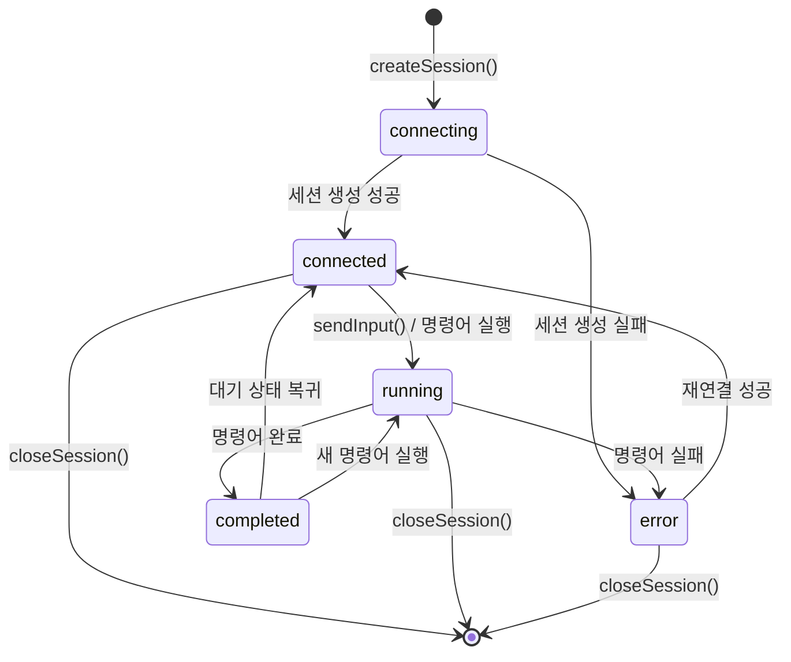

# 화면설계 (011-ui-design.md)

**Version:** 1.0.0 — **Last Updated:** 2025-12-17

---

## 0. 문서 메타데이터

| 항목 | 내용 |
|------|------|
| Task ID | TSK-02-03 |
| Task명 | 워크플로우 타입 및 스토어 |
| Category | development |
| 상태 | [dd] 상세설계 |
| 작성일 | 2025-12-17 |
| 작성자 | Claude |

---

## 1. 개요

### 1.1 문서 성격

본 Task는 UI 컴포넌트가 아닌 **타입 시스템과 상태 관리 아키텍처**를 다룹니다.
따라서 UI 설계 문서는 다음에 초점을 맞춥니다:

| 영역 | 설명 |
|------|------|
| 데이터 흐름 시각화 | Store ↔ Composable ↔ Component 간 데이터 흐름 |
| 상태 다이어그램 | 터미널 세션, 워크플로우 실행 상태 전이 |
| 인터페이스 맵 | 타입 간 관계 및 의존성 |
| 개발자 가이드 | Store/Composable 사용 패턴 |

### 1.2 구현 파일 목록

| 파일 | 역할 | LOC |
|------|------|-----|
| `app/types/terminal.ts` | 터미널/워크플로우 타입 정의 | ~150 |
| `app/stores/terminal.ts` | 터미널 세션 상태 관리 | ~250 |
| `app/stores/workflow.ts` | 워크플로우 실행 상태 관리 | ~200 |
| `app/composables/useTerminal.ts` | 터미널 로직 Composable | ~150 |
| `app/composables/useWorkflow.ts` | 워크플로우 로직 Composable | ~120 |

---

## 2. 아키텍처 다이어그램

### 2.1 전체 구조

```
┌─────────────────────────────────────────────────────────────────────────────┐
│ Component Layer                                                             │
│ ┌──────────────────┐ ┌──────────────────┐ ┌──────────────────┐              │
│ │ WorkflowActions  │ │ TerminalDialog   │ │ TerminalView     │              │
│ └────────┬─────────┘ └────────┬─────────┘ └────────┬─────────┘              │
└──────────┼─────────────────────┼─────────────────────┼──────────────────────┘
           │                     │                     │
           ▼                     ▼                     ▼
┌─────────────────────────────────────────────────────────────────────────────┐
│ Composable Layer                                                            │
│ ┌──────────────────────────────────────────────────────────────────────────┐│
│ │ useWorkflow()                                                            ││
│ │ - executeWorkflowCommand(taskId, projectId, command)                     ││
│ │ - getAvailableCommands(taskId, projectId)                                ││
│ │ - cancelWorkflowCommand(taskId)                                          ││
│ │ - isCommandAvailable(command, category, status)                          ││
│ └──────────────────────────────────────────────────────────────────────────┘│
│ ┌──────────────────────────────────────────────────────────────────────────┐│
│ │ useTerminal()                                                            ││
│ │ - createTerminalSession(taskId?, projectId?)                             ││
│ │ - closeTerminalSession(sessionId)                                        ││
│ │ - getOrCreateSession(taskId, projectId)                                  ││
│ │ - sendTerminalInput(sessionId, input)                                    ││
│ │ - resizeTerminal(sessionId, cols, rows)                                  ││
│ └──────────────────────────────────────────────────────────────────────────┘│
└─────────────────────────────────────────────────────────────────────────────┘
           │                     │
           ▼                     ▼
┌─────────────────────────────────────────────────────────────────────────────┐
│ Store Layer (Pinia)                                                         │
│ ┌────────────────────────┐ ┌────────────────────────┐ ┌───────────────────┐ │
│ │ workflowStore          │ │ terminalStore          │ │ executionStore    │ │
│ └────────────────────────┘ └────────────────────────┘ └───────────────────┘ │
└─────────────────────────────────────────────────────────────────────────────┘
           │                     │                     │
           ▼                     ▼                     ▼
┌─────────────────────────────────────────────────────────────────────────────┐
│ API Layer (Server Routes)                                                   │
│ ┌────────────────────────┐ ┌────────────────────────┐ ┌───────────────────┐ │
│ │ /api/workflow/*        │ │ /api/terminal/*        │ │ /api/execution/*  │ │
│ └────────────────────────┘ └────────────────────────┘ └───────────────────┘ │
└─────────────────────────────────────────────────────────────────────────────┘
```

### 2.2 데이터 흐름: 워크플로우 명령어 실행

```
┌─────────────────────────────────────────────────────────────────────────────┐
│ Step 1: 사용자 버튼 클릭                                                    │
│ ┌──────────────┐                                                            │
│ │ WorkflowBtn  │ ─── @click ───> useWorkflow.executeWorkflowCommand()       │
│ │  [구현]      │                                                            │
│ └──────────────┘                                                            │
└─────────────────────────────────────────────────────────────────────────────┘
                │
                ▼
┌─────────────────────────────────────────────────────────────────────────────┐
│ Step 2: 중복 실행 확인                                                      │
│ executionStore.isExecuting(taskId) === true ?                               │
│     ├─ Yes → notification.warning() → return false                          │
│     └─ No  → 다음 단계                                                      │
└─────────────────────────────────────────────────────────────────────────────┘
                │
                ▼
┌─────────────────────────────────────────────────────────────────────────────┐
│ Step 3: 터미널 세션 확인/생성                                               │
│ terminalStore.getSessionByTaskId(taskId)                                    │
│     ├─ 있음 → sessionId 사용                                                │
│     └─ 없음 → terminalStore.createSession() → POST /api/terminal/session    │
└─────────────────────────────────────────────────────────────────────────────┘
                │
                ▼
┌─────────────────────────────────────────────────────────────────────────────┐
│ Step 4: 워크플로우 실행 요청                                                │
│ workflowStore.executeCommand() → POST /api/workflow/execute                 │
│     └─ Response: { success: true, prompt: "/wf:build TSK-01-01" }           │
└─────────────────────────────────────────────────────────────────────────────┘
                │
                ▼
┌─────────────────────────────────────────────────────────────────────────────┐
│ Step 5: 프롬프트 터미널 입력                                                │
│ terminalStore.sendInput(sessionId, prompt + '\n')                           │
│     → POST /api/terminal/session/:id/input                                  │
└─────────────────────────────────────────────────────────────────────────────┘
                │
                ▼
┌─────────────────────────────────────────────────────────────────────────────┐
│ Step 6: 실행 상태 등록                                                      │
│ executionStore.startExecution(taskId, command, sessionId)                   │
│     → POST /api/execution/start                                             │
└─────────────────────────────────────────────────────────────────────────────┘
                │
                ▼
┌─────────────────────────────────────────────────────────────────────────────┐
│ Step 7: 알림 표시 & 완료                                                    │
│ notification.info("워크플로우 명령어 'build' 실행 시작")                    │
│ return true                                                                 │
└─────────────────────────────────────────────────────────────────────────────┘
```

---

## 3. 상태 다이어그램

### 3.1 터미널 세션 상태 (TerminalSessionStatus)



**상태 설명:**

| 상태 | 코드 | 설명 |
|------|------|------|
| connecting | `'connecting'` | 세션 생성 API 호출 중 |
| connected | `'connected'` | 세션 활성화, 입력 대기 |
| running | `'running'` | 명령어 실행 중 |
| completed | `'completed'` | 명령어 실행 완료 |
| error | `'error'` | 에러 발생 |

### 3.2 워크플로우 실행 상태

```
┌───────────────────────────────────────────────────────────────────────────┐
│ Workflow Execution State Machine                                          │
│                                                                           │
│   ┌──────────┐                                                            │
│   │   Idle   │ ◄───────────────────────────────────────────────────┐      │
│   └────┬─────┘                                                     │      │
│        │ executeWorkflowCommand()                                  │      │
│        ▼                                                           │      │
│   ┌──────────┐                                                     │      │
│   │Validating│ ── 중복 실행 체크                                    │      │
│   └────┬─────┘                                                     │      │
│        │ Pass                                                      │      │
│        ▼                                                           │      │
│   ┌──────────┐     ┌──────────┐                                    │      │
│   │ Session  │ ──> │ Creating │ (세션 없을 때)                      │      │
│   │  Check   │     │ Session  │                                    │      │
│   └────┬─────┘     └────┬─────┘                                    │      │
│        │                │                                          │      │
│        ▼                ▼                                          │      │
│   ┌──────────────────────┐                                         │      │
│   │ Requesting Execution │ → POST /api/workflow/execute            │      │
│   └──────────┬───────────┘                                         │      │
│              │ Prompt received                                     │      │
│              ▼                                                     │      │
│   ┌──────────────────────┐                                         │      │
│   │  Sending to Terminal │ → POST /api/terminal/session/:id/input  │      │
│   └──────────┬───────────┘                                         │      │
│              │                                                     │      │
│              ▼                                                     │      │
│   ┌──────────┐      ┌──────────┐                                   │      │
│   │ Executing│ ───> │ Completed│ ──────────────────────────────────┘      │
│   └──────────┘      └──────────┘                                          │
│                                                                           │
└───────────────────────────────────────────────────────────────────────────┘
```

---

## 4. 타입 관계 다이어그램

### 4.1 터미널 타입 계층

```
┌─────────────────────────────────────────────────────────────────────────────┐
│ types/terminal.ts                                                           │
│                                                                             │
│   ┌─────────────────────────┐                                               │
│   │ TerminalSessionStatus   │ (Union Type)                                  │
│   │ ─────────────────────   │                                               │
│   │ 'connecting'            │                                               │
│   │ 'connected'             │                                               │
│   │ 'running'               │                                               │
│   │ 'completed'             │                                               │
│   │ 'error'                 │                                               │
│   └────────────┬────────────┘                                               │
│                │ uses                                                       │
│                ▼                                                            │
│   ┌─────────────────────────┐       ┌─────────────────────────┐            │
│   │ TerminalSession         │       │ CreateSessionRequest    │            │
│   │ ─────────────────────   │◄──────│ ─────────────────────   │            │
│   │ id: string              │       │ taskId?: string         │            │
│   │ pid: number             │       │ projectId?: string      │            │
│   │ taskId?: string         │       │ cols: number            │            │
│   │ projectId?: string      │       │ rows: number            │            │
│   │ status: SessionStatus   │       └─────────────────────────┘            │
│   │ currentCommand?: string │                                               │
│   │ createdAt: string       │       ┌─────────────────────────┐            │
│   │ updatedAt: string       │       │ CreateSessionResponse   │            │
│   └─────────────────────────┘       │ ─────────────────────   │            │
│                                     │ success: boolean        │            │
│                                     │ sessionId: string       │            │
│                                     │ error?: string          │            │
│                                     └─────────────────────────┘            │
└─────────────────────────────────────────────────────────────────────────────┘
```

### 4.2 워크플로우 타입 계층

```
┌─────────────────────────────────────────────────────────────────────────────┐
│ types/terminal.ts (Workflow section)                                        │
│                                                                             │
│   ┌─────────────────────────┐       ┌─────────────────────────┐            │
│   │ WorkflowCommand         │       │ WORKFLOW_COMMANDS       │            │
│   │ ─────────────────────   │◄──────│ (Constant Array)        │            │
│   │ name: string            │       │ ─────────────────────   │            │
│   │ label: string           │       │ 15개 명령어 메타데이터   │            │
│   │ icon: string            │       │ start, ui, draft, ...   │            │
│   │ severity: Severity      │       └─────────────────────────┘            │
│   │ availableStatuses: []   │                                               │
│   │ categories: []          │                                               │
│   │ description?: string    │                                               │
│   └────────────┬────────────┘                                               │
│                │ uses                                                       │
│                ▼                                                            │
│   ┌─────────────────────────┐       ┌─────────────────────────┐            │
│   │ WorkflowExecuteRequest  │       │ WorkflowExecuteResponse │            │
│   │ ─────────────────────   │       │ ─────────────────────   │            │
│   │ taskId: string          │       │ success: boolean        │            │
│   │ projectId: string       │       │ sessionId?: string      │            │
│   │ command: string         │       │ prompt?: string         │            │
│   │ options?: ExecuteOpts   │       │ error?: string          │            │
│   └─────────────────────────┘       └─────────────────────────┘            │
└─────────────────────────────────────────────────────────────────────────────┘
```

---

## 5. Store 인터페이스 시각화

### 5.1 Terminal Store 구조

```
┌─────────────────────────────────────────────────────────────────────────────┐
│ useTerminalStore()                                                          │
├─────────────────────────────────────────────────────────────────────────────┤
│ STATE                                                                       │
│ ┌─────────────────────────────────────────────────────────────────────────┐ │
│ │ sessions: Map<string, TerminalSession>                                  │ │
│ │ ┌───────────────────────────────────────────────────────────────────┐   │ │
│ │ │ "sess-1" → { id, pid, taskId, status: 'running', ... }            │   │ │
│ │ │ "sess-2" → { id, pid, taskId, status: 'connected', ... }          │   │ │
│ │ └───────────────────────────────────────────────────────────────────┘   │ │
│ │                                                                         │ │
│ │ activeSessionId: string | null = "sess-1"                               │ │
│ │ isConnecting: boolean = false                                           │ │
│ │ error: string | null = null                                             │ │
│ │ lastSyncedAt: Date | null                                               │ │
│ └─────────────────────────────────────────────────────────────────────────┘ │
├─────────────────────────────────────────────────────────────────────────────┤
│ GETTERS                                                                     │
│ ┌─────────────────────────────────────────────────────────────────────────┐ │
│ │ sessionCount          → computed: sessions.size                         │ │
│ │ runningSessionCount   → computed: sessions.filter(running).length       │ │
│ │ activeSession         → computed: sessions.get(activeSessionId)         │ │
│ │ sessionList           → computed: Array.from(sessions.values())         │ │
│ │ getSessionByTaskId()  → function: find by taskId                        │ │
│ │ getSession()          → function: sessions.get(sessionId)               │ │
│ └─────────────────────────────────────────────────────────────────────────┘ │
├─────────────────────────────────────────────────────────────────────────────┤
│ ACTIONS                                                                     │
│ ┌─────────────────────────────────────────────────────────────────────────┐ │
│ │ createSession(request)   → POST /api/terminal/session                   │ │
│ │ closeSession(sessionId)  → DELETE /api/terminal/session/:id             │ │
│ │ sendInput(sessionId, input) → POST /api/terminal/session/:id/input      │ │
│ │ resize(sessionId, cols, rows) → POST /api/terminal/session/:id/resize   │ │
│ │ syncSessions()           → GET /api/terminal/session                    │ │
│ │ updateSessionStatus()    → 로컬 상태 업데이트                            │ │
│ │ setActiveSession()       → activeSessionId 설정                          │ │
│ │ $reset()                 → 스토어 초기화                                  │ │
│ └─────────────────────────────────────────────────────────────────────────┘ │
└─────────────────────────────────────────────────────────────────────────────┘
```

### 5.2 Workflow Store 구조

```
┌─────────────────────────────────────────────────────────────────────────────┐
│ useWorkflowStore()                                                          │
├─────────────────────────────────────────────────────────────────────────────┤
│ STATE                                                                       │
│ ┌─────────────────────────────────────────────────────────────────────────┐ │
│ │ executingCommand: string | null = "build"                               │ │
│ │ executingTaskId: string | null = "TSK-01-01"                            │ │
│ │ availableCommands: Record<string, WorkflowCommand[]>                    │ │
│ │ ┌───────────────────────────────────────────────────────────────────┐   │ │
│ │ │ "TSK-01-01" → [{ name: 'review', ... }, { name: 'build', ... }]   │   │ │
│ │ │ "TSK-02-01" → [{ name: 'start', ... }]                            │   │ │
│ │ └───────────────────────────────────────────────────────────────────┘   │ │
│ │                                                                         │ │
│ │ lastExecutionResult: WorkflowExecuteResponse | null                     │ │
│ │ loading: boolean = false                                                │ │
│ │ error: string | null = null                                             │ │
│ └─────────────────────────────────────────────────────────────────────────┘ │
├─────────────────────────────────────────────────────────────────────────────┤
│ GETTERS                                                                     │
│ ┌─────────────────────────────────────────────────────────────────────────┐ │
│ │ isExecuting(taskId)      → function: executingTaskId === taskId         │ │
│ │ currentExecution         → computed: { taskId, command }                │ │
│ │ getAvailableCommands()   → function: availableCommands[taskId]          │ │
│ └─────────────────────────────────────────────────────────────────────────┘ │
├─────────────────────────────────────────────────────────────────────────────┤
│ ACTIONS                                                                     │
│ ┌─────────────────────────────────────────────────────────────────────────┐ │
│ │ executeCommand(request)        → POST /api/workflow/execute             │ │
│ │ fetchAvailableCommands()       → GET /api/workflow/available-commands   │ │
│ │ clearExecution(taskId)         → 로컬 실행 상태 정리                      │ │
│ │ cancelExecution(taskId)        → POST /api/execution/stop + 정리         │ │
│ │ $reset()                       → 스토어 초기화                            │ │
│ └─────────────────────────────────────────────────────────────────────────┘ │
└─────────────────────────────────────────────────────────────────────────────┘
```

---

## 6. Composable 사용 가이드

### 6.1 useWorkflow() 사용 예시

```vue
<script setup lang="ts">
import { useWorkflow } from '~/composables/useWorkflow'

const props = defineProps<{
  task: WbsTask
  projectId: string
}>()

const { executeWorkflowCommand, getAvailableCommands, isCommandAvailable, workflowStore } = useWorkflow()

// 1. 사용 가능한 명령어 조회
const availableCommands = ref<WorkflowCommand[]>([])

onMounted(async () => {
  availableCommands.value = await getAvailableCommands(props.task.id, props.projectId)
})

// 2. 명령어 실행
async function handleExecute(command: string) {
  const success = await executeWorkflowCommand(
    props.task.id,
    props.projectId,
    command
  )

  if (success) {
    // 터미널 다이얼로그 열기 등 후처리
  }
}

// 3. 버튼 활성화 여부 판단
function isButtonEnabled(cmd: WorkflowCommand): boolean {
  if (workflowStore.isExecuting(props.task.id)) return false
  return isCommandAvailable(cmd, props.task.category, props.task.status)
}
</script>
```

### 6.2 useTerminal() 사용 예시

```vue
<script setup lang="ts">
import { useTerminal } from '~/composables/useTerminal'

const {
  createTerminalSession,
  closeTerminalSession,
  getOrCreateSession,
  terminalStore
} = useTerminal()

// 1. 세션 생성 (Task 연결)
async function openTerminal(taskId: string, projectId: string) {
  const sessionId = await getOrCreateSession(taskId, projectId)
  if (sessionId) {
    terminalDialogVisible.value = true
  }
}

// 2. 세션 목록 표시
const sessions = computed(() => terminalStore.sessionList)
const activeSession = computed(() => terminalStore.activeSession)

// 3. 세션 전환
function selectSession(sessionId: string) {
  terminalStore.setActiveSession(sessionId)
}

// 4. 세션 종료
async function handleClose(sessionId: string) {
  await closeTerminalSession(sessionId)
}
</script>
```

---

## 7. Store 간 연동 다이어그램

```
┌─────────────────────────────────────────────────────────────────────────────┐
│ Store Interaction Flow                                                      │
│                                                                             │
│  ┌────────────────────────────────────────────────────────────────────┐     │
│  │ useWorkflow Composable                                             │     │
│  │                                                                    │     │
│  │   executeWorkflowCommand(taskId, projectId, command)               │     │
│  │   ┌──────────────────────────────────────────────────────────────┐ │     │
│  │   │ 1. executionStore.isExecuting(taskId)                        │ │     │
│  │   │    └─> 중복 실행 확인                                         │ │     │
│  │   │                                                              │ │     │
│  │   │ 2. terminalStore.getSessionByTaskId(taskId)                  │ │     │
│  │   │    └─> 없으면 terminalStore.createSession()                  │ │     │
│  │   │                                                              │ │     │
│  │   │ 3. workflowStore.executeCommand(request)                     │ │     │
│  │   │    └─> 프롬프트 생성                                          │ │     │
│  │   │                                                              │ │     │
│  │   │ 4. terminalStore.sendInput(sessionId, prompt)                │ │     │
│  │   │    └─> 터미널에 명령어 전송                                    │ │     │
│  │   │                                                              │ │     │
│  │   │ 5. executionStore.startExecution(taskId, command, sessionId) │ │     │
│  │   │    └─> 실행 상태 등록                                         │ │     │
│  │   └──────────────────────────────────────────────────────────────┘ │     │
│  └────────────────────────────────────────────────────────────────────┘     │
│                                                                             │
│                    │              │              │                          │
│                    ▼              ▼              ▼                          │
│  ┌───────────────────┐ ┌───────────────────┐ ┌───────────────────┐          │
│  │ executionStore    │ │ terminalStore     │ │ workflowStore     │          │
│  │ ────────────────  │ │ ────────────────  │ │ ────────────────  │          │
│  │ • isExecuting()   │ │ • getSession...() │ │ • executeCommand()│          │
│  │ • startExecution()│ │ • createSession() │ │ • clearExecution()│          │
│  │ • stopExecution() │ │ • sendInput()     │ │                   │          │
│  │ • syncFromServer()│ │ • closeSession()  │ │                   │          │
│  └───────────────────┘ └───────────────────┘ └───────────────────┘          │
│                                                                             │
│  폴링 (30초)              SSE 스트림              API 응답                   │
│      │                        │                     │                       │
│      ▼                        ▼                     ▼                       │
│  /api/execution/status  /api/terminal/:id/output  /api/workflow/execute     │
│                                                                             │
└─────────────────────────────────────────────────────────────────────────────┘
```

---

## 8. 명령어 가용성 매트릭스

### 8.1 development 카테고리

| 명령어 | `[ ]` | `[bd]` | `[dd]` | `[im]` | `[vf]` | `[xx]` |
|--------|-------|--------|--------|--------|--------|--------|
| start | ● | - | - | - | - | - |
| ui | - | ● | - | - | - | - |
| draft | - | ● | - | - | - | - |
| review | - | - | ● | - | - | - |
| apply | - | - | ● | - | - | - |
| build | - | - | ● | - | - | - |
| test | - | - | - | ● | - | - |
| audit | - | - | - | ● | - | - |
| patch | - | - | - | ● | - | - |
| verify | - | - | - | ● | - | - |
| done | - | - | - | - | ● | - |
| run | ● | ● | ● | ● | ● | - |
| auto | ● | ● | ● | ● | ● | - |

### 8.2 defect 카테고리

| 명령어 | `[ ]` | `[an]` | `[fx]` | `[vf]` | `[xx]` |
|--------|-------|--------|--------|--------|--------|
| start | ● | - | - | - | - |
| fix | - | ● | - | - | - |
| audit | - | - | ● | - | - |
| patch | - | - | ● | - | - |
| verify | - | - | ● | - | - |
| done | - | - | - | ● | - |

### 8.3 infrastructure 카테고리

| 명령어 | `[ ]` | `[ds]` | `[im]` | `[xx]` |
|--------|-------|--------|--------|--------|
| start | ● | - | - | - |
| skip | ● | - | - | - |
| build | - | ● | - | - |
| done | - | - | ● | - |

---

## 9. 관련 문서

| 문서 | 경로 |
|------|------|
| 기본설계 | `010-basic-design.md` |
| 상세설계 | `020-detail-design.md` |
| PRD | 섹션 4.5, 5.4, 5.5 (워크플로우 실행 시스템) |
| TRD | 섹션 5.3, 5.4 (Store/Composable 아키텍처) |
| 연관 Task | TSK-01-02 (터미널 UI), TSK-02-01 (워크플로우 액션 UI) |

---

## 변경 이력

| 버전 | 날짜 | 변경 내용 |
|------|------|-----------|
| 1.0.0 | 2025-12-17 | 초안 작성 |

---

<!--
author: Claude
Version: 1.0.0
-->
