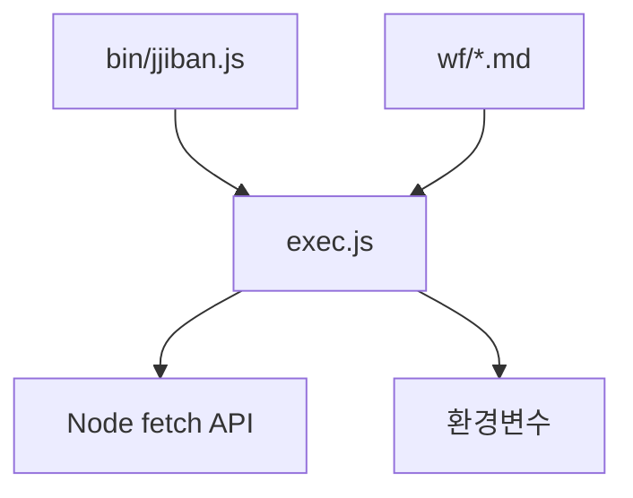

# 상세설계 (020-detail-design.md)

**Version:** 1.0.0 — **Last Updated:** 2025-12-17

---

## 0. 문서 메타데이터

| 항목 | 내용 |
|------|------|
| Task ID | TSK-03-03 |
| Task명 | 워크플로우 명령어 훅 |
| Category | development |
| 상태 | [dd] 상세설계 |
| 작성일 | 2025-12-17 |
| 작성자 | Claude |

### 상위 문서 참조

| 문서 유형 | 경로 | 참조 섹션 |
|----------|------|----------|
| 기본설계 | `010-basic-design.md` | 전체 |
| CLI설계 | `011-ui-design.md` | 섹션 2, 5 |
| PRD | `.jjiban/projects/jjiban개선/prd.md` | 섹션 9.6, 9.7 |

---

## 1. 모듈 구조

### 1.1 디렉토리 구조

```
cli/
├── commands/
│   └── exec.js              # exec 명령어 (신규)
├── bin/
│   └── jjiban.js            # exec 등록 (수정)
└── utils/
    └── apiClient.js         # API 호출 유틸 (신규, 선택)

.claude/commands/wf/
├── start.md                 # 훅 추가 (수정)
├── ui.md                    # 훅 추가 (수정)
├── draft.md                 # 훅 추가 (수정)
├── review.md                # 훅 추가 (수정)
├── apply.md                 # 훅 추가 (수정)
├── build.md                 # 훅 추가 (수정)
├── test.md                  # 훅 추가 (수정)
├── audit.md                 # 훅 추가 (수정)
├── patch.md                 # 훅 추가 (수정)
├── verify.md                # 훅 추가 (수정)
├── done.md                  # 훅 추가 (수정)
├── fix.md                   # 훅 추가 (수정)
├── skip.md                  # 훅 추가 (수정)
├── run.md                   # 훅 추가 (수정)
└── auto.md                  # 훅 추가 (수정)
```

### 1.2 의존성 관계



---

## 2. CLI 명령어 상세 설계

### 2.1 exec.js 모듈 구조

**파일 경로**: `cli/commands/exec.js`

**exports**

| 함수명 | 설명 |
|--------|------|
| register | Commander 프로그램에 exec 명령어 등록 |

### 2.2 register 함수

**파라미터**

| 파라미터 | 타입 | 설명 |
|----------|------|------|
| program | Command | Commander 프로그램 인스턴스 |

**동작**:
1. `program.command('exec')` 생성
2. `start` 서브커맨드 등록
3. `stop` 서브커맨드 등록

### 2.3 start 서브커맨드

**시그니처**

| 항목 | 값 |
|------|---|
| 명령어 | `exec start <taskId> <command>` |
| 옵션 | `--session <id>`, `--pid <pid>` |

**처리 로직**

| 단계 | 동작 | 실패 시 |
|------|------|---------|
| 1 | 환경변수/옵션에서 sessionId 추출 | 경고 출력 후 계속 |
| 2 | 환경변수/옵션에서 pid 추출 | 경고 출력 후 계속 |
| 3 | API 엔드포인트 URL 구성 | - |
| 4 | POST /api/execution/start 호출 | 경고 출력 후 계속 |
| 5 | 성공 메시지 출력 | - |

**API 요청 본문**

| 필드 | 타입 | 소스 |
|------|------|------|
| taskId | string | CLI 인자 |
| command | string | CLI 인자 |
| sessionId | string | 옵션 또는 환경변수 |
| pid | number | 옵션 또는 환경변수 |

### 2.4 stop 서브커맨드

**시그니처**

| 항목 | 값 |
|------|---|
| 명령어 | `exec stop <taskId>` |
| 옵션 | 없음 |

**처리 로직**

| 단계 | 동작 | 실패 시 |
|------|------|---------|
| 1 | API 엔드포인트 URL 구성 | - |
| 2 | POST /api/execution/stop 호출 | 경고 출력 후 계속 |
| 3 | 성공 메시지 출력 | - |

**API 요청 본문**

| 필드 | 타입 | 소스 |
|------|------|------|
| taskId | string | CLI 인자 |

---

## 3. bin/jjiban.js 수정

### 3.1 수정 내용

| 위치 | 변경 |
|------|------|
| import | `execCommand` import 추가 |
| 명령어 등록 | `execCommand.register(program)` 호출 |

### 3.2 등록 순서

| 순서 | 명령어 |
|------|--------|
| 기존 | init, next-task, ... |
| 신규 | exec |

---

## 4. 환경변수 처리

### 4.1 우선순위 로직

| 우선순위 | 소스 | 예시 |
|----------|------|------|
| 1 (최우선) | CLI 옵션 | `--session term-123` |
| 2 | 환경변수 | `$JJIBAN_SESSION_ID` |
| 3 | 기본값 | null (경고 출력) |

### 4.2 환경변수 목록

| 환경변수 | CLI 옵션 | 용도 |
|----------|----------|------|
| JJIBAN_SESSION_ID | --session | 터미널 세션 ID |
| JJIBAN_TERMINAL_PID | --pid | 터미널 프로세스 PID |

---

## 5. API 호출 설계

### 5.1 기본 설정

| 항목 | 값 |
|------|---|
| Base URL | `http://localhost:3000` |
| Content-Type | `application/json` |
| 타임아웃 | 5000ms |

### 5.2 에러 처리

| HTTP 상태 | 처리 |
|-----------|------|
| 200 | 성공 메시지 출력 |
| 4xx | 경고 출력 (워크플로우 계속) |
| 5xx | 경고 출력 (워크플로우 계속) |
| 연결 실패 | 경고 출력 (워크플로우 계속) |

**원칙**: API 호출 실패가 워크플로우를 중단시키지 않음

---

## 6. 슬래시 명령어 훅 삽입

### 6.1 삽입 위치

**시작 훅**: 명령어 실행 직후 (문서 생성 전)
**종료 훅**: 커밋 완료 직후 (명령어 종료 전)

### 6.2 훅 스크립트 형식

**시작 훅**:
```
npx jjiban exec start {TASK_ID} {COMMAND_NAME}
```

**종료 훅**:
```
npx jjiban exec stop {TASK_ID}
```

### 6.3 수정 대상 파일 목록

| 파일 | 시작 훅 | 종료 훅 |
|------|---------|---------|
| start.md | start | O |
| ui.md | ui | O |
| draft.md | draft | O |
| review.md | review | O |
| apply.md | apply | O |
| build.md | build | O |
| test.md | test | O |
| audit.md | audit | O |
| patch.md | patch | O |
| verify.md | verify | O |
| done.md | done | O |
| fix.md | fix | O |
| skip.md | skip | O |
| run.md | run | O |
| auto.md | auto | O |

---

## 7. 출력 메시지 설계

### 7.1 메시지 형식

| 상황 | 형식 |
|------|------|
| 시작 성공 | `[exec] 실행 등록: {taskId} ({command})` |
| 종료 성공 | `[exec] 실행 해제: {taskId}` |
| 경고 | `[exec] 경고: {message}` |

### 7.2 색상 (chalk 사용 시)

| 상황 | 색상 |
|------|------|
| 성공 | green |
| 경고 | yellow |
| 오류 | red |

---

## 8. 일관성 검증

### 8.1 CHK-PRD (PRD ↔ 기본설계)

| 항목 | PRD | 기본설계 | 결과 |
|------|-----|----------|------|
| exec start 명령어 | 9.7 | 3.3 | ✅ PASS |
| exec stop 명령어 | 9.7 | 3.3 | ✅ PASS |
| 환경변수 | 9.6 | 3.4 | ✅ PASS |

### 8.2 CHK-BD (기본설계 ↔ 상세설계)

| 항목 | 기본설계 | 상세설계 | 결과 |
|------|----------|----------|------|
| 모듈 구조 | 3.2 | 1.1 | ✅ PASS |
| CLI 설계 | 3.3 | 2 | ✅ PASS |
| 에러 처리 | 4 | 5.2 | ✅ PASS |

### 8.3 CHK-UI (CLI설계 ↔ 상세설계)

| 항목 | CLI설계 | 상세설계 | 결과 |
|------|---------|----------|------|
| 명령어 사용법 | 2 | 2.3, 2.4 | ✅ PASS |
| 환경변수 | 3 | 4 | ✅ PASS |
| 에러 정책 | 6 | 5.2 | ✅ PASS |

---

## 9. 관련 문서

- 기본설계: `010-basic-design.md`
- CLI설계: `011-ui-design.md`
- 추적성 매트릭스: `025-traceability-matrix.md`
- 테스트 명세: `026-test-specification.md`

---

<!--
author: Claude
Version: 1.0.0
-->
