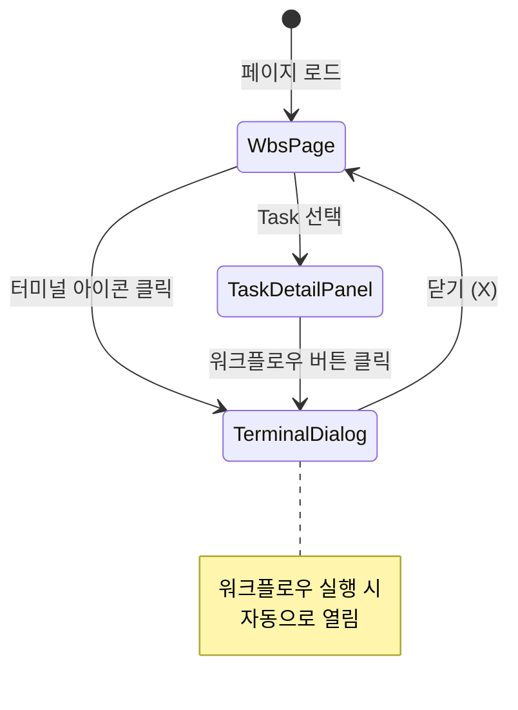
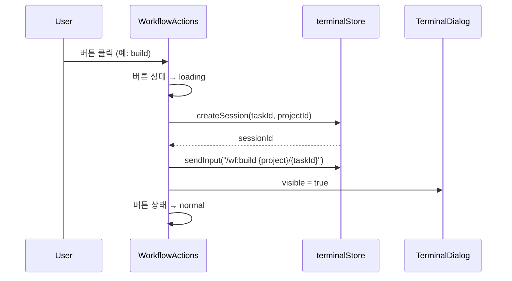

# 화면설계 (011-ui-design.md)

**Template Version:** 1.0.0 — **Last Updated:** 2025-12-17

---

## 0. 문서 메타데이터

| 항목 | 내용 |
|------|------|
| Task ID | TSK-04-01 |
| Task명 | 전역 터미널 및 워크플로우 통합 |
| Category | development |
| 상태 | [bd] 기본설계 |
| 작성일 | 2025-12-17 |
| 작성자 | Claude |

---

## 1. 화면 목록

| 화면 ID | 화면명 | 설명 | 우선순위 |
|---------|--------|------|----------|
| SCR-01 | AppHeader 통합 | 터미널 아이콘 배치 | Critical |
| SCR-02 | TerminalDialog | 전역 터미널 다이얼로그 | Critical |
| SCR-03 | TaskDetailPanel 통합 | WorkflowActions 배치 | Critical |

---

## 2. 화면 전환 흐름



---

## 3. 화면별 상세 설계

### SCR-01: AppHeader 통합

#### 레이아웃

```
┌─────────────────────────────────────────────────────────────────────────┐
│ AppHeader                                                                │
│ ┌───────┬──────────────────────────────────────────────┬───────────────┐│
│ │ Logo  │ Navigation (WBS | Kanban | Gantt)            │ [🖥️ N] Term  ││
│ │       │                                              │     ↑         ││
│ │       │                                              │   Badge       ││
│ └───────┴──────────────────────────────────────────────┴───────────────┘│
└─────────────────────────────────────────────────────────────────────────┘
```

#### 컴포넌트 구조

| 영역 | 컴포넌트 | Props | 위치 |
|------|----------|-------|------|
| 우측 끝 | TerminalHeaderIcon | - | end slot |

#### TerminalHeaderIcon 상세

| 요소 | 컴포넌트 | 속성 |
|------|----------|------|
| 컨테이너 | div | `class="relative cursor-pointer"` |
| 아이콘 | Button | `icon="pi pi-desktop"`, `text`, `rounded` |
| 배지 | Badge | `value={sessionCount}`, `severity="success"` |

#### 상태별 표시

| 상태 | 아이콘 | 배지 | 색상 |
|------|--------|------|------|
| 세션 없음 | pi-desktop | 미표시 | secondary |
| 세션 있음 (N개) | pi-desktop | N | success (녹색) |
| 실행 중 | pi-desktop | N (pulse) | info (파랑) |

---

### SCR-02: TerminalDialog

#### 레이아웃 (전체)

```
┌─────────────────────────────────────────────────────────────────────────┐
│ 터미널 세션 관리                                               [X]      │
├─────────────────────────────────────────────────────────────────────────┤
│ ┌──────────────────┬───────────────────────────────────────────────────┐│
│ │ 세션 목록 (250px) │ 터미널 뷰 (flex-1)                                ││
│ │ ┌──────────────┐ │ ┌─────────────────────────────────────────────────┐││
│ │ │ ● TSK-01-01  │ │ │ $ /wf:build TSK-01-01                          │││
│ │ │   [build]    │ │ │ [wf:build] 시작...                             │││
│ │ │ ○ TSK-02-01  │ │ │                                                │││
│ │ │   완료       │ │ │                                                │││
│ │ ├──────────────┤ │ │                                                │││
│ │ │ [+ 새 세션]  │ │ │                                                │││
│ │ └──────────────┘ │ └─────────────────────────────────────────────────┘││
│ └──────────────────┴───────────────────────────────────────────────────┘│
└─────────────────────────────────────────────────────────────────────────┘
```

#### 컴포넌트 구조

| 영역 | 컴포넌트 | Props |
|------|----------|-------|
| 루트 | Dialog | `modal`, `maximizable`, `style="width: 90vw; height: 80vh"` |
| 헤더 | - | `header="터미널 세션 관리"` |
| 좌측 | TerminalSessionList | `sessions`, `activeSessionId` |
| 우측 | TerminalView | `sessionId` |

#### 세션 목록 아이템 상세

```
┌──────────────────────────────────────┐
│ ● TSK-01-01                     [X]  │
│   build 실행 중                       │
│   시작: 10:30:45                      │
└──────────────────────────────────────┘
```

| 요소 | 설명 | 스타일 |
|------|------|--------|
| 상태 표시기 | ● (녹색: 실행중), ○ (회색: 완료/에러) | `w-2 h-2 rounded-full` |
| Task ID | TSK-XX-XX | `font-semibold` |
| 닫기 버튼 | X | `pi-times`, 우측 끝 |
| 명령어/상태 | 현재 명령어 또는 "완료"/"에러" | `text-sm text-gray-500` |
| 시작 시간 | HH:mm:ss | `text-xs text-gray-400` |

#### 세션 상태별 스타일

| 상태 | 표시기 | 텍스트 |
|------|--------|--------|
| connected | ○ (회색) | "대기 중" |
| running | ● (녹색, pulse) | "{command} 실행 중" |
| completed | ○ (회색) | "완료" |
| error | ○ (빨강) | "에러" |

---

### SCR-03: TaskDetailPanel 통합

#### 레이아웃

```
┌─────────────────────────────────────────────────────────────────────────┐
│ TaskDetailPanel                                                          │
├─────────────────────────────────────────────────────────────────────────┤
│ ┌─────────────────────────────────────────────────────────────────────┐ │
│ │ TaskBasicInfo                                                        │ │
│ │ TSK-04-01: 전역 터미널 및 워크플로우 통합                              │ │
│ │ Status: [bd] 기본설계 | Category: development                        │ │
│ └─────────────────────────────────────────────────────────────────────┘ │
│ ┌─────────────────────────────────────────────────────────────────────┐ │
│ │ TaskProgress / TaskDocuments / TaskHistory (기존)                    │ │
│ └─────────────────────────────────────────────────────────────────────┘ │
│ ┌─────────────────────────────────────────────────────────────────────┐ │
│ │ WorkflowActions (신규)                                               │ │
│ │ ┌─────────────────────────────────────────────────────────────────┐ │ │
│ │ │ 워크플로우                                                       │ │ │
│ │ │ [start][ui][draft][review][apply][build][test]                   │ │ │
│ │ │ [audit][patch][verify][done][fix][skip]                          │ │ │
│ │ ├─────────────────────────────────────────────────────────────────┤ │ │
│ │ │ 자동실행   [▶ run] [▶▶ auto] [⏹ 중지]                            │ │ │
│ │ └─────────────────────────────────────────────────────────────────┘ │ │
│ └─────────────────────────────────────────────────────────────────────┘ │
└─────────────────────────────────────────────────────────────────────────┘
```

#### WorkflowActions 컴포넌트 구조

| 영역 | 컴포넌트 | Props |
|------|----------|-------|
| 루트 | Panel | `header="워크플로우"` |
| 버튼 그룹 | div | `class="flex flex-wrap gap-2"` |
| 개별 버튼 | WorkflowButton | `command`, `disabled`, `loading` |
| 구분선 | Divider | - |
| 자동실행 | div | `class="flex gap-2"` |

#### WorkflowButton 상태별 스타일

| 상태 | severity | 스타일 |
|------|----------|--------|
| 사용 가능 | primary | 활성 |
| 사용 불가 | secondary | disabled, 흐림 |
| 실행 중 | info | loading spinner |

#### 버튼 그룹 배치

**Row 1: 기본 워크플로우**
```
[start] [ui] [draft] [review] [apply] [build] [test]
```

**Row 2: 고급 워크플로우**
```
[audit] [patch] [verify] [done] [fix] [skip]
```

**Row 3: 자동 실행 (Divider 후)**
```
[▶ run] [▶▶ auto] [⏹ 중지]
```

---

## 4. 반응형 설계

### Breakpoint 정의

| Breakpoint | 너비 | 레이아웃 변경 |
|------------|------|---------------|
| Desktop | >= 1024px | 기본 레이아웃 |
| Tablet | 768-1023px | 다이얼로그 너비 95vw |
| Mobile | < 768px | 다이얼로그 전체화면 |

### TerminalDialog 반응형

| Breakpoint | 세션 목록 | 터미널 뷰 |
|------------|----------|-----------|
| Desktop | 250px 고정 | flex-1 |
| Tablet | 200px 고정 | flex-1 |
| Mobile | 하단 탭 전환 | 전체 너비 |

---

## 5. 접근성 설계

### 키보드 네비게이션

| 키 | 동작 |
|----|------|
| Tab | 워크플로우 버튼 간 이동 |
| Enter/Space | 버튼 클릭 |
| Escape | 다이얼로그 닫기 |
| Ctrl+` | 터미널 다이얼로그 토글 |

### ARIA 레이블

| 요소 | aria-label |
|------|------------|
| TerminalHeaderIcon | "터미널 열기, {N}개 세션 활성" |
| WorkflowButton | "{command} 워크플로우 실행" |
| 세션 목록 아이템 | "세션 {taskId}, {status}" |

---

## 6. 인터랙션 상세

### 6.1 워크플로우 버튼 클릭 흐름



### 6.2 터미널 아이콘 상호작용

| 동작 | 결과 |
|------|------|
| 클릭 | TerminalDialog 열기 |
| 호버 | 툴팁 "터미널 ({N}개 세션)" |
| 배지 클릭 | 동일 (다이얼로그 열기) |

### 6.3 세션 목록 상호작용

| 동작 | 결과 |
|------|------|
| 세션 클릭 | 해당 세션 터미널 표시 |
| X 버튼 클릭 | 세션 종료 확인 다이얼로그 |
| "+ 새 세션" 클릭 | 새 터미널 세션 생성 |

---

## 7. 스타일 가이드

### 색상 정의 (PrimeVue 테마 기반)

| 용도 | CSS Variable | 설명 |
|------|--------------|------|
| 실행 중 | `--p-green-500` | 세션 실행 중 표시 |
| 완료 | `--p-gray-400` | 세션 완료 표시 |
| 에러 | `--p-red-500` | 에러 상태 표시 |
| 배지 | `--p-primary-500` | 세션 카운트 배지 |

### 간격 정의

| 요소 | 간격 | Tailwind |
|------|------|----------|
| 버튼 간 | 8px | `gap-2` |
| 섹션 간 | 16px | `gap-4` |
| 패딩 | 16px | `p-4` |

---

## 8. 관련 문서

- 기본설계: `010-basic-design.md`
- 상세설계: `020-detail-design.md` (다음 단계)
- PRD: `.jjiban/projects/jjiban개선/prd.md` (섹션 3.1, 5.3)
- TRD: `.jjiban/projects/jjiban개선/trd.md` (섹션 5)

---

<!--
author: Claude
Template Version: 1.0.0
-->
