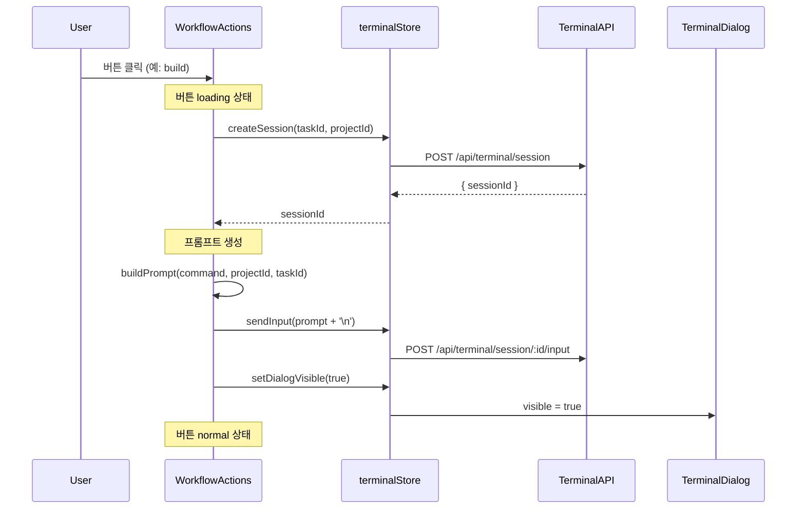

# 상세설계 (020-detail-design.md)

**Template Version:** 1.0.0 — **Last Updated:** 2025-12-17

---

## 0. 문서 메타데이터

| 항목 | 내용 |
|------|------|
| Task ID | TSK-04-01 |
| Task명 | 전역 터미널 및 워크플로우 통합 |
| Category | development |
| 상태 | [dd] 상세설계 |
| 작성일 | 2025-12-17 |
| 작성자 | Claude |

### 상위 문서 참조

| 문서 유형 | 경로 | 참조 섹션 |
|----------|------|----------|
| 기본설계 | `010-basic-design.md` | 전체 |
| 화면설계 | `011-ui-design.md` | 전체 |
| PRD | `.jjiban/projects/jjiban개선/prd.md` | 3.1, 5.3 |
| TRD | `.jjiban/projects/jjiban개선/trd.md` | 5.1, 5.3 |

---

## 1. 일관성 검증

### CHK-PRD: PRD ↔ 기본설계

| 검증 항목 | PRD | 기본설계 | 결과 |
|----------|-----|---------|------|
| AppHeader 터미널 아이콘 | 3.1 | FR-001 | ✅ PASS |
| TerminalDialog 전역 관리 | 3.2 | FR-002 | ✅ PASS |
| WorkflowActions 통합 | 5.3 | FR-004 | ✅ PASS |
| 프롬프트 기반 실행 | 1.4 | FR-005, FR-006 | ✅ PASS |

### CHK-BD: 기본설계 ↔ 상세설계

| 검증 항목 | 기본설계 | 상세설계 | 결과 |
|----------|---------|---------|------|
| 컴포넌트 목록 | 3.2 | 2.1 | ✅ PASS |
| 데이터 흐름 | 3.3 | 5.1 | ✅ PASS |
| 인수 기준 | 5 | 7 | ✅ PASS |

### CHK-UI: 화면설계 ↔ 상세설계

| 검증 항목 | 화면설계 | 상세설계 | 결과 |
|----------|---------|---------|------|
| SCR-01 AppHeader | 3.1 | 2.2 | ✅ PASS |
| SCR-02 TerminalDialog | 3.2 | 2.3 | ✅ PASS |
| SCR-03 TaskDetailPanel | 3.3 | 2.4 | ✅ PASS |

---

## 2. 모듈 설계

### 2.1 수정 대상 파일 목록

| 파일 경로 | 변경 유형 | 설명 |
|----------|----------|------|
| `app/components/AppHeader.vue` | 수정 | TerminalHeaderIcon 추가 |
| `app/components/wbs/detail/TaskDetailPanel.vue` | 수정 | WorkflowActions 추가 |
| `app/components/terminal/TerminalHeaderIcon.vue` | 참조 | TSK-01-02 산출물 |
| `app/components/terminal/TerminalDialog.vue` | 참조 | TSK-01-02 산출물 |
| `app/components/workflow/WorkflowActions.vue` | 참조 | TSK-02-01 산출물 |
| `app/stores/terminal.ts` | 참조 | TSK-02-03 산출물 |

### 2.2 AppHeader.vue 수정 상세

#### 기존 구조

```
AppHeader
├── Logo
├── Menubar (navigation)
└── (end slot 비어있음)
```

#### 변경 구조

```
AppHeader
├── Logo
├── Menubar (navigation)
└── TerminalHeaderIcon (end slot)
```

#### Props/Events 변경

| 구분 | 이름 | 타입 | 설명 |
|------|------|------|------|
| 추가 | - | - | Props 변경 없음 |

#### 의존성 추가

| import | 대상 |
|--------|------|
| TerminalHeaderIcon | `~/components/terminal/TerminalHeaderIcon.vue` |

### 2.3 TerminalHeaderIcon.vue 연동 (참조)

#### Props

| 이름 | 타입 | 필수 | 기본값 | 설명 |
|------|------|------|--------|------|
| - | - | - | - | Props 없음 (terminalStore 직접 참조) |

#### Events

| 이름 | Payload | 설명 |
|------|---------|------|
| - | - | Events 없음 (내부 처리) |

#### 내부 상태

| 상태 | 소스 | 설명 |
|------|------|------|
| sessionCount | terminalStore.sessions.size | 활성 세션 개수 |
| hasRunningSession | terminalStore.hasRunningSession | 실행 중 여부 |
| dialogVisible | ref(false) | 다이얼로그 표시 여부 |

### 2.4 TaskDetailPanel.vue 수정 상세

#### 기존 구조

```
TaskDetailPanel
├── TaskBasicInfo
├── WpActProgress / WpActChildren
├── TaskDocuments (FileViewer)
└── TaskHistory
```

#### 변경 구조

```
TaskDetailPanel
├── TaskBasicInfo
├── WpActProgress / WpActChildren
├── TaskDocuments (FileViewer)
├── TaskHistory
└── WorkflowActions (신규)
```

#### Props 전달

| 대상 컴포넌트 | Props | 값 |
|--------------|-------|-----|
| WorkflowActions | task | selectedItem (WbsNode) |
| WorkflowActions | projectId | wbsStore.currentProject |

#### 조건부 렌더링

| 조건 | 표시 여부 |
|------|----------|
| selectedItem.type === 'task' | WorkflowActions 표시 |
| selectedItem.type !== 'task' | WorkflowActions 숨김 |

### 2.5 WorkflowActions.vue 연동 (참조)

#### Props

| 이름 | 타입 | 필수 | 기본값 | 설명 |
|------|------|------|--------|------|
| task | WbsNode | Y | - | 선택된 Task 노드 |
| projectId | string | Y | - | 프로젝트 ID |

#### Events

| 이름 | Payload | 설명 |
|------|---------|------|
| execute | { command: string, taskId: string } | 워크플로우 실행 요청 |

---

## 3. 스토어 연동

### 3.1 terminalStore 사용 (참조)

#### State 접근

| State | 타입 | 용도 |
|-------|------|------|
| sessions | Map<string, TerminalSession> | 전체 세션 목록 |
| activeSessionId | string \| null | 현재 활성 세션 |

#### Getters 접근

| Getter | 반환 타입 | 용도 |
|--------|----------|------|
| sessionCount | number | 배지 표시 |
| hasRunningSession | boolean | 실행 상태 표시 |

#### Actions 호출

| Action | 파라미터 | 반환 | 호출 위치 |
|--------|---------|------|----------|
| createSession | (taskId, projectId) | Promise<string> | WorkflowActions |
| sendInput | (input) | Promise<void> | WorkflowActions |
| setDialogVisible | (visible) | void | TerminalHeaderIcon |

### 3.2 workflowStore 사용 (참조)

#### Actions 호출

| Action | 파라미터 | 반환 | 호출 위치 |
|--------|---------|------|----------|
| getAvailableCommands | (status, category) | WorkflowCommand[] | WorkflowActions |

---

## 4. 타입 정의 (참조)

### 4.1 기존 타입 활용

| 타입 | 정의 위치 | 용도 |
|------|----------|------|
| WbsNode | `app/types/index.ts` | Task 정보 |
| TerminalSession | `app/types/terminal.ts` | 세션 정보 |
| WorkflowCommand | `app/types/workflow.ts` | 명령어 정보 |

---

## 5. 비즈니스 로직

### 5.1 워크플로우 실행 시퀀스



### 5.2 프롬프트 생성 로직

| 입력 | 출력 |
|------|------|
| command='build', projectId='jjiban개선', taskId='TSK-04-01' | `/wf:build jjiban개선/TSK-04-01` |

#### 생성 규칙

1. 기본 형식: `/wf:{command} {projectId}/{taskId}`
2. 개행 추가: `prompt + '\n'`

### 5.3 버튼 활성화 로직

| Task 상태 | Category | 활성 버튼 |
|----------|----------|----------|
| [ ] | development | start |
| [ ] | infrastructure | start, skip |
| [bd] | development | ui, draft |
| [dd] | development | review, apply, build |
| [dd] | infrastructure | build |
| [im] | development | test, audit, patch, verify |
| [im] | infrastructure | audit, patch, done |
| [vf] | development | done |
| [an] | defect | fix |
| [fx] | defect | audit, patch, verify |

---

## 6. 에러 처리

### 6.1 에러 시나리오

| 시나리오 | 에러 메시지 | 처리 |
|----------|------------|------|
| 세션 생성 실패 | "터미널 세션 생성 실패" | Toast 표시, 버튼 normal 복원 |
| 입력 전송 실패 | "명령어 전송 실패" | Toast 표시, 재시도 가능 |
| 최대 세션 초과 | "최대 세션 수 초과 (10개)" | Toast 표시, 기존 세션 종료 안내 |

### 6.2 에러 처리 흐름

| 단계 | 에러 발생 시 |
|------|-------------|
| createSession | catch → Toast error → 버튼 복원 |
| sendInput | catch → Toast error → 다이얼로그 열기 유지 |

---

## 7. 테스트 시나리오 요약

### 7.1 단위 테스트

| TC-ID | 시나리오 | 검증 항목 |
|-------|---------|----------|
| UT-01 | AppHeader 렌더링 | TerminalHeaderIcon 존재 |
| UT-02 | 배지 표시 | sessionCount 반영 |
| UT-03 | TaskDetailPanel 렌더링 | WorkflowActions 존재 (Task 선택 시) |
| UT-04 | 버튼 활성화 | 상태/카테고리별 필터링 |

### 7.2 통합 테스트

| TC-ID | 시나리오 | 검증 항목 |
|-------|---------|----------|
| IT-01 | 아이콘 클릭 → 다이얼로그 | Dialog visible |
| IT-02 | 버튼 클릭 → 세션 생성 | terminalStore.createSession 호출 |
| IT-03 | 버튼 클릭 → 프롬프트 전송 | terminalStore.sendInput 호출 |
| IT-04 | 버튼 클릭 → 다이얼로그 자동 열기 | Dialog visible |

---

## 8. 관련 문서

- 기본설계: `010-basic-design.md`
- 화면설계: `011-ui-design.md`
- 추적성 매트릭스: `025-traceability-matrix.md`
- 테스트 명세: `026-test-specification.md`
- PRD: `.jjiban/projects/jjiban개선/prd.md`
- TRD: `.jjiban/projects/jjiban개선/trd.md`

---

<!--
author: Claude
Template Version: 1.0.0
-->
