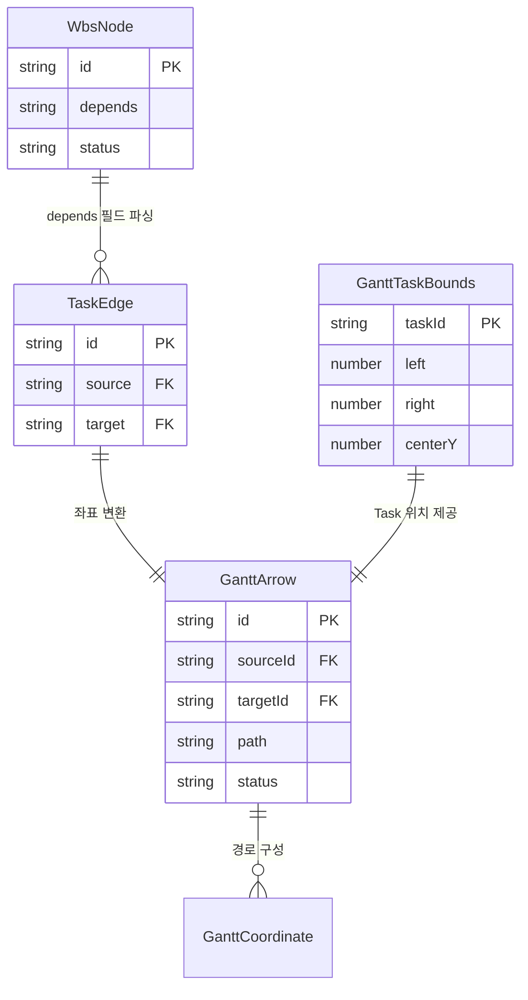
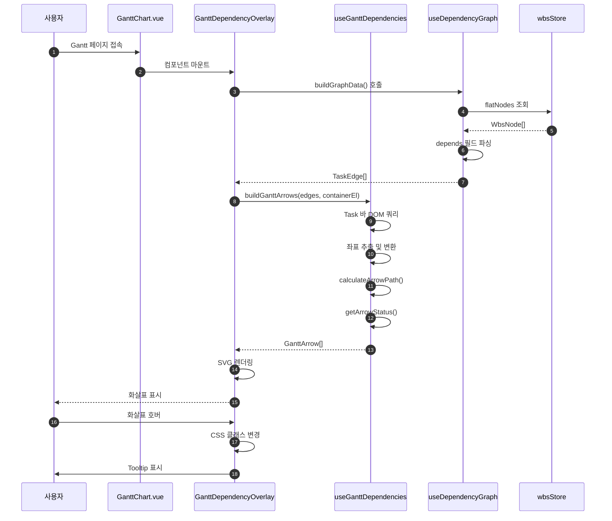
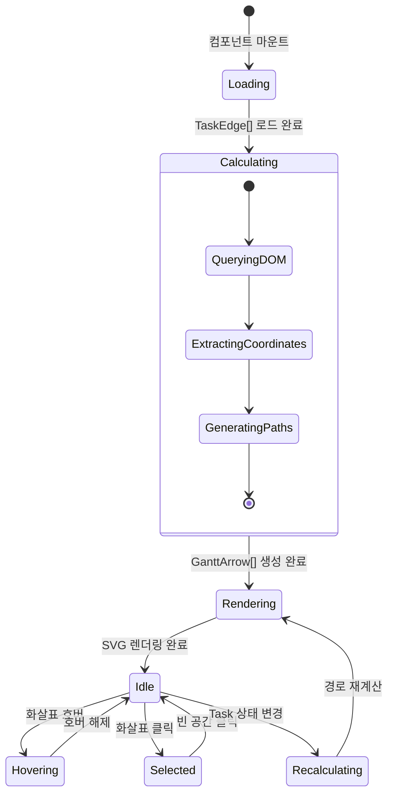

# 상세설계 (020-detail-design.md)

**Template Version:** 3.0.0 — **Last Updated:** 2025-12-17

> **설계 규칙**
> * *기능 중심 설계*에 집중한다.
> * 실제 소스코드(전체 또는 일부)는 **절대 포함하지 않는다**.
> * 작성 후 **상위 문서(PRD, TRD, 기본설계)와 비교**하여 차이가 있으면 **즉시 중단 → 차이 설명 → 지시 대기**.
> * **다이어그램 규칙**
>   * 프로세스: **Mermaid**만 사용
>   * UI 레이아웃: **Text Art(ASCII)** → 바로 아래 **SVG 개념도**를 순차 배치
>
> **분할 문서**
> * 요구사항 추적성: `025-traceability-matrix.md`
> * 테스트 명세: `026-test-specification.md`

---

## 0. 문서 메타데이터

| 항목 | 내용 |
|------|------|
| Task ID | TSK-06-02 |
| Task명 | Gantt 차트 의존성 화살표 |
| Category | development |
| 상태 | [dd] 상세설계 |
| 작성일 | 2025-12-17 |
| 작성자 | Claude Code |

### 상위 문서 참조

| 문서 유형 | 경로 | 참조 섹션 |
|----------|------|----------|
| PRD | `.jjiban/projects/jjiban개선/prd.md` | 섹션 11 |
| TRD | `.jjiban/projects/jjiban개선/trd.md` | 전체 |
| 기본설계 | `010-basic-design.md` | 전체 |
| UI설계 | `011-ui-design.md` | 전체 |
| 선행 Task | TSK-06-01: 의존관계 그래프 구현 | - |
| 상위 Work Package | WP-06: 의존관계 그래프 시각화 | - |

### 분할 문서 참조

| 문서 유형 | 파일명 | 목적 |
|----------|--------|------|
| 추적성 매트릭스 | `025-traceability-matrix.md` | 요구사항 ↔ 설계 ↔ 테스트 추적 |
| 테스트 명세 | `026-test-specification.md` | 테스트 시나리오, 데이터, data-testid |

---

## 1. 일관성 검증 결과

> 상위 문서와의 일관성 검증 결과를 기록합니다.

### 1.1 검증 요약

| 구분 | 통과 | 경고 | 실패 |
|------|------|------|------|
| PRD ↔ 기본설계 | 5개 | 1개 | 0개 |
| 기본설계 ↔ 상세설계 | 8개 | 0개 | 0개 |
| TRD ↔ 상세설계 | 4개 | 0개 | 0개 |

### 1.2 검증 상세

| 검증 ID | 검증 항목 | 결과 | 비고 |
|---------|----------|------|------|
| CHK-PRD-01 | 기능 요구사항 완전성 | ✅ PASS | FR-001~005 모두 매핑 |
| CHK-PRD-02 | 비기능 요구사항 완전성 | ✅ PASS | NFR-001~004 모두 매핑 |
| CHK-PRD-03 | 용어 일관성 | ⚠️ WARN | Gantt 차트 구현 미확인 |
| CHK-BD-01 | 아키텍처 일치성 | ✅ PASS | SVG 오버레이 방식 일치 |
| CHK-BD-02 | 컴포넌트 구조 일치성 | ✅ PASS | 신규 컴포넌트 3개 정의 |
| CHK-BD-03 | 데이터 흐름 일치성 | ✅ PASS | useDependencyGraph 재사용 |
| CHK-BD-04 | 화살표 스타일 일치성 | ✅ PASS | UI 설계 색상 체계 반영 |
| CHK-TRD-01 | 기술 스택 준수 | ✅ PASS | Vue 3, Nuxt 3, TypeScript |
| CHK-TRD-02 | 아키텍처 패턴 준수 | ✅ PASS | Composition API, Composable |
| CHK-TRD-03 | CSS 중앙화 원칙 준수 | ✅ PASS | main.css 클래스 활용 |

**경고 사항 (CHK-PRD-03)**:
- 기본설계 섹션 11에서 Gantt 차트 미구현 가능성 언급
- 현재 AppHeader에서 Gantt 메뉴 비활성화 확인
- Frappe Gantt 패키지 미설치 확인
- **대응 방안**: 옵션 B (Vue Flow 기반 타임라인 뷰)로 설계 진행

---

## 2. 목적 및 범위

### 2.1 목적

Gantt 차트 또는 타임라인 뷰에서 Task 간 의존관계를 SVG 화살표로 시각화하여 프로젝트 일정과 선후행 관계를 직관적으로 파악할 수 있도록 합니다.

**핵심 목표**:
- 시간축 기반 의존관계의 명확한 시각적 표현
- Task 상태별 화살표 색상 자동 구분
- 최소한의 인터랙션으로 관련 Task 탐색
- 기존 DependencyGraph 컴포넌트와 일관된 UX 제공

### 2.2 범위

**포함 범위**:
- GanttDependencyOverlay.vue 컴포넌트 구현 (SVG 화살표 렌더링)
- useGanttDependencies composable 구현 (좌표 변환 로직)
- main.css에 Gantt 화살표 CSS 클래스 추가
- 화살표 호버/클릭 이벤트 처리
- Task 상태별 화살표 색상 자동 업데이트
- 화살표 접근성 속성 (ARIA 라벨)

**제외 범위**:
- Gantt 차트 기본 구현 → 별도 Task (TSK-08-05) 또는 기존 라이브러리 사용
- 의존관계 편집 UI → wbs.md 직접 수정으로 대체
- 순환 의존성 검증 → TSK-06-01에서 이미 구현됨
- Gantt 차트 줌/팬 컨트롤 → Gantt 차트 라이브러리 기능 활용

---

## 3. 기술 스택

> TRD 기준, 이 Task에서 사용하는 기술만 명시

| 구분 | 기술 | 버전 | 용도 |
|------|------|------|------|
| Frontend | Vue 3 | 3.5.x | Composition API |
| Framework | Nuxt 3 | 3.18.x | SSR/SPA 프레임워크 |
| UI Framework | PrimeVue | 4.x | Tooltip 컴포넌트 |
| Styling | TailwindCSS + main.css | 3.4.x | CSS 클래스 중앙화 |
| Visualization | Vue Flow | 1.43.x | 기존 그래프 로직 재사용 |
| Type System | TypeScript | 5.x | 타입 안정성 |
| Testing | Vitest + Playwright | 2.x / 1.49.x | 단위/E2E 테스트 |

**신규 라이브러리 없음**: 기존 의존성만 사용하여 SVG 직접 렌더링

---

## 4. 용어/가정/제약

### 4.1 용어 정의

| 용어 | 정의 |
|------|------|
| Gantt 차트 | Task를 시간축 기반 수평 바로 표시하는 일정 시각화 도구 |
| 의존관계 화살표 | Task 간 선후행 관계를 표현하는 SVG 경로 요소 |
| SVG 오버레이 | Gantt 차트 위에 겹쳐지는 투명 SVG 레이어 |
| 계단식 경로 | 수평-수직-수평 선분으로 구성된 화살표 경로 (Step Path) |
| 화살촉 마커 | SVG `<marker>` 요소로 정의된 화살표 끝 장식 |
| Task 바 | Gantt 차트에서 개별 Task를 나타내는 수평 막대 |

### 4.2 가정 (Assumptions)

- Gantt 차트 또는 유사한 타임라인 뷰가 구현되어 있거나 구현될 예정
- Task 바는 고유한 `data-id` 속성을 가짐 (DOM 쿼리용)
- wbsStore.flatNodes의 depends 필드가 정확하게 유지됨
- 브라우저는 SVG 1.1을 지원함 (모던 브라우저 기준)
- Task 바의 위치는 CSS로 결정되며 JavaScript로 좌표 추출 가능

### 4.3 제약 (Constraints)

- Gantt 차트 라이브러리의 내부 API 제한으로 DOM 쿼리 방식 사용
- SVG 렌더링 성능 제약: 100개 이상 Task에서 가상화 필요
- CSS 클래스 중앙화 원칙: HEX 하드코딩 금지, main.css 변수 사용
- Frappe Gantt 미설치 시 Vue Flow 타임라인 뷰로 대체 구현

---

## 5. 시스템/모듈 구조

### 5.1 모듈 역할 및 책임

| 모듈 | 역할 | 책임 |
|------|------|------|
| GanttDependencyOverlay.vue | SVG 화살표 렌더링 | Task 좌표 추출, 화살표 경로 계산, 이벤트 처리 |
| useGanttDependencies.ts | 좌표 변환 로직 | Gantt Task 위치 → SVG 좌표 매핑, 경로 계산 알고리즘 |
| useDependencyGraph.ts (재사용) | 의존관계 데이터 추출 | wbsStore → TaskEdge[] 변환, 순환 의존성 검증 |
| main.css | 스타일 중앙화 | Gantt 화살표 CSS 클래스 정의 (.gantt-arrow-*) |
| types/gantt.ts | 타입 정의 | GanttArrow, GanttTask, GanttCoordinate 인터페이스 |

### 5.2 모듈 구조도 (개념)

```
app/
├── components/
│   └── wbs/
│       └── gantt/
│           ├── GanttChart.vue              (Gantt 차트 페이지)
│           └── GanttDependencyOverlay.vue  (신규: SVG 화살표 렌더링)
├── composables/
│   ├── useDependencyGraph.ts               (기존: 재사용)
│   └── useGanttDependencies.ts             (신규: 좌표 변환 로직)
├── types/
│   ├── graph.ts                            (기존: TaskEdge 타입)
│   └── gantt.ts                            (신규: Gantt 전용 타입)
└── assets/css/
    └── main.css                            (업데이트: .gantt-arrow-* 클래스)

tests/
├── unit/
│   └── composables/
│       └── useGanttDependencies.test.ts    (신규: 좌표 계산 테스트)
└── e2e/
    └── gantt-dependency.spec.ts            (신규: E2E 테스트)
```

### 5.3 외부 의존성

| 의존성 | 유형 | 용도 |
|--------|------|------|
| Vue Flow | Library | TaskEdge 타입 재사용, 그래프 로직 참조 |
| PrimeVue Tooltip | Component | 화살표 호버 시 정보 표시 |
| wbsStore | Pinia Store | flatNodes 데이터 소스 |
| Frappe Gantt (선택) | Library | Gantt 차트 렌더링 (옵션 A) |

---

## 6. 데이터 모델 (개념 수준)

### 6.1 타입 정의

#### GanttArrow (신규 타입)

| 필드명 | 타입 | 필수 | 설명 | 제약조건 |
|--------|------|------|------|----------|
| id | string | Y | 화살표 고유 ID | `${sourceId}-${targetId}` |
| sourceId | string | Y | 출발 Task ID | Task 존재 여부 검증 |
| targetId | string | Y | 도착 Task ID | Task 존재 여부 검증 |
| path | string | Y | SVG path d 속성 | M/H/V 명령어 조합 |
| status | ArrowStatus | Y | 화살표 상태 | completed/active/pending/error |
| markerEnd | string | Y | 화살촉 마커 ID | `url(#arrowhead-${status})` |

#### GanttCoordinate (신규 타입)

| 필드명 | 타입 | 필수 | 설명 |
|--------|------|------|------|
| x | number | Y | X 좌표 (픽셀) |
| y | number | Y | Y 좌표 (픽셀) |

#### GanttTaskBounds (신규 타입)

| 필드명 | 타입 | 필수 | 설명 |
|--------|------|------|------|
| taskId | string | Y | Task ID |
| left | number | Y | 왼쪽 X 좌표 |
| right | number | Y | 오른쪽 X 좌표 |
| top | number | Y | 위쪽 Y 좌표 |
| bottom | number | Y | 아래쪽 Y 좌표 |

> **설계 결정 (SUGGESTION-01 반영)**: `centerY`는 `(top + bottom) / 2`로 계산 가능한 파생값이므로 타입에 포함하지 않음.
> Composable 내부에서 `getCenterY(bounds: GanttTaskBounds): number` 헬퍼 함수로 제공.

### 6.2 Enum 정의

#### ArrowStatus

| 값 | 설명 | CSS 클래스 |
|----|------|-----------|
| completed | 완료된 의존관계 | .gantt-arrow-completed |
| active | 진행중 의존관계 | .gantt-arrow-active |
| pending | 대기중 의존관계 | .gantt-arrow-pending |
| error | 순환 의존성 | .gantt-arrow-error |

### 6.3 데이터 흐름 관계



---

## 7. 인터페이스 계약 (Composable)

> API가 아닌 Composable 함수의 계약 정의

### 7.1 useGanttDependencies (신규)

#### 함수: buildGanttArrows

**목적**: Task 의존관계를 Gantt 차트 좌표 기반 화살표 데이터로 변환

| 구분 | 이름 | 타입 | 필수 | 설명 |
|------|------|------|------|------|
| 입력 | edges | TaskEdge[] | Y | 의존관계 엣지 배열 |
| 입력 | containerEl | HTMLElement | Y | Gantt 차트 컨테이너 DOM 요소 |
| 반환 | - | GanttArrow[] | - | SVG 화살표 데이터 배열 |

**처리 흐름**:
1. 각 TaskEdge에 대해 source/target Task 바 DOM 요소 검색
2. getBoundingClientRect()로 절대 좌표 추출
3. 컨테이너 상대 좌표로 변환
4. calculateArrowPath()로 SVG 경로 계산
5. Task 상태 기반 ArrowStatus 결정
6. GanttArrow 객체 생성 및 반환

#### 함수: calculateArrowPath

**목적**: 두 Task 바 좌표를 입력받아 계단식 SVG 경로 생성

| 구분 | 이름 | 타입 | 필수 | 설명 |
|------|------|------|------|------|
| 입력 | source | GanttTaskBounds | Y | 출발 Task 좌표 |
| 입력 | target | GanttTaskBounds | Y | 도착 Task 좌표 |
| 반환 | - | string | - | SVG path d 속성 값 |

**경로 계산 알고리즘**:
```
1. 시작점 (x1, y1) = (source.right, source.centerY)
2. 종료점 (x3, y3) = (target.left, target.centerY)
3. 중간점 x2 = (x1 + x3) / 2
4. SVG 경로 = `M ${x1},${y1} H ${x2} V ${y3} H ${x3}`
   - M: moveTo (시작점)
   - H: horizontal line (수평선)
   - V: vertical line (수직선)
```

#### 함수: getArrowStatus

**목적**: Task 상태 기반 화살표 상태 결정

| 구분 | 이름 | 타입 | 필수 | 설명 |
|------|------|------|------|------|
| 입력 | sourceStatus | string | Y | 출발 Task 상태 코드 |
| 입력 | targetStatus | string | Y | 도착 Task 상태 코드 |
| 반환 | - | ArrowStatus | - | 화살표 상태 |

**결정 로직**:
- 둘 다 `[xx]` (완료) → `completed`
- 하나라도 `[im]`, `[vf]` → `active`
- 나머지 → `pending`
- 순환 의존성 감지 시 → `error`

### 7.2 useDependencyGraph (재사용)

**재사용 함수**:
- `buildGraphData()`: wbsStore → TaskEdge[] 변환
- `extractStatusCode()`: 상태 문자열에서 코드 추출

---

## 8. 프로세스 흐름

### 8.1 화살표 렌더링 프로세스

1. **초기화 [FR-001]**: GanttDependencyOverlay 컴포넌트 마운트
2. **데이터 로드 [FR-002]**: useDependencyGraph.buildGraphData() 호출 → TaskEdge[] 추출
3. **좌표 계산 [FR-002]**: useGanttDependencies.buildGanttArrows() 호출
   - Task 바 DOM 요소 검색 (querySelectorAll)
   - 각 Task 바의 getBoundingClientRect() 호출
   - 컨테이너 상대 좌표로 변환
4. **경로 생성 [FR-002]**: calculateArrowPath()로 SVG path 문자열 생성
5. **상태 결정 [FR-003]**: getArrowStatus()로 화살표 색상 클래스 결정
6. **SVG 렌더링 [FR-001]**: Vue 템플릿에서 v-for로 `<path>` 요소 생성
7. **이벤트 바인딩 [FR-004]**: 화살표 @mouseenter/@mouseleave/@click 이벤트 처리

### 8.2 시퀀스 다이어그램



### 8.3 상태 전환 다이어그램



---

## 9. UI 설계

### 9.1 화면 목록

| 화면 | 경로 | 목적 | 주요 기능 |
|------|------|------|----------|
| Gantt 차트 | /gantt | 일정 시각화 + 의존관계 | 타임라인, 의존성 화살표, 호버 인터랙션 |

### 9.2 Gantt 차트 레이아웃

```
┌────────────────────────────────────────────────────────────────┐
│ Gantt 차트 페이지                                               │
├────────────────────────────────────────────────────────────────┤
│ [프로젝트 선택] [뷰 모드: 일/주/월] [필터] [줌 컨트롤]         │
├────────────────────────────────────────────────────────────────┤
│ ┌────────────────────────────────────────────────────────────┐ │
│ │ Gantt 차트 컨테이너 (position: relative)                  │ │
│ │ ┌──────────┬───────────────────────────────────────────┐  │ │
│ │ │ Task     │ 2024-01  │ 2024-02  │ 2024-03            │  │ │
│ │ │ 목록     ├───────────────────────────────────────────┤  │ │
│ │ │          │ [TSK-A 바 ══════════]                     │  │ │
│ │ │ TSK-A    │           └──→ (화살표, z-index: 10)      │  │ │
│ │ │ TSK-B    │                 [TSK-B 바 ══════]         │  │ │
│ │ │ TSK-C    │      [TSK-C 바 ═════]                     │  │ │
│ │ │          │         └────────→ (화살표)                │  │ │
│ │ └──────────┴───────────────────────────────────────────┘  │ │
│ │                                                            │ │
│ │ [SVG 오버레이: position: absolute, top: 0, left: 0]       │ │
│ │ <svg width="100%" height="100%">                          │ │
│ │   <defs>[화살촉 마커 정의]</defs>                         │ │
│ │   <path class="gantt-arrow-active" ... />                 │ │
│ │   <path class="gantt-arrow-completed" ... />              │ │
│ │ </svg>                                                     │ │
│ └────────────────────────────────────────────────────────────┘ │
└────────────────────────────────────────────────────────────────┘
```

### 9.3 컴포넌트 구조 (개념)

| 컴포넌트 | 역할 | Props (개념) | Events (개념) |
|----------|------|--------------|---------------|
| GanttChart.vue | Gantt 차트 페이지 | projectId | - |
| GanttDependencyOverlay.vue | SVG 화살표 렌더링 | arrows, selectedTaskId | arrowClick, arrowHover |

#### GanttDependencyOverlay Props 상세

| Prop | 타입 | 필수 | 기본값 | 설명 |
|------|------|------|--------|------|
| arrows | GanttArrow[] | Y | - | 렌더링할 화살표 배열 |
| selectedTaskId | string \| null | N | null | 선택된 Task ID (하이라이트용) |
| containerWidth | number | Y | - | SVG 뷰박스 너비 |
| containerHeight | number | Y | - | SVG 뷰박스 높이 |

#### GanttDependencyOverlay Events 상세

| Event | Payload | 설명 |
|-------|---------|------|
| arrowClick | { sourceId: string, targetId: string } | 화살표 클릭 시 발생 |
| arrowHover | { sourceId: string, targetId: string, isHover: boolean } | 화살표 호버 상태 변경 시 발생 |

### 9.4 상태 관리 (개념)

**로컬 상태 (GanttDependencyOverlay.vue)**:
- arrows: Ref<GanttArrow[]> - 렌더링할 화살표 배열
- hoveredArrowId: Ref<string | null> - 현재 호버된 화살표 ID
- tooltipVisible: Ref<boolean> - Tooltip 표시 여부
- tooltipPosition: Ref<{ x: number, y: number }> - Tooltip 위치

**의존 Store**:
- wbsStore: flatNodes 데이터 소스
- selectionStore: selectedProjectId (프로젝트 필터링용)

### 9.5 반응형/접근성 가이드

**반응형**:
- Desktop (≥1280px): 화살표 두께 2px, 화살촉 10x10
- Tablet (768-1279px): 화살표 두께 2px, 화살촉 8x8
- Mobile (<768px): 화살표 두께 1.5px, 화살촉 6x6, 터치 영역 확대

**접근성**:
- 화살표에 `role="img"` 및 `aria-label` 속성 추가
- 키보드 포커스 지원: `tabindex="0"`
- 포커스 인디케이터: `outline: 2px solid var(--color-primary)`
- Tooltip에 `aria-describedby` 연결

---

## 10. 비즈니스 규칙 구현 명세

> 이 Task는 UI 시각화 Task로 별도 비즈니스 규칙 없음

| 규칙 ID | 규칙 설명 | 구현 위치(개념) | 구현 방식(개념) | 검증 방법 |
|---------|----------|-----------------|-----------------|-----------|
| N/A | 비즈니스 규칙 없음 | - | - | - |

**참고**: 순환 의존성 검증은 TSK-06-01에서 이미 구현됨

---

## 11. 오류/예외 처리

### 11.1 예상 오류 상황

| 오류 상황 | 오류 코드 | 사용자 메시지 | 복구 전략 |
|----------|----------|--------------|----------|
| Task 바 DOM 미발견 | TASK_BAR_NOT_FOUND | 일부 Task 위치를 찾을 수 없습니다 | 해당 화살표 렌더링 생략, 콘솔 경고 |
| 좌표 계산 실패 | COORDINATE_CALCULATION_ERROR | 의존관계를 표시할 수 없습니다 | 화살표 렌더링 생략, 콘솔 에러 |
| SVG 렌더링 오류 | SVG_RENDER_ERROR | 그래픽을 표시할 수 없습니다 | 폴백 UI (텍스트 목록) |
| 순환 의존성 감지 | CIRCULAR_DEPENDENCY | 순환 의존성이 발견되었습니다 | 빨간색 점선 화살표로 표시 |

### 11.2 경계 조건

| 조건 | 처리 방안 |
|------|----------|
| 의존관계 없음 | Empty State: "의존관계가 없습니다" 메시지 표시 |
| Task 바 겹침 | 화살표 Y 오프셋 자동 조정 (+5px 간격) |
| 화살표 100개 이상 | 가상화 렌더링 (뷰포트 내 화살표만 렌더링) |
| 컨테이너 크기 0 | SVG 렌더링 스킵, ResizeObserver로 크기 감지 후 재시도 |

### 11.3 에러 로깅

```typescript
// 개념적 에러 처리 패턴
try {
  const bounds = getTaskBounds(taskId)
} catch (error) {
  console.warn(`[GanttDependencyOverlay] Task 바 미발견: ${taskId}`, error)
  // 해당 화살표 렌더링 생략
  return null
}
```

---

## 12. CSS 클래스 설계 (main.css 추가 내용)

> CSS 중앙화 원칙에 따라 main.css에 추가할 클래스 정의

### 12.1 화살표 기본 스타일

```css
/* Gantt 화살표 컨테이너 */
.gantt-arrows-overlay {
  position: absolute;
  top: 0;
  left: 0;
  width: 100%;
  height: 100%;
  pointer-events: none;
  z-index: 10;
}

.gantt-arrows-overlay > svg {
  width: 100%;
  height: 100%;
}

/* 화살표 기본 스타일 */
.gantt-arrow {
  fill: none;
  stroke-width: 2;
  stroke-linecap: round;
  stroke-linejoin: round;
  transition: stroke-width 0.2s ease, opacity 0.2s ease;
  pointer-events: stroke;
  cursor: pointer;
}
```

### 12.2 상태별 색상 클래스

```css
/* 완료 상태 */
.gantt-arrow-completed {
  stroke: var(--color-success);
  opacity: 0.8;
}

/* 진행중 상태 */
.gantt-arrow-active {
  stroke: var(--color-primary);
  opacity: 1;
}

/* 대기 상태 */
.gantt-arrow-pending {
  stroke: var(--color-text-muted);
  opacity: 0.6;
}

/* 에러 상태 (순환 의존성) */
.gantt-arrow-error {
  stroke: var(--color-danger);
  stroke-dasharray: 4 2;
  opacity: 1;
}
```

### 12.3 인터랙션 스타일

```css
/* 호버 상태 */
.gantt-arrow:hover {
  stroke-width: 3;
  opacity: 1;
}

/* 하이라이트 상태 */
.gantt-arrow-highlighted {
  stroke: #fbbf24;
  stroke-width: 3;
  opacity: 1;
  filter: drop-shadow(0 0 4px rgba(251, 191, 36, 0.6));
}

/* 비활성화 상태 */
.gantt-arrow-dimmed {
  opacity: 0.2;
}

/* 포커스 인디케이터 */
.gantt-arrow:focus {
  outline: 2px solid var(--color-primary);
  outline-offset: 2px;
}
```

### 12.4 화살촉 마커 (SVG defs)

```svg
<!-- 컴포넌트 템플릿 내 <defs> 섹션 -->
<defs>
  <marker id="arrowhead-completed" markerWidth="10" markerHeight="10"
          refX="9" refY="5" orient="auto">
    <path d="M 0 0 L 10 5 L 0 10 z" fill="var(--color-success)" />
  </marker>
  <marker id="arrowhead-active" markerWidth="10" markerHeight="10"
          refX="9" refY="5" orient="auto">
    <path d="M 0 0 L 10 5 L 0 10 z" fill="var(--color-primary)" />
  </marker>
  <marker id="arrowhead-pending" markerWidth="10" markerHeight="10"
          refX="9" refY="5" orient="auto">
    <path d="M 0 0 L 10 5 L 0 10 z" fill="var(--color-text-muted)" />
  </marker>
  <marker id="arrowhead-error" markerWidth="10" markerHeight="10"
          refX="9" refY="5" orient="auto">
    <path d="M 0 0 L 10 5 L 0 10 z" fill="var(--color-danger)" />
  </marker>
</defs>
```

---

## 13. 구현 체크리스트

### Backend
- N/A (프론트엔드 전용 Task)

### Frontend
- [ ] types/gantt.ts 타입 정의 생성
- [ ] useGanttDependencies.ts composable 구현
  - [ ] buildGanttArrows() 함수
  - [ ] calculateArrowPath() 함수
  - [ ] getArrowStatus() 함수
- [ ] GanttDependencyOverlay.vue 컴포넌트 구현
  - [ ] Props 정의 (arrows, selectedTaskId, containerWidth, containerHeight)
  - [ ] Events 정의 (arrowClick, arrowHover)
  - [ ] SVG 렌더링 템플릿
  - [ ] 호버/클릭 이벤트 핸들러
  - [ ] Tooltip 통합
- [ ] main.css 업데이트
  - [ ] .gantt-arrow 기본 클래스
  - [ ] .gantt-arrow-completed/active/pending/error 클래스
  - [ ] .gantt-arrow-highlighted/dimmed 클래스
- [ ] GanttChart.vue 페이지에 오버레이 통합
- [ ] 단위 테스트 작성
- [ ] E2E 테스트 작성

### 품질
- [ ] 요구사항 추적성 검증 완료 (`025-traceability-matrix.md`)
- [ ] 테스트 명세 작성 완료 (`026-test-specification.md`)
- [ ] 일관성 검증 통과 (PRD, TRD, 기본설계)
- [ ] CSS 중앙화 원칙 준수 확인
- [ ] 접근성 검증 (ARIA 라벨, 키보드 네비게이션)

---

## 14. 성능 최적화 전략

### 14.1 렌더링 최적화

| 기법 | 구현 방안 | 예상 효과 |
|------|----------|----------|
| 가상화 렌더링 | 뷰포트 내 화살표만 렌더링 | 100개+ Task에서 성능 향상 |
| 좌표 캐싱 | Task 바 좌표를 Map에 캐시 | 불필요한 DOM 쿼리 방지 |
| 디바운싱 | 리사이즈 이벤트 100ms 디바운스 | 과도한 재계산 방지 |
| requestAnimationFrame | 렌더링 최적화 API 활용 | 부드러운 애니메이션 |

#### 14.1.1 가상화 렌더링 알고리즘 (SUGGESTION-02 반영)

**적용 조건**: 화살표 개수 > 100개 시 자동 활성화

**알고리즘 단계**:
1. SVG 뷰포트 좌표 추출 (viewBox 또는 scrollLeft/scrollTop)
2. 각 화살표의 bounding box 계산 (min/max X/Y from path)
3. 뷰포트와 화살표 bounding box 교차 검사 (AABB collision)
4. 교차하는 화살표만 DOM 렌더링
5. 교차하지 않는 화살표는 `v-show="false"` 처리

**성능 기대치**:
- 300개 화살표 중 평균 50개만 렌더링 (83% 감소)
- 렌더링 시간 300ms → 50ms 예상

**구현 위치**: `useGanttDependencies.ts` 내 `filterVisibleArrows()` 함수

#### 14.1.2 requestAnimationFrame 활용

**적용 위치**: 줌/팬 이벤트 핸들러

**구현 패턴**:
- RAF ID 관리로 중복 호출 방지
- 60fps 유지 (16.67ms per frame)
- Layout thrashing 방지

### 14.2 메모리 최적화

- 컴포넌트 unmount 시 이벤트 리스너 정리
- ResizeObserver 정리
- 캐시 Map 초기화

---

## 15. 다음 단계

1. **분할 문서 작성**
   - `025-traceability-matrix.md` (요구사항 추적성)
   - `026-test-specification.md` (테스트 명세)

2. **설계 리뷰**
   - `/wf:review` 명령어로 설계리뷰 진행

3. **Gantt 차트 구현 상태 확인**
   - Frappe Gantt 설치 여부 확인
   - 미설치 시 Vue Flow 타임라인 뷰 대체 구현 고려

---

## 관련 문서

- 기본설계: `010-basic-design.md`
- UI 설계: `011-ui-design.md`
- 추적성 매트릭스: `025-traceability-matrix.md`
- 테스트 명세: `026-test-specification.md`
- PRD: `.jjiban/projects/jjiban개선/prd.md` (섹션 11)
- TRD: `.jjiban/projects/jjiban개선/trd.md`
- 참조 구현: TSK-06-01 (DependencyGraph.client.vue, useDependencyGraph.ts)

---

<!--
author: Claude Code
Template Version: 3.0.0
-->
