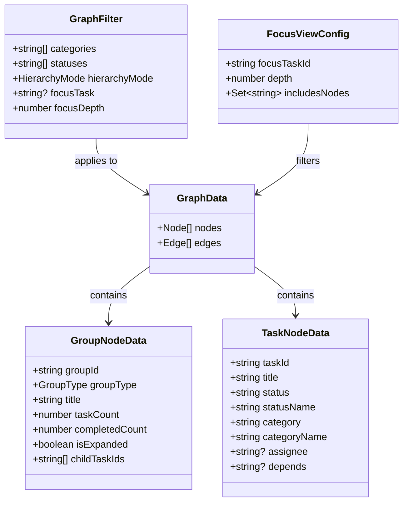
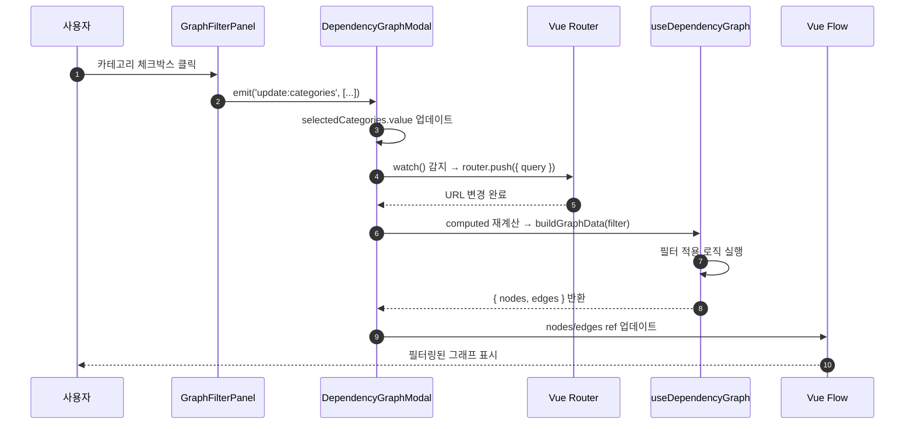
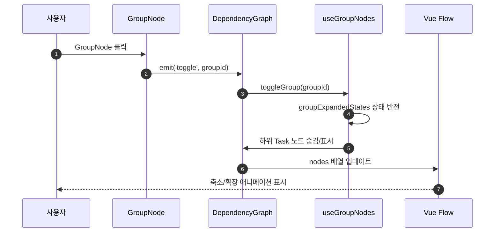
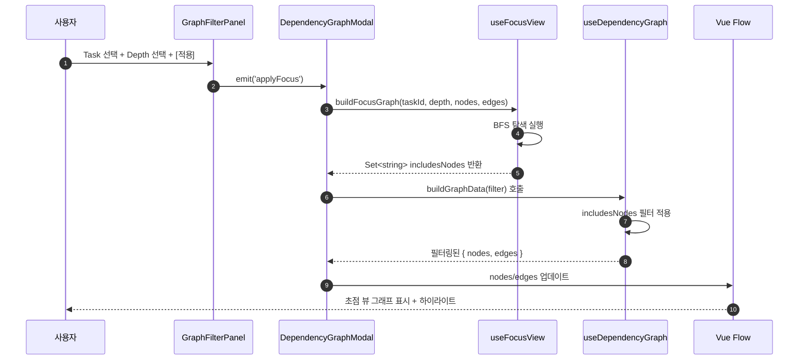

# 상세설계 (020-detail-design.md)

**Template Version:** 3.0.0 — **Last Updated:** 2025-12-17

> **설계 규칙**
> * *기능 중심 설계*에 집중한다.
> * 실제 소스코드(전체 또는 일부)는 **절대 포함하지 않는다**.
> * 작성 후 **상위 문서(PRD, TRD, 기본설계)와 비교**하여 차이가 있으면 **즉시 중단 → 차이 설명 → 지시 대기**.
> * **다이어그램 규칙**
>   * 프로세스: **Mermaid**만 사용
>   * UI 레이아웃: **Text Art(ASCII)** → 바로 아래 **SVG 개념도**를 순차 배치
>
> **분할 문서**
> * 요구사항 추적성: `025-traceability-matrix.md`
> * 테스트 명세: `026-test-specification.md`

---

## 0. 문서 메타데이터

| 항목 | 내용 |
|------|------|
| Task ID | TSK-06-03 |
| Task명 | 의존관계 그래프 필터 및 계층 접기 |
| Category | development |
| 상태 | [dd] 상세설계 |
| 작성일 | 2025-12-17 |
| 작성자 | Claude |
| 최종 수정일 | 2025-12-17 |
| 수정 사유 | 설계 리뷰 피드백 반영 (021-design-review-claude-1.md) |

### 변경 이력

| 버전 | 일시 | 변경 사유 | 변경 내용 |
|------|------|----------|----------|
| 1.0 | 2025-12-17 | 초기 작성 | 상세설계 최초 작성 |
| 1.1 | 2025-12-17 | 설계 리뷰 반영 | MAJOR-01~03, MINOR-01~05 이슈 반영 |

### 리뷰 반영 사항 요약

| 이슈 ID | 카테고리 | 반영 섹션 | 변경 내용 요약 |
|---------|---------|----------|--------------|
| MAJOR-01 | 그룹 노드 레이아웃 | 7.1 | 그룹 노드 position 계산 알고리즘 명확화 (x, y 좌표 계산 전략) |
| MAJOR-02 | BFS 성능 최적화 | 7.1 | 순환 의존성 처리 로직 추가, 인접 리스트 사전 구축 최적화 |
| MAJOR-03 | URL 길이 제한 | 7.2 | URL 파라미터 길이 체크 및 압축 전략 추가 |
| MINOR-01 | TaskNode Props | 7.6 | focusDepth와 highlightType 우선순위 및 통합 로직 명시 |
| MINOR-02 | watch 성능 | 8.1 | debounce 300ms 적용, router.replace 사용 명시 |
| MINOR-03 | 진행률 계산 | 7.1 | completedCount 계산 규칙 명확화 ([xx] 상태만, 필터링된 Task 기준) |
| MINOR-04 | 초기 펼침 상태 | 7.4 | 반응형 브레이크포인트별 초기 상태 로직 추가 |
| MINOR-05 | 엣지 처리 | 8.2 | 그룹 축소 시 엣지 리라우팅 및 중복 제거 전략 명시 |

### 상위 문서 참조

| 문서 유형 | 경로 | 참조 섹션 |
|----------|------|----------|
| PRD | `.jjiban/projects/jjiban개선/prd.md` | 섹션 11.4 |
| TRD | `.jjiban/projects/jjiban개선/trd.md` | 전체 |
| 기본설계 | `010-basic-design.md` | 전체 |
| 화면설계 | `011-ui-design.md` | 전체 |
| 상위 Work Package | WP-06: 의존관계 시각화 | - |
| 선행 Task | TSK-06-01: 의존관계 그래프 시각화 | 030-implementation.md |

### 분할 문서 참조

| 문서 유형 | 파일명 | 목적 |
|----------|--------|------|
| 추적성 매트릭스 | `025-traceability-matrix.md` | 요구사항 ↔ 설계 ↔ 테스트 추적 |
| 테스트 명세 | `026-test-specification.md` | 테스트 시나리오, 데이터, data-testid |

---

## 1. 일관성 검증 결과

> 상위 문서와의 일관성 검증 결과를 기록합니다.

### 1.1 검증 요약

| 구분 | 통과 | 경고 | 실패 |
|------|------|------|------|
| PRD ↔ 기본설계 | 7개 | 0개 | 0개 |
| 기본설계 ↔ 상세설계 | 15개 | 0개 | 0개 |
| TRD ↔ 상세설계 | 5개 | 0개 | 0개 |

### 1.2 검증 상세

| 검증 ID | 검증 항목 | 결과 | 비고 |
|---------|----------|------|------|
| CHK-PRD-01 | 기능 요구사항 완전성 (11.4 의존관계 필터링) | ✅ PASS | 모든 요구사항 반영 |
| CHK-PRD-02 | 비즈니스 규칙 일치성 | ✅ PASS | 추가 비즈니스 규칙 없음 |
| CHK-PRD-03 | 용어 일관성 (Task, WP, ACT) | ✅ PASS | WBS 용어 일치 |
| CHK-BD-01 | 기능 요구사항 완전성 (FR-001~007) | ✅ PASS | 7개 모두 구현 명세 포함 |
| CHK-BD-02 | 아키텍처 개요 일치성 | ✅ PASS | 컴포넌트 구조 일치 |
| CHK-BD-03 | 데이터 흐름 일치성 | ✅ PASS | URL 파라미터 → 필터 → 그래프 흐름 일치 |
| CHK-BD-04 | 필터링 전략 일치성 | ✅ PASS | 클라이언트 측 필터링, BFS 알고리즘 |
| CHK-BD-05 | 계층 그룹 전략 일치성 | ✅ PASS | GroupNode 컴포넌트 분리 |
| CHK-BD-06 | 초점 뷰 전략 일치성 | ✅ PASS | BFS depth 1~3 제한 |
| CHK-BD-07 | URL 파라미터 설계 일치성 | ✅ PASS | 파라미터 명세 일치 |
| CHK-TRD-01 | 기술 스택 준수 (Vue 3, Nuxt 3) | ✅ PASS | Composition API, Vue Flow |
| CHK-TRD-02 | UI 프레임워크 준수 (PrimeVue 4.x) | ✅ PASS | Checkbox, MultiSelect, RadioButton 등 |
| CHK-TRD-03 | 스타일링 준수 (TailwindCSS, main.css) | ✅ PASS | CSS 클래스 중앙화 원칙 |
| CHK-TRD-04 | 상태 관리 준수 (Pinia) | ✅ PASS | wbsStore, selectionStore 활용 |
| CHK-TRD-05 | 타입 안정성 (TypeScript) | ✅ PASS | types/graph.ts 확장 |

---

## 2. 목적 및 범위

### 2.1 목적

TSK-06-01에서 구현된 의존관계 그래프에 **필터링, 계층 접기, 초점 뷰** 기능을 추가하여 대규모 프로젝트(100개 이상 Task)에서도 의존관계를 효과적으로 탐색할 수 있게 합니다.

**핵심 가치**:
- 대규모 프로젝트 가독성: WP/ACT 그룹 단위 축소로 구조 파악 용이
- 초점 뷰: 특정 Task 중심 의존관계만 표시하여 복잡도 감소
- 지속성: URL 파라미터로 필터 설정 공유 가능

### 2.2 범위

**포함 범위** (기본설계 구현 범위의 기술적 구현 사항):
- GraphFilterPanel 컴포넌트 개발 (PrimeVue 기반 필터 UI)
- GroupNode 컴포넌트 개발 (WP/ACT 그룹 노드 표시, 축소/확장)
- TaskNode 컴포넌트 개발 (기존 인라인 템플릿 분리)
- useDependencyGraph composable 확장 (필터 적용, 그룹 생성, BFS 초점 뷰)
- types/graph.ts 타입 확장 (GraphFilter, GroupNodeData, FocusViewConfig)
- URL 파라미터 직렬화/역직렬화 유틸리티 함수
- DependencyGraph.client.vue 수정 (GroupNode 지원, 이벤트 처리)
- DependencyGraphModal.vue 수정 (FilterPanel 통합, URL 동기화)
- main.css 스타일 추가 (필터 패널, 그룹 노드, 초점 뷰 클래스)

**제외 범위** (다른 Task에서 구현):
- 의존관계 편집 기능 → 추후 기능 (미정)
- 그래프 레이아웃 수동 배치 저장 → 추후 기능 (미정)
- 프로젝트 간 의존관계 표시 → 현재 단일 프로젝트 범위

---

## 3. 기술 스택

> TRD 기준, 이 Task에서 사용하는 기술만 명시

| 구분 | 기술 | 버전 | 용도 |
|------|------|------|------|
| Frontend | Vue 3 | 3.5.x | Composition API, Reactivity |
| Framework | Nuxt 3 | 3.18.x | SSR, Routing, Auto-imports |
| UI Library | PrimeVue | 4.x | Checkbox, MultiSelect, RadioButton, Select, Button, Tag |
| Styling | TailwindCSS | 3.4.x | 유틸리티 CSS (main.css 중앙화) |
| Graph Library | Vue Flow | 1.47.x | 노드/엣지 렌더링, 레이아웃 |
| Type Safety | TypeScript | 5.x | 타입 정의 및 검증 |
| State Management | Pinia | 2.x | wbsStore, selectionStore |

---

## 4. 용어/가정/제약

### 4.1 용어 정의

| 용어 | 정의 |
|------|------|
| GroupNode | WP/ACT 계층을 대표하는 그룹 노드. 내부에 다수의 Task 노드를 포함하며, 축소/확장 가능 |
| TaskNode | 개별 Task를 나타내는 노드. 상태, 카테고리, 담당자 정보 표시 |
| Focus View | 특정 Task를 중심으로 지정된 depth 내의 의존관계만 표시하는 뷰 모드 |
| Depth | 초점 Task로부터의 의존관계 거리 (1~3). BFS 기준 최단 경로 |
| Hierarchy Mode | 계층 표시 방식 (full: 전체 Task, wp: WP 그룹, act: ACT 그룹) |
| URL Parameter Serialization | 필터 상태를 URL 쿼리 파라미터로 변환하여 저장/복원 |

### 4.2 가정 (Assumptions)

- Task 수는 프로젝트당 최대 500개 이하 (성능 최적화 기준)
- wbsStore.flatNodes에 WP/ACT/Task 노드가 모두 포함됨
- Task의 depends 필드는 쉼표 구분 문자열 또는 배열 형태
- 순환 의존성이 존재할 수 있으며, 이를 별도 처리해야 함
- URL 파라미터 최대 길이는 2000자 이하 (브라우저 제한)

### 4.3 제약 (Constraints)

- 필터 적용 시 200ms 이내 응답 (100개 노드 기준)
- 그룹 노드 축소/확장 애니메이션 100ms 이내
- URL 파라미터 복원 시 300ms 이내 완료
- 모바일 화면에서 필터 패널은 기본적으로 접힌 상태
- PrimeVue 4.x API 호환성 유지 (Breaking Change 없음)

---

## 5. 시스템/모듈 구조

> **규칙**: 구현 코드가 아닌 **구조/역할/책임**만 표현

### 5.1 모듈 역할 및 책임

| 모듈 | 역할 | 책임 |
|------|------|------|
| GraphFilterPanel | 필터 UI 제공 | 카테고리, 상태, 계층 뷰, 초점 Task 선택 UI 렌더링. 필터 변경 이벤트 발행 |
| GroupNode | 그룹 노드 표시 | WP/ACT 그룹 정보 표시, 진행률 계산, 축소/확장 이벤트 발행 |
| TaskNode | Task 노드 표시 | Task 정보 표시, 하이라이트 상태 반영, 카테고리/상태 스타일 적용 |
| useDependencyGraph | 그래프 데이터 변환 | 필터 적용, 그룹 노드 생성, BFS 초점 뷰 계산, 레벨 계산 |
| useGraphFilter | 필터 상태 관리 | 필터 선택값 관리, URL 파라미터 직렬화/역직렬화 |
| useGroupNodes | 그룹 노드 관리 | 그룹 축소/확장 상태 관리, 그룹 내 Task 숨김/표시 로직 |
| useFocusView | 초점 뷰 관리 | BFS 탐색, depth 제한 노드 집합 계산 |
| DependencyGraph.client | 그래프 캔버스 | Vue Flow 렌더링, 노드/엣지 이벤트 처리, 하이라이트 관리 |
| DependencyGraphModal | 모달 컨테이너 | FilterPanel 통합, URL 동기화, 모달 생명주기 관리 |

### 5.2 모듈 구조도 (개념)

```
app/
├── components/
│   └── wbs/
│       └── graph/
│           ├── DependencyGraphModal.vue        (URL 동기화, 모달 래퍼)
│           ├── DependencyGraph.client.vue      (Vue Flow 캔버스, 이벤트 처리)
│           ├── GraphFilterPanel.vue            (신규: 필터 UI)
│           ├── GroupNode.vue                   (신규: 그룹 노드)
│           └── TaskNode.vue                    (신규: Task 노드, 기존 인라인 분리)
│
├── composables/
│   ├── useDependencyGraph.ts                   (확장: 필터, 그룹, BFS)
│   ├── useGraphFilter.ts                       (신규: 필터 상태 관리)
│   ├── useGroupNodes.ts                        (신규: 그룹 관리)
│   └── useFocusView.ts                         (신규: 초점 뷰)
│
├── types/
│   └── graph.ts                                (확장: GraphFilter, GroupNodeData 등)
│
└── assets/
    └── css/
        └── main.css                            (확장: 필터 패널, 그룹 노드 스타일)
```

### 5.3 외부 의존성

| 의존성 | 유형 | 용도 |
|--------|------|------|
| @vue-flow/core | Library | 노드/엣지 렌더링, 레이아웃 엔진 |
| @vue-flow/background | Library | 그리드 배경 |
| @vue-flow/controls | Library | 줌/핏 컨트롤 버튼 |
| @vue-flow/minimap | Library | 미니맵 표시 |
| PrimeVue | Library | Checkbox, MultiSelect, RadioButton, Select, Button, Tag |
| wbsStore | Store | flatNodes 데이터 접근 |
| selectionStore | Store | 현재 선택된 프로젝트 ID |
| Vue Router | Framework | URL 파라미터 read/write (useRoute, useRouter) |

---

## 6. 데이터 모델 (개념 수준)

> **규칙**: 코드가 아닌 **개념 수준 필드 정의**만 기술

### 6.1 타입 정의

#### Type: GraphFilter

필터 상태를 나타내는 타입

| 필드명 | 타입 | 필수 | 설명 | 기본값 |
|--------|------|------|------|--------|
| categories | string[] | Y | 선택된 카테고리 목록 | [] (전체) |
| statuses | string[] | Y | 선택된 상태 코드 목록 | [] (전체) |
| hierarchyMode | enum | Y | 계층 표시 모드 | 'full' |
| focusTask | string \| null | Y | 초점 Task ID | null |
| focusDepth | number | Y | 초점 깊이 (1~3) | 2 |

**hierarchyMode enum**: `'full'` \| `'wp'` \| `'act'`

#### Type: GroupNodeData

그룹 노드 데이터 구조

| 필드명 | 타입 | 필수 | 설명 | 제약조건 |
|--------|------|------|------|----------|
| groupId | string | Y | 그룹 ID (예: "WP-01", "ACT-02") | Unique |
| groupType | enum | Y | 그룹 타입 | 'wp' \| 'act' |
| title | string | Y | 그룹 제목 | 1-200자 |
| taskCount | number | Y | 포함된 Task 개수 | >= 0 |
| completedCount | number | Y | 완료된 Task 개수 | >= 0, <= taskCount |
| isExpanded | boolean | Y | 확장/축소 상태 | 기본값 true |
| childTaskIds | string[] | Y | 포함된 Task ID 목록 | - |

#### Type: FocusViewConfig

초점 뷰 설정

| 필드명 | 타입 | 필수 | 설명 | 제약조건 |
|--------|------|------|------|----------|
| focusTaskId | string | Y | 초점 Task ID | - |
| depth | number | Y | 탐색 깊이 | 1~3 |
| includesNodes | Set\<string\> | Y | depth 내 Task ID 집합 | BFS 결과 |

#### Type: URLParams

URL 쿼리 파라미터 구조

| 파라미터 | 타입 | 예시 | 설명 |
|---------|------|------|------|
| categories | string | `development,infrastructure` | 카테고리 쉼표 구분 |
| statuses | string | `im,vf,xx` | 상태 코드 쉼표 구분 (괄호 제거) |
| hierarchyMode | string | `wp` | 계층 모드 ('full' 제외 시 포함) |
| focusTask | string | `TSK-06-03` | 초점 Task ID |
| focusDepth | string | `2` | 초점 깊이 |

### 6.2 관계 다이어그램



### 6.3 상태 관리 구조

| Store/Ref | 상태 | 변경 주체 | 지속성 |
|-----------|------|----------|--------|
| selectedCategories | ref\<string[]\> | GraphFilterPanel | URL 파라미터 |
| selectedStatuses | ref\<string[]\> | GraphFilterPanel | URL 파라미터 |
| hierarchyMode | ref\<HierarchyMode\> | GraphFilterPanel | URL 파라미터 |
| focusTask | ref\<string \| null\> | GraphFilterPanel | URL 파라미터 |
| focusDepth | ref\<number\> | GraphFilterPanel | URL 파라미터 |
| groupExpandedStates | ref\<Map\<string, boolean\>\> | GroupNode | 로컬 (일시적) |

---

## 7. 인터페이스 계약 (Composable/Component API)

> **규칙**: TypeScript 코드가 아닌 **표 형태의 계약 정의**

### 7.1 Composable: useDependencyGraph (확장)

#### 새로운 함수: buildGraphData (오버로드)

**요구사항**: FR-001, FR-002, FR-003, FR-004

| 파라미터 | 타입 | 필수 | 설명 |
|---------|------|------|------|
| filter | GraphFilter | N | 필터 설정 (미제공 시 전체 표시) |

| 반환 필드 | 타입 | 설명 |
|----------|------|------|
| nodes | (TaskNode \| GroupNode)[] | 필터링/그룹화된 노드 배열 |
| edges | TaskEdge[] | 필터링된 엣지 배열 |

**처리 로직 개요**:
1. 카테고리/상태 필터 적용 → Task 노드 필터링
2. 초점 뷰 활성화 시 → BFS로 depth 제한 Task 집합 계산
3. hierarchyMode 확인 → 그룹 노드 생성 여부 결정
4. 그룹 노드 생성 시 → buildGroupNodes() 호출
5. 레이아웃 계산 (위상정렬 기반 레벨)

#### 새로운 함수: buildGroupNodes

**요구사항**: FR-001

| 파라미터 | 타입 | 필수 | 설명 |
|---------|------|------|------|
| groupType | 'wp' \| 'act' | Y | 그룹 타입 |
| filteredTaskIds | Set\<string\> | Y | 필터링된 Task ID 집합 |

| 반환 필드 | 타입 | 설명 |
|----------|------|------|
| groupNodes | GroupNode[] | 생성된 그룹 노드 배열 |
| taskNodes | TaskNode[] | 그룹 내 Task 노드 배열 |

**처리 로직 개요**:
1. wbsStore.flatNodes에서 WP/ACT 노드 추출
2. 각 WP/ACT의 하위 Task 재귀 수집
3. 필터링된 Task와 교집합 계산
4. 교집합이 비어있으면 그룹 제외
5. GroupNodeData 생성 (taskCount, completedCount 계산)

**completedCount 계산 규칙** (리뷰 반영: MINOR-03):
- 정의: status === '[xx]'인 Task 개수만 완료로 간주
- 범위: filteredTaskIds에 포함된 Task만 계산 (현재 보이는 Task 기준)

**그룹 노드 position 계산 전략** (리뷰 반영: MAJOR-01):
- x: min(child.x) - GROUP_OFFSET_X (기본값: -100px, 하위 Task 왼쪽에 배치)
- y: average(child.y) (하위 Task 평균 y 좌표)
- 확장 시: 하위 Task 노드는 원래 position 유지
- 축소 시: 하위 Task 노드 숨김, 그룹 노드만 표시
- 레이아웃 충돌 방지: Vue Flow의 자동 레이아웃과 충돌하지 않도록 그룹 노드는 별도 레이어에 배치

#### 새로운 함수: buildFocusGraph

**요구사항**: FR-004

| 파라미터 | 타입 | 필수 | 설명 |
|---------|------|------|------|
| focusTaskId | string | Y | 초점 Task ID |
| depth | number | Y | 탐색 깊이 (1~3) |
| taskNodes | Map\<string, WbsNode\> | Y | 전체 Task 노드 맵 |
| edges | TaskEdge[] | Y | 전체 엣지 배열 |

| 반환 필드 | 타입 | 설명 |
|----------|------|------|
| includesNodes | Set\<string\> | depth 내 Task ID 집합 (초점 Task 포함) |

**알고리즘 개요**:
- BFS(Breadth-First Search) 사용
- 양방향 탐색 (선행: depends, 후행: 역방향 엣지)
- depth 0: 초점 Task만
- depth 1: 직접 의존하는 Task
- depth 2~3: 재귀적으로 확장

**순환 의존성 처리** (리뷰 반영: MAJOR-02):
```
의사코드:
const visited = new Set<string>()
const queue: { taskId: string, currentDepth: number }[] = [{ taskId: focusTaskId, currentDepth: 0 }]

while (queue.length > 0) {
  const { taskId, currentDepth } = queue.shift()!

  // 이미 방문한 노드는 건너뛰기 (순환 방지)
  if (visited.has(taskId)) continue
  visited.add(taskId)

  if (currentDepth >= depth) continue

  // 인접 노드 탐색 (predecessors, successors)
  for (const neighbor of getNeighbors(taskId)) {
    if (!visited.has(neighbor)) {
      queue.push({ taskId: neighbor, currentDepth: currentDepth + 1 })
    }
  }
}
```

**성능 최적화** (리뷰 반영: MAJOR-02):
- 인접 리스트(adjacency list) 사전 구축: `Map<string, { predecessors: string[], successors: string[] }>`
- buildFocusGraph 호출 시 엣지 탐색 복잡도 O(E) → O(1)로 개선
- visited Set으로 중복 방문 방지 → 순환 의존성에서 무한 루프 방지

### 7.2 Composable: useGraphFilter (신규)

**요구사항**: FR-002, FR-003, FR-005, FR-006, FR-007

#### 함수: encodeFilterToURL

| 파라미터 | 타입 | 필수 | 설명 |
|---------|------|------|------|
| filter | GraphFilter | Y | 현재 필터 상태 |

| 반환값 | 타입 | 설명 |
|--------|------|------|
| queryString | string | URL 쿼리 문자열 (예: `categories=dev,inf&statuses=im`) |

**직렬화 규칙**:
- categories: 배열 → 쉼표 구분 문자열 (빈 배열 시 생략)
- statuses: `[bd]` → `bd` (괄호 제거), 쉼표 구분 (빈 배열 시 생략)
- hierarchyMode: `full`이면 생략, 그 외 포함
- focusTask: null이면 생략, 그 외 포함
- focusDepth: focusTask 있을 때만 포함

**URL 파라미터 길이 제한 처리** (리뷰 반영: MAJOR-03):
```
의사코드:
function encodeFilterToURL(filter: GraphFilter): string {
  const queryString = /* ... URLSearchParams 생성 ... */

  if (queryString.length > 2000) {
    // Fallback: 우선순위 높은 필터만 포함
    console.warn('[useGraphFilter] URL 파라미터 길이 초과, 기본값으로 축소')
    return compressFilter(filter) // focusTask > hierarchyMode > categories(최대 3개) > statuses(최대 3개)
  }

  return queryString
}

function compressFilter(filter: GraphFilter): string {
  // 우선순위: focusTask > hierarchyMode > categories > statuses
  // 상태 필터는 3개 이상 선택 시 "all except X" 형태로 인코딩 (미구현 시 생략)
  const compressed = {
    focusTask: filter.focusTask,
    hierarchyMode: filter.hierarchyMode !== 'full' ? filter.hierarchyMode : undefined,
    categories: filter.categories.slice(0, 3), // 최대 3개
    statuses: filter.statuses.slice(0, 3) // 최대 3개
  }
  return serializeToQueryString(compressed)
}
```

**사용자 경고 메시지**:
- URL 길이 초과 시: "필터가 너무 많아 일부 설정이 URL에 저장되지 않습니다."
- 대안 전략: localStorage에 전체 필터 저장 후 URL에는 focusTask와 hierarchyMode만 포함 (추후 개선 고려)

#### 함수: parseURLParams

| 파라미터 | 타입 | 필수 | 설명 |
|---------|------|------|------|
| searchParams | URLSearchParams | Y | URL 쿼리 파라미터 객체 |

| 반환값 | 타입 | 설명 |
|--------|------|------|
| filter | GraphFilter | 복원된 필터 상태 |

**역직렬화 규칙**:
- categories: 쉼표 분리 → 배열 (없으면 빈 배열)
- statuses: 쉼표 분리 → `[bd]` 형식으로 복원 (없으면 빈 배열)
- hierarchyMode: 값 확인 → enum 검증 (없으면 'full')
- focusTask: 값 확인 (없으면 null)
- focusDepth: parseInt → number (없으면 2)

### 7.3 Composable: useGroupNodes (신규)

**요구사항**: FR-001

#### 함수: toggleGroup

| 파라미터 | 타입 | 필수 | 설명 |
|---------|------|------|------|
| groupId | string | Y | 토글할 그룹 ID |

| 반환값 | 타입 | 설명 |
|--------|------|------|
| (void) | - | groupExpandedStates 업데이트, 그래프 재렌더링 트리거 |

**처리 로직 개요**:
1. groupExpandedStates Map에서 현재 상태 조회
2. 상태 반전 (true ↔ false)
3. isExpanded가 false이면 하위 Task 노드 숨김
4. Vue Flow에 노드 업데이트 이벤트 발행

### 7.4 Component: GraphFilterPanel (신규)

**요구사항**: FR-002, FR-003, FR-006, FR-007

#### Props

| Prop | 타입 | 필수 | 기본값 | 설명 |
|------|------|------|--------|------|
| categories | string[] | N | [] | 선택된 카테고리 목록 |
| statuses | string[] | N | [] | 선택된 상태 목록 |
| hierarchyMode | 'full' \| 'wp' \| 'act' | N | 'full' | 계층 모드 |
| focusTask | string \| null | N | null | 초점 Task ID |
| focusDepth | number | N | 2 | 초점 깊이 |
| stats | { nodeCount: number, edgeCount: number } | Y | - | 그래프 통계 |

#### Emits

| Event | Payload | 설명 |
|-------|---------|------|
| update:categories | string[] | 카테고리 선택 변경 |
| update:statuses | string[] | 상태 선택 변경 |
| update:hierarchyMode | 'full' \| 'wp' \| 'act' | 계층 모드 변경 |
| update:focusTask | string \| null | 초점 Task 변경 |
| update:focusDepth | number | 초점 깊이 변경 |
| reset | - | 필터 초기화 |
| applyFocus | - | 초점 뷰 적용 |

#### 로컬 상태

| 상태 | 타입 | 설명 |
|------|------|------|
| isExpanded | ref\<boolean\> | 필터 패널 펼침/접힘 상태 |
| categoryOptions | computed | 카테고리 목록 + Task 개수 |
| statusOptions | computed | 상태 목록 + Task 개수 |
| taskOptions | computed | Task 선택 드롭다운 옵션 |

**초기 펼침 상태 로직** (리뷰 반영: MINOR-04):
```
의사코드:
const isExpanded = ref(false)

onMounted(() => {
  const width = window.innerWidth

  // Desktop (≥1200px): 펼침
  // Tablet (768-1199px): 접힘
  // Mobile (<768px): 접힘 (고정)
  isExpanded.value = width >= 1200
})

// 반응형 브레이크포인트: tailwind.config.ts의 lg (1200px) 기준
```

**Mobile에서 "접힘(고정)" 의미**:
- 토글 버튼은 활성화 상태이지만 기본값은 접힘
- 사용자가 토글 버튼을 클릭하면 확장 가능 (완전 고정이 아님)

### 7.5 Component: GroupNode (신규)

**요구사항**: FR-001

#### Props

| Prop | 타입 | 필수 | 기본값 | 설명 |
|------|------|------|--------|------|
| id | string | Y | - | Vue Flow 노드 ID |
| data | GroupNodeData | Y | - | 그룹 노드 데이터 |
| selected | boolean | N | false | 선택 여부 |

#### Emits

| Event | Payload | 설명 |
|-------|---------|------|
| toggle | string | 그룹 ID (축소/확장 토글 요청) |

#### Computed

| 계산 속성 | 반환 타입 | 설명 |
|----------|----------|------|
| progressPercent | number | 진행률 퍼센트 (completedCount / taskCount * 100) |

### 7.6 Component: TaskNode (신규)

**요구사항**: FR-004 (초점 뷰 하이라이트)

#### Props

| Prop | 타입 | 필수 | 기본값 | 설명 |
|------|------|------|--------|------|
| id | string | Y | - | Vue Flow 노드 ID |
| data | TaskNodeData | Y | - | Task 노드 데이터 |
| selected | boolean | N | false | 선택 여부 |
| highlightType | 'selected' \| 'dependsOn' \| 'dependedBy' \| 'dimmed' \| null | N | null | 하이라이트 타입 |
| focusDepth | number \| null | N | null | 초점 뷰 깊이 (0=초점 Task, 1~3=depth, null=초점 뷰 비활성) |

#### Computed

| 계산 속성 | 반환 타입 | 설명 |
|----------|----------|------|
| highlightClass | string | 하이라이트 CSS 클래스 (task-node-highlight-{type}) |
| statusColor | string | 상태 색상 코드 (done/inprogress/pending) |
| depthBorderClass | string | 초점 뷰 depth별 테두리 클래스 |

**CSS 클래스 적용 우선순위** (리뷰 반영: MINOR-01):
```
의사코드:
const highlightClass = computed(() => {
  // 초점 Task (depth=0)는 highlightType='selected' 자동 적용
  if (props.focusDepth === 0) return 'task-node-highlight-selected'

  // 일반 하이라이트
  if (props.highlightType) return `task-node-highlight-${props.highlightType}`

  return ''
})

const depthBorderClass = computed(() => {
  // 초점 뷰 비활성 시
  if (props.focusDepth === null) return ''

  // Depth별 테두리 스타일
  if (props.focusDepth === 1) return 'task-node-focus-depth-1'
  if (props.focusDepth === 2) return 'task-node-focus-depth-2'
  if (props.focusDepth === 3) return 'task-node-focus-depth-3'

  return ''
})
```

**기존 하이라이트 로직과의 통합**:
- focusDepth prop이 추가되었지만 기존 highlightType과 함께 동작
- focusDepth=0 (초점 Task)일 때 highlightType보다 우선 적용
- depthBorderClass는 highlightClass와 독립적으로 적용 (CSS 레이어 분리)

---

## 8. 프로세스 흐름

### 8.1 필터 적용 프로세스

> 각 단계에 관련 요구사항 태그 병기

1. **사용자 필터 선택** [FR-002, FR-003]: GraphFilterPanel에서 카테고리/상태 Checkbox/MultiSelect 변경
2. **필터 상태 업데이트**: v-model을 통해 DependencyGraphModal의 ref 변수 업데이트
3. **URL 동기화** [FR-005]: watch()로 필터 변경 감지 → encodeFilterToURL() → router.replace() (리뷰 반영: MINOR-02)
   - **debounce 적용**: 300ms 딜레이로 과도한 URL 업데이트 방지 (리뷰 반영: MINOR-02)
   - **router.replace 사용**: 히스토리 쌓이지 않음 (브라우저 뒤로가기 버튼 혼란 방지)
4. **그래프 재계산**: computed로 filteredGraphData 재계산 → useDependencyGraph.buildGraphData(filter) 호출
5. **Vue Flow 업데이트**: nodes/edges ref 변경 → Vue Flow 자동 재렌더링

**debounce 구현** (리뷰 반영: MINOR-02):
```
의사코드:
import { useDebounceFn } from '@vueuse/core'

const updateURL = useDebounceFn(() => {
  const queryString = encodeFilterToURL(currentFilter.value)
  router.replace({ query: parseQueryString(queryString) })
}, 300)

watch([selectedCategories, selectedStatuses, hierarchyMode, focusTask, focusDepth], () => {
  updateURL()
})
```

### 8.2 그룹 노드 축소/확장 프로세스

> 각 단계에 관련 요구사항 태그 병기

1. **그룹 노드 클릭** [FR-001]: GroupNode 컴포넌트 클릭 이벤트 발생
2. **토글 이벤트 발행**: GroupNode → emit('toggle', groupId)
3. **상태 변경**: useGroupNodes.toggleGroup(groupId) → groupExpandedStates 업데이트
4. **노드 가시성 변경**:
   - isExpanded = false → 하위 Task 노드 필터링 (nodes.value에서 제거)
   - isExpanded = true → 하위 Task 노드 복원 (nodes.value에 추가)
5. **엣지 조정** (리뷰 반영: MINOR-05):
   - 축소 시 → 그룹 간 엣지만 표시 (그룹 내부 엣지 제거)
   - 확장 시 → 전체 엣지 복원

**엣지 처리 전략** (리뷰 반영: MINOR-05):
```
의사코드:
축소 시 엣지 처리:
- 그룹 내부 엣지 (source, target 모두 그룹 내): 숨김 (edges 배열에서 제거)
- 외부 → 그룹 엣지 (source 외부, target 그룹 내): source → groupId로 리라우팅
- 그룹 → 외부 엣지 (source 그룹 내, target 외부): groupId → target로 리라우팅

중복 엣지 제거:
- 여러 Task가 같은 외부 Task에 의존할 때 → 하나의 groupId → target 엣지만 생성
- Map<string, Edge>로 중복 제거 (key: `${source}-${target}`)
```

### 8.3 초점 뷰 적용 프로세스

> 각 단계에 관련 요구사항 태그 병기

1. **초점 Task 선택** [FR-004]: GraphFilterPanel의 Select 드롭다운에서 Task 선택
2. **깊이 설정**: RadioButton으로 depth (1~3) 선택
3. **[적용] 버튼 클릭**: emit('applyFocus') 발행
4. **BFS 탐색**: useFocusView.buildFocusGraph(focusTaskId, depth, taskNodes, edges) 호출
5. **포함 노드 집합 계산**: BFS로 depth 내 Task ID 집합 반환
6. **그래프 필터링**: buildGraphData()에서 includesNodes 집합에 포함된 노드만 표시
7. **하이라이트 적용**:
   - 초점 Task: highlightType = 'selected'
   - Depth별 테두리: focusDepth prop 전달 → depthBorderClass 적용

### 8.4 URL 파라미터 복원 프로세스

> 각 단계에 관련 요구사항 태그 병기

1. **모달 열림** [FR-005]: DependencyGraphModal mounted 훅 실행
2. **URL 파라미터 읽기**: useRoute().query 접근
3. **필터 상태 복원**: parseURLParams(query) → GraphFilter 객체 생성
4. **ref 변수 설정**: selectedCategories, selectedStatuses 등 ref에 값 할당
5. **그래프 렌더링**: computed로 filteredGraphData 자동 계산 → 그래프 표시

### 8.5 시퀀스 다이어그램 (필터 적용)



### 8.6 시퀀스 다이어그램 (그룹 노드 토글)



### 8.7 시퀀스 다이어그램 (초점 뷰)



---

## 9. UI 설계

> **규칙**: Text Art(ASCII)로 영역 구성 → SVG 개념도로 시각 배치

### 9.1 화면 목록

| 화면 | 경로 | 목적 | 주요 기능 |
|------|------|------|----------|
| 의존관계 그래프 모달 | (모달) | 의존관계 시각화 + 필터링 | 필터 패널, 그래프 캔버스, 범례 |

### 9.2 GraphFilterPanel 레이아웃 (펼친 상태)

```
┌─────────────────────────────────────────────────────────────────┐
│ [▲ 필터]  [🔄 초기화]                    [📊 노드 45 / 엣지 52] │
├─────────────────────────────────────────────────────────────────┤
│                                                                 │
│ 카테고리:                                                       │
│   ┌─────────────────────────────────────────────────────────┐ │
│   │  ☑ 개발 (35)   ☑ 결함 (8)   ☑ 인프라 (2)              │ │
│   └─────────────────────────────────────────────────────────┘ │
│                                                                 │
│ 상태:                                                           │
│   ┌─────────────────────────────────────────────────────────┐ │
│   │  [MultiSelect Dropdown]                                 │ │
│   │  구현 (12), 검증 (5), 완료 (18) 선택됨                 │ │
│   └─────────────────────────────────────────────────────────┘ │
│                                                                 │
│ 계층 뷰:                                                        │
│   ┌─────────────────────────────────────────────────────────┐ │
│   │  ( ) 전체     (●) WP 그룹     ( ) ACT 그룹             │ │
│   └─────────────────────────────────────────────────────────┘ │
│                                                                 │
│ 초점 Task:                                                      │
│   ┌─────────────────────┐  깊이:  ┌─────────────────────────┐ │
│   │ [Select Dropdown]   │         │ ( ) 1  (●) 2  ( ) 3     │ │
│   │ TSK-06-03           │         │                         │ │
│   └─────────────────────┘         └─────────────────────────┘ │
│   [적용] 버튼                                                   │
│                                                                 │
└─────────────────────────────────────────────────────────────────┘
```

**설명**:
- 헤더: 토글 버튼, 초기화 버튼, 통계 (항상 표시)
- 카테고리: Checkbox 3개 (개발, 결함, 인프라) + Task 개수
- 상태: MultiSelect 드롭다운 (최대 3개 라벨 표시)
- 계층 뷰: RadioButton 3개 (전체, WP 그룹, ACT 그룹)
- 초점 Task: Select 드롭다운 + RadioButton 3개 (깊이 1~3) + [적용] 버튼

### 9.3 GroupNode 컴포넌트 (확장 상태)

```
┌────────────────────────┐
│ ▼ WP-06: 의존관계 시각화│ ← 클릭하여 축소
│ ██████░░░░░░░░ 33%     │
│ 1/3 (33%)              │
├────────────────────────┤
│ ● TSK-06-01 [im]       │
│ ● TSK-06-02 [ ]        │
│ ● TSK-06-03 [bd]       │
└────────────────────────┘
```

**설명**:
- 헤더: 축소/확장 아이콘 (▼) + 그룹 ID + 제목
- 진행률 바: 시각적 프로그레스 바
- 진행률 텍스트: "completedCount / taskCount (percent%)"
- 하위 Task 목록: 확장 시에만 표시 (선택 사항)

### 9.4 GroupNode 컴포넌트 (축소 상태)

```
┌────────────────────────┐
│ ▶ WP-06: 의존관계 시각화│ ← 클릭하여 확장
│ ██████░░░░░░░░ 33%     │
│ 1/3 (33%)              │
└────────────────────────┘
```

**설명**:
- 하위 Task 목록 영역 제거
- 아이콘만 ▼ → ▶ 변경

### 9.5 TaskNode 컴포넌트 (일반 상태)

```
┌────────────────────┐
│ TSK-06-03     [bd] │
│ 필터 및 계층 접기  │
│ 👤 Claude          │
└────────────────────┘
```

**설명**:
- 왼쪽 세로 바: 상태 색상 인디케이터
- 헤더: Task ID + 상태 배지
- 제목: 2줄 말줄임 (line-clamp-2)
- 담당자: 아이콘 + 이름

### 9.6 TaskNode 컴포넌트 (초점 뷰 depth별)

**Depth 0 (초점 Task)**:
```
┌════════════════════┐  ← 노란색 테두리 + 링 효과
│ TSK-06-03     [bd] │
│ 필터 및 계층 접기  │
│ 👤 Claude          │
└════════════════════┘
```

**Depth 1**:
```
┌────────────────────┐  ← 실선 테두리
│ TSK-06-01     [im] │
│ 그래프 시각화      │
└────────────────────┘
```

**Depth 2**:
```
┌- - - - - - - - - -┐  ← 점선 테두리
│ TSK-02-01     [im] │
│ 워크플로우 액션 UI │
└- - - - - - - - - -┘
```

**Depth 3**:
```
┌ · · · · · · · · · ┐  ← 얇은 점 테두리
│ TSK-01-03     [im] │
│ 터미널 세션 API    │
└ · · · · · · · · · ┘
```

### 9.7 컴포넌트 구조 (개념)

| 컴포넌트 | 역할 | Props (개념) | Events (개념) |
|----------|------|--------------|---------------|
| GraphFilterPanel | 필터 UI | categories, statuses, hierarchyMode, focusTask, focusDepth, stats | update:*, reset, applyFocus |
| GroupNode | 그룹 노드 | id, data (GroupNodeData), selected | toggle |
| TaskNode | Task 노드 | id, data (TaskNodeData), selected, highlightType, focusDepth | - |
| DependencyGraph | 그래프 캔버스 | graphData | nodeClick, nodeDoubleClick, groupToggle |
| DependencyGraphModal | 모달 컨테이너 | visible | update:visible |

### 9.8 상태 관리 (개념)

| Store/Ref | 상태 | Actions |
|-----------|------|---------|
| (로컬 ref) | selectedCategories, selectedStatuses, hierarchyMode, focusTask, focusDepth | - (v-model 양방향 바인딩) |
| (로컬 ref) | groupExpandedStates: Map\<string, boolean\> | toggleGroup(groupId) |
| (computed) | filteredGraphData: GraphData | - (자동 계산) |

### 9.9 반응형/접근성 가이드

* **반응형**:
  * `Desktop (≥1200px)`: 필터 패널 펼침 (기본), 그래프 최대 크기
  * `Tablet (768-1199px)`: 필터 패널 접힘 (기본), 그래프 중간 크기
  * `Mobile (<767px)`: 필터 패널 접힘 (고정), 그래프 전체 화면

* **접근성**:
  * 키보드 탐색: Tab 순서 (필터 → [적용] → 그래프)
  * 스크린 리더: 모든 Checkbox/RadioButton에 label 연결
  * ARIA 속성: GroupNode에 `role="button"`, `aria-expanded` 추가
  * 통계 영역: `aria-live="polite"` 설정

---

## 10. 비즈니스 규칙 구현 명세

> 기본설계에 명시된 비즈니스 규칙이 없으나, 암묵적 규칙을 명시

| 규칙 ID | 규칙 설명 | 구현 위치(개념) | 구현 방식(개념) | 검증 방법 |
|---------|----------|-----------------|-----------------|-----------|
| BR-001 | 빈 필터 = 전체 표시 | useDependencyGraph.buildGraphData | categories/statuses 빈 배열 시 필터 미적용 | 단위 테스트 |
| BR-002 | 그룹 내 Task 0개 시 그룹 제외 | useDependencyGraph.buildGroupNodes | 필터링 후 교집합 비어있으면 그룹 노드 미생성 | 단위 테스트 |
| BR-003 | 초점 Task 선택 없으면 depth 비활성 | GraphFilterPanel | focusTask null 시 depth RadioButton disabled | E2E 테스트 |
| BR-004 | URL 파라미터 기본값 생략 | useGraphFilter.encodeFilterToURL | hierarchyMode='full', depth=2 등 기본값 시 URL 생략 | 단위 테스트 |
| BR-005 | 순환 의존성 처리 | useDependencyGraph.calculateLevels | BFS 완료 후 미할당 노드 → maxLevel + 1 | 단위 테스트 |

---

## 11. 오류/예외 처리

### 11.1 예상 오류 상황

| 오류 상황 | 오류 코드 | 사용자 메시지 | 복구 전략 |
|----------|----------|--------------|----------|
| 초점 Task가 필터링되어 제외됨 | FOCUS_TASK_FILTERED | 선택한 초점 Task가 현재 필터에서 제외되었습니다. | 초점 뷰 비활성화 또는 필터 자동 조정 |
| URL 파라미터 유효하지 않음 | INVALID_URL_PARAMS | URL 파라미터가 올바르지 않습니다. 기본 설정으로 복원합니다. | parseURLParams에서 예외 catch → 기본값 반환 |
| Task 노드 없음 (전체 필터링) | NO_NODES | 필터 조건에 맞는 Task가 없습니다. | Empty State 표시 + 필터 초기화 안내 |
| BFS depth 초과 | DEPTH_OVERFLOW | 깊이 값은 1~3 사이여야 합니다. | depth 값 클램핑 (1~3 범위) |

### 11.2 경계 조건

| 조건 | 처리 방안 |
|------|----------|
| Task 0개 | Empty State UI 표시 ("그래프를 표시할 수 없습니다") |
| Task 500개 이상 | 경고 메시지 표시 + 가상화 권장 안내 |
| 그룹 노드 내 Task 1개 | 그룹 노드 생성하지 않고 Task 노드만 표시 (선택 사항) |
| 초점 depth=1, 연결 Task 없음 | 초점 Task만 표시 |
| URL 파라미터 길이 > 2000자 | URL 직렬화 실패 알림, localStorage 사용 권장 |

---

## 12. 구현 체크리스트

### Backend
- [ ] (해당 없음: 클라이언트 측 기능)

### Frontend

#### 타입 정의
- [ ] types/graph.ts에 GraphFilter 타입 추가
- [ ] types/graph.ts에 GroupNodeData 타입 추가
- [ ] types/graph.ts에 FocusViewConfig 타입 추가
- [ ] types/graph.ts에 URLParams 타입 추가

#### Composables
- [ ] useDependencyGraph.ts - buildGraphData 오버로드 (filter 파라미터)
- [ ] useDependencyGraph.ts - buildGroupNodes 함수 추가
- [ ] useDependencyGraph.ts - buildFocusGraph 함수 추가
- [ ] useGraphFilter.ts 신규 생성 - encodeFilterToURL 함수
- [ ] useGraphFilter.ts - parseURLParams 함수
- [ ] useGroupNodes.ts 신규 생성 - toggleGroup 함수
- [ ] useGroupNodes.ts - groupExpandedStates ref 관리
- [ ] useFocusView.ts 신규 생성 - BFS 알고리즘 구현

#### Components
- [ ] GraphFilterPanel.vue 신규 생성 - 기본 레이아웃
- [ ] GraphFilterPanel.vue - 카테고리 Checkbox 구현
- [ ] GraphFilterPanel.vue - 상태 MultiSelect 구현
- [ ] GraphFilterPanel.vue - 계층 뷰 RadioButton 구현
- [ ] GraphFilterPanel.vue - 초점 Task Select + Depth 구현
- [ ] GraphFilterPanel.vue - 필터 토글 기능
- [ ] GraphFilterPanel.vue - 필터 초기화 버튼
- [ ] GroupNode.vue 신규 생성 - 기본 레이아웃
- [ ] GroupNode.vue - 진행률 바 구현
- [ ] GroupNode.vue - 축소/확장 토글 이벤트
- [ ] TaskNode.vue 신규 생성 (기존 인라인 템플릿 분리)
- [ ] TaskNode.vue - 하이라이트 스타일 적용
- [ ] TaskNode.vue - 초점 뷰 depth별 테두리 적용
- [ ] DependencyGraph.client.vue - GroupNode 등록
- [ ] DependencyGraph.client.vue - 그룹 토글 이벤트 처리
- [ ] DependencyGraphModal.vue - GraphFilterPanel 통합
- [ ] DependencyGraphModal.vue - URL 파라미터 동기화 (watch)
- [ ] DependencyGraphModal.vue - URL 파라미터 복원 (onMounted)

#### Styles
- [ ] main.css - GraphFilterPanel 스타일 추가
- [ ] main.css - GroupNode 스타일 추가
- [ ] main.css - TaskNode 하이라이트 스타일 추가
- [ ] main.css - 초점 뷰 depth별 테두리 스타일 추가
- [ ] main.css - 필터 확장 애니메이션 추가

### 품질
- [ ] 요구사항 추적성 검증 완료 (`025-traceability-matrix.md`)
- [ ] 테스트 명세 작성 완료 (`026-test-specification.md`)
- [ ] 비즈니스 규칙 구현 완료 (BR-001~005)
- [ ] 일관성 검증 통과 (PRD, 기본설계, TRD)
- [ ] 단위 테스트 작성 (composable 함수)
- [ ] E2E 테스트 작성 (필터 적용, 그룹 토글, 초점 뷰)

---

## 13. 다음 단계

- `/wf:review` 명령어로 설계리뷰 진행
- 리뷰 통과 후 `/wf:build` 명령어로 구현 시작

---

## 관련 문서

- 기본설계: `010-basic-design.md`
- 화면설계: `011-ui-design.md`
- 추적성 매트릭스: `025-traceability-matrix.md`
- 테스트 명세: `026-test-specification.md`
- PRD: `.jjiban/projects/jjiban개선/prd.md` (섹션 11.4)
- TRD: `.jjiban/projects/jjiban개선/trd.md`
- 선행 Task: `TSK-06-01/030-implementation.md`

---

<!--
author: Claude
Template Version: 3.0.0
-->
