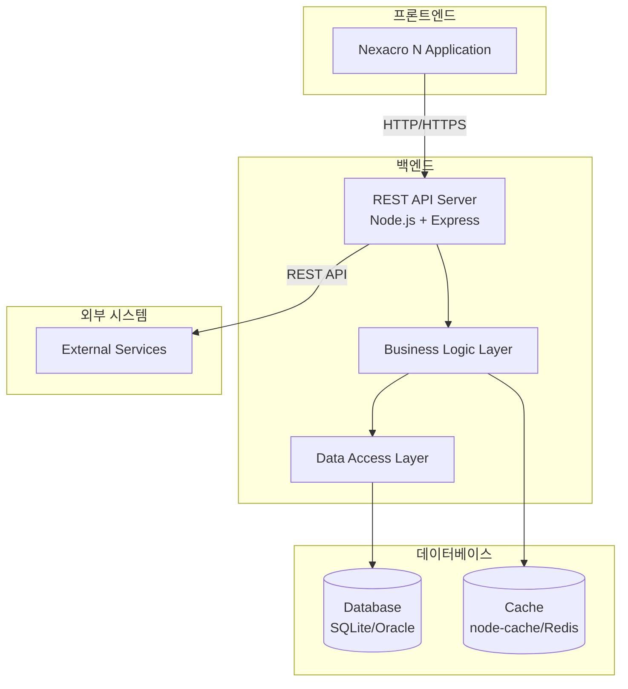
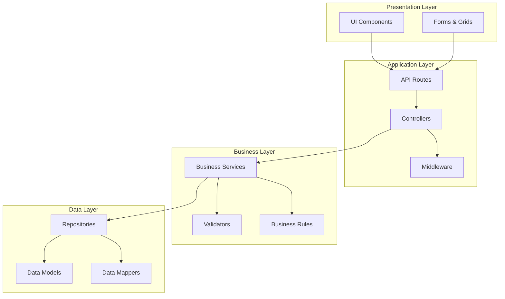
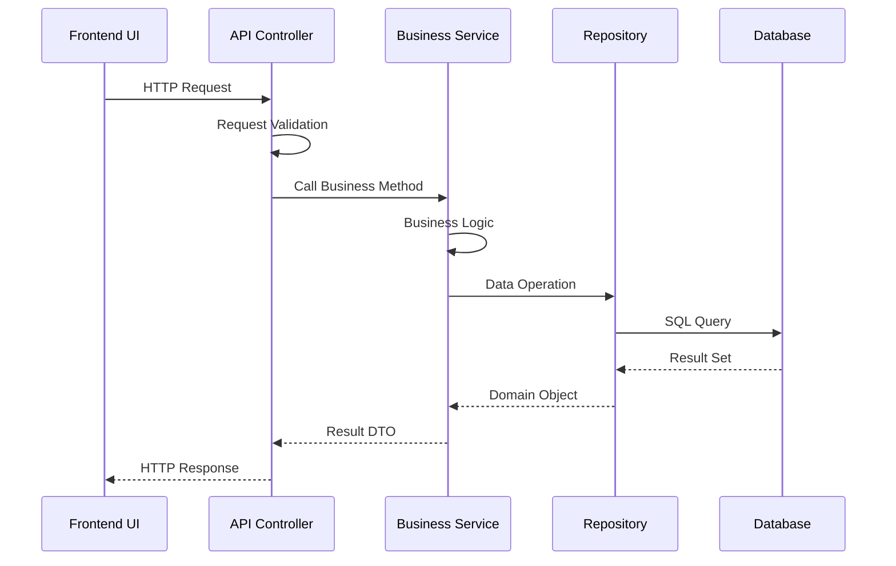
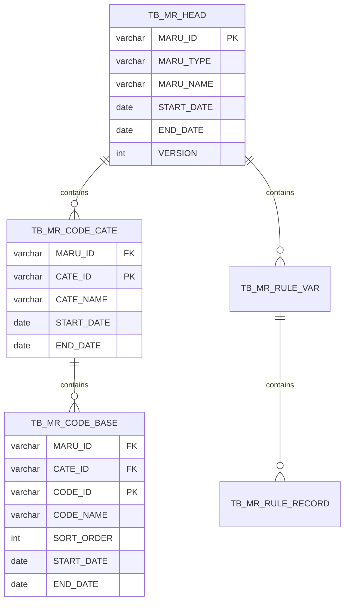
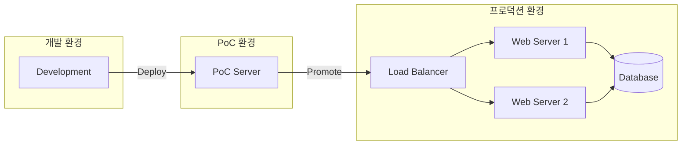

# 📄 기본설계서 템플릿

**Template Version:** 1.0.0 — **Last Updated:** 2025-10-12

> **설계 규칙(꼭 지킬 것)**
>
> * *아키텍처와 전체 구조*에 집중한다.
> * **구현 세부사항은 포함하지 않는다** - 상세설계서에서 다룬다.
> * 시스템의 전반적인 구조, 주요 컴포넌트, 인터페이스를 정의한다.
> * 작성 후 **요구사항과 비교**하여 차이가 있으면 **즉시 중단 → 차이 설명 → 지시 대기**.
> * **다이어그램 규칙**
>
>   * 시스템 구조/컴포넌트: **Mermaid**만 사용
>   * UI 와이어프레임: **Text Art(ASCII)** 사용

---

## 0. 문서 메타데이터

* 문서명: `Task X.Y [작업명]_기본설계.md`
* 버전/작성일/작성자:
* 참조 문서: `./docs/project/{project_name}/00.foundation/01.project-charter/*.md`
* 위치: `./docs/project/{project_name}/10.design/11.basic-design/`
* 관련 이슈/티켓: [링크/ID]
* 상위 요구사항 문서/ID: [REQ-문서명 또는 링크]

---

## 1. 개요

### 1.1. 목적
* 이 기본설계의 목적과 달성하고자 하는 목표

### 1.2. 범위
* **포함 범위**:
* **제외 범위**:

### 1.3. 이해관계자
* 개발팀:
* 사용자:
* 운영팀:

---

## 2. 요구사항 분석

### 2.1. 기능 요구사항
> 각 요구사항에 고유 ID 부여 (예: MR0100-REQ-001)

| 요구사항 ID | 요구사항 설명 | 우선순위 | 비고 |
|-------------|---------------|----------|------|
| MR0100-REQ-001 | (예시) 사용자는 로그인할 수 있어야 함 | High | |
| MR0100-REQ-002 | | | |

### 2.2. 비기능 요구사항

#### 성능 요구사항
* 응답시간:
* 동시 사용자:
* 처리량:

#### 보안 요구사항
* 인증/인가:
* 데이터 보호:
* 감사 로깅:

#### 확장성 요구사항
* 수평 확장:
* 수직 확장:
* 데이터 증가 대응:

#### 가용성 요구사항
* 가동률 목표:
* 장애 복구 시간:
* 백업/복구 전략:

### 2.3. 제약사항
* 기술 제약:
* 비즈니스 제약:
* 일정/예산 제약:

---

## 3. 시스템 아키텍처

### 3.1. 아키텍처 개요



### 3.2. 아키텍처 원칙
* **관심사 분리 (Separation of Concerns)**:
* **계층화 (Layering)**:
* **느슨한 결합 (Loose Coupling)**:
* **높은 응집도 (High Cohesion)**:

### 3.3. 기술 스택

| 계층 | 기술 | 버전 | 비고 |
|------|------|------|------|
| 프론트엔드 | Nexacro N | v24 | RIA Framework |
| 백엔드 | Node.js | v20.x | Runtime |
| 백엔드 | Express | v5.x | Web Framework |
| 데이터베이스 | SQLite → Oracle | 3.x → 19c | PoC → Production |
| ORM/Query | knex.js | latest | SQL Query Builder |
| 캐시 | node-cache → Redis | - | PoC → Production |

---

## 4. 시스템 컴포넌트 설계

### 4.1. 컴포넌트 다이어그램



### 4.2. 주요 컴포넌트 정의

#### 4.2.1. 프론트엔드 컴포넌트

| 컴포넌트 명 | 책임 | 주요 기능 | 비고 |
|-------------|------|-----------|------|
| MainFrame | 메인 레이아웃 관리 | 메뉴, 탭, 화면 전환 | |
| CommonService | 공통 서비스 | API 호출, 세션 관리 | |
| ValidationService | 유효성 검증 | 입력 검증, 오류 처리 | |

#### 4.2.2. 백엔드 컴포넌트

| 컴포넌트 명 | 책임 | 주요 기능 | 비고 |
|-------------|------|-----------|------|
| RouteHandler | 라우팅 관리 | API 엔드포인트 매핑 | |
| Controller | 요청/응답 처리 | 입력 검증, 결과 반환 | |
| Service | 비즈니스 로직 | 핵심 비즈니스 규칙 | |
| Repository | 데이터 접근 | CRUD 작업 | |
| Middleware | 횡단 관심사 | 인증, 로깅, 오류 처리 | |

### 4.3. 컴포넌트 간 상호작용



---

## 5. 데이터 아키텍처

### 5.1. 데이터 모델 개요



### 5.2. 주요 엔티티 정의

| 엔티티 명 | 설명 | 주요 속성 | 비고 |
|-----------|------|-----------|------|
| TB_MR_HEAD | 마루 헤더 | MARU_ID, MARU_TYPE, VERSION | 버전 관리 |
| TB_MR_CODE_CATE | 코드 카테고리 | CATE_ID, CATE_NAME | 계층 구조 |
| TB_MR_CODE_BASE | 코드 기본 | CODE_ID, CODE_NAME | 실제 코드 값 |
| TB_MR_RULE_VAR | 규칙 변수 | VAR_ID, VAR_TYPE | 조건/결과 |
| TB_MR_RULE_RECORD | 규칙 레코드 | RECORD_ID, CONDITION | 규칙 정의 |

### 5.3. 데이터 무결성

#### 5.3.1. 참조 무결성
* 외래키 제약조건 정의
* CASCADE 규칙 정의

#### 5.3.2. 도메인 무결성
* CHECK 제약조건
* NOT NULL 제약조건
* DEFAULT 값 정의

#### 5.3.3. 비즈니스 무결성
* 버전 관리 규칙
* 이력 관리 규칙 (START_DATE/END_DATE)
* 상태 전이 규칙

---

## 6. 인터페이스 설계

### 6.1. API 인터페이스 구조

#### 6.1.1. API 명명 규칙
* URL 구조: `/api/v{version}/{resource}/{id}/{sub-resource}`
* HTTP 메서드: GET(조회), POST(생성), PUT(수정), DELETE(삭제)

#### 6.1.2. 주요 API 그룹

| API 그룹 | Base URL | 설명 | 비고 |
|----------|----------|------|------|
| 마루 헤더 관리 | `/api/v1/maru-headers` | 헤더 CRUD | |
| 코드 관리 | `/api/v1/codes` | 코드 CRUD | |
| 규칙 관리 | `/api/v1/rules` | 규칙 CRUD | |
| 이력 관리 | `/api/v1/history` | 버전 이력 조회 | |

### 6.2. 데이터 전송 형식

#### 6.2.1. 요청 형식
```json
{
  "header": {
    "timestamp": "2025-10-12T10:00:00Z",
    "requestId": "uuid-v4",
    "userId": "admin"
  },
  "body": {
    // 실제 데이터
  }
}
```

#### 6.2.2. 응답 형식
```json
{
  "header": {
    "timestamp": "2025-10-12T10:00:01Z",
    "requestId": "uuid-v4",
    "resultCode": "SUCCESS",
    "resultMessage": "처리 완료"
  },
  "body": {
    // 결과 데이터
  }
}
```

### 6.3. 오류 코드 체계

| 코드 범위 | 카테고리 | 설명 | 예시 |
|----------|----------|------|------|
| 1000-1999 | 시스템 오류 | 서버 내부 오류 | 1001: DB 연결 실패 |
| 2000-2999 | 클라이언트 오류 | 잘못된 요청 | 2001: 필수 파라미터 누락 |
| 3000-3999 | 비즈니스 오류 | 업무 규칙 위반 | 3001: 중복 코드 |
| 4000-4999 | 권한 오류 | 인증/인가 실패 | 4001: 인증 토큰 만료 |

---

## 7. 보안 설계

### 7.1. 인증 및 인가

#### 7.1.1. 인증 방식
* **PoC**: 세션 기반 인증
* **Production**: JWT 기반 인증

#### 7.1.2. 인가 모델
* Role-Based Access Control (RBAC)
* 역할: ADMIN, USER, VIEWER

### 7.2. 데이터 보호

#### 7.2.1. 전송 중 데이터
* HTTPS 프로토콜 사용
* TLS 1.2 이상

#### 7.2.2. 저장 데이터
* 민감 정보 암호화 (AES-256)
* 비밀번호 해싱 (bcrypt)

### 7.3. 보안 취약점 대응

| 취약점 유형 | 대응 방안 | 비고 |
|-------------|-----------|------|
| SQL Injection | Parameterized Query 사용 | knex.js |
| XSS | 입력 값 검증 및 이스케이프 | |
| CSRF | CSRF 토큰 검증 | |
| 세션 하이재킹 | Secure Cookie, HttpOnly | |

---

## 8. 성능 설계

### 8.1. 성능 목표

| 성능 지표 | 목표 값 | 측정 방법 | 비고 |
|----------|---------|-----------|------|
| API 응답시간 | < 500ms | APM 도구 | 95 percentile |
| 페이지 로딩시간 | < 3초 | Browser DevTools | |
| 동시 사용자 | 100명 | 부하 테스트 | PoC 목표 |
| 데이터베이스 쿼리 | < 100ms | Slow Query Log | |

### 8.2. 성능 최적화 전략

#### 8.2.1. 캐싱 전략
* **메모리 캐시**: 자주 조회되는 코드 데이터
* **캐시 만료**: TTL 기반 (1시간)
* **캐시 무효화**: 데이터 변경 시 즉시

#### 8.2.2. 데이터베이스 최적화
* 인덱스 설계
* 쿼리 최적화
* Connection Pooling

#### 8.2.3. 프론트엔드 최적화
* 번들 사이즈 최소화
* 레이지 로딩
* CDN 활용 (Production)

---

## 9. 배포 및 운영

### 9.1. 배포 아키텍처



### 9.2. 모니터링 전략

#### 9.2.1. 모니터링 항목
* **시스템 메트릭**: CPU, Memory, Disk, Network
* **애플리케이션 메트릭**: API 응답시간, 처리량, 오류율
* **비즈니스 메트릭**: 사용자 수, 트랜잭션 수

#### 9.2.2. 로깅 전략
* 로그 레벨: ERROR, WARN, INFO, DEBUG
* 로그 형식: JSON 구조화 로그
* 로그 보관: 30일

### 9.3. 장애 대응

#### 9.3.1. 장애 감지
* Health Check 엔드포인트
* 알림 채널: Email, Slack

#### 9.3.2. 복구 절차
* 자동 재시작 (PM2, Docker)
* 롤백 절차
* 수동 복구 가이드

---

## 10. 개발 및 테스트 전략

### 10.1. 개발 방법론
* **개발 프로세스**: Agile/Scrum
* **코드 리뷰**: Pull Request 기반
* **브랜치 전략**: Git Flow

### 10.2. 테스트 전략

#### 10.2.1. 테스트 레벨

| 테스트 레벨 | 도구 | 커버리지 목표 | 담당 |
|-------------|------|---------------|------|
| 단위 테스트 | Jest | 80% | 개발자 |
| 통합 테스트 | Jest + Supertest | 70% | 개발자 |
| E2E 테스트 | Playwright | 주요 시나리오 | QA |
| 성능 테스트 | k6 | 부하 시나리오 | QA |

#### 10.2.2. 테스트 자동화
* CI/CD 파이프라인 통합
* 자동 회귀 테스트
* 테스트 결과 리포팅

---

## 11. 마이그레이션 및 전환 계획

### 11.1. PoC → Production 전환

| 항목 | PoC | Production | 전환 작업 |
|------|-----|------------|-----------|
| 데이터베이스 | SQLite | Oracle 19c | 스키마 마이그레이션 |
| 캐시 | node-cache | Redis | 캐시 로직 변경 |
| 인증 | 세션 | JWT | 인증 모듈 교체 |
| 배포 | 단일 서버 | 다중 서버 | 로드밸런서 구성 |

### 11.2. 레거시 시스템 연동
* **레거시 시스템**: GLUE Framework
* **연동 방식**: REST API 또는 Database 직접 연동
* **데이터 동기화**: 배치 작업 또는 실시간 동기화

---

## 12. 위험 관리

### 12.1. 기술적 위험

| 위험 | 발생 가능성 | 영향도 | 대응 방안 |
|------|-------------|--------|-----------|
| 성능 이슈 | 중 | 높음 | 캐싱, 쿼리 최적화 |
| 보안 취약점 | 낮음 | 높음 | 보안 점검, 정기 업데이트 |
| 데이터 손실 | 낮음 | 높음 | 백업, 복제 |

### 12.2. 프로젝트 위험

| 위험 | 발생 가능성 | 영향도 | 대응 방안 |
|------|-------------|--------|-----------|
| 일정 지연 | 중 | 중 | 우선순위 조정 |
| 리소스 부족 | 중 | 중 | 외부 지원 |
| 요구사항 변경 | 높음 | 중 | Change Management |

---

## 13. 부록

### 13.1. 용어 정의

| 용어 | 정의 | 비고 |
|------|------|------|
| 마루(MARU) | Master code And RUle management system | |
| PoC | Proof of Concept | |
| TTL | Time To Live | |

### 13.2. 참조 문서
* Project Charter: `./docs/project/{project_name}/00.foundation/01.project-charter/`
* Design Baseline: `./docs/project/{project_name}/00.foundation/02.design-baseline/`
* 기술 스택 문서: `./CLAUDE.md`

### 13.3. 변경 이력

| 버전 | 일자 | 작성자 | 변경 내용 |
|------|------|--------|-----------|
| 1.0.0 | 2025-10-12 | | 최초 작성 |

---

## 📍 작성 가이드

### 작성 시 주의사항
1. **아키텍처 중심**: 구현보다는 구조와 설계 원칙에 집중
2. **컴포넌트 정의**: 주요 컴포넌트의 책임과 역할을 명확히
3. **인터페이스 명세**: 시스템 간 계약을 명확히 정의
4. **비기능 요구사항**: 성능, 보안, 확장성 등을 구체적으로
5. **다이어그램 활용**: Mermaid를 활용한 시각적 표현

### 상세설계서와의 관계
* **기본설계**: 전체 구조, 아키텍처, 컴포넌트 정의
* **상세설계**: 구체적 구현, API 상세, 프로세스 흐름
* 기본설계 완료 후 상세설계 작성

### 검토 체크리스트
- [ ] 모든 요구사항이 반영되었는가?
- [ ] 아키텍처 원칙이 명확히 정의되었는가?
- [ ] 주요 컴포넌트의 책임이 명확한가?
- [ ] 인터페이스 계약이 정의되었는가?
- [ ] 비기능 요구사항이 구체적으로 명시되었는가?
- [ ] 보안 및 성능 고려사항이 포함되었는가?
- [ ] 배포 및 운영 전략이 수립되었는가?
- [ ] 위험 요소가 식별되고 대응방안이 있는가?

---

**이 템플릿은 프로젝트 특성에 맞게 조정하여 사용하세요.**
