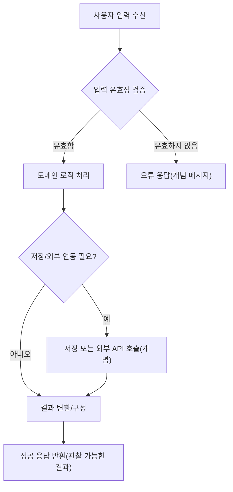
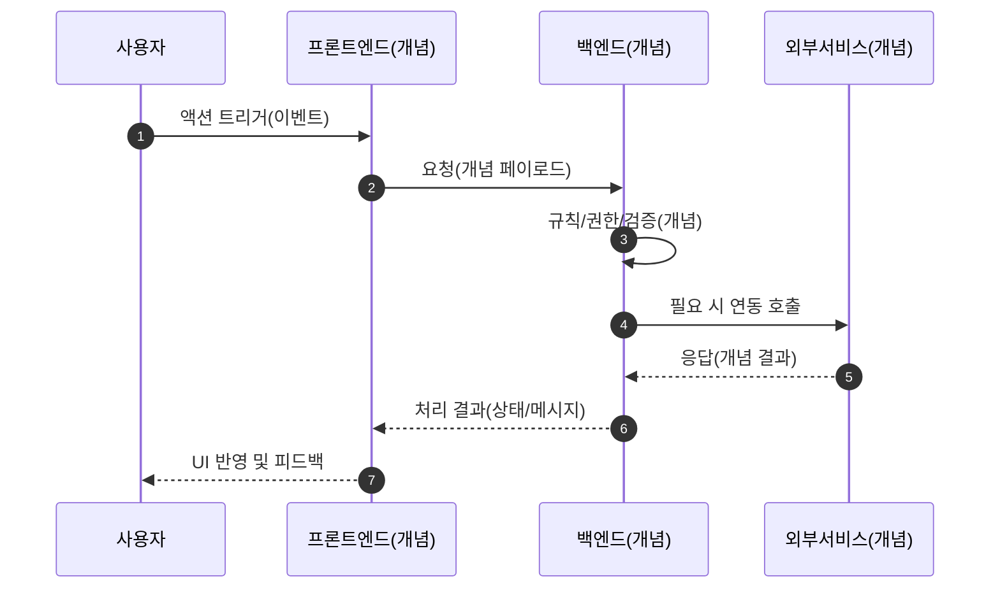
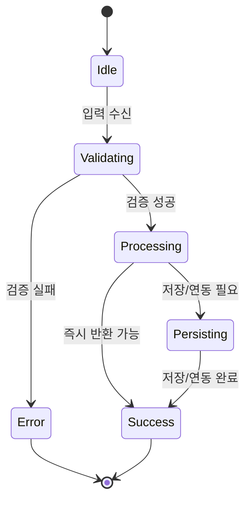
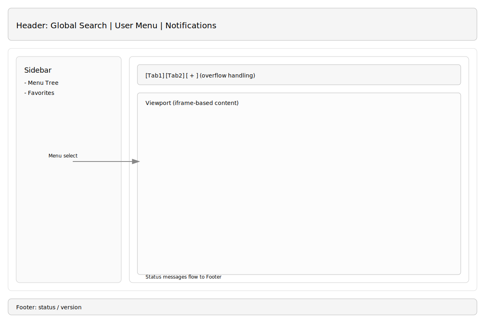

# 📄 상세설계서 템플릿 (Functional Design Only)

**Template Version:** 1.3.0 — **Last Updated:** 2025-09-29

> **설계 규칙(꼭 지킬 것)**
>
> * *기능 중심 설계*에 집중한다.
> * 실제 소스코드(전체 또는 일부)는 **절대 포함하지 않는다**.
> * 작성 후 **이전 개념과 비교**하여 차이가 있으면 **즉시 중단 → 차이 설명 → 지시 대기**.
> * **다이어그램 규칙**
>
>   * 프로세스: **Mermaid**만 사용
>   * UI 레이아웃: **Text Art(ASCII)** → 바로 아래 **SVG 개념도**를 순차 배치

---

## 0. 문서 메타데이터

* 문서명: `Task X.Y [작업명].md`
* 버전/작성일/작성자:
* 참조 문서: `./kiro/specs/*/design.md`, `*PRD.md`
* 위치: `./docs/detail design/`
* 관련 이슈/티켓: \[링크/ID]
* 상위 요구사항 문서/ID: [REQ-문서명 또는 링크]
* 요구사항 추적 담당자: [이름/역할]
* 추적성 관리 도구: [예: Jira 프로젝트, DOORS, Excel 시트]

---

## 1. 목적 및 범위

* 목적:
* 범위(포함/제외):

---

## 2. 요구사항 & 승인 기준 (Acceptance Criteria)

> **작성 규칙**: 각 요구사항 항목마다 고유 ID(예: REQ-001)를 명시하고, 이후 설계 섹션에서 `[REQ-001]` 형태로 참조합니다.
> **추적 팁**: 요구사항 변경 시 추적 매트릭스와 해당 설계 섹션을 함께 업데이트합니다.

### 2.1. 요구사항
* 요구사항 원본 링크: [상세 문서 또는 Jira 링크]

* 기능 요구사항:
* 비기능 요구사항(성능/안정성/보안 등):
* 승인 기준(테스트 통과 조건, 관찰 가능한 결과):


### 2.2. 요구사항-설계 추적 매트릭스

| 요구사항 ID | 요구사항 설명 | 설계 섹션/아티팩트 | 테스트 케이스 ID | 상태 | 비고 |
|-------------|---------------|--------------------|------------------|------|------|
| MR0100-REQ-001 | (예시) 로그인 성공 시 세션 유지 | §5 프로세스 흐름 / §6 UI 설계 | TC-LOGIN-001 | 초안 | |
| MR0100-REQ-002 | | | | | |

> 필요 시 행을 복제하여 전 요구사항이 설계와 검증에 연결되도록 합니다.

---

## 3. 용어/가정/제약

* 용어 정의:
* 가정(Assumptions):
* 제약(Constraints):

---

## 4. 시스템/모듈 개요

* 역할 및 책임:
* 외부 의존성(서비스, 라이브러리):
* 상호작용 개요(텍스트 다이어그램/표기 가능):

---

## 5. 프로세스 흐름

### 5.1 프로세스 설명
> **추적 메모**: 각 단계와 시나리오 제목에 관련 요구사항 태그(`[REQ-###]`)와 연계 테스트 ID를 병기합니다.

1. 단계 1
2. 단계 2
3. 단계 3

> 필요 시 시퀀스/상태/액티비티는 **개념 수준**으로만 기술

### 5.2. 프로세스 설계 개념도 (Mermaid)

> **규칙**: 구현 로직이 아닌 **흐름/역할/상태**만 표현

#### (선택 1) Flowchart – 기능 흐름 개념



#### (선택 2) Sequence – 역할 간 상호작용 개념



#### (선택 3) State – 핵심 상태 전이 개념



---

## 6. UI 레이아웃 설계 (Text Art + SVG)

> **추적 메모**: UI 요소 설명 옆에 대응 요구사항(`[REQ-###]`)과 사용자 스토리/테스트 ID를 표기합니다.

> **규칙**:
>
> * \*\*Text Art(ASCII)\*\*로 영역 구성과 상호관계를 1차 서술
> * 곧바로 **SVG 개념도**로 시각 배치를 2차 보완
> * 픽셀/반응형/정렬 등 정밀 사항은 **텍스트로 보완**

### 6.1. UI 설계

```
┌─────────────────────────────────────────────┐
│                   Header                    │
│  [Global Search] [User Menu] [Notifications]│
├───────────────┬─────────────────────────────┤
│   Sidebar     │          Content            │
│  - Menu Tree  │  ┌───────────Tabs─────────┐│
│  - Favorites  │  │[Tab1][Tab2][ + ] (overflow)│
│               │  └────────────────────────┘│
│               │  ┌────── Viewport (iframe) ┐│
│               │  │  Page/Module Area       ││
│               │  └─────────────────────────┘│
├───────────────┴─────────────────────────────┤
│                   Footer (status/version)   │
└─────────────────────────────────────────────┘
```

### 6-2. UI 설계(SVG) **[필수 생성]**

> **SVG 파일 생성 규칙**:
>
> * **필수 생성**: UI 설계가 있는 경우 반드시 SVG 파일을 생성해야 합니다
> * **파일명 규칙**: `{Task-ID}.{Task명}_UI설계.svg` (예: `Task-3-1.MR0100-Backend-API-구현_UI설계.svg`)
> * **저장 위치**: 동일 폴더에 생성하고 상대경로로 링크
> * **내용**: 실제 UI 코드가 아닌 **개념 레벨 SVG**. 색상/좌표는 예시이며, 컴포넌트 이름과 상호작용 포인트만 표기
> * **상호작용 포인트**: 클릭, 입력, 드래그 등 사용자 액션 지점을 명확히 표시
> * **테스트 식별자**: 각 UI 요소에 `data-testid` 속성 개념을 포함하여 테스트 자동화 준비



> **SVG 생성 체크리스트**:
> - [ ] 모든 UI 컴포넌트가 식별 가능하게 라벨링
> - [ ] 사용자 상호작용 포인트 표시 (버튼, 입력필드, 링크 등)
> - [ ] 테스트 자동화를 위한 요소 식별자 개념 포함
> - [ ] 반응형 레이아웃 주요 변화점 표시
> - [ ] 접근성 고려사항 (포커스 순서, 스크린리더 고려) 표시


### 6.3. 반응형/접근성/상호작용 가이드(텍스트)

* **반응형**:

  * `≥ Desktop`: 사이드바 고정, 탭 바 전체 노출, 콘텐츠 스크롤
  * `Tablet`: 사이드바 축소/토글, 탭 overflow 메뉴 활성화
  * `Mobile`: 사이드바 오버레이 전환, 헤더에 햄버거 버튼, 탭 수 최소화
* **접근성**: 포커스 순서(헤더→사이드바→콘텐츠), 키보드 내비게이션, 라이브 리전(상태/에러)
* **상호작용**: 메뉴 선택→탭 생성/활성화→iframe 로딩→상태 피드백

---

## 7. 데이터/메시지 구조 (개념 수준)
### 7.1. 입력 데이터 구조
* 입력(필드, 형식, 제약)
### 7.2. 출력 데이터 구조
* 출력(필드, 형식, 제약)
### 7.3. 시스템간 I/F 데이터 구조
* 저장/전달 고려(정합성, 마이그레이션, 호환성)

---

## 8. 인터페이스 계약(Contract)

> **추적 메모**: 각 API/데이터 계약마다 참조 요구사항 ID와 검증 케이스를 명시합니다.
> * API/함수(개념 명): 목적, 입력/출력(개념), 성공/오류 조건(개념)
? * 타시스템 연동: 타임아웃/재시도/백오프(개념), 아이들/서킷브레이커 정책(개념)

### 8.1. API MH007-A: 마루 이력 목록 조회 [R0100-REQ-001]
**엔드포인트**: `GET /api/v1/maru-headers/{maruId}/history`
**경로 파라미터**:
**쿼리 파라미터**:
**성공 응답**
**오류 응답**:
**검증 케이스**:
**swagger 주소**:

---

## 9. 오류/예외/경계조건
### 9.1. 예상 오류 상황 및 처리 방안
* 예상 오류 상황 및 처리 방안(개념)
### 9.2. 복구 전략 및 사용자 메시지
* 복구 전략 및 사용자 메시지(개념)


---

## 10. 보안/품질 고려

* 인증/인가, 입력 검증, 비밀/키 관리(개념)
* 의존성 취약점 관리, 로깅/감사, 개인정보/규제 준수(개념)
* i18n/l10n 고려 사항(개념)

---

## 11. 성능 및 확장성(개념)

* 목표/지표(개념)
* 병목 예상 지점과 완화 전략(캐시/큐/배압 등)
* 부하/장애 시나리오 대응(개념)

---

## 12. 테스트 전략 (TDD 계획)

> **추적 메모**: 테스트 케이스 ID를 추적 매트릭스와 동기화하고 요구사항(`[REQ-###]`) 기준으로 커버리지를 관리합니다.

* 실패 테스트 시나리오(개념)
* 최소 구현 전략(개념)
* 리팩터링 포인트(개념)

> **주의**: 실제 테스트 코드는 포함하지 않음

---

## 13. UI 테스트케이스 **[UI 설계 시 필수]**

> **추적 메모**: UI 테스트케이스는 요구사항 ID(`[REQ-###]`)와 연결하고, SVG 설계도의 상호작용 포인트와 매핑합니다.

### 13-1. UI 컴포넌트 테스트케이스

> **작성 규칙**:
> * 각 UI 컴포넌트별로 개별 테스트케이스 작성
> * AI Agent(MCP) 또는 수동 테스트 모두 실행 가능한 단계별 가이드
> * 예상 결과와 검증 기준을 명확히 명시

| 테스트 ID | 컴포넌트 | 테스트 시나리오 | 실행 단계 | 예상 결과 | 검증 기준 | 요구사항 | 우선순위 |
|-----------|----------|-----------------|-----------|-----------|-----------|----------|----------|
| TC-UI-001 | 로그인 버튼 | 정상 로그인 처리 | 1. ID/PW 입력<br>2. 로그인 버튼 클릭 | 메인 화면 이동 | 사용자 정보 표시 확인 | [REQ-001] | High |
| TC-UI-002 | 검색 입력필드 | 실시간 검색 동작 | 1. 검색어 입력<br>2. 자동완성 확인 | 관련 항목 표시 | 3초 이내 응답 | [REQ-002] | Medium |

### 13-2. 사용자 시나리오 테스트케이스

> **작성 규칙**: 실제 사용자 워크플로우 기반 E2E 테스트케이스

| 시나리오 ID | 시나리오 명 | 사전 조건 | 실행 단계 | 예상 결과 | 후처리 | 요구사항 | 실행 방법 |
|-------------|-------------|-----------|-----------|-----------|--------|----------|-----------|
| TS-001 | 신규 사용자 등록 플로우 | 미가입 상태 | 1. 회원가입 페이지 접근<br>2. 필수 정보 입력<br>3. 약관 동의<br>4. 가입 완료 | 가입 완료 메시지<br>자동 로그인 | 테스트 계정 삭제 | [REQ-003] | Manual/MCP |
| TS-002 | 데이터 입력 및 저장 플로우 | 로그인 완료 | 1. 입력 폼 접근<br>2. 데이터 입력<br>3. 유효성 검증<br>4. 저장 처리 | 성공 메시지<br>목록 반영 | - | [REQ-004] | MCP 권장 |

### 13-3. 반응형 및 접근성 테스트케이스

> **작성 규칙**: 다양한 디바이스와 접근성 도구 호환성 검증

| 테스트 ID | 테스트 대상 | 테스트 조건 | 검증 방법 | 합격 기준 | 도구/방법 |
|-----------|-------------|-------------|-----------|-----------|-----------|
| TC-RWD-001 | 반응형 레이아웃 | Desktop(1920px) | 화면 캡처 비교 | 모든 요소 정상 표시 | Playwright 스크린샷 |
| TC-RWD-002 | 반응형 레이아웃 | Tablet(768px) | 화면 캡처 비교 | 모바일 네비게이션 활성화 | Playwright 스크린샷 |
| TC-RWD-003 | 반응형 레이아웃 | Mobile(375px) | 화면 캡처 비교 | 햄버거 메뉴 표시 | Playwright 스크린샷 |
| TC-A11Y-001 | 키보드 네비게이션 | Tab 키 순차 이동 | 포커스 순서 확인 | 논리적 순서 유지 | 수동 테스트 |
| TC-A11Y-002 | 스크린리더 호환성 | NVDA/JAWS 사용 | 음성 출력 확인 | 모든 요소 읽기 가능 | 수동 테스트 |

### 13-4. 성능 및 로드 테스트케이스

> **작성 규칙**: 사용자 경험에 영향을 주는 성능 지표 중심

| 테스트 ID | 성능 지표 | 측정 방법 | 목표 기준 | 측정 도구 | 실행 조건 |
|-----------|-----------|-----------|-----------|-----------|-----------|
| TC-PERF-001 | 페이지 로드 시간 | 초기 렌더링 완료 | 3초 이내 | Playwright Performance API | 표준 네트워크 |
| TC-PERF-002 | 사용자 입력 응답 | 키 입력 후 반응 | 100ms 이내 | 수동 측정 | 일반 사용 패턴 |
| TC-PERF-003 | 대용량 데이터 처리 | 1000건 목록 렌더링 | 5초 이내 | Performance Observer | 최대 데이터셋 |

### 13-5. MCP Playwright 자동화 스크립트 가이드

> **MCP 활용 가이드**: Playwright MCP를 사용한 자동화 테스트 실행 방법

**기본 실행 패턴**:
```javascript
// 1. 페이지 로드 및 대기
await page.goto('화면 URL');
await page.waitForLoadState('networkidle');

// 2. 요소 상호작용 (data-testid 기반)
await page.click('[data-testid="login-button"]');
await page.fill('[data-testid="username-input"]', '테스트값');

// 3. 결과 검증
await expect(page.locator('[data-testid="success-message"]')).toBeVisible();

// 4. 스크린샷 캡처 (시각적 회귀 테스트)
await page.screenshot({ path: 'test-result.png' });
```

**추천 MCP 명령어**:
- `mcp__playwright__browser_navigate`: 페이지 이동
- `mcp__playwright__browser_click`: 요소 클릭
- `mcp__playwright__browser_type`: 텍스트 입력
- `mcp__playwright__browser_take_screenshot`: 화면 캡처
- `mcp__playwright__browser_snapshot`: 접근성 스냅샷

### 13-6. 수동 테스트 체크리스트

> **수동 테스트 가이드**: 사람이 직접 실행하는 테스트 절차

**일반 UI 검증**:
- [ ] 모든 버튼이 클릭 가능하고 적절한 피드백 제공
- [ ] 입력 필드 포커스 및 유효성 검증 메시지 표시
- [ ] 로딩 상태 및 오류 상황 적절한 안내
- [ ] 브랜드 가이드라인 준수 (색상, 폰트, 간격)

**접근성 검증**:
- [ ] Tab 키로 모든 interactive 요소 접근 가능
- [ ] 포커스 표시가 명확하고 일관됨
- [ ] 색상 대비가 WCAG 2.1 AA 기준 충족
- [ ] 이미지에 적절한 alt 텍스트 제공

**크로스 브라우저 검증**:
- [ ] Chrome 최신 버전에서 정상 동작
- [ ] Firefox 최신 버전에서 정상 동작
- [ ] Safari 최신 버전에서 정상 동작 (Mac 환경)
- [ ] Edge 최신 버전에서 정상 동작

