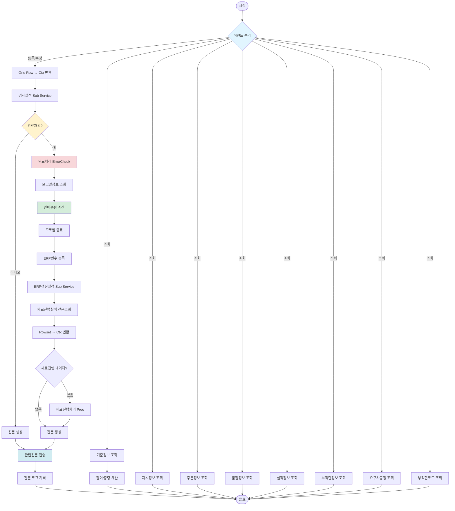

# [SERVICE-ID] 레거시 시스템 분석 종합 보고서

## 1. 시스템 개요
- **서비스 ID**: [SERVICE-ID]
- **업무명**: [업무명]
- **분석 일시**: [분석 수행 시각 (KST)]
- **분석 시간**: [분석 수행 시간]
- **전체 Activity 수**: [전체 Activity 수]
- **분석자**: [LLM 모델명 및 버전]
- **분석 도구**: [command 명령어]
- **문서 버전**: 1.0

## 📊 비즈니스 프로세스 분석

### 시스템 목적

[시스템의 비즈니스 목적을 2-3문단으로 상세 설명. 실제 M472020014 예시 참조]


### 워크플로우 다이어그램



### 주요 유즈케이스
**최소 3개 이상 작성 (M472020014 성공 사례 기반)**

#### UC-01: [주요 기능 조회]
**Actor**: [사용자 역할]
**목적**: [기능의 목표 상세 설명]
**전제조건**:
- [시작 전 필요한 조건 1]
- [시작 전 필요한 조건 2]
- [시작 전 필요한 조건 3]
- ...

**주요 흐름**:
1. [단계 1] - [상세 설명 및 관련 컴포넌트/쿼리 명시]
2. [단계 2] - [상세 설명 및 관련 컴포넌트/쿼리 명시]
3. [단계 3] - [상세 설명 및 관련 컴포넌트/쿼리 명시]
4. [단계 4] - [상세 설명 및 관련 컴포넌트/쿼리 명시]

**대체 흐름**:
- [예외 상황 1]: [처리 방법 및 에러 메시지]
- [예외 상황 2]: [처리 방법 및 에러 메시지]
- [예외 상황 3]: [처리 방법 및 에러 메시지]

**후행조건**:
- [완료 후 시스템 상태 1]
- [완료 후 시스템 상태 2]

[작성 예]
```
#### UC-01: 코일 검사실적 조회

**Actor**: 검사 담당자

**목적**: 공정별 코일의 검사 지시 정보 및 실적 정보를 조회하여 검사 대상 코일을 파악하고 현재 상태를 확인

**전제조건**:
- 사용자가 시스템에 로그인되어 있음
- 조회 권한이 있음
- 해당 공정에 지시 데이터가 존재함

**주요 흐름**:
1. 사용자가 공정 코드를 선택 (Combo Box)
2. 정보 유형 선택 (주문정보 또는 품질정보 Radio Button)
3. 조회 버튼 클릭
4. 시스템이 지시정보 조회 (M472020014_Grid_2.select)
5. Grid에 지시 목록 표시 (COIL_ID, 주문번호, MO번호, 소재치수 등)
6. 사용자가 특정 코일 선택
7. 시스템이 실적정보 조회 (M472020014_Grid_3.select)
8. Grid에 상세 실적 정보 표시

**대체 흐름**:
- 조회 결과가 없는 경우: "조회된 데이터가 없습니다" 메시지 표시
- 주문정보 선택 시: M472020014_Grid_O.select 실행하여 주문 상세 표시
- 품질정보 선택 시: M472020014_Grid_Q.select 실행하여 품질 상세 표시
- 부적합정보 조회: M472020014_Grid_4.select로 부적합 이력 표시

**후행조건**:
- 조회된 데이터가 Grid에 표시됨
- 사용자가 등록/수정/완료 작업을 수행할 수 있는 상태가 됨
```
---
### 비즈니스 로직 상세

#### 1. [핵심 비즈니스 로직 1 명칭]

**목적**: [비즈니스 로직의 목적 상세 설명]

**처리 케이스**:


[케이스 1: 조건 기반 처리]
  조건: [구체적인 조건 상세]
  처리:
    1. [처리 단계 1]
    2. [처리 단계 2]
    3. [처리 단계 3]
    4. [처리 단계 4]

[케이스 2: 다른 조건 처리]
  조건: [구체적인 조건 상세]
  처리:
    1. [처리 단계 1]
    2. [처리 단계 2]
    3. [처리 단계 3]

[케이스 3: 예외 처리]
  조건: [예외 조건]
  처리:
    1. [예외 처리 단계 1]
    2. [예외 처리 단계 2]


**계산 공식** (해당 시 상세히 기술):


[계산 공식 1] = [변수1] × [변수2] + [상수]

[계산 공식 2] = ([변수1] / SUM([관련 변수들])) × 100

예시:
[구체적인 수치 예시]
[계산 과정 상세 설명]


**예외 처리**:
- [예외 상황 1]: [구체적인 에러 메시지] - [처리 방법]
- [예외 상황 2]: [구체적인 에러 메시지] - [처리 방법]
- [예외 상황 3]: [구체적인 에러 메시지] - [처리 방법]

---
[비즈니스 로직 상세 작성 예]
#### 1. 배분중량 계산 로직 (M47CoilInsActCoilAwWgt)

**목적**: 병합코일(PLTCM)과 합본코일에 대해 원자재 사용량을 정확하게 배분하여 생산 원가 계산의 정확성을 확보

**처리 케이스**:

[케이스 1: 병합코일(PLTCM) 배분중량 계산]
  조건: PROC_CD = 'PLTCM' (도금 병합 공정)
  처리:
    1. 합본 및 병합 코일의 모코일/자코일 정보 조회 (getAwData)
    2. 모코일 총 중량 집계
    3. 각 자코일의 배분 비율 계산 = (자코일 중량 / 모코일 총 중량)
    4. 배분중량 계산 및 등록 (makeAwWgt):
       - 원자재배분중량(RMTL_AW) = 모코일_원자재중량 × 배분비율
       - 코일배분중량(COIL_AW) = 모코일_코일중량 × 배분비율
       - 통판재배분중량(PASS_BOD_MTL_AW) = 모코일_통판재중량 × 배분비율
    5. TB_M47_COIL_AW 테이블에 INSERT

[케이스 2: 합본코일 배분중량 계산]
  조건: PROC_CD ≠ 'PLTCM' AND 합본 코일 존재
  처리:
    1. InLine 실적정보 처리 여부 확인
    2. 통판재 중량 배분:
       - InLine 처리됨: 통판재중량 = 0
       - InLine 미처리: 통판재중량 = 모코일_통판재중량 × 배분비율
    3. 코일합본실적 등록 (TB_M47_COIL_JNT_STC_ACT)
    4. 배분중량 테이블 업데이트

[케이스 3: Scrap 코일 처리]
  조건: 코일이 Scrap 판정
  처리:
    1. Scrap 코일 정보 조회
    2. 배분중량 = 0 설정
    3. Scrap 이력 기록

[케이스 4: 일반 코일]
  조건: 병합/합본이 아닌 일반 코일
  처리:
    1. 배분중량 = 실측중량
    2. 단순 실적 등록

**계산 공식**:

배분비율 = 자코일중량 / ∑(모코일의 모든 자코일중량)

원자재배분중량(RMTL_AW) = 모코일_원자재중량 × 배분비율
코일배분중량(COIL_AW) = 자코일_실측중량
통판재배분중량(PASS_BOD_MTL_AW) = 모코일_통판재중량 × 배분비율
원자재수율배분중량(RMTL_YLD_AW) = RMTL_AW - 불량중량
코일수율배분중량(COIL_YLD_AW) = COIL_AW - 불량중량

예시:
모코일 A (10,000kg) → 자코일 B (4,000kg), 자코일 C (6,000kg)
자코일 B 배분비율 = 4,000 / 10,000 = 0.4
자코일 B RMTL_AW = 모코일_원자재 10,500kg × 0.4 = 4,200kg

**예외 처리**:
- 모코일 정보 없음 → 에러 메시지 "모코일 정보를 찾을 수 없습니다"
- 자코일 총 중량 ≠ 모코일 중량 → 경고 메시지 "중량 불일치 확인 필요"
- 배분중량 음수 → 에러 "배분중량 계산 오류"
---

## 💻 커스텀 Activity 분석

### [가장 중요한 커스텀 클래스명] (중요도에 따라 순서대로 커스텀 클래스 배치)
**클래스 위치**: [패키지 경로]

**역할**: [1-2문장 요약]

**주요 메소드**:
- `doMainActivity()`: [메소드 역할 상세 설명]
- `methodName2()`: [메소드 역할 상세 설명]
- `methodName3()`: [메소드 역할 상세 설명]

**처리 복잡도**: [낮음/보통/높음/매우 높음] (복잡도 이유 상세 설명)

**복잡도 이유**:
- [복잡도 요인 1]
- [복잡도 요인 2]
- [복잡도 요인 3]

**의존성**:
- `[의존 클래스 1]`: [의존 목적]
- `[의존 클래스 2]`: [의존 목적]
- `[의존 클래스 3]`: [의존 목적]

[커스텀 Activity 분석 작성 예]

#### 1. 배분중량 계산 로직 (M47CoilInsActCoilAwWgt)

**목적**: 병합코일(PLTCM)과 합본코일에 대해 원자재 사용량을 정확하게 배분하여 생산 원가 계산의 정확성을 확보

**처리 케이스**:

```
[케이스 1: 병합코일(PLTCM) 배분중량 계산]
  조건: PROC_CD = 'PLTCM' (도금 병합 공정)
  처리:
    1. 합본 및 병합 코일의 모코일/자코일 정보 조회 (getAwData)
    2. 모코일 총 중량 집계
    3. 각 자코일의 배분 비율 계산 = (자코일 중량 / 모코일 총 중량)
    4. 배분중량 계산 및 등록 (makeAwWgt):
       - 원자재배분중량(RMTL_AW) = 모코일_원자재중량 × 배분비율
       - 코일배분중량(COIL_AW) = 모코일_코일중량 × 배분비율
       - 통판재배분중량(PASS_BOD_MTL_AW) = 모코일_통판재중량 × 배분비율
    5. TB_M47_COIL_AW 테이블에 INSERT

[케이스 2: 합본코일 배분중량 계산]
  조건: PROC_CD ≠ 'PLTCM' AND 합본 코일 존재
  처리:
    1. InLine 실적정보 처리 여부 확인
    2. 통판재 중량 배분:
       - InLine 처리됨: 통판재중량 = 0
       - InLine 미처리: 통판재중량 = 모코일_통판재중량 × 배분비율
    3. 코일합본실적 등록 (TB_M47_COIL_JNT_STC_ACT)
    4. 배분중량 테이블 업데이트

[케이스 3: Scrap 코일 처리]
  조건: 코일이 Scrap 판정
  처리:
    1. Scrap 코일 정보 조회
    2. 배분중량 = 0 설정
    3. Scrap 이력 기록

[케이스 4: 일반 코일]
  조건: 병합/합본이 아닌 일반 코일
  처리:
    1. 배분중량 = 실측중량
    2. 단순 실적 등록


**계산 공식**:

배분비율 = 자코일중량 / ∑(모코일의 모든 자코일중량)

원자재배분중량(RMTL_AW) = 모코일_원자재중량 × 배분비율
코일배분중량(COIL_AW) = 자코일_실측중량
통판재배분중량(PASS_BOD_MTL_AW) = 모코일_통판재중량 × 배분비율
원자재수율배분중량(RMTL_YLD_AW) = RMTL_AW - 불량중량
코일수율배분중량(COIL_YLD_AW) = COIL_AW - 불량중량

예시:
모코일 A (10,000kg) → 자코일 B (4,000kg), 자코일 C (6,000kg)
자코일 B 배분비율 = 4,000 / 10,000 = 0.4
자코일 B RMTL_AW = 모코일_원자재 10,500kg × 0.4 = 4,200kg


**예외 처리**:
- 모코일 정보 없음 → 에러 메시지 "모코일 정보를 찾을 수 없습니다"
- 자코일 총 중량 ≠ 모코일 중량 → 경고 메시지 "중량 불일치 확인 필요"
- 배분중량 음수 → 에러 "배분중량 계산 오류"
...
```

### [커스텀 클래스들]
[기타 중요한 커스텀 클래스]

## 💾 데이터 요구사항

### 데이터베이스 스키마

#### 핵심 테이블

**1. TB_[프로세스]_[테이블명] (테이블 역할 설명)**
```sql
-- 테이블 상세 설명
COLUMN_NAME1     TYPE         -- 컬럼 설명
COLUMN_NAME2     TYPE    PK   -- 컬럼 설명 (PK)
COLUMN_NAME3     TYPE         -- 컬럼 설명
COLUMN_NAME4     TYPE         -- 컬럼 설명
COLUMN_NAME5     TYPE         -- 컬럼 설명
INS_DH           DATE         -- 등록 일시
UPD_DH           DATE         -- 수정 일시
```

**2. TB_[프로세스]_[테이블명] (테이블 역할 설명)**
```sql
-- 테이블 상세 설명
COLUMN_NAME1     TYPE         -- 컬럼 설명
COLUMN_NAME2     TYPE    PK   -- 컬럼 설명 (PK)
COLUMN_NAME3     TYPE    PK   -- 컬럼 설명 (복합 PK)
COLUMN_NAME4     TYPE         -- 컬럼 설명
COLUMN_NAME5     TYPE         -- 컬럼 설명
COLUMN_NAME6     TYPE         -- 컬럼 설명
INS_DH           DATE         -- 등록 일시
UPD_DH           DATE         -- 수정 일시
```


### 데이터 플로우

#### 1. 조회 흐름

```
[화면 로딩 시 기본 정보 조회]
화면 진입
→ [Grid/쿼리명].select
  FROM [테이블1] [별칭]
  INNER JOIN [테이블2] [별칭] ON [조인 조건]
  INNER JOIN [테이블3] [별칭] ON [조인 조건]
  WHERE [WHERE 조건]
    AND [추가 조건]
→ Grid에 기본 목록 표시

[상세 정보 조회]
[특정 항목] 선택
→ [Grid/쿼리명].select
  FROM [테이블1] [별칭]
  INNER JOIN [테이블2] [별칭] ON [조인 조건]
  LEFT OUTER JOIN [테이블3] [별칭] ON [조인 조건]
  WHERE [조건]
→ Grid에 상세 정보 표시

[관련 정보 조회]
[이벤트] 발생
→ [Grid/쿼리명].select
  FROM [테이블1] [별칭]
  INNER JOIN [테이블2] [별칭] ON [조인 조건]
  WHERE [조건]
→ 관련 정보 표시
```

#### 2. 등록/수정 흐름

```
[데이터 입력 및 저장]
Grid에서 데이터 입력
→ Context 변환 ([Activity명])
  Grid Row Data → Context [변수명]
→ [Service명] (Sub Service)
  1. 데이터 유효성 검증
  2. [테이블명] INSERT/UPDATE
     - [주요 필드명]: [데이터]
     - [주요 필드명]: [데이터]
     - [주요 필드명]: [데이터]
  3. [테이블명] UPDATE (상태 변경)
     - [상태 필드] = '[상태값]'
→ 전문 생성 (M47SetCreateMessage)
→ 전문 전송 (PosSendMessage)
  - [이력 테이블명] INSERT (전송 이력)
→ 저장 완료
```

#### 3. 완료 처리 흐름

```
[완료 버튼 클릭]
완료 대상 선택 (Checkbox)
→ Context 변환 및 완료 분기
→ [Activity명] (완료 처리 전 검증)
  1. [검증 항목 1]: [상세 설명]
  2. [검증 항목 2]: [상세 설명]
  3. [검증 항목 3]: [상세 설명]
→ [관련 정보] 조회
  SELECT * FROM [테이블명] WHERE [조건]
→ [핵심 비즈니스 로직] ([Activity명])
  1. [처리 단계 1]
  2. [처리 단계 2]
     [계산 로직]: [수식]
  3. [처리 단계 3]
  4. [테이블명] INSERT/UPDATE
     - [필드명]: [계산 결과]
→ [외부 시스템] 연동
  [연동 처리 상세]
→ 전문 생성 (M47SetCreateMessage)
  [개수]개 전문 데이터 생성:
  - [전문ID 1]: [전문 내용]
  - [전문ID 2]: [전문 내용]
  - ... (기타 전문)
→ 전문 전송 (PosSendMessage)
  FOR EACH MSG IN ([전문ID 목록])
    [이력 테이블명] INSERT (MSG_ID, [관련ID], MSG_CNTNT, SND_RCV_DT)
  END FOR
→ 전송 로그 기록 (LogSendMessage)
→ 완료 처리 종료
```

#### 4. [추가 데이터 흐름]

```
[처리 명칭]
[시작 조건]
→ [처리 단계 1]
   [상세 설명]
→ [처리 단계 2]
   [상세 설명]
→ [결과]
```

### ER 다이어그램 (핵심 관계)

```
[기준 테이블] (1) ────┐
  (관계 키)              │
                         │
                         ├─ (N) [중심 테이블] ────┬─ (1) [중심 테이블]
                         │      (관계 설명)       │      (자기 참조 관계)
                         │                          │
                         │                          ├─ (N) [자식 테이블 1]
                         │                          │      (관계 설명)
                         │                          │
                         │                          ├─ (N) [자식 테이블 2]
                         │                          │      (관계 설명)
                         │                          │
                         │                          ├─ (N) [자식 테이블 3]
                         │                          │      (관계 설명)
                         │                          │
                         │                          ├─ (N) [자식 테이블 4]
                         │                          │      (관계 설명)
                         │                          │
                         │                          └─ (N) [자식 테이블 5]
                         │                                 (관계 설명)
                         │

[마스터 테이블] (1) ────┴─ (N) [이력 테이블]
  (마스터-이력 관계, 키)

[공정 마스터] (1) ───────┬─ (N) [중심 테이블]
  (공정 정보, PROC_CD)     │
                           │
                           └─ (N) [실적 테이블]
                                  (공정별 실적, PROC_CD)

관계 설명:
- [중심 테이블]이 중심 테이블로 모든 관계의 허브 역할
- [자기 참조 관계]: [관계 키]를 통한 자기 참조 관계
- [마스터 관계]: [마스터 키] 기반 1:N 관계
- [공정 관계]: 공정 마스터는 [테이블]과 PROC_CD로 연결
```
---

## 🖥️ 사용자 인터페이스 요구사항

### 화면 구성

#### ASCII 화면 설계 (M472020014 성공 사례 기반)

```
┌───────────────────────────────────────────────────────────────────────────────────────────┐
│ [SERVICE-ID] - [시스템 화면 명칭]                                                    │
├───────────────────────────────────────────────────────────────────────────────────────────┤
│ [Form_1: 메인 기능 및 검색 영역] (높이: 80px)                                         │
│  [버튼1] [버튼2] [버튼3] [버튼4] [조회] [닫기]                                          │
│  [필드1]: [컴포넌트 타입]        (●) [Radio 옵션1]  ( ) [Radio 옵션2]                  │
├───────────────────────────────────────────────────────────────────────────────────────────┤
│ [Grid_2: 지시/목록 정보 영역] (높이: 200px)                                            │
│ ┌─────────────────────────────────────────────────────────────────────────────────────┐ │
│ │Seq│ID     │구분│주문번호     │MO번호   │소재두께│소재폭  │소재길이│소재중량│전공정│ │
│ ├───┼────────┼────┼─────────────┼─────────┼────────┼────────┼────────┼────────┼──────┤ │
│ │ 1 │ID12345 │ R  │ORD-2024-001 │MO-12345 │  1.234 │ 1200.5 │ 15,000 │  8,500 │ CAL  │ │
│ │ 2 │ID12346 │ S  │ORD-2024-002 │MO-12346 │  0.987 │ 1000.0 │ 12,000 │  6,800 │ SHL  │ │
│ │ 3 │ID12347 │ R  │ORD-2024-003 │MO-12347 │  1.500 │ 1400.0 │ 18,000 │ 11,200 │ ACL  │ │
│ └─────────────────────────────────────────────────────────────────────────────────────┘ │
├───────────────────────────────────────────────────────────────────────────────────────────┤
│ [Grid_3: 상세 정보 영역] (높이: 400px) - 수평 스크롤 [컬럼 수]+ 컬럼                      │
│ ┌─────────────────────────────────────────────────────────────────────────────────────┐ │
│ │☑│ID     │상태│주문번호│시작일시       │종료일시       │등급│두께W │두께C │두께D │... │ │
│ ├─┼────────┼────┼────────┼───────────────┼───────────────┼────┼──────┼──────┼──────┼───┤ │
│ │☑│ID12345 │ G2 │ORD-001 │2024-10-15 09:00│2024-10-15 12:00│ A  │1.234 │1.235 │1.233 │...│ │
│ │☐│ID12346 │ G3 │ORD-002 │2024-10-15 13:00│               │ B  │0.987 │0.988 │0.986 │...│ │
│ │☐│ID12347 │ G1 │ORD-003 │               │               │    │      │      │      │...│ │
│ └─────────────────────────────────────────────────────────────────────────────────────┘ │
│                                                                                           │
│ [하단 컬럼 계속: 폭, 길이, 중량, [공정별]정보, 품질, 부적합 등]                            │
├───────────────────────────────────────────────────────────────────────────────────────────┤
│ [StatusBar] (높이: 25px)                                                                 │
│ 조회: [N]건 | 선택: [M]건 | 최종 수정: [날짜 시간]                                      │
└───────────────────────────────────────────────────────────────────────────────────────────┘

전체 화면 크기: 1920px(W) × 1080px(H)
```

#### 탭/패널 구성 (복잡한 화면의 경우)

```
┌───────────────────────────────────────────────────────────────────────────────────────────┐
│ [Tab 1: 실적정보] [Tab 2: 주문정보] [Tab 3: 품질정보] [Tab 4: 부적합정보]                 │
├───────────────────────────────────────────────────────────────────────────────────────────┤
│ [Tab 1 활성화 시]                                                                         │
│   → Grid_3 (실적정보) 표시                                                                │
│                                                                                           │
│ [Tab 2 활성화 시 또는 Radio 선택 시]                                                    │
│   → Grid_O1, Grid_O2 (주문 상세 정보) 표시                                               │
│   ┌─────────────────────────────────────────────────────────────────────────────┐       │
│   │주문번호│고객명    │재질  │주문두께│주문폭│주문중량│납기     │주문상태│       │       │
│   ├────────┼──────────┼──────┼────────┼──────┼────────┼─────────┼────────┤       │       │
│   │ORD-001 │고객사명  │SPHC  │  1.200 │ 1200 │  8,500 │2024-10-20│  진행  │       │       │
│   └─────────────────────────────────────────────────────────────────────────────┘       │
│                                                                                           │
└───────────────────────────────────────────────────────────────────────────────────────────┘
```

### 화면 레이아웃 상세

#### Layout 구조 (initLayout)
```javascript
{
  itemType: "layout",
  dirType: "row",  // 수직 분할
  components: [
    {
      id: "form_area",
      height: "80px",
      component: {
        itemType: "form",
        formId: "[SERVICE-ID]_Form_1"
      }
    },
    {
      id: "grid2_area",
      height: "200px",
      component: {
        itemType: "grid",
        gridId: "[SERVICE-ID]_Grid_2"
      }
    },
    {
      id: "tab_area",
      height: "*",  // 나머지 영역
      component: {
        itemType: "tab",
        tabs: [
          {
            id: "tab_main",
            label: "[탭 라벨 1]",
            gridId: "[SERVICE-ID]_Grid_3"
          },
          {
            id: "tab_order",
            label: "[탭 라벨 2]",
            grids: ["[SERVICE-ID]_Grid_O1", "[SERVICE-ID]_Grid_O2"]
          }
        ]
      }
    },
    {
      id: "statusbar_area",
      height: "25px",
      component: {
        itemType: "statusbar"
      }
    }
  ]
}
```

### 입출력 요소

#### Form 컴포넌트
**[SERVICE-ID]_Form_1**
- [필드명]: [Combo/Radio/Button 타입] - onFormChange 이벤트
- [버튼명]: [LinkButton/Button] - → [연결 팝업 또는 기능]
- [버튼명]: [LinkButton/Button] - → [연결 팝업 또는 기능]

#### Grid 컴포넌트

**[SERVICE-ID]_Grid_2 (목록 정보)**
- 편집 가능 여부: 아니오 (읽기 전용)
- Split: [고정 컬럼 수] (첫 [수]개 컬럼 고정)
- 주요 컬럼 ([수]개 이상):
  - Seq: cntr - 일련번호
  - [ID 필드]: ro - [ID 설명]
  - [구분 필드]: ro - [구분 설명]
  - [주요 정보 필드들]: ron/rora - [설명 및 포맷]

**[SERVICE-ID]_Grid_3 (상세 정보)**
- 편집 가능 여부: 예 (주요 필드 편집 가능)
- Split: [고정 컬럼 수] (첫 [수]개 컬럼 고정)
- 주요 컬럼 그룹 ([수]+ 컬럼):

  **선택 및 기본 정보**:
  - Chk: ch - Checkbox 선택
  - [ID 필드]: ro - [ID 설명]
  - [상태 필드]: ro - [상태 설명]
  - [관련 ID 필드]: ro - [관련 ID 설명]

  **[정보 그룹 1]** (편집 가능):
  - [필드명]: [타입] - [설명 (포맷)]
  - [필드명]: [타입] - [설명 (포맷)]
  - [필드명]: [타입] - [설명 (포맷)]

  **[정보 그룹 2]** (편집 가능):
  - [필드명]: [타입] - [설명 (포맷)]
  - [필드명]: [타입] - [설명 (포맷)]

  **[정보 그룹 3]** (읽기 전용):
  - [필드명]: [타입] - [설명 (포맷)]
  - [필드명]: [타입] - [설명 (포맷)]


### 화면 동작 흐름

#### 1. 화면 초기 로딩
```
1. 화면 진입
2. [콤보박스] 데이터 로드
   - [쿼리명].select 호출
   - [마스터 테이블] 목록 조회
3. 기본 [선택값] 선택 (사용자 마지막 선택 또는 기본값)
4. [기본 정보] 자동 조회 (find[단축명])
   - [Grid명].select 실행
   - Grid_[번호]에 목록 표시
5. 기본 Tab 활성화 ([Tab 이름])
6. 상태바 초기화
```

#### 2. [선택값] 변경 (onFormChange)
```
1. 사용자가 [콤보박스] 변경
2. onFormChange 이벤트 발생
3. 기존 Grid 데이터 초기화
4. 선택된 [선택값]의 정보 재조회
   - [파라미터명] 파라미터로 [Grid명].select 호출
5. Grid_[번호] 업데이트
6. 상세 Grid 초기화 (선택 해제)
```

#### 3. [목록] 행 선택
```
1. 사용자가 Grid_[번호]에서 [항목] 행 클릭
2. 선택된 [ID 필드] 추출
3. [상세 정보] 조회 (find[단축명])
   - [Grid명].select 호출
   - [ID 필드] 파라미터 전달
4. Grid_[번호]에 상세 데이터 표시
5. 상태바 업데이트 (선택 정보)
```

#### 4. [Radio] 변경
```
1. 사용자가 Radio Button 변경
2. 선택값 확인 ([옵션1] / [옵션2])
3. 해당 Tab 자동 활성화
   - [옵션1] 선택: Tab [번호] 활성화
   - [옵션2] 선택: Tab [번호] 활성화
4. 관련 조회 실행
   - [옵션1]: find[단축명] → [Grid명].select
   - [옵션2]: find[단축명] → [Grid명].select
5. Grid_[번호] 데이터 표시
```

#### 5. [데이터] 입력/수정
```
1. 사용자가 Grid_[번호]에서 편집 가능 필드 수정
   - [그룹 1]: [필드명들]
   - [그룹 2]: [필드명들]
   - [그룹 3]: [필드명들]
2. Grid 셀 편집 완료 (Enter 또는 Tab)
3. 필드 유효성 검증 (클라이언트)
   - 숫자 범위 체크
   - 필수 필드 체크
4. [계산 버튼] 클릭 (선택)
   - find[단축명] → [Grid명].select
   - [Activity명] 실행
   - 자동 계산 값 Grid에 반영
5. 저장 버튼 클릭 (Menu_[번호])
6. Grid Row → Ctx 변환
7. insert/update 이벤트 분기 → Grid Row >> Ctx변환
8. [Service명] Sub Service 호출
9. 서버 유효성 검증 및 DB 저장
10. 전문 생성 및 전송
11. 성공 메시지 표시
12. Grid 데이터 재조회
```

#### 6. [특수 기능] (Popup)
```
1. [버튼명] 버튼 클릭 (Form_1)
2. [팝업명] 팝업 호출
3. Popup 화면 표시
   - Form: 검색 조건 입력
   - Grid: 목록
4. 검색 조건 입력 후 조회
   - [검색 필드명] 등
5. [팝업 Grid명]에 결과 표시
6. [항목] 선택 또는 기존 선택 취소
7. 확인 버튼 클릭
8. 선택 결과를 메인 화면으로 반환
9. Popup 닫기
10. 메인 Grid_[번호], Grid_[번호] 업데이트
```


### JavaScript 모듈

**[SERVICE-ID].js** (메인 화면 스크립트)
- initLayout(): 화면 레이아웃 초기화
- onFormChange(): [선택값] 변경 이벤트 핸들러
- onGridRowSelect(): Grid 행 선택 이벤트
- onSaveClick(): 저장 버튼 클릭 핸들러
- onCompleteClick(): 완료 버튼 클릭 핸들러
- validateData(): 데이터 유효성 검증
- [calculateFunction](): [계산 기능] 자동 계산 호출

**[SERVICE-ID]pop01.js** ([팝업] 스크립트)
- onSearchClick(): [검색] 기능
- onSelectClick(): [선택] 확인
- returnSelectedData(): 선택 데이터 반환

### 주요 이벤트 핸들러

**onFormChange ([선택값] 변경)**
- 이벤트 타입: Combo Change
- 처리 내용:
  1. 선택된 [필드명] 저장
  2. Grid_[번호] 데이터 초기화
  3. find[단축명] 호출하여 정보 재조회
  4. Grid_[번호] 초기화

**onGridRowSelect ([항목] 행 선택)**
- 이벤트 타입: Grid Row Click
- 처리 내용:
  1. 선택된 행의 [ID 필드] 추출
  2. Context에 [ID 필드] 설정
  3. find[단축명] 호출하여 정보 조회
  4. Grid_[번호] 데이터 바인딩

**onSaveClick (저장)**
- 이벤트 타입: Button Click
- 처리 내용:
  1. Grid_[번호] 변경 데이터 확인
  2. 클라이언트 유효성 검증
  3. 저장 확인 메시지
  4. insert/update 이벤트 발생
  5. 서버 처리 대기
  6. 결과 메시지 표시

**onCompleteClick (완료)**
- 이벤트 타입: Button Click
- 처리 내용:
  1. Checkbox 선택 행 확인
  2. 완료 확인 메시지
  3. [이벤트명] 이벤트 발생
  4. Progress 표시
  5. 서버 처리 대기
  6. 결과 메시지 표시
  7. Grid 재조회

**on[Function]Click ([기능명])**
- 이벤트 타입: Button Click
- 처리 내용:
  1. 선택된 행의 [관련 정보] 확인
  2. find[단축명] 호출
  3. [Activity명] 실행
  4. 계산 결과 Grid에 반영

## 📌 특이사항 및 주의사항

### 1. [핵심 비즈니스 로직] 복잡성
- **[특수 처리 1]**: [구체적인 처리 내용]. [고려사항]
- **[특수 처리 2]**: [구체적인 처리 내용]. [고려사항]
- **[관계 처리]**: [자기 참조 관계명]를 통한 관계 관리되며, [마지막 처리 조건] 시 [자동 처리]가 자동으로 수행됩니다.
- **[재계산 필요성]**: [데이터] 수정 시 [관련 데이터]도 재계산되어야 하므로, 트랜잭션 관리에 주의가 필요합니다.

### 2. 다단계 [완료 처리] 프로세스
- **[N]단계 검증 절차**: [완료 처리] 전 [검증 항목 1], [검증 항목 2], [검증 항목 3] 등 [N]가지 항목을 순차적으로 검증합니다. 하나라도 실패하면 [완료 처리]가 중단됩니다.
- **트랜잭션 경계**: [완료 처리]는 [처리 단계 1] → [처리 단계 2] → [외부 연동] → [전문 전송]까지 하나의 트랜잭션으로 처리되며, 중간에 실패하면 전체 롤백됩니다.
- **[전송 항목] 전송 순서**: [개수]개 [전송 항목]은 정해진 순서대로 전송되어야 하며, 일부 전송 실패 시 재전송 대기열에 추가됩니다.
- **[완료 취소 불가]**: 일단 [완료 처리]된 실적은 취소할 수 없으므로, ErrorCheck를 철저히 수행해야 합니다.

### 3. [외부 시스템] 연동
- **[시스템 1] 연동**: [서비스명]을 통해 [데이터]를 [시스템 1]로 전송하며, 전송 실패 시 사용자에게 알림하고 수동 처리를 안내합니다.
- **[시스템 2] 연동**: [개수]개 [전송 항목]을 [MES/L2] 시스템으로 송신하며, 각 [전송 항목]은 [특정 목적]에 사용됩니다. [전송 항목] 생성 실패 시 [완료 처리]가 중단됩니다.
- **[전송 이력] 관리**: 모든 송수신 [전송 항목]은 [이력 테이블]에 기록되며, 전송 실패 시 재전송 기능을 통해 수동으로 재전송할 수 있습니다.
- **[처리 방식]**: [시스템 1] 전송은 동기 방식, [시스템 2] [전송 항목] 전송은 비동기 방식으로 처리되어 성능을 최적화합니다.

### 4. 대용량 컬럼 처리 (Grid_[번호])
- **[컬럼 수] 컬럼**: [상세 정보] Grid는 [컬럼 수]개 이상의 컬럼을 포함하며, 수평 스크롤을 통해 모든 데이터를 확인할 수 있습니다.
- **Split 고정**: 첫 [고정 컬럼 수]개 컬럼([고정 컬럼 목록])은 고정되어 스크롤 시에도 항상 표시됩니다.
- **성능 고려**: 대용량 컬럼으로 인해 Grid 렌더링 성능이 저하될 수 있으므로, 페이징 처리 또는 가상 스크롤 적용을 고려해야 합니다.
- **숨김 컬럼**: 일부 시스템 컬럼은 숨김 처리되어 있으나 데이터는 Context에 포함되어 서버로 전송됩니다.

### 5. 자동 계산 기능
- **[계산 기능] 계산**: [Activity명]을 통해 [입력 정보] 기반 [계산 대상]을 자동 계산하며, 계산 결과는 사용자가 수동으로 조정할 수 있습니다.
- **계산 오차**: [이론 값]과 [실측 값]의 차이가 [오차율]% 이상인 경우 경고 메시지를 표시하여 입력 오류를 방지합니다.
- **[기준 정보]**: [관련 정보]는 [기준정보] 조회를 통해 가져오며, 정보가 없는 경우 기본값([기본값], [재질])을 사용합니다.

### 6. [구분별] 특화 필드
- **[구분 1] 공정**: [관련 필드명], [관련 필드명] 등 [구분 1] 관련 필드가 활성화됩니다.
- **[구분 2] 공정**: [관련 필드명], [관련 필드명] 등 [구분 2] 관련 필드가 활성화됩니다.
- **[구분 3] 공정**: [관련 필드명], [관련 필드명] 등 [구분 3] 관련 필드가 활성화됩니다.
- **공정 검증**: 각 공정에 맞지 않는 필드에 데이터가 입력된 경우 저장 시 경고 메시지를 표시합니다.

### 7. 데이터 무결성 제약
- **[ID 필드] 유일성**: [ID 필드]는 전체 시스템에서 유일해야 하며, 중복 생성 시 오류가 발생합니다.
- **[코드 필드] 참조 무결성**: [코드 필드]는 [마스터 테이블]에 존재해야 하며, 존재하지 않는 [코드 필드] 입력 시 오류가 발생합니다.
- **[관련 ID] 외래키**: [관련 ID]는 [관련 테이블]에 존재해야 하며, [관련 데이터]가 없는 [항목]은 [처리]가 불가능합니다.
- **상태 전이 규칙**: [상태 필드]는 [전이 규칙] 순서로만 변경 가능하며, 역방향 변경은 불가능합니다.

### 8. 보안 및 권한 관리
- **[구분별] 권한**: 사용자는 담당 [구분]의 [데이터]만 조회/수정 가능하며, 타 [구분] 데이터는 읽기 전용입니다.
- **[권한] 권한**: 관리자 권한이 있는 사용자만 [권한] 기능을 사용할 수 있습니다 (현재 시스템에는 미구현).
- **감사 로그**: 모든 [작업] 등록/수정/[완료] 작업은 감사 로그에 기록되며, [감사 필드] 등의 필드로 추적 가능합니다.

### 9. 프로시저 호출 주의사항
- **[프로시저명]**: [처리 내용] 프로시저는 복잡한 비즈니스 로직을 포함하며, 실행 시간이 [시간] 이상 소요될 수 있습니다. 타임아웃 설정에 주의해야 합니다.
- **파라미터 순서**: 프로시저는 [개수]개의 파라미터를 순서대로 받으며, 순서가 틀리면 데이터 오류가 발생할 수 있습니다.
- **트랜잭션 제어**: 프로시저 내부에서 COMMIT/ROLLBACK을 수행하므로, 호출 측에서는 트랜잭션 제어를 하지 않아야 합니다.

### 10. 팝업 화면 연동
- **[팝업 1]**: [팝업명]은 부모-자식 간 데이터 전달을 위해 Context를 사용하며, 팝업 닫기 전 반드시 returnSelectedData()를 호출해야 합니다.
- **[팝업 2]**: [팝업명]는 [옵션] 선택할 수 있으며, 계산 결과는 Context를 통해 반환됩니다.
- **[팝업 3]**: [팝업명]은 읽기 전용 팝업으로, 이력 조회만 가능합니다.
- **[팝업 4]**: [팝업명]은 [연결 장치]와 연동되며, 출력 성공/실패 여부를 반환합니다.
...

## 📚 참고 문서

**M472020014 성공 사례 기반 참조 경로 패턴**:

- **Query SQL**: [쿼리 파일 위치 : *.glue_sql]
- **JS** : [추가 javascript 파일 위치 : *.js]
- **Custom Java 클래스**:
  - [본문의 java 파일 위치]
  - [본문의 java 파일 위치]
  - [본문의 java 파일 위치]
 