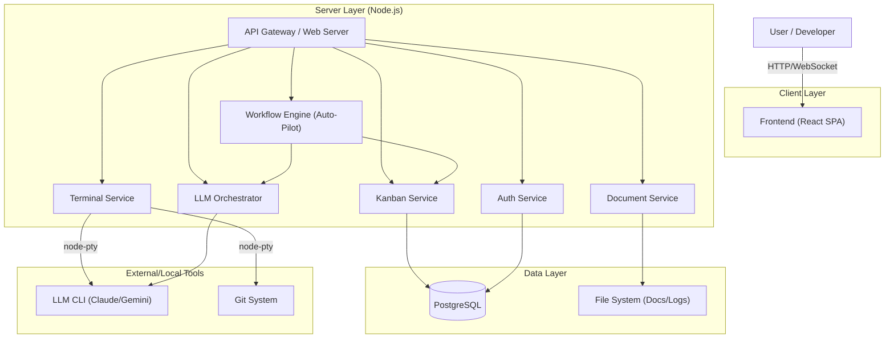

# 1. 시스템 아키텍처 설계 (System Architecture Design)

## 1.1 개요
본 문서는 **JJIban (AI-Assisted Kanban Tool)**의 전체 시스템 아키텍처를 정의합니다. JJIban은 온프레미스 환경에서 동작하며, 웹 기반의 칸반 보드와 LLM이 통합된 터미널 환경을 제공하여 개발 생산성을 극대화하는 것을 목표로 합니다.

## 1.2 전체 아키텍처 (High-Level Architecture)

## 1.3 기술 스택 및 버전 전략 (Tech Stack & Versions)

> **AI 개발 가이드라인**: 모든 구현은 아래 명시된 **LTS 버전**과 **Best Practice** 조합을 엄격히 준수해야 합니다. 실험적인 기능(Experimental Features) 사용은 금지합니다.

### 1.3.1 Frontend (Stable & Proven)
- **Core**: `React v18.3.x` (v19 RC 사용 금지), `TypeScript v5.4.x`
- **Build**: `Vite v5.2.x` (Fast & Stable)
- **State Management**: 
  - Server State: `@tanstack/react-query v5.x` (데이터 캐싱 표준)
  - Client State: `Zustand v4.5.x` (Redux 대비 간결함, AI 코드 생성 오류 최소화)
- **UI System**: 
  - `Tailwind CSS v3.4.x`
  - `Shadcn/UI` (Radix UI 기반, 복사/붙여넣기 방식이라 의존성 충돌 적음)
  - Icons: `Lucide React`
- **Terminal**: `xterm.js v5.3.x` + `xterm-addon-fit`

### 1.3.2 Backend (NestJS Standard)
- **Runtime**: `Node.js v20.x LTS` (Iron) - *v22 사용 지양 (일부 네이티브 모듈 호환성 이슈 방지)*
- **Framework**: `NestJS v10.x` (Express 어댑터 사용)
  - *이유*: 엄격한 모듈 구조와 의존성 주입(DI)이 강제되어 AI가 구조적인 코드를 작성하기 유리함.
- **Database ORM**: `Prisma v5.x`
  - *이유*: TypeORM 대비 타입 안전성이 높고 스키마 변경 관리가 명확함.
- **Real-time**: `Socket.io v4.7.x`
- **Terminal**: `node-pty v1.0.x` (Windows/Linux 호환성 필수 체크)
- **Validation**: `class-validator`, `class-transformer` (DTO 검증 필수)

### 1.3.3 Database & Infrastructure
- **RDBMS**: `PostgreSQL 16.x` (Stable)
- **Container**: `Docker Compose v2.x`

## 1.4 핵심 아키텍처 패턴 (AI Implementation Guide)

### 1.4.1 Backend: Modular Monolith (NestJS)
- **구조 원칙**: 기능별 모듈(`Modules`)로 완벽히 분리. 순환 참조(Circular Dependency) 절대 금지.
- **계층 구조 (Layered Architecture)**:
  1. **Controller**: 요청/응답 처리, DTO 검증 (`@Body() dto: CreateTaskDto`). 비즈니스 로직 포함 금지.
  2. **Service**: 비즈니스 로직, 트랜잭션 관리.
  3. **Repository (Prisma)**: DB 접근.
- **에러 처리**: `GlobalExceptionFilter`를 통해 표준화된 에러 응답 반환. `try-catch` 남발 금지.

### 1.4.2 Frontend: Feature-Sliced Design (Lite)
- **구조 원칙**: `src/features/{기능명}` 폴더에 해당 기능의 모든 것(UI, Model, API)을 응집.
- **컴포넌트 원칙**:
  - **Container (Smart)**: 데이터 페칭, 상태 관리 담당.
  - **Presentational (Dumb)**: Props로 데이터만 받아 렌더링. 로직 없음.
- **Custom Hooks**: 비즈니스 로직은 반드시 `use{Feature}.ts` 훅으로 분리하여 View와 Logic 분리.

## 1.4 주요 컴포넌트 상세

### 1.4.1 Web Terminal Service
- **역할**: 브라우저 내에서 서버의 쉘(Shell) 환경을 제공하고 LLM CLI와 상호작용.
- **구현**:
  - `xterm.js` (Frontend) <-> `Socket.io` <-> `node-pty` (Backend)
  - 각 Task/Issue 별로 독립적인 세션 또는 공유 세션 관리.
  - LLM CLI(`claude`, `gemini`) 실행 및 입출력 스트리밍 캡처.

### 1.4.2 LLM Orchestrator
- **역할**: 프롬프트 템플릿을 관리하고, 컨텍스트(파일, 코드)를 수집하여 LLM에게 전달.
- **기능**:
  - 프롬프트 템플릿 엔진 (Handlebars/Mustache)
  - 프로젝트 컨텍스트 주입 (현재 작업 중인 파일, 관련 문서)
  - LLM 실행 결과 파싱 및 자동 문서화 (Markdown 저장)

### 1.4.3 Document System
- **역할**: 프로젝트 문서를 관리하고 버전 관리 시스템과 연동.
- **구현**:
  - 파일 시스템 기반 저장 (`/docs/tasks/{taskId}/...`)
  - Markdown 파일 실시간 렌더링 및 편집
  - Mermaid 다이어그램 지원

### 1.4.4 Workflow Automation Service (Auto-Pilot)
- **역할**: 정의된 파이프라인에 따라 여러 단계의 LLM 작업을 순차적으로 실행.
- **기능**:
  - 상태 머신(State Machine) 기반 작업 흐름 제어.
  - 단계별 성공/실패 모니터링.
  - Human-in-the-loop (사용자 승인 대기) 지원.

## 1.5 데이터 흐름 (Data Flow)

### 1.5.1 LLM 명령 실행 흐름
1. **User**: 칸반 카드에서 "설계 문서 생성" 메뉴 클릭
2. **Frontend**: 해당 메뉴의 프롬프트 템플릿 ID와 Task 정보를 WebSocket으로 전송
3. **Backend (Terminal Service)**:
   - `node-pty`로 새 쉘 프로세스 생성
   - 프롬프트 템플릿에 Task 정보(제목, 내용, 파일 경로 등)를 바인딩하여 완성된 프롬프트 생성
   - 쉘에 LLM CLI 명령어 입력 (예: `claude -p "..."`)
4. **Backend -> Frontend**: 쉘 출력을 실시간으로 WebSocket을 통해 스트리밍
5. **Frontend (xterm.js)**: 터미널 화면에 출력 표시
6. **LLM CLI**: 결과 파일(`design.md`) 생성
7. **Backend (Doc Service)**: 파일 시스템 변경 감지 또는 완료 신호 수신 후 DB/UI 업데이트

## 1.6 보안 고려사항 (Security)
- **Authentication**: JWT 기반 인증.
- **Authorization**: 프로젝트 별 접근 권한 제어.
- **Terminal Security**:
  - 실행 가능한 명령어 제한 (Allowlist/Blocklist) - *Optional*
  - 샌드박스 환경 (Docker 내부에서 실행 권장)
  - 민감한 환경 변수 마스킹
