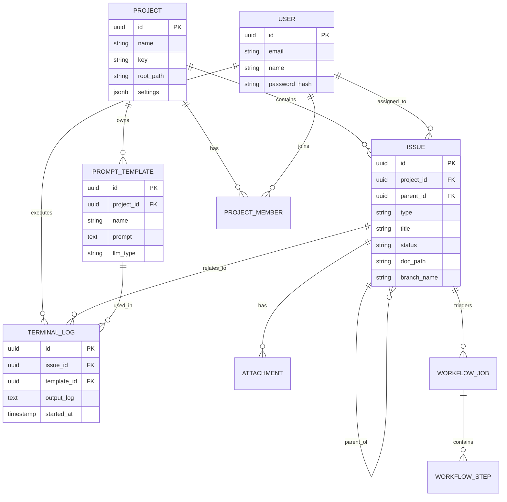

# 2. 데이터베이스 설계 (Database Schema Design)

## 2.1 개요
JJIban의 데이터베이스는 PostgreSQL을 사용하며, 프로젝트 메타데이터, 이슈 트래킹 정보, 사용자 정보, 프롬프트 템플릿 등을 저장합니다. 문서(Markdown)와 로그 파일은 파일 시스템에 저장하고 DB에는 경로만 저장하는 방식을 채택합니다.

## 2.2 ER 다이어그램 (ERD)

## 2.3 테이블 명세 (Table Specifications)

### 2.3.1 Projects (프로젝트)
| Column | Type | Constraint | Description |
|--------|------|------------|-------------|
| id | UUID | PK, Default: uuid_generate_v4() | 프로젝트 고유 ID |
| name | VARCHAR(255) | NOT NULL | 프로젝트 이름 |
| key | VARCHAR(10) | NOT NULL, UNIQUE | 프로젝트 키 (예: JJI) |
| description | TEXT | | 프로젝트 설명 |
| root_path | VARCHAR(500) | NOT NULL | 서버 상의 프로젝트 루트 경로 |
| settings | JSONB | Default: '{}' | 프로젝트별 설정 (워크플로우 등) |
| created_at | TIMESTAMP | Default: NOW() | 생성일시 |

### 2.3.2 Issues (이슈/Task)
| Column | Type | Constraint | Description |
|--------|------|------------|-------------|
| id | UUID | PK, Default: uuid_generate_v4() | 이슈 고유 ID |
| project_id | UUID | FK -> Projects.id | 소속 프로젝트 |
| type | VARCHAR(50) | NOT NULL | 이슈 타입 (Epic, Story, Task 등) |
| parent_id | UUID | FK -> Issues.id | 상위 이슈 ID |
| title | VARCHAR(500) | NOT NULL | 이슈 제목 |
| description | TEXT | | 이슈 설명 |
| status | VARCHAR(50) | NOT NULL | 현재 상태 (To Do, In Progress 등) |
| assignee_id | UUID | FK -> Users.id | 담당자 |
| priority | VARCHAR(20) | Default: 'medium' | 우선순위 |
| doc_path | VARCHAR(500) | | 관련 문서 폴더 경로 (상대 경로) |
| branch_name | VARCHAR(255) | | Git 브랜치명 |
| custom_fields | JSONB | Default: '{}' | 커스텀 필드 데이터 |

### 2.3.3 Prompt Templates (프롬프트 템플릿)
| Column | Type | Constraint | Description |
|--------|------|------------|-------------|
| id | UUID | PK | 템플릿 ID |
| project_id | UUID | FK -> Projects.id | 소속 프로젝트 (NULL이면 전역) |
| name | VARCHAR(255) | NOT NULL | 템플릿 이름 |
| prompt | TEXT | NOT NULL | 프롬프트 내용 (Handlebars 문법) |
| llm_type | VARCHAR(50) | NOT NULL | 사용할 LLM (claude, gemini 등) |
| visible_columns | TEXT[] | | 활성화될 칸반 컬럼 목록 |
| visible_types | TEXT[] | | 활성화될 이슈 타입 목록 |
| variables | JSONB | | 필요한 변수 정의 |

### 2.3.4 Terminal Logs (터미널 실행 로그)
| Column | Type | Constraint | Description |
|--------|------|------------|-------------|
| id | UUID | PK | 로그 ID |
| issue_id | UUID | FK -> Issues.id | 관련 이슈 |
| template_id | UUID | FK -> PromptTemplates.id | 사용된 템플릿 |
| user_id | UUID | FK -> Users.id | 실행한 사용자 |
| session_id | VARCHAR(100) | | 터미널 세션 ID |
| input_log | TEXT | | 입력된 명령어/프롬프트 |
| output_log | TEXT | | 실행 결과 출력 (대용량일 수 있음) |
| status | VARCHAR(20) | | 실행 상태 (running, completed, failed) |
| started_at | TIMESTAMP | | 시작 시간 |
| ended_at | TIMESTAMP | | 종료 시간 |

### 2.3.5 Users (사용자)
| Column | Type | Constraint | Description |
|--------|------|------------|-------------|
| id | UUID | PK | 사용자 ID |
| email | VARCHAR(255) | UNIQUE, NOT NULL | 이메일 |
| name | VARCHAR(100) | NOT NULL | 이름 |
| password_hash | VARCHAR(255) | NOT NULL | 비밀번호 해시 |
| role | VARCHAR(50) | Default: 'user' | 시스템 권한 (admin, user) |

### 2.3.6 Workflow Jobs (자동화 작업)
| Column | Type | Constraint | Description |
|--------|------|------------|-------------|
| id | UUID | PK | 작업 ID |
| issue_id | UUID | FK -> Issues.id | 대상 이슈 |
| status | VARCHAR(20) | | running, paused, completed, failed |
| current_step_index | INT | Default: 0 | 현재 진행 중인 단계 인덱스 |
| is_auto_mode | BOOLEAN | Default: false | 완전 자동 여부 (false면 단계별 승인 필요) |
| created_at | TIMESTAMP | | 시작 시간 |

### 2.3.7 Workflow Steps (자동화 단계 상세)
| Column | Type | Constraint | Description |
|--------|------|------------|-------------|
| id | UUID | PK | 단계 ID |
| job_id | UUID | FK -> WorkflowJobs.id | 소속 작업 |
| step_name | VARCHAR(50) | | 단계명 (예: design, review) |
| status | VARCHAR(20) | | pending, running, success, failed, waiting_approval |
| template_id | UUID | FK -> PromptTemplates.id | 실행할 템플릿 |
| terminal_log_id | UUID | FK -> TerminalLogs.id | 실행 로그 연결 |
| result_summary | TEXT | | 실행 결과 요약 |
| started_at | TIMESTAMP | | 시작 시간 |
| completed_at | TIMESTAMP | | 완료 시간 |

## 2.4 인덱스 및 제약조건 전략
- **Issues**: `project_id`, `status`, `assignee_id`에 인덱스 생성하여 칸반 보드 조회 성능 최적화.
- **Terminal Logs**: `issue_id`에 인덱스 생성하여 이슈별 로그 조회 속도 향상.
- **Foreign Keys**: 모든 관계에 FK 제약조건 설정하여 데이터 무결성 보장.
