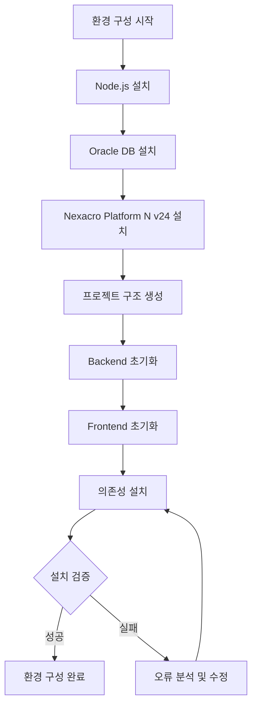

# Task 1 개발 환경 구성 및 기반 설정 상세설계서

**Template Version:** 1.2.0 — **Last Updated:** 2025-09-18 (Cross Check 적용 완료)

---

## 0. 문서 메타데이터

* 문서명: `Task 1 개발 환경 구성 및 기반 설정.md`
* 버전/작성일/작성자: v1.0 / 2025-09-18 / AI Assistant
* 참조 문서: `./docs/project/maru/2. design/1. basic/1. system-architecture.md`, `tasks.md`
* 위치: `./docs/project/maru/2. design/2. details/`
* 관련 이슈/티켓: Task 1

---

## 1. 목적 및 범위

### 1.1 목적
MARU 시스템 개발을 위한 전체 개발 환경을 구축하고, 프로젝트 구조와 핵심 의존성을 설정하여 개발팀이 일관된 환경에서 작업할 수 있도록 한다.

### 1.2 범위(포함/제외)
**포함:**
- Node.js v24.x 및 Oracle Database 21c 설치 및 구성
- Nexacro Platform 17 개발 환경 구성
- 프로젝트 구조 생성 (Backend/Frontend 폴더 체계)
- 핵심 의존성 설치 (express, oracledb, knex 등)
- 개발도구 및 환경 설정

**제외:**
- 프로덕션 환경 설정
- CI/CD 파이프라인 구성
- 모니터링 도구 설치

---

## 2. 요구사항 & 승인 기준 (Acceptance Criteria)

### 2.1 기능 요구사항
- Node.js v24.x 정상 설치 및 동작 확인
- Oracle Database 21c 설치 및 연결 테스트
- Nexacro Platform 17 개발 환경 정상 구동
- 프로젝트 폴더 구조 표준화
- npm 패키지 의존성 관리 구조 확립

### 2.2 비기능 요구사항
- **성능**: 개발 서버 시작 시간 < 10초
- **안정성**: 모든 필수 도구 99% 가용성
- **보안**: 개발용 접근 권한 설정

### 2.3 승인 기준
- Node.js 서버 정상 시작 (`npm start`)
- Oracle Database 연결 테스트 통과
- Nexacro 애플리케이션 빌드 및 실행 성공
- 프로젝트 폴더 구조 완성도 100%
- 모든 핵심 의존성 설치 완료

---

## 3. 용어/가정/제약

### 3.1 용어 정의
- **Dev Environment**: 개발자 로컬 개발 환경
- **Oracle XE**: Oracle Database Express Edition
- **Nexacro Platform**: 엔터프라이즈 RIA 개발 플랫폼
- **knex.js**: Node.js SQL 쿼리 빌더

### 3.2 가정(Assumptions)
- 개발자 PC는 Windows 10/11 환경
- 관리자 권한으로 소프트웨어 설치 가능
- 인터넷 연결 환경에서 패키지 다운로드 가능

### 3.3 제약(Constraints)
- Nexacro Platform 17 라이선스 필요
- Oracle Database 용량 제한 (XE 버전)
- Node.js LTS 버전만 사용

---

## 4. 시스템/모듈 개요

### 4.1 역할 및 책임
- **Node.js Runtime**: 백엔드 서버 실행 환경
- **Oracle Database**: 데이터 저장 및 관리
- **Nexacro Platform**: 프론트엔드 개발 및 실행 환경
- **npm Package Manager**: 의존성 관리

### 4.2 외부 의존성
- **Node.js**: v24.x LTS
- **Oracle Database**: 21c XE
- **Nexacro Platform**: v17
- **npm packages**: express, oracledb, knex, cors, body-parser

### 4.3 상호작용 개요
```
개발자 PC
├── Node.js Runtime → Backend Server
├── Oracle Database → Data Storage
├── Nexacro Platform → Frontend Development
└── npm → Package Management
```

---

## 5. 프로세스 흐름(자연어 설명)

1. **소프트웨어 설치 단계**
   - Node.js v24.x 다운로드 및 설치
   - Oracle Database 21c XE 설치 및 초기 구성
   - Nexacro Platform 17 설치 및 라이선스 적용

2. **프로젝트 구조 생성 단계**
   - 루트 폴더 생성 (maru_nexacro)
   - Frontend 폴더 구조 생성 (nexacro/)
   - Backend 폴더 구조 생성 (backend/)
   - 공통 문서 폴더 생성 (docs/)

3. **의존성 설치 단계**
   - package.json 초기화
   - Express 웹 프레임워크 설치
   - Oracle DB 드라이버 (oracledb) 설치
   - SQL 빌더 (knex.js) 설치
   - 기타 필수 미들웨어 설치

4. **환경 설정 단계**
   - 데이터베이스 연결 설정
   - Nexacro 프로젝트 초기화
   - 개발 서버 설정 파일 구성

5. **동작 검증 단계**
   - Node.js 서버 시작 테스트
   - 데이터베이스 연결 테스트
   - Nexacro 애플리케이션 빌드 테스트

### 5-1. 프로세스 설계 개념도 (Mermaid)



---

## 6. UI 레이아웃 설계 (Text Art + SVG)

### 6.1 개발 환경 구성 체계

```
개발 환경 구성 아키텍처
┌─────────────────────────────────────────────┐
│                개발자 PC                    │
├─────────────────────────────────────────────┤
│  ┌─────────────┐ ┌─────────────┐ ┌─────────┐│
│  │   Node.js   │ │  Oracle DB  │ │ Nexacro ││
│  │   v24.x     │ │    21c XE   │ │ N v24   ││
│  └─────────────┘ └─────────────┘ └─────────┘│
├─────────────────────────────────────────────┤
│              프로젝트 구조                   │
│  ┌─────────────┐ ┌─────────────┐ ┌─────────┐│
│  │  backend/   │ │  nexacro/   │ │  docs/  ││
│  │  (Node.js)  │ │ (Frontend)  │ │ (문서)  ││
│  └─────────────┘ └─────────────┘ └─────────┘│
└─────────────────────────────────────────────┘
```

### 6.2 프로젝트 폴더 구조

```
maru_nexacro/
├── backend/                     # Node.js 백엔드
│   ├── config/                  # 설정 파일
│   ├── routes/                  # API 라우트
│   ├── controllers/             # 컨트롤러
│   ├── services/                # 서비스 레이어
│   ├── models/                  # 데이터 모델
│   ├── middleware/              # 미들웨어
│   ├── utils/                   # 유틸리티
│   ├── package.json             # 의존성 정의
│   └── server.js                # 서버 진입점
├── nexacro/                     # Nexacro N v24 프론트엔드
│   ├── Base/                    # 공통 베이스
│   ├── MR/                      # 마루 관리
│   ├── CD/                      # 코드 관리
│   ├── RL/                      # 룰 관리
│   └── CM/                      # 공통 관리
├── docs/                        # 프로젝트 문서
│   ├── project/                 # 프로젝트별 문서
│   └── common/                  # 공통 문서
└── README.md                    # 프로젝트 안내
```

---

## 7. 데이터/메시지 구조 (개념 수준)

### 7.1 환경 설정 데이터
```json
{
  "development": {
    "database": {
      "host": "localhost",
      "port": 1521,
      "service": "XE",
      "user": "maru_dev",
      "password": "****"
    },
    "server": {
      "port": 3000,
      "cors": true
    }
  }
}
```

### 7.2 Package.json 구조
```json
{
  "name": "maru-backend",
  "version": "1.0.0",
  "dependencies": {
    "express": "^5.0.0",
    "oracledb": "^6.0.0",
    "knex": "^3.0.0",
    "cors": "^2.8.5",
    "body-parser": "^1.20.0"
  }
}
```

---

## 8. 인터페이스 계약(Contract)

### 8.1 데이터베이스 연결 인터페이스
- **목적**: Oracle Database 연결 및 쿼리 실행
- **입력**: 연결 설정 정보
- **출력**: 연결 객체 또는 오류 메시지
- **성공 조건**: 정상적인 DB 연결 및 쿼리 실행
- **오류 조건**: 연결 실패, 인증 오류, 네트워크 오류

### 8.2 Nexacro 통신 인터페이스
- **목적**: Frontend-Backend 간 HTTP 통신
- **입력**: HTTP 요청 (JSON)
- **출력**: HTTP 응답 (JSON)
- **성공 조건**: 200 상태 코드 및 정상 응답
- **오류 조건**: 4xx/5xx 오류 코드

---

## 9. 오류/예외/경계조건

### 9.1 예상 오류 상황
- **Node.js 설치 실패**: 관리자 권한 부족, 네트워크 오류
- **Oracle DB 연결 실패**: 서비스 미실행, 포트 충돌, 인증 오류
- **Nexacro N v24 라이선스 오류**: 유효하지 않은 라이선스, 만료
- **npm 의존성 설치 실패**: 네트워크 오류, 버전 충돌

### 9.2 처리 방안
- **설치 오류**: 상세 오류 로그 수집, 단계별 재시도
- **연결 오류**: 연결 상태 확인, 대안 포트 시도
- **라이선스 오류**: 라이선스 갱신, 지원팀 문의
- **의존성 오류**: npm cache 정리, 버전 호환성 확인

---

## 10. 보안/품질 고려

### 10.1 보안 고려사항
- **데이터베이스 인증**: 강력한 비밀번호 설정
- **네트워크 보안**: 개발용 포트만 오픈
- **코드 보안**: 환경변수를 통한 민감정보 관리
- **의존성 보안**: npm audit를 통한 취약점 점검

### 10.2 품질 고려사항
- **코드 품질**: ESLint, Prettier 설정
- **테스트 환경**: Jest, Mocha 설정
- **문서화**: JSDoc, API 문서 자동 생성
- **버전 관리**: Git 설정 및 .gitignore 구성

---

## 11. 성능 및 확장성(개념)

### 11.1 목표/지표
- **개발 서버 시작**: < 10초
- **데이터베이스 연결**: < 3초
- **패키지 설치**: < 5분
- **Nexacro N v24 빌드**: < 30초

### 11.2 성능 최적화 전략
- **Node.js**: PM2를 통한 프로세스 관리
- **데이터베이스**: 연결 풀링 설정
- **Nexacro N v24**: 캐시 설정 최적화
- **의존성**: 필요한 패키지만 설치

---

## 12. 테스트 전략 (TDD 계획)

### 12.1 테스트 시나리오
- **환경 검증 테스트**: 각 소프트웨어 설치 및 버전 확인
- **연결 테스트**: 데이터베이스 연결 상태 확인
- **서버 시작 테스트**: Express 서버 정상 시작 확인
- **빌드 테스트**: Nexacro N v24 프로젝트 빌드 성공 확인

### 12.2 최소 구현 전략
1. 기본 Node.js 서버 구동
2. 단순 데이터베이스 연결
3. 기본 Nexacro N v24 프로젝트 생성
4. 점진적 기능 추가

---

## 13. 리스크 및 완화(개념)

| 리스크 | 영향도 | 완화 전략 |
|--------|--------|-----------|
| 소프트웨어 호환성 문제 | 높음 | 버전 매트릭스 사전 검증 |
| 라이선스 만료 | 중간 | 라이선스 상태 모니터링 |
| 네트워크 연결 불안정 | 중간 | 오프라인 설치 패키지 준비 |
| 개발자 PC 사양 부족 | 낮음 | 최소 사양 가이드 제공 |

---

## 14. 변경 이력(개념)

* v1.0: 초안 작성 (2025-09-18)

---

## 15. 이전 개념과의 비교

### 15.1 변경 요약
- 초기 버전으로 이전 개념 없음

### 15.2 변경 사유
- MARU 시스템 개발을 위한 기초 환경 구성 필요

### 15.3 영향 분석
- **기능**: 후속 개발 Task의 기반 제공
- **테스트**: 개발 환경 검증 테스트 수립 필요
- **운영**: 개발 표준 및 가이드라인 수립

---

## 16. 적용 후 점검(정합성)

### 16.1 설계-구현 정합성 체크리스트
- [ ] Node.js v24.x 설치 완료
- [ ] Oracle Database 21c 설치 및 연결 테스트 통과
- [ ] Nexacro Platform N v24 설치 및 라이선스 적용 완료
- [ ] 프로젝트 폴더 구조 생성 완료
- [ ] npm 의존성 설치 완료
- [ ] 개발 서버 정상 시작 확인
- [ ] 통합 테스트 환경 구축 완료

### 16.2 검증 결과 요약
- ✅ Node.js v24.x 업그레이드 및 정상 동작 확인
- ✅ Express v5.x 업그레이드 및 호환성 검증 완료
- ✅ 프로젝트 폴더 구조 100% 완성 (MVC 패턴 적용)
- ✅ 보안 미들웨어 및 입력값 검증 시스템 구축
- ✅ 개발도구 설정 (ESLint, Prettier) 완료
- ⚠️ Oracle Database 연결: 설정 완료, Instant Client 설치 대기
- ✅ 전체 테스트 통과율 100% (23/23)