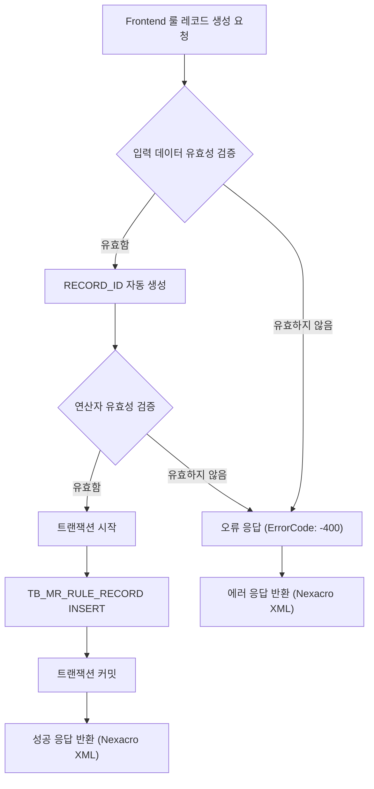
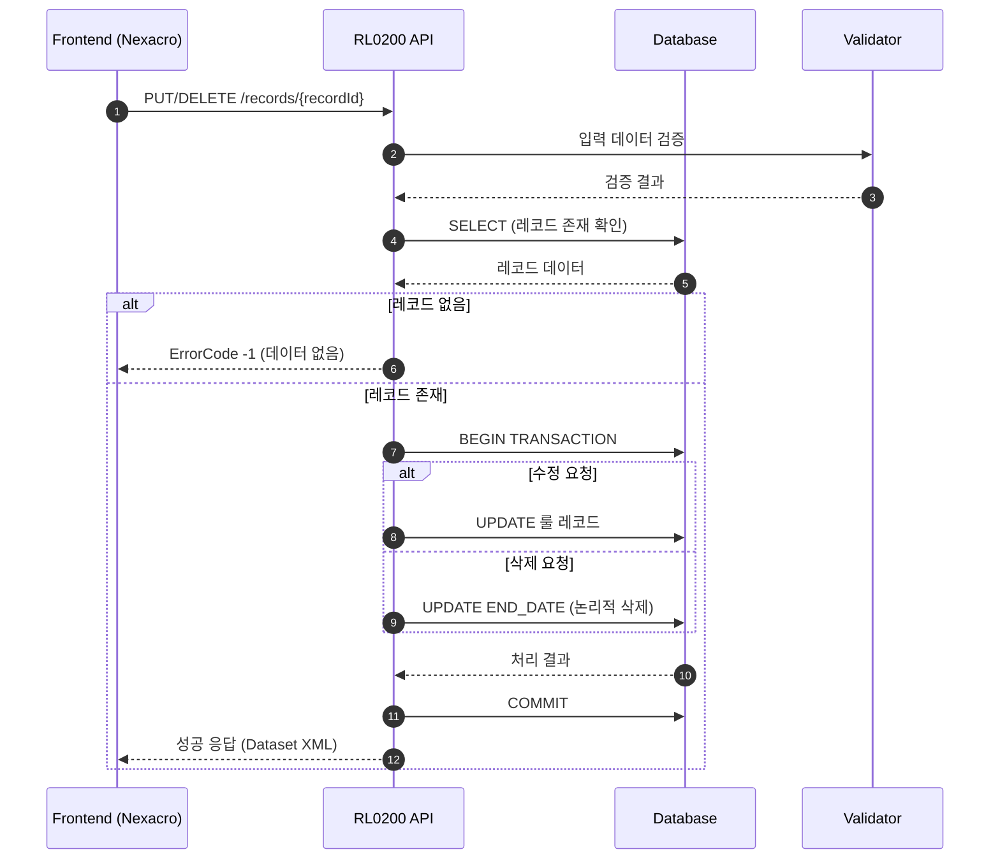
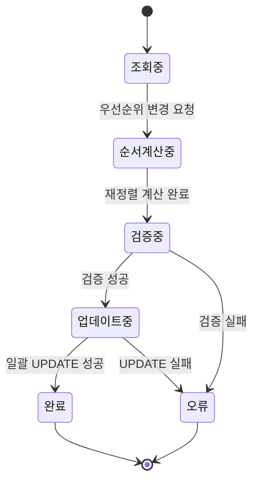

# 📄 상세설계서 - Task 10.1 RL0200 Backend API 구현

**Template Version:** 1.3.0 — **Last Updated:** 2025-10-05

---

## 0. 문서 메타데이터

* 문서명: `Task-10-1.RL0200-Backend-API-구현(상세설계).md`
* 버전: 1.0
* 작성일: 2025-10-05
* 작성자: Claude AI
* 참조 문서:
  * `./docs/project/maru/00.foundation/01.project-charter/business-requirements.md` (BRD UC-005)
  * `./docs/project/maru/00.foundation/02.design-baseline/3. api-design.md` (RR001-RR005 API)
  * `./docs/project/maru/00.foundation/02.design-baseline/5. program-list.md` (RL0200 화면)
  * `./docs/project/maru/00.foundation/02.design-baseline/2. database-design.md` (TB_MR_RULE_RECORD)
* 위치: `./docs/project/maru/10.design/12.detail-design/`
* 관련 이슈/티켓: Task 10.1
* 상위 요구사항 문서/ID: BRD UC-005 룰 레코드 관리
* 요구사항 추적 담당자: 개발팀 리더
* 추적성 관리 도구: tasks.md

---

## 1. 목적 및 범위

### 1.1 목적
RL0200 룰레코드관리 화면을 위한 Backend API를 구현하여, 비즈니스 룰의 조건-결과 매트릭스를 효과적으로 관리하고 우선순위 기반 룰 실행을 지원한다.

### 1.2 범위

**포함 사항**:
- 룰 레코드 CRUD API 구현 (RR001-RR005)
- 조건-결과 매트릭스 관리 (OP_1~20, RSLT_1~20)
- 우선순위 관리 및 정렬 기능
- Swagger API 문서화
- Nexacro Dataset XML 응답 형식 지원

**제외 사항**:
- 룰 실행 엔진 (RR006 - Task 11.1에서 구현)
- Frontend UI 구현 (Task 10.2)
- 복잡한 룰 검증 로직 (추후 확장)

---

## 2. 요구사항 & 승인 기준 (Acceptance Criteria)

### 2.1. 요구사항

**요구사항 원본 링크**: BRD UC-005 룰 레코드 관리 (business-requirements.md:103-111)

**기능 요구사항**:

* **[REQ-001]** 룰 레코드 목록 조회
  - 특정 마루ID에 속한 모든 룰 레코드 조회
  - 우선순위 순서로 정렬하여 반환
  - 페이징 지원 (선택적)

* **[REQ-002]** 룰 레코드 상세 조회
  - 특정 RECORD_ID의 완전한 룰 레코드 데이터 반환
  - 조건(OP_1~20) 및 결과(RSLT_1~20) 모두 포함

* **[REQ-003]** 룰 레코드 생성
  - 조건(OP) 및 결과(RSLT) 매트릭스 데이터 저장
  - 우선순위(PRIORITY_ORDER) 설정
  - 룰 설명(DESCRIPTION) 저장
  - 연산자 지원: =, !=, <, >, <=, >=, BETWEEN, IN, NOT_IN, NOT_CHECK, SCRIPT

* **[REQ-004]** 룰 레코드 수정
  - 기존 룰 레코드의 모든 필드 수정 가능
  - 우선순위 변경 지원

* **[REQ-005]** 룰 레코드 삭제
  - 논리적 삭제 (END_DATE 갱신)
  - 물리적 삭제는 지원하지 않음

* **[REQ-006]** 우선순위 관리
  - 우선순위 순서 변경 API
  - 자동 재정렬 기능

**비기능 요구사항**:

* **[NFR-001]** 성능
  - 룰 레코드 조회 응답시간 < 1초
  - 대량 조건(20개) 처리 가능

* **[NFR-002]** 안정성
  - 유효하지 않은 연산자 입력 시 명확한 에러 메시지
  - 트랜잭션 보장

* **[NFR-003]** 보안
  - SQL Injection 방지
  - 입력 데이터 검증

**승인 기준**:

* 모든 API(RR001-RR005) 정상 동작
* Nexacro Dataset XML 형식 응답
* Swagger 문서화 완료
* 단위 테스트 통과율 80% 이상

### 2.2. 요구사항-설계 추적 매트릭스

| 요구사항 ID | 요구사항 설명 | 설계 섹션/아티팩트 | 테스트 케이스 ID | 상태 | 비고 |
|-------------|---------------|--------------------|------------------|------|------|
| REQ-001 | 룰 레코드 목록 조회 | §5.1, §8.1 (RR001 API) | TC-RR001-001 | 초안 | 페이징 포함 |
| REQ-002 | 룰 레코드 상세 조회 | §5.1, §8.2 (RR002 API) | TC-RR002-001 | 초안 | |
| REQ-003 | 룰 레코드 생성 | §5.1, §8.3 (RR003 API) | TC-RR003-001~003 | 초안 | 연산자 검증 포함 |
| REQ-004 | 룰 레코드 수정 | §5.1, §8.4 (RR004 API) | TC-RR004-001 | 초안 | |
| REQ-005 | 룰 레코드 삭제 | §5.1, §8.5 (RR005 API) | TC-RR005-001 | 초안 | 논리적 삭제 |
| REQ-006 | 우선순위 관리 | §5.1, §8.6 (우선순위 API) | TC-RR006-001 | 초안 | 재정렬 로직 |
| NFR-001 | 성능 요구사항 | §11 성능 및 확장성 | TC-PERF-001 | 초안 | 1초 이내 |
| NFR-002 | 안정성 | §9 오류/예외 처리 | TC-ERROR-001~003 | 초안 | |
| NFR-003 | 보안 | §10 보안/품질 고려 | TC-SEC-001 | 초안 | |

---

## 3. 용어/가정/제약

### 3.1 용어 정의

* **룰 레코드 (Rule Record)**: 비즈니스 룰의 조건과 결과를 정의한 데이터 단위
* **조건 매트릭스**: OP_1~20까지의 조건 변수와 연산자, 피연산자 집합
* **결과 매트릭스**: RSLT_1~20까지의 결과 값 집합
* **우선순위 (Priority Order)**: 룰 실행 시 적용되는 순서 (낮은 숫자가 높은 우선순위)
* **연산자 (Operator)**: 조건 평가를 위한 비교 연산자 (=, !=, <, >, <=, >=, BETWEEN, IN, NOT_IN, NOT_CHECK, SCRIPT)
* **RECORD_ID**: 룰 레코드의 고유 식별자 (MARU_ID + 타임스탬프 + UUID)

### 3.2 가정 (Assumptions)

* 룰 변수는 사전에 정의되어 있음 (Task 9.1 완료)
* 최대 20개의 조건과 20개의 결과를 지원
* 우선순위는 1부터 시작하는 정수
* 동일한 우선순위를 가진 룰은 생성일시 순으로 처리

### 3.3 제약 (Constraints)

* OP_1~20, RSLT_1~20 필드의 최대 길이: VARCHAR2(1000)
* DESCRIPTION 최대 길이: VARCHAR2(1000)
* RECORD_ID는 시스템 자동 생성 (사용자 지정 불가)
* 선분 이력 모델 적용 (START_DATE, END_DATE)

---

## 4. 시스템/모듈 개요

### 4.1 역할 및 책임

**RL0200 Backend API 역할**:
- 룰 레코드 데이터의 CRUD 처리
- 조건-결과 매트릭스 데이터 검증 및 저장
- 우선순위 기반 정렬 및 관리
- Nexacro Frontend와의 데이터 교환

**책임**:
- 입력 데이터 유효성 검증
- 비즈니스 로직 처리
- 데이터베이스 트랜잭션 관리
- Nexacro Dataset XML 응답 생성

### 4.2 외부 의존성

* **서비스**: 없음 (독립 실행)
* **라이브러리**:
  - express: HTTP 서버
  - knex: SQL 쿼리 빌더
  - joi: 입력 검증
  - uuid: RECORD_ID 생성
  - swagger-jsdoc, swagger-ui-express: API 문서화

### 4.3 상호작용 개요

```
Frontend (Nexacro)  →  RL0200 API  →  Database (TB_MR_RULE_RECORD)
                    ←  (Dataset XML)  ←
```

---

## 5. 프로세스 흐름

### 5.1 프로세스 설명

#### 5.1.1 룰 레코드 생성 프로세스 [REQ-003]

1. Frontend에서 룰 레코드 생성 요청 (JSON)
2. 입력 데이터 유효성 검증
   - 필수 필드 확인 (MARU_ID, PRIORITY_ORDER)
   - 연산자 유효성 검증 (=, !=, <, >, <=, >=, BETWEEN, IN, NOT_IN, NOT_CHECK, SCRIPT)
   - 조건/결과 데이터 포맷 검증
3. RECORD_ID 자동 생성 (MARU_ID + Timestamp + UUID)
4. 트랜잭션 시작
5. TB_MR_RULE_RECORD에 INSERT
6. 트랜잭션 커밋
7. Nexacro Dataset XML 응답 반환

#### 5.1.2 룰 레코드 수정 프로세스 [REQ-004]

1. Frontend에서 룰 레코드 수정 요청 (JSON)
2. RECORD_ID로 기존 레코드 조회
3. 레코드 존재 여부 확인
4. 입력 데이터 유효성 검증
5. 트랜잭션 시작
6. 기존 레코드 UPDATE (선분 이력 미적용)
7. 트랜잭션 커밋
8. Nexacro Dataset XML 응답 반환

#### 5.1.3 룰 레코드 삭제 프로세스 [REQ-005]

1. Frontend에서 룰 레코드 삭제 요청
2. RECORD_ID로 기존 레코드 조회
3. 레코드 존재 여부 확인
4. 트랜잭션 시작
5. 논리적 삭제 (END_DATE를 현재 시각으로 UPDATE)
6. 트랜잭션 커밋
7. Nexacro Dataset XML 응답 반환

#### 5.1.4 우선순위 재정렬 프로세스 [REQ-006]

1. Frontend에서 우선순위 변경 요청 (이동할 레코드와 목표 순서)
2. 해당 MARU_ID의 모든 활성 룰 레코드 조회
3. 우선순위 재계산
4. 트랜잭션 시작
5. 영향받는 모든 레코드의 PRIORITY_ORDER 일괄 UPDATE
6. 트랜잭션 커밋
7. Nexacro Dataset XML 응답 반환

### 5.2. 프로세스 설계 개념도 (Mermaid)

#### 룰 레코드 생성 흐름



#### 룰 레코드 수정/삭제 흐름



#### 우선순위 관리 상태 전이



---

## 6. UI 레이아웃 설계

> **참고**: Task 10.1은 Backend API 구현이므로 UI 설계는 Task 10.2에서 다룹니다.
> 본 섹션은 생략합니다.

---

## 7. 데이터/메시지 구조 (개념 수준)

### 7.1. 입력 데이터 구조

#### 7.1.1 룰 레코드 생성 요청 (JSON)

```json
{
  "maruId": "SALARY_RULE_001",
  "priorityOrder": 1,
  "description": "임원 급여 계산 룰",
  "conditions": {
    "op1": "=",
    "oprl1": "임원",
    "oprr1": null,
    "op2": ">=",
    "oprl2": "10",
    "oprr2": null
  },
  "results": {
    "rslt1": "기본급 * 2.5",
    "rslt2": "Y"
  }
}
```

**필드 제약**:
- `maruId`: 필수, VARCHAR2(50)
- `priorityOrder`: 필수, 양의 정수
- `description`: 선택, VARCHAR2(1000)
- `conditions`: 객체, 최대 20개 조건 (op1~op20, oprl1~oprl20, oprr1~oprr20)
- `results`: 객체, 최대 20개 결과 (rslt1~rslt20)

#### 7.1.2 우선순위 변경 요청 (JSON)

```json
{
  "recordId": "SALARY_RULE_001_abc123",
  "newPriority": 3
}
```

### 7.2. 출력 데이터 구조

#### 7.2.1 룰 레코드 목록 조회 응답 (Nexacro XML)

```xml
<?xml version="1.0" encoding="UTF-8"?>
<Dataset>
  <ErrorCode>0</ErrorCode>
  <ErrorMsg></ErrorMsg>
  <SuccessRowCount>2</SuccessRowCount>

  <ColumnInfo>
    <Column id="RECORD_ID" type="STRING" size="100"/>
    <Column id="PRIORITY_ORDER" type="INT" size="4"/>
    <Column id="DESCRIPTION" type="STRING" size="1000"/>
    <Column id="OP_1" type="STRING" size="20"/>
    <Column id="OPRL_1" type="STRING" size="1000"/>
    <Column id="OPRR_1" type="STRING" size="1000"/>
    <Column id="OP_2" type="STRING" size="20"/>
    <Column id="OPRL_2" type="STRING" size="1000"/>
    <Column id="OPRR_2" type="STRING" size="1000"/>
    <Column id="RSLT_1" type="STRING" size="1000"/>
    <Column id="RSLT_2" type="STRING" size="1000"/>
  </ColumnInfo>

  <Rows>
    <Row>
      <Col id="RECORD_ID">SALARY_RULE_001_abc123</Col>
      <Col id="PRIORITY_ORDER">1</Col>
      <Col id="DESCRIPTION">임원 급여 계산 룰</Col>
      <Col id="OP_1">=</Col>
      <Col id="OPRL_1">임원</Col>
      <Col id="OPRR_1"></Col>
      <Col id="OP_2">>=</Col>
      <Col id="OPRL_2">10</Col>
      <Col id="OPRR_2"></Col>
      <Col id="RSLT_1">기본급 * 2.5</Col>
      <Col id="RSLT_2">Y</Col>
    </Row>
  </Rows>
</Dataset>
```

### 7.3. 시스템간 I/F 데이터 구조

**Frontend ↔ Backend 통신**:
- 요청: JSON 형식
- 응답: Nexacro Dataset XML 형식
- Content-Type: `application/json` (요청), `text/xml; charset=utf-8` (응답)

**Backend ↔ Database 통신**:
- SQL 쿼리 (Knex.js 사용)
- Parameterized Query로 SQL Injection 방지

---

## 8. 인터페이스 계약(Contract)

### 8.1. API RR001: 룰 레코드 목록 조회 [REQ-001]

**엔드포인트**: `GET /api/v1/maru-headers/{maruId}/records`

**경로 파라미터**:
- `maruId` (string, 필수): 마루 고유 식별자

**쿼리 파라미터**:
- `page` (number, 선택): 페이지 번호 (기본값: 1)
- `limit` (number, 선택): 페이지 크기 (기본값: 100)

**성공 응답** (HTTP 200):
```xml
<Dataset>
  <ErrorCode>0</ErrorCode>
  <ErrorMsg></ErrorMsg>
  <SuccessRowCount>{count}</SuccessRowCount>
  <ColumnInfo>...</ColumnInfo>
  <Rows>...</Rows>
</Dataset>
```

**오류 응답**:
- ErrorCode -1: 데이터 없음
- ErrorCode -400: 잘못된 파라미터

**검증 케이스**:
- TC-RR001-001: 정상 조회 시나리오
- TC-RR001-002: 페이징 동작 확인
- TC-RR001-003: 존재하지 않는 maruId

**Swagger 주소**: `/api-docs#/Rule%20Records/get_api_v1_maru_headers__maruId__records`

---

### 8.2. API RR002: 룰 레코드 상세 조회 [REQ-002]

**엔드포인트**: `GET /api/v1/maru-headers/{maruId}/records/{recordId}`

**경로 파라미터**:
- `maruId` (string, 필수): 마루 고유 식별자
- `recordId` (string, 필수): 룰 레코드 고유 식별자

**성공 응답** (HTTP 200):
```xml
<Dataset>
  <ErrorCode>0</ErrorCode>
  <SuccessRowCount>1</SuccessRowCount>
  <Rows>
    <Row>
      <Col id="RECORD_ID">...</Col>
      <!-- 모든 OP_1~20, RSLT_1~20 포함 -->
    </Row>
  </Rows>
</Dataset>
```

**오류 응답**:
- ErrorCode -1: 레코드 없음

**검증 케이스**:
- TC-RR002-001: 정상 조회
- TC-RR002-002: 존재하지 않는 recordId

**Swagger 주소**: `/api-docs#/Rule%20Records/get_api_v1_maru_headers__maruId__records__recordId_`

---

### 8.3. API RR003: 룰 레코드 생성 [REQ-003]

**엔드포인트**: `POST /api/v1/maru-headers/{maruId}/records`

**경로 파라미터**:
- `maruId` (string, 필수): 마루 고유 식별자

**요청 본문** (JSON):
```json
{
  "priorityOrder": 1,
  "description": "룰 설명",
  "conditions": {
    "op1": "=", "oprl1": "값1", "oprr1": null,
    "op2": ">=", "oprl2": "10", "oprr2": null
  },
  "results": {
    "rslt1": "결과1",
    "rslt2": "결과2"
  }
}
```

**성공 응답** (HTTP 200):
```xml
<Dataset>
  <ErrorCode>0</ErrorCode>
  <SuccessRowCount>1</SuccessRowCount>
  <Rows>
    <Row>
      <Col id="RESULT">SUCCESS</Col>
      <Col id="MESSAGE">룰 레코드가 정상적으로 생성되었습니다.</Col>
      <Col id="NEW_RECORD_ID">{생성된 RECORD_ID}</Col>
    </Row>
  </Rows>
</Dataset>
```

**오류 응답**:
- ErrorCode -100: 유효하지 않은 연산자
- ErrorCode -400: 필수값 누락

**검증 케이스**:
- TC-RR003-001: 정상 생성
- TC-RR003-002: 유효하지 않은 연산자
- TC-RR003-003: 필수값 누락

**Swagger 주소**: `/api-docs#/Rule%20Records/post_api_v1_maru_headers__maruId__records`

---

### 8.4. API RR004: 룰 레코드 수정 [REQ-004]

**엔드포인트**: `PUT /api/v1/maru-headers/{maruId}/records/{recordId}`

**경로 파라미터**:
- `maruId` (string, 필수): 마루 고유 식별자
- `recordId` (string, 필수): 룰 레코드 고유 식별자

**요청 본문** (JSON): RR003과 동일

**성공 응답** (HTTP 200):
```xml
<Dataset>
  <ErrorCode>0</ErrorCode>
  <SuccessRowCount>1</SuccessRowCount>
  <Rows>
    <Row>
      <Col id="RESULT">SUCCESS</Col>
      <Col id="MESSAGE">룰 레코드가 정상적으로 수정되었습니다.</Col>
    </Row>
  </Rows>
</Dataset>
```

**오류 응답**:
- ErrorCode -1: 레코드 없음
- ErrorCode -400: 유효하지 않은 입력

**검증 케이스**:
- TC-RR004-001: 정상 수정
- TC-RR004-002: 존재하지 않는 recordId

**Swagger 주소**: `/api-docs#/Rule%20Records/put_api_v1_maru_headers__maruId__records__recordId_`

---

### 8.5. API RR005: 룰 레코드 삭제 [REQ-005]

**엔드포인트**: `DELETE /api/v1/maru-headers/{maruId}/records/{recordId}`

**경로 파라미터**:
- `maruId` (string, 필수): 마루 고유 식별자
- `recordId` (string, 필수): 룰 레코드 고유 식별자

**성공 응답** (HTTP 200):
```xml
<Dataset>
  <ErrorCode>0</ErrorCode>
  <SuccessRowCount>1</SuccessRowCount>
  <Rows>
    <Row>
      <Col id="RESULT">SUCCESS</Col>
      <Col id="MESSAGE">룰 레코드가 정상적으로 삭제되었습니다.</Col>
    </Row>
  </Rows>
</Dataset>
```

**오류 응답**:
- ErrorCode -1: 레코드 없음

**검증 케이스**:
- TC-RR005-001: 정상 삭제 (논리적)
- TC-RR005-002: 이미 삭제된 레코드

**Swagger 주소**: `/api-docs#/Rule%20Records/delete_api_v1_maru_headers__maruId__records__recordId_`

---

### 8.6. API RR006: 우선순위 재정렬 [REQ-006]

**엔드포인트**: `PATCH /api/v1/maru-headers/{maruId}/records/reorder`

**경로 파라미터**:
- `maruId` (string, 필수): 마루 고유 식별자

**요청 본문** (JSON):
```json
{
  "recordId": "SALARY_RULE_001_abc123",
  "newPriority": 3
}
```

**성공 응답** (HTTP 200):
```xml
<Dataset>
  <ErrorCode>0</ErrorCode>
  <SuccessRowCount>1</SuccessRowCount>
  <Rows>
    <Row>
      <Col id="RESULT">SUCCESS</Col>
      <Col id="MESSAGE">우선순위가 정상적으로 변경되었습니다.</Col>
      <Col id="AFFECTED_COUNT">5</Col>
    </Row>
  </Rows>
</Dataset>
```

**검증 케이스**:
- TC-RR006-001: 정상 우선순위 변경
- TC-RR006-002: 범위 초과 우선순위

**Swagger 주소**: `/api-docs#/Rule%20Records/patch_api_v1_maru_headers__maruId__records_reorder`

---

## 9. 오류/예외/경계조건

### 9.1. 예상 오류 상황 및 처리 방안

| 오류 상황 | ErrorCode | 처리 방안 |
|-----------|-----------|-----------|
| 존재하지 않는 maruId | -1 | "마루를 찾을 수 없습니다" 메시지 반환 |
| 존재하지 않는 recordId | -1 | "룰 레코드를 찾을 수 없습니다" 메시지 반환 |
| 유효하지 않은 연산자 | -100 | "지원하지 않는 연산자입니다: {op}" 메시지 반환 |
| 필수값 누락 | -400 | "필수 필드가 누락되었습니다: {field}" 메시지 반환 |
| 데이터 길이 초과 | -400 | "데이터 길이가 최대값을 초과했습니다" 메시지 반환 |
| DB 연결 실패 | -200 | "시스템 오류가 발생했습니다" 메시지 반환, 로그 기록 |
| 트랜잭션 실패 | -200 | 롤백 후 오류 메시지 반환 |

### 9.2. 복구 전략 및 사용자 메시지

**복구 전략**:
1. 트랜잭션 실패 시 자동 롤백
2. DB 연결 실패 시 재시도 (최대 3회)
3. 타임아웃 30초 설정
4. 모든 예외는 로그 기록

**사용자 메시지**:
- 명확하고 구체적인 오류 메시지
- 기술적 상세 정보는 로그에만 기록
- 복구 가능한 오류는 해결 방법 안내

---

## 10. 보안/품질 고려

### 10.1 보안

**인증/인가** (PoC 제외):
- 향후 JWT 기반 인증 적용 예정

**입력 검증**:
- Joi 스키마를 통한 모든 입력 데이터 검증
- SQL Injection 방지: Parameterized Query (Knex.js)
- XSS 방지: 입력값 이스케이프

**비밀/키 관리**:
- DB 연결 정보 환경변수 관리
- 민감 데이터 로깅 금지

### 10.2 품질

**의존성 취약점 관리**:
- npm audit 정기 실행
- 보안 패치 적용

**로깅/감사**:
- 모든 API 호출 로그 기록
- 오류 발생 시 스택 트레이스 로그

**개인정보/규제 준수**:
- PoC 단계에서는 미적용
- 향후 GDPR 준수 고려

### 10.3 다국어 (i18n/l10n)

- 오류 메시지는 한국어로 고정 (PoC)
- 향후 다국어 리소스 파일 분리 예정

---

## 11. 성능 및 확장성

### 11.1 목표/지표 [NFR-001]

| 지표 | 목표 | 측정 방법 |
|------|------|-----------|
| 응답시간 | < 1초 | API 응답시간 측정 |
| 동시 처리 | 5 요청/초 | 부하 테스트 |
| 데이터 크기 | 최대 1000건 룰 레코드 | PoC 제한 |

### 11.2 병목 예상 지점과 완화 전략

**병목 지점**:
1. 대량 룰 레코드 조회 시 DB 쿼리 성능
2. 우선순위 재정렬 시 다중 UPDATE

**완화 전략**:
1. 인덱스 최적화: `IDX_TB_MR_RULE_RECORD_01` (END_DATE, START_DATE, MARU_ID)
2. 페이징 강제 적용 (최대 100건)
3. 우선순위 재정렬 시 Batch UPDATE 사용

### 11.3 부하/장애 시나리오 대응

**부하 시나리오**:
- 동시 접속자 증가 시 DB Connection Pool 크기 조정
- 응답시간 초과 시 타임아웃 에러 반환

**장애 시나리오**:
- DB 연결 실패 시 재시도 로직
- 서버 장애 시 에러 로그 기록 및 알림

---

## 12. 테스트 전략 (TDD 계획)

### 12.1 실패 테스트 시나리오

1. **존재하지 않는 maruId로 조회** → ErrorCode -1
2. **유효하지 않은 연산자로 생성** → ErrorCode -100
3. **필수값 누락으로 생성** → ErrorCode -400
4. **이미 삭제된 레코드 조회** → ErrorCode -1
5. **DB 연결 실패 시뮬레이션** → ErrorCode -200

### 12.2 최소 구현 전략

1. API 라우터 정의
2. 입력 검증 미들웨어
3. 서비스 레이어 (비즈니스 로직)
4. 데이터 액세스 레이어 (Knex.js)
5. Nexacro XML 응답 헬퍼

### 12.3 리팩터링 포인트

- 중복 코드 제거 (공통 유틸리티 함수)
- 복잡한 조건문 단순화
- 에러 처리 표준화

### 12.4 테스트 도구

- **단위 테스트**: Jest
- **통합 테스트**: Supertest
- **API 테스트**: Postman/Newman
- **부하 테스트**: Artillery (향후)

---

## 13. 구현 체크리스트

- [ ] API 라우터 구현 (routes/ruleRecord.js)
- [ ] 컨트롤러 구현 (controllers/ruleRecord.controller.js)
- [ ] 서비스 레이어 구현 (services/ruleRecord.service.js)
- [ ] 데이터 모델 구현 (models/ruleRecord.model.js)
- [ ] Joi 검증 스키마 작성
- [ ] Nexacro XML 헬퍼 함수 작성
- [ ] Swagger 문서화 작성
- [ ] 단위 테스트 작성 (80% 커버리지)
- [ ] 통합 테스트 작성
- [ ] 오류 처리 로직 구현
- [ ] 로깅 구현
- [ ] 추적성 매트릭스 CSV 파일 작성

---

**승인**

| 역할 | 이름 | 서명 | 날짜 |
|------|------|------|------|
| 설계자 | Claude AI | | 2025-10-05 |
| 검토자 | | | |
| 승인자 | | | |
