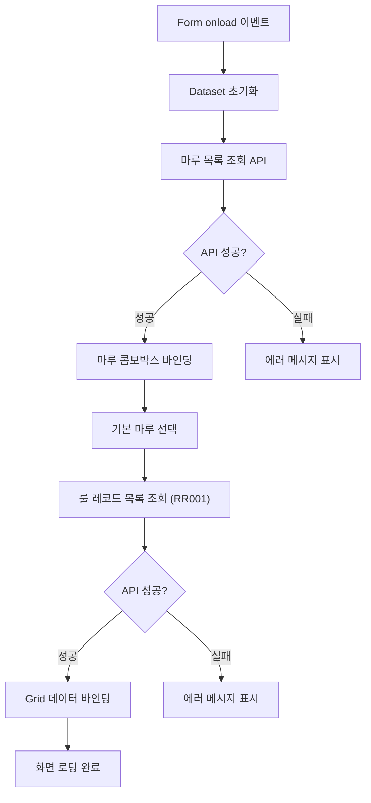
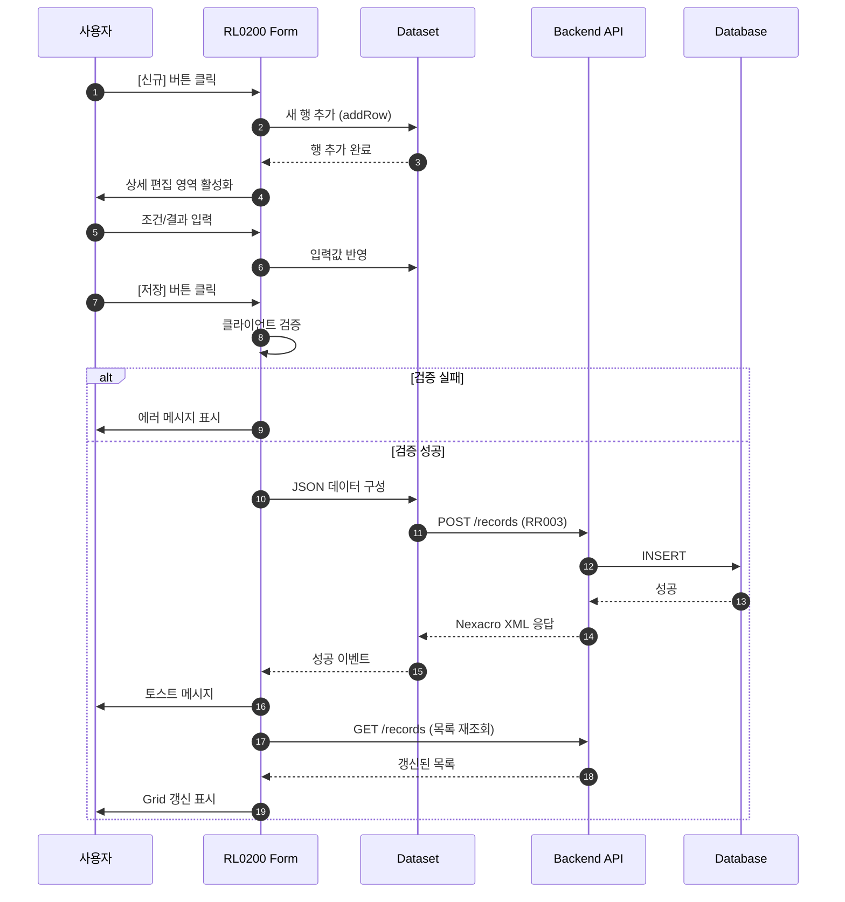
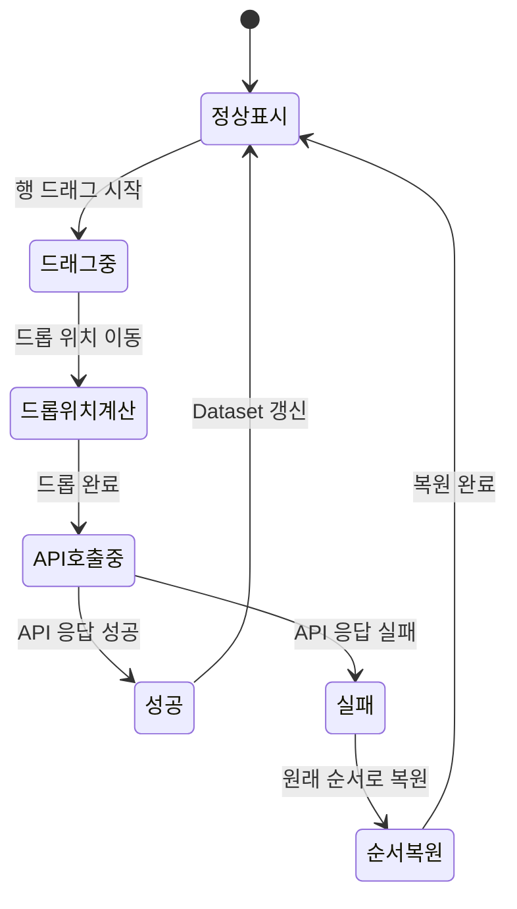
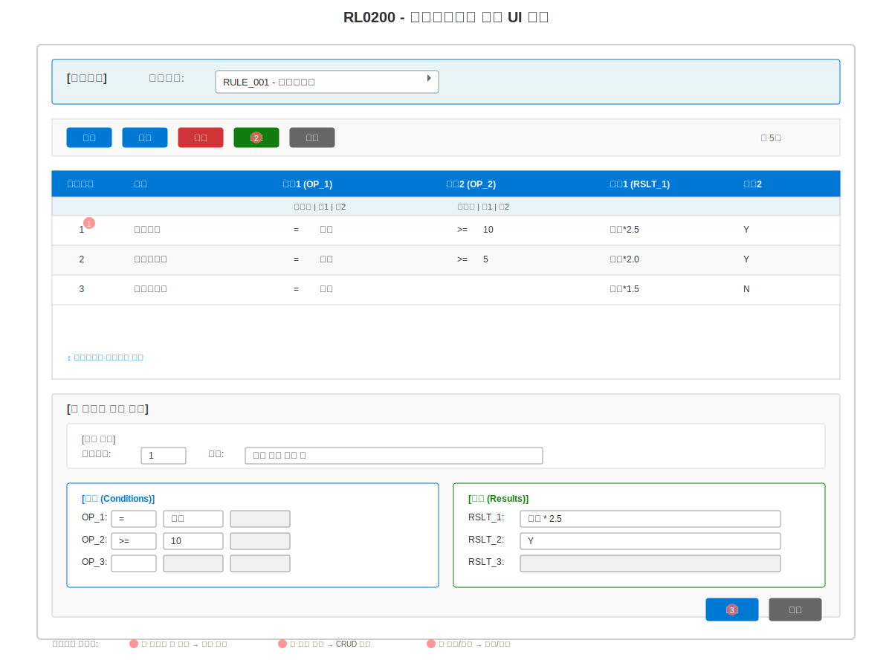

# 📄 상세설계서 - Task 10.2 RL0200 Frontend UI 구현

**Template Version:** 1.3.0 — **Last Updated:** 2025-10-05

---

## 0. 문서 메타데이터

* 문서명: `Task-10-2.RL0200-Frontend-UI-구현(상세설계).md`
* 버전: 1.0
* 작성일: 2025-10-05
* 작성자: Claude AI
* 참조 문서:
  * `./docs/project/maru/00.foundation/01.project-charter/business-requirements.md` (BRD UC-005)
  * `./docs/project/maru/00.foundation/02.design-baseline/4. ui-design.md` (RL0200 화면)
  * `./docs/project/maru/00.foundation/02.design-baseline/5. program-list.md` (RL0200 프로그램)
  * `./docs/project/maru/10.design/12.detail-design/Task-10-1.RL0200-Backend-API-구현(상세설계).md` (Backend API 설계)
  * `./docs/common/06.guide/LLM_Nexacro_Development_Guide.md` (Nexacro 개발 가이드)
* 위치: `./docs/project/maru/10.design/12.detail-design/`
* 관련 이슈/티켓: Task 10.2
* 상위 요구사항 문서/ID: BRD UC-005 룰 레코드 관리
* 요구사항 추적 담당자: Frontend 개발 리더
* 추적성 관리 도구: tasks.md

---

## 1. 목적 및 범위

### 1.1 목적
RL0200 룰레코드관리 화면을 Nexacro N V24로 구현하여, 비즈니스 룰의 조건-결과 매트릭스를 사용자 친화적으로 관리할 수 있는 UI를 제공한다.

### 1.2 범위

**포함 사항**:
- Nexacro Form 구현 (frmRL0200.xfdl)
- 동적 매트릭스 그리드 구현
- 조건 및 결과 입력 UI
- 우선순위 드래그앤드롭 기능
- Backend API 연동 (RR001-RR006)
- Dataset 기반 데이터 바인딩

**제외 사항**:
- Backend API 구현 (Task 10.1에서 완료)
- 룰 실행 엔진 (Task 11.1)
- 복잡한 룰 검증 로직

---

## 2. 요구사항 & 승인 기준 (Acceptance Criteria)

### 2.1. 요구사항

**요구사항 원본 링크**: BRD UC-005 룰 레코드 관리 (business-requirements.md:103-111)

**기능 요구사항**:

* **[REQ-001]** 룰 레코드 목록 표시
  - 특정 마루ID에 속한 룰 레코드를 그리드로 표시
  - 우선순위 순서로 정렬
  - 조건/결과 매트릭스 컬럼 표시

* **[REQ-002]** 룰 레코드 생성/수정
  - 신규 룰 레코드 입력 폼
  - 기존 룰 레코드 수정
  - 조건(OP) 및 결과(RSLT) 동적 입력

* **[REQ-003]** 우선순위 관리
  - 드래그앤드롭으로 순서 변경
  - 우선순위 자동 재정렬

* **[REQ-004]** 연산자 지원
  - 연산자 선택 UI (=, !=, <, >, <=, >=, BETWEEN, IN, NOT_IN, NOT_CHECK, SCRIPT)
  - 연산자별 피연산자 입력 UI

* **[REQ-005]** Backend API 연동
  - 목록 조회 (RR001)
  - 상세 조회 (RR002)
  - 생성 (RR003)
  - 수정 (RR004)
  - 삭제 (RR005)
  - 우선순위 재정렬 (RR006)

**비기능 요구사항**:

* **[NFR-001]** 사용성
  - 최소 클릭으로 룰 입력 가능
  - 직관적인 매트릭스 편집 UI
  - 명확한 에러 메시지

* **[NFR-002]** 성능
  - 룰 목록 로딩 시간 < 2초
  - 우선순위 변경 즉시 반영

* **[NFR-003]** 접근성
  - 키보드 네비게이션 지원
  - 포커스 관리

**승인 기준**:

* 모든 CRUD 기능 정상 동작
* 우선순위 드래그앤드롭 기능 동작
* Backend API 정상 연동
* Nexacro Dataset 기반 데이터 바인딩 완료

### 2.2. 요구사항-설계 추적 매트릭스

| 요구사항 ID | 요구사항 설명 | 설계 섹션/아티팩트 | 테스트 케이스 ID | 상태 | 비고 |
|-------------|---------------|--------------------|------------------|------|------|
| REQ-001 | 룰 레코드 목록 표시 | §6 UI 설계, §7 Dataset | TC-UI-001 | 초안 | 그리드 컴포넌트 |
| REQ-002 | 룰 레코드 생성/수정 | §6 UI 설계, §5 프로세스 | TC-UI-002~003 | 초안 | 입력 폼 |
| REQ-003 | 우선순위 관리 | §6 UI 설계, §5 프로세스 | TC-UI-004 | 초안 | 드래그앤드롭 |
| REQ-004 | 연산자 지원 | §6 UI 설계, §7 Dataset | TC-UI-005 | 초안 | 연산자 콤보박스 |
| REQ-005 | Backend API 연동 | §8 인터페이스 | TC-API-001~006 | 초안 | 6개 API |
| NFR-001 | 사용성 | §8 UX 가이드 | TC-UX-001 | 초안 | |
| NFR-002 | 성능 | §11 성능 | TC-PERF-001 | 초안 | |
| NFR-003 | 접근성 | §8 UX 가이드 | TC-A11Y-001 | 초안 | |

---

## 3. 용어/가정/제약

### 3.1 용어 정의

* **룰 레코드 (Rule Record)**: 비즈니스 룰의 조건과 결과를 정의한 데이터 단위
* **조건 매트릭스**: OP_1~20까지의 조건 변수와 연산자, 피연산자 집합
* **결과 매트릭스**: RSLT_1~20까지의 결과 값 집합
* **우선순위 (Priority Order)**: 룰 실행 시 적용되는 순서
* **동적 컬럼**: 룰 변수 정의에 따라 자동 생성되는 그리드 컬럼
* **Nexacro Dataset**: Nexacro의 데이터 저장 및 바인딩을 위한 객체

### 3.2 가정 (Assumptions)

* Backend API가 정상 구현되어 있음 (Task 10.1 완료)
* 룰 변수가 사전에 정의되어 있음 (Task 9.2)
* Nexacro N V24 환경이 구성되어 있음
* 사용자는 기본적인 Nexacro 화면 조작 방법을 숙지함

### 3.3 제약 (Constraints)

* Nexacro N V24의 Grid 컴포넌트 제약 사항 준수
* 최대 20개의 조건과 20개의 결과 표시
* 브라우저 해상도 최소 1024 x 768
* 단일 마루ID에 대한 룰 레코드만 관리 (다중 마루 동시 편집 불가)

---

## 4. 시스템/모듈 개요

### 4.1 역할 및 책임

**RL0200 Frontend 역할**:
- 룰 레코드 데이터의 시각적 표현
- 사용자 입력 수집 및 검증
- Backend API 호출 및 응답 처리
- Dataset 기반 데이터 관리

**책임**:
- UI 컴포넌트 렌더링
- 사용자 이벤트 처리
- 데이터 유효성 클라이언트 검증
- 에러 메시지 표시

### 4.2 외부 의존성

* **서비스**: Backend API (Task 10.1)
* **라이브러리**:
  - Nexacro N V24 Framework
  - RL0200 Backend API (RR001-RR006)
  - 공통 컴포넌트 (마루 선택, 날짜 선택 등)

### 4.3 상호작용 개요

```
사용자 → RL0200 UI → Dataset → Backend API → Database
        ←           ←         ←              ←
```

---

## 5. 프로세스 흐름

### 5.1 프로세스 설명

#### 5.1.1 화면 로딩 프로세스 [REQ-001]

1. Form Load 이벤트 발생
2. 마루 목록 조회 API 호출 (마루 선택 콤보박스용)
3. Dataset 초기화 (ds_ruleRecordList, ds_ruleRecordDetail)
4. 기본 마루ID 선택 (첫 번째 마루)
5. 선택된 마루ID의 룰 레코드 목록 조회 (RR001 API)
6. Grid에 데이터 바인딩

#### 5.1.2 룰 레코드 생성 프로세스 [REQ-002]

1. [신규] 버튼 클릭
2. ds_ruleRecordDetail Dataset에 새 행 추가
3. 상세 편집 영역 활성화
4. 사용자가 조건/결과 입력
5. [저장] 버튼 클릭
6. 클라이언트 검증 (필수값, 연산자 유효성)
7. JSON 데이터 구성
8. Backend API 호출 (RR003 POST)
9. 성공 응답 시 목록 재조회
10. 토스트 메시지 표시

#### 5.1.3 우선순위 변경 프로세스 [REQ-003]

1. 그리드에서 행 드래그 시작
2. 드롭 위치 계산
3. 임시로 그리드 순서 변경 (UI)
4. Backend API 호출 (RR006 PATCH - 우선순위 재정렬)
5. 성공 응답 시 Dataset 갱신
6. 실패 시 원래 순서로 복원

#### 5.1.4 연산자 선택 프로세스 [REQ-004]

1. 조건 컬럼의 연산자 셀 클릭
2. 연산자 콤보박스 표시 (=, !=, <, >, <=, >=, BETWEEN, IN, NOT_IN, NOT_CHECK, SCRIPT)
3. 연산자 선택
4. 선택된 연산자에 따라 피연산자 입력 필드 활성화/비활성화
   - 단항 연산자 (NOT_CHECK): 피연산자 없음
   - 이항 연산자 (=, !=, <, >, <=, >=): 왼쪽 피연산자만
   - 범위 연산자 (BETWEEN): 왼쪽, 오른쪽 피연산자 모두
   - 목록 연산자 (IN, NOT_IN): 왼쪽 피연산자 (콤마 구분)
   - 스크립트 (SCRIPT): 왼쪽 피연산자 (스크립트 코드)
5. Dataset 갱신

### 5.2. 프로세스 설계 개념도 (Mermaid)

#### 화면 로딩 및 데이터 조회 흐름



#### 룰 레코드 생성/수정 상호작용



#### 우선순위 드래그앤드롭 상태 전이



---

## 6. UI 레이아웃 설계 (Text Art + SVG)

### 6.1. UI 설계

```
┌─────────────────────────────────────────────────────────────────┐
│ [검색조건]                                                       │
│ 마루선택: [RULE_001 - 급여계산룰 ▼]                              │
├─────────────────────────────────────────────────────────────────┤
│ [신규] [수정] [삭제] [복사] [저장] [취소]              총 5건    │
├─────────────────────────────────────────────────────────────────┤
│ │우선│설명           │조건1(OP_1)    │조건2(OP_2)    │결과1      │
│ │순위│              │연산자│값1│값2 │연산자│값1│값2 │(RSLT_1)   │
│─┼────┼──────────────┼──────┼───┼───┼──────┼───┼───┼───────────┤
│ │ 1  │임원급여      │  =   │임원│   │  >=  │10 │   │급여*2.5   │
│ │ 2  │관리자급여    │  =   │관리│   │  >=  │5  │   │급여*2.0   │
│ │ 3  │일반직급여    │  =   │일반│   │      │   │   │급여*1.5   │
│ │ 4  │신입사원급여  │  =   │사원│   │  <   │1  │   │급여*1.0   │
│ │ 5  │특별보너스    │SCRIPT│복잡룰  │   │      │   │   │보너스+100 │
│ ...                                                              │
├─────────────────────────────────────────────────────────────────┤
│ [룰 레코드 상세 편집]                                            │
│ ┌─ 기본 정보 ──────────────────────────────────────────────────┐│
│ │ 우선순위: [1    ]  설명: [임원 급여 계산 룰________________]  ││
│ └──────────────────────────────────────────────────────────────┘│
│ ┌─ 조건 (Conditions) ──────────────┐ ┌─ 결과 (Results) ────────┐│
│ │ OP_1: [= ▼] [임원] [     ]       │ │ RSLT_1: [급여 * 2.5__] ││
│ │ OP_2: [>=▼] [10  ] [     ]       │ │ RSLT_2: [Y___________] ││
│ │ OP_3: [  ▼] [    ] [     ]       │ │ RSLT_3: [____________] ││
│ │ ...                               │ │ ...                    ││
│ └──────────────────────────────────┘ └────────────────────────┘│
│ [적용] [취소]                                                    │
└─────────────────────────────────────────────────────────────────┘
```

**주요 영역**:
1. **검색조건 영역**: 마루 선택 콤보박스
2. **버튼 영역**: CRUD 기능 버튼
3. **목록 그리드**: 룰 레코드 목록 (드래그앤드롭 지원)
4. **상세 편집 영역**: 선택된 룰 레코드의 조건/결과 편집

### 6-2. UI 설계(SVG)



### 6.3. 반응형/접근성/상호작용 가이드(텍스트)

* **반응형**:
  * `≥ 1920px`: 모든 컬럼 표시, 상세 편집 영역 우측 배치
  * `1024-1920px`: 주요 컬럼만 표시, 상세 편집 영역 하단 배치
  * `< 1024px`: 지원 안 함 (관리자 화면 특성상)

* **접근성**:
  - 포커스 순서: 마루선택 → 버튼 → 그리드 → 상세 편집 → 적용/취소
  - 키보드 내비게이션: Tab/Shift+Tab, Enter(선택), Space(체크박스)
  - 에러 메시지: 입력 필드 인접 위치에 명확히 표시

* **상호작용**:
  - 마루 선택 → 룰 레코드 목록 자동 조회
  - 그리드 행 선택 → 상세 편집 영역 데이터 로드
  - 드래그앤드롭 → 우선순위 즉시 변경 (API 호출)
  - 연산자 변경 → 피연산자 입력 필드 동적 활성화

---

## 7. 데이터/메시지 구조 (개념 수준)

### 7.1. 입력 데이터 구조

#### 7.1.1 마루 선택 (Combo)
```javascript
// 마루 목록 Dataset
ds_maruList = {
  columns: ["MARU_ID", "MARU_NAME", "MARU_TYPE"],
  data: [
    { MARU_ID: "RULE_001", MARU_NAME: "급여계산룰", MARU_TYPE: "RULE" },
    { MARU_ID: "RULE_002", MARU_NAME: "권한부여룰", MARU_TYPE: "RULE" }
  ]
};
```

#### 7.1.2 룰 레코드 목록 (Grid)
```javascript
// 룰 레코드 목록 Dataset
ds_ruleRecordList = {
  columns: [
    "RECORD_ID", "PRIORITY_ORDER", "DESCRIPTION",
    "OP_1", "OPRL_1", "OPRR_1",
    "OP_2", "OPRL_2", "OPRR_2",
    "RSLT_1", "RSLT_2"
  ],
  data: [
    {
      RECORD_ID: "RULE_001_abc123",
      PRIORITY_ORDER: 1,
      DESCRIPTION: "임원급여",
      OP_1: "=", OPRL_1: "임원", OPRR_1: "",
      OP_2: ">=", OPRL_2: "10", OPRR_2: "",
      RSLT_1: "급여*2.5", RSLT_2: "Y"
    }
  ]
};
```

#### 7.1.3 룰 레코드 상세 (Detail)
```javascript
// 룰 레코드 상세 Dataset
ds_ruleRecordDetail = {
  columns: [
    "RECORD_ID", "PRIORITY_ORDER", "DESCRIPTION",
    "OP_1", "OPRL_1", "OPRR_1", ..., "OP_20", "OPRL_20", "OPRR_20",
    "RSLT_1", "RSLT_2", ..., "RSLT_20"
  ],
  data: [] // 단일 행
};
```

### 7.2. 출력 데이터 구조

#### 7.2.1 Backend API 요청 (JSON)
```json
{
  "maruId": "RULE_001",
  "priorityOrder": 1,
  "description": "임원 급여 계산 룰",
  "conditions": {
    "op1": "=", "oprl1": "임원", "oprr1": null,
    "op2": ">=", "oprl2": "10", "oprr2": null
  },
  "results": {
    "rslt1": "급여 * 2.5",
    "rslt2": "Y"
  }
}
```

#### 7.2.2 Backend API 응답 (Nexacro XML)
```xml
<?xml version="1.0" encoding="UTF-8"?>
<Dataset>
  <ErrorCode>0</ErrorCode>
  <ErrorMsg></ErrorMsg>
  <SuccessRowCount>1</SuccessRowCount>
  <Rows>
    <Row>
      <Col id="RESULT">SUCCESS</Col>
      <Col id="MESSAGE">룰 레코드가 정상적으로 저장되었습니다.</Col>
    </Row>
  </Rows>
</Dataset>
```

### 7.3. 시스템간 I/F 데이터 구조

**Frontend → Backend**:
- 요청: JSON 형식 (transaction 함수 사용)
- Content-Type: `application/json`

**Backend → Frontend**:
- 응답: Nexacro Dataset XML 형식
- Content-Type: `text/xml; charset=utf-8`

---

## 8. 인터페이스 계약(Contract)

### 8.1. API 호출: 룰 레코드 목록 조회 [REQ-001]

**Nexacro 함수**: `fn_searchRuleRecords()`

**Dataset**: `ds_ruleRecordList`

**API 엔드포인트**: `GET /api/v1/maru-headers/{maruId}/records`

**호출 코드 예시**:
```javascript
this.fn_searchRuleRecords = function() {
    var maruId = this.cbo_maruId.value;

    var strSvcId    = "searchRuleRecords";
    var strSvcUrl   = "/api/v1/maru-headers/" + maruId + "/records";
    var inData      = "";
    var outData     = "ds_ruleRecordList=ds_ruleRecordList";
    var strArg      = "";
    var callBackFnc = "fn_callback";

    this.gfn_transaction(strSvcId, strSvcUrl, inData, outData, strArg, callBackFnc);
};
```

**검증 케이스**:
- TC-API-001: 정상 조회
- TC-API-002: 존재하지 않는 maruId
- TC-API-003: 빈 목록 조회

---

### 8.2. API 호출: 룰 레코드 생성 [REQ-002]

**Nexacro 함수**: `fn_saveRuleRecord()`

**Dataset**: `ds_ruleRecordDetail`

**API 엔드포인트**: `POST /api/v1/maru-headers/{maruId}/records`

**호출 코드 예시**:
```javascript
this.fn_saveRuleRecord = function() {
    // 클라이언트 검증
    if (!this.fn_validate()) {
        return;
    }

    var maruId = this.cbo_maruId.value;
    var recordData = this.ds_ruleRecordDetail.getColumn(0, "RECORD_ID") ? "U" : "I";

    var strSvcId    = "saveRuleRecord";
    var strSvcUrl   = recordData === "I"
        ? "/api/v1/maru-headers/" + maruId + "/records"
        : "/api/v1/maru-headers/" + maruId + "/records/" + this.ds_ruleRecordDetail.getColumn(0, "RECORD_ID");
    var inData      = "ds_ruleRecordDetail=ds_ruleRecordDetail";
    var outData     = "";
    var strArg      = "METHOD=" + (recordData === "I" ? "POST" : "PUT");
    var callBackFnc = "fn_callback";

    this.gfn_transaction(strSvcId, strSvcUrl, inData, outData, strArg, callBackFnc);
};
```

**검증 케이스**:
- TC-API-004: 정상 생성
- TC-API-005: 필수값 누락
- TC-API-006: 유효하지 않은 연산자

---

### 8.3. API 호출: 우선순위 재정렬 [REQ-003]

**Nexacro 함수**: `fn_reorderPriority()`

**Dataset**: 없음 (파라미터로 전달)

**API 엔드포인트**: `PATCH /api/v1/maru-headers/{maruId}/records/reorder`

**호출 코드 예시**:
```javascript
this.fn_reorderPriority = function(recordId, newPriority) {
    var maruId = this.cbo_maruId.value;

    var strSvcId    = "reorderPriority";
    var strSvcUrl   = "/api/v1/maru-headers/" + maruId + "/records/reorder";
    var inData      = "";
    var outData     = "";
    var strArg      = "recordId=" + recordId + " newPriority=" + newPriority;
    var callBackFnc = "fn_callback";

    this.gfn_transaction(strSvcId, strSvcUrl, inData, outData, strArg, callBackFnc);
};
```

**검증 케이스**:
- TC-API-007: 정상 우선순위 변경
- TC-API-008: 범위 초과 우선순위

---

## 9. 오류/예외/경계조건

### 9.1. 예상 오류 상황 및 처리 방안

| 오류 상황 | 처리 방안 |
|-----------|-----------|
| 마루 목록 조회 실패 | "마루 목록을 불러올 수 없습니다" 메시지 표시, 콤보박스 비활성화 |
| 룰 레코드 목록 없음 | "등록된 룰 레코드가 없습니다" 안내 메시지 표시 |
| 필수값 누락 | 해당 입력 필드에 빨간색 테두리 + "필수 항목입니다" 메시지 |
| 유효하지 않은 연산자 | "지원하지 않는 연산자입니다" 메시지 + 연산자 목록 표시 |
| API 호출 타임아웃 | "서버 응답이 지연되고 있습니다. 잠시 후 다시 시도해주세요" |
| 우선순위 변경 실패 | 그리드 순서를 원래대로 복원 + "우선순위 변경에 실패했습니다" 메시지 |

### 9.2. 복구 전략 및 사용자 메시지

**복구 전략**:
1. API 호출 실패 시 재시도 버튼 제공
2. 로컬 Dataset 상태 유지하여 입력 데이터 보존
3. 드래그앤드롭 실패 시 이전 상태로 자동 복원
4. 에러 로그를 콘솔에 기록 (디버깅용)

**사용자 메시지**:
- 명확하고 구체적인 안내
- 해결 방법 제시
- 기술적 상세 정보는 숨김 (개발자 콘솔에만 표시)

---

## 10. 보안/품질 고려

### 10.1 보안

**인증/인가** (PoC 제외):
- 향후 세션 기반 인증 적용 예정

**입력 검증**:
- 클라이언트 검증: 필수값, 데이터 형식, 길이 제한
- XSS 방지: 입력값 이스케이프 처리 (Nexacro 기본 제공)
- SQL Injection: Backend에서 처리 (Frontend는 영향 없음)

**민감 데이터 관리**:
- 룰 레코드는 비즈니스 로직이므로 민감 데이터 아님
- 향후 암호화 필요 시 Backend에서 처리

### 10.2 품질

**코드 품질**:
- Nexacro 코딩 컨벤션 준수
- 함수명 명명 규칙: `fn_{기능명}`
- Dataset명 명명 규칙: `ds_{용도}`
- 주석 필수 작성

**테스트**:
- E2E 테스트: Playwright로 사용자 시나리오 검증
- 단위 테스트: 주요 함수 테스트 (가능 범위)

### 10.3 다국어 (i18n/l10n)

- PoC 단계에서는 한국어만 지원
- 향후 메시지 리소스 파일 분리 예정

---

## 11. 성능 및 확장성

### 11.1 목표/지표 [NFR-002]

| 지표 | 목표 | 측정 방법 |
|------|------|-----------|
| 화면 로딩 시간 | < 2초 | 브라우저 Performance API |
| 그리드 렌더링 시간 | < 1초 (100건 기준) | Nexacro 내부 측정 |
| 사용자 입력 응답 | < 100ms | 이벤트 핸들러 측정 |

### 11.2 병목 예상 지점과 완화 전략

**병목 지점**:
1. 대량 룰 레코드 조회 시 그리드 렌더링 지연
2. 우선순위 드래그앤드롭 시 API 호출 지연

**완화 전략**:
1. 가상 스크롤 (Virtual Scroll) 적용 (Nexacro 기본 제공)
2. 페이징 적용 (기본 100건)
3. 우선순위 변경 시 Debounce 처리 (300ms)
4. Dataset 캐싱으로 불필요한 API 호출 방지

### 11.3 부하/장애 시나리오 대응

**부하 시나리오**:
- 동시 사용자 증가 시 Backend API에서 처리 (Frontend 영향 최소)

**장애 시나리오**:
- API 타임아웃: 30초 후 자동 재시도 안내
- 네트워크 단절: "네트워크 연결을 확인해주세요" 메시지

---

## 12. 테스트 전략 (TDD 계획)

### 12.1 실패 테스트 시나리오

1. **필수값 누락으로 저장 시도** → 에러 메시지 표시
2. **유효하지 않은 연산자 입력** → 연산자 목록 표시
3. **API 호출 실패 시뮬레이션** → 재시도 안내
4. **우선순위 중복 발생** → 자동 재정렬

### 12.2 최소 구현 전략

1. Form Layout 구성
2. Dataset 정의
3. 마루 선택 콤보박스 바인딩
4. 그리드 컴포넌트 설정
5. CRUD 버튼 이벤트 핸들러
6. API 호출 함수
7. 에러 처리 로직

### 12.3 리팩터링 포인트

- 중복 코드 공통 함수화
- Dataset 조작 로직 유틸리티화
- 에러 메시지 중앙 관리

---

## 13. UI 테스트케이스

### 13-1. UI 컴포넌트 테스트케이스

| 테스트 ID | 컴포넌트 | 테스트 시나리오 | 실행 단계 | 예상 결과 | 검증 기준 | 요구사항 | 우선순위 |
|-----------|----------|-----------------|-----------|-----------|-----------|----------|----------|
| TC-UI-001 | 룰 레코드 그리드 | 목록 정상 표시 | 1. 마루 선택<br>2. 그리드 확인 | 룰 레코드 목록 표시 | 우선순위 순 정렬 | [REQ-001] | High |
| TC-UI-002 | 신규 버튼 | 룰 레코드 생성 | 1. [신규] 클릭<br>2. 입력 폼 확인 | 상세 편집 영역 활성화 | 빈 입력 폼 표시 | [REQ-002] | High |
| TC-UI-003 | 저장 버튼 | 룰 레코드 저장 | 1. 데이터 입력<br>2. [저장] 클릭 | 성공 메시지 표시 | 목록 갱신 확인 | [REQ-002] | High |
| TC-UI-004 | 드래그앤드롭 | 우선순위 변경 | 1. 행 드래그<br>2. 다른 위치에 드롭 | 우선순위 자동 재정렬 | API 호출 확인 | [REQ-003] | High |
| TC-UI-005 | 연산자 콤보박스 | 연산자 선택 | 1. 연산자 셀 클릭<br>2. 연산자 선택 | 피연산자 필드 활성화 | 연산자별 로직 동작 | [REQ-004] | Medium |
| TC-UI-006 | 삭제 버튼 | 룰 레코드 삭제 | 1. 행 선택<br>2. [삭제] 클릭<br>3. 확인 | 삭제 확인 다이얼로그 | 삭제 후 목록 갱신 | [REQ-002] | Medium |

### 13-2. 사용자 시나리오 테스트케이스

| 시나리오 ID | 시나리오 명 | 사전 조건 | 실행 단계 | 예상 결과 | 후처리 | 요구사항 | 실행 방법 |
|-------------|-------------|-----------|-----------|-----------|--------|----------|-----------|
| TS-001 | 신규 룰 레코드 등록 플로우 | 마루 선택 완료 | 1. [신규] 클릭<br>2. 조건/결과 입력<br>3. [저장] 클릭 | 성공 메시지<br>목록 갱신 | - | [REQ-002] | Manual/MCP |
| TS-002 | 우선순위 변경 플로우 | 룰 레코드 2개 이상 | 1. 행 드래그<br>2. 새 위치에 드롭<br>3. 결과 확인 | 우선순위 재정렬<br>API 호출 성공 | - | [REQ-003] | MCP 권장 |
| TS-003 | 복잡한 조건 입력 플로우 | 마루 선택 완료 | 1. [신규] 클릭<br>2. BETWEEN 연산자 선택<br>3. 범위 값 입력<br>4. [저장] | 피연산자 2개 입력<br>정상 저장 | 테스트 데이터 삭제 | [REQ-004] | Manual |
| TS-004 | 에러 복구 플로우 | API 타임아웃 발생 | 1. 저장 시도<br>2. 타임아웃 발생<br>3. 재시도 | 에러 메시지 표시<br>재시도 안내 | - | [NFR-001] | Manual |

### 13-3. 반응형 및 접근성 테스트케이스

| 테스트 ID | 테스트 대상 | 테스트 조건 | 검증 방법 | 합격 기준 | 도구/방법 |
|-----------|-------------|-------------|-----------|-----------|-----------|
| TC-RWD-001 | 반응형 레이아웃 | 1920x1080 | 화면 캡처 비교 | 모든 컬럼 표시 | Playwright 스크린샷 |
| TC-RWD-002 | 반응형 레이아웃 | 1024x768 | 화면 캡처 비교 | 주요 컬럼만 표시 | Playwright 스크린샷 |
| TC-A11Y-001 | 키보드 네비게이션 | Tab 키 순차 이동 | 포커스 순서 확인 | 논리적 순서 유지 | 수동 테스트 |
| TC-A11Y-002 | 포커스 관리 | 모달 팝업 열기 | 포커스 이동 확인 | 팝업 내부로 포커스 이동 | 수동 테스트 |

### 13-4. 성능 및 로드 테스트케이스

| 테스트 ID | 성능 지표 | 측정 방법 | 목표 기준 | 측정 도구 | 실행 조건 |
|-----------|-----------|-----------|-----------|-----------|-----------|
| TC-PERF-001 | 화면 로딩 시간 | 초기 렌더링 완료 | 2초 이내 | Playwright Performance API | 표준 네트워크 |
| TC-PERF-002 | 그리드 렌더링 | 100건 목록 표시 | 1초 이내 | Nexacro DevTools | 일반 사용 패턴 |
| TC-PERF-003 | 드래그앤드롭 응답 | 우선순위 변경 완료 | 500ms 이내 | Performance Observer | 최대 데이터셋 |

### 13-5. MCP Playwright 자동화 스크립트 가이드

**기본 실행 패턴**:
```javascript
// 1. RL0200 화면 로드 및 대기
await page.goto('http://localhost:3000/RL0200');
await page.waitForLoadState('networkidle');

// 2. 마루 선택
await page.selectOption('[data-testid="cbo-maru-id"]', 'RULE_001');
await page.waitForTimeout(1000); // 목록 조회 대기

// 3. [신규] 버튼 클릭
await page.click('[data-testid="btn-new"]');

// 4. 조건/결과 입력
await page.selectOption('[data-testid="cbo-op1"]', '=');
await page.fill('[data-testid="txt-oprl1"]', '임원');
await page.fill('[data-testid="txt-rslt1"]', '급여*2.5');

// 5. [저장] 버튼 클릭
await page.click('[data-testid="btn-save"]');

// 6. 성공 메시지 확인
await expect(page.locator('[data-testid="toast-message"]')).toContainText('저장되었습니다');

// 7. 스크린샷 캡처
await page.screenshot({ path: 'rl0200-save-success.png' });
```

**추천 MCP 명령어**:
- `mcp__playwright__browser_navigate`: RL0200 화면 이동
- `mcp__playwright__browser_select_option`: 마루 선택, 연산자 선택
- `mcp__playwright__browser_type`: 조건/결과 입력
- `mcp__playwright__browser_click`: 버튼 클릭
- `mcp__playwright__browser_take_screenshot`: 화면 캡처
- `mcp__playwright__browser_drag`: 우선순위 드래그앤드롭 테스트

### 13-6. 수동 테스트 체크리스트

**일반 UI 검증**:
- [ ] 모든 버튼이 클릭 가능하고 적절한 피드백 제공
- [ ] 입력 필드 포커스 및 유효성 검증 메시지 표시
- [ ] 그리드 드래그앤드롭 정상 동작
- [ ] 연산자 변경 시 피연산자 필드 동적 활성화

**접근성 검증**:
- [ ] Tab 키로 모든 interactive 요소 접근 가능
- [ ] 포커스 표시가 명확하고 일관됨
- [ ] 에러 메시지가 입력 필드 인접 위치에 표시
- [ ] 키보드만으로 모든 기능 사용 가능 (마우스 없이)

**데이터 검증**:
- [ ] 필수값 누락 시 저장 불가
- [ ] 유효하지 않은 연산자 입력 차단
- [ ] 우선순위 자동 재정렬 정상 동작
- [ ] Dataset과 그리드 데이터 일치

---

## 14. 구현 체크리스트

- [ ] Nexacro Form 파일 생성 (frmRL0200.xfdl)
- [ ] Dataset 정의 (ds_maruList, ds_ruleRecordList, ds_ruleRecordDetail)
- [ ] 마루 선택 콤보박스 구현
- [ ] 룰 레코드 그리드 구현
- [ ] 상세 편집 영역 구현
- [ ] CRUD 버튼 이벤트 핸들러 구현
- [ ] 우선순위 드래그앤드롭 구현
- [ ] 연산자 콤보박스 동적 처리 구현
- [ ] Backend API 호출 함수 구현 (6개 API)
- [ ] 에러 처리 로직 구현
- [ ] 클라이언트 검증 로직 구현
- [ ] E2E 테스트 작성
- [ ] 사용자 매뉴얼 작성
- [ ] 추적성 매트릭스 CSV 파일 작성

---

**승인**

| 역할 | 이름 | 서명 | 날짜 |
|------|------|------|------|
| 설계자 | Claude AI | | 2025-10-05 |
| 검토자 | | | |
| 승인자 | | | |
