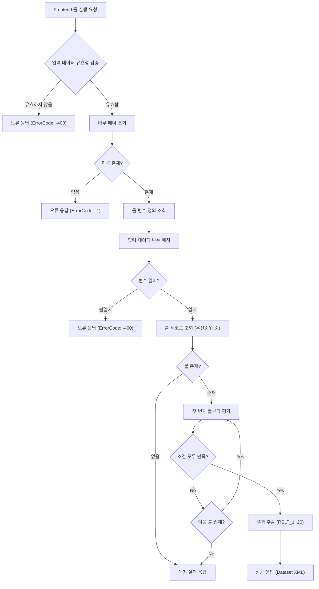
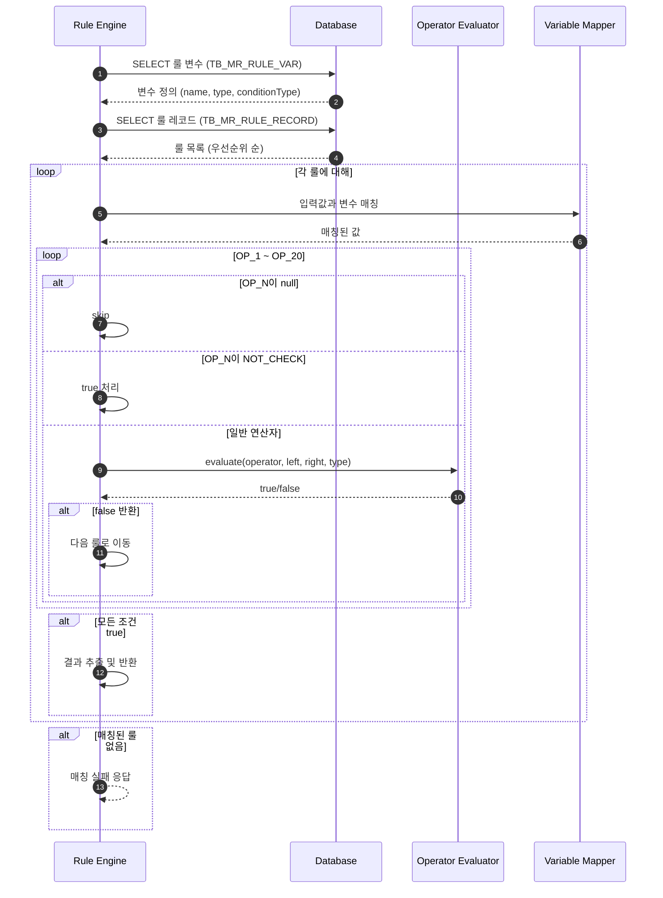
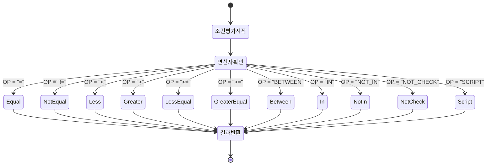

# 📄 상세설계서 - Task 11.1 RL0300 Backend API 구현

**Template Version:** 1.3.0 — **Last Updated:** 2025-10-05

---

## 0. 문서 메타데이터

* 문서명: `Task-11-1.RL0300-Backend-API-구현(상세설계).md`
* 버전: 1.0
* 작성일: 2025-10-05
* 작성자: Claude AI
* 참조 문서:
  * `./docs/project/maru/00.foundation/02.design-baseline/3. api-design.md` (RR006 Rule Execution API)
  * `./docs/project/maru/00.foundation/02.design-baseline/5. program-list.md` (RL0300 화면)
  * `./docs/project/maru/00.foundation/02.design-baseline/2. database-design.md` (TB_MR_RULE_RECORD, TB_MR_RULE_VAR)
  * `./docs/project/maru/10.design/12.detail-design/Task-10-1.RL0200-Backend-API-구현(상세설계).md` (Rule Record API)
* 위치: `./docs/project/maru/10.design/12.detail-design/`
* 관련 이슈/티켓: Task 11.1
* 상위 요구사항 문서/ID: 비즈니스 룰 실행 및 결과 생성
* 요구사항 추적 담당자: 개발팀 리더
* 추적성 관리 도구: tasks.md

---

## 1. 목적 및 범위

### 1.1 목적
RL0300 룰실행테스트 화면을 위한 Backend API를 구현하여, 정의된 비즈니스 룰을 실행하고 조건에 따른 결과를 반환하는 룰 엔진 기능을 제공한다.

### 1.2 범위

**포함 사항**:
- 룰 실행 API 구현 (RR006)
- 연산자 처리 엔진 (=, !=, <, >, <=, >=, BETWEEN, IN, NOT_IN, NOT_CHECK, SCRIPT)
- 조건 평가 및 결과 반환 로직
- 우선순위 기반 룰 매칭
- 룰 검증 및 테스트 기능
- Swagger API 문서화
- Nexacro Dataset XML 응답 형식 지원

**제외 사항**:
- Frontend UI 구현 (Task 11.2)
- 복잡한 SCRIPT 연산자 실행 엔진 (PoC에서는 단순 문자열 비교)
- 룰 성능 최적화 캐싱 (추후 확장)
- 룰 버전 관리 및 이력 조회 (별도 Task)

---

## 2. 요구사항 & 승인 기준 (Acceptance Criteria)

### 2.1. 요구사항

**요구사항 원본 링크**: tasks.md Line 169-175 (RL0300 화면 요구사항)

**기능 요구사항**:

* **[REQ-001]** 룰 실행 API
  - 입력 데이터(조건 변수 값)를 받아 해당하는 룰을 찾아 실행
  - 우선순위가 높은 룰부터 순차적으로 평가
  - 조건이 모두 만족하는 첫 번째 룰의 결과 반환
  - 매칭되는 룰이 없을 경우 적절한 응답 반환

* **[REQ-002]** 연산자 처리 - Equal (=)
  - 좌변과 우변이 정확히 일치하는지 비교
  - 데이터 타입에 따른 비교 (String, Number, Boolean)
  - 대소문자 구분 (String의 경우)

* **[REQ-003]** 연산자 처리 - Not Equal (!=)
  - 좌변과 우변이 일치하지 않는지 비교
  - 데이터 타입에 따른 비교

* **[REQ-004]** 연산자 처리 - 비교 연산자 (<, >, <=, >=)
  - 숫자 값에 대한 비교 연산
  - 문자열의 경우 사전식 순서 비교
  - 날짜의 경우 시간 순서 비교

* **[REQ-005]** 연산자 처리 - BETWEEN
  - 값이 두 피연산자 사이에 있는지 확인
  - 경계값 포함 (inclusive)
  - 예: BETWEEN 10 AND 20 → 10 ≤ value ≤ 20

* **[REQ-006]** 연산자 처리 - IN
  - 값이 콤마로 구분된 리스트에 포함되는지 확인
  - 예: IN "A,B,C" → value ∈ {A, B, C}

* **[REQ-007]** 연산자 처리 - NOT_IN
  - 값이 콤마로 구분된 리스트에 포함되지 않는지 확인
  - 예: NOT_IN "X,Y,Z" → value ∉ {X, Y, Z}

* **[REQ-008]** 연산자 처리 - NOT_CHECK
  - 해당 조건을 검사하지 않음 (항상 true 반환)
  - 옵셔널 조건 처리용

* **[REQ-009]** 연산자 처리 - SCRIPT
  - JavaScript 표현식 평가
  - PoC에서는 단순 문자열 비교로 제한
  - 추후 안전한 샌드박스 환경에서 실행

* **[REQ-010]** 조건 평가 로직
  - 모든 조건(OP_1~OP_20)이 AND 조건으로 평가
  - 하나라도 false이면 해당 룰 스킵
  - 모든 조건이 true이면 결과(RSLT_1~RSLT_20) 반환

* **[REQ-011]** 룰 검증 기능
  - 룰 문법 유효성 검증
  - 연산자와 피연산자 조합 확인
  - 변수 타입과 연산자 호환성 확인

* **[REQ-012]** 디버깅 지원
  - 각 조건의 평가 결과 반환 (옵션)
  - 매칭된 룰의 상세 정보 반환
  - 실행 시간 측정

**비기능 요구사항**:

* **[NFR-001]** 성능
  - 룰 실행 응답시간 < 500ms (100개 룰 기준)
  - 동시 요청 처리 능력 100 req/s

* **[NFR-002]** 안정성
  - 잘못된 입력 데이터에 대한 graceful degradation
  - 무한 루프 방지 (SCRIPT 연산자)
  - 트랜잭션 불필요 (읽기 전용 API)

* **[NFR-003]** 보안
  - SCRIPT 연산자 실행 시 샌드박스 환경
  - SQL Injection 방지
  - 입력 데이터 크기 제한 (DoS 방지)

**승인 기준**:

* 모든 연산자(10종) 정상 동작
* Nexacro Dataset XML 형식 응답
* Swagger 문서화 완료
* 단위 테스트 통과율 90% 이상
* 성능 기준 충족 (< 500ms)

### 2.2. 요구사항-설계 추적 매트릭스

| 요구사항 ID | 요구사항 설명 | 설계 섹션/아티팩트 | 테스트 케이스 ID | 상태 | 비고 |
|-------------|---------------|--------------------|------------------|------|------|
| REQ-001 | 룰 실행 API | §5.1, §8.1 (RR006 API) | TC-RR006-001 | 초안 | 우선순위 기반 |
| REQ-002 | 연산자: Equal | §5.3, §7 (연산자 엔진) | TC-OP-001 | 초안 | |
| REQ-003 | 연산자: Not Equal | §5.3, §7 | TC-OP-002 | 초안 | |
| REQ-004 | 연산자: 비교 | §5.3, §7 | TC-OP-003~006 | 초안 | |
| REQ-005 | 연산자: BETWEEN | §5.3, §7 | TC-OP-007 | 초안 | 경계값 포함 |
| REQ-006 | 연산자: IN | §5.3, §7 | TC-OP-008 | 초안 | |
| REQ-007 | 연산자: NOT_IN | §5.3, §7 | TC-OP-009 | 초안 | |
| REQ-008 | 연산자: NOT_CHECK | §5.3, §7 | TC-OP-010 | 초안 | |
| REQ-009 | 연산자: SCRIPT | §5.3, §7 | TC-OP-011 | 초안 | PoC 제한 |
| REQ-010 | 조건 평가 로직 | §5.2 | TC-EVAL-001 | 초안 | AND 조건 |
| REQ-011 | 룰 검증 | §8.2 | TC-VALID-001 | 초안 | |
| REQ-012 | 디버깅 지원 | §8.1 | TC-DEBUG-001 | 초안 | 옵션 파라미터 |
| NFR-001 | 성능 요구사항 | §11 성능 및 확장성 | TC-PERF-001 | 초안 | < 500ms |
| NFR-002 | 안정성 | §9 오류/예외 처리 | TC-ERROR-001~003 | 초안 | |
| NFR-003 | 보안 | §10 보안/품질 고려 | TC-SEC-001 | 초안 | SCRIPT 샌드박스 |

---

## 3. 용어/가정/제약

### 3.1 용어 정의

* **룰 엔진 (Rule Engine)**: 조건을 평가하고 결과를 반환하는 실행 시스템
* **조건 변수 (Condition Variable)**: 룰 평가에 사용되는 입력 변수 (OP_1~20)
* **결과 변수 (Result Variable)**: 조건이 만족될 때 반환되는 값 (RSLT_1~20)
* **연산자 (Operator)**: 조건 평가를 위한 비교 연산자
* **우선순위 (Priority Order)**: 룰 실행 순서 (낮은 숫자가 높은 우선순위)
* **룰 매칭 (Rule Matching)**: 입력값과 룰 조건이 일치하는지 확인하는 과정
* **OPRL (Operand Left)**: 좌측 피연산자
* **OPRR (Operand Right)**: 우측 피연산자

### 3.2 가정 (Assumptions)

* 룰 변수는 사전에 정의되어 있음 (Task 9.1 완료)
* 룰 레코드는 사전에 생성되어 있음 (Task 10.1 완료)
* 입력 데이터는 룰 변수 정의와 일치함
* SCRIPT 연산자는 PoC에서 제한적으로 지원
* 동시 실행 시 최신 버전의 룰 사용

### 3.3 제약 (Constraints)

* 최대 20개의 조건 평가
* 최대 20개의 결과 반환
* SCRIPT 연산자 실행 시간 제한: 100ms
* 입력 데이터 크기 제한: 10KB
* 룰 조회 시 END_DATE가 '9999-12-31'인 활성 룰만 대상

---

## 4. 시스템/모듈 개요

### 4.1 역할 및 책임

**RL0300 Backend API 역할**:
- 룰 실행 요청 처리
- 조건 평가 및 매칭
- 결과 생성 및 반환
- 룰 검증 및 디버깅 지원

**책임**:
- 입력 데이터 유효성 검증
- 룰 조회 및 우선순위 정렬
- 연산자별 조건 평가
- Nexacro Dataset XML 응답 생성

### 4.2 외부 의존성

* **서비스**: 없음 (독립 실행)
* **라이브러리**:
  - express: HTTP 서버
  - knex: SQL 쿼리 빌더
  - joi: 입력 검증
  - swagger-jsdoc, swagger-ui-express: API 문서화

### 4.3 상호작용 개요

```
Frontend (Nexacro)  →  RL0300 API  →  Database (TB_MR_RULE_RECORD, TB_MR_RULE_VAR)
                    ←  (Dataset XML)  ←
```

**데이터 흐름**:
1. Frontend에서 입력 데이터 전송
2. API에서 해당 마루의 룰 변수 조회
3. 룰 레코드 조회 (우선순위 순)
4. 각 룰에 대해 조건 평가
5. 조건이 만족하는 첫 번째 룰의 결과 반환

---

## 5. 프로세스 흐름

### 5.1 프로세스 설명

#### 5.1.1 룰 실행 프로세스 [REQ-001]

1. Frontend에서 룰 실행 요청 (JSON)
   - 입력 파라미터: `maruId`, `inputs` (변수명: 값 맵핑), `debug` (옵션)
2. 입력 데이터 유효성 검증
   - 필수 필드 확인 (maruId, inputs)
   - inputs 객체 구조 검증
3. 마루 헤더 조회 및 존재 여부 확인
4. 룰 변수 정의 조회 (TB_MR_RULE_VAR)
   - 변수명, 데이터 타입, 조건 타입 조회
5. 입력 데이터와 룰 변수 매칭 검증
   - 필수 변수 누락 확인
   - 데이터 타입 일치 확인
6. 룰 레코드 조회 (TB_MR_RULE_RECORD)
   - WHERE: MARU_ID = :maruId AND END_DATE = '9999-12-31 23:59:59'
   - ORDER BY: PRIORITY_ORDER ASC
7. 각 룰에 대해 조건 평가 (우선순위 순)
   - OP_1~OP_20 순차 평가
   - 모든 조건이 true이면 매칭 성공
8. 매칭된 룰의 결과(RSLT_1~RSLT_20) 추출
9. Nexacro Dataset XML 응답 반환

#### 5.1.2 조건 평가 프로세스 [REQ-010]

1. 룰 레코드의 OP_1부터 순차 확인
2. 각 OP_N이 null이 아니면:
   - 연산자(OP_N) 확인
   - 좌측 피연산자(OPRL_N)와 입력값 매칭
   - 우측 피연산자(OPRR_N) 확인
   - 연산자에 따른 평가 수행
3. NOT_CHECK인 경우 skip (true 처리)
4. 평가 결과가 false이면 즉시 해당 룰 스킵
5. 모든 조건이 true이면 결과 반환

#### 5.1.3 연산자 평가 프로세스 [REQ-002~009]

**Equal (=)**:
```
if (dataType === 'Number') {
  result = Number(leftValue) === Number(rightValue)
} else if (dataType === 'Boolean') {
  result = Boolean(leftValue) === Boolean(rightValue)
} else {
  result = String(leftValue) === String(rightValue)
}
```

**BETWEEN**:
```
const [min, max] = rightValue.split('AND').map(v => v.trim())
result = (leftValue >= min && leftValue <= max)
```

**IN**:
```
const list = rightValue.split(',').map(v => v.trim())
result = list.includes(leftValue)
```

### 5.2. 프로세스 설계 개념도 (Mermaid)

#### 룰 실행 전체 흐름



#### 조건 평가 상세 흐름



#### 연산자 처리 상태 전이



### 5.3 연산자 구현 상세

#### 5.3.1 데이터 타입별 변환

```javascript
// 개념적 타입 변환 로직
function convertValue(value, dataType) {
  switch(dataType) {
    case 'Number':
      return Number(value)
    case 'Boolean':
      return Boolean(value === 'true' || value === true || value === 1)
    case 'String':
    default:
      return String(value)
  }
}
```

#### 5.3.2 연산자별 평가 로직 (개념)

**Equal (=)**:
- 타입 변환 후 엄격한 비교 (===)

**Not Equal (!=)**:
- 타입 변환 후 엄격한 비교 (!==)

**Less (<), Greater (>), LessEqual (<=), GreaterEqual (>=)**:
- 숫자 타입: 숫자 비교
- 문자열 타입: 사전식 비교
- 불리언 타입: true > false

**BETWEEN**:
- 우측 피연산자를 "AND"로 분리
- 좌측 값이 min ≤ value ≤ max 범위인지 확인

**IN**:
- 우측 피연산자를 콤마로 분리
- 좌측 값이 리스트에 포함되는지 확인

**NOT_IN**:
- IN의 반대

**NOT_CHECK**:
- 항상 true 반환

**SCRIPT**:
- PoC: 단순 문자열 비교
- Production: 샌드박스 환경에서 JavaScript 평가

---

## 6. UI 레이아웃 설계

> **참고**: Task 11.1은 Backend API 구현이므로 UI 설계는 Task 11.2에서 다룹니다.
> 본 섹션은 생략합니다.

---

## 7. 데이터/메시지 구조 (개념 수준)

### 7.1. 입력 데이터 구조

**룰 실행 요청 (JSON)**:
```json
{
  "maruId": "SALARY_RULE_001",
  "inputs": {
    "사원등급": "임원",
    "근속년수": 15,
    "부서코드": "DEPT001"
  },
  "debug": false
}
```

**필드 설명**:
- `maruId`: 실행할 마루 ID (필수)
- `inputs`: 변수명-값 매핑 객체 (필수)
- `debug`: 디버깅 정보 포함 여부 (옵션, 기본값: false)

### 7.2. 출력 데이터 구조

**성공 응답 (Nexacro Dataset XML)**:
```xml
<?xml version="1.0" encoding="UTF-8"?>
<Dataset>
  <ErrorCode>0</ErrorCode>
  <ErrorMsg></ErrorMsg>
  <SuccessRowCount>1</SuccessRowCount>

  <ColumnInfo>
    <Column id="MATCHED" type="STRING" size="1"/>
    <Column id="RECORD_ID" type="STRING" size="100"/>
    <Column id="PRIORITY_ORDER" type="INT" size="4"/>
    <Column id="RSLT_1" type="STRING" size="1000"/>
    <Column id="RSLT_2" type="STRING" size="1000"/>
    <!-- RSLT_3 ~ RSLT_20 생략 -->
    <Column id="MESSAGE" type="STRING" size="200"/>
  </ColumnInfo>

  <Rows>
    <Row>
      <Col id="MATCHED">Y</Col>
      <Col id="RECORD_ID">SALARY_RULE_001_abc123</Col>
      <Col id="PRIORITY_ORDER">1</Col>
      <Col id="RSLT_1">기본급 * 2.5</Col>
      <Col id="RSLT_2">Y</Col>
      <Col id="MESSAGE">룰 실행이 성공적으로 완료되었습니다.</Col>
    </Row>
  </Rows>
</Dataset>
```

**매칭 실패 응답**:
```xml
<?xml version="1.0" encoding="UTF-8"?>
<Dataset>
  <ErrorCode>0</ErrorCode>
  <ErrorMsg></ErrorMsg>
  <SuccessRowCount>1</SuccessRowCount>

  <ColumnInfo>
    <Column id="MATCHED" type="STRING" size="1"/>
    <Column id="MESSAGE" type="STRING" size="200"/>
  </ColumnInfo>

  <Rows>
    <Row>
      <Col id="MATCHED">N</Col>
      <Col id="MESSAGE">조건에 맞는 룰을 찾을 수 없습니다.</Col>
    </Row>
  </Rows>
</Dataset>
```

**디버그 모드 응답 (debug: true)**:
```xml
<?xml version="1.0" encoding="UTF-8"?>
<Dataset>
  <ErrorCode>0</ErrorCode>
  <ErrorMsg></ErrorMsg>
  <SuccessRowCount>1</SuccessRowCount>

  <ColumnInfo>
    <Column id="MATCHED" type="STRING" size="1"/>
    <Column id="RECORD_ID" type="STRING" size="100"/>
    <Column id="EVALUATED_RULES" type="INT" size="4"/>
    <Column id="EXECUTION_TIME_MS" type="INT" size="4"/>
    <Column id="CONDITION_RESULTS" type="STRING" size="2000"/>
    <!-- 기본 응답 컬럼들 -->
  </ColumnInfo>

  <Rows>
    <Row>
      <Col id="MATCHED">Y</Col>
      <Col id="RECORD_ID">SALARY_RULE_001_abc123</Col>
      <Col id="EVALUATED_RULES">3</Col>
      <Col id="EXECUTION_TIME_MS">45</Col>
      <Col id="CONDITION_RESULTS">OP_1=true, OP_2=true</Col>
      <!-- 기본 응답 데이터 -->
    </Row>
  </Rows>
</Dataset>
```

### 7.3. 시스템간 I/F 데이터 구조

**Database 조회 결과**:
- TB_MR_RULE_VAR: 변수 정의
- TB_MR_RULE_RECORD: 룰 레코드

**캐싱 고려사항**:
- 룰 변수 정의는 자주 변경되지 않으므로 메모리 캐시 가능
- 룰 레코드는 변경 가능성이 있으므로 조회 시마다 DB에서 가져옴

---

## 8. 인터페이스 계약(Contract)

### 8.1. API RR006: 룰 실행 [REQ-001]

**엔드포인트**: `POST /api/v1/maru-headers/{maruId}/execute-rule`

**경로 파라미터**:
| 파라미터 | 타입 | 필수 | 설명 |
|----------|------|------|------|
| maruId | string | Y | 마루 고유 식별자 |

**요청 본문 (JSON)**:
```json
{
  "inputs": {
    "변수명1": "값1",
    "변수명2": 값2,
    ...
  },
  "debug": false
}
```

**요청 필드**:
| 필드 | 타입 | 필수 | 설명 |
|------|------|------|------|
| inputs | object | Y | 변수명-값 매핑 객체 |
| debug | boolean | N | 디버깅 정보 포함 여부 (기본값: false) |

**성공 응답 (HTTP 200)**:
- Content-Type: `text/xml; charset=utf-8`
- Body: Nexacro Dataset XML (§7.2 참조)
- ErrorCode: 0

**오류 응답**:

| ErrorCode | ErrorMsg | 설명 |
|-----------|----------|------|
| -1 | 마루를 찾을 수 없습니다. | MARU_ID가 존재하지 않음 |
| -400 | 필수 입력값이 누락되었습니다. | inputs 객체 누락 |
| -400 | 변수 '{변수명}'이(가) 정의되지 않았습니다. | 입력 변수가 룰 변수에 없음 |
| -400 | 변수 '{변수명}'의 데이터 타입이 일치하지 않습니다. | 데이터 타입 불일치 |
| -100 | 조건에 맞는 룰을 찾을 수 없습니다. | 매칭되는 룰 없음 |
| -200 | 시스템 오류가 발생했습니다. | 서버 내부 오류 |

**검증 케이스**:
- TC-RR006-001: 정상적인 룰 실행 (매칭 성공)
- TC-RR006-002: 매칭 실패 케이스
- TC-RR006-003: 입력 데이터 누락
- TC-RR006-004: 변수 타입 불일치
- TC-RR006-005: 디버그 모드 실행

**Swagger 주소**: `http://localhost:3000/api-docs#/Rule%20Execution/post_api_v1_maru_headers__maruId__execute_rule`

### 8.2. API: 룰 검증 [REQ-011]

**엔드포인트**: `POST /api/v1/maru-headers/{maruId}/validate-rule`

**경로 파라미터**:
| 파라미터 | 타입 | 필수 | 설명 |
|----------|------|------|------|
| maruId | string | Y | 마루 고유 식별자 |

**요청 본문 (JSON)**:
```json
{
  "recordId": "SALARY_RULE_001_abc123"
}
```

**성공 응답**:
```xml
<?xml version="1.0" encoding="UTF-8"?>
<Dataset>
  <ErrorCode>0</ErrorCode>
  <ErrorMsg></ErrorMsg>
  <SuccessRowCount>1</SuccessRowCount>

  <ColumnInfo>
    <Column id="VALID" type="STRING" size="1"/>
    <Column id="MESSAGE" type="STRING" size="200"/>
    <Column id="VALIDATION_DETAILS" type="STRING" size="2000"/>
  </ColumnInfo>

  <Rows>
    <Row>
      <Col id="VALID">Y</Col>
      <Col id="MESSAGE">룰이 유효합니다.</Col>
      <Col id="VALIDATION_DETAILS">모든 연산자가 올바르게 정의되었습니다.</Col>
    </Row>
  </Rows>
</Dataset>
```

**검증 항목**:
1. 연산자 유효성 (허용된 연산자 목록)
2. 피연산자 존재 여부 (연산자에 따라 필수)
3. 데이터 타입 호환성
4. BETWEEN 연산자의 AND 구분자 존재
5. IN/NOT_IN 연산자의 콤마 구분자 존재

---

## 9. 오류/예외/경계조건

### 9.1. 예상 오류 상황 및 처리 방안

**입력 데이터 오류**:
- **상황**: 필수 변수 누락
- **처리**: ErrorCode -400, 누락된 변수명 명시
- **복구**: 사용자에게 필수 변수 안내

**타입 불일치 오류**:
- **상황**: 변수 타입과 입력 데이터 타입 불일치
- **처리**: ErrorCode -400, 기대 타입과 실제 타입 명시
- **복구**: 자동 타입 변환 시도 (가능한 경우)

**연산자 오류**:
- **상황**: 지원하지 않는 연산자
- **처리**: ErrorCode -100, 지원 연산자 목록 제공
- **복구**: 룰 정의 수정 필요

**BETWEEN 파싱 오류**:
- **상황**: "AND" 구분자 없음
- **처리**: ErrorCode -100, 올바른 형식 안내
- **복구**: 룰 정의 수정 필요

**IN/NOT_IN 파싱 오류**:
- **상황**: 콤마 구분자 형식 오류
- **처리**: ErrorCode -100, 올바른 형식 안내
- **복구**: 룰 정의 수정 필요

**매칭 실패**:
- **상황**: 조건에 맞는 룰이 없음
- **처리**: ErrorCode 0 (정상), MATCHED='N'
- **복구**: 기본값 반환 또는 사용자에게 안내

**SCRIPT 실행 오류**:
- **상황**: SCRIPT 실행 중 예외 발생
- **처리**: ErrorCode -100, 예외 메시지 포함
- **복구**: SCRIPT 수정 필요

**성능 문제**:
- **상황**: 룰 개수가 너무 많아 응답 지연
- **처리**: 타임아웃 설정 (5초)
- **복구**: 룰 개수 제한 또는 인덱스 최적화

### 9.2. 복구 전략 및 사용자 메시지

**Graceful Degradation**:
- SCRIPT 연산자 실행 실패 시 해당 조건을 false 처리하고 다음 룰로 이동

**사용자 친화적 메시지**:
```
오류: "변수 '사원등급'의 값이 올바르지 않습니다.
      기대 타입: String, 입력 타입: Number"

안내: "조건에 맞는 룰을 찾을 수 없습니다.
      입력 데이터를 확인하거나 룰 정의를 추가하세요."
```

---

## 10. 보안/품질 고려

### 10.1 보안 고려사항

**SCRIPT 연산자 샌드박스**:
- PoC에서는 SCRIPT 실행 제한
- Production에서는 vm2 또는 isolated-vm 사용
- 실행 시간 제한 (100ms)
- 파일 시스템 접근 차단
- 네트워크 접근 차단

**SQL Injection 방지**:
- Parameterized Query 사용 (knex)
- 사용자 입력값 직접 SQL에 삽입 금지

**입력 검증**:
- Joi 스키마를 통한 엄격한 검증
- 입력 데이터 크기 제한 (10KB)
- 특수문자 필터링 (필요 시)

**DoS 방지**:
- Rate Limiting 적용 (100 req/s)
- 입력 데이터 크기 제한
- 룰 실행 타임아웃 설정

**로깅 및 감사**:
- 모든 룰 실행 요청 로깅
- 실행 시간 및 결과 기록
- 오류 발생 시 스택 트레이스 저장

### 10.2 품질 고려사항

**코드 품질**:
- ESLint를 통한 정적 분석
- 단위 테스트 커버리지 90% 이상
- 통합 테스트 포함

**에러 핸들링**:
- Try-Catch를 통한 예외 처리
- 명확한 에러 메시지
- 에러 코드 표준화

**국제화 (i18n)**:
- 에러 메시지 다국어 지원 (향후)
- 로케일 파라미터 지원 (향후)

---

## 11. 성능 및 확장성(개념)

### 11.1 목표/지표

**응답 시간**:
- 평균: < 200ms
- 95 percentile: < 500ms
- 최대: < 1초

**처리량**:
- 동시 요청: 100 req/s
- 최대 룰 개수: 1000개 (마루당)
- 최대 조건 개수: 20개 (룰당)

### 11.2 병목 예상 지점과 완화 전략

**병목 1: 데이터베이스 조회**
- **원인**: 룰 레코드 조회 시 전체 스캔
- **완화**: 인덱스 최적화 (MARU_ID, END_DATE, PRIORITY_ORDER)

**병목 2: 조건 평가 반복**
- **원인**: 많은 룰을 순차적으로 평가
- **완화**: 조건 평가 최적화, Early Exit

**병목 3: 타입 변환 오버헤드**
- **원인**: 각 조건마다 타입 변환 수행
- **완화**: 입력 데이터 사전 변환, 캐싱

**병목 4: XML 응답 생성**
- **원인**: XML 문자열 생성 비용
- **완화**: 템플릿 캐싱, 스트리밍

### 11.3 캐시 전략

**룰 변수 정의 캐싱**:
- Key: `rule_var:{maruId}`
- TTL: 1시간
- 무효화: 룰 변수 변경 시

**마루 헤더 캐싱**:
- Key: `maru_header:{maruId}`
- TTL: 1시간
- 무효화: 마루 헤더 변경 시

**룰 레코드 캐싱 (선택적)**:
- Key: `rule_records:{maruId}`
- TTL: 5분
- 무효화: 룰 레코드 변경 시
- 주의: 실시간성 요구사항에 따라 결정

### 11.4 확장성 고려사항

**수평 확장**:
- Stateless API 설계
- 로드 밸런서 지원
- 세션 공유 불필요

**데이터 파티셔닝**:
- MARU_ID 기반 파티셔닝
- 샤딩 전략 (향후)

**비동기 처리**:
- 대량 룰 실행 시 Queue 사용 (향후)
- 배치 처리 지원 (향후)

---

## 12. 테스트 전략 (TDD 계획)

### 12.1 실패 테스트 시나리오

**TC-FAIL-001: 마루 ID 누락**
- **입력**: `{ inputs: {...} }` (maruId 없음)
- **예상**: ErrorCode -400

**TC-FAIL-002: inputs 객체 누락**
- **입력**: `{ maruId: "..." }` (inputs 없음)
- **예상**: ErrorCode -400

**TC-FAIL-003: 존재하지 않는 마루 ID**
- **입력**: `{ maruId: "INVALID", inputs: {...} }`
- **예상**: ErrorCode -1

**TC-FAIL-004: 변수 타입 불일치**
- **입력**: `{ maruId: "...", inputs: { "숫자변수": "문자열" } }`
- **예상**: ErrorCode -400

**TC-FAIL-005: 필수 변수 누락**
- **입력**: 룰 변수에 정의된 필수 변수 미포함
- **예상**: ErrorCode -400

**TC-FAIL-006: 지원하지 않는 연산자**
- **룰 정의**: OP_1 = "INVALID_OPERATOR"
- **예상**: ErrorCode -100

**TC-FAIL-007: BETWEEN 형식 오류**
- **룰 정의**: OPRR_1 = "10 20" (AND 없음)
- **예상**: ErrorCode -100

### 12.2 최소 구현 전략

**Step 1: 기본 구조**
- Express 라우터 설정
- Joi 스키마 정의
- Nexacro XML 응답 헬퍼

**Step 2: 데이터베이스 연동**
- 마루 헤더 조회
- 룰 변수 조회
- 룰 레코드 조회

**Step 3: 연산자 구현 (순차)**
1. Equal (=)
2. Not Equal (!=)
3. 비교 연산자 (<, >, <=, >=)
4. BETWEEN
5. IN
6. NOT_IN
7. NOT_CHECK
8. SCRIPT (제한적)

**Step 4: 조건 평가 엔진**
- 우선순위 기반 룰 순회
- AND 조건 평가
- 첫 매칭 룰 반환

**Step 5: 디버그 기능**
- 실행 시간 측정
- 조건별 평가 결과 추적
- 평가된 룰 개수 카운팅

### 12.3 리팩터링 포인트

**연산자 평가 함수 분리**:
- 각 연산자별 독립 함수
- Strategy Pattern 적용

**타입 변환 유틸리티**:
- 공통 타입 변환 함수
- 에러 핸들링 통합

**응답 생성 헬퍼**:
- Nexacro XML 생성 함수
- 재사용 가능한 템플릿

---

## 13. UI 테스트케이스

> **참고**: Task 11.1은 Backend API 구현이므로 UI 테스트케이스는 Task 11.2에서 작성합니다.
> 본 섹션은 Backend API에 대한 통합 테스트케이스로 대체합니다.

### 13.1 Backend API 통합 테스트케이스

| 테스트 ID | 테스트 시나리오 | 실행 단계 | 예상 결과 | 검증 기준 | 우선순위 |
|-----------|-----------------|-----------|-----------|-----------|----------|
| TC-INT-001 | 정상 룰 실행 (매칭 성공) | 1. 유효한 입력 데이터 전송<br>2. API 호출 | ErrorCode=0, MATCHED=Y | RSLT 값 반환 | High |
| TC-INT-002 | 매칭 실패 케이스 | 1. 조건에 맞지 않는 입력<br>2. API 호출 | ErrorCode=0, MATCHED=N | 메시지 확인 | High |
| TC-INT-003 | 우선순위 기반 룰 선택 | 1. 여러 룰 정의<br>2. 입력 데이터 전송 | 우선순위 1번 룰 반환 | PRIORITY_ORDER=1 | High |
| TC-INT-004 | 디버그 모드 실행 | 1. debug=true로 요청<br>2. API 호출 | 디버그 정보 포함 | EVALUATED_RULES, EXECUTION_TIME_MS 존재 | Medium |
| TC-INT-005 | 모든 연산자 테스트 | 1. 각 연산자별 룰 생성<br>2. 순차 테스트 | 모든 연산자 정상 동작 | 10개 연산자 pass | High |
| TC-INT-006 | 타입 변환 테스트 | 1. 다양한 타입 입력<br>2. 자동 변환 확인 | 타입 변환 후 정상 비교 | Number, String, Boolean | Medium |
| TC-INT-007 | 성능 테스트 (100 룰) | 1. 100개 룰 생성<br>2. 실행 시간 측정 | < 500ms | 응답 시간 확인 | High |
| TC-INT-008 | 동시 요청 테스트 | 1. 100 req/s 부하<br>2. 응답 확인 | 모든 요청 정상 처리 | 에러율 < 1% | Medium |

### 13.2 연산자별 단위 테스트케이스

| 테스트 ID | 연산자 | 테스트 입력 | 예상 결과 | 비고 |
|-----------|--------|-------------|-----------|------|
| TC-OP-001 | = | left="A", right="A" | true | Equal - 일치 |
| TC-OP-002 | = | left="A", right="B" | false | Equal - 불일치 |
| TC-OP-003 | != | left="A", right="B" | true | Not Equal - 불일치 |
| TC-OP-004 | < | left=10, right=20 | true | Less - 참 |
| TC-OP-005 | > | left=20, right=10 | true | Greater - 참 |
| TC-OP-006 | <= | left=10, right=10 | true | LessEqual - 경계값 |
| TC-OP-007 | >= | left=20, right=20 | true | GreaterEqual - 경계값 |
| TC-OP-008 | BETWEEN | left=15, right="10 AND 20" | true | Between - 범위 내 |
| TC-OP-009 | BETWEEN | left=5, right="10 AND 20" | false | Between - 범위 밖 |
| TC-OP-010 | IN | left="B", right="A,B,C" | true | In - 포함 |
| TC-OP-011 | IN | left="D", right="A,B,C" | false | In - 미포함 |
| TC-OP-012 | NOT_IN | left="D", right="A,B,C" | true | Not In - 미포함 |
| TC-OP-013 | NOT_CHECK | left=any, right=any | true | Not Check - 항상 참 |
| TC-OP-014 | SCRIPT | left="임원", right="임원" | true | Script - PoC 제한 |

### 13.3 에러 핸들링 테스트케이스

| 테스트 ID | 에러 상황 | 예상 ErrorCode | 예상 메시지 |
|-----------|-----------|----------------|-------------|
| TC-ERR-001 | maruId 누락 | -400 | 필수 입력값이 누락되었습니다. |
| TC-ERR-002 | inputs 누락 | -400 | 필수 입력값이 누락되었습니다. |
| TC-ERR-003 | 존재하지 않는 마루 | -1 | 마루를 찾을 수 없습니다. |
| TC-ERR-004 | 변수 타입 불일치 | -400 | 변수 '...'의 데이터 타입이 일치하지 않습니다. |
| TC-ERR-005 | 필수 변수 누락 | -400 | 변수 '...'이(가) 정의되지 않았습니다. |
| TC-ERR-006 | 잘못된 연산자 | -100 | 지원하지 않는 연산자입니다. |
| TC-ERR-007 | BETWEEN 형식 오류 | -100 | BETWEEN 연산자는 'min AND max' 형식이어야 합니다. |

---

**승인**

| 역할 | 이름 | 서명 | 날짜 |
|------|------|------|------|
| API 설계자 | | | |
| 백엔드 개발자 | | | |
| 품질 관리자 | | | |
