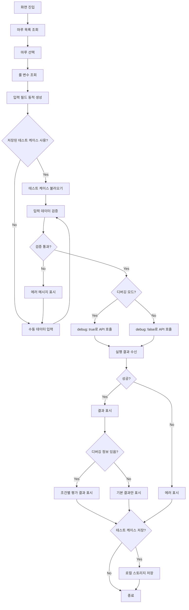
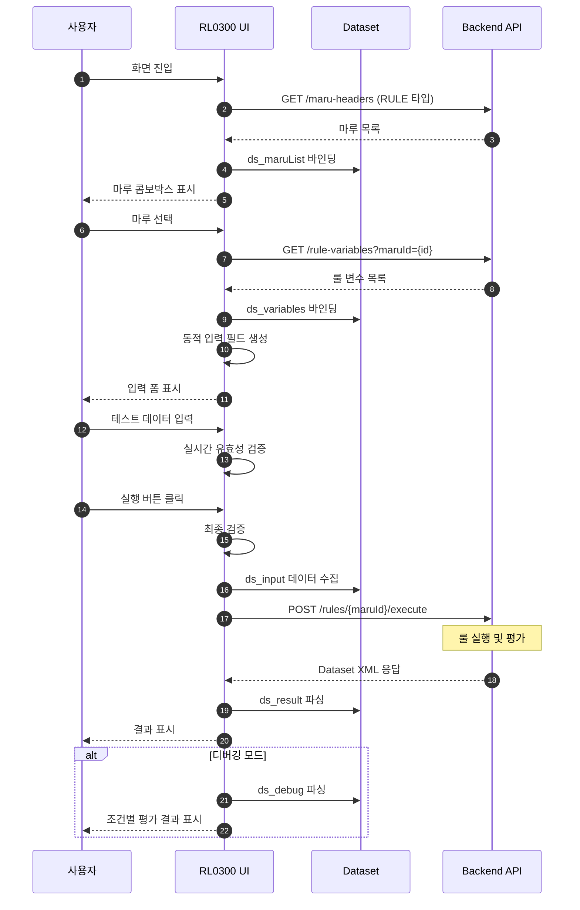
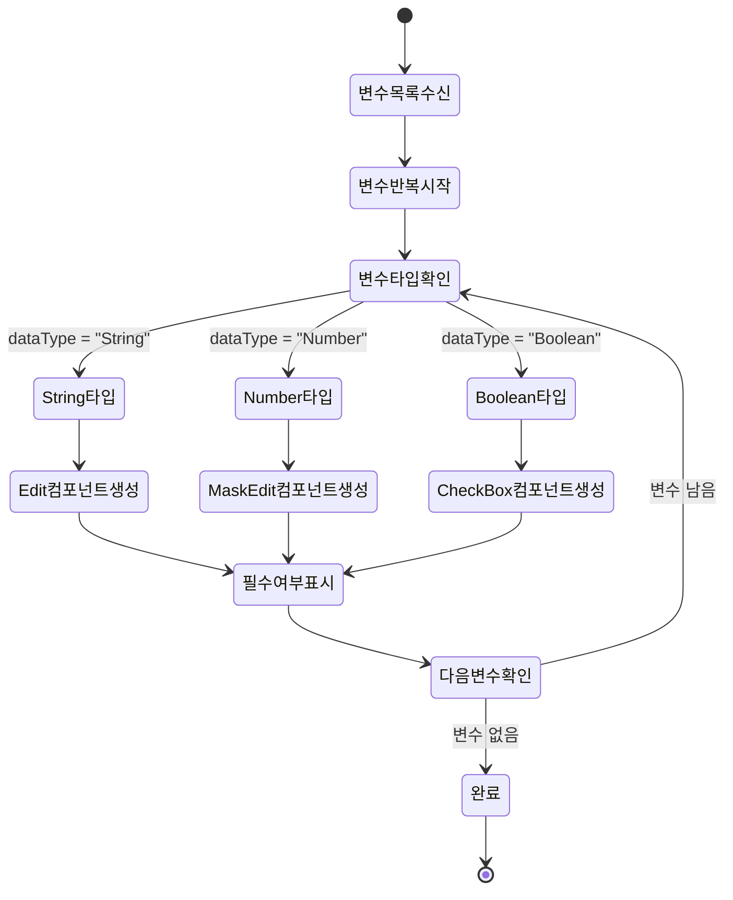
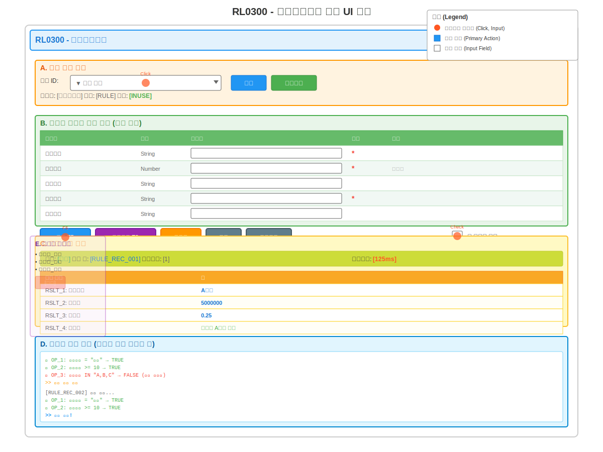

# 📄 상세설계서 - Task 11.2 RL0300 Frontend UI 구현

**Template Version:** 1.3.0 — **Last Updated:** 2025-10-05

---

## 0. 문서 메타데이터

* 문서명: `Task-11-2.RL0300-Frontend-UI-구현(상세설계).md`
* 버전: 1.0
* 작성일: 2025-10-05
* 작성자: Claude AI
* 참조 문서:
  * `./docs/project/maru/10.design/12.detail-design/Task-11-1.RL0300-Backend-API-구현(상세설계).md` (Backend API)
  * `./docs/project/maru/00.foundation/01.project-charter/business-requirements.md` (UC-005 룰 레코드 관리)
  * `./docs/common/06.guide/LLM_Nexacro_Development_Guide.md` (Nexacro 개발 가이드)
  * `./docs/common/06.guide/Nexacro_N_V24_Components.md` (컴포넌트 레퍼런스)
* 위치: `./docs/project/maru/10.design/12.detail-design/`
* 관련 이슈/티켓: Task 11.2
* 상위 요구사항 문서/ID: 비즈니스 룰 실행 및 테스트
* 요구사항 추적 담당자: 개발팀 리더
* 추적성 관리 도구: tasks.md

---

## 1. 목적 및 범위

### 1.1 목적
RL0300 룰실행테스트 화면의 Frontend UI를 Nexacro N V24 플랫폼으로 구현하여, 사용자가 정의된 비즈니스 룰을 테스트하고 실행 결과를 확인할 수 있는 인터랙티브 인터페이스를 제공한다.

### 1.2 범위

**포함 사항**:
- Nexacro Form 생성 (RL0300.xfdl)
- 테스트 데이터 입력 UI 구현
- 룰 실행 및 결과 표시
- 디버깅 정보 표시 기능
- 단계별 실행 및 결과 추적
- Backend API (RR006) 연동
- Dataset 기반 데이터 바인딩
- 에러 처리 및 사용자 피드백

**제외 사항**:
- Backend API 구현 (Task 11.1)
- 룰 변수 정의 화면 (RL0100)
- 룰 레코드 관리 화면 (RL0200)
- 실행 결과 이력 저장 (추후 확장)

---

## 2. 요구사항 & 승인 기준 (Acceptance Criteria)

### 2.1. 요구사항

**요구사항 원본 링크**: tasks.md Line 176-180 (RL0300 화면 요구사항)

**기능 요구사항**:

* **[REQ-001]** 마루 선택 기능
  - 마루 ID 콤보박스 또는 검색 기능
  - 선택 시 룰 변수 자동 로드
  - 마루 정보 표시 (타입, 상태, 설명)

* **[REQ-002]** 테스트 데이터 입력 폼
  - 룰 변수에 따른 동적 입력 필드 생성
  - 변수명, 데이터 타입, 조건 타입 표시
  - 데이터 타입별 입력 검증 (String, Number, Boolean)
  - 필수/옵션 변수 구분 표시

* **[REQ-003]** 룰 실행 기능
  - 실행 버튼 클릭 시 Backend API 호출
  - 입력 데이터 유효성 사전 검증
  - 로딩 상태 표시
  - 실행 시간 측정 표시

* **[REQ-004]** 실행 결과 표시
  - 매칭된 룰 정보 표시
  - 결과 변수 (RSLT_1~20) 표시
  - 우선순위, 레코드 ID 표시
  - 매칭 성공/실패 상태 표시

* **[REQ-005]** 디버깅 정보 표시
  - 각 조건의 평가 결과 표시 (옵션)
  - 조건별 true/false 상태
  - 평가 순서 및 실행 경로
  - 실패한 조건 하이라이트

* **[REQ-006]** 단계별 실행 기능
  - 한 단계씩 룰 평가 진행
  - 현재 평가 중인 룰/조건 하이라이트
  - 중간 결과 확인 기능
  - 일시 정지/계속 기능

* **[REQ-007]** 테스트 케이스 관리
  - 테스트 데이터 세트 저장 (로컬 스토리지)
  - 저장된 테스트 케이스 불러오기
  - 테스트 케이스명 관리
  - 테스트 케이스 삭제 기능

* **[REQ-008]** 결과 비교 기능
  - 여러 테스트 결과 비교 표시
  - 예상 결과와 실제 결과 비교
  - 차이점 하이라이트

**비기능 요구사항**:

* **[NFR-001]** 사용성
  - 직관적인 UI 레이아웃
  - 최소 클릭으로 테스트 실행
  - 명확한 에러 메시지
  - 키보드 단축키 지원 (F5: 실행, F8: 단계별 실행)

* **[NFR-002]** 성능
  - 초기 화면 로딩 시간 < 2초
  - 룰 실행 응답 표시 < 1초 (Backend 응답 후)
  - 대량 결과 표시 시 페이징 처리

* **[NFR-003]** 접근성
  - Tab 키 네비게이션
  - 포커스 표시 명확화
  - 색상 대비 WCAG 2.1 AA 준수

**승인 기준**:

* Nexacro Form 완전 구현 및 동작
* 모든 룰 변수 타입 입력 지원
* Backend API 정상 연동
* 디버깅 모드 정상 동작
* 에러 처리 및 사용자 피드백 구현
* E2E 테스트 통과율 85% 이상

### 2.2. 요구사항-설계 추적 매트릭스

| 요구사항 ID | 요구사항 설명 | 설계 섹션/아티팩트 | 테스트 케이스 ID | 상태 | 비고 |
|-------------|---------------|--------------------|------------------|------|------|
| REQ-001 | 마루 선택 기능 | §6.1 UI 영역 A, §8.1 | TC-UI-001 | 초안 | |
| REQ-002 | 테스트 데이터 입력 폼 | §6.1 UI 영역 B, §7.1 | TC-UI-002 | 초안 | 동적 생성 |
| REQ-003 | 룰 실행 기능 | §5.1, §8.1 | TC-UI-003 | 초안 | |
| REQ-004 | 실행 결과 표시 | §6.1 UI 영역 C, §7.2 | TC-UI-004 | 초안 | |
| REQ-005 | 디버깅 정보 표시 | §6.1 UI 영역 D, §7.2 | TC-UI-005 | 초안 | 옵션 |
| REQ-006 | 단계별 실행 기능 | §5.2, §6.1 | TC-UI-006 | 초안 | 고급 기능 |
| REQ-007 | 테스트 케이스 관리 | §6.1 UI 영역 E, §7.3 | TC-UI-007 | 초안 | 로컬 저장 |
| REQ-008 | 결과 비교 기능 | §6.1 UI 영역 F, §7.2 | TC-UI-008 | 초안 | |
| NFR-001 | 사용성 | §6.3, §13 | TC-UX-001 | 초안 | |
| NFR-002 | 성능 | §11 | TC-PERF-001 | 초안 | |
| NFR-003 | 접근성 | §6.3, §13 | TC-A11Y-001 | 초안 | |

---

## 3. 용어/가정/제약

### 3.1 용어 정의

* **룰 실행 (Rule Execution)**: 입력 데이터를 기반으로 비즈니스 룰을 평가하고 결과를 반환하는 프로세스
* **테스트 케이스 (Test Case)**: 특정 룰을 검증하기 위한 입력 데이터 세트
* **디버깅 모드 (Debug Mode)**: 각 조건의 평가 과정을 상세히 표시하는 모드
* **단계별 실행 (Step Execution)**: 한 번에 하나의 룰/조건씩 평가하는 실행 방식
* **매칭 (Matching)**: 입력 데이터가 룰 조건을 만족하는 것
* **Dataset (데이터셋)**: Nexacro에서 데이터를 관리하는 객체

### 3.2 가정 (Assumptions)

* Backend API (RR006)가 정상 동작함
* 마루 헤더가 사전에 생성되어 있음
* 룰 변수가 정의되어 있음
* 룰 레코드가 등록되어 있음
* 사용자는 룰 변수의 의미를 이해하고 있음

### 3.3 제약 (Constraints)

* Nexacro N V24 플랫폼 전용
* 최대 20개의 입력 변수 지원
* 최대 20개의 결과 변수 표시
* 로컬 스토리지 용량 제한 (5MB)
* 동시 실행 불가 (순차 실행만 지원)

---

## 4. 시스템/모듈 개요

### 4.1 역할 및 책임

**RL0300 Frontend UI 역할**:
- 사용자 입력 수집
- 입력 데이터 유효성 검증
- Backend API 호출 및 응답 처리
- 실행 결과 시각화
- 테스트 케이스 관리

**책임**:
- 사용자 친화적 UI 제공
- 실시간 입력 검증
- API 응답 파싱 및 표시
- 에러 상황 사용자 안내
- 테스트 케이스 로컬 저장

### 4.2 외부 의존성

* **Backend API**: `POST /api/v1/rules/:maruId/execute` (RR006)
* **Nexacro 컴포넌트**:
  - Combo (마루 선택)
  - Edit, MaskEdit (입력 필드)
  - Button (실행, 초기화)
  - Grid (결과 표시)
  - TextArea (디버깅 정보)
  - CheckBox (디버깅 모드)

### 4.3 상호작용 개요

```
사용자  →  RL0300 UI  →  Backend API (RR006)
       ←  (결과 표시) ←  (Dataset XML)
```

**데이터 흐름**:
1. 사용자가 마루 선택
2. UI가 룰 변수 조회 및 입력 필드 생성
3. 사용자가 테스트 데이터 입력
4. 실행 버튼 클릭
5. UI가 입력 검증 후 API 호출
6. Backend에서 룰 실행 및 결과 반환
7. UI가 결과 파싱 및 표시

---

## 5. 프로세스 흐름

### 5.1 프로세스 설명

#### 5.1.1 화면 초기화 프로세스 [REQ-001]

1. Form_onload 이벤트 발생
2. 마루 목록 조회 API 호출
   - `GET /api/v1/maru-headers?status=INUSE&type=RULE`
3. 마루 콤보박스 데이터 바인딩
4. 초기 상태 설정 (버튼 비활성화)
5. 로딩 완료 표시

#### 5.1.2 마루 선택 프로세스 [REQ-001]

1. 콤보박스에서 마루 선택
2. 선택된 마루 ID로 룰 변수 조회 API 호출
   - `GET /api/v1/rule-variables?maruId={maruId}&status=active`
3. 룰 변수 목록 수신
4. 동적으로 입력 필드 생성 (Grid 또는 동적 Component)
   - 변수명 라벨
   - 데이터 타입별 입력 컴포넌트
     - String: Edit
     - Number: MaskEdit (숫자만)
     - Boolean: CheckBox
5. 실행 버튼 활성화

#### 5.1.3 테스트 데이터 입력 프로세스 [REQ-002]

1. 사용자가 각 변수에 값 입력
2. 실시간 유효성 검증
   - 데이터 타입 일치 확인
   - 필수 변수 입력 확인
   - 범위 검증 (있는 경우)
3. 검증 실패 시 에러 메시지 표시
4. 모든 필수 변수 입력 시 실행 버튼 강조

#### 5.1.4 룰 실행 프로세스 [REQ-003]

1. 실행 버튼 클릭 또는 F5 키
2. 최종 유효성 검증
3. 입력 데이터 JSON 객체 구성
4. 로딩 인디케이터 표시
5. Backend API 호출
   - `POST /api/v1/rules/:maruId/execute`
   - Body: `{ "inputs": {...}, "debug": true/false }`
6. 응답 대기 (타임아웃: 30초)
7. 실행 시간 측정 및 표시

#### 5.1.5 결과 표시 프로세스 [REQ-004]

1. API 응답 수신 (Dataset XML)
2. ErrorCode 확인
   - 0: 성공
   - -1: 매칭 실패
   - -400: 입력 오류
   - -500: 서버 오류
3. 성공 시:
   - 매칭된 룰 정보 표시 (레코드 ID, 우선순위)
   - 결과 변수 (RSLT_1~20) Grid에 표시
   - 실행 시간 표시
4. 실패 시:
   - 에러 메시지 팝업
   - 실패 원인 안내

#### 5.1.6 디버깅 정보 표시 프로세스 [REQ-005]

1. 디버깅 모드 체크박스 선택 시
2. API 호출 시 `debug: true` 파라미터 전송
3. 응답에서 디버깅 정보 추출
4. 조건별 평가 결과 표시
   - 조건 번호, 연산자, 좌/우 피연산자
   - 평가 결과 (true/false)
   - 실패한 조건 빨간색 하이라이트
5. TextArea 또는 별도 Grid에 표시

#### 5.1.7 테스트 케이스 저장 프로세스 [REQ-007]

1. 저장 버튼 클릭
2. 테스트 케이스명 입력 팝업
3. 현재 입력 데이터 수집
4. 로컬 스토리지에 저장
   - Key: `RL0300_TESTCASE_{마루ID}_{케이스명}`
   - Value: JSON 문자열 (입력 데이터 + 메타데이터)
5. 저장 성공 메시지

#### 5.1.8 테스트 케이스 불러오기 프로세스 [REQ-007]

1. 불러오기 버튼 클릭
2. 저장된 테스트 케이스 목록 팝업
3. 테스트 케이스 선택
4. 로컬 스토리지에서 데이터 로드
5. 입력 필드에 데이터 바인딩
6. 자동 실행 옵션 (사용자 선택)

### 5.2. 프로세스 설계 개념도 (Mermaid)

#### 전체 사용자 흐름



#### Backend API 연동 시퀀스



#### 동적 입력 필드 생성 로직



---

## 6. UI 레이아웃 설계 (Text Art + SVG)

### 6.1. UI 설계

```
┌──────────────────────────────────────────────────────────────────────┐
│ RL0300 - 룰실행테스트                                   [최소화][닫기] │
├──────────────────────────────────────────────────────────────────────┤
│ A. 마루 선택 영역                                                      │
│ ┌────────────────────────────────────────────────────────────────┐   │
│ │ 마루 ID: [Combo: 마루 선택 ▼]  [검색] [새로고침]                │   │
│ │ 마루명: [급여계산룰]  타입: [RULE]  상태: [INUSE]                 │   │
│ └────────────────────────────────────────────────────────────────┘   │
├──────────────────────────────────────────────────────────────────────┤
│ B. 테스트 데이터 입력 영역 (동적 생성)                                 │
│ ┌────────────────────────────────────────────────────────────────┐   │
│ │ 변수명          │ 타입    │ 입력값            │ 필수 │ 비고      │   │
│ ├────────────────────────────────────────────────────────────────┤   │
│ │ 사원등급        │ String  │ [_____________]   │  *  │           │   │
│ │ 근속년수        │ Number  │ [#############]   │  *  │ 숫자만    │   │
│ │ 부서코드        │ String  │ [_____________]   │     │           │   │
│ │ 직급코드        │ String  │ [_____________]   │  *  │           │   │
│ │ 성과등급        │ String  │ [_____________]   │     │           │   │
│ └────────────────────────────────────────────────────────────────┘   │
│ [실행 F5] [단계실행 F8] [초기화] [저장] [불러오기] ☑ 디버깅 모드      │
├──────────────────────────────────────────────────────────────────────┤
│ C. 실행 결과 영역                                                      │
│ ┌────────────────────────────────────────────────────────────────┐   │
│ │ 상태: [성공]  매칭 룰: [RULE_REC_001]  우선순위: [1]              │   │
│ │ 실행시간: [125ms]                                                 │   │
│ ├────────────────────────────────────────────────────────────────┤   │
│ │ 결과 변수       │ 값                                             │   │
│ ├────────────────────────────────────────────────────────────────┤   │
│ │ RSLT_1: 급여등급│ A등급                                          │   │
│ │ RSLT_2: 기본급  │ 5000000                                        │   │
│ │ RSLT_3: 수당률  │ 0.25                                           │   │
│ │ RSLT_4: 메시지  │ 임원급 A등급 적용                               │   │
│ └────────────────────────────────────────────────────────────────┘   │
├──────────────────────────────────────────────────────────────────────┤
│ D. 디버깅 정보 영역 (디버깅 모드 활성화 시)                            │
│ ┌────────────────────────────────────────────────────────────────┐   │
│ │ 조건 평가 상세                                                    │   │
│ ├────────────────────────────────────────────────────────────────┤   │
│ │ OP_1: 사원등급 = "임원" → TRUE  ✓                               │   │
│ │ OP_2: 근속년수 >= 10 → TRUE  ✓                                   │   │
│ │ OP_3: 성과등급 IN "A,B,C" → FALSE ✗ (조건 불만족)                 │   │
│ │ >> 다음 룰로 이동                                                 │   │
│ │                                                                  │   │
│ │ [RULE_REC_002] 평가 시작...                                       │   │
│ │ OP_1: 사원등급 = "임원" → TRUE  ✓                               │   │
│ │ OP_2: 근속년수 >= 10 → TRUE  ✓                                   │   │
│ │ >> 매칭 성공!                                                     │   │
│ └────────────────────────────────────────────────────────────────┘   │
├──────────────────────────────────────────────────────────────────────┤
│ E. 테스트 케이스 관리 (왼쪽 패널 - 접을 수 있음)                        │
│ ┌────────────┐                                                        │
│ │저장된 케이스│                                                        │
│ ├────────────┤                                                        │
│ │ 임원급_기본 │                                                        │
│ │ 일반직_신입 │                                                        │
│ │ 특수직_경력 │                                                        │
│ │ [삭제]      │                                                        │
│ └────────────┘                                                        │
└──────────────────────────────────────────────────────────────────────┘
```

### 6.2. UI 설계(SVG) **[필수 생성]**



### 6.3. 반응형/접근성/상호작용 가이드

**반응형**:
* `≥ 1280px Desktop`: 전체 영역 표시, 테스트 케이스 패널 좌측 고정
* `768px ~ 1279px Tablet`: 테스트 케이스 패널 토글 방식, 입력 영역 2열 배치
* `< 768px Mobile`: 단일 컬럼 레이아웃, 디버깅 정보 아코디언

**접근성**:
* 포커스 순서: 마루 선택 → 입력 필드 (상→하) → 실행 버튼 → 결과 영역
* 키보드 단축키:
  - F5: 룰 실행
  - F8: 단계별 실행
  - Ctrl+S: 테스트 케이스 저장
  - Ctrl+O: 테스트 케이스 불러오기
* 스크린리더: 필수 필드 "*" 표시 음성 안내
* 색상 대비: 성공(녹색), 실패(빨간색), 경고(주황색) WCAG AA 준수

**상호작용**:
* 마루 선택 → 룰 변수 로드 → 입력 필드 동적 생성
* 실시간 입력 검증 → 에러 메시지 즉시 표시
* 실행 버튼 클릭 → 로딩 인디케이터 → 결과 표시
* 디버깅 모드 체크 → 상세 정보 영역 표시/숨김

---

## 7. 데이터/메시지 구조 (개념 수준)

### 7.1. 입력 데이터 구조

**마루 목록 조회 응답 (Dataset XML)**:
```xml
<Dataset id="ds_maruList">
  <ColumnInfo>
    <Column id="MARU_ID" type="STRING" size="100"/>
    <Column id="MARU_NAME" type="STRING" size="500"/>
    <Column id="MARU_TYPE" type="STRING" size="10"/>
    <Column id="STATUS" type="STRING" size="20"/>
    <Column id="DESCRIPTION" type="STRING" size="2000"/>
  </ColumnInfo>
  <Rows>
    <Row>
      <Col id="MARU_ID">SALARY_RULE_001</Col>
      <Col id="MARU_NAME">급여계산룰</Col>
      <Col id="MARU_TYPE">RULE</Col>
      <Col id="STATUS">INUSE</Col>
      <Col id="DESCRIPTION">직급별 급여 계산 룰</Col>
    </Row>
  </Rows>
</Dataset>
```

**룰 변수 목록 조회 응답 (Dataset XML)**:
```xml
<Dataset id="ds_variables">
  <ColumnInfo>
    <Column id="VAR_NAME" type="STRING" size="100"/>
    <Column id="VAR_TYPE" type="STRING" size="10"/> <!-- OP, RSLT -->
    <Column id="DATA_TYPE" type="STRING" size="20"/> <!-- String, Number, Boolean -->
    <Column id="COND_TYPE" type="STRING" size="20"/> <!-- Equal, One, Two -->
    <Column id="VAR_POSITION" type="INT" size="4"/>
    <Column id="IS_REQUIRED" type="STRING" size="1"/> <!-- Y, N -->
    <Column id="DESCRIPTION" type="STRING" size="500"/>
  </ColumnInfo>
  <Rows>
    <Row>
      <Col id="VAR_NAME">사원등급</Col>
      <Col id="VAR_TYPE">OP</Col>
      <Col id="DATA_TYPE">String</Col>
      <Col id="COND_TYPE">Equal</Col>
      <Col id="VAR_POSITION">1</Col>
      <Col id="IS_REQUIRED">Y</Col>
      <Col id="DESCRIPTION">사원 직급 등급</Col>
    </Row>
    <Row>
      <Col id="VAR_NAME">근속년수</Col>
      <Col id="VAR_TYPE">OP</Col>
      <Col id="DATA_TYPE">Number</Col>
      <Col id="COND_TYPE">One</Col>
      <Col id="VAR_POSITION">2</Col>
      <Col id="IS_REQUIRED">Y</Col>
      <Col id="DESCRIPTION">회사 근속 연수</Col>
    </Row>
  </Rows>
</Dataset>
```

**룰 실행 요청 (JSON - Nexacro transaction)**:
```javascript
// Nexacro Dataset을 JSON으로 변환하여 전송
{
  "maruId": "SALARY_RULE_001",
  "inputs": {
    "사원등급": "임원",
    "근속년수": 15,
    "부서코드": "DEPT001",
    "직급코드": "L5",
    "성과등급": ""  // 옵션 변수는 빈 값 가능
  },
  "debug": true
}
```

### 7.2. 출력 데이터 구조

**룰 실행 성공 응답 (Dataset XML)**:
```xml
<Dataset id="ds_result">
  <ErrorCode>0</ErrorCode>
  <ErrorMsg></ErrorMsg>
  <SuccessRowCount>1</SuccessRowCount>

  <ColumnInfo>
    <Column id="MATCHED" type="STRING" size="1"/> <!-- Y/N -->
    <Column id="RECORD_ID" type="STRING" size="100"/>
    <Column id="PRIORITY_ORDER" type="INT" size="4"/>
    <Column id="EXECUTION_TIME" type="INT" size="4"/> <!-- ms -->
    <Column id="RSLT_1" type="STRING" size="1000"/>
    <Column id="RSLT_2" type="STRING" size="1000"/>
    <Column id="RSLT_3" type="STRING" size="1000"/>
    <Column id="RSLT_4" type="STRING" size="1000"/>
    <!-- RSLT_5 ~ RSLT_20 생략 -->
    <Column id="MESSAGE" type="STRING" size="200"/>
  </ColumnInfo>

  <Rows>
    <Row>
      <Col id="MATCHED">Y</Col>
      <Col id="RECORD_ID">RULE_REC_001</Col>
      <Col id="PRIORITY_ORDER">1</Col>
      <Col id="EXECUTION_TIME">125</Col>
      <Col id="RSLT_1">A등급</Col>
      <Col id="RSLT_2">5000000</Col>
      <Col id="RSLT_3">0.25</Col>
      <Col id="RSLT_4">임원급 A등급 적용</Col>
      <Col id="MESSAGE">룰 실행 성공</Col>
    </Row>
  </Rows>
</Dataset>
```

**디버깅 정보 응답 (Dataset XML)**:
```xml
<Dataset id="ds_debug">
  <ColumnInfo>
    <Column id="RULE_ID" type="STRING" size="100"/>
    <Column id="CONDITION_NO" type="INT" size="4"/> <!-- 1~20 -->
    <Column id="OPERATOR" type="STRING" size="20"/>
    <Column id="LEFT_VALUE" type="STRING" size="1000"/>
    <Column id="RIGHT_VALUE" type="STRING" size="1000"/>
    <Column id="RESULT" type="STRING" size="1"/> <!-- T/F -->
    <Column id="MESSAGE" type="STRING" size="200"/>
  </ColumnInfo>

  <Rows>
    <Row>
      <Col id="RULE_ID">RULE_REC_001</Col>
      <Col id="CONDITION_NO">1</Col>
      <Col id="OPERATOR">=</Col>
      <Col id="LEFT_VALUE">임원</Col>
      <Col id="RIGHT_VALUE">임원</Col>
      <Col id="RESULT">T</Col>
      <Col id="MESSAGE">조건 만족</Col>
    </Row>
    <Row>
      <Col id="RULE_ID">RULE_REC_001</Col>
      <Col id="CONDITION_NO">2</Col>
      <Col id="OPERATOR">>=</Col>
      <Col id="LEFT_VALUE">15</Col>
      <Col id="RIGHT_VALUE">10</Col>
      <Col id="RESULT">T</Col>
      <Col id="MESSAGE">조건 만족</Col>
    </Row>
  </Rows>
</Dataset>
```

**에러 응답**:
```xml
<Dataset id="ds_result">
  <ErrorCode>-400</ErrorCode>
  <ErrorMsg>필수 변수 '사원등급'이 누락되었습니다.</ErrorMsg>
  <SuccessRowCount>0</SuccessRowCount>
</Dataset>
```

### 7.3. 시스템간 I/F 데이터 구조

**테스트 케이스 로컬 스토리지 구조 (JSON)**:
```javascript
{
  "testCaseName": "임원급_기본",
  "maruId": "SALARY_RULE_001",
  "maruName": "급여계산룰",
  "inputs": {
    "사원등급": "임원",
    "근속년수": 15,
    "부서코드": "DEPT001",
    "직급코드": "L5"
  },
  "expectedResult": {
    "RSLT_1": "A등급",
    "RSLT_2": "5000000"
  },
  "createdDate": "2025-10-05T10:30:00",
  "modifiedDate": "2025-10-05T14:20:00"
}
```

---

## 8. 인터페이스 계약(Contract)

### 8.1. API RR006: 룰 실행 [REQ-003]

**엔드포인트**: `POST /api/v1/rules/:maruId/execute`

**경로 파라미터**:
- `maruId` (string, required): 실행할 마루 ID

**요청 본문 (JSON)**:
```json
{
  "inputs": {
    "변수명1": "값1",
    "변수명2": 123,
    "변수명3": true
  },
  "debug": false
}
```

**필드**:
- `inputs` (object, required): 변수명-값 매핑
- `debug` (boolean, optional): 디버깅 모드 (기본값: false)

**성공 응답 (200 OK)**:
```xml
<Dataset id="ds_result">
  <ErrorCode>0</ErrorCode>
  <ErrorMsg></ErrorMsg>
  <SuccessRowCount>1</SuccessRowCount>
  <!-- 결과 데이터 -->
</Dataset>
```

**오류 응답**:
- `ErrorCode: -1`: 매칭되는 룰 없음
- `ErrorCode: -400`: 입력 데이터 오류
- `ErrorCode: -404`: 마루 ID 존재하지 않음
- `ErrorCode: -500`: 서버 오류

**검증 케이스**:
- TC-API-001: 정상 입력 시 매칭된 룰 반환
- TC-API-002: 필수 변수 누락 시 -400 에러
- TC-API-003: 존재하지 않는 마루 ID 시 -404 에러
- TC-API-004: 디버깅 모드 활성화 시 상세 정보 포함

**Swagger 주소**: `http://localhost:3000/api-docs#/Rules/post_rules__maruId__execute`

### 8.2. API: 마루 목록 조회 [REQ-001]

**엔드포인트**: `GET /api/v1/maru-headers`

**쿼리 파라미터**:
- `status` (string, optional): 상태 필터 (INUSE, CREATED, DEPRECATED)
- `type` (string, optional): 타입 필터 (RULE, CODE)

**성공 응답 (200 OK)**: Dataset XML (ds_maruList 구조)

### 8.3. API: 룰 변수 목록 조회 [REQ-001, REQ-002]

**엔드포인트**: `GET /api/v1/rule-variables`

**쿼리 파라미터**:
- `maruId` (string, required): 마루 ID
- `status` (string, optional): active/inactive

**성공 응답 (200 OK)**: Dataset XML (ds_variables 구조)

---

## 9. 오류/예외/경계조건

### 9.1. 예상 오류 상황 및 처리 방안

**클라이언트 측 오류**:

| 오류 상황 | 처리 방안 | 사용자 메시지 |
|-----------|-----------|---------------|
| 필수 변수 미입력 | 해당 필드 빨간색 테두리, 포커스 이동 | "'{변수명}'은 필수 입력 항목입니다." |
| 데이터 타입 불일치 | 입력 즉시 검증, 에러 아이콘 표시 | "숫자만 입력 가능합니다." |
| 네트워크 연결 실패 | 재시도 버튼 표시, 자동 재시도 (최대 3회) | "네트워크 연결을 확인해주세요." |
| API 응답 타임아웃 (30초) | 로딩 취소, 에러 팝업 | "요청 시간이 초과되었습니다. 다시 시도해주세요." |

**서버 측 오류**:

| ErrorCode | 의미 | UI 처리 |
|-----------|------|---------|
| 0 | 성공 | 결과 표시 |
| -1 | 매칭 룰 없음 | 경고 팝업 "입력 조건과 일치하는 룰이 없습니다." |
| -400 | 입력 오류 | ErrorMsg 내용 팝업 |
| -404 | 마루 미존재 | "존재하지 않는 마루 ID입니다." |
| -500 | 서버 오류 | "서버 오류가 발생했습니다. 관리자에게 문의하세요." |

**경계 조건**:

| 조건 | 처리 방안 |
|------|-----------|
| 변수 개수 0개 | "정의된 룰 변수가 없습니다." 메시지, 실행 버튼 비활성화 |
| 변수 개수 20개 초과 | 처음 20개만 표시, 경고 메시지 |
| 입력값 길이 1000자 초과 | TextArea 입력 제한 |
| 로컬 스토리지 용량 초과 | "저장 공간이 부족합니다. 불필요한 테스트 케이스를 삭제하세요." |

### 9.2. 복구 전략 및 사용자 메시지

**복구 전략**:

1. **자동 재시도**:
   - 네트워크 오류 발생 시 3초 간격으로 최대 3회 재시도
   - 재시도 중 로딩 인디케이터에 "재시도 중... (n/3)" 표시

2. **로컬 데이터 보존**:
   - API 호출 전 입력 데이터를 임시 저장
   - 오류 발생 시 입력 데이터 유지
   - 브라우저 새로고침 시 복구 가능 (sessionStorage 활용)

3. **Graceful Degradation**:
   - 디버깅 정보 로드 실패 시 기본 결과만 표시
   - 일부 결과 변수 누락 시 받은 데이터만 표시

**사용자 메시지 예시**:

```javascript
// Nexacro 메시지 표시 함수
this.gfn_showError = function(errorCode, errorMsg) {
  var title = "오류";
  var icon = "error";

  switch(errorCode) {
    case -1:
      title = "알림";
      icon = "warning";
      errorMsg = "입력 조건과 일치하는 룰이 없습니다.\n조건을 확인하고 다시 시도해주세요.";
      break;
    case -400:
      errorMsg = "입력 데이터 오류:\n" + errorMsg;
      break;
    case -404:
      errorMsg = "존재하지 않는 마루 ID입니다.\n마루를 다시 선택해주세요.";
      break;
    case -500:
      errorMsg = "서버 오류가 발생했습니다.\n잠시 후 다시 시도하거나 관리자에게 문의하세요.";
      break;
    default:
      errorMsg = "알 수 없는 오류가 발생했습니다.";
  }

  this.alert(errorMsg, title, icon);
};
```

---

## 10. 보안/품질 고려

**보안 고려사항**:

* **입력 검증**:
  - XSS 방지를 위한 HTML 태그 이스케이프
  - Script 삽입 방지 (특히 String 타입 입력)
  - 최대 입력 길이 제한 (1000자)

* **API 통신 보안**:
  - HTTPS 프로토콜 사용 (Production)
  - API 토큰 또는 세션 기반 인증 (추후 확장)
  - CORS 정책 준수

* **로컬 스토리지 보안**:
  - 민감 정보 저장 금지 (비밀번호, 개인정보)
  - 테스트 케이스에 민감 데이터 포함 시 경고
  - 저장 전 데이터 암호화 (추후 확장)

**품질 고려사항**:

* **코드 품질**:
  - Nexacro 코딩 컨벤션 준수
  - 함수 재사용성 (공통 함수 모듈화)
  - 주석 및 문서화

* **성능 최적화**:
  - Dataset 행 개수 제한 (최대 1000행)
  - 대용량 결과 시 페이징 처리
  - 불필요한 API 호출 방지 (캐싱)

* **i18n/l10n 고려**:
  - 메시지 다국어 지원 준비 (message properties)
  - 날짜/숫자 포맷 로케일 대응
  - 현재는 한국어만 지원 (PoC)

---

## 11. 성능 및 확장성

**성능 목표**:

| 지표 | 목표 | 측정 방법 |
|------|------|-----------|
| 초기 로딩 시간 | < 2초 | Form_onload ~ 마루 목록 표시 |
| 입력 필드 생성 시간 | < 500ms | 룰 변수 조회 ~ 필드 렌더링 |
| API 호출 응답 표시 | < 1초 | 응답 수신 ~ 결과 표시 |
| 대용량 결과 렌더링 | < 3초 | 100개 결과 변수 표시 |

**병목 예상 지점**:

1. **동적 입력 필드 생성** (20개 변수 시):
   - 완화 전략: 컴포넌트 풀(Pool) 재사용
   - 가상 스크롤링 적용 (10개 이상 시)

2. **디버깅 정보 대량 표시** (100개 조건 평가 시):
   - 완화 전략: 페이징 또는 아코디언 방식
   - 초기에는 실패한 조건만 표시

3. **로컬 스토리지 조회** (테스트 케이스 100개 이상):
   - 완화 전략: 인덱스 캐싱
   - 최근 사용 케이스 우선 표시

**부하/장애 시나리오 대응**:

* **API 서버 다운**:
  - 오류 메시지 표시: "서비스가 일시적으로 중단되었습니다."
  - 마지막 성공 결과 유지 (화면 초기화 안 함)

* **대용량 데이터 처리**:
  - 변수 20개 초과 시 경고 및 일부만 처리
  - 결과 100개 초과 시 페이징 강제 적용

* **동시 다중 실행 방지**:
  - 실행 중 버튼 비활성화
  - 큐잉 없이 하나씩만 처리

---

## 12. 테스트 전략 (TDD 계획)

**실패 테스트 시나리오**:

1. **마루 미선택 상태 실행**:
   - Given: 마루 선택 안 함
   - When: 실행 버튼 클릭
   - Then: "마루를 선택해주세요" 메시지, 버튼 비활성화 유지

2. **필수 변수 미입력**:
   - Given: 필수 변수 "사원등급" 빈 값
   - When: 실행 시도
   - Then: 해당 필드 빨간색 테두리, 포커스 이동, 에러 메시지

3. **숫자 필드에 문자 입력**:
   - Given: Number 타입 변수에 "abc" 입력
   - When: 포커스 아웃
   - Then: "숫자만 입력 가능합니다" 메시지, 입력값 초기화

4. **API 타임아웃**:
   - Given: Backend 응답 30초 초과
   - When: 대기 중
   - Then: "요청 시간 초과" 메시지, 재시도 버튼 표시

**최소 구현 전략**:

1. **Phase 1 - 기본 실행**:
   - 마루 선택
   - 정적 입력 필드 (하드코딩)
   - API 호출 및 결과 표시

2. **Phase 2 - 동적 필드**:
   - 룰 변수 조회
   - 동적 입력 필드 생성
   - 타입별 검증

3. **Phase 3 - 고급 기능**:
   - 디버깅 모드
   - 테스트 케이스 관리
   - 단계별 실행

**리팩터링 포인트**:

* 입력 검증 로직 공통 함수화
* Dataset 파싱 유틸리티 함수 분리
* 에러 메시지 상수화
* API 호출 공통 트랜잭션 함수

---

## 13. UI 테스트케이스

### 13-1. UI 컴포넌트 테스트케이스

| 테스트 ID | 컴포넌트 | 테스트 시나리오 | 실행 단계 | 예상 결과 | 검증 기준 | 요구사항 | 우선순위 |
|-----------|----------|-----------------|-----------|-----------|-----------|----------|----------|
| TC-UI-001 | 마루 콤보박스 | 마루 목록 조회 및 선택 | 1. 화면 로드<br>2. 콤보박스 클릭<br>3. 마루 선택 | RULE 타입 마루 목록 표시<br>선택 시 룰 변수 로드 | 최소 1개 이상 마루 표시<br>선택 시 입력 필드 생성 | [REQ-001] | High |
| TC-UI-002 | 동적 입력 필드 | 룰 변수별 입력 컴포넌트 생성 | 1. 마루 선택<br>2. 변수 로드 대기<br>3. 입력 필드 확인 | String: Edit<br>Number: MaskEdit<br>Boolean: CheckBox | 변수 개수만큼 필드 생성<br>타입별 올바른 컴포넌트 | [REQ-002] | High |
| TC-UI-003 | 실행 버튼 | 룰 실행 요청 | 1. 테스트 데이터 입력<br>2. 실행 버튼 클릭<br>3. 로딩 확인 | 로딩 인디케이터 표시<br>버튼 비활성화<br>결과 수신 후 활성화 | 1초 이내 로딩 시작<br>응답 후 버튼 재활성화 | [REQ-003] | High |
| TC-UI-004 | 결과 Grid | 실행 결과 표시 | 1. 룰 실행 성공<br>2. 결과 영역 확인 | 매칭 룰 정보<br>결과 변수 Grid 표시<br>실행 시간 표시 | Grid에 최소 1개 행<br>RSLT_1~20 컬럼 생성 | [REQ-004] | High |
| TC-UI-005 | 디버깅 TextArea | 조건 평가 상세 표시 | 1. 디버깅 모드 체크<br>2. 룰 실행<br>3. 디버깅 영역 확인 | 조건별 평가 결과<br>실패 조건 빨간색<br>평가 순서 표시 | 모든 조건 표시<br>true/false 구분 명확 | [REQ-005] | Medium |
| TC-UI-006 | 단계실행 버튼 | 한 단계씩 룰 평가 | 1. F8 키 또는 버튼 클릭<br>2. 현재 룰 하이라이트 확인<br>3. 다시 F8 클릭 | 첫 번째 룰부터 평가<br>현재 평가 중인 조건 강조<br>매칭 시 결과 표시 | 한 번에 하나씩만 진행<br>일시정지 가능 | [REQ-006] | Low |
| TC-UI-007 | 테스트 케이스 저장 | 입력 데이터 로컬 저장 | 1. 테스트 데이터 입력<br>2. 저장 버튼 클릭<br>3. 케이스명 입력<br>4. 저장 확인 | 로컬 스토리지 저장<br>성공 메시지<br>목록에 추가 | localStorage 확인<br>케이스명 중복 방지 | [REQ-007] | Medium |
| TC-UI-008 | 테스트 케이스 불러오기 | 저장된 데이터 로드 | 1. 불러오기 버튼 클릭<br>2. 케이스 목록 확인<br>3. 케이스 선택<br>4. 데이터 로드 | 저장된 케이스 목록<br>선택 시 입력 필드 자동 채움<br>자동 실행 옵션 | 저장 시와 동일한 값<br>즉시 실행 가능 상태 | [REQ-007] | Medium |
| TC-UI-009 | 입력 검증 | 실시간 유효성 검증 | 1. Number 필드에 "abc" 입력<br>2. 포커스 아웃<br>3. 에러 메시지 확인 | 빨간색 테두리<br>에러 아이콘<br>에러 메시지 툴팁 | 입력 즉시 검증<br>명확한 에러 안내 | [REQ-002] | High |
| TC-UI-010 | 초기화 버튼 | 입력 데이터 초기화 | 1. 테스트 데이터 입력<br>2. 초기화 버튼 클릭<br>3. 확인 팝업 | 모든 입력 필드 빈 값<br>결과 영역 클리어<br>마루 선택 유지 | 입력 데이터만 초기화<br>마루는 유지 | [REQ-002] | Medium |

### 13-2. 사용자 시나리오 테스트케이스

| 시나리오 ID | 시나리오 명 | 사전 조건 | 실행 단계 | 예상 결과 | 후처리 | 요구사항 | 실행 방법 |
|-------------|-------------|-----------|-----------|-----------|--------|----------|-----------|
| TS-001 | 신규 룰 테스트 완전 플로우 | 마루 및 룰 등록 완료 | 1. RL0300 화면 진입<br>2. 마루 선택<br>3. 입력 데이터 작성<br>4. 실행<br>5. 결과 확인<br>6. 테스트 케이스 저장 | 모든 단계 정상 동작<br>결과 정확히 표시<br>테스트 케이스 저장 성공 | 저장된 케이스 삭제 | [REQ-001~008] | Manual/MCP |
| TS-002 | 디버깅 모드로 조건 추적 | 복잡한 룰 (10개 조건) | 1. 마루 선택<br>2. 디버깅 모드 체크<br>3. 테스트 데이터 입력<br>4. 실행<br>5. 조건별 평가 결과 확인 | 10개 조건 모두 표시<br>실패 조건 빨간색<br>평가 순서 정확 | - | [REQ-005] | MCP 권장 |
| TS-003 | 매칭 실패 시나리오 | 조건 불일치 데이터 | 1. 마루 선택<br>2. 일부러 잘못된 데이터 입력<br>3. 실행<br>4. 매칭 실패 메시지 확인 | "일치하는 룰 없음" 메시지<br>ErrorCode: -1<br>입력 데이터 유지 | 데이터 초기화 | [REQ-004] | Manual |
| TS-004 | 테스트 케이스 재사용 | 저장된 케이스 존재 | 1. 불러오기 클릭<br>2. 케이스 선택<br>3. 자동 실행<br>4. 결과와 예상값 비교 | 저장된 데이터 로드<br>즉시 실행 가능<br>예상 결과와 일치 | - | [REQ-007, 008] | Manual/MCP |
| TS-005 | 단계별 실행으로 디버깅 | 룰 3개 정의됨 | 1. 마루 선택<br>2. 테스트 데이터 입력<br>3. F8 키 (단계실행)<br>4. 각 룰 평가 확인<br>5. 매칭 시까지 반복 | 한 번에 하나씩 평가<br>현재 룰 하이라이트<br>조건 하나씩 표시 | - | [REQ-006] | Manual |
| TS-006 | 필수 변수 누락 에러 처리 | 필수 변수 3개 | 1. 마루 선택<br>2. 필수 변수 1개만 입력<br>3. 실행 시도<br>4. 에러 메시지 확인 | 빨간색 테두리 2개<br>에러 메시지 툴팁<br>첫 번째 누락 필드로 포커스 | 데이터 입력 | [REQ-002] | Manual |
| TS-007 | API 타임아웃 처리 | Backend 지연 설정 | 1. 마루 선택<br>2. 테스트 데이터 입력<br>3. 실행<br>4. 30초 대기<br>5. 타임아웃 메시지 확인 | 30초 후 타임아웃<br>에러 메시지<br>재시도 버튼 표시 | Backend 정상화 | [NFR-001] | Manual (Backend 설정 필요) |

### 13-3. 반응형 및 접근성 테스트케이스

| 테스트 ID | 테스트 대상 | 테스트 조건 | 검증 방법 | 합격 기준 | 도구/방법 |
|-----------|-------------|-------------|-----------|-----------|-----------|
| TC-RWD-001 | 반응형 레이아웃 | Desktop (1920x1080) | 화면 캡처 비교 | 모든 영역 정상 표시<br>테스트 케이스 패널 좌측 고정 | Playwright 스크린샷 |
| TC-RWD-002 | 반응형 레이아웃 | Tablet (768x1024) | 화면 캡처 비교 | 테스트 케이스 토글 버튼<br>입력 영역 2열 | Playwright 스크린샷 |
| TC-RWD-003 | 반응형 레이아웃 | Mobile (375x667) | 화면 캡처 비교 | 단일 컬럼<br>디버깅 영역 아코디언 | Playwright 스크린샷 |
| TC-A11Y-001 | 키보드 네비게이션 | Tab 키 순차 이동 | 포커스 순서 확인 | 논리적 순서 유지<br>마루→입력→버튼→결과 | 수동 테스트 |
| TC-A11Y-002 | 키보드 단축키 | F5, F8 키 | 단축키 동작 확인 | F5: 실행<br>F8: 단계실행 | 수동 테스트 |
| TC-A11Y-003 | 포커스 표시 | 모든 interactive 요소 | 포커스 시각적 확인 | 명확한 아웃라인<br>색상 대비 충분 | 수동 테스트 |
| TC-A11Y-004 | 스크린리더 호환성 | NVDA 사용 | 음성 출력 확인 | 모든 레이블 읽기<br>필수 필드 "*" 안내 | 수동 테스트 |

### 13-4. 성능 및 로드 테스트케이스

| 테스트 ID | 성능 지표 | 측정 방법 | 목표 기준 | 측정 도구 | 실행 조건 |
|-----------|-----------|-----------|-----------|-----------|-----------|
| TC-PERF-001 | 초기 로딩 시간 | Form_onload ~ 마루 목록 표시 | 2초 이내 | Nexacro Profiler | 표준 네트워크 |
| TC-PERF-002 | 입력 필드 생성 시간 | 룰 변수 조회 ~ 필드 렌더링 | 500ms 이내 | Performance.now() | 20개 변수 |
| TC-PERF-003 | API 응답 표시 시간 | 응답 수신 ~ 결과 표시 | 1초 이내 | 수동 측정 | 일반적인 결과 크기 |
| TC-PERF-004 | 대용량 결과 렌더링 | 100개 결과 변수 표시 | 3초 이내 | Performance Observer | 최대 데이터셋 |
| TC-PERF-005 | 디버깅 정보 렌더링 | 100개 조건 평가 결과 | 2초 이내 | 수동 측정 | 복잡한 룰 |

### 13-5. MCP Playwright 자동화 스크립트 가이드

**기본 실행 패턴**:
```javascript
// 1. 화면 로드 및 대기
await page.goto('http://localhost:3000/RL0300.xfdl');
await page.waitForLoadState('networkidle');

// 2. 마루 선택
await page.click('[data-testid="combo-maru"]');
await page.click('[data-testid="maru-option-SALARY_RULE_001"]');
await page.waitForSelector('[data-testid="input-field-사원등급"]');

// 3. 테스트 데이터 입력
await page.fill('[data-testid="input-field-사원등급"]', '임원');
await page.fill('[data-testid="input-field-근속년수"]', '15');

// 4. 룰 실행
await page.click('[data-testid="btn-execute"]');
await page.waitForSelector('[data-testid="result-grid"]');

// 5. 결과 검증
const matchedStatus = await page.locator('[data-testid="result-matched"]').textContent();
expect(matchedStatus).toBe('Y');

const rslt1 = await page.locator('[data-testid="result-rslt1"]').textContent();
expect(rslt1).toBe('A등급');

// 6. 스크린샷 캡처 (시각적 회귀 테스트)
await page.screenshot({ path: 'RL0300-test-result.png' });
```

**디버깅 모드 테스트**:
```javascript
// 1. 디버깅 모드 활성화
await page.check('[data-testid="chk-debug-mode"]');

// 2. 룰 실행
await page.click('[data-testid="btn-execute"]');

// 3. 디버깅 정보 확인
await page.waitForSelector('[data-testid="debug-textarea"]');
const debugInfo = await page.locator('[data-testid="debug-textarea"]').textContent();
expect(debugInfo).toContain('OP_1');
expect(debugInfo).toContain('TRUE');
```

**테스트 케이스 저장/불러오기**:
```javascript
// 저장
await page.click('[data-testid="btn-save-testcase"]');
await page.fill('[data-testid="input-testcase-name"]', '임원급_기본');
await page.click('[data-testid="btn-save-confirm"]');
await expect(page.locator('[data-testid="msg-success"]')).toBeVisible();

// 불러오기
await page.click('[data-testid="btn-load-testcase"]');
await page.click('[data-testid="testcase-item-임원급_기본"]');
await expect(page.locator('[data-testid="input-field-사원등급"]')).toHaveValue('임원');
```

**추천 MCP 명령어**:
- `mcp__playwright__browser_navigate`: 페이지 이동
- `mcp__playwright__browser_click`: 버튼/콤보박스 클릭
- `mcp__playwright__browser_type`: 텍스트 입력
- `mcp__playwright__browser_fill_form`: 다중 필드 일괄 입력
- `mcp__playwright__browser_take_screenshot`: 화면 캡처
- `mcp__playwright__browser_snapshot`: 접근성 스냅샷
- `mcp__playwright__browser_wait_for`: 특정 요소 대기

### 13-6. 수동 테스트 체크리스트

**일반 UI 검증**:
- [ ] 모든 버튼이 클릭 가능하고 적절한 피드백 제공
- [ ] 입력 필드 포커스 시 아웃라인 명확
- [ ] 유효성 검증 에러 메시지 즉시 표시
- [ ] 로딩 상태 및 진행률 표시
- [ ] 성공/실패 메시지 명확히 구분 (색상, 아이콘)
- [ ] 브랜드 가이드라인 준수 (색상, 폰트, 간격)

**기능 검증**:
- [ ] 마루 선택 시 룰 변수 정확히 로드
- [ ] 변수 타입별 올바른 입력 컴포넌트 생성
- [ ] 필수 변수 누락 시 에러 메시지 및 포커스 이동
- [ ] 룰 실행 후 결과 정확히 표시
- [ ] 디버깅 모드에서 조건별 평가 결과 표시
- [ ] 테스트 케이스 저장 및 불러오기 정상 동작
- [ ] 초기화 버튼으로 입력 데이터 클리어

**접근성 검증**:
- [ ] Tab 키로 모든 interactive 요소 접근 가능
- [ ] Shift+Tab으로 역방향 네비게이션
- [ ] F5 키로 룰 실행
- [ ] F8 키로 단계별 실행
- [ ] Enter 키로 버튼 활성화
- [ ] 포커스 표시가 명확하고 일관됨
- [ ] 색상 대비가 WCAG 2.1 AA 기준 충족
- [ ] 에러 메시지가 시각적 + 텍스트로 제공

**크로스 브라우저 검증**:
- [ ] Chrome 최신 버전에서 정상 동작
- [ ] Firefox 최신 버전에서 정상 동작
- [ ] Edge 최신 버전에서 정상 동작
- [ ] Nexacro Runtime 환경에서 정상 동작

**에러 처리 검증**:
- [ ] 네트워크 연결 끊김 시 적절한 메시지
- [ ] API 타임아웃 시 재시도 옵션 제공
- [ ] 서버 오류 시 명확한 안내
- [ ] 로컬 스토리지 용량 초과 시 경고
- [ ] 브라우저 새로고침 후 상태 복구 (sessionStorage)

---

**문서 승인**

| 역할 | 이름 | 서명 | 날짜 |
|------|------|------|------|
| Frontend 개발자 | | | |
| Backend 개발자 | | | |
| QA 엔지니어 | | | |
| 프로젝트 매니저 | | | |

---

**변경 이력**

| 버전 | 날짜 | 작성자 | 변경 내용 |
|------|------|--------|-----------|
| 1.0 | 2025-10-05 | Claude AI | 초안 작성 |
