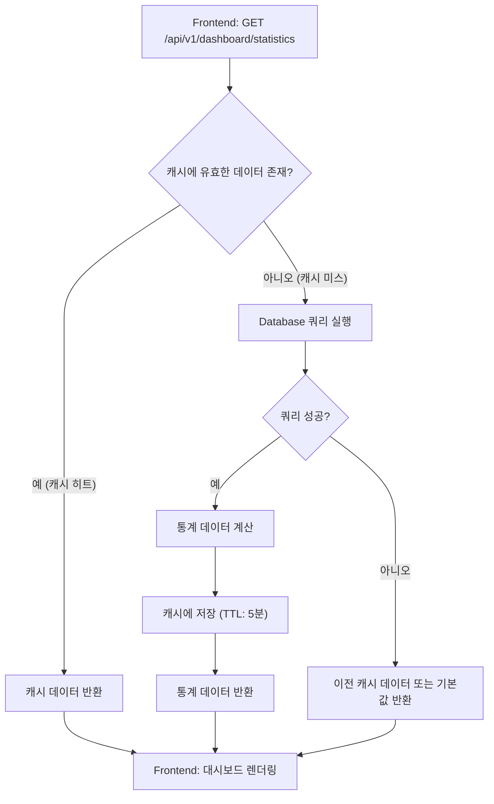
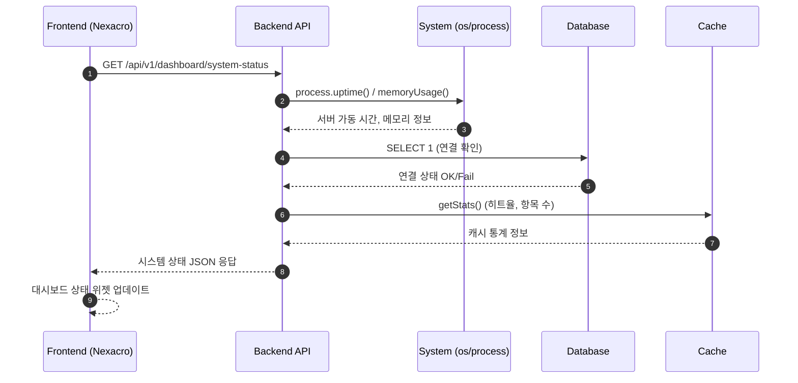
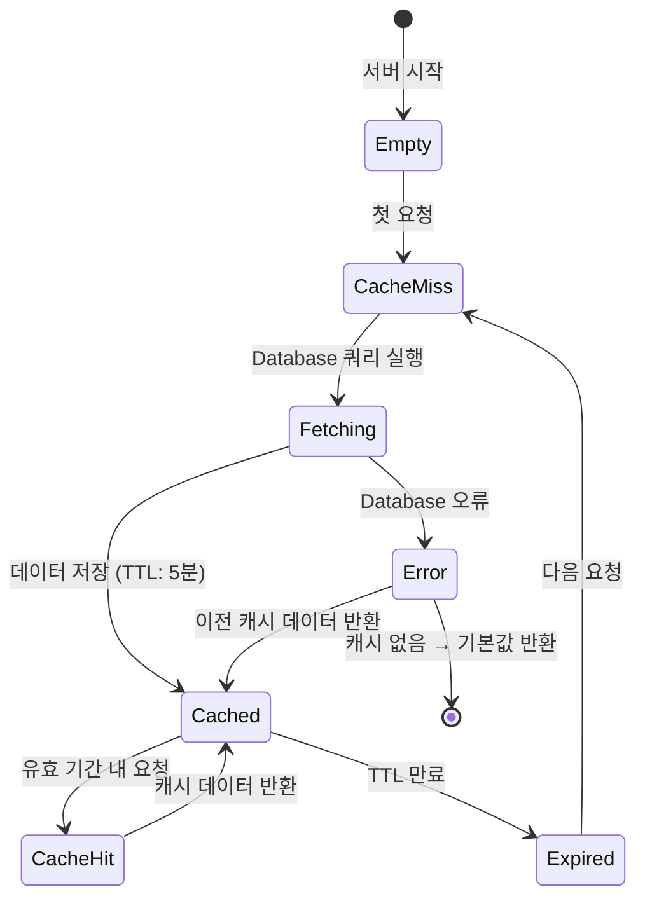

# 📄 상세설계서 - Task 12.1 CM0100 Backend API 구현

**Template Version:** 1.3.0 — **Last Updated:** 2025-10-05

---

## 0. 문서 메타데이터

* **문서명**: `Task-12-1.CM0100-Backend-API-구현(상세설계).md`
* **버전**: 1.0
* **작성일**: 2025-10-05
* **작성자**: Claude Code
* **참조 문서**:
  - `./docs/project/maru/00.foundation/01.project-charter/business-requirements.md`
  - `./docs/project/maru/00.foundation/01.project-charter/technical-requirements.md`
  - `./docs/project/maru/00.foundation/02.design-baseline/5. program-list.md`
  - `./docs/project/maru/00.foundation/02.design-baseline/4. ui-design.md`
* **위치**: `./docs/project/maru/10.design/12.detail-design/`
* **관련 이슈/티켓**: Task 12.1
* **상위 요구사항 문서/ID**: BRD - 시스템 메인 대시보드
* **요구사항 추적 담당자**: 시스템 아키텍트
* **추적성 관리 도구**: tasks.md (Markdown 기반 Task 추적)

---

## 1. 목적 및 범위

### 1.1 목적
CM0100 메인화면을 위한 Backend API를 구현하여 시스템 대시보드에 필요한 데이터를 제공한다.

### 1.2 범위

**포함**:
- 대시보드 통계 데이터 조회 API
- 시스템 상태 모니터링 API
- 최근 활동 이력 조회 API
- 마루/코드/룰 요약 정보 API
- Swagger API 문서화

**제외**:
- Frontend UI 구현 (Task 12.2에서 처리)
- 실시간 알림 기능 (PoC 범위 외)
- 사용자 권한 관리 (PoC 단일 관리자 환경)

---

## 2. 요구사항 & 승인 기준 (Acceptance Criteria)

### 2.1. 요구사항

**요구사항 원본 링크**: `./docs/project/maru/00.foundation/01.project-charter/business-requirements.md`

#### 기능 요구사항

**[CM0100-REQ-001] 대시보드 통계 데이터 제공**
- 마루 현황 통계 (전체/CODE/RULE 개수, 상태별 분포)
- 코드 현황 통계 (카테고리 수, 코드값 수)
- 룰 현황 통계 (변수 수, 레코드 수)
- 캐시 상태 정보 (히트율, 저장 항목 수)

**[CM0100-REQ-002] 시스템 상태 모니터링**
- Backend 서버 상태 (가동 시간, 메모리 사용률)
- Database 연결 상태
- 캐시 서버 상태

**[CM0100-REQ-003] 최근 활동 이력 조회**
- 최근 생성된 마루 목록 (최대 10건)
- 최근 수정된 마루 목록 (최대 10건)
- 시간순 정렬

**[CM0100-REQ-004] 빠른 접근 링크 제공**
- 주요 화면 바로가기 정보
- 메뉴 통계 (화면별 접근 횟수, PoC 제외)

#### 비기능 요구사항

**[CM0100-NFR-001] 성능**
- 대시보드 데이터 조회 응답 시간 < 2초
- 캐시 활용으로 데이터베이스 부하 최소화

**[CM0100-NFR-002] 안정성**
- 외부 서비스 장애 시에도 기본 정보 제공
- Graceful degradation 적용

**[CM0100-NFR-003] 보안**
- API 접근 제어 (향후 인증 시스템 연동 준비)
- 민감 정보 노출 방지

#### 승인 기준

- [ ] 모든 대시보드 API가 정상 응답
- [ ] Swagger 문서화 완료
- [ ] 단위 테스트 통과율 ≥ 90%
- [ ] API 응답 시간 < 2초
- [ ] 에러 처리 및 로깅 완료

### 2.2. 요구사항-설계 추적 매트릭스

| 요구사항 ID | 요구사항 설명 | 설계 섹션/아티팩트 | 테스트 케이스 ID | 상태 | 비고 |
|-------------|---------------|--------------------|------------------|------|------|
| CM0100-REQ-001 | 대시보드 통계 데이터 제공 | §5 프로세스 흐름 / §8 API DS001-DS004 | TC-API-001~004 | 초안 | |
| CM0100-REQ-002 | 시스템 상태 모니터링 | §5 프로세스 흐름 / §8 API SM001-SM003 | TC-API-005~007 | 초안 | |
| CM0100-REQ-003 | 최근 활동 이력 조회 | §5 프로세스 흐름 / §8 API RA001-RA002 | TC-API-008~009 | 초안 | |
| CM0100-REQ-004 | 빠른 접근 링크 제공 | §8 API QL001 | TC-API-010 | 초안 | PoC에서 정적 데이터 |
| CM0100-NFR-001 | 성능 (< 2초) | §11 성능 및 확장성 | TC-PERF-001 | 초안 | 캐시 전략 적용 |
| CM0100-NFR-002 | 안정성 (Graceful degradation) | §9 오류/예외 처리 | TC-ERR-001 | 초안 | |
| CM0100-NFR-003 | 보안 (API 접근 제어) | §10 보안 고려 | TC-SEC-001 | 초안 | 향후 인증 연동 |

---

## 3. 용어/가정/제약

### 3.1 용어 정의

| 용어 | 정의 |
|------|------|
| **대시보드** | 시스템 전체 현황을 한눈에 볼 수 있는 메인 화면 |
| **통계 데이터** | 마루/코드/룰의 개수, 상태 분포 등 집계 정보 |
| **시스템 상태** | Backend 서버, Database, 캐시의 가동 상태 |
| **최근 활동** | 최근 생성/수정된 마루 이력 |
| **빠른 접근** | 주요 화면으로의 바로가기 링크 |

### 3.2 가정(Assumptions)

- PoC 환경으로 단일 관리자만 사용
- 데이터 볼륨이 크지 않아 캐시 전략으로 충분히 성능 확보 가능
- 실시간 모니터링보다는 주기적 새로고침 방식 채택
- 모든 API는 JSON 형식으로 응답

### 3.3 제약(Constraints)

- PoC 환경으로 인증/권한 관리 제외
- 실시간 알림 기능 미포함
- 통계 데이터는 캐시 기반으로 최대 5분 지연 허용
- Database는 Oracle (SQLite 개발 환경)

---

## 4. 시스템/모듈 개요

### 4.1 역할 및 책임

**CM0100 Backend API**는 메인 대시보드 화면에 필요한 다음 데이터를 제공한다:

1. **통계 수집 모듈**
   - 마루/코드/룰 집계 데이터 계산
   - 상태별/타입별 분포 분석
   - 캐시 히트율 및 성능 지표 수집

2. **시스템 모니터링 모듈**
   - Backend 서버 상태 점검 (가동 시간, 메모리)
   - Database 연결 상태 확인
   - 캐시 서버 상태 확인

3. **활동 이력 모듈**
   - 최근 생성/수정된 마루 조회
   - 시간순 정렬 및 제한(10건)

4. **빠른 접근 모듈**
   - 주요 화면 링크 정보 제공

### 4.2 외부 의존성

| 의존성 | 용도 | 버전/라이브러리 |
|--------|------|-----------------|
| **Express** | HTTP 서버 프레임워크 | 5.x |
| **Knex.js** | SQL 쿼리 빌더 | 3.x |
| **node-cache** | 인메모리 캐시 | 5.x |
| **os 모듈** | 시스템 정보 수집 | Node.js 내장 |
| **process 모듈** | 프로세스 정보 수집 | Node.js 내장 |

### 4.3 상호작용 개요

```
Frontend (Nexacro)
    ↓ HTTP GET /api/v1/dashboard/*
Backend API (Express)
    ↓ Query
Database (Oracle/SQLite)
    ↓ Result
Cache (node-cache) → 통계 데이터 캐싱
    ↑
Backend API → JSON 응답
    ↑
Frontend (대시보드 렌더링)
```

---

## 5. 프로세스 흐름

### 5.1 프로세스 설명

#### 5.1.1 대시보드 데이터 조회 프로세스 [CM0100-REQ-001]

1. **요청 수신**: Frontend에서 `/api/v1/dashboard/statistics` 호출
2. **캐시 확인**: 캐시에 유효한 통계 데이터 존재 여부 확인
3. **캐시 히트**: 캐시 데이터 반환 (빠른 응답)
4. **캐시 미스**: Database 쿼리 실행 → 통계 계산 → 캐시 저장 → 응답
5. **에러 처리**: Database 오류 시 캐시된 이전 데이터 또는 기본값 반환

#### 5.1.2 시스템 상태 모니터링 프로세스 [CM0100-REQ-002]

1. **요청 수신**: Frontend에서 `/api/v1/dashboard/system-status` 호출
2. **서버 상태 수집**: process.uptime(), process.memoryUsage() 조회
3. **Database 상태 확인**: 간단한 SELECT 1 쿼리 실행
4. **캐시 상태 확인**: Cache 통계 조회 (히트율, 항목 수)
5. **응답 구성**: 모든 상태 정보를 JSON으로 반환

#### 5.1.3 최근 활동 이력 조회 프로세스 [CM0100-REQ-003]

1. **요청 수신**: Frontend에서 `/api/v1/dashboard/recent-activities` 호출
2. **이력 쿼리**: TB_MR_HEAD에서 START_DATE 기준 최근 10건 조회
3. **데이터 변환**: 생성/수정 구분, 시간 포맷팅
4. **응답 반환**: JSON 배열 형태로 응답

### 5.2. 프로세스 설계 개념도 (Mermaid)

#### Flowchart – 대시보드 통계 조회 흐름



#### Sequence – 시스템 상태 모니터링 상호작용



#### State – 캐시 상태 전이



---

## 6. UI 레이아웃 설계 (Text Art + SVG)

> **주의**: 이 Task는 Backend API 구현이므로 UI 레이아웃은 참고용으로만 제공합니다.
> 실제 UI 구현은 **Task 12.2 (CM0100 Frontend UI 구현)**에서 수행됩니다.

### 6.1. UI 설계 (참고용)

```
┌─────────────────────────────────────────────────────────┐
│               MARU 시스템 대시보드                       │
├─────────────────────────────────────────────────────────┤
│ [시스템 상태]                                            │
│ ┌─────────────┬─────────────┬─────────────┐             │
│ │ 서버 상태   │ DB 연결     │ 캐시 상태   │             │
│ │ ✅ 정상     │ ✅ 정상     │ ✅ 정상     │             │
│ │ 가동: 12h   │ 응답: 5ms   │ 히트: 92%   │             │
│ └─────────────┴─────────────┴─────────────┘             │
├─────────────────────────────────────────────────────────┤
│ [마루 현황]                                              │
│ ┌─────────────┬─────────────┬─────────────┐             │
│ │ 전체 마루   │ CODE 타입   │ RULE 타입   │             │
│ │    120      │     85      │     35      │             │
│ └─────────────┴─────────────┴─────────────┘             │
│ 상태별: CREATED(15) INUSE(95) DEPRECATED(10)             │
├─────────────────────────────────────────────────────────┤
│ [코드/룰 통계]                                           │
│ 코드 카테고리: 42  |  코드값: 1,250                      │
│ 룰 변수: 68        |  룰 레코드: 210                     │
├─────────────────────────────────────────────────────────┤
│ [최근 활동]                                              │
│ • 2025-10-05 14:30 - DEPT_015 마루 생성                 │
│ • 2025-10-05 13:15 - RULE_008 마루 상태 변경 (INUSE)    │
│ • 2025-10-05 11:20 - CODE_042 마루 수정                 │
│ ...                                                      │
├─────────────────────────────────────────────────────────┤
│ [빠른 접근]                                              │
│ [마루관리] [코드관리] [룰관리] [이력조회]                │
└─────────────────────────────────────────────────────────┘
```

### 6.2. UI 설계(SVG) - Backend API Task이므로 생략

> Backend API Task이므로 SVG 파일 생성은 **Task 12.2 (Frontend UI 구현)**에서 수행합니다.

### 6.3. 반응형/접근성/상호작용 가이드

**Backend API 관점**:
- API 응답은 디바이스 무관하게 동일한 JSON 포맷 제공
- Frontend에서 디바이스별 레이아웃 조정 수행
- API 응답 시간 최적화로 모바일 환경 지원

---

## 7. 데이터/메시지 구조 (개념 수준)

### 7.1. 입력 데이터 구조

#### API: GET /api/v1/dashboard/statistics
- **입력**: 없음 (Query Parameter 없음)

#### API: GET /api/v1/dashboard/system-status
- **입력**: 없음

#### API: GET /api/v1/dashboard/recent-activities
- **Query Parameters**:
  - `limit`: 조회 건수 (기본값: 10, 최대: 50)
  - `type`: 활동 타입 필터 (기본값: all, 옵션: created, updated)

#### API: GET /api/v1/dashboard/quick-links
- **입력**: 없음

### 7.2. 출력 데이터 구조

#### API: GET /api/v1/dashboard/statistics

```json
{
  "success": true,
  "data": {
    "maru": {
      "total": 120,
      "byType": {
        "CODE": 85,
        "RULE": 35
      },
      "byStatus": {
        "CREATED": 15,
        "INUSE": 95,
        "DEPRECATED": 10
      }
    },
    "code": {
      "categories": 42,
      "codeValues": 1250
    },
    "rule": {
      "variables": 68,
      "records": 210
    },
    "cache": {
      "hitRate": 0.92,
      "totalKeys": 45,
      "memoryUsageMB": 12.5
    }
  },
  "cachedAt": "2025-10-05T14:30:00Z",
  "timestamp": "2025-10-05T14:35:00Z"
}
```

#### API: GET /api/v1/dashboard/system-status

```json
{
  "success": true,
  "data": {
    "server": {
      "status": "healthy",
      "uptime": 43200,
      "uptimeFormatted": "12시간 0분",
      "memory": {
        "totalMB": 512,
        "usedMB": 145,
        "usagePercent": 28.3
      },
      "nodeVersion": "20.11.0"
    },
    "database": {
      "status": "connected",
      "responseTimeMs": 5,
      "type": "SQLite",
      "version": "3.43.0"
    },
    "cache": {
      "status": "active",
      "hitRate": 0.92,
      "keys": 45,
      "memoryMB": 12.5
    }
  },
  "timestamp": "2025-10-05T14:35:00Z"
}
```

#### API: GET /api/v1/dashboard/recent-activities

```json
{
  "success": true,
  "data": [
    {
      "maruId": "DEPT_015",
      "maruName": "신규 부서 코드",
      "activityType": "created",
      "timestamp": "2025-10-05T14:30:00Z",
      "user": "admin",
      "description": "DEPT_015 마루 생성"
    },
    {
      "maruId": "RULE_008",
      "maruName": "급여 계산 룰",
      "activityType": "statusChanged",
      "timestamp": "2025-10-05T13:15:00Z",
      "user": "admin",
      "description": "RULE_008 마루 상태 변경 (CREATED → INUSE)"
    }
  ],
  "total": 10,
  "timestamp": "2025-10-05T14:35:00Z"
}
```

#### API: GET /api/v1/dashboard/quick-links

```json
{
  "success": true,
  "data": [
    {
      "id": "MR0100",
      "name": "마루 헤더 관리",
      "path": "/maru/header",
      "icon": "database"
    },
    {
      "id": "CD0100",
      "name": "코드 카테고리 관리",
      "path": "/code/category",
      "icon": "tag"
    },
    {
      "id": "RL0100",
      "name": "룰 변수 관리",
      "path": "/rule/variable",
      "icon": "settings"
    },
    {
      "id": "MR0300",
      "name": "마루 이력 조회",
      "path": "/maru/history",
      "icon": "history"
    }
  ],
  "timestamp": "2025-10-05T14:35:00Z"
}
```

### 7.3. 시스템간 I/F 데이터 구조

**Database 쿼리 결과**:
- 집계 쿼리 결과를 JSON 응답으로 변환
- 선분 이력 모델 고려 (END_DATE = '9999-12-31'인 최신 데이터만 조회)

**캐시 데이터**:
- 통계 데이터는 5분간 캐시 (TTL: 300초)
- 캐시 키: `dashboard:statistics`, `dashboard:recent-activities`

---

## 8. 인터페이스 계약(Contract)

### 8.1. API DS001: 대시보드 통계 조회 [CM0100-REQ-001]

**엔드포인트**: `GET /api/v1/dashboard/statistics`

**경로 파라미터**: 없음

**쿼리 파라미터**: 없음

**요청 헤더**:
```
Accept: application/json
```

**성공 응답**:
- **상태 코드**: 200 OK
- **응답 본문**: §7.2 참조
- **응답 헤더**:
  ```
  Content-Type: application/json
  Cache-Control: max-age=300
  ```

**오류 응답**:
- **500 Internal Server Error**: Database 쿼리 오류
  ```json
  {
    "success": false,
    "error": {
      "code": "DB_QUERY_ERROR",
      "message": "통계 데이터 조회 중 오류가 발생했습니다.",
      "details": "Connection timeout"
    },
    "timestamp": "2025-10-05T14:35:00Z"
  }
  ```

**검증 케이스**: TC-API-001

**Swagger 주소**: `http://localhost:3000/api-docs#/Dashboard/getDashboardStatistics`

---

### 8.2. API SM001: 시스템 상태 모니터링 [CM0100-REQ-002]

**엔드포인트**: `GET /api/v1/dashboard/system-status`

**경로 파라미터**: 없음

**쿼리 파라미터**: 없음

**요청 헤더**:
```
Accept: application/json
```

**성공 응답**:
- **상태 코드**: 200 OK
- **응답 본문**: §7.2 참조

**오류 응답**:
- **503 Service Unavailable**: Database 연결 실패
  ```json
  {
    "success": false,
    "data": {
      "server": { "status": "healthy", ... },
      "database": { "status": "disconnected", "error": "Connection refused" },
      "cache": { "status": "active", ... }
    },
    "timestamp": "2025-10-05T14:35:00Z"
  }
  ```
  - **주의**: 부분 장애 시에도 200 OK 반환, `status` 필드로 개별 상태 확인

**검증 케이스**: TC-API-005

**Swagger 주소**: `http://localhost:3000/api-docs#/Dashboard/getSystemStatus`

---

### 8.3. API RA001: 최근 활동 이력 조회 [CM0100-REQ-003]

**엔드포인트**: `GET /api/v1/dashboard/recent-activities`

**경로 파라미터**: 없음

**쿼리 파라미터**:
- `limit` (선택, 기본값: 10): 조회 건수 (1~50)
- `type` (선택, 기본값: all): 활동 타입 (all, created, updated, statusChanged)

**요청 예시**:
```
GET /api/v1/dashboard/recent-activities?limit=20&type=created
```

**성공 응답**:
- **상태 코드**: 200 OK
- **응답 본문**: §7.2 참조

**오류 응답**:
- **400 Bad Request**: 잘못된 파라미터
  ```json
  {
    "success": false,
    "error": {
      "code": "INVALID_PARAMETER",
      "message": "limit 값은 1~50 사이여야 합니다.",
      "field": "limit",
      "value": 100
    }
  }
  ```

**검증 케이스**: TC-API-008

**Swagger 주소**: `http://localhost:3000/api-docs#/Dashboard/getRecentActivities`

---

### 8.4. API QL001: 빠른 접근 링크 조회 [CM0100-REQ-004]

**엔드포인트**: `GET /api/v1/dashboard/quick-links`

**경로 파라미터**: 없음

**쿼리 파라미터**: 없음

**성공 응답**:
- **상태 코드**: 200 OK
- **응답 본문**: §7.2 참조

**오류 응답**: 없음 (항상 정적 데이터 반환)

**검증 케이스**: TC-API-010

**Swagger 주소**: `http://localhost:3000/api-docs#/Dashboard/getQuickLinks`

---

## 9. 오류/예외/경계조건

### 9.1. 예상 오류 상황 및 처리 방안

| 오류 상황 | 원인 | 처리 방안 | HTTP 상태 |
|-----------|------|-----------|-----------|
| **Database 연결 실패** | 네트워크 오류, DB 서버 다운 | 이전 캐시 데이터 반환, 없으면 기본값 | 200 OK (Graceful degradation) |
| **캐시 서버 오류** | node-cache 내부 오류 | 직접 Database 쿼리 실행 | 200 OK (성능 저하) |
| **쿼리 타임아웃** | 대용량 데이터, 느린 쿼리 | 5초 타임아웃, 초과 시 캐시 반환 | 200 OK 또는 500 |
| **잘못된 파라미터** | limit 범위 초과 | 에러 메시지 반환, 유효 범위 안내 | 400 Bad Request |
| **메모리 부족** | 통계 계산 중 메모리 초과 | 간소화된 통계 반환, 로그 기록 | 200 OK (부분 데이터) |

### 9.2. 복구 전략 및 사용자 메시지

**Graceful Degradation 전략**:
1. **1차**: 캐시 데이터 반환 (최대 5분 오래된 데이터)
2. **2차**: 이전 성공 응답 반환 (최대 1시간)
3. **3차**: 기본값 반환 (각 통계 0, 상태 "unavailable")

**사용자 메시지**:
- **정상**: 메시지 없음
- **캐시 반환**: `"데이터가 최대 5분 이전 정보일 수 있습니다."`
- **부분 장애**: `"일부 정보를 불러올 수 없습니다. (Database 연결 오류)"`
- **전체 장애**: `"시스템 상태를 확인할 수 없습니다. 잠시 후 다시 시도해주세요."`

**로그 기록**:
- 모든 오류는 ERROR 레벨로 로그 기록
- 복구 전략 사용 시 WARN 레벨로 기록
- 로그 포맷: `[DASHBOARD] ${errorCode}: ${message} - ${details}`

---

## 10. 보안/품질 고려

### 10.1. 보안 고려사항

**인증/인가** (PoC 제외, 향후 적용):
- API 엔드포인트에 인증 미들웨어 추가 준비
- JWT 토큰 기반 인증 구조 설계

**입력 검증**:
- Query Parameter 타입 및 범위 검증
- SQL Injection 방지 (Knex.js parameterized query 사용)

**민감 정보 보호**:
- 시스템 상태 API에서 내부 IP, 비밀번호 등 노출 금지
- 에러 메시지에서 Stack Trace 노출 금지 (프로덕션)

**API Rate Limiting** (향후):
- 대시보드 API는 사용자당 분당 60회 제한 (계획)

### 10.2. 품질 고려사항

**의존성 관리**:
- `npm audit`로 취약점 정기 점검
- 주요 라이브러리 버전 고정 (package-lock.json)

**로깅/감사**:
- 모든 API 호출 로그 기록 (요청 시간, 응답 시간, 사용자)
- 에러 발생 시 상세 로그 (Stack Trace, 입력값)

**개인정보/규제 준수**:
- PoC 환경으로 개인정보 미포함
- 향후 GDPR, 개인정보보호법 준수 설계

**i18n/l10n**:
- 에러 메시지 한글 기본, 향후 다국어 지원 구조 준비
- 날짜/시간은 ISO 8601 포맷 사용

---

## 11. 성능 및 확장성(개념)

### 11.1. 목표/지표

| 지표 | 목표 | 측정 방법 |
|------|------|-----------|
| **API 응답 시간** | 평균 < 500ms, 최대 < 2초 | API 테스트 자동화 |
| **캐시 히트율** | ≥ 90% | node-cache stats |
| **동시 사용자** | 최대 10명 (PoC) | 성능 테스트 |
| **메모리 사용량** | 캐시 < 50MB | process.memoryUsage() |

### 11.2. 병목 예상 지점과 완화 전략

**병목 예상**:
1. **통계 계산 쿼리**: 집계 쿼리가 느림
   - **완화**: 5분 캐시, 인덱스 활용

2. **동시 요청**: 여러 사용자가 동시에 대시보드 접근
   - **완화**: 캐시로 Database 부하 분산

3. **Database 연결 풀**: 연결 부족
   - **완화**: Knex.js connection pool 설정 (min: 2, max: 10)

### 11.3. 부하/장애 시나리오 대응

**시나리오 1: Database 응답 지연**
- 쿼리 타임아웃 5초 설정
- 타임아웃 시 캐시 데이터 반환
- 로그 기록 및 알림 (향후)

**시나리오 2: 캐시 메모리 초과**
- LRU 방식으로 오래된 항목 자동 삭제
- 최대 100개 키 제한

**시나리오 3: 높은 동시 요청**
- API Rate Limiting 적용 (향후)
- 캐시로 부하 분산

---

## 12. 테스트 전략 (TDD 계획)

### 12.1. 단위 테스트 계획

**테스트 프레임워크**: Jest

**테스트 커버리지 목표**: ≥ 90%

**테스트 케이스**:

#### TC-API-001: 통계 데이터 조회 성공 [CM0100-REQ-001]
- **Given**: Database에 마루 데이터 존재
- **When**: GET /api/v1/dashboard/statistics 호출
- **Then**: 200 OK, 마루/코드/룰 통계 반환

#### TC-API-002: 통계 데이터 캐시 히트
- **Given**: 이전 요청으로 캐시 데이터 존재
- **When**: GET /api/v1/dashboard/statistics 호출
- **Then**: 200 OK, 캐시 데이터 반환, 응답 시간 < 100ms

#### TC-API-003: 통계 데이터 캐시 미스
- **Given**: 캐시 비어있음
- **When**: GET /api/v1/dashboard/statistics 호출
- **Then**: 200 OK, Database 쿼리 실행, 캐시 저장

#### TC-API-004: Database 오류 시 Graceful Degradation
- **Given**: Database 연결 실패
- **When**: GET /api/v1/dashboard/statistics 호출
- **Then**: 200 OK, 이전 캐시 데이터 또는 기본값 반환

#### TC-API-005: 시스템 상태 조회 성공 [CM0100-REQ-002]
- **Given**: 서버 정상 가동
- **When**: GET /api/v1/dashboard/system-status 호출
- **Then**: 200 OK, 서버/DB/캐시 상태 정보 반환

#### TC-API-006: Database 연결 실패 시 상태 반환
- **Given**: Database 연결 끊김
- **When**: GET /api/v1/dashboard/system-status 호출
- **Then**: 200 OK, database.status = "disconnected"

#### TC-API-007: 캐시 통계 정보 반환
- **Given**: 캐시에 데이터 존재
- **When**: GET /api/v1/dashboard/system-status 호출
- **Then**: 200 OK, cache.hitRate, cache.keys 반환

#### TC-API-008: 최근 활동 이력 조회 성공 [CM0100-REQ-003]
- **Given**: TB_MR_HEAD에 최근 데이터 존재
- **When**: GET /api/v1/dashboard/recent-activities 호출
- **Then**: 200 OK, 최근 10건 활동 이력 반환

#### TC-API-009: 활동 이력 타입 필터링
- **Given**: 생성/수정 이력 존재
- **When**: GET /api/v1/dashboard/recent-activities?type=created 호출
- **Then**: 200 OK, 생성 활동만 반환

#### TC-API-010: 빠른 접근 링크 조회 [CM0100-REQ-004]
- **Given**: 정적 링크 데이터 존재
- **When**: GET /api/v1/dashboard/quick-links 호출
- **Then**: 200 OK, 4개 주요 화면 링크 반환

#### TC-ERR-001: 잘못된 limit 파라미터
- **Given**: limit = 100 (최대 50 초과)
- **When**: GET /api/v1/dashboard/recent-activities?limit=100 호출
- **Then**: 400 Bad Request, 에러 메시지 반환

#### TC-PERF-001: API 응답 시간 성능 [CM0100-NFR-001]
- **Given**: 정상 데이터 존재
- **When**: GET /api/v1/dashboard/statistics 호출
- **Then**: 응답 시간 < 2초

### 12.2. 통합 테스트 계획

**테스트 환경**: SQLite (개발), Oracle (스테이징)

**시나리오**:
1. **전체 대시보드 API 연속 호출**
   - 통계 → 시스템 상태 → 최근 활동 → 빠른 접근 순차 호출
   - 모든 API 정상 응답 확인

2. **캐시 일관성 검증**
   - 통계 API 호출 → 마루 생성 → 통계 API 재호출
   - 캐시 무효화 또는 최신 데이터 반환 확인

3. **부하 테스트**
   - 동시 10명 사용자 시뮬레이션
   - 모든 요청 정상 처리, 응답 시간 < 2초

### 12.3. TDD 실행 순서

1. **Red**: 테스트 작성 (실패)
2. **Green**: 최소 구현으로 테스트 통과
3. **Refactor**: 코드 정리 및 최적화

**우선순위**:
1. 통계 조회 API (TC-API-001~004)
2. 시스템 상태 API (TC-API-005~007)
3. 최근 활동 API (TC-API-008~009)
4. 빠른 접근 API (TC-API-010)
5. 에러 처리 (TC-ERR-001)

---

## 13. UI 테스트케이스

> **주의**: 이 Task는 Backend API 구현이므로 UI 테스트케이스는 **Task 12.2 (Frontend UI 구현)**에서 작성됩니다.
> 아래는 Backend API 검증을 위한 API 테스트케이스입니다.

### 13-1. API 테스트케이스

| 테스트 ID | API | 테스트 시나리오 | 실행 단계 | 예상 결과 | 검증 기준 | 요구사항 | 우선순위 |
|-----------|-----|-----------------|-----------|-----------|-----------|----------|----------|
| TC-API-001 | GET /dashboard/statistics | 통계 조회 성공 | 1. API 호출<br>2. 응답 확인 | 200 OK, 통계 데이터 | JSON 스키마 검증 | [CM0100-REQ-001] | High |
| TC-API-002 | GET /dashboard/statistics | 캐시 히트 | 1. 첫 호출<br>2. 5분 내 재호출 | 200 OK, 캐시 데이터 | 응답 시간 < 100ms | [CM0100-NFR-001] | High |
| TC-API-005 | GET /dashboard/system-status | 시스템 상태 조회 | 1. API 호출 | 200 OK, 상태 정보 | server/db/cache 포함 | [CM0100-REQ-002] | High |
| TC-API-008 | GET /dashboard/recent-activities | 최근 활동 조회 | 1. API 호출 | 200 OK, 10건 이력 | 시간순 정렬 확인 | [CM0100-REQ-003] | Medium |
| TC-API-010 | GET /dashboard/quick-links | 빠른 접근 링크 | 1. API 호출 | 200 OK, 4개 링크 | 링크 ID/path 확인 | [CM0100-REQ-004] | Low |

### 13-2. Postman/Swagger 테스트 가이드

**Postman Collection 생성**:
```json
{
  "info": { "name": "MARU Dashboard API" },
  "item": [
    {
      "name": "통계 조회",
      "request": {
        "method": "GET",
        "url": "http://localhost:3000/api/v1/dashboard/statistics"
      }
    }
  ]
}
```

**Swagger UI 사용**:
1. `http://localhost:3000/api-docs` 접속
2. Dashboard 섹션 펼치기
3. "Try it out" 버튼 클릭
4. "Execute" 버튼으로 테스트

---

## 14. 구현 체크리스트

### 14.1. Backend 구현 항목

- [ ] **라우터 생성**: `backend/routes/dashboard.js`
- [ ] **컨트롤러 생성**: `backend/controllers/dashboard.controller.js`
- [ ] **서비스 생성**: `backend/services/dashboard.service.js`
- [ ] **캐시 유틸 생성**: `backend/utils/dashboardCache.js`
- [ ] **Swagger 문서**: `backend/swagger/dashboard.yaml`

### 14.2. API 구현 항목

- [ ] GET /api/v1/dashboard/statistics
- [ ] GET /api/v1/dashboard/system-status
- [ ] GET /api/v1/dashboard/recent-activities
- [ ] GET /api/v1/dashboard/quick-links

### 14.3. 테스트 구현 항목

- [ ] 단위 테스트: `backend/tests/dashboard.test.js`
- [ ] 통합 테스트: `backend/tests/integration/dashboard.integration.test.js`
- [ ] 성능 테스트: API 응답 시간 측정

### 14.4. 문서화 항목

- [ ] Swagger API 문서 완성
- [ ] README.md 업데이트 (대시보드 API 섹션)
- [ ] CHANGELOG.md 업데이트

### 14.5. 품질 검증 항목

- [ ] ESLint 통과
- [ ] 테스트 커버리지 ≥ 90%
- [ ] API 응답 시간 < 2초
- [ ] 캐시 히트율 ≥ 90%

---

## 15. 변경 이력

| 버전 | 날짜 | 작성자 | 변경 내용 |
|------|------|--------|-----------|
| 1.0 | 2025-10-05 | Claude Code | 초안 작성 |

---

**승인**

| 역할 | 이름 | 서명 | 날짜 |
|------|------|------|------|
| 시스템 아키텍트 | | | |
| Backend 개발 리더 | | | |
| QA 리더 | | | |
