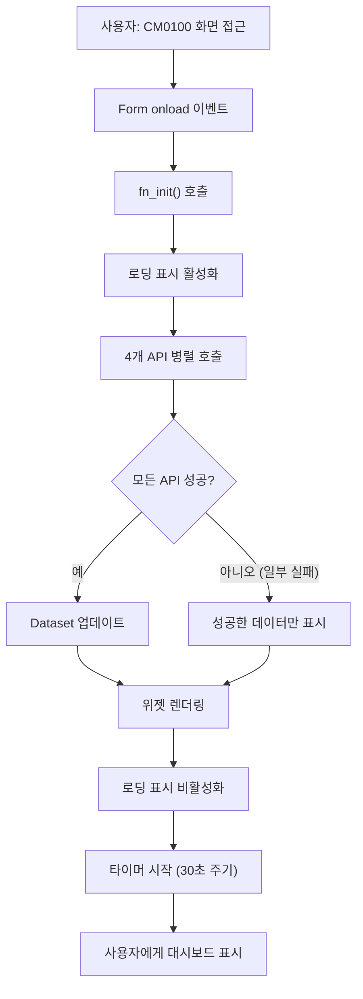
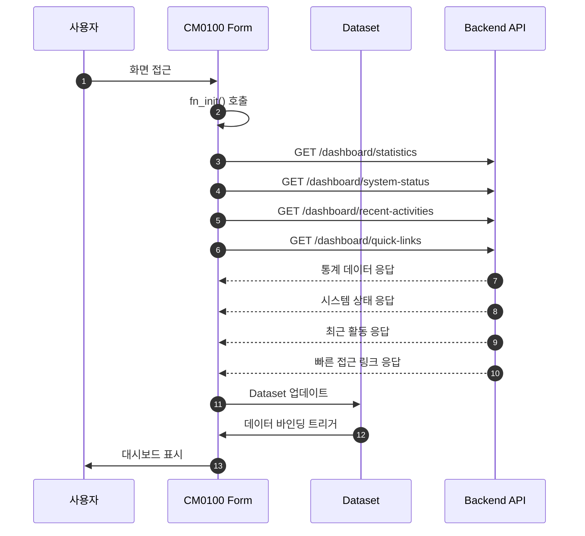
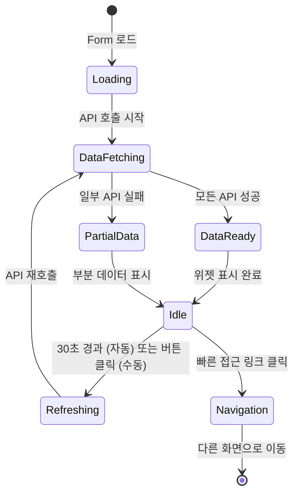
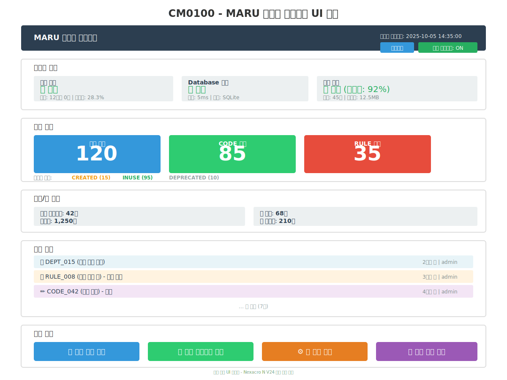

# 📄 상세설계서 - Task 12.2 CM0100 Frontend UI 구현

**Template Version:** 1.3.0 — **Last Updated:** 2025-10-05

---

## 0. 문서 메타데이터

* **문서명**: `Task-12-2.CM0100-Frontend-UI-구현(상세설계).md`
* **버전**: 1.0
* **작성일**: 2025-10-05
* **작성자**: Claude Code
* **참조 문서**:
  - `./docs/project/maru/00.foundation/01.project-charter/business-requirements.md`
  - `./docs/project/maru/10.design/12.detail-design/Task-12-1.CM0100-Backend-API-구현(상세설계).md`
  - `./docs/project/maru/00.foundation/02.design-baseline/4. ui-design.md`
  - `./docs/project/maru/00.foundation/02.design-baseline/5. program-list.md`
  - `./docs/common/06.guide/LLM_Nexacro_Development_Guide.md`
* **위치**: `./docs/project/maru/10.design/12.detail-design/`
* **관련 이슈/티켓**: Task 12.2
* **상위 요구사항 문서/ID**: BRD - 시스템 메인 대시보드, Task 12.1 Backend API
* **요구사항 추적 담당자**: Frontend 개발 리더
* **추적성 관리 도구**: tasks.md (Markdown 기반 Task 추적)

---

## 1. 목적 및 범위

### 1.1 목적
Nexacro N V24 기반으로 CM0100 메인화면 UI를 구현하여 사용자에게 시스템 대시보드를 제공한다.

### 1.2 범위

**포함**:
- Nexacro Form 생성 (frmCM0100.xfdl)
- 대시보드 위젯 UI 구현 (시스템 상태, 마루 현황, 통계, 최근 활동)
- Backend API 연동 (Task 12.1 참조)
- Dataset 정의 및 데이터 바인딩
- 자동 새로고침 기능
- 빠른 접근 링크 구현

**제외**:
- Backend API 구현 (Task 12.1에서 완료)
- 실시간 WebSocket 알림 (PoC 범위 외)
- 사용자 권한별 대시보드 커스터마이징 (PoC 단일 관리자)
- 차트 라이브러리 연동 (추후 검토)

---

## 2. 요구사항 & 승인 기준 (Acceptance Criteria)

### 2.1. 요구사항

**요구사항 원본 링크**:
- `./docs/project/maru/00.foundation/01.project-charter/business-requirements.md`
- `./docs/project/maru/10.design/12.detail-design/Task-12-1.CM0100-Backend-API-구현(상세설계).md`

#### 기능 요구사항

**[CM0100-UI-REQ-001] 시스템 상태 위젯 표시**
- Backend 서버 상태 (가동 시간, 메모리 사용률) 표시
- Database 연결 상태 표시
- 캐시 서버 상태 및 히트율 표시
- 상태별 시각적 표시 (✅ 정상, ⚠️ 경고, ❌ 오류)

**[CM0100-UI-REQ-002] 마루 현황 위젯 표시**
- 전체 마루 개수, CODE/RULE 타입별 개수
- 상태별 분포 (CREATED/INUSE/DEPRECATED) 표시
- 카드 형태의 시각적 레이아웃

**[CM0100-UI-REQ-003] 코드/룰 통계 위젯 표시**
- 코드 카테고리 수, 코드값 수
- 룰 변수 수, 룰 레코드 수
- 간결한 숫자 표시 (예: 1,250)

**[CM0100-UI-REQ-004] 최근 활동 위젯 표시**
- 최근 10건의 마루 생성/수정 이력
- 활동 타입 아이콘 표시
- 시간 정보 (예: "2시간 전", "어제")

**[CM0100-UI-REQ-005] 빠른 접근 링크 위젯**
- 주요 화면 4개 링크 버튼
- 아이콘 + 화면명 표시
- 클릭 시 해당 화면으로 이동

**[CM0100-UI-REQ-006] 자동 새로고침 기능**
- 30초마다 자동 새로고침
- 수동 새로고침 버튼 제공
- 새로고침 중 로딩 표시

#### 비기능 요구사항

**[CM0100-UI-NFR-001] 성능**
- 대시보드 초기 로딩 시간 < 3초
- 자동 새로고침 시 < 2초
- 부드러운 UI 전환 (애니메이션 불필요)

**[CM0100-UI-NFR-002] 사용성**
- 한눈에 시스템 상태 파악 가능
- 직관적인 레이아웃 구성
- 적절한 색상 및 간격 사용

**[CM0100-UI-NFR-003] 접근성**
- 명확한 포커스 표시
- 키보드 네비게이션 지원 (Tab, Enter)
- 색상에만 의존하지 않는 정보 전달

#### 승인 기준

- [ ] 모든 위젯이 정상 표시
- [ ] Backend API 연동 정상 동작
- [ ] 자동 새로고침 정상 동작
- [ ] 빠른 접근 링크 정상 동작
- [ ] E2E 테스트 통과율 ≥ 90%
- [ ] UI 초기 로딩 < 3초

### 2.2. 요구사항-설계 추적 매트릭스

| 요구사항 ID | 요구사항 설명 | 설계 섹션/아티팩트 | 테스트 케이스 ID | 상태 | 비고 |
|-------------|---------------|--------------------|------------------|------|------|
| CM0100-UI-REQ-001 | 시스템 상태 위젯 | §6 UI 설계 / §7 Dataset | TC-UI-001 | 초안 | |
| CM0100-UI-REQ-002 | 마루 현황 위젯 | §6 UI 설계 / §7 Dataset | TC-UI-002 | 초안 | |
| CM0100-UI-REQ-003 | 코드/룰 통계 위젯 | §6 UI 설계 / §7 Dataset | TC-UI-003 | 초안 | |
| CM0100-UI-REQ-004 | 최근 활동 위젯 | §6 UI 설계 / §7 Dataset | TC-UI-004 | 초안 | |
| CM0100-UI-REQ-005 | 빠른 접근 링크 | §6 UI 설계 / §5 프로세스 | TC-UI-005 | 초안 | |
| CM0100-UI-REQ-006 | 자동 새로고침 | §5 프로세스 흐름 | TC-UI-006 | 초안 | |
| CM0100-UI-NFR-001 | 성능 (< 3초) | §11 성능 최적화 | TC-PERF-001 | 초안 | |
| CM0100-UI-NFR-002 | 사용성 | §6 UI 설계 | TC-UX-001 | 초안 | 수동 검증 |
| CM0100-UI-NFR-003 | 접근성 | §6.3 접근성 가이드 | TC-A11Y-001 | 초안 | |

---

## 3. 용어/가정/제약

### 3.1 용어 정의

| 용어 | 정의 |
|------|------|
| **위젯** | 대시보드 내 독립적인 정보 표시 영역 (카드 형태) |
| **Dataset** | Nexacro에서 데이터를 저장하고 관리하는 객체 |
| **Transaction** | Backend API와의 HTTP 통신 |
| **자동 새로고침** | 일정 주기로 데이터를 자동으로 갱신하는 기능 |
| **빠른 접근** | 주요 화면으로 바로 이동할 수 있는 링크 버튼 |

### 3.2 가정(Assumptions)

- Task 12.1 Backend API가 정상 동작함
- Nexacro N V24 개발 환경이 구성되어 있음
- Backend 서버가 `http://localhost:3000`에서 실행됨
- 모든 API는 JSON 형식으로 응답함
- PoC 환경으로 단일 관리자만 사용 (인증 불필요)

### 3.3 제약(Constraints)

- Nexacro N V24 플랫폼 기능 제약
- PoC 환경으로 복잡한 차트 라이브러리 미사용
- 실시간 WebSocket 알림 미지원
- 브라우저 호환성: Chrome, Edge 최신 버전 (IE 미지원)

---

## 4. 시스템/모듈 개요

### 4.1 역할 및 책임

**CM0100 Frontend UI (frmCM0100.xfdl)**는 다음 역할을 수행한다:

1. **대시보드 데이터 표시**
   - Backend API로부터 데이터 조회
   - 위젯별로 데이터 시각화
   - 데이터 갱신 주기 관리

2. **사용자 상호작용 처리**
   - 새로고침 버튼 클릭
   - 빠른 접근 링크 클릭
   - 최근 활동 항목 클릭 (상세 이동)

3. **상태 관리**
   - 로딩 상태 표시
   - 에러 처리 및 사용자 알림
   - 자동 새로고침 타이머 관리

### 4.2 외부 의존성

| 의존성 | 용도 | 버전/경로 |
|--------|------|-----------|
| **Backend API** | 대시보드 데이터 조회 | http://localhost:3000/api/v1/dashboard/* |
| **FrameBase** | 공통 프레임 레이아웃 | Base/Frame/FrameBase.xfdl |
| **공통 함수** | 날짜 포맷팅, 숫자 포맷팅 | Base/Library/gfn_common.js |
| **타이머 컴포넌트** | 자동 새로고침 | Nexacro 내장 Timer |

### 4.3 상호작용 개요

```
사용자
  ↓ Form 로드
CM0100 Form (frmCM0100.xfdl)
  ↓ fn_init() 호출
Backend API 호출 (4개 API 병렬 호출)
  ↓ 응답 수신
Dataset 업데이트
  ↓ 데이터 바인딩
위젯 표시 (시각적 렌더링)
  ↓ 30초 후
자동 새로고침 (fn_refresh() 호출)
  ↓ 반복
```

---

## 5. 프로세스 흐름

### 5.1 프로세스 설명

#### 5.1.1 대시보드 초기 로딩 프로세스 [CM0100-UI-REQ-001~005]

1. **Form 로드**: `onload` 이벤트 발생
2. **초기화**: `fn_init()` 함수 호출
3. **API 호출**: 4개 API 병렬 호출
   - `/api/v1/dashboard/statistics` → `ds_statistics`
   - `/api/v1/dashboard/system-status` → `ds_systemStatus`
   - `/api/v1/dashboard/recent-activities` → `ds_recentActivities`
   - `/api/v1/dashboard/quick-links` → `ds_quickLinks`
4. **데이터 바인딩**: Dataset과 UI 컴포넌트 바인딩
5. **타이머 시작**: 30초 자동 새로고침 타이머 시작

#### 5.1.2 자동 새로고침 프로세스 [CM0100-UI-REQ-006]

1. **타이머 이벤트**: 30초마다 `Timer_ontime` 이벤트 발생
2. **새로고침 함수 호출**: `fn_refresh()` 함수 호출
3. **로딩 표시**: 새로고침 중임을 사용자에게 표시
4. **API 재호출**: 4개 API 병렬 재호출
5. **Dataset 업데이트**: 새로운 데이터로 갱신
6. **로딩 해제**: 새로고침 완료 표시

#### 5.1.3 빠른 접근 프로세스 [CM0100-UI-REQ-005]

1. **링크 클릭**: 빠른 접근 버튼 클릭 이벤트
2. **화면 ID 추출**: 클릭한 버튼의 `data-screen-id` 추출
3. **화면 이동**: `gfn_openMenu(screenId)` 공통 함수 호출
4. **새 탭 생성**: FrameBase에서 새 탭으로 화면 열기

### 5.2. 프로세스 설계 개념도 (Mermaid)

#### Flowchart – 대시보드 초기 로딩 흐름



#### Sequence – API 호출 및 데이터 바인딩



#### State – 화면 상태 전이



---

## 6. UI 레이아웃 설계 (Text Art + SVG)

### 6.1. UI 설계

```
┌─────────────────────────────────────────────────────────────────────┐
│                    MARU 시스템 대시보드                              │
│  마지막 업데이트: 2025-10-05 14:35:00  [새로고침] [자동:ON]          │
├─────────────────────────────────────────────────────────────────────┤
│ ┌──── 시스템 상태 ────────────────────────────────────────────────┐ │
│ │  서버 상태        │  Database 연결   │  캐시 상태              │ │
│ │  ✅ 정상          │  ✅ 정상        │  ✅ 정상 (히트: 92%)   │ │
│ │  가동: 12시간 0분 │  응답: 5ms      │  항목: 45개            │ │
│ │  메모리: 28.3%    │  타입: SQLite   │  메모리: 12.5MB        │ │
│ └──────────────────────────────────────────────────────────────────┘ │
├─────────────────────────────────────────────────────────────────────┤
│ ┌──── 마루 현황 ──────────────────────────────────────────────────┐ │
│ │ ┌─ 전체 ──┐  ┌─ CODE 타입 ──┐  ┌─ RULE 타입 ──┐          │ │
│ │ │   120   │  │      85      │  │      35      │          │ │
│ │ └─────────┘  └──────────────┘  └──────────────┘          │ │
│ │ 상태별: CREATED(15)  INUSE(95)  DEPRECATED(10)              │ │
│ └──────────────────────────────────────────────────────────────────┘ │
├─────────────────────────────────────────────────────────────────────┤
│ ┌──── 코드/룰 통계 ───────────────────────────────────────────────┐ │
│ │  코드 카테고리: 42개          코드값: 1,250개                  │ │
│ │  룰 변수: 68개                룰 레코드: 210개                 │ │
│ └──────────────────────────────────────────────────────────────────┘ │
├─────────────────────────────────────────────────────────────────────┤
│ ┌──── 최근 활동 ──────────────────────────────────────────────────┐ │
│ │  🆕 DEPT_015 (신규 부서 코드)           2시간 전 | admin       │ │
│ │  🔄 RULE_008 (급여 계산 룰) - 상태 변경  3시간 전 | admin       │ │
│ │  ✏️ CODE_042 (직급 코드) - 수정         4시간 전 | admin       │ │
│ │  ...                                                            │ │
│ └──────────────────────────────────────────────────────────────────┘ │
├─────────────────────────────────────────────────────────────────────┤
│ ┌──── 빠른 접근 ──────────────────────────────────────────────────┐ │
│ │  [📊 마루관리]  [🏷️ 코드관리]  [⚙️ 룰관리]  [📜 이력조회]   │ │
│ └──────────────────────────────────────────────────────────────────┘ │
└─────────────────────────────────────────────────────────────────────┘
```

### 6.2. UI 설계(SVG) **[필수 생성]**



> **SVG 파일 생성 규칙** (별도 파일로 저장됨):
> - 파일명: `Task-12-2.CM0100-Frontend-UI-구현_UI설계.svg`
> - 위치: `./docs/project/maru/10.design/12.detail-design/`
> - 내용: 대시보드 위젯 레이아웃 개념도

### 6.3. 반응형/접근성/상호작용 가이드

**반응형**:
- **최소 해상도**: 1024x768 (가로 스크롤 없이 전체 표시)
- **권장 해상도**: 1920x1080 (모든 위젯 최적 표시)
- **고해상도**: 위젯 간격 및 폰트 크기 비율 유지

**접근성**:
- **포커스 순서**: 새로고침 버튼 → 시스템 상태 → 마루 현황 → 통계 → 최근 활동 → 빠른 접근
- **키보드 네비게이션**: Tab (다음), Shift+Tab (이전), Enter (활성화)
- **색상 대비**: 상태 아이콘은 색상과 함께 텍스트 표시 (✅ 정상, ⚠️ 경고, ❌ 오류)
- **스크린리더**: 모든 위젯에 `aria-label` 속성 부여

**상호작용**:
- **새로고침 버튼**: 클릭 시 즉시 데이터 갱신, 로딩 스피너 표시
- **자동 새로고침 토글**: ON/OFF 전환 가능
- **최근 활동 항목**: 클릭 시 해당 마루 상세 화면으로 이동
- **빠른 접근 버튼**: 클릭 시 해당 화면 새 탭으로 열기

---

## 7. 데이터/메시지 구조 (개념 수준)

### 7.1. 입력 데이터 구조

**사용자 입력**:
- 새로고침 버튼 클릭
- 빠른 접근 링크 클릭
- 자동 새로고침 ON/OFF 토글

**Backend API 응답**: Task 12.1 참조
- `/api/v1/dashboard/statistics`
- `/api/v1/dashboard/system-status`
- `/api/v1/dashboard/recent-activities`
- `/api/v1/dashboard/quick-links`

### 7.2. 출력 데이터 구조 (Nexacro Dataset)

#### Dataset: ds_statistics

```javascript
{
  columns: [
    { id: "maru_total", type: "INT" },
    { id: "maru_code", type: "INT" },
    { id: "maru_rule", type: "INT" },
    { id: "status_created", type: "INT" },
    { id: "status_inuse", type: "INT" },
    { id: "status_deprecated", type: "INT" },
    { id: "code_categories", type: "INT" },
    { id: "code_values", type: "INT" },
    { id: "rule_variables", type: "INT" },
    { id: "rule_records", type: "INT" },
    { id: "cache_hit_rate", type: "FLOAT" },
    { id: "cache_keys", type: "INT" },
    { id: "cache_memory_mb", type: "FLOAT" },
    { id: "cached_at", type: "STRING" }
  ]
}
```

#### Dataset: ds_systemStatus

```javascript
{
  columns: [
    { id: "server_status", type: "STRING" },         // "healthy", "degraded", "down"
    { id: "server_uptime", type: "INT" },            // 초 단위
    { id: "server_uptime_formatted", type: "STRING" }, // "12시간 0분"
    { id: "server_memory_used_mb", type: "INT" },
    { id: "server_memory_total_mb", type: "INT" },
    { id: "server_memory_percent", type: "FLOAT" },
    { id: "db_status", type: "STRING" },             // "connected", "disconnected"
    { id: "db_response_ms", type: "INT" },
    { id: "db_type", type: "STRING" },
    { id: "cache_status", type: "STRING" },          // "active", "inactive"
    { id: "cache_hit_rate", type: "FLOAT" }
  ]
}
```

#### Dataset: ds_recentActivities

```javascript
{
  columns: [
    { id: "maru_id", type: "STRING" },
    { id: "maru_name", type: "STRING" },
    { id: "activity_type", type: "STRING" },    // "created", "updated", "statusChanged"
    { id: "timestamp", type: "STRING" },        // ISO 8601 format
    { id: "user", type: "STRING" },
    { id: "description", type: "STRING" },
    { id: "time_ago", type: "STRING" }          // "2시간 전" (클라이언트 계산)
  ]
}
```

#### Dataset: ds_quickLinks

```javascript
{
  columns: [
    { id: "screen_id", type: "STRING" },        // "MR0100", "CD0100", etc.
    { id: "screen_name", type: "STRING" },
    { id: "screen_path", type: "STRING" },
    { id: "icon", type: "STRING" }              // 아이콘 이름
  ]
}
```

### 7.3. 시스템간 I/F 데이터 구조

**API 응답 → Dataset 변환**:
- Backend JSON 응답을 Nexacro Dataset 형식으로 변환
- 중첩된 JSON 구조를 플랫한 컬럼으로 변환
- 날짜/시간 포맷팅 (ISO 8601 → 사용자 친화적 표현)
- 숫자 포맷팅 (1250 → "1,250")

**Transaction 설정**:
```javascript
// 통계 조회
this.tran_statistics.setURL("http://localhost:3000/api/v1/dashboard/statistics");
this.tran_statistics.setInDatasets("");
this.tran_statistics.setOutDatasets("ds_statistics=data");

// 시스템 상태 조회
this.tran_systemStatus.setURL("http://localhost:3000/api/v1/dashboard/system-status");
this.tran_systemStatus.setInDatasets("");
this.tran_systemStatus.setOutDatasets("ds_systemStatus=data");
```

---

## 8. 인터페이스 계약(Contract)

### 8.1. Form 이벤트 및 함수

#### 8.1.1. Form onload [CM0100-UI-REQ-001~005]

**이벤트**: `Form_onload(obj:nexacro.Form, e:nexacro.LoadEventInfo)`

**목적**: 화면 초기화 및 초기 데이터 로드

**실행 단계**:
1. `fn_init()` 호출
2. 로딩 표시 활성화
3. 4개 API 병렬 호출
4. Dataset 업데이트
5. 타이머 시작

**성공 조건**: 모든 위젯에 데이터 표시

**검증 케이스**: TC-UI-001

---

#### 8.1.2. fn_refresh() [CM0100-UI-REQ-006]

**함수 시그니처**: `fn_refresh()`

**목적**: 대시보드 데이터 새로고침

**실행 단계**:
1. 로딩 표시 활성화
2. 4개 API 재호출
3. Dataset 업데이트
4. 로딩 표시 비활성화

**성공 조건**: 최신 데이터로 위젯 갱신

**검증 케이스**: TC-UI-006

---

#### 8.1.3. fn_quickLink_onclick(screenId:String) [CM0100-UI-REQ-005]

**함수 시그니처**: `fn_quickLink_onclick(screenId:String)`

**매개변수**:
- `screenId`: 이동할 화면 ID (예: "MR0100")

**목적**: 빠른 접근 링크 클릭 처리

**실행 단계**:
1. `screenId` 유효성 확인
2. `gfn_openMenu(screenId)` 호출
3. 새 탭으로 화면 열기

**성공 조건**: 해당 화면이 새 탭으로 열림

**검증 케이스**: TC-UI-005

---

#### 8.1.4. Timer_ontime() [CM0100-UI-REQ-006]

**이벤트**: `Timer_ontime(obj:nexacro.Timer, e:nexacro.TimerEventInfo)`

**목적**: 자동 새로고침 타이머 이벤트 처리

**실행 단계**:
1. 자동 새로고침 플래그 확인
2. `fn_refresh()` 호출

**성공 조건**: 30초마다 자동 새로고침 실행

**검증 케이스**: TC-UI-006

---

### 8.2. Transaction 콜백

#### 8.2.1. fn_callbackStatistics(id, code, message)

**목적**: 통계 API 응답 처리

**파라미터**:
- `id`: Transaction ID
- `code`: 응답 코드 (0: 성공, -1: 실패)
- `message`: 응답 메시지

**처리 로직**:
```javascript
if (code == 0) {
    // ds_statistics Dataset에 데이터 자동 바인딩됨
    this.fn_updateStatisticsWidget();
} else {
    this.fn_showError("통계 데이터를 불러올 수 없습니다.");
}
```

**검증 케이스**: TC-UI-002

---

#### 8.2.2. fn_callbackSystemStatus(id, code, message)

**목적**: 시스템 상태 API 응답 처리

**파라미터**: 상동

**처리 로직**:
```javascript
if (code == 0) {
    this.fn_updateSystemStatusWidget();
} else {
    this.fn_showError("시스템 상태를 확인할 수 없습니다.");
}
```

**검증 케이스**: TC-UI-001

---

#### 8.2.3. fn_callbackRecentActivities(id, code, message)

**목적**: 최근 활동 API 응답 처리

**파라미터**: 상동

**처리 로직**:
```javascript
if (code == 0) {
    this.fn_calculateTimeAgo();  // "2시간 전" 계산
    this.fn_updateRecentActivitiesWidget();
} else {
    this.fn_showError("최근 활동을 불러올 수 없습니다.");
}
```

**검증 케이스**: TC-UI-004

---

## 9. 오류/예외/경계조건

### 9.1. 예상 오류 상황 및 처리 방안

| 오류 상황 | 원인 | 처리 방안 | 사용자 메시지 |
|-----------|------|-----------|--------------|
| **API 호출 실패** | Backend 서버 다운, 네트워크 오류 | 이전 데이터 유지, 에러 아이콘 표시 | "일부 정보를 업데이트할 수 없습니다." |
| **일부 API 실패** | 특정 API만 오류 | 성공한 데이터는 표시, 실패한 위젯만 에러 표시 | "일부 위젯을 불러올 수 없습니다." |
| **Dataset 파싱 오류** | JSON 형식 불일치 | 로그 기록, 빈 데이터 표시 | "데이터 형식 오류가 발생했습니다." |
| **타이머 중복 실행** | 타이머 관리 오류 | 기존 타이머 중지 후 재시작 | (사용자에게 표시 안 함) |
| **빠른 접근 링크 오류** | 잘못된 screenId | 에러 다이얼로그 표시 | "해당 화면을 찾을 수 없습니다." |

### 9.2. 복구 전략 및 사용자 메시지

**Graceful Degradation 전략**:
1. **1차**: 이전에 성공한 데이터 유지 (캐시 역할)
2. **2차**: 실패한 위젯만 "데이터 없음" 표시
3. **3차**: 전체 대시보드 로딩 실패 시 "대시보드를 불러올 수 없습니다. 새로고침을 시도해주세요." 표시

**사용자 메시지 가이드**:
- **정상**: 메시지 없음
- **부분 실패**: 토스트 메시지 (하단 알림)
- **전체 실패**: 모달 다이얼로그 (새로고침 버튼 제공)

**로그 기록**:
- 모든 API 호출 및 응답을 콘솔 로그에 기록
- 에러 발생 시 `console.error()` 사용
- 로그 포맷: `[CM0100] ${timestamp} - ${level}: ${message}`

---

## 10. 보안/품질 고려

### 10.1. 보안 고려사항

**입력 검증**:
- `screenId` 파라미터 화이트리스트 검증 (MR0100, CD0100, RL0100, MR0300만 허용)
- API URL은 설정 파일에서 관리, 하드코딩 금지

**민감 정보 보호**:
- 시스템 상태 정보 중 내부 IP, 비밀번호 등 노출 금지 (Backend에서 필터링)
- 에러 메시지에서 Stack Trace 노출 금지

**XSS 방어**:
- 사용자 입력은 없으나, API 응답 데이터를 HTML 렌더링 시 이스케이프 처리
- Nexacro의 기본 XSS 방어 기능 활용

**CSRF 방어** (향후):
- PoC에서는 미적용, 향후 인증 시스템 도입 시 CSRF 토큰 적용

### 10.2. 품질 고려사항

**의존성 관리**:
- Nexacro N V24 최신 패치 적용
- Backend API 버전 호환성 확인

**로깅/감사**:
- 모든 사용자 액션 로그 기록 (새로고침, 화면 이동)
- API 호출 시간 및 응답 시간 기록 (성능 모니터링)

**개인정보/규제 준수**:
- PoC 환경으로 개인정보 미포함
- 향후 사용자 정보 표시 시 개인정보보호법 준수

**i18n/l10n**:
- 모든 텍스트는 한글 기본
- 날짜/시간은 한국 로케일 사용 (YYYY-MM-DD HH:mm:ss)
- 숫자는 천 단위 콤마 표시 (1,250)

---

## 11. 성능 및 확장성(개념)

### 11.1. 목표/지표

| 지표 | 목표 | 측정 방법 |
|------|------|-----------|
| **초기 로딩 시간** | < 3초 | Form onload → 모든 위젯 표시 완료 |
| **자동 새로고침 시간** | < 2초 | fn_refresh() 호출 → Dataset 업데이트 완료 |
| **메모리 사용량** | < 100MB | 브라우저 개발자 도구 메모리 프로파일링 |
| **UI 응답성** | < 100ms | 버튼 클릭 → 시각적 피드백 표시 |

### 11.2. 병목 예상 지점과 완화 전략

**병목 예상**:
1. **API 직렬 호출**: 4개 API를 순차 호출 시 지연
   - **완화**: `transaction.sendAll()` 사용하여 병렬 호출

2. **대량 최근 활동 데이터**: 최근 활동이 수백 건일 경우
   - **완화**: Backend에서 10건 제한, 페이징 미사용 (PoC)

3. **타이머 중복**: 30초 타이머와 수동 새로고침 동시 실행
   - **완화**: 새로고침 중 플래그로 중복 실행 방지

### 11.3. 부하/장애 시나리오 대응

**시나리오 1: Backend 응답 지연**
- 3초 타임아웃 설정
- 타임아웃 시 이전 데이터 유지
- 로딩 스피너 표시

**시나리오 2: 네트워크 단절**
- "네트워크 연결을 확인해주세요." 메시지 표시
- 자동 새로고침 일시 중지
- 수동 새로고침 버튼 활성화 유지

**시나리오 3: 브라우저 메모리 부족**
- Dataset 크기 제한 (각 Dataset 최대 100 row)
- 자동 새로고침 주기 증가 (30초 → 60초)

---

## 12. 테스트 전략 (TDD 계획)

### 12.1. 단위 테스트 계획

**테스트 도구**: Nexacro 내장 테스트 프레임워크 + Jest (JavaScript 로직)

**테스트 커버리지 목표**: ≥ 85% (함수 및 이벤트 핸들러)

**테스트 케이스**:

#### TC-UNIT-001: fn_init() 함수 테스트
- **Given**: Form 로드 완료
- **When**: `fn_init()` 호출
- **Then**: 4개 Transaction 호출됨, 타이머 시작됨

#### TC-UNIT-002: fn_refresh() 함수 테스트
- **Given**: 이미 데이터 로드된 상태
- **When**: `fn_refresh()` 호출
- **Then**: 로딩 표시 활성화 → API 재호출 → 로딩 비활성화

#### TC-UNIT-003: fn_quickLink_onclick() 함수 테스트
- **Given**: 빠른 접근 버튼 렌더링 완료
- **When**: `fn_quickLink_onclick("MR0100")` 호출
- **Then**: `gfn_openMenu("MR0100")` 호출됨

#### TC-UNIT-004: fn_calculateTimeAgo() 함수 테스트
- **Given**: `timestamp = "2025-10-05T12:00:00Z"`, 현재 시간 14:00
- **When**: `fn_calculateTimeAgo()` 호출
- **Then**: `time_ago = "2시간 전"` 반환

#### TC-UNIT-005: Timer 중복 실행 방지 테스트
- **Given**: 타이머 실행 중
- **When**: 수동 새로고침 버튼 클릭
- **Then**: 타이머 일시 중지, 새로고침 완료 후 재개

### 12.2. 통합 테스트 계획

**테스트 환경**: Nexacro N V24 개발 서버 + Backend API (localhost:3000)

**시나리오**:

#### IT-001: 전체 대시보드 로딩 시나리오
1. CM0100 화면 접근
2. 4개 API 호출 확인
3. 모든 위젯에 데이터 표시 확인
4. 타이머 시작 확인

#### IT-002: 자동 새로고침 시나리오
1. 대시보드 로딩 완료
2. 30초 대기
3. 자동 새로고침 실행 확인
4. Dataset 업데이트 확인

#### IT-003: 빠른 접근 시나리오
1. 대시보드 로딩 완료
2. "마루관리" 버튼 클릭
3. MR0100 화면이 새 탭으로 열림 확인

### 12.3. E2E 테스트 계획 (Playwright MCP)

**테스트 프레임워크**: Playwright MCP

**시나리오**:

#### E2E-001: 대시보드 전체 시나리오
```javascript
// 1. 페이지 로드
await page.goto('http://localhost:8080/CM0100.xfdl');
await page.waitForLoadState('networkidle');

// 2. 시스템 상태 위젯 확인
await expect(page.locator('[data-testid="system-status-server"]')).toContainText('✅ 정상');

// 3. 마루 현황 위젯 확인
await expect(page.locator('[data-testid="maru-total"]')).toBeVisible();

// 4. 새로고침 버튼 클릭
await page.click('[data-testid="refresh-button"]');
await page.waitForTimeout(2000);

// 5. 빠른 접근 링크 클릭
await page.click('[data-testid="quick-link-MR0100"]');
await expect(page).toHaveURL(/MR0100/);
```

#### E2E-002: 자동 새로고침 시나리오
```javascript
// 1. 페이지 로드
await page.goto('http://localhost:8080/CM0100.xfdl');

// 2. 초기 통계 값 저장
const initialTotal = await page.textContent('[data-testid="maru-total"]');

// 3. 30초 대기
await page.waitForTimeout(30000);

// 4. 통계 값 변경 확인 (Backend에서 데이터 변경 가정)
const updatedTotal = await page.textContent('[data-testid="maru-total"]');
// expect(updatedTotal).not.toBe(initialTotal); // 데이터 변경 시
```

---

## 13. UI 테스트케이스 **[UI 설계 시 필수]**

### 13-1. UI 컴포넌트 테스트케이스

| 테스트 ID | 컴포넌트 | 테스트 시나리오 | 실행 단계 | 예상 결과 | 검증 기준 | 요구사항 | 우선순위 |
|-----------|----------|-----------------|-----------|-----------|-----------|----------|----------|
| TC-UI-001 | 시스템 상태 위젯 | 정상 상태 표시 | 1. 화면 로드<br>2. API 응답 확인 | 서버/DB/캐시 모두 ✅ 정상 | 모든 상태 표시 확인 | [CM0100-UI-REQ-001] | High |
| TC-UI-002 | 마루 현황 위젯 | 통계 데이터 표시 | 1. 화면 로드<br>2. 통계 API 응답 | 전체/CODE/RULE 개수 표시 | 숫자 포맷 확인 (콤마) | [CM0100-UI-REQ-002] | High |
| TC-UI-003 | 코드/룰 통계 위젯 | 통계 표시 | 1. 화면 로드 | 카테고리/코드값/변수/레코드 표시 | 4개 항목 모두 표시 | [CM0100-UI-REQ-003] | Medium |
| TC-UI-004 | 최근 활동 위젯 | 10건 이력 표시 | 1. 화면 로드<br>2. 최근 활동 API 응답 | 10건 이력 시간순 표시 | "2시간 전" 형식 확인 | [CM0100-UI-REQ-004] | Medium |
| TC-UI-005 | 빠른 접근 버튼 | 화면 이동 | 1. "마루관리" 클릭 | MR0100 화면 열림 | 새 탭으로 열림 확인 | [CM0100-UI-REQ-005] | High |
| TC-UI-006 | 새로고침 버튼 | 수동 새로고침 | 1. 버튼 클릭<br>2. 로딩 확인 | 2초 내 데이터 갱신 | 로딩 스피너 표시 | [CM0100-UI-REQ-006] | High |
| TC-UI-007 | 자동 새로고침 | 30초 주기 갱신 | 1. 30초 대기 | 자동 데이터 갱신 | Timer 이벤트 확인 | [CM0100-UI-REQ-006] | High |
| TC-UI-008 | API 실패 처리 | Backend 오류 시 | 1. API 실패 시뮬레이션 | 에러 메시지 표시 | "일부 정보를..." 표시 | - | Medium |

### 13-2. 사용자 시나리오 테스트케이스

| 시나리오 ID | 시나리오 명 | 사전 조건 | 실행 단계 | 예상 결과 | 후처리 | 요구사항 | 실행 방법 |
|-------------|-------------|-----------|-----------|-----------|--------|----------|-----------|
| TS-001 | 대시보드 첫 접근 플로우 | 로그인 완료 | 1. CM0100 메뉴 클릭<br>2. 로딩 확인<br>3. 위젯 표시 확인 | 3초 내 전체 대시보드 표시 | - | [CM0100-UI-REQ-001~005] | MCP 권장 |
| TS-002 | 새로고침 및 데이터 갱신 | 대시보드 로드 완료 | 1. 새로고침 버튼 클릭<br>2. 로딩 확인<br>3. 데이터 갱신 확인 | 2초 내 최신 데이터 표시 | - | [CM0100-UI-REQ-006] | Manual/MCP |
| TS-003 | 빠른 접근 화면 이동 | 대시보드 로드 완료 | 1. "코드관리" 버튼 클릭<br>2. CD0100 화면 확인 | 새 탭으로 CD0100 열림 | 탭 닫기 | [CM0100-UI-REQ-005] | Manual |
| TS-004 | 자동 새로고침 동작 검증 | 대시보드 로드 완료 | 1. 30초 대기<br>2. 자동 새로고침 확인<br>3. 60초 대기<br>4. 재확인 | 30초마다 자동 갱신 | - | [CM0100-UI-REQ-006] | MCP 권장 |

### 13-3. 반응형 및 접근성 테스트케이스

| 테스트 ID | 테스트 대상 | 테스트 조건 | 검증 방법 | 합격 기준 | 도구/방법 |
|-----------|-------------|-------------|-----------|-----------|-----------|
| TC-RWD-001 | 반응형 레이아웃 | Desktop(1920px) | 화면 캡처 비교 | 모든 위젯 정상 표시 | Playwright 스크린샷 |
| TC-RWD-002 | 반응형 레이아웃 | Tablet(1024px) | 화면 캡처 비교 | 가로 스크롤 없음 | Playwright 스크린샷 |
| TC-A11Y-001 | 키보드 네비게이션 | Tab 키 순차 이동 | 포커스 순서 확인 | 논리적 순서 유지 | 수동 테스트 |
| TC-A11Y-002 | 색상 대비 | 상태 표시 (✅⚠️❌) | 색상 대비율 측정 | WCAG 2.1 AA 준수 (4.5:1) | 자동화 도구 |
| TC-A11Y-003 | 스크린리더 | NVDA 사용 | 음성 출력 확인 | 모든 위젯 읽기 가능 | 수동 테스트 |

### 13-4. 성능 및 로드 테스트케이스

| 테스트 ID | 성능 지표 | 측정 방법 | 목표 기준 | 측정 도구 | 실행 조건 |
|-----------|-----------|-----------|-----------|-----------|-----------|
| TC-PERF-001 | 초기 로딩 시간 | Form onload → 위젯 표시 | 3초 이내 | Playwright Performance API | 표준 네트워크 |
| TC-PERF-002 | 새로고침 시간 | fn_refresh() → Dataset 업데이트 | 2초 이내 | Performance.now() | 일반 데이터셋 |
| TC-PERF-003 | 메모리 사용량 | 5분간 자동 새로고침 | 메모리 증가 < 10MB | 브라우저 메모리 프로파일러 | 자동 새로고침 ON |

### 13-5. MCP Playwright 자동화 스크립트 가이드

**기본 실행 패턴**:
```javascript
// 1. 페이지 로드 및 대기
await page.goto('http://localhost:8080/nexacro/CM/CM01/frmCM0100.xfdl');
await page.waitForLoadState('networkidle');

// 2. 위젯 요소 확인
await expect(page.locator('[data-testid="system-status-widget"]')).toBeVisible();
await expect(page.locator('[data-testid="maru-stats-widget"]')).toBeVisible();

// 3. 새로고침 버튼 클릭
await page.click('[data-testid="refresh-button"]');
await page.waitForTimeout(2000);

// 4. 빠른 접근 링크 클릭
await page.click('[data-testid="quick-link-MR0100"]');

// 5. 스크린샷 캡처
await page.screenshot({ path: 'dashboard-test-result.png', fullPage: true });
```

**추천 MCP 명령어**:
- `mcp__playwright__browser_navigate`: CM0100 페이지 이동
- `mcp__playwright__browser_click`: 버튼 클릭
- `mcp__playwright__browser_snapshot`: 접근성 스냅샷
- `mcp__playwright__browser_take_screenshot`: 화면 캡처
- `mcp__playwright__browser_wait_for`: 로딩 완료 대기

### 13-6. 수동 테스트 체크리스트

**일반 UI 검증**:
- [ ] 모든 위젯이 3초 내 표시됨
- [ ] 시스템 상태 아이콘이 명확하게 표시됨 (✅⚠️❌)
- [ ] 숫자 포맷팅이 정확함 (콤마, 소수점)
- [ ] 날짜/시간 포맷팅이 정확함 ("2시간 전")
- [ ] 새로고침 버튼이 정상 동작함
- [ ] 빠른 접근 링크가 정확한 화면으로 이동함

**접근성 검증**:
- [ ] Tab 키로 모든 interactive 요소 접근 가능
- [ ] 포커스 표시가 명확하고 일관됨
- [ ] 색상 대비가 WCAG 2.1 AA 기준 충족
- [ ] 스크린리더로 모든 위젯 읽기 가능

**성능 검증**:
- [ ] 초기 로딩 시간 < 3초
- [ ] 자동 새로고침이 30초마다 실행됨
- [ ] 자동 새로고침 중 메모리 누수 없음

---

## 14. 구현 체크리스트

### 14.1. Nexacro Form 구현 항목

- [ ] **Form 파일 생성**: `nexacro/CM/CM01/frmCM0100.xfdl`
- [ ] **Dataset 정의**: `ds_statistics`, `ds_systemStatus`, `ds_recentActivities`, `ds_quickLinks`
- [ ] **Transaction 정의**: 4개 API 호출 Transaction
- [ ] **Timer 컴포넌트**: 30초 주기 타이머
- [ ] **위젯 레이아웃**: 5개 위젯 영역 구성

### 14.2. 함수 구현 항목

- [ ] `fn_init()`: 초기화 및 데이터 로드
- [ ] `fn_refresh()`: 데이터 새로고침
- [ ] `fn_quickLink_onclick(screenId)`: 빠른 접근 링크 클릭
- [ ] `fn_calculateTimeAgo()`: 상대 시간 계산 ("2시간 전")
- [ ] `fn_updateStatisticsWidget()`: 통계 위젯 업데이트
- [ ] `fn_updateSystemStatusWidget()`: 시스템 상태 위젯 업데이트
- [ ] `fn_updateRecentActivitiesWidget()`: 최근 활동 위젯 업데이트
- [ ] `fn_showError(message)`: 에러 메시지 표시

### 14.3. 이벤트 핸들러 구현 항목

- [ ] `Form_onload(obj, e)`: Form 로드 이벤트
- [ ] `Timer_ontime(obj, e)`: 타이머 이벤트
- [ ] `btnRefresh_onclick(obj, e)`: 새로고침 버튼 클릭
- [ ] `btnQuickLink_onclick(obj, e)`: 빠른 접근 버튼 클릭

### 14.4. 테스트 구현 항목

- [ ] 단위 테스트: 5개 함수 테스트
- [ ] 통합 테스트: 3개 시나리오 테스트
- [ ] E2E 테스트: 2개 Playwright 시나리오
- [ ] UI 테스트케이스: 8개 컴포넌트 테스트

### 14.5. 품질 검증 항목

- [ ] 코드 리뷰 완료
- [ ] 테스트 커버리지 ≥ 85%
- [ ] 초기 로딩 시간 < 3초
- [ ] 접근성 검증 통과 (WCAG 2.1 AA)

---

## 15. 변경 이력

| 버전 | 날짜 | 작성자 | 변경 내용 |
|------|------|--------|-----------|
| 1.0 | 2025-10-05 | Claude Code | 초안 작성 |

---

**승인**

| 역할 | 이름 | 서명 | 날짜 |
|------|------|------|------|
| Frontend 개발 리더 | | | |
| UI/UX 설계자 | | | |
| QA 리더 | | | |
