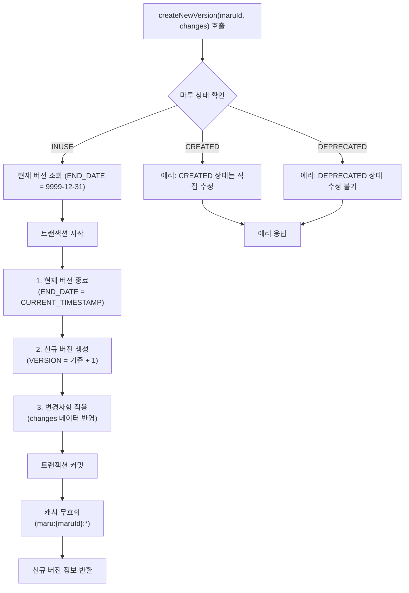
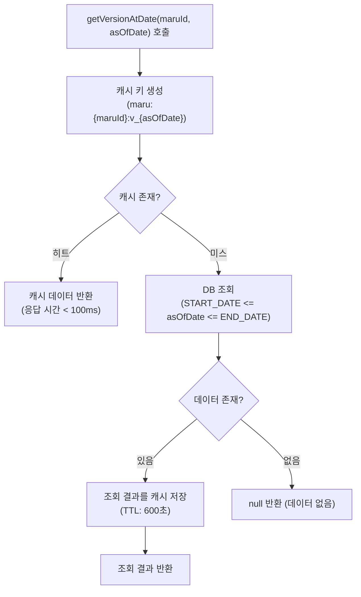
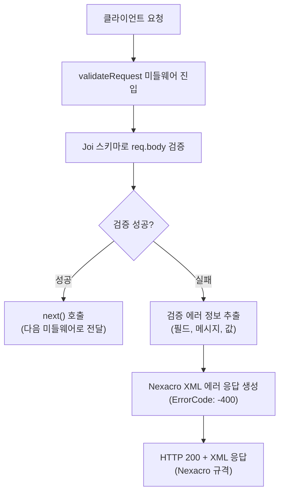
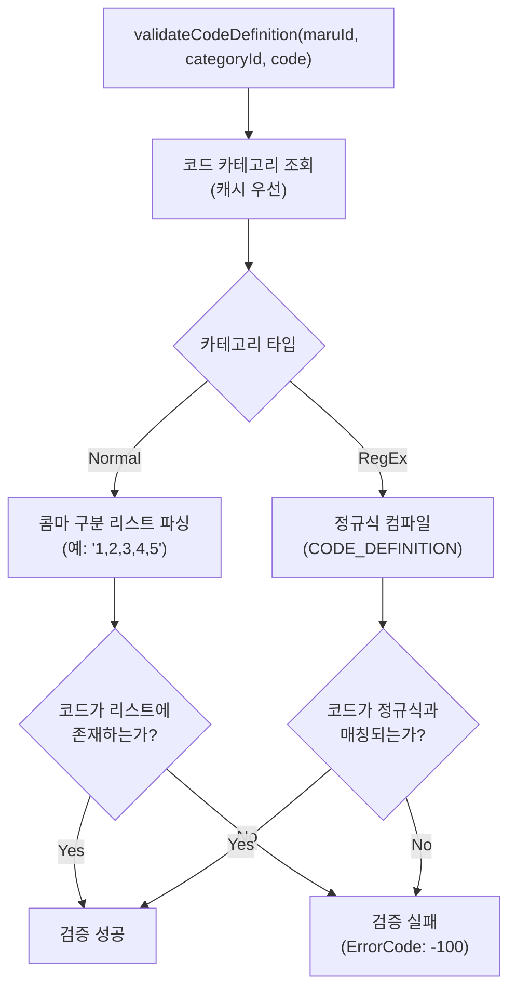
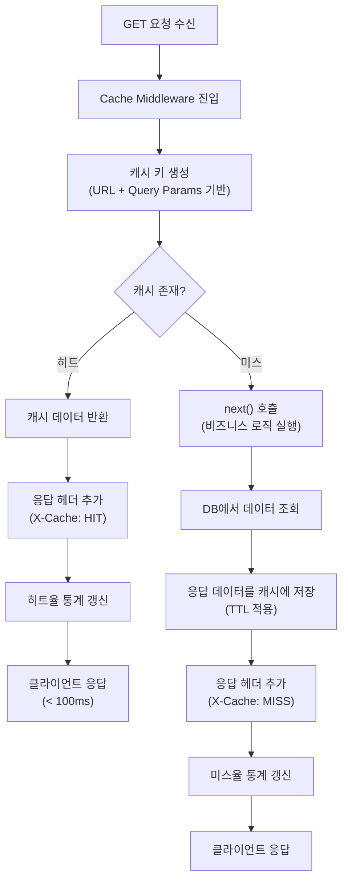
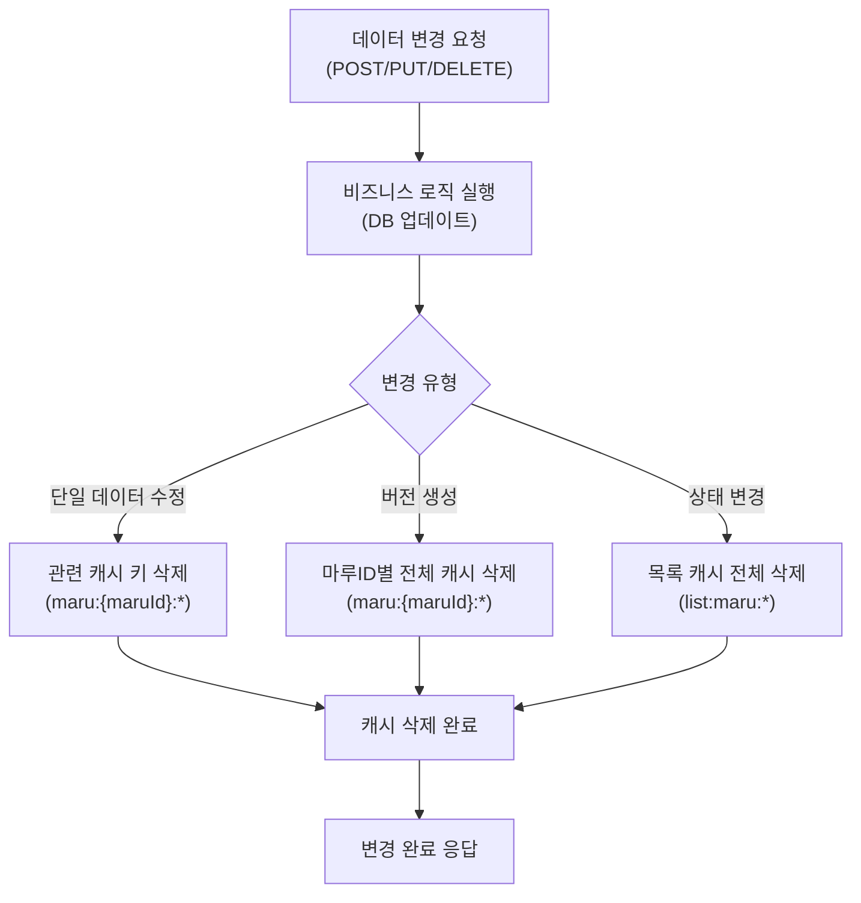
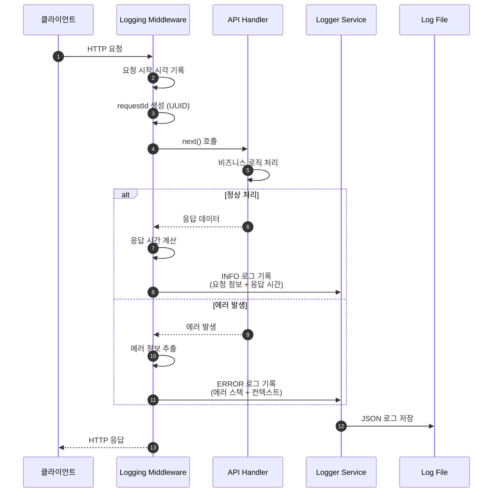

# 📄 상세설계서 - Task 13 공통 서비스 및 캐시 구현

**Template Version:** 1.3.0 — **Last Updated:** 2025-10-05

> **설계 규칙(꼭 지킬 것)**
>
> * *기능 중심 설계*에 집중한다.
> * 실제 소스코드(전체 또는 일부)는 **절대 포함하지 않는다**.
> * 작성 후 **이전 개념과 비교**하여 차이가 있으면 **즉시 중단 → 차이 설명 → 지시 대기**.
> * **다이어그램 규칙**
>
>   * 프로세스: **Mermaid**만 사용
>   * UI 레이아웃: **Text Art(ASCII)** → 바로 아래 **SVG 개념도**를 순차 배치

---

## 0. 문서 메타데이터

* 문서명: `Task 13. 공통 서비스 및 캐시 구현.md`
* 버전/작성일/작성자: v1.0 / 2025-10-05 / Claude
* 참조 문서:
  - `./docs/project/maru/00.foundation/01.project-charter/business-requirements.md`
  - `./docs/project/maru/00.foundation/01.project-charter/technical-requirements.md`
  - `./docs/project/maru/00.foundation/02.design-baseline/2. database-design.md`
  - `./docs/project/maru/00.foundation/02.design-baseline/3. api-design.md`
* 위치: `./docs/project/maru/10.design/12.detail-design/`
* 관련 이슈/티켓: Task 13
* 상위 요구사항 문서/ID: BRD v1.0, TRD v1.0
* 요구사항 추적 담당자: 시스템 아키텍트
* 추적성 관리 도구: Git + Markdown 문서

---

## 1. 목적 및 범위

### 목적
- MARU 시스템의 공통 서비스 계층 설계 및 구현 방향 정의
- 선분 이력 관리 공통 함수 설계
- 데이터 검증 및 에러 처리 미들웨어 설계
- 캐시 레이어 구현 전략 수립
- 로깅 및 모니터링 시스템 구조 정의

### 범위(포함/제외)
**포함:**
- 선분 이력 관리 공통 함수 6종 설계
- 데이터 검증 및 에러 처리 미들웨어 5종 설계
- @cacheable/node-cache 기반 캐시 전략 설계
- 로깅 및 모니터링 구조 설계
- TDD 계획 및 테스트 시나리오

**제외:**
- UI 관련 설계 (Backend 전용)
- 인증/권한 관리 (PoC 범위 제외)
- Redis 마이그레이션 (향후 확장)
- 외부 시스템 연동

---

## 2. 요구사항 & 승인 기준 (Acceptance Criteria)

> **작성 규칙**: 각 요구사항 항목마다 고유 ID(예: REQ-001)를 명시하고, 이후 설계 섹션에서 `[REQ-001]` 형태로 참조합니다.
> **추적 팁**: 요구사항 변경 시 추적 매트릭스와 해당 설계 섹션을 함께 업데이트합니다.

### 2.1. 요구사항
* 요구사항 원본 링크: [BRD UC-006, UC-007 / TRD Section 5, 6]

#### 기능 요구사항:
- [REQ-HISTORY-001] 선분 이력 모델 기반 버전 관리 기능 제공
  - 현재 버전 조회 기능
  - 특정 시점 버전 조회 기능
  - 신규 버전 생성 기능 (INUSE 상태)
  - 현재 버전 직접 수정 기능 (CREATED 상태)

- [REQ-VALIDATION-001] 데이터 검증 체계 구축
  - Joi 스키마 기반 요청 검증
  - 코드 카테고리 정의와 실제 코드값 일치성 검증
  - 상태 변경 유효성 검증

- [REQ-CACHE-001] 캐시 시스템 구현
  - @cacheable/node-cache v1.7.0 기반 구현
  - 마스터 데이터 캐싱 (TTL: 600초)
  - 캐시 무효화 전략 수립

- [REQ-ERROR-001] 에러 처리 및 예외 상황 관리
  - Nexacro XML 형식 에러 응답
  - 전역 에러 핸들러 구현
  - 비동기 함수 에러 자동 처리

#### 비기능 요구사항(성능/안정성/보안 등):
- [REQ-PERF-001] 성능 목표
  - 일반 조회 응답시간 < 1초
  - 캐시 히트 시 < 100ms
  - 복잡 조회 < 3초

- [REQ-SECURE-001] 보안 요구사항
  - SQL Injection 방지 (Parameterized Query)
  - XSS 방지 (입력값 검증 및 이스케이프)
  - 민감 정보 로그 마스킹

- [REQ-LOG-001] 로깅 및 모니터링
  - 구조화된 JSON 로그
  - 로그 레벨: ERROR, WARN, INFO, DEBUG
  - API 응답시간, 캐시 히트율, 에러 발생률 모니터링

#### 승인 기준(테스트 통과 조건, 관찰 가능한 결과):
✅ 선분 이력 관리 함수 6종 정상 동작
✅ 데이터 검증 미들웨어 5종 정상 동작
✅ 캐시 시스템 정상 동작 (히트율 > 70%)
✅ 전역 에러 핸들러 모든 예외 처리
✅ 로깅 시스템 정상 동작 (구조화된 로그 출력)
✅ 단위 테스트 커버리지 > 80%

### 2.2. 요구사항-설계 추적 매트릭스

| 요구사항 ID | 요구사항 설명 | 설계 섹션/아티팩트 | 테스트 케이스 ID | 상태 | 비고 |
|-------------|---------------|--------------------|------------------|------|------|
| REQ-HISTORY-001 | 선분 이력 관리 기능 | §5.1, §8.1 | TC-HIST-001~006 | 초안 | |
| REQ-VALIDATION-001 | 데이터 검증 체계 | §5.2, §8.2 | TC-VAL-001~005 | 초안 | |
| REQ-CACHE-001 | 캐시 시스템 구현 | §5.3, §8.3, §11 | TC-CACHE-001~005 | 초안 | |
| REQ-ERROR-001 | 에러 처리 체계 | §5.2, §8.2, §9 | TC-ERR-001~003 | 초안 | |
| REQ-PERF-001 | 성능 목표 | §11 | TC-PERF-001~003 | 초안 | |
| REQ-SECURE-001 | 보안 요구사항 | §10 | TC-SEC-001~002 | 초안 | |
| REQ-LOG-001 | 로깅 및 모니터링 | §5.4, §8.4 | TC-LOG-001~004 | 초안 | |

---

## 3. 용어/가정/제약

### 용어 정의:
- **선분 이력 모델**: START_DATE와 END_DATE로 데이터의 유효 기간을 관리하는 시간 기반 버전 관리 방식
- **캐시 TTL (Time To Live)**: 캐시 데이터의 유효 시간
- **캐시 히트/미스**: 캐시에서 데이터를 찾은 경우(히트), 찾지 못한 경우(미스)
- **미들웨어**: Express 요청-응답 사이클에서 실행되는 함수
- **Joi 스키마**: 데이터 검증을 위한 JavaScript 객체 스키마

### 가정(Assumptions):
- Node.js 24.x 환경에서 실행
- Express 5.1.0 프레임워크 사용
- @cacheable/node-cache v1.7.0 설치 완료
- Oracle Database 또는 SQLite 연결 가능
- 모든 테이블에 선분 이력 컬럼(START_DATE, END_DATE, VERSION) 존재

### 제약(Constraints):
- PoC 단계로 Redis 미사용 (node-cache로 대체)
- 단일 서버 환경 (분산 캐시 미지원)
- 동시 사용자 5명 이하
- 캐시 크기 제한 없음 (메모리 기반)

---

## 4. 시스템/모듈 개요

### 역할 및 책임:
**공통 서비스 계층 (Common Services Layer)**
- 역할: 모든 API에서 공통적으로 사용하는 기능 제공
- 책임:
  - 선분 이력 관리 로직 중앙화
  - 데이터 검증 및 에러 처리 표준화
  - 캐시 관리 및 무효화 전략 실행
  - 로깅 및 모니터링 데이터 수집

**미들웨어 계층 (Middleware Layer)**
- 역할: 요청-응답 사이클에서 공통 처리 수행
- 책임:
  - 요청 데이터 검증
  - 에러 핸들링 및 응답 변환
  - 캐시 적용 및 관리
  - 로깅 및 성능 측정

### 외부 의존성(서비스, 라이브러리):
- **@cacheable/node-cache**: 인메모리 캐시 라이브러리
- **joi**: 데이터 검증 라이브러리
- **winston**: 로깅 라이브러리 (향후 적용)
- **knex.js**: SQL 쿼리 빌더 및 데이터베이스 접근

### 상호작용 개요:
```
[API Controller]
       ↓ (요청)
[Validation Middleware] → Joi 스키마 검증
       ↓
[Business Logic]
       ↓
[History Service] → 선분 이력 관리
       ↓
[Cache Service] → 캐시 조회/저장
       ↓
[Database Layer]
       ↓
[Error Handler Middleware] → Nexacro XML 응답 변환
       ↓ (응답)
[API Controller]
```

---

## 5. 프로세스 흐름

### 5.1 선분 이력 관리 프로세스 [REQ-HISTORY-001]

#### 5.1.1 프로세스 설명

**선분 이력 관리 공통 함수 6종:**

1. **getCurrentVersion(maruId)**
   - 특정 마루ID의 현재 유효한 버전 조회
   - END_DATE = '9999-12-31 23:59:59' 조건으로 조회

2. **getVersionAtDate(maruId, asOfDate)**
   - 특정 시점(asOfDate)에 유효했던 버전 조회
   - START_DATE <= asOfDate <= END_DATE 조건으로 조회

3. **createNewVersion(maruId, changes)**
   - INUSE 상태 마루의 신규 버전 생성
   - 기존 버전 종료 (END_DATE 갱신) → 신규 버전 생성 (VERSION+1)

4. **updateCurrentVersion(maruId, changes)**
   - CREATED 상태 마루의 현재 버전 직접 수정
   - 버전 번호 변경 없이 데이터만 업데이트

5. **closeVersion(maruId)**
   - 현재 버전 종료 (END_DATE를 현재 시각으로 갱신)
   - 논리적 삭제 또는 버전 종료 시 사용

6. **getVersionHistory(maruId, fromDate, toDate)**
   - 특정 기간 동안의 모든 버전 이력 조회
   - 버전별 변경사항 추적

#### 5.1.2 프로세스 설계 개념도 (Mermaid)

**선분 이력 생성 흐름 (createNewVersion)**



**선분 이력 조회 흐름 (getVersionAtDate)**



### 5.2 데이터 검증 및 에러 처리 프로세스 [REQ-VALIDATION-001, REQ-ERROR-001]

#### 5.2.1 프로세스 설명

**데이터 검증 미들웨어 5종:**

1. **validateRequest(schema)**
   - Joi 스키마 기반 요청 데이터 검증
   - 필수값, 타입, 형식, 범위 검증

2. **validateCodeDefinition(maruId, categoryId, code)**
   - 코드 카테고리 정의와 실제 코드값 일치성 검증
   - Normal 타입: 콤마 구분 리스트 매칭
   - RegEx 타입: 정규식 패턴 매칭

3. **validateStatusTransition(currentStatus, newStatus)**
   - 상태 변경 유효성 검증
   - 허용: CREATED→INUSE, INUSE→DEPRECATED
   - 조건부 허용: INUSE→CREATED (버전이 1개뿐일 때)
   - 불가: 역방향, DEPRECATED→*

4. **errorHandler(err, req, res, next)**
   - 전역 에러 핸들러
   - Nexacro XML 형식으로 에러 응답 변환
   - 에러 로깅 및 모니터링 데이터 수집

5. **asyncHandler(fn)**
   - 비동기 함수의 에러를 자동으로 next(err)로 전달
   - try-catch 보일러플레이트 제거

#### 5.2.2 프로세스 설계 개념도 (Mermaid)

**요청 검증 흐름 (validateRequest)**



**코드 정의 검증 흐름 (validateCodeDefinition)**



### 5.3 캐시 레이어 프로세스 [REQ-CACHE-001]

#### 5.3.1 프로세스 설명

**캐시 전략:**

1. **Cache Keys 전략**
   - 마루 헤더: `maru:{maruId}:v{version}`
   - 코드값: `code:{maruId}:{code}`
   - 카테고리: `category:{maruId}:{categoryId}`
   - 전체 목록: `list:maru:{type}:{page}`

2. **TTL 전략**
   - 마스터 데이터: 600초 (10분)
   - 조회 결과: 300초 (5분)
   - 통계 데이터: 60초 (1분)

3. **캐시 무효화 전략**
   - 데이터 생성/수정/삭제 시 관련 캐시 삭제
   - 버전 변경 시 해당 마루ID의 모든 캐시 클리어
   - 상태 변경 시 전체 목록 캐시 클리어

4. **Cache Middleware**
   - GET 요청에 자동 캐시 적용
   - Cache-Control 헤더 기반 동작
   - 캐시 히트/미스 로깅

5. **Cache Service**
   - `get(key)`: 캐시 조회
   - `set(key, value, ttl)`: 캐시 저장
   - `del(key)`: 캐시 삭제
   - `clear(pattern)`: 패턴 매칭 캐시 삭제
   - `getStats()`: 캐시 통계 조회 (히트율, 크기 등)

#### 5.3.2 프로세스 설계 개념도 (Mermaid)

**캐시 미들웨어 흐름**



**캐시 무효화 흐름**



### 5.4 로깅 및 모니터링 프로세스 [REQ-LOG-001]

#### 5.4.1 프로세스 설명

**로깅 전략:**

1. **로그 레벨**
   - ERROR: 시스템 에러, 예외 상황
   - WARN: 경고, 성능 저하, 비정상 동작
   - INFO: API 요청/응답, 비즈니스 이벤트
   - DEBUG: 상세 디버깅 정보 (개발 환경만)

2. **로그 형식 (JSON 구조화)**
   ```
   {
     timestamp: ISO 8601 형식,
     level: 로그 레벨,
     message: 로그 메시지,
     context: {
       requestId: 요청 고유 ID,
       userId: 사용자 ID (향후),
       method: HTTP 메서드,
       url: 요청 URL,
       duration: 응답 시간 (ms),
       statusCode: HTTP 상태 코드
     },
     error: 에러 정보 (있을 경우),
     metadata: 추가 메타데이터
   }
   ```

3. **로그 대상**
   - API 요청/응답: 모든 API 호출 기록
   - 데이터 변경: 생성/수정/삭제 이벤트
   - 에러 발생: 모든 예외 상황
   - 성능 지표: 응답 시간, 캐시 히트율

4. **모니터링 지표**
   - API 응답시간: P50, P95, P99
   - 캐시 히트율: 히트/전체 요청 비율
   - 데이터베이스 연결 상태: 활성 연결 수, 대기 수
   - 에러 발생률: 에러/전체 요청 비율

#### 5.4.2 프로세스 설계 개념도 (Mermaid)

**로깅 미들웨어 흐름**



---

## 6. UI 레이아웃 설계 (Text Art + SVG)

> Backend 전용 설계로 UI 설계는 제외됨

---

## 7. 데이터/메시지 구조 (개념 수준)

### 7.1. 선분 이력 관리 함수 입력/출력 구조 [REQ-HISTORY-001]

#### getCurrentVersion(maruId)
**입력:**
```typescript
{
  maruId: string  // 마루 고유 식별자 (필수, 최대 50자)
}
```

**출력:**
```typescript
{
  maruId: string,
  version: number,
  maruName: string,
  maruStatus: 'CREATED' | 'INUSE' | 'DEPRECATED',
  maruType: 'CODE' | 'RULE',
  priorityUseYn: 'Y' | 'N',
  startDate: Date,
  endDate: Date
} | null  // 데이터 없으면 null
```

#### createNewVersion(maruId, changes)
**입력:**
```typescript
{
  maruId: string,
  changes: {
    maruName?: string,
    priorityUseYn?: 'Y' | 'N',
    // 기타 변경 가능한 필드
  }
}
```

**출력:**
```typescript
{
  maruId: string,
  newVersion: number,
  oldVersion: number,
  effectiveDate: Date,
  changes: object
}
```

### 7.2. 검증 미들웨어 입력/출력 구조 [REQ-VALIDATION-001]

#### validateRequest(schema)
**입력:**
```typescript
{
  schema: Joi.ObjectSchema,  // Joi 검증 스키마
  req: Express.Request       // Express 요청 객체
}
```

**출력 (성공 시):**
```typescript
// next() 호출 - 다음 미들웨어로 전달
```

**출력 (실패 시):**
```xml
<?xml version="1.0" encoding="UTF-8"?>
<Dataset>
  <ErrorCode>-400</ErrorCode>
  <ErrorMsg>입력값이 올바르지 않습니다.</ErrorMsg>
  <SuccessRowCount>0</SuccessRowCount>
  <ColumnInfo>
    <Column id="FIELD" type="STRING" size="50"/>
    <Column id="MESSAGE" type="STRING" size="200"/>
  </ColumnInfo>
  <Rows>
    <Row>
      <Col id="FIELD">maruName</Col>
      <Col id="MESSAGE">마루명은 필수입니다.</Col>
    </Row>
  </Rows>
</Dataset>
```

### 7.3. 캐시 서비스 데이터 구조 [REQ-CACHE-001]

#### Cache Entry 구조
```typescript
{
  key: string,           // 캐시 키
  value: any,            // 캐시 값 (JSON 직렬화 가능)
  ttl: number,           // 유효 시간 (초)
  createdAt: Date,       // 생성 시각
  expiresAt: Date,       // 만료 시각
  hitCount: number       // 조회 횟수 (통계)
}
```

#### Cache Stats 구조
```typescript
{
  totalKeys: number,     // 전체 캐시 키 수
  totalHits: number,     // 전체 히트 수
  totalMisses: number,   // 전체 미스 수
  hitRate: number,       // 히트율 (%)
  memoryUsage: number,   // 메모리 사용량 (bytes)
  oldestEntry: Date,     // 가장 오래된 캐시 생성 시각
  newestEntry: Date      // 가장 최근 캐시 생성 시각
}
```

### 7.4. 로그 메시지 구조 [REQ-LOG-001]

#### 구조화된 로그 형식
```typescript
{
  timestamp: string,     // ISO 8601 형식 (예: "2025-10-05T10:30:45.123Z")
  level: 'ERROR' | 'WARN' | 'INFO' | 'DEBUG',
  message: string,       // 로그 메시지
  context: {
    requestId: string,   // UUID v4 형식
    method: string,      // HTTP 메서드 (GET, POST, etc.)
    url: string,         // 요청 URL
    duration: number,    // 응답 시간 (ms)
    statusCode: number,  // HTTP 상태 코드
    userAgent?: string,  // User-Agent 헤더
    ip?: string          // 클라이언트 IP
  },
  error?: {
    name: string,        // 에러 이름
    message: string,     // 에러 메시지
    stack: string,       // 스택 트레이스
    code?: string        // 에러 코드 (비즈니스 에러)
  },
  metadata?: object      // 추가 메타데이터
}
```

---

## 8. 인터페이스 계약(Contract)

> **추적 메모**: 각 API/데이터 계약마다 참조 요구사항 ID와 검증 케이스를 명시합니다.

### 8.1. 선분 이력 관리 함수 계약 [REQ-HISTORY-001]

#### 8.1.1 HistoryService.getCurrentVersion(maruId)
**목적**: 특정 마루의 현재 유효한 버전 조회

**입력:**
- `maruId` (string, 필수): 마루 고유 식별자 (최대 50자)

**출력:**
- 성공: 현재 버전 객체 (마루 헤더 전체 필드)
- 실패: null (데이터 없음)

**성공 조건:**
- maruId가 존재
- END_DATE = '9999-12-31 23:59:59' 조건을 만족하는 레코드 존재

**오류 조건:**
- maruId가 null 또는 빈 문자열
- 해당 마루가 존재하지 않음

**검증 케이스:** TC-HIST-001

---

#### 8.1.2 HistoryService.getVersionAtDate(maruId, asOfDate)
**목적**: 특정 시점에 유효했던 버전 조회

**입력:**
- `maruId` (string, 필수): 마루 고유 식별자
- `asOfDate` (Date, 필수): 조회 기준 시점

**출력:**
- 성공: 해당 시점의 버전 객체
- 실패: null (데이터 없음)

**성공 조건:**
- maruId 존재
- START_DATE <= asOfDate <= END_DATE 조건을 만족하는 레코드 존재

**오류 조건:**
- asOfDate가 유효하지 않은 날짜
- 해당 시점에 유효한 데이터 없음

**검증 케이스:** TC-HIST-002

---

#### 8.1.3 HistoryService.createNewVersion(maruId, changes)
**목적**: INUSE 상태 마루의 신규 버전 생성

**입력:**
- `maruId` (string, 필수): 마루 고유 식별자
- `changes` (object, 필수): 변경할 필드와 값

**출력:**
- 성공: 신규 버전 정보 (newVersion, oldVersion, effectiveDate)
- 실패: 에러 객체

**성공 조건:**
- 마루 상태가 'INUSE'
- 현재 버전 존재
- changes 객체가 유효

**오류 조건:**
- 마루 상태가 'CREATED' 또는 'DEPRECATED'
- 현재 버전 없음
- 트랜잭션 실패

**검증 케이스:** TC-HIST-003

---

#### 8.1.4 HistoryService.updateCurrentVersion(maruId, changes)
**목적**: CREATED 상태 마루의 현재 버전 직접 수정

**입력:**
- `maruId` (string, 필수): 마루 고유 식별자
- `changes` (object, 필수): 변경할 필드와 값

**출력:**
- 성공: 수정된 버전 정보
- 실패: 에러 객체

**성공 조건:**
- 마루 상태가 'CREATED'
- 현재 버전 존재

**오류 조건:**
- 마루 상태가 'INUSE' 또는 'DEPRECATED'
- 현재 버전 없음

**검증 케이스:** TC-HIST-004

---

#### 8.1.5 HistoryService.closeVersion(maruId)
**목적**: 현재 버전 종료 (논리적 삭제)

**입력:**
- `maruId` (string, 필수): 마루 고유 식별자

**출력:**
- 성공: 종료된 버전 정보 (closedVersion, closedAt)
- 실패: 에러 객체

**성공 조건:**
- 현재 버전 존재
- END_DATE를 현재 시각으로 갱신 성공

**오류 조건:**
- 현재 버전 없음
- 이미 종료된 버전

**검증 케이스:** TC-HIST-005

---

#### 8.1.6 HistoryService.getVersionHistory(maruId, fromDate, toDate)
**목적**: 특정 기간의 모든 버전 이력 조회

**입력:**
- `maruId` (string, 필수): 마루 고유 식별자
- `fromDate` (Date, 선택): 시작일 (기본값: 과거 1년)
- `toDate` (Date, 선택): 종료일 (기본값: 현재)

**출력:**
- 성공: 버전 배열 (버전 번호 역순 정렬)
- 실패: 빈 배열

**성공 조건:**
- fromDate <= toDate
- 해당 기간에 버전 존재

**오류 조건:**
- fromDate > toDate
- 기간이 너무 긺 (> 5년)

**검증 케이스:** TC-HIST-006

---

### 8.2. 검증 미들웨어 계약 [REQ-VALIDATION-001, REQ-ERROR-001]

#### 8.2.1 ValidationMiddleware.validateRequest(schema)
**목적**: Joi 스키마 기반 요청 데이터 검증

**입력:**
- `schema` (Joi.ObjectSchema, 필수): Joi 검증 스키마

**출력:**
- 성공: next() 호출
- 실패: Nexacro XML 에러 응답 (ErrorCode: -400)

**성공 조건:**
- req.body가 스키마 조건 충족

**오류 조건:**
- 필수값 누락
- 타입 불일치
- 형식 오류 (예: 이메일, URL)
- 범위 초과 (예: 최대 길이)

**검증 케이스:** TC-VAL-001

---

#### 8.2.2 ValidationMiddleware.validateCodeDefinition(maruId, categoryId, code)
**목적**: 코드 카테고리 정의와 실제 코드값 일치성 검증

**입력:**
- `maruId` (string, 필수): 마루 고유 식별자
- `categoryId` (string, 필수): 카테고리 고유 식별자
- `code` (string, 필수): 검증할 코드값

**출력:**
- 성공: true
- 실패: false

**성공 조건:**
- Normal 타입: 코드가 콤마 구분 리스트에 존재
- RegEx 타입: 코드가 정규식 패턴과 매칭

**오류 조건:**
- 카테고리 존재하지 않음
- 코드가 정의와 불일치
- 정규식 컴파일 실패

**검증 케이스:** TC-VAL-002

---

#### 8.2.3 ValidationMiddleware.validateStatusTransition(currentStatus, newStatus)
**목적**: 상태 변경 유효성 검증

**입력:**
- `currentStatus` (string, 필수): 현재 상태
- `newStatus` (string, 필수): 변경할 상태

**출력:**
- 성공: true
- 실패: false + 에러 메시지

**성공 조건:**
- CREATED → INUSE
- INUSE → DEPRECATED
- INUSE → CREATED (조건: 버전이 1개뿐)

**오류 조건:**
- DEPRECATED → * (모든 변경 불가)
- 역방향 변경 (INUSE → CREATED 조건 미충족)
- 동일 상태로 변경

**검증 케이스:** TC-VAL-003

---

#### 8.2.4 ErrorHandler.errorHandler(err, req, res, next)
**목적**: 전역 에러 핸들러 (Nexacro XML 응답 변환)

**입력:**
- `err` (Error, 필수): 에러 객체
- `req` (Express.Request): 요청 객체
- `res` (Express.Response): 응답 객체
- `next` (Function): 다음 미들웨어

**출력:**
- Nexacro XML 에러 응답

**에러 타입별 ErrorCode 매핑:**
- ValidationError: -400 (파라미터 에러)
- BusinessError: -100 (비즈니스 로직 에러)
- DatabaseError: -200 (시스템 에러)
- AuthenticationError: -300 (권한 에러)
- 기타: -1 (일반 에러)

**검증 케이스:** TC-ERR-001

---

#### 8.2.5 ErrorHandler.asyncHandler(fn)
**목적**: 비동기 함수 에러 자동 처리

**입력:**
- `fn` (AsyncFunction, 필수): 비동기 핸들러 함수

**출력:**
- Express 미들웨어 함수

**동작:**
- try-catch로 fn 실행
- 에러 발생 시 next(err) 호출

**검증 케이스:** TC-ERR-002

---

### 8.3. 캐시 서비스 계약 [REQ-CACHE-001]

#### 8.3.1 CacheService.get(key)
**목적**: 캐시에서 데이터 조회

**입력:**
- `key` (string, 필수): 캐시 키

**출력:**
- 성공: 캐시 값 (any)
- 실패: undefined

**성공 조건:**
- 키 존재
- TTL 만료되지 않음

**오류 조건:**
- 키 존재하지 않음
- TTL 만료

**검증 케이스:** TC-CACHE-001

---

#### 8.3.2 CacheService.set(key, value, ttl)
**목적**: 캐시에 데이터 저장

**입력:**
- `key` (string, 필수): 캐시 키
- `value` (any, 필수): 캐시 값
- `ttl` (number, 선택): 유효 시간(초, 기본값: 600)

**출력:**
- 성공: true
- 실패: false

**성공 조건:**
- 키가 유효한 문자열
- 값이 JSON 직렬화 가능

**오류 조건:**
- 키가 null 또는 빈 문자열
- 값이 순환 참조 포함

**검증 케이스:** TC-CACHE-002

---

#### 8.3.3 CacheService.del(key)
**목적**: 캐시에서 데이터 삭제

**입력:**
- `key` (string, 필수): 캐시 키

**출력:**
- 성공: true
- 실패: false

**검증 케이스:** TC-CACHE-003

---

#### 8.3.4 CacheService.clear(pattern)
**목적**: 패턴 매칭 캐시 삭제

**입력:**
- `pattern` (string, 필수): 캐시 키 패턴 (와일드카드 지원)

**출력:**
- 삭제된 키 개수 (number)

**패턴 예시:**
- `maru:*` - maru로 시작하는 모든 키
- `*:v1` - v1로 끝나는 모든 키
- `code:DEPT*` - code:DEPT로 시작하는 모든 키

**검증 케이스:** TC-CACHE-004

---

#### 8.3.5 CacheService.getStats()
**목적**: 캐시 통계 조회

**입력:** 없음

**출력:**
```typescript
{
  totalKeys: number,
  totalHits: number,
  totalMisses: number,
  hitRate: number,      // 백분율 (0-100)
  memoryUsage: number,  // bytes
  oldestEntry: Date,
  newestEntry: Date
}
```

**검증 케이스:** TC-CACHE-005

---

### 8.4. 로깅 서비스 계약 [REQ-LOG-001]

#### 8.4.1 LoggerService.log(level, message, context, metadata)
**목적**: 구조화된 로그 기록

**입력:**
- `level` (string, 필수): 로그 레벨 (ERROR/WARN/INFO/DEBUG)
- `message` (string, 필수): 로그 메시지
- `context` (object, 선택): 컨텍스트 정보
- `metadata` (object, 선택): 추가 메타데이터

**출력:**
- JSON 형식 로그 (콘솔 + 파일)

**검증 케이스:** TC-LOG-001

---

#### 8.4.2 LoggerService.error(message, error, context)
**목적**: 에러 로그 기록

**입력:**
- `message` (string, 필수): 에러 메시지
- `error` (Error, 필수): 에러 객체
- `context` (object, 선택): 컨텍스트 정보

**출력:**
- ERROR 레벨 로그 (스택 트레이스 포함)

**검증 케이스:** TC-LOG-002

---

#### 8.4.3 LoggerService.apiLog(req, res, duration)
**목적**: API 요청/응답 로그 기록

**입력:**
- `req` (Express.Request): 요청 객체
- `res` (Express.Response): 응답 객체
- `duration` (number): 응답 시간(ms)

**출력:**
- INFO 레벨 로그 (HTTP 메서드, URL, 상태 코드, 응답 시간)

**검증 케이스:** TC-LOG-003

---

#### 8.4.4 LoggerService.getMetrics()
**목적**: 모니터링 지표 조회

**입력:** 없음

**출력:**
```typescript
{
  apiResponseTime: {
    p50: number,  // 50th percentile (ms)
    p95: number,  // 95th percentile (ms)
    p99: number   // 99th percentile (ms)
  },
  cacheHitRate: number,      // 백분율 (0-100)
  databaseConnections: {
    active: number,
    idle: number,
    waiting: number
  },
  errorRate: number          // 백분율 (0-100)
}
```

**검증 케이스:** TC-LOG-004

---

## 9. 오류/예외/경계조건

### 9.1. 예상 오류 상황 및 처리 방안

#### 9.1.1 선분 이력 관리 오류 [REQ-HISTORY-001]

| 오류 상황 | 원인 | 처리 방안 | ErrorCode |
|-----------|------|-----------|-----------|
| 버전 생성 실패 | CREATED/DEPRECATED 상태에서 버전 생성 시도 | 상태 검증 → 에러 응답 | -100 |
| 트랜잭션 실패 | DB 동시성 문제, 제약조건 위반 | 롤백 → 재시도 (최대 3회) | -200 |
| 시점 조회 실패 | 유효하지 않은 날짜 입력 | 날짜 검증 → 에러 응답 | -400 |
| 이력 조회 타임아웃 | 너무 긴 기간 조회 (> 5년) | 기간 제한 → 에러 응답 | -400 |

#### 9.1.2 데이터 검증 오류 [REQ-VALIDATION-001]

| 오류 상황 | 원인 | 처리 방안 | ErrorCode |
|-----------|------|-----------|-----------|
| Joi 검증 실패 | 필수값 누락, 타입 불일치 | 필드별 에러 메시지 반환 | -400 |
| 코드 정의 불일치 | 카테고리 정의와 코드값 불일치 | 검증 실패 메시지 반환 | -100 |
| 정규식 컴파일 실패 | 잘못된 정규식 패턴 | 카테고리 정의 수정 요청 | -200 |
| 상태 전환 불가 | DEPRECATED → * 변경 시도 | 상태 전환 규칙 설명 반환 | -100 |

#### 9.1.3 캐시 시스템 오류 [REQ-CACHE-001]

| 오류 상황 | 원인 | 처리 방안 | ErrorCode |
|-----------|------|-----------|-----------|
| 캐시 서버 다운 | node-cache 인스턴스 실패 | 캐시 우회 → DB 직접 조회 | 0 (정상) |
| 메모리 부족 | 캐시 크기 제한 초과 | LRU 정책으로 자동 삭제 | 0 (정상) |
| 직렬화 실패 | 순환 참조 객체 캐싱 시도 | 직렬화 에러 로깅 → 캐시 미저장 | 0 (정상) |
| TTL 만료 | 캐시 데이터 유효 시간 경과 | 자동 삭제 → 재조회 | 0 (정상) |

#### 9.1.4 로깅 시스템 오류 [REQ-LOG-001]

| 오류 상황 | 원인 | 처리 방안 | ErrorCode |
|-----------|------|-----------|-----------|
| 로그 파일 쓰기 실패 | 디스크 공간 부족 | 콘솔 로그로 폴백 | - |
| 로그 포맷 오류 | JSON 직렬화 실패 | 기본 텍스트 로그로 대체 | - |
| 로그 레벨 오류 | 잘못된 레벨 입력 | INFO 레벨로 기본 설정 | - |

### 9.2. 복구 전략 및 사용자 메시지

#### 9.2.1 트랜잭션 실패 복구

**복구 전략:**
1. 자동 롤백 실행
2. 최대 3회 재시도 (지수 백오프: 100ms, 200ms, 400ms)
3. 재시도 실패 시 에러 응답

**사용자 메시지:**
```xml
<ErrorCode>-200</ErrorCode>
<ErrorMsg>데이터 저장 중 오류가 발생했습니다. 잠시 후 다시 시도해주세요.</ErrorMsg>
```

#### 9.2.2 캐시 미스 복구

**복구 전략:**
1. 캐시 미스 감지
2. DB에서 데이터 조회
3. 조회 성공 시 캐시 저장
4. 정상 응답

**사용자 메시지:**
- 사용자에게 노출하지 않음 (투명한 복구)
- 응답 헤더에 `X-Cache: MISS` 추가

#### 9.2.3 검증 실패 복구

**복구 전략:**
1. 검증 실패 필드 및 원인 식별
2. 상세한 에러 정보 제공
3. 수정 가이드 제시

**사용자 메시지:**
```xml
<ErrorCode>-400</ErrorCode>
<ErrorMsg>입력값이 올바르지 않습니다.</ErrorMsg>
<Rows>
  <Row>
    <Col id="FIELD">maruName</Col>
    <Col id="MESSAGE">마루명은 1자 이상 200자 이하로 입력해주세요.</Col>
  </Row>
</Rows>
```

#### 9.2.4 시스템 오류 복구

**복구 전략:**
1. 에러 로그 기록 (스택 트레이스 포함)
2. 모니터링 알림 발송
3. 일반적인 에러 메시지 반환 (보안상 상세 정보 숨김)

**사용자 메시지:**
```xml
<ErrorCode>-200</ErrorCode>
<ErrorMsg>시스템 오류가 발생했습니다. 관리자에게 문의해주세요.</ErrorMsg>
```

---

## 10. 보안/품질 고려

### 10.1. 보안 고려사항 [REQ-SECURE-001]

#### 10.1.1 입력 검증
- **Joi 스키마 검증**: 모든 API 입력값에 대해 타입, 형식, 범위 검증
- **SQL Injection 방지**: Knex.js의 Parameterized Query 사용
- **XSS 방지**:
  - 입력값 이스케이프 처리
  - Nexacro XML 응답 시 특수 문자 인코딩 (`<`, `>`, `&`, `"`, `'`)
- **NoSQL Injection 방지**: 캐시 키에 사용자 입력 사용 시 검증

#### 10.1.2 민감정보 보호
- **로그 마스킹**: 비밀번호, 토큰, 개인정보 자동 마스킹
  - 예: `password: "********"`, `token: "eyJ...***"`
- **에러 메시지**: 프로덕션 환경에서 상세 에러 숨김
  - 개발: 스택 트레이스 포함
  - 프로덕션: 일반 메시지만 노출

#### 10.1.3 인증/권한 (향후)
- JWT 기반 인증 (PoC에서는 제외)
- 역할 기반 접근 제어 (RBAC)
- API Rate Limiting

### 10.2. 품질 고려사항

#### 10.2.1 코드 품질
- **일관된 에러 처리**: 모든 함수에서 동일한 에러 처리 패턴 사용
- **재사용 가능한 함수**: 공통 로직을 유틸리티 함수로 분리
- **명확한 네이밍**: 함수명, 변수명에서 의도 명확히 표현

#### 10.2.2 테스트 가능성
- **의존성 주입**: 테스트 시 Mock 객체 주입 가능
- **순수 함수**: 부작용 최소화
- **모듈화**: 각 함수를 독립적으로 테스트 가능

#### 10.2.3 국제화 (i18n/l10n)
- **메시지 외부화**: 에러 메시지를 언어 파일로 분리 (향후)
- **날짜/시간 형식**: ISO 8601 표준 사용
- **다국어 코드명**: ALTER_CODE_NAME1~5 활용

---

## 11. 성능 및 확장성(개념)

### 11.1. 성능 목표 및 지표 [REQ-PERF-001]

#### 11.1.1 응답 시간 목표
| 작업 유형 | 목표 응답 시간 | 캐시 적용 시 |
|-----------|----------------|--------------|
| 단순 조회 (캐시 히트) | < 100ms | ✅ |
| 단순 조회 (캐시 미스) | < 500ms | ❌ |
| 복잡 조회 (이력 조회) | < 1초 | 부분 캐시 |
| 데이터 수정 (버전 생성) | < 1초 | 무효화 |
| 대량 조회 (페이징) | < 3초 | 부분 캐시 |

#### 11.1.2 캐시 성능 목표
- **캐시 히트율**: > 70%
- **캐시 응답 시간**: < 10ms
- **캐시 메모리 사용량**: < 512MB

#### 11.1.3 데이터베이스 성능 목표
- **커넥션 풀 활용률**: < 70%
- **쿼리 실행 시간**: < 200ms (단순), < 500ms (복잡)
- **인덱스 활용**: 모든 조회 쿼리에서 인덱스 사용

### 11.2. 병목 예상 지점과 완화 전략

#### 11.2.1 선분 이력 조회 병목
**병목 지점:**
- 이력 조회 시 START_DATE, END_DATE 범위 검색으로 인한 성능 저하

**완화 전략:**
1. **인덱스 최적화**
   - `(END_DATE, START_DATE, MARU_ID)` 복합 인덱스 생성
   - 조회 조건 최적화 (인덱스 활용 극대화)

2. **캐시 전략**
   - 자주 조회되는 시점 데이터 캐싱
   - 캐시 키: `maru:{maruId}:v_{asOfDate}`
   - TTL: 600초

3. **페이징 처리**
   - 이력 조회 시 기본 50건 제한
   - LIMIT/OFFSET 활용

#### 11.2.2 캐시 무효화 병목
**병목 지점:**
- 버전 변경 시 대량 캐시 삭제로 인한 순간 부하

**완화 전략:**
1. **선택적 무효화**
   - 전체 삭제 대신 패턴 매칭으로 관련 캐시만 삭제
   - 예: `maru:{maruId}:*` (특정 마루만 삭제)

2. **비동기 무효화**
   - 캐시 삭제를 별도 작업 큐로 처리 (향후)
   - 응답 시간에 영향 최소화

3. **캐시 워밍**
   - 무효화 후 자주 사용되는 데이터 미리 캐싱

#### 11.2.3 동시성 제어 병목
**병목 지점:**
- 동일 마루에 대한 동시 수정 요청 시 충돌

**완화 전략:**
1. **낙관적 잠금**
   - VERSION 컬럼 활용
   - 수정 시 버전 체크 후 불일치 시 에러

2. **트랜잭션 격리 수준**
   - READ COMMITTED 사용
   - 불필요한 잠금 최소화

3. **재시도 메커니즘**
   - 충돌 발생 시 자동 재시도 (최대 3회)
   - 지수 백오프 적용

### 11.3. 확장성 고려사항

#### 11.3.1 수평 확장 (Scale-out)
**현재 (PoC):**
- 단일 서버 + 인메모리 캐시 (node-cache)

**향후 확장:**
1. **분산 캐시 도입**
   - Redis Cluster로 전환
   - 세션 공유 및 캐시 동기화

2. **로드 밸런서 적용**
   - 다중 서버 인스턴스 운영
   - Sticky Session 또는 Stateless 설계

3. **데이터베이스 샤딩**
   - 마루 타입별 샤딩 (CODE/RULE)
   - 읽기 전용 복제본 활용

#### 11.3.2 수직 확장 (Scale-up)
**메모리 최적화:**
- 캐시 크기 제한 설정
- LRU 정책으로 오래된 캐시 자동 삭제

**CPU 최적화:**
- 비동기 처리 활용
- 멀티 코어 활용 (Cluster 모듈)

#### 11.3.3 캐시 확장 전략
**단계별 확장:**
1. **Phase 1 (PoC)**: node-cache (단일 서버)
2. **Phase 2**: Redis 단일 인스턴스
3. **Phase 3**: Redis Cluster (분산 환경)

**캐시 계층화:**
- L1 캐시: 인메모리 (node-cache, 빠름)
- L2 캐시: Redis (분산, 공유)
- 캐시 미스 시 L1 → L2 → DB 순서로 조회

---

## 12. 테스트 전략 (TDD 계획)

### 12.1. 단위 테스트 시나리오

#### 12.1.1 선분 이력 관리 함수 테스트 [REQ-HISTORY-001]

| 테스트 ID | 함수 | 시나리오 | 입력 | 예상 결과 | 검증 기준 |
|-----------|------|----------|------|-----------|-----------|
| TC-HIST-001 | getCurrentVersion | 현재 버전 조회 성공 | maruId: 'TEST001' | 현재 버전 객체 반환 | version, endDate='9999-12-31' |
| TC-HIST-002 | getVersionAtDate | 특정 시점 버전 조회 | maruId, asOfDate: '2025-01-01' | 해당 시점 버전 반환 | START_DATE <= asOfDate <= END_DATE |
| TC-HIST-003 | createNewVersion | 신규 버전 생성 성공 | maruId, changes: {...} | newVersion = oldVersion + 1 | 트랜잭션 커밋, 캐시 무효화 |
| TC-HIST-004 | updateCurrentVersion | CREATED 상태 직접 수정 | maruId, changes: {...} | 수정된 데이터 반환 | 버전 번호 불변 |
| TC-HIST-005 | closeVersion | 버전 종료 성공 | maruId | closedAt 반환 | END_DATE = 현재 시각 |
| TC-HIST-006 | getVersionHistory | 이력 조회 성공 | maruId, fromDate, toDate | 버전 배열 반환 | 버전 번호 역순 정렬 |

**TDD 실패 케이스:**
- TC-HIST-003-FAIL: DEPRECATED 상태에서 버전 생성 시도 → 에러 발생
- TC-HIST-004-FAIL: INUSE 상태에서 직접 수정 시도 → 에러 발생
- TC-HIST-006-FAIL: fromDate > toDate 입력 → 에러 발생

#### 12.1.2 데이터 검증 미들웨어 테스트 [REQ-VALIDATION-001]

| 테스트 ID | 미들웨어 | 시나리오 | 입력 | 예상 결과 | 검증 기준 |
|-----------|----------|----------|------|-----------|-----------|
| TC-VAL-001 | validateRequest | Joi 검증 성공 | 유효한 req.body | next() 호출 | 다음 미들웨어 실행 |
| TC-VAL-002 | validateCodeDefinition | Normal 타입 검증 | code: '1', definition: '1,2,3' | true | 코드 포함 여부 |
| TC-VAL-003 | validateStatusTransition | 허용된 상태 변경 | CREATED → INUSE | true | 상태 전환 규칙 충족 |
| TC-VAL-004 | validateCodeDefinition | RegEx 타입 검증 | code: 'A001', pattern: '^[A-Z]\d{3}$' | true | 정규식 매칭 성공 |
| TC-VAL-005 | validateStatusTransition | 불허 상태 변경 | DEPRECATED → INUSE | false | 에러 메시지 반환 |

**TDD 실패 케이스:**
- TC-VAL-001-FAIL: 필수값 누락 → ErrorCode -400 반환
- TC-VAL-002-FAIL: 코드 정의 불일치 → false 반환
- TC-VAL-005-FAIL: 역방향 변경 시도 → 에러 발생

#### 12.1.3 캐시 서비스 테스트 [REQ-CACHE-001]

| 테스트 ID | 함수 | 시나리오 | 입력 | 예상 결과 | 검증 기준 |
|-----------|------|----------|------|-----------|-----------|
| TC-CACHE-001 | get | 캐시 히트 | key: 'test:001' | 캐시 값 반환 | 응답 시간 < 10ms |
| TC-CACHE-002 | set | 캐시 저장 성공 | key, value, ttl: 300 | true | 저장 완료 |
| TC-CACHE-003 | del | 캐시 삭제 성공 | key: 'test:001' | true | 키 삭제 완료 |
| TC-CACHE-004 | clear | 패턴 매칭 삭제 | pattern: 'maru:*' | 삭제 개수 반환 | 관련 키 모두 삭제 |
| TC-CACHE-005 | getStats | 통계 조회 | 없음 | 통계 객체 반환 | hitRate, memoryUsage 포함 |

**TDD 실패 케이스:**
- TC-CACHE-001-FAIL: 캐시 미스 → undefined 반환
- TC-CACHE-002-FAIL: 순환 참조 객체 → 직렬화 에러
- TC-CACHE-004-FAIL: 잘못된 패턴 → 0 반환

#### 12.1.4 에러 핸들러 테스트 [REQ-ERROR-001]

| 테스트 ID | 함수 | 시나리오 | 입력 | 예상 결과 | 검증 기준 |
|-----------|------|----------|------|-----------|-----------|
| TC-ERR-001 | errorHandler | 검증 에러 처리 | ValidationError | ErrorCode: -400 | Nexacro XML 응답 |
| TC-ERR-002 | asyncHandler | 비동기 에러 전달 | Promise.reject(err) | next(err) 호출 | 에러 핸들러로 전달 |
| TC-ERR-003 | errorHandler | 시스템 에러 처리 | DatabaseError | ErrorCode: -200 | 스택 트레이스 로깅 |

**TDD 실패 케이스:**
- TC-ERR-001-FAIL: 잘못된 에러 타입 → ErrorCode -1 (일반 에러)
- TC-ERR-003-FAIL: 에러 객체 없음 → 기본 메시지 반환

#### 12.1.5 로깅 서비스 테스트 [REQ-LOG-001]

| 테스트 ID | 함수 | 시나리오 | 입력 | 예상 결과 | 검증 기준 |
|-----------|------|----------|------|-----------|-----------|
| TC-LOG-001 | log | INFO 로그 기록 | level: 'INFO', message | JSON 로그 출력 | timestamp, level, message 포함 |
| TC-LOG-002 | error | 에러 로그 기록 | message, error | ERROR 로그 + 스택 트레이스 | error.stack 포함 |
| TC-LOG-003 | apiLog | API 로그 기록 | req, res, duration | API 정보 로그 | method, url, statusCode 포함 |
| TC-LOG-004 | getMetrics | 모니터링 지표 조회 | 없음 | 지표 객체 반환 | apiResponseTime, cacheHitRate 포함 |

**TDD 실패 케이스:**
- TC-LOG-001-FAIL: 잘못된 로그 레벨 → INFO로 기본 설정
- TC-LOG-002-FAIL: 에러 객체 없음 → 기본 에러 메시지

### 12.2. 통합 테스트 시나리오

#### 12.2.1 선분 이력 + 캐시 통합 테스트

| 테스트 ID | 시나리오 | 단계 | 예상 결과 |
|-----------|----------|------|-----------|
| TC-INT-001 | 버전 생성 후 캐시 무효화 | 1. createNewVersion 호출<br/>2. 캐시 조회 | 캐시 미스 발생 |
| TC-INT-002 | 시점 조회 캐싱 | 1. getVersionAtDate 호출<br/>2. 동일 조회 반복 | 두 번째 요청은 캐시 히트 |

#### 12.2.2 검증 + 에러 처리 통합 테스트

| 테스트 ID | 시나리오 | 단계 | 예상 결과 |
|-----------|----------|------|-----------|
| TC-INT-003 | 검증 실패 → 에러 핸들러 | 1. validateRequest 실패<br/>2. errorHandler 호출 | Nexacro XML 에러 응답 |
| TC-INT-004 | 비즈니스 에러 → 로깅 | 1. 상태 변경 불가 에러<br/>2. 에러 로그 기록 | ERROR 레벨 로그 생성 |

### 12.3. 성능 테스트 시나리오

| 테스트 ID | 시나리오 | 목표 | 측정 지표 |
|-----------|----------|------|-----------|
| TC-PERF-001 | 캐시 히트 응답 시간 | < 100ms | 평균 응답 시간 |
| TC-PERF-002 | 캐시 미스 응답 시간 | < 500ms | 평균 응답 시간 |
| TC-PERF-003 | 대량 이력 조회 | < 3초 | 1000건 조회 시간 |

### 12.4. 최소 구현 전략 (TDD)

**Red-Green-Refactor 사이클:**

1. **Red (실패 테스트 작성)**
   - 각 함수별 실패 케이스 먼저 작성
   - 예: `getCurrentVersion('INVALID_ID')` → null 반환

2. **Green (최소 구현)**
   - 테스트를 통과하는 최소한의 코드 작성
   - 예외 처리 없이 핵심 로직만 구현

3. **Refactor (리팩터링)**
   - 중복 제거, 함수 분리
   - 에러 처리, 로깅 추가
   - 성능 최적화

**구현 순서:**
1. HistoryService (선분 이력 관리) - 핵심 기능
2. ValidationMiddleware (데이터 검증) - 데이터 품질
3. CacheService (캐시) - 성능 최적화
4. ErrorHandler (에러 처리) - 안정성
5. LoggerService (로깅) - 모니터링

### 12.5. 리팩터링 포인트

**예상 리팩터링 영역:**
1. **중복 코드 제거**
   - 트랜잭션 처리 로직 공통화
   - 캐시 키 생성 함수 추출

2. **함수 분리**
   - 큰 함수를 작은 함수로 분해
   - 단일 책임 원칙 적용

3. **성능 최적화**
   - 불필요한 DB 조회 제거
   - 캐시 전략 개선

4. **에러 처리 개선**
   - 커스텀 에러 클래스 도입
   - 에러 코드 체계화

---

**문서 승인**

| 역할 | 이름 | 서명 | 날짜 |
|------|------|------|------|
| 시스템 아키텍트 | | | |
| 백엔드 개발자 | | | |
| QA 엔지니어 | | | |
