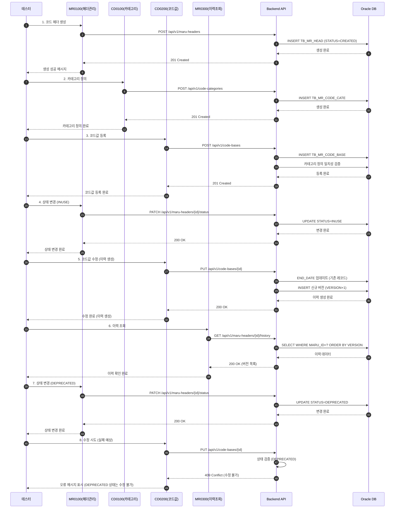
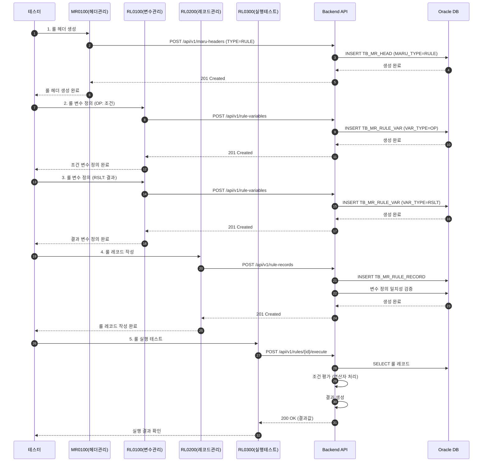
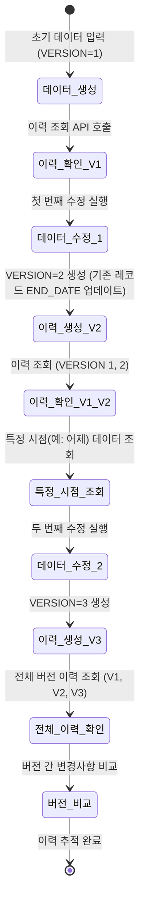

# 📄 상세설계서 - Task 14: 통합 테스트 및 시나리오 검증

**Template Version:** 1.3.0 — **Last Updated:** 2025-10-07

---

## 0. 문서 메타데이터

* 문서명: `Task-14.통합-테스트-및-시나리오-검증(상세설계).md`
* 버전: 1.0
* 작성일: 2025-10-07
* 작성자: Claude (Sonnet 4.5)
* 참조 문서:
  - `./docs/project/maru/00.foundation/01.project-charter/tasks.md`
  - `./docs/project/maru/00.foundation/01.project-charter/business-requirements.md`
  - `./docs/project/maru/00.foundation/01.project-charter/technical-requirements.md`
  - 모든 화면별 상세설계서 (Task 3~13)
* 위치: `./docs/project/maru/10.design/12.detail-design/`
* 관련 이슈/티켓: Task-14
* 상위 요구사항 문서/ID: BRD - 전체 시스템 검증
* 요구사항 추적 담당자: 시스템 아키텍트
* 추적성 관리 도구: tasks.md

---

## 1. 목적 및 범위

### 1.1 목적
MARU 시스템의 **전체 통합 테스트 및 시나리오 검증**을 통해 다음을 확인합니다:
- Frontend(Nexacro N V24) - Backend(Node.js) - Database(Oracle) 간 완전한 연동
- 실제 사용자 워크플로우 기반 E2E 시나리오 정상 동작
- 성능 요구사항 충족 및 최적화
- 에러 처리 및 예외 상황 대응 능력

### 1.2 범위

**포함 사항**:
- Frontend-Backend 통합 테스트 (모든 화면: MR0100, MR0200, MR0300, CD0100, CD0200, CD0300, RL0100, RL0200, RL0300, CM0100)
- 사용자 시나리오 기반 E2E 테스트
  - 코드 생성 → 수정 → 상태 변경 시나리오
  - 룰 생성 → 변수 정의 → 실행 테스트 시나리오
  - 이력 조회 및 추적 시나리오
- 성능 테스트 및 최적화 검증
- 에러 처리 및 예외 상황 테스트
- Playwright MCP 기반 자동화 테스트

**제외 사항**:
- 단위 테스트 (각 모듈별 개별 테스트)
- 보안 침투 테스트 (PoC 범위 외)
- 부하 테스트 (PoC 범위 외)
- 다국어/접근성 테스트 (PoC 범위 외)

---

## 2. 요구사항 & 승인 기준 (Acceptance Criteria)

### 2.1. 요구사항
* 요구사항 원본 링크: [tasks.md - Task 14]

#### 기능 요구사항

**[REQ-001] Frontend-Backend 통합 테스트**
- 모든 화면(10개)에서 Frontend-Backend API 연동이 정상 동작해야 함
- 각 화면의 CRUD 기능이 완전히 동작해야 함
- 데이터 송수신 형식(JSON)이 일치해야 함

**[REQ-002] 코드 관리 E2E 시나리오**
- 코드 헤더 생성(CREATED) → 카테고리 정의 → 코드값 등록 → 상태 변경(INUSE) → 수정(이력 생성) → 상태 변경(DEPRECATED) 전체 플로우가 정상 동작해야 함
- 상태별 수정 정책(CREATED: 직접 수정, INUSE: 이력 생성, DEPRECATED: 수정 불가)이 정확히 적용되어야 함

**[REQ-003] 룰 관리 E2E 시나리오**
- 룰 헤더 생성 → 룰 변수 정의(OP/RSLT) → 룰 레코드 작성 → 룰 실행 테스트 전체 플로우가 정상 동작해야 함
- 연산자(=, !=, <, >, <=, >=, BETWEEN, IN, NOT_IN, NOT_CHECK, SCRIPT)가 정확히 동작해야 함

**[REQ-004] 이력 조회 및 추적 시나리오**
- 모든 데이터 변경사항이 선분 이력 모델로 기록되어야 함
- 특정 시점 데이터 조회가 정확해야 함
- 버전별 변경사항 추적이 가능해야 함

#### 비기능 요구사항

**[REQ-005] 성능 요구사항 충족**
- 단순 조회: < 500ms
- 복잡 조회: < 1초
- 데이터 수정: < 1초
- 대량 데이터 조회(1000건): < 3초

**[REQ-006] 에러 처리 및 복구**
- 모든 API 오류 상황에서 적절한 HTTP 상태 코드와 에러 메시지 반환
- Frontend에서 오류 메시지를 사용자에게 명확히 표시
- 네트워크 장애 시 재시도 로직 동작
- 데이터베이스 연결 실패 시 적절한 에러 처리

**[REQ-007] 데이터 무결성 검증**
- 코드 카테고리 정의와 실제 코드값 일치성 검증
- 중복 코드 검증
- 필수 값 검증
- 날짜 범위 검증(START_DATE < END_DATE)

#### 승인 기준 (테스트 통과 조건)
- [ ] 10개 화면 모두에서 Frontend-Backend 통합 테스트 100% 통과
- [ ] 3개 주요 E2E 시나리오 (코드 관리, 룰 관리, 이력 조회) 100% 통과
- [ ] 모든 성능 테스트 목표치 달성
- [ ] 에러 처리 테스트 100% 통과
- [ ] 데이터 무결성 검증 테스트 100% 통과

### 2.2. 요구사항-설계 추적 매트릭스

| 요구사항 ID | 요구사항 설명 | 설계 섹션/아티팩트 | 테스트 케이스 ID | 상태 | 비고 |
|-------------|---------------|--------------------|------------------|------|------|
| REQ-001 | Frontend-Backend 통합 테스트 | §5.1, §13-1 | TC-INT-001 ~ TC-INT-010 | 초안 | 10개 화면 |
| REQ-002 | 코드 관리 E2E 시나리오 | §5.2, §13-2 | TS-E2E-001 | 초안 | |
| REQ-003 | 룰 관리 E2E 시나리오 | §5.2, §13-2 | TS-E2E-002 | 초안 | |
| REQ-004 | 이력 조회 및 추적 시나리오 | §5.2, §13-2 | TS-E2E-003 | 초안 | |
| REQ-005 | 성능 요구사항 충족 | §11, §13-4 | TC-PERF-001 ~ TC-PERF-004 | 초안 | |
| REQ-006 | 에러 처리 및 복구 | §9, §13-5 | TC-ERR-001 ~ TC-ERR-005 | 초안 | |
| REQ-007 | 데이터 무결성 검증 | §9, §13-6 | TC-VAL-001 ~ TC-VAL-004 | 초안 | |

---

## 3. 용어/가정/제약

### 3.1 용어 정의
- **통합 테스트**: Frontend-Backend-Database 간 완전한 연동 검증
- **E2E 테스트**: 실제 사용자 워크플로우 기반 종단간 테스트
- **시나리오 테스트**: 복수의 화면과 기능을 연계한 비즈니스 프로세스 테스트
- **Playwright MCP**: Playwright 기반 브라우저 자동화 테스트 도구
- **선분 이력 모델**: START_DATE, END_DATE, VERSION을 활용한 시간 기반 데이터 관리

### 3.2 가정(Assumptions)
- 모든 화면(Task 3~13)의 개발이 완료된 상태에서 통합 테스트 수행
- Nexacro N V24 Frontend가 정상 배포된 상태
- Backend API 서버가 localhost:3000에서 정상 동작
- Oracle Database가 localhost:1521/XE에서 정상 동작
- 테스트용 샘플 데이터가 사전 준비됨

### 3.3 제약(Constraints)
- PoC 환경으로 단일 관리자만 테스트 (인증/권한 테스트 제외)
- Windows 11 localhost 환경에서만 테스트
- 성능 테스트는 단일 사용자 기준 (동시 접속 테스트 제외)
- 보안 침투 테스트 및 부하 테스트는 PoC 범위 외

---

## 4. 시스템/모듈 개요

### 4.1 역할 및 책임

**테스트 수행 주체**:
- **자동화 테스트**: Playwright MCP를 통한 브라우저 자동화
- **수동 테스트**: 사람이 직접 수행하는 시나리오 검증
- **성능 테스트**: Playwright Performance API 및 수동 측정
- **데이터 검증**: SQL 쿼리를 통한 데이터 무결성 확인

**테스트 대상 시스템**:
```
Frontend (Nexacro N V24) ←→ Backend (Node.js + Express) ←→ Database (Oracle)
       ↓                              ↓                           ↓
  10개 화면                      REST API                    선분 이력 모델
  (MR/CD/RL/CM)               (JSON 통신)                  (버전 관리)
```

### 4.2 외부 의존성
- **Nexacro N V24**: Frontend 플랫폼
- **Node.js v24.x**: Backend Runtime
- **Express v5.1.0**: Backend Framework
- **Oracle Database 21c**: Database
- **Playwright MCP**: 브라우저 자동화 도구
- **node-cache**: 캐시 레이어

### 4.3 테스트 범위

**화면별 통합 테스트 대상**:
1. **MR0100** - 마루 헤더 관리 (Task 3.1, 3.2)
2. **MR0200** - 마루 현황 조회 (Task 4.1, 4.2)
3. **MR0300** - 마루 이력 조회 (Task 5.1, 5.2)
4. **CD0100** - 코드 카테고리 관리 (Task 6.1, 6.2)
5. **CD0200** - 코드 기본값 관리 (Task 7.1, 7.2)
6. **CD0300** - 코드 검증 관리 (Task 8.1, 8.2)
7. **RL0100** - 룰 변수 관리 (Task 9.1, 9.2)
8. **RL0200** - 룰 레코드 관리 (Task 10.1, 10.2)
9. **RL0300** - 룰 실행 테스트 (Task 11.1, 11.2)
10. **CM0100** - 메인 화면 (Task 12.1, 12.2)

---

## 5. 프로세스 흐름

### 5.1 통합 테스트 프로세스 설명

#### 단계별 프로세스 [REQ-001]

1. **테스트 환경 준비**
   - Database 초기화 및 샘플 데이터 투입
   - Backend API 서버 구동 확인
   - Frontend Nexacro 서버 구동 확인

2. **화면별 통합 테스트 수행**
   - 각 화면의 CRUD 기능 테스트
   - API 호출 및 응답 검증
   - Dataset 바인딩 및 UI 업데이트 확인

3. **E2E 시나리오 테스트 수행**
   - 코드 관리 전체 플로우 테스트
   - 룰 관리 전체 플로우 테스트
   - 이력 조회 및 추적 플로우 테스트

4. **성능 테스트 수행**
   - 각 API 응답 시간 측정
   - 대량 데이터 처리 성능 측정
   - 캐시 효과 검증

5. **에러 처리 테스트 수행**
   - 네트워크 오류 시나리오
   - 데이터 검증 실패 시나리오
   - Database 연결 실패 시나리오

6. **테스트 결과 분석 및 보고**
   - 통과/실패 현황 집계
   - 결함(Defect) 분석 및 수정
   - 재테스트 수행

### 5.2. E2E 시나리오 프로세스 설계 개념도 (Mermaid)

#### 시나리오 1: 코드 관리 전체 플로우 [REQ-002]



#### 시나리오 2: 룰 관리 전체 플로우 [REQ-003]



#### 시나리오 3: 이력 조회 및 추적 플로우 [REQ-004]



---

## 6. UI 레이아웃 설계

**Note**: Task 14는 통합 테스트 Task이므로 별도 UI 레이아웃이 없습니다. 각 화면(Task 3~13)의 UI는 해당 Task의 상세설계서를 참조하세요.

---

## 7. 데이터/메시지 구조 (개념 수준)

### 7.1. 테스트 데이터 구조

#### 코드 관리 테스트 데이터
```javascript
// 1. 코드 헤더 생성
{
  "maruId": "TEST_CODE_001",
  "maruName": "테스트 코드 집합",
  "maruType": "CODE",
  "maruStatus": "CREATED",
  "priorityUseYn": "N"
}

// 2. 코드 카테고리 정의
{
  "cateId": "CATE_001",
  "cateType": "Normal",
  "cateDefine": "A,B,C,D",
  "cateNote": "콤마 구분 리스트"
}

// 3. 코드 기본값
{
  "codeId": "CODE_001",
  "codeBase": "A",
  "codeName": "코드 A",
  "sortOrder": 1
}
```

#### 룰 관리 테스트 데이터
```javascript
// 1. 룰 헤더 생성
{
  "maruId": "TEST_RULE_001",
  "maruName": "테스트 룰 집합",
  "maruType": "RULE",
  "priorityUseYn": "Y"
}

// 2. 룰 변수 정의 (조건)
{
  "varId": "VAR_OP_001",
  "varType": "OP",
  "varDataType": "Number",
  "varCondType": "Equal",
  "varSeq": 1
}

// 3. 룰 레코드
{
  "recordId": "REC_001",
  "op_1": "100",
  "op_2": ">",
  "rslt_1": "HIGH",
  "priority": 1
}
```

### 7.2. API 응답 데이터 구조

#### 성공 응답
```javascript
{
  "success": true,
  "data": {
    // 실제 데이터
  },
  "meta": {
    "total": 100,
    "page": 1,
    "limit": 20,
    "timestamp": "2025-10-07T10:00:00Z"
  }
}
```

#### 오류 응답
```javascript
{
  "success": false,
  "error": {
    "code": "VALIDATION_ERROR",
    "message": "입력값이 올바르지 않습니다.",
    "details": [
      {
        "field": "maruName",
        "message": "필수 입력 항목입니다."
      }
    ]
  }
}
```

### 7.3. 선분 이력 데이터 구조

```sql
-- 초기 데이터 (VERSION=1)
MARU_ID='TEST001', VERSION=1, MARU_NAME='초기값',
START_DATE='2025-10-07 10:00:00', END_DATE='9999-12-31 23:59:59'

-- 첫 번째 수정 후 (VERSION=2)
-- 기존 레코드
MARU_ID='TEST001', VERSION=1, MARU_NAME='초기값',
START_DATE='2025-10-07 10:00:00', END_DATE='2025-10-07 11:00:00'

-- 신규 레코드
MARU_ID='TEST001', VERSION=2, MARU_NAME='수정값',
START_DATE='2025-10-07 11:00:00', END_DATE='9999-12-31 23:59:59'
```

---

## 8. 인터페이스 계약(Contract)

### 8.1. 통합 테스트용 API 엔드포인트

**Note**: 모든 API는 각 화면별 상세설계서에 정의되어 있습니다. 여기서는 통합 테스트에서 주로 사용되는 API만 요약합니다.

#### API 1: 마루 헤더 생성 [REQ-001, REQ-002]
- **엔드포인트**: `POST /api/v1/maru-headers`
- **요청 본문**: `{ maruId, maruName, maruType, priorityUseYn }`
- **성공 응답**: `201 Created` + 생성된 객체
- **오류 응답**: `400 Bad Request` (검증 실패), `409 Conflict` (중복)
- **검증 케이스**: TC-INT-001

#### API 2: 마루 헤더 상태 변경 [REQ-002]
- **엔드포인트**: `PATCH /api/v1/maru-headers/{maruId}/status`
- **요청 본문**: `{ newStatus: "CREATED" | "INUSE" | "DEPRECATED" }`
- **성공 응답**: `200 OK`
- **오류 응답**: `409 Conflict` (잘못된 상태 전환)
- **검증 케이스**: TC-INT-001

#### API 3: 코드 기본값 수정 (이력 생성) [REQ-002, REQ-004]
- **엔드포인트**: `PUT /api/v1/code-bases/{codeId}`
- **요청 본문**: `{ codeName, sortOrder, ... }`
- **성공 응답**: `200 OK` + 새 버전 정보
- **오류 응답**: `409 Conflict` (DEPRECATED 상태), `400 Bad Request`
- **검증 케이스**: TC-INT-005

#### API 4: 이력 조회 [REQ-004]
- **엔드포인트**: `GET /api/v1/maru-headers/{maruId}/history`
- **쿼리 파라미터**: `?startDate=YYYY-MM-DD&endDate=YYYY-MM-DD`
- **성공 응답**: `200 OK` + 이력 배열
- **검증 케이스**: TC-INT-003

#### API 5: 룰 실행 [REQ-003]
- **엔드포인트**: `POST /api/v1/rules/{maruId}/execute`
- **요청 본문**: `{ inputData: { op_1: value, op_2: value, ... } }`
- **성공 응답**: `200 OK` + `{ result: { rslt_1: value, ... } }`
- **오류 응답**: `400 Bad Request` (잘못된 입력), `404 Not Found` (룰 없음)
- **검증 케이스**: TC-INT-009

---

## 9. 오류/예외/경계조건

### 9.1. 예상 오류 상황 및 처리 방안 [REQ-006]

#### 네트워크 오류
- **상황**: Frontend-Backend 간 네트워크 단절
- **처리**:
  - Frontend: 재시도 로직 (최대 3회)
  - 사용자에게 "네트워크 오류가 발생했습니다. 재시도 중..." 메시지 표시
  - 재시도 실패 시 "네트워크 연결을 확인해주세요" 안내

#### Database 연결 실패
- **상황**: Backend-Database 간 연결 실패
- **처리**:
  - Backend: Connection Pool 재연결 시도
  - 500 Internal Server Error 반환
  - Frontend: "일시적인 서버 오류입니다. 잠시 후 다시 시도해주세요" 안내

#### 데이터 검증 실패
- **상황**: 입력 데이터가 검증 규칙 미충족
- **처리**:
  - Backend: Joi 스키마 검증 후 400 Bad Request 반환
  - Frontend: 각 필드별 오류 메시지 표시
  - 예: "마루명은 필수 입력 항목입니다"

#### 상태 변경 충돌
- **상황**: 잘못된 상태 전환 시도 (예: DEPRECATED → INUSE)
- **처리**:
  - Backend: 상태 전환 규칙 검증 후 409 Conflict 반환
  - Frontend: "현재 상태에서는 해당 작업을 수행할 수 없습니다" 안내

#### 동시성 충돌
- **상황**: 동일 데이터를 두 사용자가 동시 수정
- **처리**:
  - Backend: Optimistic Locking (VERSION 기반)
  - 409 Conflict 반환
  - Frontend: "다른 사용자가 이미 수정했습니다. 최신 데이터를 확인해주세요"

### 9.2. 경계조건 테스트 [REQ-007]

#### 데이터 범위 검증
- **MIN 값**: 최소값 입력 시 정상 처리 확인
- **MAX 값**: 최대값(VARCHAR2(200)) 입력 시 정상 처리 확인
- **Empty 값**: 빈 문자열 입력 시 적절한 검증 메시지 확인
- **NULL 값**: NULL 입력 시 필수 필드 검증 확인

#### 날짜 범위 검증
- **START_DATE < END_DATE**: 정상 케이스
- **START_DATE = END_DATE**: 경계 케이스 (허용 여부 확인)
- **START_DATE > END_DATE**: 오류 케이스 (검증 실패 확인)

#### 대량 데이터 처리
- **1건**: 정상 처리
- **100건**: 정상 처리 (< 1초)
- **1000건**: 정상 처리 (< 3초)
- **10000건**: 성능 저하 여부 확인 (페이징 필요성 검증)

---

## 10. 보안/품질 고려

### 10.1 보안 고려사항 (PoC 수준)

#### SQL Injection 방지
- **전략**: Parameterized Query (Knex.js 활용)
- **테스트**: 악의적인 SQL 문자열 입력 시 정상 차단 확인
- **예**: `maruName = "'; DROP TABLE TB_MR_HEAD; --"` 입력 시 에러 발생

#### XSS 방지
- **전략**: 입력값 이스케이프 처리
- **테스트**: `<script>alert('XSS')</script>` 입력 시 정상 이스케이프 확인

#### CORS 정책
- **전략**: Backend에서 Frontend 도메인만 허용
- **테스트**: 허용되지 않은 도메인에서 API 호출 시 차단 확인

### 10.2 품질 고려사항

#### 코드 품질
- **표준**: ESLint + Prettier 적용
- **주석**: JSDoc 형식
- **네이밍**: camelCase (변수/함수), PascalCase (클래스)

#### 데이터 품질
- **무결성**: Foreign Key 제약조건 활용
- **일관성**: 코드 카테고리 정의와 실제 값 일치성 검증
- **정확성**: 날짜 범위 검증 (START_DATE < END_DATE)

#### 테스트 커버리지
- **목표**: 통합 테스트 커버리지 80% 이상
- **측정**: 화면별 CRUD 기능 테스트 완료율
- **보고**: 테스트 결과 리포트 생성

---

## 11. 성능 및 확장성(개념)

### 11.1 성능 목표 및 지표 [REQ-005]

#### 응답 시간 목표
| API 유형 | 목표 시간 | 측정 방법 | 테스트 케이스 |
|----------|-----------|-----------|---------------|
| 단순 조회 (GET) | < 500ms | Playwright Performance API | TC-PERF-001 |
| 복잡 조회 (JOIN) | < 1초 | Playwright Performance API | TC-PERF-002 |
| 데이터 수정 (PUT) | < 1초 | Playwright Performance API | TC-PERF-003 |
| 대량 조회 (1000건) | < 3초 | Playwright Performance API | TC-PERF-004 |

#### 처리량 목표 (PoC 수준)
- **동시 사용자**: 1명 (단일 관리자)
- **데이터 규모**: 최대 10,000 레코드
- **페이징**: 기본 20건/페이지

### 11.2 성능 최적화 전략

#### Database 최적화
- **인덱스**: (END_DATE, START_DATE, MARU_ID) 복합 인덱스
- **Query 최적화**: Explain Plan 활용
- **Connection Pool**: min=2, max=10

#### Application 캐시
- **대상**: 마스터 코드 조회 (변경 빈도 낮음)
- **TTL**: 10분 (600초)
- **무효화**: 데이터 수정 시 캐시 삭제

#### Network 최적화
- **gzip 압축**: 활성화
- **JSON 크기**: 불필요한 필드 제거
- **페이징**: 기본 20건, 최대 100건

### 11.3 부하 시나리오 대응 (개념)

#### 예상 부하 시나리오
1. **대량 이력 조회**: 특정 코드의 수백 개 버전 조회
2. **복잡한 룰 실행**: 20개 조건 + 20개 결과 처리
3. **동시 수정**: 여러 사용자가 동일 데이터 수정 (PoC에서는 제외)

#### 대응 전략
- **페이징**: 대량 데이터는 페이징 처리
- **캐시**: 자주 조회되는 데이터 캐싱
- **인덱스**: 조회 성능 향상
- **Optimistic Locking**: 동시성 충돌 방지

---

## 12. 테스트 전략 (TDD 계획)

### 12.1 테스트 레벨

#### Unit Test (개별 모듈 테스트)
- **대상**: Backend API 로직, 데이터 검증 함수
- **도구**: Jest (선택사항, PoC)
- **범위**: Task 14에서는 제외 (각 Task에서 개별 수행)

#### Integration Test (통합 테스트)
- **대상**: Frontend-Backend-Database 연동
- **도구**: Playwright MCP + 수동 테스트
- **범위**: 10개 화면 모두 포함

#### E2E Test (종단간 테스트)
- **대상**: 실제 사용자 시나리오 전체 플로우
- **도구**: Playwright MCP + 수동 테스트
- **범위**: 코드 관리, 룰 관리, 이력 조회 시나리오

#### Performance Test (성능 테스트)
- **대상**: API 응답 시간, 대량 데이터 처리
- **도구**: Playwright Performance API + 수동 측정
- **범위**: 주요 API 대상

### 12.2 테스트 실행 순서

1. **화면별 통합 테스트** (TC-INT-001 ~ TC-INT-010)
   - 각 화면의 CRUD 기능 독립적으로 테스트
   - 통과 기준: 모든 기능 정상 동작

2. **E2E 시나리오 테스트** (TS-E2E-001 ~ TS-E2E-003)
   - 복수 화면 연계 플로우 테스트
   - 통과 기준: 전체 시나리오 완료

3. **성능 테스트** (TC-PERF-001 ~ TC-PERF-004)
   - API 응답 시간 측정
   - 통과 기준: 목표 시간 달성

4. **에러 처리 테스트** (TC-ERR-001 ~ TC-ERR-005)
   - 예외 상황 시나리오 테스트
   - 통과 기준: 적절한 에러 메시지 표시

5. **데이터 검증 테스트** (TC-VAL-001 ~ TC-VAL-004)
   - 데이터 무결성 검증
   - 통과 기준: 검증 규칙 정상 동작

### 12.3 테스트 자동화 전략

#### Playwright MCP 활용
- **브라우저 자동화**: 화면 조작 및 검증 자동화
- **스크린샷**: 시각적 회귀 테스트
- **Performance API**: 응답 시간 자동 측정

#### 수동 테스트
- **복잡한 UI 검증**: 사람의 판단이 필요한 경우
- **사용자 경험 검증**: 직관성, 편의성 평가
- **경계 케이스**: 예외 상황 시나리오

---

## 13. UI 테스트케이스

### 13-1. 화면별 통합 테스트케이스 [REQ-001]

| 테스트 ID | 화면 | 테스트 시나리오 | 실행 단계 | 예상 결과 | 검증 기준 | 우선순위 |
|-----------|------|-----------------|-----------|-----------|-----------|----------|
| TC-INT-001 | MR0100 | 마루 헤더 CRUD 테스트 | 1. 목록 조회<br>2. 신규 생성<br>3. 상세 조회<br>4. 수정<br>5. 삭제 | 모든 기능 정상 동작 | API 응답 200/201, UI 업데이트 확인 | High |
| TC-INT-002 | MR0200 | 마루 현황 조회 및 통계 | 1. 필터 조건 설정<br>2. 목록 조회<br>3. 통계 조회<br>4. 캐시 무효화 | 정확한 데이터 표시 | 필터 적용 확인, 통계 정확성 검증 | High |
| TC-INT-003 | MR0300 | 마루 이력 조회 | 1. 이력 목록 조회<br>2. 특정 버전 조회<br>3. 버전 비교 | 이력 데이터 정확 표시 | 버전별 데이터 일치성 확인 | High |
| TC-INT-004 | CD0100 | 코드 카테고리 CRUD | 1. 카테고리 생성<br>2. 타입 선택 (Normal/RegEx)<br>3. 정의 입력<br>4. 수정/삭제 | 모든 기능 정상 동작 | 카테고리 타입별 검증 확인 | High |
| TC-INT-005 | CD0200 | 코드 기본값 CRUD | 1. 코드값 생성<br>2. 다국어 입력<br>3. 순번 변경<br>4. 수정/삭제 | 모든 기능 정상 동작 | 카테고리 일치성 검증 확인 | High |
| TC-INT-006 | CD0300 | 코드 검증 관리 | 1. 검증 실행<br>2. 결과 확인<br>3. 오류 상세 확인 | 검증 결과 정확 표시 | 일치성 검증 로직 확인 | Medium |
| TC-INT-007 | RL0100 | 룰 변수 CRUD | 1. OP 변수 생성<br>2. RSLT 변수 생성<br>3. 순서 변경<br>4. 수정/삭제 | 모든 기능 정상 동작 | 변수 타입별 처리 확인 | High |
| TC-INT-008 | RL0200 | 룰 레코드 CRUD | 1. 레코드 생성<br>2. 조건/결과 입력<br>3. 우선순위 변경<br>4. 수정/삭제 | 모든 기능 정상 동작 | 변수 정의 일치성 검증 | High |
| TC-INT-009 | RL0300 | 룰 실행 테스트 | 1. 테스트 데이터 입력<br>2. 룰 실행<br>3. 결과 확인 | 정확한 결과 반환 | 연산자별 로직 확인 | High |
| TC-INT-010 | CM0100 | 메인 화면 대시보드 | 1. 대시보드 로드<br>2. 통계 확인<br>3. 메뉴 네비게이션 | 정상 로드 및 표시 | 통계 정확성 확인 | Medium |

### 13-2. E2E 사용자 시나리오 테스트케이스 [REQ-002, REQ-003, REQ-004]

| 시나리오 ID | 시나리오 명 | 사전 조건 | 실행 단계 | 예상 결과 | 후처리 | 실행 방법 |
|-------------|-------------|-----------|-----------|-----------|--------|-----------|
| TS-E2E-001 | 코드 생성→수정→상태 변경 전체 플로우 | Database 초기화 완료 | 1. MR0100: 헤더 생성 (CREATED)<br>2. CD0100: 카테고리 정의<br>3. CD0200: 코드값 등록<br>4. MR0100: 상태→INUSE<br>5. CD0200: 코드값 수정 (이력 생성)<br>6. MR0300: 이력 조회<br>7. MR0100: 상태→DEPRECATED<br>8. CD0200: 수정 시도 (실패) | 전체 플로우 정상 완료<br>이력 정확 생성<br>DEPRECATED 수정 차단 | 테스트 데이터 삭제 | MCP + 수동 |
| TS-E2E-002 | 룰 생성→변수 정의→실행 테스트 플로우 | Database 초기화 완료 | 1. MR0100: 룰 헤더 생성 (TYPE=RULE)<br>2. RL0100: OP 변수 정의<br>3. RL0100: RSLT 변수 정의<br>4. RL0200: 룰 레코드 작성<br>5. RL0300: 룰 실행 테스트<br>6. 결과 검증 | 전체 플로우 정상 완료<br>룰 실행 결과 정확 | 테스트 데이터 삭제 | MCP + 수동 |
| TS-E2E-003 | 이력 조회 및 추적 플로우 | 테스트 데이터 사전 준비 | 1. 초기 데이터 생성 (V1)<br>2. MR0300: 이력 조회 (V1)<br>3. 데이터 수정 (V2 생성)<br>4. MR0300: 이력 조회 (V1, V2)<br>5. 특정 시점 조회<br>6. 데이터 수정 (V3 생성)<br>7. MR0300: 전체 이력 조회<br>8. 버전 비교 | 이력 정확 생성<br>버전별 데이터 일치<br>특정 시점 조회 정확 | 테스트 데이터 삭제 | MCP + 수동 |

### 13-3. 성능 테스트케이스 [REQ-005]

| 테스트 ID | 성능 지표 | 측정 방법 | 목표 기준 | 측정 도구 | 실행 조건 |
|-----------|-----------|-----------|-----------|-----------|-----------|
| TC-PERF-001 | 단순 조회 응답 시간 | GET /api/v1/maru-headers | < 500ms | Playwright Performance API | 표준 네트워크 |
| TC-PERF-002 | 복잡 조회 응답 시간 | GET /api/v1/maru-headers/{id}/history (JOIN) | < 1초 | Playwright Performance API | 표준 네트워크 |
| TC-PERF-003 | 데이터 수정 응답 시간 | PUT /api/v1/code-bases/{id} (이력 생성) | < 1초 | Playwright Performance API | 표준 네트워크 |
| TC-PERF-004 | 대량 데이터 조회 | GET /api/v1/maru-headers?limit=1000 | < 3초 | Playwright Performance API | 1000건 데이터 준비 |

### 13-4. 에러 처리 테스트케이스 [REQ-006]

| 테스트 ID | 테스트 시나리오 | 오류 유발 방법 | 예상 결과 | 검증 기준 |
|-----------|-----------------|----------------|-----------|-----------|
| TC-ERR-001 | 네트워크 오류 처리 | Backend 서버 중지 후 API 호출 | Frontend: "네트워크 오류" 메시지 표시<br>재시도 로직 동작 | 3회 재시도 확인 |
| TC-ERR-002 | Database 연결 실패 | Database 중지 후 API 호출 | Backend: 500 Internal Server Error<br>Frontend: "서버 오류" 메시지 | 적절한 에러 메시지 |
| TC-ERR-003 | 데이터 검증 실패 | 필수 필드 누락 후 저장 시도 | Backend: 400 Bad Request<br>Frontend: 필드별 검증 메시지 | Joi 검증 동작 확인 |
| TC-ERR-004 | 상태 변경 충돌 | DEPRECATED 상태에서 수정 시도 | Backend: 409 Conflict<br>Frontend: "수정 불가" 메시지 | 상태 검증 로직 확인 |
| TC-ERR-005 | 동시성 충돌 | 동일 데이터를 동시 수정 | Backend: 409 Conflict<br>Frontend: "다른 사용자가 수정" 메시지 | Optimistic Locking 확인 |

### 13-5. 데이터 무결성 검증 테스트케이스 [REQ-007]

| 테스트 ID | 검증 항목 | 테스트 방법 | 예상 결과 | 검증 SQL |
|-----------|-----------|-------------|-----------|----------|
| TC-VAL-001 | 코드 카테고리 일치성 | 카테고리 정의 외 코드값 입력 | 400 Bad Request (검증 실패) | `SELECT * WHERE CODE_BASE NOT IN (CATE_DEFINE)` |
| TC-VAL-002 | 중복 코드 검증 | 동일 MARU_ID + CODE_BASE 입력 | 409 Conflict (중복) | `SELECT COUNT(*) WHERE MARU_ID=? AND CODE_BASE=?` |
| TC-VAL-003 | 필수 값 검증 | MARU_NAME NULL 입력 | 400 Bad Request | Joi 스키마 검증 |
| TC-VAL-004 | 날짜 범위 검증 | START_DATE > END_DATE 입력 | 400 Bad Request | `CHECK (START_DATE < END_DATE)` |

### 13-6. Playwright MCP 자동화 스크립트 가이드

#### 기본 실행 패턴

```javascript
// 1. 브라우저 실행 및 페이지 로드
await mcp__playwright__browser_navigate({ url: 'http://localhost:8080/MR0100.xfdl' });
await mcp__playwright__browser_wait_for({ time: 2 }); // 2초 대기

// 2. 요소 상호작용
await mcp__playwright__browser_type({
  element: '마루명 입력필드',
  ref: '[data-testid="maruName-input"]',
  text: '테스트 코드 집합'
});

await mcp__playwright__browser_click({
  element: '저장 버튼',
  ref: '[data-testid="save-button"]'
});

// 3. 결과 검증
await mcp__playwright__browser_wait_for({ text: '저장되었습니다' });

// 4. 스크린샷 캡처
await mcp__playwright__browser_take_screenshot({
  filename: 'test-result-MR0100-create.png'
});

// 5. 성능 측정
// Performance API는 Playwright 내장 기능 활용
```

#### E2E 시나리오 자동화 예시 (TS-E2E-001)

```javascript
// 시나리오: 코드 생성→수정→상태 변경 전체 플로우

// 1. MR0100: 헤더 생성
await mcp__playwright__browser_navigate({ url: 'http://localhost:8080/MR0100.xfdl' });
await mcp__playwright__browser_click({ element: '신규 버튼', ref: '[data-testid="new-button"]' });
await mcp__playwright__browser_type({ element: '마루ID', ref: '[data-testid="maruId"]', text: 'TEST_CODE_001' });
await mcp__playwright__browser_type({ element: '마루명', ref: '[data-testid="maruName"]', text: '테스트 코드 집합' });
await mcp__playwright__browser_click({ element: '저장 버튼', ref: '[data-testid="save"]' });
await mcp__playwright__browser_wait_for({ text: '저장되었습니다' });

// 2. CD0100: 카테고리 정의
await mcp__playwright__browser_navigate({ url: 'http://localhost:8080/CD0100.xfdl' });
await mcp__playwright__browser_click({ element: '신규 버튼', ref: '[data-testid="new-button"]' });
await mcp__playwright__browser_type({ element: '카테고리 정의', ref: '[data-testid="cateDefine"]', text: 'A,B,C,D' });
await mcp__playwright__browser_click({ element: '저장 버튼', ref: '[data-testid="save"]' });
await mcp__playwright__browser_wait_for({ text: '저장되었습니다' });

// 3. CD0200: 코드값 등록
await mcp__playwright__browser_navigate({ url: 'http://localhost:8080/CD0200.xfdl' });
await mcp__playwright__browser_click({ element: '신규 버튼', ref: '[data-testid="new-button"]' });
await mcp__playwright__browser_type({ element: '코드값', ref: '[data-testid="codeBase"]', text: 'A' });
await mcp__playwright__browser_type({ element: '코드명', ref: '[data-testid="codeName"]', text: '코드 A' });
await mcp__playwright__browser_click({ element: '저장 버튼', ref: '[data-testid="save"]' });
await mcp__playwright__browser_wait_for({ text: '저장되었습니다' });

// 4. MR0100: 상태→INUSE
await mcp__playwright__browser_navigate({ url: 'http://localhost:8080/MR0100.xfdl' });
// ... (계속)
```

### 13-7. 수동 테스트 체크리스트

#### 일반 기능 검증
- [ ] 모든 화면에서 CRUD 기능이 정상 동작
- [ ] 데이터 입력 후 저장 시 적절한 성공 메시지 표시
- [ ] 오류 발생 시 명확한 오류 메시지 표시
- [ ] 필수 필드 누락 시 검증 메시지 표시

#### 선분 이력 모델 검증
- [ ] 데이터 수정 시 VERSION이 자동 증가
- [ ] 기존 레코드의 END_DATE가 정확히 업데이트
- [ ] 이력 조회 시 모든 버전이 시간 순서대로 표시
- [ ] 특정 시점 조회 시 해당 시점의 유효 데이터만 반환

#### 상태 관리 검증
- [ ] CREATED 상태: 직접 수정 가능
- [ ] INUSE 상태: 이력 생성을 통한 수정만 가능
- [ ] DEPRECATED 상태: 수정 불가, 적절한 오류 메시지 표시
- [ ] 상태 전환 규칙 준수 (CREATED → INUSE → DEPRECATED)

#### 데이터 검증
- [ ] 코드 카테고리 정의와 실제 코드값 일치성 검증
- [ ] 중복 코드 입력 시 오류 메시지 표시
- [ ] 날짜 범위 검증 (START_DATE < END_DATE)
- [ ] 필수 필드 검증

#### 성능 검증
- [ ] 단순 조회 < 500ms
- [ ] 복잡 조회 < 1초
- [ ] 데이터 수정 < 1초
- [ ] 대량 데이터 조회 (1000건) < 3초

---

## 부록: 테스트 실행 가이드

### A. 테스트 환경 준비

#### 1. Database 초기화
```sql
-- 모든 테이블 데이터 삭제
TRUNCATE TABLE TB_MR_RULE_RECORD;
TRUNCATE TABLE TB_MR_RULE_VAR;
TRUNCATE TABLE TB_MR_CODE_BASE;
TRUNCATE TABLE TB_MR_CODE_CATE;
TRUNCATE TABLE TB_MR_HEAD;

-- 샘플 데이터 투입 (선택사항)
-- INSERT INTO ...
```

#### 2. Backend 서버 구동
```bash
cd backend
npm install
npm start
# 확인: http://localhost:3000/health
```

#### 3. Frontend 서버 구동
```bash
cd frontend
# Nexacro 서버 구동
# 확인: http://localhost:8080
```

### B. Playwright MCP 테스트 실행

#### 화면별 통합 테스트 실행
```bash
# MR0100 통합 테스트
playwright test tests/integration/MR0100.spec.js

# 모든 통합 테스트
playwright test tests/integration/
```

#### E2E 시나리오 테스트 실행
```bash
# 코드 관리 E2E 시나리오
playwright test tests/e2e/code-management-flow.spec.js

# 모든 E2E 테스트
playwright test tests/e2e/
```

#### 성능 테스트 실행
```bash
playwright test tests/performance/
```

### C. 테스트 결과 보고서

#### 보고서 생성
```bash
playwright show-report
```

#### 보고서 형식
- **HTML 리포트**: 테스트 실행 결과, 스크린샷, 성능 지표
- **JSON 리포트**: 자동화된 분석용
- **CSV 리포트**: 요구사항 추적 매트릭스 업데이트용

---

**문서 승인**

| 역할 | 이름 | 서명 | 날짜 |
|------|------|------|------|
| QA 리더 | | | |
| 시스템 아키텍트 | | | |
| 개발팀 리더 | | | |

---

**참고 문헌**
- Playwright Documentation
- Nexacro N V24 Testing Guide
- MARU 시스템 상세설계서 (Task 3~13)
- Business Requirements Document (BRD)
- Technical Requirements Document (TRD)
