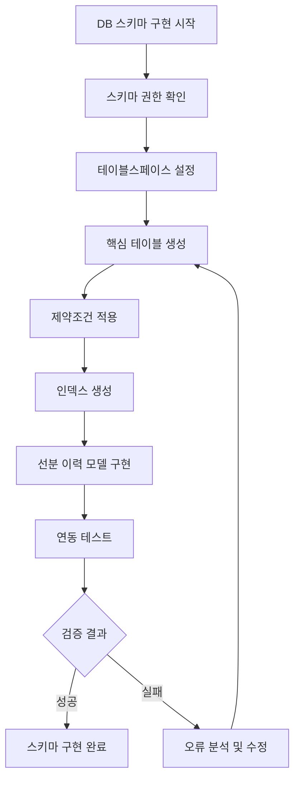

# Task 2 데이터베이스 스키마 구현 상세설계서

**Template Version:** 1.2.0 — **Last Updated:** 2025-09-22

---

## 0. 문서 메타데이터

* 문서명: `Task 2 데이터베이스 스키마 구현.md`
* 버전/작성일/작성자: v1.1 / 2025-09-22 / Claude Code
* 참조 문서:
  - `./docs/project/maru/00.foundation/02.design-baseline/2. database-design.md`
  - `./docs/project/maru/00.foundation/01.project-charter/technical-requirements.md`
  - `./docs/project/maru/00.foundation01.project-charter/tasks.md`
* 위치: `./docs\project\maru\10.design\12.detail-design/`
* 관련 이슈/티켓: Task 2 (데이터베이스 스키마 구현)

---

## 1. 목적 및 범위

### 1.1 목적
MARU 시스템의 핵심 데이터 구조를 Oracle Database에 구현하여 마스터 코드 및 비즈니스 룰 관리를 위한 데이터 저장소를 구축한다.

### 1.2 범위(포함/제외)
**포함:**
- 코어 테이블 생성 (TB_MR_HEAD, TB_MR_CODE_CATE, TB_MR_CODE_BASE)
- 룰 관리 테이블 생성 (TB_MR_RULE_VAR, TB_MR_RULE_RECORD)
- 선분 이력 모델 적용 (START_DATE, END_DATE)
- 인덱스 및 제약조건 설정
- 데이터베이스 연동 설정 및 테스트

**제외:**
- 프로덕션 환경 튜닝
- 백업 및 복구 전략 구현
- 고급 보안 기능 (암호화, 마스킹)

---

## 2. 요구사항 & 승인 기준 (Acceptance Criteria)

### 2.1 기능 요구사항
- 모든 핵심 테이블 (5개) 정상 생성
- 선분 이력 모델 완전 구현
- 참조 무결성 제약조건 적용
- 성능 최적화 인덱스 생성
- 데이터베이스 연결 및 기본 CRUD 테스트 통과

### 2.2 비기능 요구사항
- **성능**: 기본 조회 쿼리 < 100ms
- **안정성**: 데이터 무결성 100% 보장
- **확장성**: 1,000만 건 이상 데이터 처리 가능
- **가용성**: 개발 환경 99% 가용성

### 2.3 승인 기준
- 모든 테이블 DDL 스크립트 실행 성공
- 제약조건 검증 테스트 100% 통과
- 선분 이력 모델 동작 검증 완료
- 인덱스 성능 테스트 통과
- Node.js에서 데이터베이스 연결 및 쿼리 실행 성공

---

## 3. 용어/가정/제약

### 3.1 용어 정의
- **선분 이력 모델**: START_DATE와 END_DATE로 데이터의 유효 기간을 관리하는 방식
- **마루(MARU)**: Master Code와 Rule의 집합체
- **코드 카테고리**: 코드값의 분류 및 검증 규칙
- **룰 변수**: 비즈니스 룰의 조건 및 결과 변수

### 3.2 가정(Assumptions)
- Oracle Database 21c XE 설치 완료
- 충분한 테이블스페이스 용량 확보
- 개발용 스키마 권한 보유
- 네트워크 연결 안정성 확보

### 3.3 제약(Constraints)
- Oracle XE 버전의 메모리 및 저장소 제한
- 개발 환경 전용 설정 (프로덕션 비적용)
- 단일 스키마 내 테이블 생성 제한

---

## 4. 시스템/모듈 개요

### 4.1 역할 및 책임
- **TB_MR_HEAD**: 마루 헤더 정보 관리 및 버전 제어
- **TB_MR_CODE_CATE**: 코드 분류 및 검증 규칙 관리
- **TB_MR_CODE_BASE**: 실제 코드값 및 다국어 지원
- **TB_MR_RULE_VAR**: 비즈니스 룰 변수 정의
- **TB_MR_RULE_RECORD**: 비즈니스 룰 실행 데이터

### 4.2 외부 의존성
- **Oracle Database 21c**: 데이터 저장소
- **Node.js oracledb 드라이버**: 데이터베이스 연결
- **knex.js**: SQL 빌더 및 마이그레이션

### 4.3 상호작용 개요
```
Application Layer
       ↓ SQL/JDBC
┌─────────────────────────────┐
│        Oracle Database     │
├─────────────────────────────┤
│  TB_MR_HEAD (헤더)     │
│  TB_MR_CODE_CATE (카테고리)  │
│  TB_MR_CODE_BASE (기본값)    │
│  TB_MR_RULE_VAR (룰변수)     │
│  TB_MR_RULE_RECORD (룰레코드) │
└─────────────────────────────┘
```

---

## 5. 프로세스 흐름(자연어 설명)

1. **테이블 생성 단계**
   - 스키마 권한 확인 및 테이블스페이스 설정
   - 핵심 테이블 5개 순차적 생성
   - 컬럼 타입 및 크기 적용

2. **제약조건 적용 단계**
   - Primary Key 제약조건 생성
   - Foreign Key 참조 무결성 설정
   - Check 제약조건을 통한 도메인 무결성 보장
   - Unique 제약조건 적용

3. **인덱스 생성 단계**
   - 선분 이력 조회 최적화 인덱스
   - 성능 향상을 위한 복합 인덱스
   - 조회 패턴 기반 커버링 인덱스

4. **선분 이력 모델 구현 단계**
   - 기본값 설정 (START_DATE, END_DATE)
   - 이력 관리 트리거 또는 로직 구현
   - 시점별 데이터 조회 뷰 생성

5. **연동 테스트 단계**
   - Node.js 연결 테스트
   - 기본 CRUD 오퍼레이션 검증
   - 성능 및 무결성 테스트

### 5-1. 프로세스 설계 개념도 (Mermaid)



---

## 6. 데이터베이스 스키마 설계

### 6.1 테이블 관계도 (Text Art)

```
TB_MR_HEAD (마루 헤더)
       │
       ├─── TB_MR_CODE_CATE (코드 카테고리)
       │           │
       │           └─── TB_MR_CODE_BASE (코드 기본값)
       │
       ├─── TB_MR_RULE_VAR (룰 변수)
       │
       └─── TB_MR_RULE_RECORD (룰 레코드)
```

### 6.2 핵심 테이블 구조

#### 6.2.1 TB_MR_HEAD (마루 헤더)
```sql
CREATE TABLE TB_MR_HEAD (
    MARU_ID         VARCHAR2(50)    NOT NULL,
    VERSION         NUMBER(10,0)    NOT NULL,
    MARU_NAME       VARCHAR2(200)   NOT NULL,
    MARU_STATUS     VARCHAR2(20)    DEFAULT 'CREATED' NOT NULL,
    MARU_TYPE       VARCHAR2(10)    NOT NULL,
    PRIORITY_USE_YN CHAR(1)         DEFAULT 'N' NOT NULL,
    START_DATE      TIMESTAMP       DEFAULT CURRENT_TIMESTAMP NOT NULL,
    END_DATE        TIMESTAMP       DEFAULT TO_TIMESTAMP('9999-12-31 23:59:59', 'YYYY-MM-DD HH24:MI:SS') NOT NULL
);
```

#### 6.2.2 TB_MR_CODE_CATE (코드 카테고리)
```sql
CREATE TABLE TB_MR_CODE_CATE (
    MARU_ID         VARCHAR2(50)    NOT NULL,
    CATEGORY_ID     VARCHAR2(50)    NOT NULL,
    VERSION         NUMBER(10,0)    NOT NULL,
    CATEGORY_NAME   VARCHAR2(200)   NOT NULL,
    CODE_TYPE       VARCHAR2(20)    NOT NULL,
    CODE_DEFINITION VARCHAR2(4000)  NOT NULL,
    START_DATE      TIMESTAMP       DEFAULT CURRENT_TIMESTAMP NOT NULL,
    END_DATE        TIMESTAMP       DEFAULT TO_TIMESTAMP('9999-12-31 23:59:59', 'YYYY-MM-DD HH24:MI:SS') NOT NULL
);
```

#### 6.2.3 TB_MR_CODE_BASE (코드 기본값)
```sql
CREATE TABLE TB_MR_CODE_BASE (
    MARU_ID         VARCHAR2(50)    NOT NULL,
    CODE            VARCHAR2(100)   NOT NULL,
    VERSION         NUMBER(10,0)    NOT NULL,
    CODE_NAME       VARCHAR2(200)   NOT NULL,
    SORT_ORDER      NUMBER(10,0)    DEFAULT 0,
    ALTER_CODE_NAME1 VARCHAR2(200),
    ALTER_CODE_NAME2 VARCHAR2(200),
    ALTER_CODE_NAME3 VARCHAR2(200),
    ALTER_CODE_NAME4 VARCHAR2(200),
    ALTER_CODE_NAME5 VARCHAR2(200),
    START_DATE      TIMESTAMP       DEFAULT CURRENT_TIMESTAMP NOT NULL,
    END_DATE        TIMESTAMP       DEFAULT TO_TIMESTAMP('9999-12-31 23:59:59', 'YYYY-MM-DD HH24:MI:SS') NOT NULL
);
```

---

## 7. 데이터/메시지 구조 (개념 수준)

### 7.1 선분 이력 데이터 구조
```json
{
  "현재 유효 데이터": {
    "startDate": "2025-01-01T00:00:00Z",
    "endDate": "9999-12-31T23:59:59Z",
    "status": "CURRENT"
  },
  "이력 데이터": {
    "startDate": "2024-01-01T00:00:00Z",
    "endDate": "2024-12-31T23:59:59Z",
    "status": "HISTORICAL"
  }
}
```

### 7.2 제약조건 검증 데이터
```json
{
  "validation": {
    "primaryKey": "MARU_ID + VERSION",
    "foreignKey": "PARENT_MARU_ID 참조",
    "checkConstraint": "STATUS IN ('CREATED', 'INUSE', 'DEPRECATED')",
    "notNull": "필수 컬럼 값 존재 여부"
  }
}
```

---

## 8. 인터페이스 계약(Contract)

### 8.1 데이터베이스 연결 인터페이스
- **목적**: Node.js에서 Oracle Database 연결
- **입력**: 연결 문자열, 사용자 인증 정보
- **출력**: 연결 객체 또는 오류 메시지
- **성공 조건**: 정상적인 데이터베이스 연결 및 권한 확인
- **오류 조건**: 인증 실패, 네트워크 오류, 권한 부족

### 8.2 CRUD 오퍼레이션 인터페이스
- **CREATE**: INSERT 문을 통한 데이터 생성
- **READ**: SELECT 문을 통한 데이터 조회 (시점별 조회 포함)
- **UPDATE**: 선분 이력 모델 기반 데이터 갱신
- **DELETE**: 논리적 삭제 (END_DATE 갱신)

---

## 9. 오류/예외/경계조건

### 9.1 예상 오류 상황
- **테이블 생성 실패**: 권한 부족, 이름 중복, 문법 오류
- **제약조건 위반**: PK 중복, FK 참조 오류, 도메인 값 위반
- **인덱스 생성 실패**: 메모리 부족, 테이블스페이스 부족
- **데이터 무결성 오류**: 선분 이력 겹침, 참조 무결성 위반

### 9.2 처리 방안
- **생성 실패**: DDL 스크립트 검증, 권한 재확인
- **제약조건 위반**: 데이터 검증 로직 강화, 사전 체크
- **성능 저하**: 인덱스 재구성, 통계 정보 갱신
- **무결성 오류**: 트랜잭션 롤백, 데이터 정합성 체크

---

## 10. 보안/품질 고려

### 10.1 보안 고려사항
- **접근 제어**: 스키마별 사용자 권한 분리
- **데이터 보호**: 민감 정보 컬럼 식별 및 보호
- **감사 로그**: 데이터 변경 이력 추적
- **백업 보안**: 백업 파일 암호화 (향후)

### 10.2 품질 고려사항
- **데이터 품질**: Check 제약조건을 통한 도메인 검증
- **성능 품질**: 적절한 인덱스 설계 및 쿼리 최적화
- **유지보수성**: 명확한 컬럼명 및 주석 적용
- **확장성**: 향후 컬럼 추가를 고려한 여유 공간

---

## 11. 성능 및 확장성(개념)

### 11.1 목표/지표
- **조회 성능**: 단일 레코드 조회 < 10ms
- **삽입 성능**: 배치 삽입 1,000건/초
- **저장 용량**: 테이블당 최대 1억 건 수용
- **동시 사용자**: 개발 환경 10명 동시 접속

### 11.2 성능 최적화 전략
- **인덱스 전략**: 조회 패턴 기반 복합 인덱스
- **파티셔닝**: 대용량 테이블 월별 파티션 (향후)
- **캐시 활용**: 자주 조회되는 마스터 데이터 캐싱
- **쿼리 최적화**: 실행 계획 분석 및 힌트 활용

---

## 12. 테스트 전략 (TDD 계획)

### 12.1 테스트 시나리오
- **DDL 테스트**: 모든 테이블 및 인덱스 생성 검증
- **제약조건 테스트**: PK, FK, Check 제약조건 동작 확인
- **선분 이력 테스트**: 데이터 버전 관리 및 시점별 조회
- **성능 테스트**: 대용량 데이터 삽입 및 조회 성능
- **무결성 테스트**: 트랜잭션 롤백 및 데이터 일관성

### 12.2 최소 구현 전략
1. 기본 테이블 구조 생성
2. 핵심 제약조건 적용
3. 기본 인덱스 생성
4. 점진적 기능 확장

---

## 13. 리스크 및 완화(개념)

| 리스크 | 영향도 | 완화 전략 |
|--------|--------|-----------|
| 데이터베이스 용량 부족 | 높음 | 정기적 용량 모니터링, 데이터 아카이빙 |
| 성능 저하 | 중간 | 인덱스 최적화, 쿼리 튜닝 |
| 데이터 무결성 위반 | 높음 | 강화된 제약조건, 검증 로직 |
| 백업 실패 | 중간 | 자동 백업 스케줄, 복구 테스트 |

---

## 14. 변경 이력(개념)

* v1.0: 초안 작성 (2025-09-18)

---

## 15. 이전 개념과의 비교

### 15.1 변경 요약
- 초기 버전으로 이전 개념 없음

### 15.2 변경 사유
- MARU 시스템의 데이터 저장소 구축 필요

### 15.3 영향 분석
- **기능**: 모든 후속 개발의 데이터 기반 제공
- **테스트**: 데이터 계층 테스트 수립 필요
- **운영**: 데이터베이스 관리 및 모니터링 체계 구축

---

## 16. 적용 후 점검(정합성)

### 16.1 설계-구현 정합성 체크리스트
- [ ] 모든 핵심 테이블 (5개) 생성 완료
- [ ] Primary Key 제약조건 적용 완료
- [ ] Foreign Key 제약조건 적용 완료
- [ ] Check 제약조건 적용 완료
- [ ] 선분 이력 모델 구현 완료
- [ ] 성능 최적화 인덱스 생성 완료
- [ ] Node.js 연결 테스트 통과
- [ ] 기본 CRUD 오퍼레이션 테스트 통과
- [ ] 데이터 무결성 검증 테스트 통과

### 16.2 검증 결과 요약
- 구현 완료 후 각 항목별 점검 결과 기록
- 성능 테스트 결과 및 최적화 조치사항
- 미완성 항목에 대한 후속 조치 계획 수립