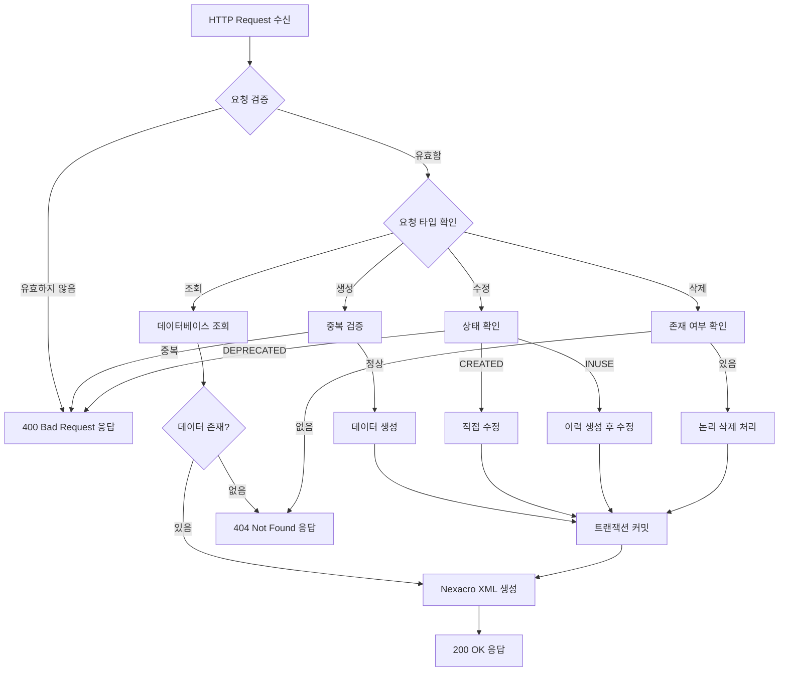
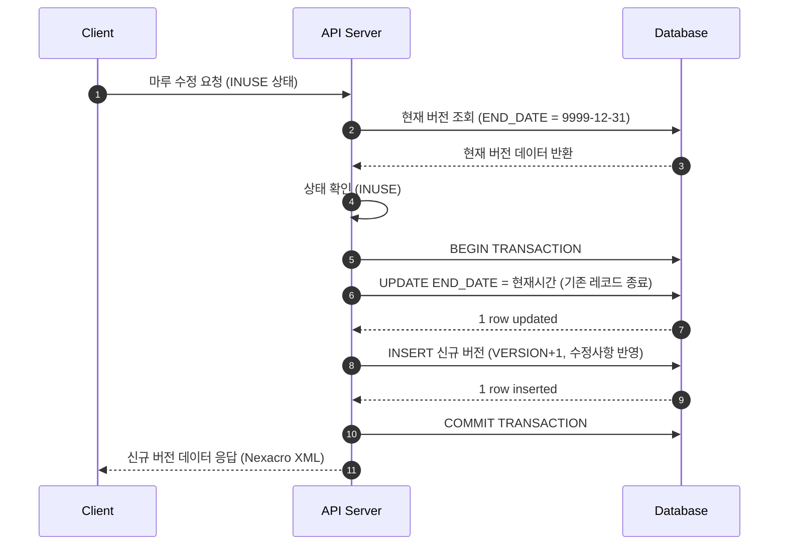
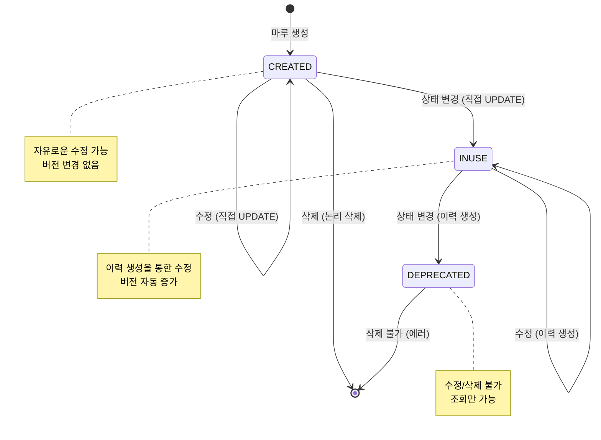

# 📄 Task 3.1 MR0100 Backend API 구현 - 상세설계서

**Template Version:** 1.3.0 — **Last Updated:** 2025-01-17

---

## 0. 문서 메타데이터

* 문서명: `Task-3-1.MR0100-Backend-API-구현(상세설계).md`
* 버전: 2.1
* 작성일: 2025-01-17
* 최종 수정일: 2025-10-13
* 작성자: System Architect
* 참조 문서:
  - `./docs/project/maru/00.foundation/01.project-charter/business-requirements.md`
  - `./docs/project/maru/00.foundation/02.design-baseline/3. api-design.md`
  - `./docs/project/maru/00.foundation/02.design-baseline/2. database-design.md`
  - `./docs/project/maru/00.foundation/02.design-baseline/5. program-list.md`
* 위치: `./docs/project/maru/10.design/12.detail-design/`
* 관련 Task: Task 3.1
* 상위 요구사항 문서: UC-001 코드 헤더 관리
* 요구사항 추적 담당자: System Architect
* 추적성 관리 도구: tasks.md

---

## 1. 목적 및 범위

### 1.1 목적
마루 헤더 관리를 위한 Backend RESTful API를 설계하고 구현하여, Frontend에서 마루 생성/조회/수정/삭제/상태변경 기능을 제공한다.

### 1.2 범위

**포함 사항:**
- 마루 헤더 CRUD API (MH001-MH005)
- 마루 상태 변경 API (MH006)
- 마루 이력 조회 API (MH007)
- 마루 통계 API (MH008)
- 선분 이력 모델 기반 버전 관리
- 상태별 차등 수정 정책 구현
- Nexacro Dataset XML 응답 포맷
- Swagger API 문서화

**제외 사항:**
- Frontend UI 구현 (Task 3.2)
- 코드 카테고리 및 코드 기본값 관리 (Task 6, 7)
- 사용자 인증/권한 관리 (PoC 제외)

---

## 2. 요구사항 & 승인 기준

### 2.1. 요구사항
* 요구사항 원본: UC-001 코드 헤더 관리 (business-requirements.md)

**기능 요구사항:**

- **[REQ-001]** 마루ID 생성 및 관리
  - 마루ID는 고유해야 하며 중복 불가
  - 형식: 최대 50자 VARCHAR

- **[REQ-002]** 마루 기본 정보 관리
  - 마루명 (필수, 최대 200자)
  - 마루 타입: CODE 또는 RULE (필수)
  - 우선순위 사용 여부: Y/N (기본값 N)

- **[REQ-003]** 상태 관리 및 전환
  - CREATED: 자유로운 수정 가능
  - INUSE: 이력 생성을 통한 수정
  - DEPRECATED: 수정 불가
  - 상태 전환: CREATED → INUSE → DEPRECATED (순차적)

- **[REQ-004]** 버전 관리
  - 버전 번호는 0부터 시작하여 자동 증가
  - 각 수정 시 새로운 버전 생성 (INUSE 상태인 경우)

- **[REQ-005]** 선분 이력 모델 구현
  - START_DATE, END_DATE로 유효 기간 관리
  - 기본 END_DATE: 9999-12-31 23:59:59
  - 특정 시점 데이터 조회 가능

- **[REQ-006]** 데이터 검증
  - 필수값 검증
  - 타입 검증 (CODE/RULE)
  - 상태 전환 규칙 검증
  - 중복 마루ID 검증

**비기능 요구사항:**

- **[REQ-007]** 성능
  - 목록 조회: 1초 이내
  - 단건 조회: 500ms 이내
  - 생성/수정/삭제: 2초 이내

- **[REQ-008]** 안정성
  - 트랜잭션 보장 (ACID)
  - 동시성 제어 (낙관적 락)
  - 에러 복구 전략

- **[REQ-009]** 보안
  - SQL Injection 방지 (Parameterized Query)
  - XSS 방지 (입력값 검증)
  - 민감 정보 로깅 제외

**승인 기준:**
- [ ] 모든 API 엔드포인트 정상 동작
- [ ] 상태별 수정 정책 정확히 구현
- [ ] 선분 이력 모델 정상 동작
- [ ] Nexacro XML 포맷 정확히 생성
- [ ] Swagger 문서 완성
- [ ] 단위 테스트 커버리지 80% 이상

### 2.2. 요구사항-설계 추적 매트릭스

| 요구사항 ID | 요구사항 설명 | 설계 섹션/아티팩트 | API ID | 테스트 케이스 ID | 상태 | 비고 |
|-------------|---------------|--------------------|--------|------------------|------|------|
| REQ-001 | 마루ID 생성 및 관리 | §8.1 API MH003 | MH003 | TC-API-001 | 설계완료 | |
| REQ-002 | 마루 기본 정보 관리 | §8.1 API MH003, MH004 | MH003, MH004 | TC-API-002 | 설계완료 | |
| REQ-003 | 상태 관리 및 전환 | §5.2, §8.1 API MH006 | MH006 | TC-API-003 | 설계완료 | |
| REQ-004 | 버전 관리 | §5.3, §7.1 | MH004 | TC-API-004 | 설계완료 | |
| REQ-005 | 선분 이력 모델 구현 | §5.3, §8.1 API MH007 | MH007 | TC-API-005 | 설계완료 | |
| REQ-006 | 데이터 검증 | §9.1 | 전체 API | TC-API-006 | 설계완료 | |
| REQ-007 | 성능 요구사항 | §11 | 전체 API | TC-PERF-001 | 설계완료 | |
| REQ-008 | 안정성 요구사항 | §9.2 | 전체 API | TC-STAB-001 | 설계완료 | |
| REQ-009 | 보안 요구사항 | §10 | 전체 API | TC-SEC-001 | 설계완료 | |

---

## 3. 용어/가정/제약

### 3.1 용어 정의

- **마루(MARU)**: 코드 또는 룰의 집합을 관리하는 단위
- **선분 이력 모델**: START_DATE와 END_DATE로 유효 기간을 관리하는 시간 데이터 모델
- **버전(VERSION)**: 마루의 변경 이력을 추적하는 번호 (0부터 시작)
- **상태(STATUS)**: 마루의 생명주기 상태 (CREATED/INUSE/DEPRECATED)
- **Nexacro Dataset XML**: Nexacro N 플랫폼에서 사용하는 데이터 교환 포맷

### 3.2 가정(Assumptions)

- Oracle Database 연결이 정상적으로 설정되어 있음
- TB_MR_HEAD 테이블이 생성되어 있음
- Node.js v20.x 환경에서 실행됨
- Express 5.x 프레임워크 사용
- Knex.js를 통한 SQL 쿼리 빌더 사용

### 3.3 제약(Constraints)

- PoC 단계로 인증/권한 관리 미포함
- 동시 사용자 5명 이하 (PoC)
- 데이터 크기 10,000건 이하 (PoC)
- HTTP 프로토콜 사용 (HTTPS 미적용)
- 단일 서버 환경 (로드 밸런싱 미적용)

---

## 4. 시스템/모듈 개요

### 4.1 역할 및 책임

**Backend API Server:**
- RESTful API 엔드포인트 제공
- 비즈니스 로직 처리
- 데이터베이스 연동
- Nexacro Dataset XML 응답 생성
- 에러 처리 및 로깅

**Database (Oracle):**
- 마루 헤더 데이터 영구 저장
- 선분 이력 데이터 관리
- 트랜잭션 보장

**Swagger UI:**
- API 문서화
- API 테스트 인터페이스

### 4.2 외부 의존성

- **Node.js Packages:**
  - express: ^5.0.0 (웹 프레임워크)
  - knex: ^3.1.0 (SQL 쿼리 빌더)
  - oracledb: ^6.3.0 (Oracle 데이터베이스 드라이버)
  - joi: ^17.11.0 (데이터 검증)
  - swagger-jsdoc: ^6.2.8 (Swagger 문서 생성)
  - swagger-ui-express: ^5.0.0 (Swagger UI)

- **Database:**
  - Oracle Database 11g 이상

### 4.3 상호작용 개요

```
[Frontend Nexacro]
    ↓ HTTP Request (JSON)
[Backend API Server]
    ↓ SQL Query
[Oracle Database]
    ↓ Result
[Backend API Server]
    ↓ HTTP Response (Nexacro XML)
[Frontend Nexacro]
```

---

## 5. 프로세스 흐름

### 5.1 프로세스 설명

#### 5.1.1 마루 생성 프로세스 [REQ-001, REQ-002]

1. **요청 수신**: Frontend에서 마루 생성 요청 (POST /api/v1/maru-headers)
2. **입력 검증**: 필수값, 형식, 중복 마루ID 검증
3. **초기 데이터 생성**:
   - VERSION: 0
   - MARU_STATUS: 'CREATED'
   - START_DATE: 현재 시간
   - END_DATE: 9999-12-31 23:59:59
4. **데이터베이스 저장**: TB_MR_HEAD에 INSERT
5. **성공 응답**: Nexacro XML 포맷으로 반환

#### 5.1.2 마루 수정 프로세스 [REQ-003, REQ-004, REQ-005, REQ-008]

**CREATED 상태:**
1. 직접 UPDATE 수행 (버전 변경 없음)
2. 수정된 데이터 반환

**INUSE 상태 (낙관적 락 적용):**
1. **BEGIN TRANSACTION**

2. **기존 레코드 종료 (낙관적 락 적용)**:
   ```sql
   UPDATE TB_MR_HEAD
   SET END_DATE = CURRENT_TIMESTAMP
   WHERE MARU_ID = :maruId
     AND VERSION = :currentVersion
     AND END_DATE = TO_TIMESTAMP('9999-12-31 23:59:59', 'YYYY-MM-DD HH24:MI:SS');

   -- 영향 받은 행이 0이면 동시성 충돌
   IF rowCount === 0 THEN
     ROLLBACK;
     THROW ConflictError('다른 사용자가 동시에 수정했습니다. 새로고침 후 다시 시도해 주세요.');
   END IF;
   ```

3. **신규 레코드 생성**:
   ```sql
   INSERT INTO TB_MR_HEAD (
     MARU_ID, VERSION, MARU_NAME, MARU_STATUS, MARU_TYPE,
     PRIORITY_USE_YN, START_DATE, END_DATE
   ) VALUES (
     :maruId,
     :currentVersion + 1,
     :newMaruName,
     'INUSE',
     :maruType,
     :priorityUseYn,
     CURRENT_TIMESTAMP,
     TO_TIMESTAMP('9999-12-31 23:59:59', 'YYYY-MM-DD HH24:MI:SS')
   );
   ```

4. **COMMIT TRANSACTION**

5. **신규 버전 데이터 반환**

**DEPRECATED 상태:**
1. 에러 응답 (수정 불가)

**동시성 제어 메커니즘:**
- **낙관적 락 (Optimistic Locking)**: WHERE 절에 VERSION 조건 포함
- **충돌 감지**: UPDATE 영향 행 수 확인 (0이면 충돌)
- **트랜잭션 보장**: BEGIN ~ COMMIT 블록으로 ACID 보장
- **격리 수준**: READ COMMITTED (Oracle 기본값)

#### 5.1.3 상태 변경 프로세스 [REQ-003]

1. **현재 상태 확인**: 최신 버전의 MARU_STATUS 조회
2. **상태 전환 검증**:
   - CREATED → INUSE: 허용
   - INUSE → DEPRECATED: 허용
   - 기타: 거부
3. **상태 변경 수행**:
   - CREATED → INUSE: 직접 UPDATE
   - INUSE → DEPRECATED: 이력 생성 후 UPDATE
4. **변경 결과 반환**

#### 5.1.4 이력 조회 프로세스 [REQ-005]

1. **마루ID 기준 조회**: 모든 버전 조회
2. **시간 범위 필터링**: fromDate, toDate 적용 (선택)
3. **정렬**: VERSION DESC (최신 순)
4. **이력 목록 반환**

### 5.2. 프로세스 설계 개념도 (Mermaid)

#### API 요청 처리 흐름



#### 선분 이력 모델 처리 흐름



#### 상태 전환 검증 흐름



---

## 6. UI 레이아웃 설계

> **Note**: Task 3.1은 Backend API 구현이므로 UI 레이아웃 설계는 Task 3.2 (Frontend UI 구현)에서 다룹니다.

---

## 7. 데이터/메시지 구조

### 7.1. 입력 데이터 구조

#### 마루 생성 요청 (POST /api/v1/maru-headers)

**JSON 포맷:**
```json
{
  "maruId": "DEPT_CODE_001",        // 필수, VARCHAR(50), 고유값
  "maruName": "부서코드",            // 필수, VARCHAR(200)
  "maruType": "CODE",                // 필수, "CODE" 또는 "RULE"
  "priorityUseYn": "N"               // 선택, "Y" 또는 "N", 기본값 "N"
}
```

**Joi 검증 스키마:**
```javascript
const createMaruSchema = Joi.object({
  maruId: Joi.string()
    .required()
    .max(50)
    .pattern(/^[A-Z0-9_]+$/)
    .messages({
      'string.empty': '마루ID는 필수입니다.',
      'string.max': '마루ID는 50자를 초과할 수 없습니다.',
      'string.pattern.base': '마루ID는 대문자, 숫자, 언더스코어만 허용됩니다.'
    }),

  maruName: Joi.string()
    .required()
    .max(200)
    .messages({
      'string.empty': '마루명은 필수입니다.',
      'string.max': '마루명은 200자를 초과할 수 없습니다.'
    }),

  maruType: Joi.string()
    .required()
    .valid('CODE', 'RULE')
    .messages({
      'any.only': '마루 타입은 CODE 또는 RULE이어야 합니다.',
      'any.required': '마루 타입은 필수입니다.'
    }),

  priorityUseYn: Joi.string()
    .optional()
    .valid('Y', 'N')
    .default('N')
    .messages({
      'any.only': '우선순위 사용 여부는 Y 또는 N이어야 합니다.'
    })
});
```

**검증 규칙 테이블:**

| 필드명 | 타입 | 필수 | 최소 | 최대 | 패턴 | 허용값 | 기본값 | 에러 메시지 |
|--------|------|------|------|------|------|--------|--------|-------------|
| maruId | string | Y | 1 | 50 | ^[A-Z0-9_]+$ | - | - | "마루ID는 필수이며 대문자, 숫자, 언더스코어만 허용됩니다." |
| maruName | string | Y | 1 | 200 | - | - | - | "마루명은 필수이며 최대 200자입니다." |
| maruType | string | Y | - | - | - | CODE, RULE | - | "마루 타입은 CODE 또는 RULE이어야 합니다." |
| priorityUseYn | string | N | - | - | - | Y, N | N | "우선순위 사용 여부는 Y 또는 N이어야 합니다." |

**경계값 테스트 케이스:**
- [ ] maruId 경계값: 빈 문자열 (400), 50자 (성공), 51자 (400)
- [ ] maruId 패턴: 소문자 포함 (400), 특수문자 (400), 대문자+숫자+언더스코어 (성공)
- [ ] maruName 경계값: 빈 문자열 (400), 200자 (성공), 201자 (400)
- [ ] maruType: 'INVALID' (400), 'code' 소문자 (400), 'CODE' (성공)
- [ ] priorityUseYn: 'Z' (400), 생략 시 'N' (성공)

---

#### 마루 수정 요청 (PUT /api/v1/maru-headers/{maruId})

**JSON 포맷:**
```json
{
  "maruName": "부서코드 (수정)",     // 선택, VARCHAR(200)
  "priorityUseYn": "Y"               // 선택, "Y" 또는 "N"
}
```

**Joi 검증 스키마:**
```javascript
const updateMaruSchema = Joi.object({
  maruName: Joi.string()
    .optional()
    .max(200)
    .messages({
      'string.max': '마루명은 200자를 초과할 수 없습니다.'
    }),

  priorityUseYn: Joi.string()
    .optional()
    .valid('Y', 'N')
    .messages({
      'any.only': '우선순위 사용 여부는 Y 또는 N이어야 합니다.'
    })
}).min(1).messages({
  'object.min': '최소 하나의 필드는 수정되어야 합니다.'
});
```

---

#### 상태 변경 요청 (PATCH /api/v1/maru-headers/{maruId}/status)

**JSON 포맷:**
```json
{
  "status": "INUSE",                 // 필수, "CREATED", "INUSE", "DEPRECATED"
  "effectiveDate": "2025-01-17T10:00:00Z"  // 선택, ISO 8601 형식
}
```

**Joi 검증 스키마:**
```javascript
const changeStatusSchema = Joi.object({
  status: Joi.string()
    .required()
    .valid('CREATED', 'INUSE', 'DEPRECATED')
    .messages({
      'any.only': '상태는 CREATED, INUSE, DEPRECATED 중 하나여야 합니다.',
      'any.required': '상태는 필수입니다.'
    }),

  effectiveDate: Joi.date()
    .iso()
    .optional()
    .messages({
      'date.format': '유효 일자는 ISO 8601 형식이어야 합니다.'
    })
});
```

### 7.2. 출력 데이터 구조

#### Nexacro Dataset XML 성공 응답
```xml
<?xml version="1.0" encoding="UTF-8"?>
<Dataset>
  <ErrorCode>0</ErrorCode>
  <ErrorMsg></ErrorMsg>
  <SuccessRowCount>1</SuccessRowCount>

  <ColumnInfo>
    <Column id="MARU_ID" type="STRING" size="50"/>
    <Column id="VERSION" type="INT" size="4"/>
    <Column id="MARU_NAME" type="STRING" size="200"/>
    <Column id="MARU_STATUS" type="STRING" size="20"/>
    <Column id="MARU_TYPE" type="STRING" size="10"/>
    <Column id="PRIORITY_USE_YN" type="STRING" size="1"/>
    <Column id="START_DATE" type="STRING" size="14"/>
    <Column id="END_DATE" type="STRING" size="14"/>
  </ColumnInfo>

  <Rows>
    <Row>
      <Col id="MARU_ID">DEPT_CODE_001</Col>
      <Col id="VERSION">2</Col>
      <Col id="MARU_NAME">부서코드</Col>
      <Col id="MARU_STATUS">INUSE</Col>
      <Col id="MARU_TYPE">CODE</Col>
      <Col id="PRIORITY_USE_YN">N</Col>
      <Col id="START_DATE">20250117100000</Col>
      <Col id="END_DATE">99991231235959</Col>
    </Row>
  </Rows>
</Dataset>
```

#### Nexacro Dataset XML 에러 응답
```xml
<?xml version="1.0" encoding="UTF-8"?>
<Dataset>
  <ErrorCode>-400</ErrorCode>
  <ErrorMsg>입력값이 올바르지 않습니다.</ErrorMsg>
  <SuccessRowCount>0</SuccessRowCount>

  <ColumnInfo>
    <Column id="ERROR_FIELD" type="STRING" size="50"/>
    <Column id="ERROR_MESSAGE" type="STRING" size="200"/>
  </ColumnInfo>

  <Rows>
    <Row>
      <Col id="ERROR_FIELD">maruId</Col>
      <Col id="ERROR_MESSAGE">마루ID는 필수입니다.</Col>
    </Row>
  </Rows>
</Dataset>
```

### 7.3. 데이터베이스 스키마

#### TB_MR_HEAD 테이블 구조
```sql
CREATE TABLE TB_MR_HEAD (
    MARU_ID         VARCHAR2(50)    NOT NULL,
    VERSION         NUMBER(10,0)    NOT NULL,
    MARU_NAME       VARCHAR2(200)   NOT NULL,
    MARU_STATUS     VARCHAR2(20)    DEFAULT 'CREATED' NOT NULL,
    MARU_TYPE       VARCHAR2(10)    NOT NULL,
    PRIORITY_USE_YN CHAR(1)         DEFAULT 'N' NOT NULL,
    START_DATE      TIMESTAMP       DEFAULT CURRENT_TIMESTAMP NOT NULL,
    END_DATE        TIMESTAMP       DEFAULT TO_TIMESTAMP('9999-12-31 23:59:59', 'YYYY-MM-DD HH24:MI:SS') NOT NULL,

    CONSTRAINT PK_TB_MR_CODE_HEAD PRIMARY KEY (MARU_ID, VERSION),
    CONSTRAINT CK_MARU_STATUS CHECK (MARU_STATUS IN ('CREATED', 'INUSE', 'DEPRECATED')),
    CONSTRAINT CK_MARU_TYPE CHECK (MARU_TYPE IN ('CODE', 'RULE')),
    CONSTRAINT CK_PRIORITY_USE_YN CHECK (PRIORITY_USE_YN IN ('Y', 'N'))
);
```

---

## 8. 인터페이스 계약(Contract)

### 8.1. API 목록 및 계약

#### API MH001: 마루 헤더 목록 조회 [REQ-001, REQ-002]
**엔드포인트**: `GET /api/v1/maru-headers`

**쿼리 파라미터**:
| 파라미터 | 타입 | 필수 | 기본값 | 설명 |
|----------|------|------|--------|------|
| page | number | N | 1 | 페이지 번호 |
| limit | number | N | 20 | 페이지 크기 (최대 100) |
| type | string | N | - | 마루 타입 필터 (CODE/RULE) |
| status | string | N | - | 상태 필터 (CREATED/INUSE/DEPRECATED) |
| search | string | N | - | 마루명 검색 (부분 일치) |

**성공 응답** (200 OK):
```xml
<Dataset>
  <ErrorCode>0</ErrorCode>
  <ErrorMsg></ErrorMsg>
  <SuccessRowCount>2</SuccessRowCount>
  <ColumnInfo>...</ColumnInfo>
  <Rows>...</Rows>
</Dataset>
```

**오류 응답**:
- 400 Bad Request: 잘못된 쿼리 파라미터
- 500 Internal Server Error: 서버 오류

**검증 케이스**: TC-API-MH001
**Swagger 주소**: `/api-docs#/Maru%20Headers/get_api_v1_maru_headers`

---

#### API MH002: 마루 헤더 상세 조회 [REQ-001, REQ-005]
**엔드포인트**: `GET /api/v1/maru-headers/{maruId}`

**경로 파라미터**:
| 파라미터 | 타입 | 설명 |
|----------|------|------|
| maruId | string | 마루 고유 식별자 |

**쿼리 파라미터**:
| 파라미터 | 타입 | 필수 | 설명 |
|----------|------|------|------|
| version | number | N | 특정 버전 조회 (기본값: 최신) |
| asOfDate | string | N | 특정 시점 조회 (ISO 8601) |

**성공 응답** (200 OK):
```xml
<Dataset>
  <ErrorCode>0</ErrorCode>
  <SuccessRowCount>1</SuccessRowCount>
  <Rows>
    <Row>
      <Col id="MARU_ID">DEPT_CODE_001</Col>
      <Col id="VERSION">2</Col>
      ...
    </Row>
  </Rows>
</Dataset>
```

**오류 응답**:
- 404 Not Found: 마루ID가 존재하지 않음
- 500 Internal Server Error: 서버 오류

**검증 케이스**: TC-API-MH002
**Swagger 주소**: `/api-docs#/Maru%20Headers/get_api_v1_maru_headers__maruId_`

---

#### API MH003: 마루 헤더 생성 [REQ-001, REQ-002]
**엔드포인트**: `POST /api/v1/maru-headers`

**요청 본문**:
```json
{
  "maruId": "DEPT_CODE_001",
  "maruName": "부서코드",
  "maruType": "CODE",
  "priorityUseYn": "N"
}
```

**검증 규칙**:
- maruId: 필수, 최대 50자, 고유값
- maruName: 필수, 최대 200자
- maruType: 필수, "CODE" 또는 "RULE"
- priorityUseYn: 선택, "Y" 또는 "N", 기본값 "N"

**성공 응답** (201 Created):
```xml
<Dataset>
  <ErrorCode>0</ErrorCode>
  <ErrorMsg></ErrorMsg>
  <SuccessRowCount>1</SuccessRowCount>
  <Rows>
    <Row>
      <Col id="RESULT">SUCCESS</Col>
      <Col id="MESSAGE">마루 헤더가 정상적으로 생성되었습니다.</Col>
      <Col id="MARU_ID">DEPT_CODE_001</Col>
      <Col id="VERSION">0</Col>
    </Row>
  </Rows>
</Dataset>
```

**오류 응답**:
- 400 Bad Request: 유효성 검증 실패
- 409 Conflict: 중복 마루ID
- 500 Internal Server Error: 서버 오류

**검증 케이스**: TC-API-MH003
**Swagger 주소**: `/api-docs#/Maru%20Headers/post_api_v1_maru_headers`

---

#### API MH004: 마루 헤더 수정 [REQ-003, REQ-004, REQ-005]
**엔드포인트**: `PUT /api/v1/maru-headers/{maruId}`

**경로 파라미터**:
| 파라미터 | 타입 | 설명 |
|----------|------|------|
| maruId | string | 마루 고유 식별자 |

**요청 본문**:
```json
{
  "maruName": "부서코드 (수정)",
  "priorityUseYn": "Y"
}
```

**처리 로직**:
1. 현재 상태 확인
2. CREATED: 직접 UPDATE
3. INUSE: 이력 생성 후 신규 버전 INSERT
4. DEPRECATED: 에러 반환

**성공 응답** (200 OK):
```xml
<Dataset>
  <ErrorCode>0</ErrorCode>
  <SuccessRowCount>1</SuccessRowCount>
  <Rows>
    <Row>
      <Col id="RESULT">SUCCESS</Col>
      <Col id="MESSAGE">마루 헤더가 정상적으로 수정되었습니다.</Col>
      <Col id="VERSION">3</Col>
    </Row>
  </Rows>
</Dataset>
```

**오류 응답**:
- 400 Bad Request: 유효성 검증 실패
- 403 Forbidden: DEPRECATED 상태 수정 시도
- 404 Not Found: 마루ID가 존재하지 않음
- 500 Internal Server Error: 서버 오류

**검증 케이스**: TC-API-MH004
**Swagger 주소**: `/api-docs#/Maru%20Headers/put_api_v1_maru_headers__maruId_`

---

#### API MH005: 마루 헤더 삭제 [REQ-001]
**엔드포인트**: `DELETE /api/v1/maru-headers/{maruId}`

**경로 파라미터**:
| 파라미터 | 타입 | 설명 |
|----------|------|------|
| maruId | string | 마루 고유 식별자 |

**처리 로직**:
- 논리적 삭제: END_DATE를 현재 시간으로 UPDATE
- 물리적 삭제 없음 (이력 보존)

**성공 응답** (200 OK):
```xml
<Dataset>
  <ErrorCode>0</ErrorCode>
  <SuccessRowCount>1</SuccessRowCount>
  <Rows>
    <Row>
      <Col id="RESULT">SUCCESS</Col>
      <Col id="MESSAGE">마루 헤더가 정상적으로 삭제되었습니다.</Col>
    </Row>
  </Rows>
</Dataset>
```

**오류 응답**:
- 404 Not Found: 마루ID가 존재하지 않음
- 500 Internal Server Error: 서버 오류

**검증 케이스**: TC-API-MH005
**Swagger 주소**: `/api-docs#/Maru%20Headers/delete_api_v1_maru_headers__maruId_`

---

#### API MH006: 마루 상태 변경 [REQ-003]
**엔드포인트**: `PATCH /api/v1/maru-headers/{maruId}/status`

**경로 파라미터**:
| 파라미터 | 타입 | 설명 |
|----------|------|------|
| maruId | string | 마루 고유 식별자 |

**요청 본문**:
```json
{
  "status": "INUSE",
  "effectiveDate": "2025-01-17T10:00:00Z"
}
```

**상태 전환 규칙**:
- CREATED → INUSE: 허용
- INUSE → DEPRECATED: 허용
- 기타: 거부

**성공 응답** (200 OK):
```xml
<Dataset>
  <ErrorCode>0</ErrorCode>
  <SuccessRowCount>1</SuccessRowCount>
  <Rows>
    <Row>
      <Col id="RESULT">SUCCESS</Col>
      <Col id="MESSAGE">마루 상태가 정상적으로 변경되었습니다.</Col>
      <Col id="NEW_STATUS">INUSE</Col>
      <Col id="EFFECTIVE_DATE">20250117100000</Col>
    </Row>
  </Rows>
</Dataset>
```

**오류 응답**:
- 400 Bad Request: 잘못된 상태 전환
- 404 Not Found: 마루ID가 존재하지 않음
- 500 Internal Server Error: 서버 오류

**검증 케이스**: TC-API-MH006
**Swagger 주소**: `/api-docs#/Maru%20Headers/patch_api_v1_maru_headers__maruId__status`

---

#### API MH007: 마루 이력 조회 [REQ-005]
**엔드포인트**: `GET /api/v1/maru-headers/{maruId}/history`

**경로 파라미터**:
| 파라미터 | 타입 | 설명 |
|----------|------|------|
| maruId | string | 마루 고유 식별자 |

**쿼리 파라미터**:
| 파라미터 | 타입 | 필수 | 설명 |
|----------|------|------|------|
| fromDate | string | N | 시작일 (ISO 8601) |
| toDate | string | N | 종료일 (ISO 8601) |
| limit | number | N | 조회 건수 (기본값: 50) |

**성공 응답** (200 OK):
```xml
<Dataset>
  <ErrorCode>0</ErrorCode>
  <SuccessRowCount>2</SuccessRowCount>
  <Rows>
    <Row>
      <Col id="VERSION">2</Col>
      <Col id="MARU_NAME">부서코드 (수정)</Col>
      <Col id="MARU_STATUS">INUSE</Col>
      <Col id="START_DATE">20250117100000</Col>
      <Col id="END_DATE">99991231235959</Col>
    </Row>
    <Row>
      <Col id="VERSION">1</Col>
      <Col id="MARU_NAME">부서코드</Col>
      <Col id="MARU_STATUS">CREATED</Col>
      <Col id="START_DATE">20250101000000</Col>
      <Col id="END_DATE">20250117095959</Col>
    </Row>
  </Rows>
</Dataset>
```

**오류 응답**:
- 404 Not Found: 마루ID가 존재하지 않음
- 500 Internal Server Error: 서버 오류

**검증 케이스**: TC-API-MH007
**Swagger 주소**: `/api-docs#/Maru%20Headers/get_api_v1_maru_headers__maruId__history`

---

#### API MH008: 마루 통계 조회 [REQ-001]
**엔드포인트**: `GET /api/v1/maru-headers/statistics`

**쿼리 파라미터**:
| 파라미터 | 타입 | 필수 | 설명 |
|----------|------|------|------|
| type | string | N | 마루 타입 필터 (CODE/RULE) |

**성공 응답** (200 OK):
```xml
<Dataset>
  <ErrorCode>0</ErrorCode>
  <SuccessRowCount>1</SuccessRowCount>
  <Rows>
    <Row>
      <Col id="TOTAL_COUNT">100</Col>
      <Col id="CREATED_COUNT">20</Col>
      <Col id="INUSE_COUNT">70</Col>
      <Col id="DEPRECATED_COUNT">10</Col>
      <Col id="CODE_TYPE_COUNT">60</Col>
      <Col id="RULE_TYPE_COUNT">40</Col>
    </Row>
  </Rows>
</Dataset>
```

**오류 응답**:
- 500 Internal Server Error: 서버 오류

**검증 케이스**: TC-API-MH008
**Swagger 주소**: `/api-docs#/Maru%20Headers/get_api_v1_maru_headers_statistics`

---

## 9. 오류/예외/경계조건

### 9.1. 예상 오류 상황 및 처리 방안

#### 에러 코드 카탈로그

| ErrorCode | HTTP Status | 카테고리 | 오류 상황 | 처리 방안 | 사용자 메시지 템플릿 |
|-----------|-------------|----------|-----------|-----------|---------------------|
| 0 | 200 OK | 성공 | 정상 처리 | - | - |
| -1 | 404 Not Found | 데이터 | 존재하지 않는 마루 | 데이터 없음 응답 | "해당 {리소스}를 찾을 수 없습니다." |
| -100 | 400 Bad Request | 비즈니스 | 중복 마루ID | 비즈니스 로직 에러 응답 | "이미 존재하는 마루ID입니다." |
| -100 | 400 Bad Request | 비즈니스 | 잘못된 상태 전환 | 비즈니스 로직 에러 응답 | "허용되지 않는 상태 전환입니다. (CREATED→INUSE, INUSE→DEPRECATED만 가능)" |
| -100 | 403 Forbidden | 비즈니스 | DEPRECATED 수정 시도 | 비즈니스 로직 에러 응답 | "폐기된 마루는 수정할 수 없습니다." |
| -200 | 500 Internal Server Error | 시스템 | 데이터베이스 연결 실패 | 재시도 3회 후 에러 응답 | "시스템 오류가 발생했습니다. 잠시 후 다시 시도해 주세요." |
| -200 | 500 Internal Server Error | 시스템 | 트랜잭션 실패 | 롤백 후 에러 응답 | "처리 중 오류가 발생했습니다. 다시 시도해 주세요." |
| -400 | 400 Bad Request | 검증 | 필수값 누락 | 입력값 검증 실패 응답 | "{필드명}은(는) 필수입니다." |
| -400 | 400 Bad Request | 검증 | 잘못된 데이터 타입 | 타입 검증 실패 응답 | "{필드명}의 형식이 올바르지 않습니다." |
| -400 | 400 Bad Request | 검증 | 최대 길이 초과 | 길이 검증 실패 응답 | "{필드명}은(는) 최대 {길이}자까지 입력 가능합니다." |
| -409 | 409 Conflict | 충돌 | 동시성 충돌 (낙관적 락 실패) | 트랜잭션 롤백 후 409 Conflict 응답 | "다른 사용자가 동시에 수정했습니다. 새로고침 후 다시 시도해 주세요." |

#### 표준 에러 응답 구조 (Nexacro XML)

```xml
<Dataset>
  <ErrorCode>-400</ErrorCode>
  <ErrorMsg>입력값 검증 실패</ErrorMsg>
  <SuccessRowCount>0</SuccessRowCount>

  <ColumnInfo>
    <Column id="ERROR_FIELD" type="STRING" size="50"/>
    <Column id="ERROR_MESSAGE" type="STRING" size="200"/>
    <Column id="ERROR_CODE" type="STRING" size="20"/>
  </ColumnInfo>

  <Rows>
    <Row>
      <Col id="ERROR_FIELD">maruId</Col>
      <Col id="ERROR_MESSAGE">마루ID는 필수입니다.</Col>
      <Col id="ERROR_CODE">REQUIRED_FIELD</Col>
    </Row>
  </Rows>
</Dataset>
```

### 9.2. 복구 전략 및 사용자 메시지

**데이터베이스 연결 실패:**
- 자동 재시도: 3회 (1초 간격)
- 재시도 실패 시: 에러 응답 및 로깅
- 사용자 메시지: "시스템 오류가 발생했습니다. 잠시 후 다시 시도해 주세요."

**트랜잭션 충돌:**
- 자동 롤백
- 충돌 원인 로깅
- 사용자 메시지: "처리 중 오류가 발생했습니다. 다시 시도해 주세요."

**타임아웃:**
- 데이터베이스 쿼리 타임아웃: 30초
- HTTP 요청 타임아웃: 60초
- 사용자 메시지: "요청 시간이 초과되었습니다. 다시 시도해 주세요."

**경계조건 처리:**
- 빈 문자열: NULL로 변환
- 공백 문자열: 트림 처리
- 대소문자: 원본 유지
- 특수문자: 허용 (SQL Injection 방지 처리)

---

## 10. 보안/품질 고려

### 10.1 보안 고려사항

**입력 검증:**
- Joi 스키마를 통한 요청 데이터 검증
- SQL Injection 방지: Parameterized Query (Knex.js)
- XSS 방지: 입력값 이스케이프 처리
- 최대 길이 제한: 각 필드별 제한 적용

**에러 처리:**
- 상세 에러 정보 숨김 (프로덕션)
- 에러 로그 기록 (민감 정보 제외)
- 표준화된 에러 응답 포맷

**데이터 보호:**
- 민감 정보 로깅 제외
- 데이터베이스 연결 정보 환경변수 관리
- 트랜잭션을 통한 데이터 무결성 보장

### 10.2 품질 관리

**코드 품질:**
- ESLint 규칙 준수
- Prettier 포맷팅 적용
- JSDoc 주석 작성

**테스트:**
- 단위 테스트 커버리지 80% 이상
- 통합 테스트: 주요 API 시나리오
- 부하 테스트: 동시 사용자 5명

**로깅:**
- Winston 로거 사용
- 레벨별 로그 관리 (error, warn, info, debug)
- 요청/응답 로그 기록

### 10.3 국제화(i18n) 고려사항

**PoC 단계 제외:**
- 다국어 에러 메시지
- 다국어 API 문서
- 다국어 로그

**향후 적용 계획:**
- i18next 라이브러리 도입
- 에러 메시지 다국어 파일 분리
- Accept-Language 헤더 기반 응답

---

## 11. 성능 및 확장성

### 11.1 성능 목표 및 지표

| 지표 | 목표 | 측정 방법 |
|------|------|-----------|
| API 응답 시간 (목록 조회) | < 1초 | Apache Bench |
| API 응답 시간 (단건 조회) | < 500ms | Apache Bench |
| API 응답 시간 (생성/수정/삭제) | < 2초 | Apache Bench |
| 동시 사용자 처리 | 5명 | JMeter |
| 데이터베이스 연결 풀 | 10개 | 모니터링 |
| 메모리 사용량 | < 512MB | Node.js Profiler |

### 11.2 병목 예상 지점 및 완화 전략

**데이터베이스 쿼리:**
- 병목: 복잡한 이력 조회 쿼리
- 완화: 인덱스 최적화 (END_DATE, START_DATE, MARU_ID)
- 완화: 페이징 처리 (기본 20건, 최대 100건)

**Nexacro XML 변환:**
- 병목: 대량 데이터 XML 변환
- 완화: 스트림 기반 XML 생성
- 완화: 결과 크기 제한

**동시성 제어:**
- 병목: 동시 수정 시 충돌
- 완화: 낙관적 락 (VERSION 기반)
- 완화: 트랜잭션 격리 수준 설정 (READ COMMITTED)

### 11.3 확장성 고려사항

**수평 확장 (PoC 제외, 향후 계획):**
- 로드 밸런서 도입
- 세션 외부화 (Redis)
- 데이터베이스 읽기 복제본

**캐싱 전략 (PoC 제외, 향후 계획):**
- 마루 목록 조회: 5분 TTL
- 마루 상세 조회: 10분 TTL
- 통계 데이터: 1시간 TTL
- 캐시 무효화: 생성/수정/삭제 시

---

## 12. 테스트 전략 (TDD 계획)

### 12.1 단위 테스트 시나리오

**마루 생성 테스트:**
- [ ] 정상 생성: 모든 필수값 제공 → 성공
- [ ] 마루ID 누락: 필수값 누락 → 400 에러
- [ ] 중복 마루ID: 이미 존재하는 ID → 409 에러
- [ ] 잘못된 타입: 'INVALID' 타입 → 400 에러

**마루 수정 테스트:**
- [ ] CREATED 상태 수정: 직접 UPDATE → 성공
- [ ] INUSE 상태 수정: 이력 생성 → 성공, VERSION 증가
- [ ] DEPRECATED 상태 수정: 수정 시도 → 403 에러
- [ ] 존재하지 않는 마루: 404 에러

**상태 변경 테스트:**
- [ ] CREATED → INUSE: 허용 → 성공
- [ ] INUSE → DEPRECATED: 허용 → 성공
- [ ] CREATED → DEPRECATED: 거부 → 400 에러
- [ ] INUSE → CREATED: 거부 → 400 에러

**이력 조회 테스트:**
- [ ] 전체 이력 조회: 모든 버전 반환
- [ ] 특정 버전 조회: 해당 버전만 반환
- [ ] 시점 기준 조회: 해당 시점 유효 버전 반환
- [ ] 존재하지 않는 마루: 404 에러

### 12.2 통합 테스트 시나리오

**전체 생명주기 테스트:**
1. 마루 생성 (CREATED)
2. 마루 수정 (직접 UPDATE)
3. 상태 변경 (CREATED → INUSE)
4. 마루 수정 (이력 생성)
5. 상태 변경 (INUSE → DEPRECATED)
6. 이력 조회 (모든 버전 확인)

**동시성 테스트:**
- [ ] 동시 생성: 중복 방지 확인
- [ ] 동시 수정: 낙관적 락 동작 확인
- [ ] 동시 상태 변경: 순차 처리 확인

### 12.3 성능 테스트 시나리오

**부하 테스트:**
- [ ] 5명 동시 접속: 모든 API 정상 응답
- [ ] 1000건 목록 조회: 1초 이내 응답
- [ ] 100건 연속 생성: 정상 처리

**스트레스 테스트:**
- [ ] 10명 동시 접속: 부하 상황 모니터링
- [ ] 5000건 목록 조회: 타임아웃 발생 여부

---

## 13. API 테스트케이스

### 13.1 API 기능 테스트케이스

| 테스트 ID | API | 테스트 시나리오 | 요청 데이터 | 예상 응답 | 검증 기준 | 요구사항 | 우선순위 |
|-----------|-----|-----------------|-------------|-----------|-----------|----------|----------|
| TC-API-001 | MH001 | 마루 목록 조회 - 필터 없음 | GET /api/v1/maru-headers | ErrorCode=0, 전체 목록 반환 | SuccessRowCount > 0 | [REQ-001] | High |
| TC-API-002 | MH001 | 마루 목록 조회 - 타입 필터 | GET /api/v1/maru-headers?type=CODE | ErrorCode=0, CODE 타입만 반환 | 모든 Row의 MARU_TYPE=CODE | [REQ-002] | High |
| TC-API-003 | MH001 | 마루 목록 조회 - 페이징 | GET /api/v1/maru-headers?page=2&limit=10 | ErrorCode=0, 10건 반환 | SuccessRowCount=10 | [REQ-001] | Medium |
| TC-API-004 | MH002 | 마루 상세 조회 - 최신 버전 | GET /api/v1/maru-headers/DEPT_CODE_001 | ErrorCode=0, 최신 버전 반환 | END_DATE=99991231235959 | [REQ-005] | High |
| TC-API-005 | MH002 | 마루 상세 조회 - 특정 버전 | GET /api/v1/maru-headers/DEPT_CODE_001?version=1 | ErrorCode=0, 버전 1 반환 | VERSION=1 | [REQ-005] | Medium |
| TC-API-006 | MH002 | 마루 상세 조회 - 존재하지 않음 | GET /api/v1/maru-headers/INVALID_ID | ErrorCode=-1 | ErrorMsg 포함 | [REQ-001] | High |
| TC-API-007 | MH003 | 마루 생성 - 정상 | POST /api/v1/maru-headers<br>{maruId, maruName, maruType, priorityUseYn} | ErrorCode=0, VERSION=0 | MARU_STATUS=CREATED | [REQ-001, REQ-002] | High |
| TC-API-008 | MH003 | 마루 생성 - 중복 ID | POST /api/v1/maru-headers<br>{기존 maruId} | ErrorCode=-100 | 중복 에러 메시지 | [REQ-006] | High |
| TC-API-009 | MH003 | 마루 생성 - 필수값 누락 | POST /api/v1/maru-headers<br>{maruId만} | ErrorCode=-400 | 필수값 에러 메시지 | [REQ-006] | High |
| TC-API-010 | MH004 | 마루 수정 - CREATED 상태 | PUT /api/v1/maru-headers/TEST_001<br>{maruName} | ErrorCode=0, 직접 UPDATE | VERSION 변경 없음 | [REQ-003] | High |
| TC-API-011 | MH004 | 마루 수정 - INUSE 상태 | PUT /api/v1/maru-headers/TEST_002<br>{maruName} | ErrorCode=0, 이력 생성 | VERSION 증가 | [REQ-004] | High |
| TC-API-012 | MH004 | 마루 수정 - DEPRECATED 상태 | PUT /api/v1/maru-headers/TEST_003<br>{maruName} | ErrorCode=-100 | 수정 불가 에러 | [REQ-003] | High |
| TC-API-013 | MH005 | 마루 삭제 - 정상 | DELETE /api/v1/maru-headers/TEST_001 | ErrorCode=0 | END_DATE 업데이트 확인 | [REQ-001] | Medium |
| TC-API-014 | MH006 | 상태 변경 - CREATED→INUSE | PATCH /api/v1/maru-headers/TEST_001/status<br>{status:INUSE} | ErrorCode=0 | NEW_STATUS=INUSE | [REQ-003] | High |
| TC-API-015 | MH006 | 상태 변경 - INUSE→DEPRECATED | PATCH /api/v1/maru-headers/TEST_002/status<br>{status:DEPRECATED} | ErrorCode=0 | NEW_STATUS=DEPRECATED | [REQ-003] | High |
| TC-API-016 | MH006 | 상태 변경 - 잘못된 전환 | PATCH /api/v1/maru-headers/TEST_001/status<br>{status:DEPRECATED} | ErrorCode=-100 | 전환 불가 에러 | [REQ-006] | High |
| TC-API-017 | MH007 | 이력 조회 - 전체 | GET /api/v1/maru-headers/TEST_001/history | ErrorCode=0, 모든 버전 | VERSION DESC 정렬 | [REQ-005] | High |
| TC-API-018 | MH007 | 이력 조회 - 기간 필터 | GET /api/v1/maru-headers/TEST_001/history?fromDate=2025-01-01 | ErrorCode=0, 기간 내 버전 | START_DATE >= fromDate | [REQ-005] | Medium |
| TC-API-019 | MH008 | 통계 조회 - 전체 | GET /api/v1/maru-headers/statistics | ErrorCode=0, 통계 데이터 | TOTAL_COUNT, 상태별 집계 | [REQ-001] | Medium |
| TC-API-020 | MH008 | 통계 조회 - 타입 필터 | GET /api/v1/maru-headers/statistics?type=CODE | ErrorCode=0, CODE 타입 통계 | CODE_TYPE_COUNT만 반환 | [REQ-002] | Low |

### 13.2 성능 테스트케이스

| 테스트 ID | 성능 지표 | 측정 방법 | 목표 기준 | 측정 도구 | 실행 조건 |
|-----------|-----------|-----------|-----------|-----------|-----------|
| TC-PERF-001 | 목록 조회 응답 시간 | 100회 평균 | 1초 이내 | Apache Bench | 100건 데이터 |
| TC-PERF-002 | 상세 조회 응답 시간 | 100회 평균 | 500ms 이내 | Apache Bench | 단일 마루 |
| TC-PERF-003 | 생성 처리 시간 | 100회 평균 | 2초 이내 | Apache Bench | 신규 마루 |
| TC-PERF-004 | 수정 처리 시간 (INUSE) | 100회 평균 | 2초 이내 | Apache Bench | 이력 생성 포함 |
| TC-PERF-005 | 동시 접속 처리 | 5명 동시 요청 | 정상 응답 | JMeter | 각 5개 요청 |
| TC-PERF-006 | 대용량 목록 조회 | 1000건 조회 | 3초 이내 | Apache Bench | 1000건 데이터 |

### 13.3 보안 테스트케이스

| 테스트 ID | 보안 항목 | 테스트 방법 | 검증 기준 | 도구 |
|-----------|-----------|-------------|-----------|------|
| TC-SEC-001 | SQL Injection | 특수문자 포함 입력 | Parameterized Query 적용 확인 | 수동 테스트 |
| TC-SEC-002 | XSS 방지 | 스크립트 태그 입력 | 이스케이프 처리 확인 | 수동 테스트 |
| TC-SEC-003 | 입력값 검증 | 최대 길이 초과 입력 | 400 에러 반환 | 수동 테스트 |
| TC-SEC-004 | 에러 정보 노출 | 의도적 에러 발생 | 상세 스택 트레이스 미노출 | 수동 테스트 |

### 13.4 에러 처리 테스트케이스

| 테스트 ID | 에러 상황 | 트리거 방법 | 예상 결과 | 검증 방법 |
|-----------|-----------|-------------|-----------|-----------|
| TC-ERR-001 | DB 연결 실패 | DB 서버 중단 | ErrorCode=-200, 재시도 3회 | 로그 확인 |
| TC-ERR-002 | 트랜잭션 실패 | 동시 수정 충돌 | ErrorCode=-100, 롤백 | DB 상태 확인 |
| TC-ERR-003 | 타임아웃 | 긴 쿼리 실행 | 30초 후 타임아웃 | 응답 시간 측정 |
| TC-ERR-004 | 잘못된 JSON | 형식 오류 요청 | ErrorCode=-400 | API 응답 확인 |

### 13.5 통합 테스트 시나리오

| 시나리오 ID | 시나리오 명 | 사전 조건 | 실행 단계 | 예상 결과 | 후처리 | 요구사항 |
|-------------|-------------|-----------|-----------|-----------|--------|----------|
| TS-INT-001 | 마루 전체 생명주기 | DB 초기화 | 1. 마루 생성 (CREATED)<br>2. 수정 (직접 UPDATE)<br>3. 상태 변경 (INUSE)<br>4. 수정 (이력 생성)<br>5. 상태 변경 (DEPRECATED)<br>6. 이력 조회 | 각 단계 성공<br>VERSION 0→0→1→2<br>이력 3건 확인 | 테스트 데이터 삭제 | [REQ-001~006] |
| TS-INT-002 | 동시 수정 시나리오 | INUSE 상태 마루 준비 | 1. 사용자 A 수정 요청<br>2. 사용자 B 동시 수정 요청 | A 성공, B 충돌 에러<br>VERSION 1회만 증가 | 테스트 데이터 삭제 | [REQ-004, REQ-008] |
| TS-INT-003 | 이력 추적 시나리오 | 마루 생성 완료 | 1. 3회 수정 (INUSE 상태)<br>2. 이력 조회<br>3. 특정 시점 조회 | 버전 0~3 생성<br>이력 4건 확인<br>시점별 정확한 데이터 | 테스트 데이터 삭제 | [REQ-005] |

---

## 14. 구현 체크리스트

### 14.1 개발 단계 체크리스트

**설정 및 환경:**
- [ ] Oracle Database 연결 설정
- [ ] Knex.js 설정 파일 작성
- [ ] 환경변수 파일 (.env) 구성
- [ ] Swagger 설정

**데이터베이스:**
- [ ] TB_MR_HEAD 테이블 생성 확인
- [ ] 인덱스 생성 확인
- [ ] 제약조건 설정 확인

**라우팅:**
- [ ] Express Router 설정
- [ ] 8개 API 엔드포인트 구현
- [ ] 미들웨어 연결

**비즈니스 로직:**
- [ ] 마루 생성 로직
- [ ] 마루 조회 로직 (목록/상세)
- [ ] 마루 수정 로직 (상태별 처리)
- [ ] 마루 삭제 로직 (논리적 삭제)
- [ ] 상태 변경 로직
- [ ] 이력 조회 로직
- [ ] 통계 조회 로직

**데이터 검증:**
- [ ] Joi 스키마 정의
- [ ] 입력값 검증 미들웨어
- [ ] 에러 메시지 정의

**응답 처리:**
- [ ] Nexacro XML 생성 헬퍼 함수
- [ ] 성공 응답 포맷
- [ ] 에러 응답 포맷

**에러 처리:**
- [ ] 전역 에러 핸들러
- [ ] 에러 로깅
- [ ] 에러 코드 정의

**테스트:**
- [ ] 단위 테스트 작성 (Jest)
- [ ] API 테스트 작성 (Supertest)
- [ ] 커버리지 80% 달성

**문서화:**
- [ ] Swagger JSDoc 주석 (모든 API에 아래 템플릿 적용)
- [ ] API 문서 생성
- [ ] README 작성

#### Swagger JSDoc 주석 템플릿

**목록 조회 API 예시 (MH001):**
```javascript
/**
 * @swagger
 * /api/v1/maru-headers:
 *   get:
 *     summary: 마루 헤더 목록 조회
 *     description: 페이징, 필터링을 지원하는 마루 헤더 목록 조회 API
 *     tags: [Maru Headers]
 *     parameters:
 *       - in: query
 *         name: page
 *         schema:
 *           type: integer
 *           default: 1
 *         description: 페이지 번호 (1부터 시작)
 *       - in: query
 *         name: limit
 *         schema:
 *           type: integer
 *           default: 20
 *           maximum: 100
 *         description: 페이지당 항목 수 (최대 100)
 *       - in: query
 *         name: type
 *         schema:
 *           type: string
 *           enum: [CODE, RULE]
 *         description: 마루 타입 필터
 *       - in: query
 *         name: status
 *         schema:
 *           type: string
 *           enum: [CREATED, INUSE, DEPRECATED]
 *         description: 상태 필터
 *       - in: query
 *         name: search
 *         schema:
 *           type: string
 *         description: 마루명 검색 (부분 일치)
 *     responses:
 *       200:
 *         description: 성공
 *         content:
 *           application/xml:
 *             schema:
 *               type: string
 *             example: |
 *               <?xml version="1.0" encoding="UTF-8"?>
 *               <Dataset>
 *                 <ErrorCode>0</ErrorCode>
 *                 <ErrorMsg></ErrorMsg>
 *                 <SuccessRowCount>2</SuccessRowCount>
 *                 <Rows>
 *                   <Row>
 *                     <Col id="MARU_ID">DEPT_CODE_001</Col>
 *                     <Col id="VERSION">2</Col>
 *                     <Col id="MARU_NAME">부서코드</Col>
 *                     <Col id="MARU_STATUS">INUSE</Col>
 *                     <Col id="MARU_TYPE">CODE</Col>
 *                   </Row>
 *                 </Rows>
 *               </Dataset>
 *       400:
 *         description: 잘못된 요청 (쿼리 파라미터 오류)
 *         content:
 *           application/xml:
 *             example: |
 *               <Dataset>
 *                 <ErrorCode>-400</ErrorCode>
 *                 <ErrorMsg>페이지 번호는 1 이상이어야 합니다.</ErrorMsg>
 *               </Dataset>
 *       500:
 *         description: 서버 오류
 */
```

**상태 전이 제약 조건 문서화 (MH006):**
```javascript
/**
 * @swagger
 * /api/v1/maru-headers/{maruId}/status:
 *   patch:
 *     summary: 마루 상태 변경
 *     description: |
 *       마루의 상태를 변경합니다.
 *
 *       **허용되는 상태 전환:**
 *       - CREATED → INUSE
 *       - INUSE → DEPRECATED
 *
 *       **거부되는 상태 전환:**
 *       - CREATED → DEPRECATED (단계 건너뛰기 불가)
 *       - INUSE → CREATED (되돌리기 불가)
 *       - DEPRECATED → 모든 상태 (폐기 후 변경 불가)
 *     tags: [Maru Headers]
 *     parameters:
 *       - in: path
 *         name: maruId
 *         required: true
 *         schema:
 *           type: string
 *         description: 마루 고유 식별자
 *     requestBody:
 *       required: true
 *       content:
 *         application/json:
 *           schema:
 *             type: object
 *             properties:
 *               status:
 *                 type: string
 *                 enum: [CREATED, INUSE, DEPRECATED]
 *               effectiveDate:
 *                 type: string
 *                 format: date-time
 *           example:
 *             status: INUSE
 *             effectiveDate: "2025-01-17T10:00:00Z"
 *     responses:
 *       200:
 *         description: 성공
 *       400:
 *         description: 잘못된 상태 전환
 *         content:
 *           application/xml:
 *             example: |
 *               <Dataset>
 *                 <ErrorCode>-100</ErrorCode>
 *                 <ErrorMsg>허용되지 않는 상태 전환입니다. (CREATED→INUSE, INUSE→DEPRECATED만 가능)</ErrorMsg>
 *               </Dataset>
 *       404:
 *         description: 마루ID가 존재하지 않음
 *       500:
 *         description: 서버 오류
 */
```

**Swagger 문서화 체크리스트:**
- [ ] MH001: 목록 조회 API Swagger 주석
- [ ] MH002: 상세 조회 API Swagger 주석
- [ ] MH003: 생성 API Swagger 주석
- [ ] MH004: 수정 API Swagger 주석
- [ ] MH005: 삭제 API Swagger 주석
- [ ] MH006: 상태 변경 API Swagger 주석 (상태 전이 규칙 명시)
- [ ] MH007: 이력 조회 API Swagger 주석
- [ ] MH008: 통계 조회 API Swagger 주석
- [ ] 모든 API에 성공/실패 응답 예시 추가
- [ ] 페이징/필터 파라미터 상세 설명 추가
- [ ] Swagger UI에서 수동 테스트 검증

### 14.2 배포 전 체크리스트

- [ ] 모든 단위 테스트 통과
- [ ] 모든 API 테스트 통과
- [ ] Swagger 문서 정확성 확인
- [ ] 에러 로깅 정상 동작
- [ ] 성능 테스트 통과
- [ ] 보안 테스트 통과
- [ ] 코드 리뷰 완료
- [ ] 배포 가이드 작성

---

## 15. 변경 이력

| 버전 | 날짜 | 작성자 | 변경 내용 |
|------|------|--------|-----------|
| 1.0 | 2025-01-17 | System Architect | 초안 작성 |
| 2.0 | 2025-01-17 | System Architect | 기존 설계 무시하고 새로 작성 - 요구사항 추적 매트릭스 강화, API 계약 상세화, 테스트케이스 확대 |
| 2.1 | 2025-10-13 | System Architect | 상세설계 리뷰 개선사항 적용 (P1-P3 이슈):<br>- §5.1.2: 트랜잭션/동시성 제어 구체화 (낙관적 락 구현 명시)<br>- §9.1: 에러 코드 카탈로그 및 표준 응답 구조 추가<br>- §7.1: Joi 검증 스키마 상세 정의 및 경계값 테스트 케이스 추가<br>- §14.1: Swagger JSDoc 주석 템플릿 및 체크리스트 추가 |

---

**승인**

| 역할 | 이름 | 서명 | 날짜 |
|------|------|------|------|
| Backend 개발자 | | | |
| 시스템 아키텍트 | | | |
| 프로젝트 매니저 | | | |
