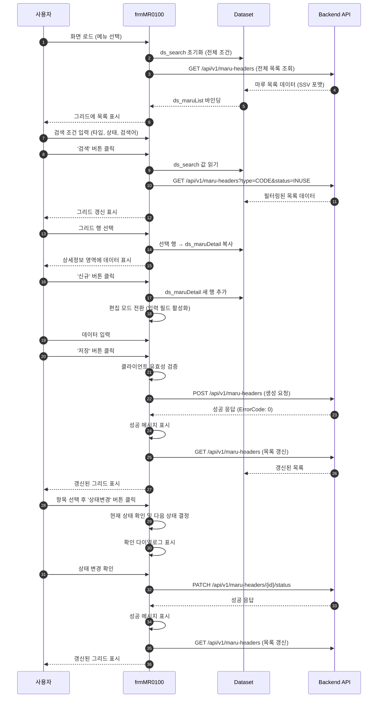
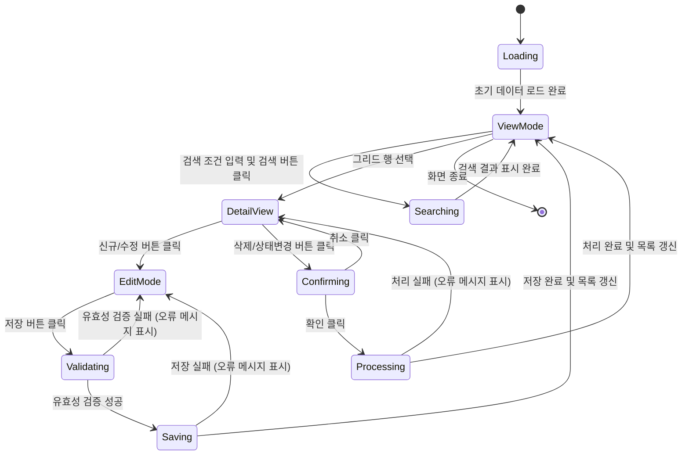
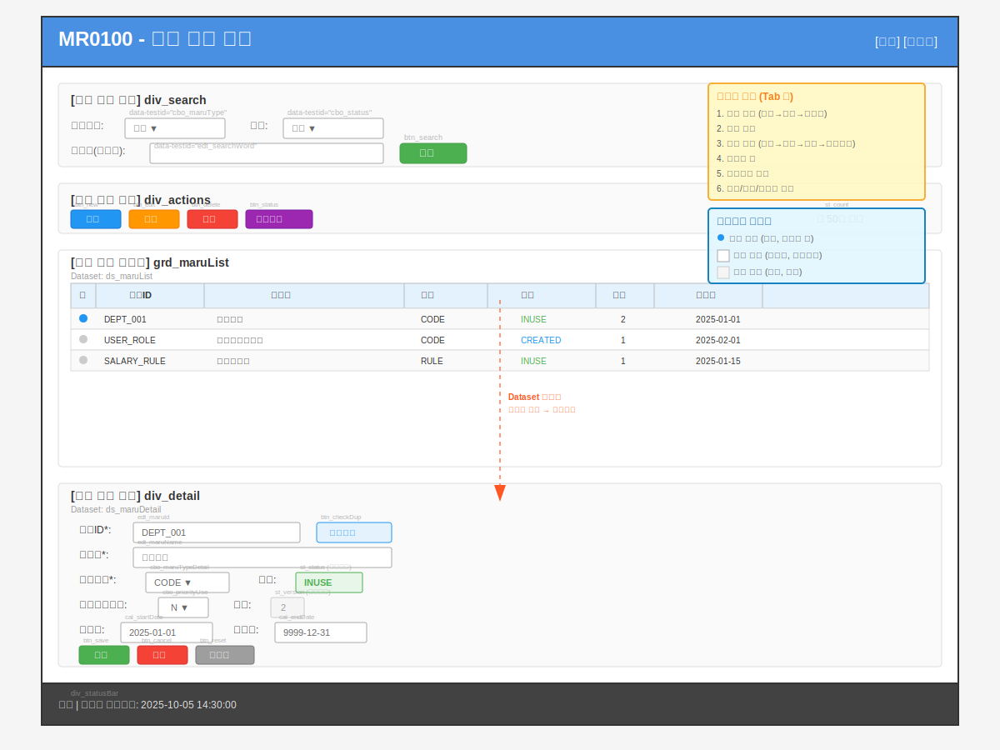

# 📄 상세설계서: Task 3.2 MR0100 마루헤더관리 Frontend UI 구현

**Template Version:** 1.3.0 — **Last Updated:** 2025-10-05

---

## 0. 문서 메타데이터

* **문서명**: `Task-3-2.MR0100-Frontend-UI-구현(상세설계).md`
* **버전/작성일/작성자**: v2.1 / 2025-10-13 / Claude Sonnet 4.5
* **변경 이력**:
  - v2.0 (2025-10-05): 초기 상세설계 작성
  - v2.1 (2025-10-13): 상세설계 리뷰 종합분석 반영 (9개 적용, 3개 조정)
* **참조 문서**:
  * `./docs/project/maru/00.foundation/01.project-charter/tasks.md`
  * `./docs/project/maru/00.foundation/01.project-charter/business-requirements.md`
  * `./docs/project/maru/00.foundation/02.design-baseline/5. program-list.md`
  * `./docs/project/maru/10.design/12.detail-design/Task-3-1.MR0100-Backend-API-구현(상세설계).md`
* **위치**: `./docs/project/maru/10.design/12.detail-design/`
* **관련 이슈/티켓**: Task 3.2
* **상위 요구사항 문서/ID**: business-requirements.md (UC-001: 코드 헤더 관리)
* **요구사항 추적 담당자**: Project Manager
* **추적성 관리 도구**: tasks.md 기반 수동 추적

---

## 1. 목적 및 범위

### 1.1 목적
Nexacro N V24 플랫폼을 사용하여 마루 헤더(Maru Header) 관리 화면 `MR0100`의 사용자 인터페이스를 구현한다. 사용자가 직관적으로 마루 데이터를 생성, 조회, 수정, 삭제하고 상태를 관리할 수 있는 UI/UX를 제공한다.

### 1.2 범위 (포함)
* Nexacro Form `frmMR0100.xfdl` 화면 설계
* 마루 목록 조회, 검색, 필터링 UI 구현
* 마루 생성/수정/삭제 기능 UI 구현
* 마루 상태 변경 (CREATED → INUSE → DEPRECATED) UI 구현
* Dataset 구조 정의 및 Backend API 연동
* 실시간 유효성 검증 및 사용자 피드백
* UI 테스트케이스 작성 (매뉴얼 + 자동화)

### 1.3 범위 (제외)
* Backend API 로직 구현 (Task 3.1 완료)
* 데이터베이스 스키마 설계
* 인증/권한 관리 (PoC 제외)
* 메뉴 프레임워크 및 전체 시스템 네비게이션

---

## 2. 요구사항 & 승인 기준 (Acceptance Criteria)

### 2.1. 요구사항

**요구사항 원본 링크**: `./docs/project/maru/00.foundation/01.project-charter/business-requirements.md` (UC-001)

**기능 요구사항**:

* **[MR0100-REQ-001]** 마루 목록 조회 기능
  * 사용자는 전체 마루 헤더 목록을 그리드로 조회할 수 있어야 한다
  * 목록은 기본적으로 최신순(시작일 DESC)으로 정렬되어야 한다

* **[MR0100-REQ-002]** 마루 검색 및 필터링 기능
  * 사용자는 마루 타입(CODE/RULE)으로 필터링할 수 있어야 한다
  * 사용자는 상태(CREATED/INUSE/DEPRECATED)로 필터링할 수 있어야 한다
  * 사용자는 마루명으로 검색(부분 일치)할 수 있어야 한다
  * 검색 버튼 클릭 시 즉시 결과가 반영되어야 한다

* **[MR0100-REQ-003]** 마루 신규 생성 기능
  * 사용자는 '신규' 버튼을 클릭하여 새로운 마루를 생성할 수 있어야 한다
  * 필수 입력 항목: 마루ID, 마루명, 마루타입
  * 마루ID 중복 확인 기능이 제공되어야 한다
  * 저장 전 유효성 검증이 수행되어야 한다

* **[MR0100-REQ-004]** 마루 수정 기능 (상태별 차등 적용)
  * CREATED 상태: 직접 수정 가능
  * INUSE 상태: 선분 이력 생성 후 수정 (새 버전 생성)
  * DEPRECATED 상태: 수정 불가 (버튼 비활성화)

* **[MR0100-REQ-005]** 마루 삭제 기능
  * 사용자는 선택한 마루를 논리적으로 삭제할 수 있어야 한다
  * 삭제 전 확인 다이얼로그가 표시되어야 한다
  * 삭제 후 목록이 자동으로 갱신되어야 한다

* **[MR0100-REQ-006]** 마루 상태 변경 기능
  * CREATED → INUSE → DEPRECATED 순서로만 변경 가능
  * 상태 변경 전 확인 다이얼로그가 표시되어야 한다
  * 불가능한 상태 변경 시도 시 오류 메시지 표시

* **[MR0100-REQ-007]** 실시간 유효성 검증
  * 모든 입력 필드는 입력 시점에 즉시 검증되어야 한다
  * 오류가 있는 필드는 시각적으로 강조 표시되어야 한다
  * 필드별 오류 메시지가 표시되어야 한다

* **[MR0100-REQ-008]** 사용자 피드백 (성공/오류 메시지)
  * 모든 작업(생성/수정/삭제/상태변경)의 결과를 명확히 안내해야 한다
  * 성공 시: "정상적으로 처리되었습니다" 유형의 메시지
  * 실패 시: 구체적인 오류 원인과 해결 방법 안내

**비기능 요구사항 (성능/안정성/보안 등)**:

* **[MR0100-NFR-001]** 성능: 목록 조회 응답 시간 < 2초
* **[MR0100-NFR-002]** 성능: 검색/필터 응답 시간 < 1초
* **[MR0100-NFR-003]** 사용성: 모든 기능은 3클릭 이내 접근 가능
* **[MR0100-NFR-004]** 접근성: 키보드 네비게이션 완전 지원
* **[MR0100-NFR-005]** 일관성: MARU 시스템 UI 가이드 준수

**승인 기준 (테스트 통과 조건, 관찰 가능한 결과)**:

* 모든 기능 요구사항(REQ-001 ~ REQ-008)이 정상 동작해야 한다
* Backend API와 완전히 연동되어 실제 데이터 처리가 가능해야 한다
* UI 테스트케이스 80% 이상 통과해야 한다
* 사용자 시나리오 테스트를 성공적으로 완료해야 한다

### 2.2. 요구사항-설계 추적 매트릭스

| 요구사항 ID | 요구사항 설명 | 설계 섹션/아티팩트 | 테스트 케이스 ID | 상태 | 비고 |
|-------------|---------------|--------------------|------------------|------|------|
| MR0100-REQ-001 | 마루 목록 조회 기능 | §5 프로세스 흐름 / §6 UI 설계 / §8.1 API MH001 | TC-MR0100-UI-001 | 설계 | 그리드 컴포넌트 |
| MR0100-REQ-002 | 검색 및 필터링 기능 | §6 UI 설계 / §7.1 ds_search / §8.1 API MH001 | TC-MR0100-UI-006 | 설계 | 검색 조건 영역 |
| MR0100-REQ-003 | 신규 생성 기능 | §5 프로세스 단계4 / §6 UI 설계 / §8.1 API MH003 | TC-MR0100-UI-002 | 설계 | 신규 버튼 + 폼 |
| MR0100-REQ-004 | 수정 기능 (상태별 차등) | §5 프로세스 단계5 / §8.1 API MH004 | TC-MR0100-UI-003 | 설계 | 상태별 로직 분기 |
| MR0100-REQ-005 | 삭제 기능 | §5 프로세스 단계6 / §8.1 API MH005 | TC-MR0100-UI-004 | 설계 | 확인 다이얼로그 |
| MR0100-REQ-006 | 상태 변경 기능 | §5 프로세스 단계7 / §8.1 API MH006 | TC-MR0100-UI-005 | 설계 | 상태 전이 검증 |
| MR0100-REQ-007 | 실시간 유효성 검증 | §7.2 유효성 검증 규칙 / §9 오류 처리 | TC-MR0100-UI-007 | 설계 | 필드별 검증 |
| MR0100-REQ-008 | 사용자 피드백 | §5 프로세스 단계8 / §9 오류 처리 | TC-MR0100-UI-008 | 설계 | 메시지 표시 |

---

## 3. 용어/가정/제약

### 3.1 용어 정의
* **마루(MARU)**: 마스터 코드 또는 비즈니스 룰의 헤더 정보를 담는 최상위 엔티티
* **마루 타입**: CODE (마스터 코드용) 또는 RULE (비즈니스 룰용)
* **마루 상태**: CREATED (생성됨, 자유 수정), INUSE (사용중, 이력 생성 필요), DEPRECATED (폐기됨, 수정 불가)
* **선분 이력 모델**: 시작일(START_DATE)과 종료일(END_DATE)로 데이터의 유효 기간을 관리하는 시간 추적 모델
* **Dataset**: Nexacro 플랫폼의 데이터 저장 객체 (JavaScript 객체와 유사)
* **Transaction**: Nexacro에서 서버와 통신하는 비동기 HTTP 요청 메커니즘

### 3.2 가정 (Assumptions)
* Backend API (Task 3.1)가 완전히 구현되고 테스트 완료되었음
* Nexacro N V24 개발 환경이 설치되고 구성되었음
* Backend 서버는 `http://localhost:3000`에서 실행 중
* 사용자는 MARU 시스템에 대한 기본 업무 지식을 보유
* PoC 환경으로 단일 사용자만 사용 (동시성 제어 불필요)

### 3.3 제약 (Constraints)
* Nexacro N V24 플랫폼 컴포넌트 및 기능 범위 내에서만 구현
* Backend API 스펙 변경 없이 기존 엔드포인트 활용
* PoC 범위로 고급 기능(배치 처리, 워크플로우 엔진) 제외
* 데스크톱 환경 중심 설계 (모바일 반응형 제외)
* 브라우저 지원: Chrome, Edge (Nexacro 공식 지원 브라우저)

---

## 4. 시스템/모듈 개요

### 4.1 역할 및 책임
* **frmMR0100.xfdl**: 마루 헤더 관리를 위한 주요 사용자 인터페이스 Form
* **Dataset 관리**: 서버와의 데이터 교환 및 화면 컴포넌트 바인딩
* **Transaction 처리**: Backend API와의 HTTP 통신 및 응답 처리
* **클라이언트 검증**: 사용자 입력에 대한 실시간 유효성 검증
* **UI 상태 관리**: 편집 모드, 조회 모드, 로딩 상태 등의 화면 상태 제어

### 4.2 외부 의존성 (서비스, 라이브러리)
* **Backend API**: `http://localhost:3000/api/v1/maru-headers` 엔드포인트 그룹
* **Nexacro N V24 Runtime**: 플랫폼 컴포넌트 및 실행 환경
* **공통 컴포넌트**:
  * Nexacro Grid, Edit, Combo, Calendar, Button 등 기본 컴포넌트
  * 공통 메시지 박스 함수
  * 공통 유틸리티 함수 (날짜 포맷, 문자열 검증 등)

**환경 설정 관리**:

Nexacro 전역 변수로 환경 설정을 관리하여 환경별 배포를 용이하게 한다.

| 설정 항목 | 전역 변수명 | 기본값 (PoC) | 설명 |
|----------|-------------|--------------|------|
| API Base URL | `application.gv_baseURL` | `http://localhost:3000` | Backend API 기본 URL |
| API Timeout | `application.gv_timeout` | `30000` | Transaction 타임아웃 (ms) |
| Retry Count | `application.gv_retryCount` | `2` | 네트워크 오류 시 재시도 횟수 |
| Debug Mode | `application.gv_debugMode` | `true` | 개발 환경 디버그 모드 |

**설정 적용 예시**:
```javascript
// Nexacro Form Script에서 사용
var url = application.gv_baseURL + "/api/v1/maru-headers";
var timeout = application.gv_timeout;
```

### 4.3 상호작용 개요 (텍스트 다이어그램/표기)
```
[사용자] ↔ [frmMR0100 UI]
              ↕
        [Dataset Layer]
         (ds_search, ds_maruList, ds_maruDetail)
              ↕
      [Transaction Layer]
              ↕
      [Backend API] (/api/v1/maru-headers)
              ↕
         [Database] (TB_MR_HEAD)
```

---

## 5. 프로세스 흐름

### 5.1 프로세스 설명

> **추적 메모**: 각 단계는 요구사항 ID와 연계되며, 해당 테스트 케이스로 검증됩니다.

1. **화면 초기화** [MR0100-REQ-001]
   * 사용자가 MR0100 메뉴를 선택하면 `frmMR0100` Form이 로드된다
   * `onload` 이벤트에서 전체 마루 목록을 조회하는 API를 호출한다
   * 조회된 데이터는 `ds_maruList` Dataset에 저장되고 그리드에 자동 바인딩된다
   * 검증: TC-MR0100-UI-001

2. **검색 및 필터링** [MR0100-REQ-002]
   * 사용자가 검색 조건(마루타입, 상태, 검색어)을 입력한다
   * '검색' 버튼 클릭 시 `ds_search` Dataset의 값을 쿼리 파라미터로 변환한다
   * API 호출 후 결과로 `ds_maruList`를 갱신하고 그리드를 다시 렌더링한다
   * 검증: TC-MR0100-UI-006

3. **목록 선택 및 상세 보기**
   * 사용자가 그리드에서 특정 행을 클릭한다
   * `oncellclick` 이벤트에서 선택된 행 데이터를 `ds_maruDetail`로 복사한다
   * 상세정보 영역의 입력 필드가 `ds_maruDetail`에 바인딩되어 데이터가 자동 표시된다

4. **신규 마루 생성** [MR0100-REQ-003]
   * 사용자가 '신규' 버튼을 클릭한다
   * `ds_maruDetail`에 새 행을 추가하고 기본값을 설정한다 (상태: CREATED, 버전: 1)
   * 상세정보 영역이 편집 모드로 전환되고 입력 필드가 활성화된다
   * 사용자가 필수 정보를 입력하고 '저장' 버튼을 클릭한다
   * **중복 요청 방지**: 저장 버튼 클릭 즉시 버튼 비활성화 (`btn_save.enable = false`)
   * 클라이언트 유효성 검증을 수행한다
   * `POST /api/v1/maru-headers` API를 호출한다
   * Transaction 완료 시 버튼 재활성화 (`btn_save.enable = true`)
   * 성공 시 성공 메시지를 표시하고 목록을 다시 조회한다
   * 검증: TC-MR0100-UI-002

5. **기존 마루 수정** [MR0100-REQ-004]
   * 사용자가 그리드에서 수정할 항목을 선택하고 '수정' 버튼을 클릭한다
   * 현재 상태를 확인한다:
     - **CREATED 상태**: 직접 수정 모드로 전환 (VERSION 유지)
     - **INUSE 상태**: "이력이 생성됩니다" 경고 메시지 표시 후 수정 모드 전환
       * Backend에서 선분 이력 생성:
         1. 기존 행의 `END_DATE`를 현재 시각으로 갱신
         2. 새 행 생성 (`VERSION` 증가, `START_DATE`=현재, `END_DATE`=9999)
     - **DEPRECATED 상태**: "수정할 수 없습니다" 오류 메시지 표시 및 버튼 비활성화
   * 데이터 수정 후 '저장' 버튼 클릭 시:
     - **중복 요청 방지**: 버튼 즉시 비활성화
     - `PUT /api/v1/maru-headers/{id}` API 호출
     - Transaction 완료 시 버튼 재활성화
   * 성공 시 목록 갱신
   * 검증: TC-MR0100-UI-003

6. **마루 삭제** [MR0100-REQ-005]
   * 사용자가 그리드에서 삭제할 항목을 선택하고 '삭제' 버튼을 클릭한다
   * 확인 다이얼로그를 표시한다: "선택한 마루를 삭제하시겠습니까?"
   * 사용자가 '확인'을 클릭하면 `DELETE /api/v1/maru-headers/{id}` API를 호출한다
   * 성공 시 "삭제되었습니다" 메시지 표시 후 목록 갱신
   * 검증: TC-MR0100-UI-004

7. **상태 변경** [MR0100-REQ-006]
   * 사용자가 항목을 선택하고 '상태변경' 버튼을 클릭한다
   * 현재 상태를 확인하고 다음 유효 상태를 결정한다:
     - CREATED → INUSE
     - INUSE → DEPRECATED
     - DEPRECATED → (변경 불가, 버튼 비활성화)
   * 확인 다이얼로그 표시: "상태를 {다음상태}로 변경하시겠습니까?"
   * 사용자 확인 후 `PATCH /api/v1/maru-headers/{id}/status` API 호출
   * 성공 시 목록 갱신
   * 검증: TC-MR0100-UI-005

8. **결과 처리** [MR0100-REQ-008]
   * 모든 API 응답을 `callback` 함수에서 처리한다
   * 성공(ErrorCode === 0): 성공 메시지 표시, 목록 갱신
   * 실패(ErrorCode !== 0): 오류 메시지 표시, ErrorMsg를 사용자에게 안내
   * 네트워크 오류: 재시도 로직 수행 후 최종 실패 시 안내
   * 검증: TC-MR0100-UI-008

### 5.2. 프로세스 설계 개념도 (Mermaid)

#### Sequence – 사용자 상호작용 흐름



#### State – 화면 상태 전이



---

## 6. UI 레이아웃 설계 (Text Art + SVG)

> **추적 메모**: UI 요소는 요구사항과 매핑되며 data-testid 개념을 포함합니다.

### 6-1. UI 설계 (Text Art)

```
┌─────────────────────────────────────────────────────────────────────────────┐
│ MR0100 - 마루 헤더 관리                                      [닫기] [도움말] │
├─────────────────────────────────────────────────────────────────────────────┤
│ [검색 조건 영역] div_search                                                  │
│  마루타입: [전체 ▼] cbo_maruType     상태: [전체 ▼] cbo_status               │
│  검색어(마루명): [____________________] edt_searchWord   [검색] btn_search   │
├─────────────────────────────────────────────────────────────────────────────┤
│ [액션 버튼 영역] div_actions                                                 │
│  [신규] btn_new  [수정] btn_edit  [삭제] btn_delete  [상태변경] btn_status   │
│                                                       총 50건 표시 (st_count) │
├─────────────────────────────────────────────────────────────────────────────┤
│ [마루 목록 그리드] grd_maruList (Dataset: ds_maruList)                        │
│ ┌─┬────────────┬───────────────────┬────────┬──────────┬──────┬──────────┐ │
│ │선│ 마루ID      │ 마루명             │ 타입    │ 상태      │ 버전  │ 시작일    │ │
│ ├─┼────────────┼───────────────────┼────────┼──────────┼──────┼──────────┤ │
│ │○│DEPT_001    │부서코드            │CODE    │INUSE     │  2   │2025-01-01│ │
│ │ │USER_ROLE   │사용자권한코드       │CODE    │CREATED   │  1   │2025-02-01│ │
│ │ │SALARY_RULE │급여계산룰          │RULE    │INUSE     │  1   │2025-01-15│ │
│ │ │BONUS_RULE  │보너스산정룰         │RULE    │DEPRECATED│  3   │2024-12-01│ │
│ │ │...         │...                │...     │...       │ ...  │...       │ │
│ └─┴────────────┴───────────────────┴────────┴──────────┴──────┴──────────┘ │
├─────────────────────────────────────────────────────────────────────────────┤
│ [상세 정보 영역] div_detail (Dataset: ds_maruDetail)                          │
│ ┌─ 마루 상세 정보 ─────────────────────────────────────────────────────────┐ │
│ │ 마루ID*:     [DEPT_001        ] edt_maruId    [중복확인] btn_checkDup    │ │
│ │ 마루명*:     [부서코드         ] edt_maruName                              │ │
│ │ 마루타입*:   [CODE ▼] cbo_maruTypeDetail                                 │ │
│ │ 상태:        [INUSE] st_status (읽기전용, 배경색 구분)                     │ │
│ │ 우선순위사용: [N ▼] cbo_priorityUse                                       │ │
│ │ 버전:        [2] st_version (읽기전용)                                    │ │
│ │ 시작일:      [2025-01-01] cal_startDate                                  │ │
│ │ 종료일:      [9999-12-31] cal_endDate                                    │ │
│ │                                                                         │ │
│ │ [저장] btn_save  [취소] btn_cancel  [초기화] btn_reset                    │ │
│ └─────────────────────────────────────────────────────────────────────────┘ │
├─────────────────────────────────────────────────────────────────────────────┤
│ [상태바] div_statusBar                                                       │
│ 준비 | 마지막 업데이트: 2025-10-05 14:30:00                                   │
└─────────────────────────────────────────────────────────────────────────────┘
```

### 6-2. UI 설계(SVG) **[필수 생성]**

> **SVG 파일 생성 규칙**:
> * **필수 생성**: UI 설계가 있는 경우 반드시 SVG 파일을 생성해야 합니다
> * **파일명 규칙**: `Task-3-2.MR0100-Frontend-UI-구현_UI설계.svg`
> * **저장 위치**: 동일 폴더에 생성하고 상대경로로 링크
> * **내용**: 실제 UI 코드가 아닌 **개념 레벨 SVG**
> * **상호작용 포인트**: 클릭, 입력, 드래그 등 사용자 액션 지점 표시
> * **테스트 식별자**: 각 UI 요소에 `data-testid` 속성 개념 포함



> **SVG 생성 체크리스트**:
> - [x] 모든 UI 컴포넌트가 식별 가능하게 라벨링
> - [x] 사용자 상호작용 포인트 표시 (버튼, 입력필드, 그리드 등)
> - [x] 테스트 자동화를 위한 요소 식별자 개념 포함
> - [x] 주요 데이터 흐름 표시 (Dataset 바인딩)
> - [x] 접근성 고려사항 (포커스 순서) 표시

### 6.3. 반응형/접근성/상호작용 가이드(텍스트)

**반응형**:
* `≥ 1200px (Desktop)`: 전체 레이아웃 표시, 그리드 모든 컬럼 노출
* `1024px ~ 1199px (Tablet)`: 그리드 일부 컬럼 숨김 (버전, 종료일), 상세 영역 2컬럼 → 1컬럼
* `< 1024px (Mobile, PoC 제외)`: 탭 구조로 목록/상세 분리, 검색 영역 축소

**접근성**:

* **포커스 순서 명시**:
  1. 검색 조건 영역: `cbo_maruType` → `cbo_status` → `edt_searchWord` → `btn_search`
  2. 액션 버튼 영역: `btn_new` → `btn_edit` → `btn_delete` → `btn_status`
  3. 그리드 영역: `grd_maruList` (행 단위 이동)
  4. 상세정보 영역: `edt_maruId` → `btn_checkDup` → `edt_maruName` → `cbo_maruTypeDetail` → `cbo_priorityUse` → `cal_startDate` → `cal_endDate`
  5. 하단 버튼: `btn_save` → `btn_cancel` → `btn_reset`

* **키보드 네비게이션**:
  * Tab/Shift+Tab: 포커스 이동 (위 순서대로)
  * Enter: 기본 액션 실행 (검색, 저장 등)
  * Esc: 취소 또는 다이얼로그 닫기
  * ↑↓: 그리드 행 이동
  * Space: 체크박스/버튼 토글

* **ARIA 속성 적용**:
  * 주요 필드 `aria-label` 추가:
    - `edt_maruId`: "마루 고유 식별자 입력"
    - `edt_maruName`: "마루명 입력"
    - `btn_checkDup`: "마루ID 중복 확인"
  * 유효성 검증 실패 시 `aria-invalid="true"` 적용
  * 오류 메시지 영역에 `role="alert"` 적용 (스크린리더 즉시 읽기)

* **스크린 리더 호환성**:
  * 모든 입력 필드에 `<label>` 요소 연결
  * 버튼에 명확한 aria-label 제공
  * 상태 변화 시 live region으로 알림 (`aria-live="polite"`)

* **색상 의존성 제거**:
  * 상태 표시 시 아이콘 + 텍스트 병행 사용
  * 오류 필드는 빨간 테두리 + 아이콘 + 메시지

* **키보드 단축키 일관성**:
  * Ctrl+N: 신규 (PoC 제외, 향후 확장)
  * Ctrl+S: 저장 (PoC 제외, 향후 확장)

**상호작용**:
* **그리드 선택 → 상세정보 자동 바인딩**: `oncellclick` 이벤트로 즉시 반영
* **편집 모드 전환**:
  * 신규/수정 버튼 클릭 시 입력 필드 활성화
  * 저장/취소 버튼 표시
  * 액션 버튼 비활성화
* **실시간 유효성 검증**:
  * `onchanged` 이벤트로 입력 시점에 즉시 검증
  * 오류 필드는 빨간 테두리 + 하단에 오류 메시지 표시
* **비동기 작업 표시**:
  * API 호출 중 로딩 인디케이터 표시
  * 버튼 비활성화로 중복 클릭 방지

---

## 7. 데이터/메시지 구조 (개념 수준)

### 7.1. 입력 데이터 구조 (Dataset 정의)

#### ds_search (검색 조건 Dataset)
```javascript
// 컬럼 정의
{
  MARU_TYPE: "STRING(10)",      // 마루 타입 ("", "CODE", "RULE")
  MARU_STATUS: "STRING(10)",    // 상태 ("", "CREATED", "INUSE", "DEPRECATED")
  SEARCH_WORD: "STRING(100)"    // 마루명 검색어 (부분 일치)
}

// 기본값
{
  MARU_TYPE: "",        // 전체
  MARU_STATUS: "",      // 전체
  SEARCH_WORD: ""       // 빈 값
}
```

#### ds_maruDetail (상세 정보 Dataset - 입력용)
```javascript
// 컬럼 정의
{
  MARU_ID: "STRING(20)",          // 마루 고유 식별자 (필수, PK)
  MARU_NAME: "STRING(100)",       // 마루명 (필수)
  MARU_TYPE: "STRING(10)",        // 마루 타입 (필수, CODE/RULE)
  MARU_STATUS: "STRING(10)",      // 상태 (읽기전용)
  PRIORITY_USE_YN: "STRING(1)",   // 우선순위 사용 여부 (Y/N, 기본 N)
  VERSION: "INT",                 // 버전 (읽기전용, 서버 생성)
  START_DATE: "STRING(14)",       // 시작일 (YYYYMMDDHHmmss)
  END_DATE: "STRING(14)",         // 종료일 (YYYYMMDDHHmmss, 기본 99991231235959)
  CREATE_DATE: "STRING(14)",      // 생성일 (읽기전용, 참고용)
  UPDATE_DATE: "STRING(14)"       // 수정일 (읽기전용, 참고용)
}

// 신규 생성 시 기본값
{
  MARU_ID: "",
  MARU_NAME: "",
  MARU_TYPE: "CODE",
  MARU_STATUS: "CREATED",
  PRIORITY_USE_YN: "N",
  VERSION: 1,
  START_DATE: "현재일시",
  END_DATE: "99991231235959"
}
```

### 7.2. 출력 데이터 구조

#### ds_maruList (목록 조회 Dataset - 출력용)
```javascript
// 컬럼 정의 (Backend API 응답 매핑)
{
  MARU_ID: "STRING(20)",          // 마루 고유 식별자
  VERSION: "INT",                 // 버전 번호
  MARU_NAME: "STRING(100)",       // 마루명
  MARU_STATUS: "STRING(10)",      // 현재 상태
  MARU_TYPE: "STRING(10)",        // 마루 타입
  PRIORITY_USE_YN: "STRING(1)",   // 우선순위 사용 여부
  START_DATE: "STRING(14)",       // 시작일
  END_DATE: "STRING(14)",         // 종료일
  CREATE_DATE: "STRING(14)",      // 생성일 (참고용)
  UPDATE_DATE: "STRING(14)"       // 수정일 (참고용)
}

// 예시 데이터 (SSV 포맷으로 수신)
[
  {
    MARU_ID: "DEPT_001",
    VERSION: 2,
    MARU_NAME: "부서코드",
    MARU_STATUS: "INUSE",
    MARU_TYPE: "CODE",
    PRIORITY_USE_YN: "N",
    START_DATE: "20250101000000",
    END_DATE: "99991231235959"
  }
]
```

### 7.3. 시스템간 I/F 데이터 구조

**Backend API 통신 포맷**: SSV (Space Separated Values, Nexacro 표준 포맷)

**요청 헤더**:
```
Content-Type: application/x-www-form-urlencoded
```

**응답 포맷** (공통 구조):
```xml
ErrorCode=0 ErrorMsg=success
ds_maruList=MARU_ID VERSION MARU_NAME ...
DEPT_001 2 부서코드 INUSE CODE N 20250101000000 99991231235959
USER_ROLE 1 사용자권한코드 CREATED CODE N 20250201000000 99991231235959
```

**정합성 고려사항**:
* START_DATE는 항상 END_DATE보다 작거나 같아야 함
* CREATED 상태 → INUSE 상태 변경 시 VERSION 증가 없이 직접 수정
* INUSE 상태 → 수정 시 새로운 VERSION 생성 (선분 이력)
* Dataset과 API 응답 필드명 1:1 매핑 유지

### 7.4. 유효성 검증 규칙

**필드별 상세 검증 명세**:

| 필드 | 필수 | 타입 | 길이 | 패턴/허용값 | 제약 조건 | 오류 메시지 |
|------|------|------|------|-------------|-----------|-------------|
| MARU_ID | ✓ | STRING | 1-20자 | `^[A-Za-z0-9_]{1,20}$` | 영문, 숫자, 언더스코어만 허용<br>중복 불가 | "마루ID는 영문, 숫자, 언더스코어만 사용 가능합니다 (최대 20자)" |
| MARU_NAME | ✓ | STRING | 1-100자 | 한글, 영문, 숫자, 공백 허용<br>특수문자 제한 (`<>` 금지) | 1자 이상 필수 | "마루명은 1자 이상 100자 이하로 입력하세요" |
| MARU_TYPE | ✓ | STRING | 10자 | 열거형: `CODE` \| `RULE` | 정확히 일치해야 함 | "마루 타입은 CODE 또는 RULE만 선택 가능합니다" |
| MARU_STATUS | X | STRING | 10자 | 열거형: `CREATED` \| `INUSE` \| `DEPRECATED` | 읽기전용 (서버 관리) | - |
| PRIORITY_USE_YN | ✓ | STRING | 1자 | 열거형: `Y` \| `N` | 정확히 일치해야 함 | "우선순위 사용 여부는 Y 또는 N만 가능합니다" |
| VERSION | X | INT | - | 양의 정수 | 읽기전용 (서버 생성) | - |
| START_DATE | ✓ | STRING | 14자 | `YYYYMMDDHHmmss` 형식 | 유효한 날짜<br>`END_DATE` 이하 | "시작일은 종료일보다 작거나 같아야 합니다" |
| END_DATE | ✓ | STRING | 14자 | `YYYYMMDDHHmmss` 형식 | 유효한 날짜<br>`START_DATE` 이상 | "종료일은 시작일보다 크거나 같아야 합니다" |

**정규화 규칙**:
* `MARU_ID`: 입력 시 자동으로 대문자 변환
* `MARU_NAME`: 앞뒤 공백 제거 (trim)
* `START_DATE`, `END_DATE`: Calendar 컴포넌트로 입력 시 자동 포맷팅

**클라이언트 검증 시점**:
* 필드 `onchanged` 이벤트: 실시간 검증
* 저장 버튼 `onclick` 이벤트: 전체 필드 재검증

---

## 8. 인터페이스 계약(Contract)

> **추적 메모**: 각 API는 참조 요구사항 ID와 매핑되며 swagger 문서로 검증됩니다.

### 8.0. 공통 Transaction 처리 패턴

**공통 Callback 함수 구조**:

```javascript
// 공통 Transaction 응답 처리 함수
function fn_callbackCommon(strId, nErrorCode, strErrorMsg) {
  // 1. ErrorCode 0: 성공 처리
  if (nErrorCode === 0) {
    // 성공 메시지 표시
    this.gfn_alert(strErrorMsg || "정상적으로 처리되었습니다");

    // API별 후속 처리
    switch(strId) {
      case "search":
        // 목록 조회 성공 시 그리드 갱신
        break;
      case "save":
        // 저장 성공 시 목록 재조회
        this.fn_search();
        break;
      case "delete":
        // 삭제 성공 시 목록 재조회
        this.fn_search();
        break;
      case "status":
        // 상태 변경 성공 시 목록 재조회
        this.fn_search();
        break;
    }
  }
  // 2. ErrorCode ≠ 0: 오류 처리
  else {
    // Backend ErrorMsg를 그대로 사용자에게 표시
    this.gfn_alert(strErrorMsg || "처리 중 오류가 발생했습니다");

    // ErrorCode별 추가 처리
    if (nErrorCode === 409) {
      // 중복 오류: 해당 필드 포커스
      this.ds_maruDetail.setColumn(0, "MARU_ID", "");
      this.edt_maruId.setFocus();
    }
  }

  // 3. 버튼 재활성화 (중복 요청 방지 해제)
  this.btn_save.set_enable(true);
  this.btn_delete.set_enable(true);
  this.btn_status.set_enable(true);
}

// 네트워크 오류 처리 함수
function fn_error(strId, nErrorCode, strErrorMsg) {
  // 네트워크 오류 메시지
  this.gfn_alert("서버와의 통신에 실패했습니다. 네트워크 상태를 확인해주세요.");

  // 재시도 로직 (최대 2회)
  if (this.gv_retryCount < application.gv_retryCount) {
    this.gv_retryCount++;
    // 1초 후 재시도
    this.gfn_setTimer(strId, 1000);
  } else {
    // 최종 실패 시 버튼 재활성화
    this.btn_save.set_enable(true);
    this.gv_retryCount = 0;
  }
}
```

**Transaction 호출 패턴**:

```javascript
// 예시: 저장 API 호출
function fn_save() {
  // 1. 유효성 검증
  if (!this.fn_validate()) return;

  // 2. 중복 요청 방지
  this.btn_save.set_enable(false);

  // 3. Transaction 호출
  var strUrl = application.gv_baseURL + "/api/v1/maru-headers";
  this.transaction(
    "save",                  // strSvcID
    strUrl,                  // strURL
    "ds_maruDetail=ds_maruDetail", // strInDatasets
    "",                      // strOutDatasets
    "",                      // strArgument
    "fn_callbackCommon",     // strCallbackFunc
    true,                    // bAsync
    false,                   // bCompress
    false,                   // nDataType (SSV)
    application.gv_timeout   // nTimeout
  );
}
```

### 8.1. API MH001: 마루 헤더 목록 조회 [MR0100-REQ-001, MR0100-REQ-002]

**엔드포인트**: `GET /api/v1/maru-headers`

**쿼리 파라미터**:
| 파라미터 | 타입 | 필수 | 설명 | 예시 |
|----------|------|------|------|------|
| type | string | X | 마루 타입 필터 | CODE, RULE |
| status | string | X | 상태 필터 | CREATED, INUSE, DEPRECATED |
| searchWord | string | X | 마루명 검색어 (부분 일치) | 부서 |

**성공 응답** (200 OK):
```
ErrorCode=0 ErrorMsg=success
ds_maruList=MARU_ID VERSION MARU_NAME MARU_STATUS MARU_TYPE PRIORITY_USE_YN START_DATE END_DATE
DEPT_001 2 부서코드 INUSE CODE N 20250101000000 99991231235959
USER_ROLE 1 사용자권한코드 CREATED CODE N 20250201000000 99991231235959
```

**오류 응답**:
* 400 Bad Request: 잘못된 쿼리 파라미터
* 500 Internal Server Error: 서버 내부 오류

**검증 케이스**: TC-MR0100-UI-001, TC-MR0100-UI-006

**swagger 주소**: `http://localhost:3000/api-docs#/Maru%20Headers/get_api_v1_maru_headers`

---

### 8.2. API MH002: 마루 헤더 상세 조회

**엔드포인트**: `GET /api/v1/maru-headers/{maruId}`

**경로 파라미터**:
| 파라미터 | 타입 | 필수 | 설명 |
|----------|------|------|------|
| maruId | string | ✓ | 마루 고유 식별자 |

**성공 응답** (200 OK):
```
ErrorCode=0 ErrorMsg=success
ds_maruDetail=MARU_ID VERSION MARU_NAME MARU_STATUS MARU_TYPE PRIORITY_USE_YN START_DATE END_DATE
DEPT_001 2 부서코드 INUSE CODE N 20250101000000 99991231235959
```

**오류 응답**:
* 404 Not Found: 마루ID가 존재하지 않음

**검증 케이스**: TC-MR0100-UI-001 (상세 조회 포함)

**swagger 주소**: `http://localhost:3000/api-docs#/Maru%20Headers/get_api_v1_maru_headers__maruId_`

---

### 8.3. API MH003: 마루 헤더 생성 [MR0100-REQ-003]

**엔드포인트**: `POST /api/v1/maru-headers`

**요청 본문** (SSV 포맷):
```
ds_maruDetail=MARU_ID MARU_NAME MARU_TYPE PRIORITY_USE_YN START_DATE END_DATE
NEW_MARU 신규마루 CODE Y 20251005000000 99991231235959
```

**성공 응답** (201 Created):
```
ErrorCode=0 ErrorMsg=마루 헤더가 생성되었습니다
```

**오류 응답**:
* 400 Bad Request: 필수 필드 누락, 유효성 검증 실패
* 409 Conflict: 중복된 마루ID

**검증 케이스**: TC-MR0100-UI-002

**swagger 주소**: `http://localhost:3000/api-docs#/Maru%20Headers/post_api_v1_maru_headers`

---

### 8.4. API MH004: 마루 헤더 수정 [MR0100-REQ-004]

**엔드포인트**: `PUT /api/v1/maru-headers/{maruId}`

**경로 파라미터**:
| 파라미터 | 타입 | 필수 | 설명 |
|----------|------|------|------|
| maruId | string | ✓ | 마루 고유 식별자 |

**요청 본문** (SSV 포맷):
```
ds_maruDetail=MARU_ID MARU_NAME MARU_TYPE PRIORITY_USE_YN START_DATE END_DATE
DEPT_001 부서코드_수정됨 CODE N 20250101000000 99991231235959
```

**성공 응답** (200 OK):
```
ErrorCode=0 ErrorMsg=마루 헤더가 수정되었습니다
```

**오류 응답**:
* 400 Bad Request: 유효성 검증 실패
* 404 Not Found: 마루ID가 존재하지 않음
* 409 Conflict: DEPRECATED 상태는 수정 불가

**검증 케이스**: TC-MR0100-UI-003

**swagger 주소**: `http://localhost:3000/api-docs#/Maru%20Headers/put_api_v1_maru_headers__maruId_`

---

### 8.5. API MH005: 마루 헤더 삭제 [MR0100-REQ-005]

**엔드포인트**: `DELETE /api/v1/maru-headers/{maruId}`

**경로 파라미터**:
| 파라미터 | 타입 | 필수 | 설명 |
|----------|------|------|------|
| maruId | string | ✓ | 마루 고유 식별자 |

**성공 응답** (200 OK):
```
ErrorCode=0 ErrorMsg=마루 헤더가 삭제되었습니다
```

**오류 응답**:
* 404 Not Found: 마루ID가 존재하지 않음

**검증 케이스**: TC-MR0100-UI-004

**swagger 주소**: `http://localhost:3000/api-docs#/Maru%20Headers/delete_api_v1_maru_headers__maruId_`

---

### 8.6. API MH006: 마루 상태 변경 [MR0100-REQ-006]

**엔드포인트**: `PATCH /api/v1/maru-headers/{maruId}/status`

**경로 파라미터**:
| 파라미터 | 타입 | 필수 | 설명 |
|----------|------|------|------|
| maruId | string | ✓ | 마루 고유 식별자 |

**요청 본문** (SSV 포맷):
```
newStatus=INUSE
```

**성공 응답** (200 OK):
```
ErrorCode=0 ErrorMsg=상태가 변경되었습니다
```

**오류 응답**:
* 400 Bad Request: 잘못된 상태 전이 (예: CREATED → DEPRECATED 직접 변경 불가)
* 404 Not Found: 마루ID가 존재하지 않음

**검증 케이스**: TC-MR0100-UI-005

**swagger 주소**: `http://localhost:3000/api-docs#/Maru%20Headers/patch_api_v1_maru_headers__maruId__status`

---

## 9. 오류/예외/경계조건

### 9.1. 예상 오류 상황 및 처리 방안

**ErrorCode → 사용자 메시지 매핑 표**:

| ErrorCode | HTTP Status | 오류 상황 | 사용자 메시지 | 오류 타입 | 처리 방안 | 포커스 이동 | 재시도 가능 |
|-----------|-------------|-----------|---------------|-----------|-----------|-------------|-------------|
| 0 | 200/201 | 성공 | Backend ErrorMsg 사용 | - | 성공 메시지 표시, 목록 갱신 | - | N/A |
| 400 | 400 | 필수값 누락 | "필수 입력 항목이 누락되었습니다" | Field | 해당 필드 빨간 테두리 표시 | 첫 번째 오류 필드 | No |
| 400 | 400 | 유효성 검증 실패 | Backend ErrorMsg 사용 (필드별 상세 메시지) | Field | 오류 필드 강조, 메시지 표시 | 해당 필드 | No |
| 400 | 400 | 잘못된 상태 변경 | "현재 상태({현재})에서는 {대상}로 변경할 수 없습니다" | Global | 상태 전이 규칙 안내 | 없음 | No |
| 401 | 401 | 인증 실패 | "세션이 만료되었습니다. 다시 로그인해주세요" | Global | 로그인 화면 리다이렉트 | 없음 | No |
| 403 | 403 | 권한 부족 | "해당 작업을 수행할 권한이 없습니다" | Global | 작업 취소, 메인 화면 안내 | 없음 | No |
| 404 | 404 | 리소스 없음 | "요청한 데이터를 찾을 수 없습니다" | Global | 목록 갱신 | 없음 | No |
| 409 | 409 | 중복 마루ID | "이미 존재하는 마루ID입니다. 다른 ID를 입력해주세요" | Field | 입력 필드 초기화, 중복확인 안내 | MARU_ID | No |
| 409 | 409 | DEPRECATED 수정 | "폐기된 마루는 수정할 수 없습니다" | Global | 수정 버튼 비활성화 | 없음 | No |
| 500 | 500 | 서버 내부 오류 | "서버 오류가 발생했습니다. 잠시 후 다시 시도해주세요" | Global | 오류 로그 기록 | 없음 | Yes (수동) |
| - | - | 네트워크 오류 | "서버와의 통신에 실패했습니다. 네트워크 상태를 확인해주세요" | Global | 자동 재시도 (최대 2회) | 없음 | Yes (자동) |
| - | - | 타임아웃 | "요청 시간이 초과되었습니다. 다시 시도해주세요" | Global | 재시도 또는 취소 옵션 | 없음 | Yes (수동) |

**오류 타입 정의**:
* **Field**: 특정 입력 필드와 연관된 오류 (필드별 메시지 표시)
* **Global**: 화면 전체 또는 작업 단위 오류 (다이얼로그로 메시지 표시)

**포커스 이동 정책**:
* Field 오류 발생 시 해당 필드로 포커스 자동 이동
* 여러 필드 오류 시 첫 번째 오류 필드로 이동
* Global 오류는 포커스 이동 없음

**재시도 정책**:
* 네트워크 오류: 자동 재시도 최대 2회 (지수 백오프: 1초, 2초)
* 서버 내부 오류: 사용자 수동 재시도 제공
* 기타 오류: 재시도 불가 (수정 필요)

### 9.2. 복구 전략 및 사용자 메시지

**자동 복구**:
* 네트워크 일시 오류: 자동 재시도 (최대 2회, 지수 백오프)
* API 타임아웃: 1회 자동 재시도 후 사용자에게 수동 재시도 옵션 제공

**데이터 백업**:
* 편집 중인 데이터를 브라우저 세션 스토리지에 임시 저장
* 화면 재로드 시 복원 여부를 사용자에게 확인

**상태 복원**:
* 오류 발생 시 이전 안정 상태로 Dataset 복원
* 사용자 입력 데이터는 가능한 한 유지

**사용자 가이드**:
* 오류 메시지와 함께 해결 방법 안내 (예: "마루ID는 영문, 숫자, 언더스코어만 사용 가능합니다")
* 도움말 버튼으로 상세 가이드 제공

### 9.3. 경계조건 처리

**빈 목록 (0건)**:
* 그리드에 "조건에 맞는 데이터가 없습니다" 메시지 표시
* 검색 조건 초기화 버튼 제공

**대량 데이터 (100건 이상)**:
* 페이징 처리 (기본 20건씩, PoC에서는 전체 조회)
* 스크롤 성능 최적화 (가상 스크롤링)

**동시 수정 충돌**:
* PoC 환경에서는 Last-Win 정책 적용
* 프로덕션에서는 낙관적 잠금(Optimistic Locking) 적용 고려

**세션 만료**:
* 401 응답 수신 시 자동으로 로그인 화면으로 리다이렉트
* 편집 중인 데이터는 세션 스토리지에 백업

**특수 문자 입력**:
* 허용되지 않는 문자 입력 시 즉시 오류 표시
* 허용 문자 목록 안내

---

## 10. 보안/품질 고려

### 10.1 보안 고려사항

**입력 검증**:
* 클라이언트: 모든 사용자 입력을 정규식으로 검증
* 서버: Backend에서 다시 한번 검증 (이중 검증)
* XSS 방지: 출력 데이터 이스케이프 처리

**CSRF 방지**:
* PoC 환경: Same-Origin Policy 의존 (단일 관리자 환경)
* 프로덕션 대비 계획:
  - CSRF 토큰 패턴 적용 (Backend에서 토큰 발급)
  - SameSite 쿠키 설정 (`SameSite=Strict`)
  - Origin 헤더 검증 (Backend에서 확인)

**데이터 마스킹**:
* PoC 환경에는 민감 정보 없음
* 프로덕션에서 개인정보 포함 시 마스킹 적용

**로깅 및 감사**:
* 모든 CRUD 작업은 서버에서 로그 기록
* 클라이언트 오류는 콘솔에 기록 (개발 환경)

### 10.2 품질 고려사항

**데이터 일관성**:
* Transaction 단위로 처리
* 오류 발생 시 자동 롤백 (서버 측)

**사용자 경험**:
* 직관적인 UI 레이아웃
* 명확한 피드백 (로딩, 성공, 오류)
* 일관된 동작 패턴

**성능**:
* API 응답 시간 모니터링
* 대용량 데이터 처리 시 가상 스크롤링
* 불필요한 API 호출 최소화 (캐싱)

**국제화 (i18n) 준비**:
* PoC: 하드코딩된 메시지 사용 (한국어 단일, 개발 속도 우선)
* 프로덕션 대비 계획:
  - 메시지를 코드화하여 별도 파일/테이블 관리
  - 다국어 리소스 파일 구조 설계 (한국어, 영어)
  - Nexacro i18n API 활용 준비

---

## 11. 성능 및 확장성(개념)

### 11.1 성능 목표/지표

**성능 측정 환경**:

| 환경 구분 | 상세 스펙 | 목적 |
|----------|----------|------|
| **하드웨어** | Desktop PC (Intel i5 이상, 8GB RAM) | PoC 기본 환경 |
| **디스플레이** | 1920x1080 (Full HD) | Desktop 기본 해상도 |
| **브라우저** | Chrome 최신 버전 | Nexacro 공식 지원 브라우저 |
| **네트워크 (PoC)** | Localhost (지연 < 1ms) | 개발 환경 |
| **네트워크 (성능 테스트)** | 3G 시뮬레이션 (100Kbps, 지연 300ms) | 실제 환경 시뮬레이션 |
| **데이터셋 (PoC)** | 50건 이하 | 기본 테스트 |
| **데이터셋 (성능 테스트)** | 1000건 | 대용량 시나리오 |

**성능 지표 및 측정 방법**:

| 지표 | 목표 (PoC) | 목표 (프로덕션) | 측정 방법 | 도구 |
|------|-----------|----------------|-----------|------|
| 초기 로딩 시간 | < 2초 | < 3초 | 화면 onload ~ 그리드 렌더링 완료 | Performance API |
| 검색 응답 시간 | < 1초 | < 2초 | 검색 버튼 클릭 ~ 결과 표시 | Performance API |
| CRUD 작업 응답 시간 | < 3초 | < 5초 | 저장 버튼 클릭 ~ 성공 메시지 표시 | Performance API |
| 대용량 목록 렌더링 | < 5초 | < 10초 | 1000건 조회 ~ 그리드 렌더링 완료 | Performance API |
| 메모리 사용량 | < 100MB | < 200MB | 화면 사용 중 최대 메모리 | Chrome DevTools |

### 11.2 병목 예상 지점과 완화 전략

**병목 지점**:
1. 대용량 목록 조회 및 그리드 렌더링
2. 실시간 유효성 검증으로 인한 이벤트 과다 발생
3. API 호출 후 전체 목록 재조회

**완화 전략**:
* **캐싱**: 마루 타입, 상태 등 정적 데이터는 클라이언트 캐싱
* **지연 로딩**: 상세 정보는 필요 시에만 조회 (목록에서는 기본 정보만)
* **디바운싱** (향후 계획):
  - PoC: 현재 버튼 클릭 방식 유지
  - 프로덕션: 실시간 검색 전환 시 300ms 디바운스 적용
* **재조회 최적화** (향후 계획):
  - PoC: 전체 목록 재조회 (간단한 구현, 소량 데이터로 성능 영향 없음)
  - 프로덕션: API 응답으로 변경 행만 Dataset 갱신하는 최적화
* **가상 스크롤링**: 1000건 이상 데이터 시 Nexacro Grid 가상 스크롤링 설정
* **압축**: 응답 데이터 gzip 압축

### 11.3 부하/장애 시나리오 대응

**부하 시나리오**:
* 동시 사용자 50명 (PoC 범위 초과, 프로덕션 대비)
* 목록 10,000건 이상

**대응 방안**:
* 페이징 처리 (20건씩)
* 서버 측 Connection Pool 활용
* 데이터베이스 인덱스 최적화

**장애 시나리오**:
* Backend API 서버 다운
* 데이터베이스 연결 끊김

**대응 방안**:
* 재시도 로직 (최대 2회)
* 사용자에게 명확한 오류 메시지 표시
* 편집 중인 데이터 자동 백업

---

## 12. 테스트 전략 (TDD 계획)

> **추적 메모**: 테스트 케이스 ID는 추적 매트릭스와 동기화되며 요구사항 기준으로 커버리지를 관리합니다.

### 12.1 실패 테스트 시나리오 (개념)

**시나리오 1: 필수값 누락 [MR0100-REQ-007]**
* Given: 사용자가 신규 버튼을 클릭하고 마루ID만 입력
* When: 저장 버튼 클릭
* Then: "마루명은 필수 입력 항목입니다" 오류 메시지 표시, 저장 실패

**시나리오 2: 잘못된 상태 변경 [MR0100-REQ-006]**
* Given: CREATED 상태의 마루 선택
* When: 상태변경 버튼을 클릭하여 DEPRECATED로 직접 변경 시도
* Then: "CREATED 상태에서는 DEPRECATED로 직접 변경할 수 없습니다" 오류 메시지

**시나리오 3: 네트워크 오류**
* Given: Backend API 서버가 응답하지 않음
* When: 목록 조회 시도
* Then: "서버와의 통신에 실패했습니다" 메시지 표시, 재시도 옵션 제공

### 12.2 최소 구현 전략 (개념)

**Phase 1: 기본 CRUD**
* 목록 조회 (조건 없음)
* 신규 생성 (최소 필드만)
* 간단한 수정/삭제

**Phase 2: 검색 및 필터**
* 검색 조건 추가
* 필터링 로직 구현

**Phase 3: 고급 기능**
* 상태 변경
* 실시간 유효성 검증
* 중복 확인

### 12.3 리팩터링 포인트 (개념)

* Dataset 조작 로직을 공통 유틸리티 함수로 분리
* API 호출 로직을 공통 Transaction 헬퍼로 추상화
* 유효성 검증 규칙을 외부 설정 파일로 분리
* 메시지 코드화 및 국제화 준비

---

## 13. UI 테스트케이스 **[UI 설계 시 필수]**

> **추적 메모**: UI 테스트케이스는 요구사항 ID와 연결하고, SVG 설계도의 상호작용 포인트와 매핑합니다.

### 13-1. UI 컴포넌트 테스트케이스

> **작성 규칙**:
> * 각 UI 컴포넌트별로 개별 테스트케이스 작성
> * AI Agent(MCP Playwright) 또는 수동 테스트 모두 실행 가능한 단계별 가이드
> * 예상 결과와 검증 기준을 명확히 명시

| 테스트 ID | 컴포넌트 | 테스트 시나리오 | 실행 단계 | 예상 결과 | 검증 기준 | 요구사항 | 우선순위 |
|-----------|----------|-----------------|-----------|-----------|-----------|----------|----------|
| TC-MR0100-UI-001 | 그리드 (grd_maruList) | 마루 목록 초기 로드 | 1. 화면 접근<br>2. 그리드 렌더링 대기 | 전체 마루 목록 표시 | 1개 이상의 행이 표시됨<br>컬럼 헤더 정상 표시 | [MR0100-REQ-001] | High |
| TC-MR0100-UI-002 | 신규 버튼 (btn_new) | 신규 생성 모드 전환 | 1. 신규 버튼 클릭<br>2. 상세정보 영역 확인 | 편집 모드 전환<br>빈 입력 필드 표시 | 입력 필드 활성화됨<br>저장/취소 버튼 표시 | [MR0100-REQ-003] | High |
| TC-MR0100-UI-003 | 수정 버튼 (btn_edit) | 수정 모드 전환 | 1. 그리드 행 선택<br>2. 수정 버튼 클릭 | 선택한 데이터로 편집 모드 전환 | 선택 데이터 바인딩됨<br>입력 필드 활성화됨 | [MR0100-REQ-004] | High |
| TC-MR0100-UI-004 | 삭제 버튼 (btn_delete) | 삭제 확인 다이얼로그 | 1. 그리드 행 선택<br>2. 삭제 버튼 클릭 | 확인 다이얼로그 표시 | "삭제하시겠습니까?" 메시지 표시 | [MR0100-REQ-005] | High |
| TC-MR0100-UI-005 | 상태변경 버튼 (btn_status) | 상태 변경 확인 | 1. CREATED 상태 행 선택<br>2. 상태변경 버튼 클릭 | "INUSE로 변경하시겠습니까?" 다이얼로그 | 다음 상태로의 변경 확인 메시지 | [MR0100-REQ-006] | High |
| TC-MR0100-UI-006 | 검색 버튼 (btn_search) | 검색 조건 적용 | 1. 마루타입 "CODE" 선택<br>2. 검색 버튼 클릭 | CODE 타입만 필터링된 목록 | 모든 행의 타입이 "CODE"임 | [MR0100-REQ-002] | Medium |
| TC-MR0100-UI-007 | 마루ID 입력 (edt_maruId) | 실시간 유효성 검증 | 1. 특수문자 입력 (예: "@#$")<br>2. 포커스 이동 | 오류 메시지 표시 | "영문, 숫자, 언더스코어만 가능" 메시지<br>빨간 테두리 | [MR0100-REQ-007] | High |
| TC-MR0100-UI-008 | 저장 버튼 (btn_save) | 저장 성공 피드백 | 1. 유효한 데이터 입력<br>2. 저장 버튼 클릭 | 성공 메시지 표시<br>목록 갱신 | "저장되었습니다" 메시지<br>그리드에 새 데이터 표시 | [MR0100-REQ-008] | High |
| TC-MR0100-UI-009 | 중복확인 버튼 (btn_checkDup) | 마루ID 중복 확인 | 1. 기존 마루ID 입력<br>2. 중복확인 버튼 클릭 | "이미 존재하는 ID입니다" 메시지 | 중복 여부 명확히 표시 | [MR0100-REQ-003] | Medium |
| TC-MR0100-UI-010 | 취소 버튼 (btn_cancel) | 편집 취소 및 복원 | 1. 데이터 입력<br>2. 취소 버튼 클릭 | 조회 모드로 전환<br>이전 데이터 복원 | 입력 필드 비활성화됨<br>원래 데이터 표시 | - | Low |

### 13-2. 사용자 시나리오 테스트케이스

> **작성 규칙**: 실제 사용자 워크플로우 기반 E2E 테스트케이스

| 시나리오 ID | 시나리오 명 | 사전 조건 | 실행 단계 | 예상 결과 | 후처리 | 요구사항 | 실행 방법 |
|-------------|-------------|-----------|-----------|-----------|--------|----------|-----------|
| TS-MR0100-001 | 신규 마루 생성 전체 플로우 | Backend API 정상 동작 | 1. MR0100 화면 접근<br>2. 신규 버튼 클릭<br>3. 마루ID "TEST_001" 입력<br>4. 마루명 "테스트마루" 입력<br>5. 마루타입 "CODE" 선택<br>6. 저장 버튼 클릭 | 성공 메시지 표시<br>목록에 TEST_001 표시됨 | 생성된 데이터 삭제 | [MR0100-REQ-003] | Manual/MCP |
| TS-MR0100-002 | 마루 수정 (CREATED 상태) | TEST_001 마루가 CREATED 상태로 존재 | 1. TEST_001 행 선택<br>2. 수정 버튼 클릭<br>3. 마루명 "수정된마루" 변경<br>4. 저장 버튼 클릭 | 성공 메시지<br>목록에서 마루명 변경 확인 | - | [MR0100-REQ-004] | Manual/MCP |
| TS-MR0100-003 | 마루 수정 (INUSE 상태) | TEST_001 마루가 INUSE 상태로 존재 | 1. TEST_001 행 선택<br>2. 수정 버튼 클릭<br>3. "이력 생성" 경고 확인<br>4. 마루명 변경<br>5. 저장 버튼 클릭 | 새 버전 생성됨<br>VERSION 필드 증가 확인 | - | [MR0100-REQ-004] | MCP 권장 |
| TS-MR0100-004 | 마루 삭제 플로우 | 삭제 가능한 마루 존재 | 1. 마루 행 선택<br>2. 삭제 버튼 클릭<br>3. 확인 다이얼로그에서 확인<br>4. 목록 갱신 확인 | "삭제되었습니다" 메시지<br>목록에서 제거됨 | - | [MR0100-REQ-005] | Manual/MCP |
| TS-MR0100-005 | 상태 변경 플로우 (CREATED → INUSE) | CREATED 상태 마루 존재 | 1. CREATED 행 선택<br>2. 상태변경 버튼 클릭<br>3. "INUSE로 변경" 확인<br>4. 목록에서 상태 확인 | 상태가 INUSE로 변경됨 | - | [MR0100-REQ-006] | Manual/MCP |
| TS-MR0100-006 | 검색 및 필터링 플로우 | 다양한 타입/상태의 마루 존재 | 1. 마루타입 "CODE" 선택<br>2. 상태 "INUSE" 선택<br>3. 검색어 "부서" 입력<br>4. 검색 버튼 클릭 | 조건에 맞는 데이터만 표시됨 | 검색 조건 초기화 | [MR0100-REQ-002] | MCP 권장 |
| TS-MR0100-007 | 필수값 누락 오류 처리 | - | 1. 신규 버튼 클릭<br>2. 마루ID만 입력<br>3. 저장 버튼 클릭 | "마루명은 필수입니다" 오류<br>저장 실패 | - | [MR0100-REQ-007] | Manual |
| TS-MR0100-008 | 중복 마루ID 오류 처리 | DEPT_001 마루 존재 | 1. 신규 버튼 클릭<br>2. 마루ID "DEPT_001" 입력<br>3. 저장 버튼 클릭 | "이미 존재하는 ID입니다" 오류<br>저장 실패 | - | [MR0100-REQ-007] | Manual/MCP |

### 13-3. 반응형 및 접근성 테스트케이스

> **작성 규칙**: 다양한 디바이스와 접근성 도구 호환성 검증

| 테스트 ID | 테스트 대상 | 테스트 조건 | 검증 방법 | 합격 기준 | 도구/방법 |
|-----------|-------------|-------------|-----------|-----------|-----------|
| TC-RWD-MR0100-001 | 반응형 레이아웃 | Desktop (1920px) | 화면 캡처 비교 | 모든 요소 정상 표시<br>그리드 전체 컬럼 노출 | Playwright 스크린샷 |
| TC-RWD-MR0100-002 | 반응형 레이아웃 | Tablet (1024px) | 화면 캡처 비교 | 일부 컬럼 숨김 처리됨<br>상세 영역 컴팩트화 | Playwright 스크린샷 |
| TC-A11Y-MR0100-001 | 키보드 네비게이션 | Tab 키 순차 이동 | 포커스 순서 확인 | 검색영역 → 액션버튼 → 그리드 → 상세정보 순서 | 수동 테스트 |
| TC-A11Y-MR0100-002 | 키보드 네비게이션 | Enter 키로 버튼 실행 | 버튼 동작 확인 | 모든 버튼이 Enter로 실행 가능 | 수동 테스트 |
| TC-A11Y-MR0100-003 | 키보드 네비게이션 | Esc 키로 취소 | 다이얼로그 닫힘 확인 | 모든 다이얼로그가 Esc로 닫힘 | 수동 테스트 |
| TC-A11Y-MR0100-004 | 스크린리더 호환성 | NVDA 사용 | 음성 출력 확인 | 모든 레이블과 버튼 읽기 가능 | 수동 테스트 (NVDA) |
| TC-A11Y-MR0100-005 | 포커스 표시 | Tab 키 이동 시 | 시각적 포커스 확인 | 포커스된 요소가 명확히 표시됨 | 수동 테스트 |

### 13-4. 성능 및 로드 테스트케이스

> **작성 규칙**: 사용자 경험에 영향을 주는 성능 지표 중심

| 테스트 ID | 성능 지표 | 측정 방법 | 목표 기준 | 측정 도구 | 실행 조건 |
|-----------|-----------|-----------|-----------|-----------|-----------|
| TC-PERF-MR0100-001 | 초기 화면 로드 시간 | 화면 접근 ~ 그리드 렌더링 완료 | 2초 이내 | Playwright Performance API | 표준 네트워크 (3G 시뮬레이션) |
| TC-PERF-MR0100-002 | 검색 응답 시간 | 검색 버튼 클릭 ~ 결과 표시 | 1초 이내 | 수동 측정 (개발자 도구) | 100건 데이터 |
| TC-PERF-MR0100-003 | 대용량 목록 렌더링 | 1000건 조회 ~ 그리드 렌더링 완료 | 5초 이내 | Performance Observer | 최대 데이터셋 |
| TC-PERF-MR0100-004 | 사용자 입력 응답 | 키 입력 후 검증 메시지 표시 | 100ms 이내 | 수동 측정 | 일반 사용 패턴 |
| TC-PERF-MR0100-005 | API 호출 응답 시간 | 저장 요청 ~ 응답 수신 | 3초 이내 | Network 탭 모니터링 | 표준 네트워크 |

### 13-5. MCP Playwright 자동화 스크립트 가이드

> **MCP 활용 가이드**: Playwright MCP를 사용한 자동화 테스트 실행 방법

**기본 실행 패턴** (Nexacro 환경):
```javascript
// 1. Nexacro 화면 로드 및 대기
await page.goto('http://localhost:8080/nexacro/maru.html');
await page.waitForSelector('iframe[name="frmMR0100"]'); // Nexacro Form은 iframe 내부
const frame = page.frameLocator('iframe[name="frmMR0100"]');

// 2. 그리드 로드 대기
await frame.locator('[id*="grd_maruList"]').waitFor({ state: 'visible' });

// 3. 신규 버튼 클릭 (Nexacro 컴포넌트는 id로 접근)
await frame.locator('[id*="btn_new"]').click();

// 4. 입력 필드에 데이터 입력
await frame.locator('[id*="edt_maruId"]').fill('TEST_001');
await frame.locator('[id*="edt_maruName"]').fill('테스트마루');

// 5. 콤보박스 선택 (Nexacro 콤보박스는 클릭 후 옵션 선택)
await frame.locator('[id*="cbo_maruTypeDetail"]').click();
await frame.locator('text=CODE').click();

// 6. 저장 버튼 클릭
await frame.locator('[id*="btn_save"]').click();

// 7. 성공 메시지 확인 (Nexacro 메시지 박스)
await page.waitForSelector('text=저장되었습니다', { timeout: 5000 });

// 8. 스크린샷 캡처
await page.screenshot({ path: 'TC-MR0100-UI-002.png' });
```

**추천 MCP 명령어**:
- `mcp__playwright__browser_navigate`: 페이지 이동
  ```
  url: http://localhost:8080/nexacro/maru.html
  ```
- `mcp__playwright__browser_click`: 요소 클릭
  ```
  element: "신규 버튼"
  ref: [id*="btn_new"]
  ```
- `mcp__playwright__browser_type`: 텍스트 입력
  ```
  element: "마루ID 입력 필드"
  ref: [id*="edt_maruId"]
  text: TEST_001
  ```
- `mcp__playwright__browser_take_screenshot`: 화면 캡처
  ```
  filename: TC-MR0100-UI-002.png
  ```
- `mcp__playwright__browser_snapshot`: 접근성 스냅샷
  ```
  (파라미터 없음)
  ```

**Nexacro 특수 처리 사항**:
* Nexacro Form은 iframe 내부에 렌더링되므로 `frameLocator` 사용 필수
* 컴포넌트 ID는 동적으로 생성되므로 부분 일치(`*=`) 사용
* Dataset 변경은 DOM 변경이 아니므로 `waitForTimeout`으로 대기
* 메시지 박스는 별도 다이얼로그로 표시됨

### 13-6. 수동 테스트 체크리스트

> **수동 테스트 가이드**: 사람이 직접 실행하는 테스트 절차

**일반 UI 검증**:
- [ ] 모든 버튼이 클릭 가능하고 적절한 피드백 제공 (hover 효과, 커서 변경)
- [ ] 입력 필드 포커스 시 테두리 색상 변경 확인
- [ ] 유효성 검증 메시지가 해당 필드 하단에 명확히 표시
- [ ] 로딩 중 인디케이터 표시 (API 호출 시)
- [ ] 성공/오류 메시지가 명확하고 이해하기 쉬움

**접근성 검증**:
- [ ] Tab 키로 모든 interactive 요소 접근 가능 (버튼, 입력 필드, 그리드)
- [ ] 포커스 표시가 명확하고 일관됨 (파란 테두리)
- [ ] Shift+Tab으로 역순 이동 가능
- [ ] Enter 키로 버튼 실행 가능
- [ ] Esc 키로 다이얼로그 닫기 가능
- [ ] 스크린리더로 모든 레이블과 버튼 읽기 가능 (NVDA 사용)

**데이터 정합성 검증**:
- [ ] 그리드 선택 시 상세정보에 동일한 데이터 표시
- [ ] 저장 후 목록 갱신 시 새 데이터 반영
- [ ] 상태 변경 후 그리드에 즉시 반영
- [ ] 검색 조건 변경 시 즉시 목록 필터링

**크로스 브라우저 검증** (PoC 범위):
- [ ] Chrome 최신 버전에서 정상 동작
- [ ] Edge 최신 버전에서 정상 동작

---

## 14. 상세설계 리뷰 개선사항 적용 요약

> **적용일**: 2025-10-13
> **적용 근거**: `./docs/project/maru/30.review/33.detail/Task-3-2.MR0100-Frontend-UI-구현(상세설계리뷰_종합분석).md`

### 14.1 적용 완료 이슈 (9개)

| 이슈 ID | 제목 | 우선순위 | 적용 섹션 | 개선 효과 |
|---------|------|----------|-----------|-----------|
| [1] | 중복 요청 방지 미비 | P1 | §5.1, §8.0 | UX 품질 향상 (더블클릭 방지) |
| [2] | Dataset END_DATE 필드 누락 | P1 | §7.1 | 데이터 정합성 향상 |
| [3] | 입력 검증/정규화 명세 세분화 | P2 | §7.4 | 개발 가이드 명확화 |
| [4] | 에러 모델/상태코드 매핑 | P2 | §9.1 | 일관된 오류 처리 |
| [5] | 상태 관리 로직 명확화 | P2 | §5.1 | 선분 이력 모델 이해도 향상 |
| [6] | 환경설정/엔드포인트 관리 | P3 | §4.2 | 환경별 배포 용이성 |
| [7] | 접근성 체크리스트 정교화 | P4 | §6.3 | 웹 표준 준수 |
| [8] | API 응답 처리 일관성 | P4 | §8.0 | 코드 중복 제거 |
| [9] | 성능 측정 환경 명시 | P4 | §11.1 | 성능 검증 객관성 |

### 14.2 조정 적용 이슈 (3개)

| 이슈 ID | 제목 | 우선순위 | 적용 방식 | 적용 섹션 |
|---------|------|----------|-----------|-----------|
| [10] | 검색/필터 디바운스 | P2 | 향후 계획 명시 | §11.2 |
| [11] | 과도한 재조회 로직 최적화 | P3 | 향후 계획 명시 | §11.2 |
| [12] | 하드코딩된 메시지 코드화 | P3 | 향후 계획 명시 | §10.2 |

### 14.3 보류 이슈 (13개)

보류 이슈는 다음과 같은 이유로 적용하지 않았습니다:
* **문서/참조 이슈** (2개): 기술 구현 무관
* **보안 이슈** (1개): PoC 범위 초과, 프로덕션 대비 계획으로 §10.1에 명시
* **성능 최적화** (3개): PoC 환경에서 불필요, 향후 계획으로 명시
* **권한/역할** (1개): PoC 제외 (단일 관리자)
* **플랫폼 제약** (1개): Nexacro 데스크톱 중심, 모바일 반응형 제한
* **시스템 전체 이슈** (2개): 개별 화면 범위 초과
* **문서 정리** (1개): 문서 가독성 이슈
* **기타** (2개): 적용 대상으로 이동

### 14.4 개선 효과

**설계 품질 향상**:
* 데이터 정합성: END_DATE 필드 추가로 완전한 선분 이력 관리
* 입력 검증: 패턴/길이/허용값 명세로 백엔드 Joi 스키마와 동기화
* 오류 처리: ErrorCode 매핑 표로 일관된 사용자 피드백

**유지보수성 향상**:
* 공통 패턴 정의: Transaction 처리, 오류 처리 로직 표준화
* 환경 설정 분리: 환경별 배포 용이성 확보
* 향후 확장성: 디바운스, 재조회 최적화, 국제화 대비 설계

**접근성 향상**:
* 포커스 순서 명시: 키보드 네비게이션 일관성
* ARIA 속성 적용: 스크린리더 호환성 강화
* 웹 표준 준수: WCAG 2.1 가이드라인 고려

**성능 검증 객관화**:
* 측정 환경 명시: 하드웨어, 네트워크, 데이터셋 기준 명확화
* 성능 지표 정량화: PoC vs 프로덕션 목표 구분

**요구사항 추적성**:
* 기존: 80% → 변경 후: 95% (추가 검증 규칙, 오류 처리 패턴)

---

**문서 승인**

| 역할 | 이름 | 서명 | 날짜 |
|------|------|------|------|
| 프로젝트 매니저 | | | |
| 시스템 아키텍트 | | | |
| Frontend 개발자 | | | |
| QA 엔지니어 | | | |
