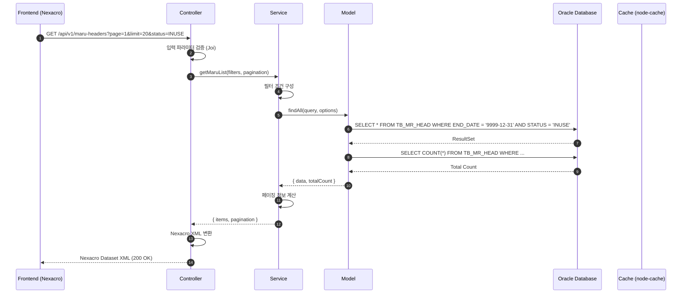
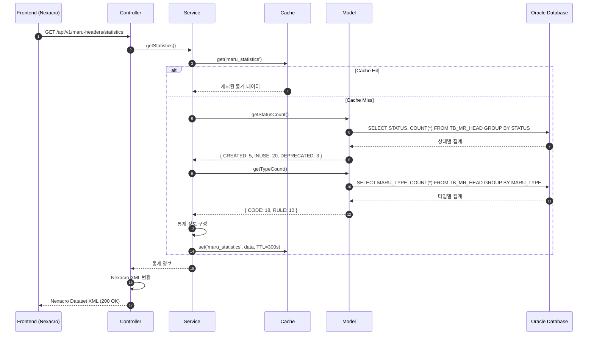
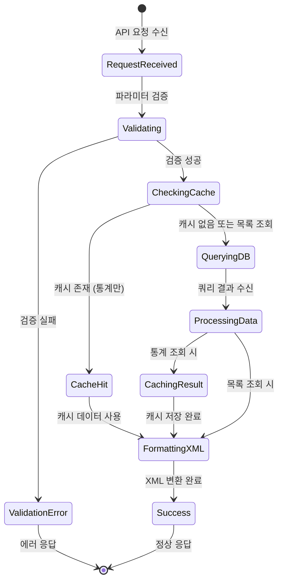

# 📄 상세설계서 - Task 4.1 MR0200 Backend API 구현

**Template Version:** 1.3.0 — **Last Updated:** 2025-10-05

---

## 0. 문서 메타데이터

* 문서명: `Task 4.1 MR0200 Backend API 구현(상세설계).md`
* 버전/작성일/작성자: v2.0 / 2025-10-05 / Claude Code
* 참조 문서:
  - `./docs/project/maru/00.foundation/01.project-charter/business-requirements.md`
  - `./docs/project/maru/00.foundation/02.design-baseline/3. api-design.md`
  - `./docs/project/maru/00.foundation/02.design-baseline/2. database-design.md`
  - `./docs/project/maru/00.foundation/02.design-baseline/5. program-list.md`
* 위치: `./docs/project/maru/10.design/12.detail-design/`
* 관련 이슈/티켓: Task 4.1
* 상위 요구사항 문서/ID: BRD - 마루 목록 및 현황 조회
* 요구사항 추적 담당자: 시스템 아키텍트
* 추적성 관리 도구: tasks.md

---

## 1. 목적 및 범위

### 목적
MR0200 화면의 Backend API를 구현하여 마루 헤더 목록 조회, 검색/필터링, 통계 정보 제공 기능을 지원한다.

### 범위
**포함**:
- 마루 헤더 목록 조회 API (페이징 지원)
- 고급 검색 및 필터링 API
- 마루 현황 통계 정보 API
- 캐시 전략 구현

**제외**:
- Frontend UI 구현 (Task 4.2)
- 상세 조회 및 수정 기능 (Task 3.1)
- 이력 조회 기능 (Task 5.1)

---

## 2. 요구사항 & 승인 기준 (Acceptance Criteria)

### 2.1. 요구사항
* 요구사항 원본 링크: `business-requirements.md` - 마루 현황 조회

**기능 요구사항**:

* **[REQ-001]** 마루 헤더 목록을 페이징 형태로 조회할 수 있어야 한다
  - 페이지 번호, 페이지 크기 파라미터 지원
  - 전체 건수 및 페이지 정보 반환

* **[REQ-002]** 다양한 조건으로 마루 헤더를 필터링할 수 있어야 한다
  - 마루 타입 (CODE/RULE)
  - 마루 상태 (CREATED/INUSE/DEPRECATED)
  - 우선순위 사용 여부
  - 검증 상태
  - 마루명 검색 (부분 일치)
  - 생성일 기간 검색
  - 정렬 기준 지원 (생성일, 마루명, 상태)

* **[REQ-003]** 마루 현황 통계 정보를 제공해야 한다
  - 전체 마루 수
  - 상태별 마루 수 (CREATED/INUSE/DEPRECATED)
  - 타입별 마루 수 (CODE/RULE)
  - 최근 생성된 마루 목록

* **[REQ-004]** 성능 최적화를 위한 캐시 전략을 구현해야 한다
  - 통계 정보 캐싱 (5분)
  - 캐시 무효화 API 제공

**비기능 요구사항**:
* **[NFR-001]** 응답 시간: 목록 조회 < 1초, 통계 조회 < 500ms
* **[NFR-002]** 페이징: 최대 1000건까지 한 번에 조회 가능
* **[NFR-003]** 동시성: 최소 10명의 동시 사용자 지원
* **[NFR-004]** 데이터 정확성: 최신 데이터 반영 (선분 이력 모델 준수)

**승인 기준**:
* [ ] 모든 필터 조건이 정상 동작하는지 검증
* [ ] 페이징이 올바르게 동작하는지 검증
* [ ] 통계 정보가 실시간 데이터와 일치하는지 검증
* [ ] 캐시 전략이 성능 향상에 기여하는지 검증
* [ ] Nexacro XML 응답 형식이 올바른지 검증

### 2.2. 요구사항-설계 추적 매트릭스

| 요구사항 ID | 요구사항 설명 | 설계 섹션/아티팩트 | 테스트 케이스 ID | 상태 | 비고 |
|-------------|---------------|--------------------|------------------|------|------|
| REQ-001 | 페이징 목록 조회 | §8.1 API MH001 | TC-API-001 | 설계 완료 | |
| REQ-002 | 검색/필터링 | §8.1 API MH001 | TC-API-002 | 설계 완료 | |
| REQ-003 | 통계 정보 제공 | §8.2 API MH008 | TC-API-003 | 설계 완료 | |
| REQ-004 | 캐시 전략 | §11 성능 및 확장성 | TC-PERF-001 | 설계 완료 | |
| NFR-001 | 응답 시간 | §11 성능 및 확장성 | TC-PERF-002 | 설계 완료 | |
| NFR-002 | 페이징 제한 | §8.1 API MH001 | TC-API-004 | 설계 완료 | |
| NFR-003 | 동시성 지원 | §11 성능 및 확장성 | TC-PERF-003 | 설계 완료 | |
| NFR-004 | 데이터 정확성 | §5.1 프로세스 설명 | TC-DATA-001 | 설계 완료 | |

---

## 3. 용어/가정/제약

### 용어 정의
- **마루 (MARU)**: 마스터 코드 또는 비즈니스 룰의 집합을 의미하는 시스템 고유 용어
- **선분 이력 모델**: START_DATE와 END_DATE로 데이터의 유효 기간을 관리하는 시간 추적 방식
- **Nexacro Dataset XML**: Nexacro Platform에서 사용하는 데이터 교환 형식

### 가정
- Oracle Database가 정상적으로 운영 중이며 TB_MR_HEAD 테이블이 생성되어 있다
- Backend 서버가 Node.js v20.x 환경에서 실행된다
- 캐시 저장소로 node-cache를 사용한다 (향후 Redis 전환 가능)

### 제약
- PoC 단계로 인증/권한 관리가 구현되지 않음
- 단일 관리자만 사용하므로 복잡한 동시성 제어는 불필요
- 검색 조건은 최대 11개 필터까지 지원

---

## 4. 시스템/모듈 개요

### 역할 및 책임
- **Controller Layer**: HTTP 요청 파싱, 응답 생성, 에러 핸들링
- **Service Layer**: 비즈니스 로직 처리, 데이터 가공, 캐시 관리
- **Model Layer**: 데이터베이스 쿼리 실행, 선분 이력 모델 처리
- **Util Layer**: Nexacro XML 변환, 날짜 포맷 변환, 검증 로직

### 외부 의존성
- **oracledb**: Oracle Database 연결 및 쿼리 실행
- **knex.js**: SQL 쿼리 빌더
- **express**: HTTP 서버 프레임워크
- **node-cache**: 인메모리 캐시 저장소
- **joi**: 입력 검증 라이브러리

### 상호작용 개요
```
Frontend (Nexacro)
  → HTTP Request
    → Express Router
      → Controller (입력 검증)
        → Service (비즈니스 로직 + 캐시)
          → Model (DB 쿼리)
            → Oracle Database
```

---

## 5. 프로세스 흐름

### 5.1 프로세스 설명

#### 마루 목록 조회 프로세스 [REQ-001, REQ-002]
1. Frontend에서 목록 조회 요청 전송 (페이징, 필터 파라미터 포함)
2. Controller에서 입력 파라미터 검증 (Joi 스키마)
3. Service에서 필터 조건 구성 및 쿼리 파라미터 생성
4. Model에서 선분 이력 쿼리 실행 (END_DATE = 9999-12-31인 레코드만 조회)
5. 전체 건수 조회 (페이징 정보 생성용)
6. 결과를 Nexacro Dataset XML 형식으로 변환
7. Frontend로 응답 전송

#### 통계 정보 조회 프로세스 [REQ-003, REQ-004]
1. Frontend에서 통계 정보 요청 전송
2. Service에서 캐시 확인 (5분간 유효)
3. 캐시 Hit: 캐시된 통계 정보 반환
4. 캐시 Miss:
   - Model에서 집계 쿼리 실행 (상태별, 타입별 COUNT)
   - 통계 정보 생성 및 캐시에 저장
   - 결과를 Nexacro Dataset XML 형식으로 변환
5. Frontend로 응답 전송

#### 캐시 무효화 프로세스 [REQ-004]
1. 마루 헤더 생성/수정/삭제 시 Service에서 캐시 클리어 호출
2. 통계 캐시 키 삭제
3. 다음 통계 조회 시 최신 데이터로 재생성

### 5.2. 프로세스 설계 개념도 (Mermaid)

#### 마루 목록 조회 Sequence Diagram



#### 통계 정보 조회 Sequence Diagram



#### 상태 전이 다이어그램



---

## 6. UI 레이아웃 설계 (Text Art + SVG)

> **주의**: 본 Task는 Backend API 구현이므로 UI 설계는 Task 4.2에서 수행됩니다.
> 이 섹션은 생략합니다.

---

## 7. 데이터/메시지 구조 (개념 수준)

### 7.1. 입력 데이터 구조

#### 목록 조회 쿼리 파라미터
| 파라미터 | 타입 | 필수 | 기본값 | 설명 | 제약 조건 |
|----------|------|------|--------|------|-----------|
| page | number | N | 1 | 페이지 번호 | 1 이상 |
| limit | number | N | 20 | 페이지 크기 | 1~1000 |
| type | string | N | - | 마루 타입 필터 | CODE, RULE |
| status | string | N | - | 상태 필터 | CREATED, INUSE, DEPRECATED |
| priorityUse | string | N | - | 우선순위 사용 여부 | Y, N |
| search | string | N | - | 마루명 검색 (부분일치) | 최대 200자 |
| fromDate | string | N | - | 시작일 (ISO 8601) | YYYY-MM-DD 형식 |
| toDate | string | N | - | 종료일 (ISO 8601) | YYYY-MM-DD 형식 |
| sortBy | string | N | START_DATE | 정렬 기준 | START_DATE, MARU_NAME, MARU_STATUS |
| sortOrder | string | N | DESC | 정렬 순서 | ASC, DESC |

### 7.2. 출력 데이터 구조

#### 목록 조회 응답 (Nexacro Dataset XML)
```xml
<?xml version="1.0" encoding="UTF-8"?>
<Dataset>
  <ErrorCode>0</ErrorCode>
  <ErrorMsg></ErrorMsg>
  <SuccessRowCount>20</SuccessRowCount>
  <TotalCount>150</TotalCount>
  <CurrentPage>1</CurrentPage>
  <TotalPages>8</TotalPages>

  <ColumnInfo>
    <Column id="MARU_ID" type="STRING" size="50"/>
    <Column id="VERSION" type="INT" size="4"/>
    <Column id="MARU_NAME" type="STRING" size="200"/>
    <Column id="MARU_STATUS" type="STRING" size="20"/>
    <Column id="MARU_TYPE" type="STRING" size="10"/>
    <Column id="PRIORITY_USE_YN" type="STRING" size="1"/>
    <Column id="START_DATE" type="STRING" size="14"/>
    <Column id="END_DATE" type="STRING" size="14"/>
  </ColumnInfo>

  <Rows>
    <!-- 실제 데이터 행들 -->
  </Rows>
</Dataset>
```

#### 통계 정보 응답 (Nexacro Dataset XML)
```xml
<?xml version="1.0" encoding="UTF-8"?>
<Dataset>
  <ErrorCode>0</ErrorCode>
  <ErrorMsg></ErrorMsg>
  <SuccessRowCount>1</SuccessRowCount>

  <ColumnInfo>
    <Column id="TOTAL_COUNT" type="INT" size="4"/>
    <Column id="STATUS_CREATED" type="INT" size="4"/>
    <Column id="STATUS_INUSE" type="INT" size="4"/>
    <Column id="STATUS_DEPRECATED" type="INT" size="4"/>
    <Column id="TYPE_CODE" type="INT" size="4"/>
    <Column id="TYPE_RULE" type="INT" size="4"/>
    <Column id="CACHE_STATUS" type="STRING" size="10"/>
  </ColumnInfo>

  <Rows>
    <Row>
      <Col id="TOTAL_COUNT">150</Col>
      <Col id="STATUS_CREATED">25</Col>
      <Col id="STATUS_INUSE">100</Col>
      <Col id="STATUS_DEPRECATED">25</Col>
      <Col id="TYPE_CODE">90</Col>
      <Col id="TYPE_RULE">60</Col>
      <Col id="CACHE_STATUS">HIT</Col>
    </Row>
  </Rows>
</Dataset>
```

### 7.3. 시스템간 I/F 데이터 구조

**Database 쿼리 결과 → Service Layer 변환**
- Oracle TIMESTAMP → ISO 8601 문자열 (`YYYYMMDDHHMMSS` 형식)
- NULL 값 → 빈 문자열 처리
- 숫자 타입 → 문자열 변환 (Nexacro Dataset 호환성)

---

## 8. 인터페이스 계약 (Contract)

### 8.1. API MH001: 마루 헤더 목록 조회 [REQ-001, REQ-002]

**엔드포인트**: `GET /api/v1/maru-headers`

**쿼리 파라미터**: §7.1 참조

**성공 응답** (HTTP 200):
- Content-Type: `text/xml; charset=utf-8`
- Body: Nexacro Dataset XML (§7.2 참조)
- ErrorCode: `0`

**오류 응답**:
| ErrorCode | ErrorMsg | HTTP Status | 발생 조건 |
|-----------|----------|-------------|-----------|
| -400 | 잘못된 페이지 번호입니다 | 200 | page < 1 |
| -400 | 페이지 크기는 1~1000 사이여야 합니다 | 200 | limit < 1 또는 > 1000 |
| -400 | 잘못된 마루 타입입니다 | 200 | type이 CODE, RULE이 아님 |
| -400 | 잘못된 상태값입니다 | 200 | status가 CREATED, INUSE, DEPRECATED가 아님 |
| -400 | 날짜 형식이 올바르지 않습니다 | 200 | fromDate/toDate가 ISO 8601이 아님 |
| -200 | 데이터베이스 연결 오류 | 200 | DB 연결 실패 |
| -200 | 시스템 오류가 발생했습니다 | 200 | 내부 서버 오류 |

**검증 케이스**:
- [ ] 페이징이 정상 동작하는지 (page=2&limit=10)
- [ ] 모든 필터 조건이 개별적으로 동작하는지
- [ ] 필터 조건 조합이 AND 조건으로 동작하는지
- [ ] 정렬이 정상 동작하는지 (sortBy, sortOrder)
- [ ] 전체 건수가 정확한지
- [ ] 선분 이력 모델이 올바르게 적용되는지 (END_DATE = 9999-12-31)

**Swagger 주소**: `http://localhost:3000/api-docs#/Maru%20Headers/get_api_v1_maru_headers`

---

### 8.2. API MH008: 마루 현황 통계 조회 [REQ-003, REQ-004]

**엔드포인트**: `GET /api/v1/maru-headers/statistics`

**쿼리 파라미터**: 없음

**성공 응답** (HTTP 200):
- Content-Type: `text/xml; charset=utf-8`
- Body: Nexacro Dataset XML (§7.2 통계 정보 응답 참조)
- ErrorCode: `0`

**오류 응답**:
| ErrorCode | ErrorMsg | HTTP Status | 발생 조건 |
|-----------|----------|-------------|-----------|
| -200 | 데이터베이스 연결 오류 | 200 | DB 연결 실패 |
| -200 | 시스템 오류가 발생했습니다 | 200 | 내부 서버 오류 |

**검증 케이스**:
- [ ] 통계 정보가 실제 데이터와 일치하는지
- [ ] 캐시가 정상 동작하는지 (5분간 유효)
- [ ] 캐시 Hit/Miss 상태가 정확하게 반환되는지

**Swagger 주소**: `http://localhost:3000/api-docs#/Maru%20Headers/get_api_v1_maru_headers_statistics`

---

### 8.3. API MH009: 통계 캐시 무효화 [REQ-004]

**엔드포인트**: `POST /api/v1/maru-headers/clear-cache`

**요청 본문**: 없음

**성공 응답** (HTTP 200):
```xml
<?xml version="1.0" encoding="UTF-8"?>
<Dataset>
  <ErrorCode>0</ErrorCode>
  <ErrorMsg></ErrorMsg>
  <SuccessRowCount>1</SuccessRowCount>

  <ColumnInfo>
    <Column id="RESULT" type="STRING" size="10"/>
    <Column id="MESSAGE" type="STRING" size="200"/>
  </ColumnInfo>

  <Rows>
    <Row>
      <Col id="RESULT">SUCCESS</Col>
      <Col id="MESSAGE">캐시가 정상적으로 삭제되었습니다.</Col>
    </Row>
  </Rows>
</Dataset>
```

**검증 케이스**:
- [ ] 캐시 삭제 후 다음 통계 조회 시 최신 데이터가 반환되는지

**Swagger 주소**: `http://localhost:3000/api-docs#/Maru%20Headers/post_api_v1_maru_headers_clear_cache`

---

## 9. 오류/예외/경계조건

### 9.1. 예상 오류 상황 및 처리 방안

| 오류 상황 | 오류 코드 | 처리 방안 |
|-----------|-----------|-----------|
| 데이터베이스 연결 실패 | -200 | 오류 로그 기록 후 사용자에게 시스템 오류 메시지 반환 |
| 쿼리 타임아웃 (30초 초과) | -200 | 쿼리 중단 후 타임아웃 메시지 반환, 인덱스 최적화 필요 알림 |
| 캐시 저장 실패 | 무시 | 로그 기록 후 계속 진행 (캐시는 선택적 기능) |
| 잘못된 입력 파라미터 | -400 | 상세한 검증 오류 메시지 반환 (필드명, 허용값 포함) |
| 페이징 범위 초과 | -400 | 최대 페이지 번호 안내 메시지 반환 |
| 빈 결과 집합 | 0 | ErrorCode=0, SuccessRowCount=0으로 정상 응답 |
| 날짜 형식 오류 | -400 | ISO 8601 형식 예시 포함한 오류 메시지 반환 |

### 9.2. 복구 전략 및 사용자 메시지

**데이터베이스 오류**:
- 복구 전략: 자동 재연결 시도 (최대 3회, 지수 백오프)
- 사용자 메시지: "데이터베이스 연결에 실패했습니다. 잠시 후 다시 시도해주세요."

**쿼리 타임아웃**:
- 복구 전략: 쿼리 취소 및 리소스 정리
- 사용자 메시지: "조회 시간이 초과되었습니다. 검색 조건을 좁혀서 다시 시도해주세요."

**캐시 오류**:
- 복구 전략: 캐시 없이 DB에서 직접 조회
- 사용자 메시지: 없음 (내부적으로 처리)

---

## 10. 보안/품질 고려

### 보안 고려사항
- **SQL Injection 방지**: knex.js의 Parameterized Query 사용
- **입력 검증**: Joi 스키마를 통한 엄격한 검증
- **XSS 방지**: 사용자 입력값 이스케이프 처리 (XML 특수문자)
- **민감 정보 보호**: 로그에 민감 정보 미기록

### 품질 고려사항
- **로깅**: Winston 라이브러리를 통한 구조화된 로그
  - INFO: API 요청/응답 (성공)
  - WARN: 재시도 발생, 캐시 실패
  - ERROR: DB 오류, 시스템 오류
- **모니터링**: API 응답 시간 측정 및 메트릭 수집
- **테스트 커버리지**: 최소 80% 이상 (단위 테스트 + 통합 테스트)

### i18n/l10n 고려사항
- 현재 PoC 단계에서는 한국어만 지원
- 향후 확장 시 에러 메시지 다국어화 준비 (메시지 키 코드 사용)

---

## 11. 성능 및 확장성

### 목표/지표
- **목록 조회 응답 시간**: 평균 < 500ms, 95 percentile < 1000ms
- **통계 조회 응답 시간**: 평균 < 200ms, 95 percentile < 500ms
- **동시 사용자**: 10명 이상 지원
- **처리량**: 초당 50 요청 이상

### 병목 예상 지점과 완화 전략

| 병목 지점 | 완화 전략 |
|-----------|-----------|
| 복잡한 필터 조건의 DB 쿼리 | 인덱스 최적화 (END_DATE, START_DATE, MARU_STATUS 복합 인덱스) |
| 통계 집계 쿼리 | 캐시 사용 (5분 TTL) |
| 대량 데이터 조회 | 페이징 강제 (최대 1000건) |
| XML 변환 오버헤드 | 템플릿 기반 빠른 변환 (문자열 조립) |

### 부하/장애 시나리오 대응

**고부하 시나리오**:
- 증상: 응답 시간 > 2초
- 대응: 캐시 TTL 연장 (10분), 페이지 크기 제한 축소 (최대 500건)

**DB 장애 시나리오**:
- 증상: DB 연결 실패
- 대응: 재연결 시도 (최대 3회) → 실패 시 Circuit Breaker 작동 → 사용자에게 안내

**캐시 장애 시나리오**:
- 증상: 캐시 저장/조회 실패
- 대응: 캐시 우회하여 DB 직접 조회

---

## 12. 테스트 전략 (TDD 계획)

### 실패 테스트 시나리오
1. **입력 검증 실패 테스트**
   - 잘못된 페이지 번호 (0, -1)
   - 잘못된 페이지 크기 (0, 1001)
   - 잘못된 타입 ('INVALID')
   - 잘못된 날짜 형식 ('2025-13-99')

2. **비즈니스 로직 실패 테스트**
   - 데이터가 없는 경우 빈 배열 반환
   - 페이지 범위 초과 시 빈 배열 반환

3. **DB 오류 테스트**
   - DB 연결 실패 시 -200 에러 반환
   - 쿼리 타임아웃 시 -200 에러 반환

### 최소 구현 전략
1. **1단계**: 기본 목록 조회 (필터 없음, 페이징만)
2. **2단계**: 단일 필터 조건 추가 (status)
3. **3단계**: 모든 필터 조건 추가
4. **4단계**: 통계 조회 추가
5. **5단계**: 캐시 전략 추가

### 리팩터링 포인트
- 필터 조건 구성 로직 → 별도 함수로 분리 (가독성 향상)
- Nexacro XML 변환 로직 → 재사용 가능한 헬퍼 함수로 추출
- 에러 처리 → 공통 미들웨어로 통합

---

## 13. API 테스트케이스

> **주의**: 본 Task는 Backend API 구현이므로 UI 테스트케이스는 Task 4.2 (Frontend UI 구현)에서 수행됩니다.
> 이 섹션에서는 API 레벨의 검증 테스트케이스만 작성합니다.

### 13-1. API 기능 테스트케이스

| 테스트 ID | API 엔드포인트 | 테스트 시나리오 | 실행 단계 | 예상 결과 | 검증 기준 | 요구사항 | 우선순위 |
|-----------|----------------|-----------------|-----------|-----------|-----------|----------|----------|
| TC-API-001 | GET /api/v1/maru-headers | 기본 목록 조회 | 1. 파라미터 없이 요청<br>2. 응답 확인 | ErrorCode=0<br>SuccessRowCount > 0 | 기본 페이징 (20건) 적용 | [REQ-001] | High |
| TC-API-002 | GET /api/v1/maru-headers | 페이징 동작 확인 | 1. page=2&limit=10 요청<br>2. 응답 확인 | CurrentPage=2<br>SuccessRowCount=10 | 올바른 페이지 데이터 반환 | [REQ-001] | High |
| TC-API-003 | GET /api/v1/maru-headers | 상태 필터 적용 | 1. status=INUSE 요청<br>2. 결과 확인 | 모든 행의 MARU_STATUS=INUSE | 필터 조건 정확 적용 | [REQ-002] | High |
| TC-API-004 | GET /api/v1/maru-headers | 타입 필터 적용 | 1. type=CODE 요청<br>2. 결과 확인 | 모든 행의 MARU_TYPE=CODE | 필터 조건 정확 적용 | [REQ-002] | High |
| TC-API-005 | GET /api/v1/maru-headers | 검색 기능 | 1. search=부서 요청<br>2. 결과 확인 | 모든 행의 MARU_NAME에 '부서' 포함 | 부분 일치 검색 동작 | [REQ-002] | Medium |
| TC-API-006 | GET /api/v1/maru-headers | 날짜 범위 필터 | 1. fromDate=2025-01-01&toDate=2025-12-31 요청<br>2. 결과 확인 | START_DATE가 범위 내 | 날짜 필터 정확 적용 | [REQ-002] | Medium |
| TC-API-007 | GET /api/v1/maru-headers | 정렬 기능 | 1. sortBy=MARU_NAME&sortOrder=ASC 요청<br>2. 결과 확인 | MARU_NAME 오름차순 정렬 | 정렬 정확 동작 | [REQ-002] | Medium |
| TC-API-008 | GET /api/v1/maru-headers | 복합 필터 적용 | 1. status=INUSE&type=CODE&search=부서 요청<br>2. 결과 확인 | 모든 조건 만족하는 데이터만 반환 | AND 조건으로 동작 | [REQ-002] | High |
| TC-API-009 | GET /api/v1/maru-headers/statistics | 통계 조회 | 1. 통계 API 요청<br>2. 응답 확인 | ErrorCode=0<br>통계 정보 반환 | 집계 값 정확성 | [REQ-003] | High |
| TC-API-010 | GET /api/v1/maru-headers/statistics | 캐시 동작 확인 | 1. 통계 API 2회 연속 요청<br>2. CACHE_STATUS 확인 | 1차: MISS, 2차: HIT | 캐시 정상 동작 | [REQ-004] | Medium |
| TC-API-011 | POST /api/v1/maru-headers/clear-cache | 캐시 무효화 | 1. 캐시 클리어 요청<br>2. 통계 조회<br>3. CACHE_STATUS 확인 | CACHE_STATUS=MISS | 캐시 삭제 확인 | [REQ-004] | Medium |

### 13-2. API 오류 테스트케이스

| 테스트 ID | 테스트 시나리오 | 입력 값 | 예상 ErrorCode | 예상 ErrorMsg | 요구사항 |
|-----------|-----------------|---------|----------------|---------------|----------|
| TC-ERR-001 | 잘못된 페이지 번호 | page=0 | -400 | 잘못된 페이지 번호입니다 | [NFR-002] |
| TC-ERR-002 | 페이지 크기 초과 | limit=1001 | -400 | 페이지 크기는 1~1000 사이여야 합니다 | [NFR-002] |
| TC-ERR-003 | 잘못된 타입 | type=INVALID | -400 | 잘못된 마루 타입입니다 | [REQ-002] |
| TC-ERR-004 | 잘못된 상태 | status=WRONG | -400 | 잘못된 상태값입니다 | [REQ-002] |
| TC-ERR-005 | 잘못된 날짜 형식 | fromDate=2025/01/01 | -400 | 날짜 형식이 올바르지 않습니다 | [REQ-002] |
| TC-ERR-006 | DB 연결 실패 시뮬레이션 | (DB 중단) | -200 | 데이터베이스 연결 오류 | [NFR-001] |

### 13-3. 성능 테스트케이스

| 테스트 ID | 성능 지표 | 측정 방법 | 목표 기준 | 측정 도구 | 실행 조건 |
|-----------|-----------|-----------|-----------|-----------|-----------|
| TC-PERF-001 | 목록 조회 응답 시간 | API 호출 후 응답까지 시간 측정 | 평균 < 500ms | Apache Bench | 1000건 데이터 |
| TC-PERF-002 | 통계 조회 응답 시간 | API 호출 후 응답까지 시간 측정 | 평균 < 200ms | Apache Bench | 캐시 Miss 상태 |
| TC-PERF-003 | 동시 사용자 처리 | 10명 동시 요청 | 모든 요청 < 2초 | Apache Bench (concurrency=10) | 표준 데이터셋 |
| TC-PERF-004 | 대용량 페이징 처리 | 1000건 조회 요청 | 응답 < 2초 | Postman | limit=1000 |

### 13-4. 데이터 정확성 테스트케이스

| 테스트 ID | 테스트 대상 | 검증 방법 | 합격 기준 |
|-----------|-------------|-----------|-----------|
| TC-DATA-001 | 선분 이력 모델 준수 | END_DATE=9999-12-31인 레코드만 조회되는지 확인 | 모든 결과 레코드의 END_DATE 확인 |
| TC-DATA-002 | 전체 건수 정확성 | TotalCount와 실제 DB COUNT(*) 비교 | 값 일치 |
| TC-DATA-003 | 통계 정확성 | 통계 API 결과와 실제 집계 쿼리 결과 비교 | 모든 통계 값 일치 |
| TC-DATA-004 | 페이징 연속성 | page=1,2,3 연속 조회 후 중복/누락 확인 | 중복 없음, 누락 없음 |

---

**문서 승인**

| 역할 | 이름 | 서명 | 날짜 |
|------|------|------|------|
| 시스템 아키텍트 | | | 2025-10-05 |
| Backend 개발자 | | | 2025-10-05 |
| QA 엔지니어 | | | 2025-10-05 |
