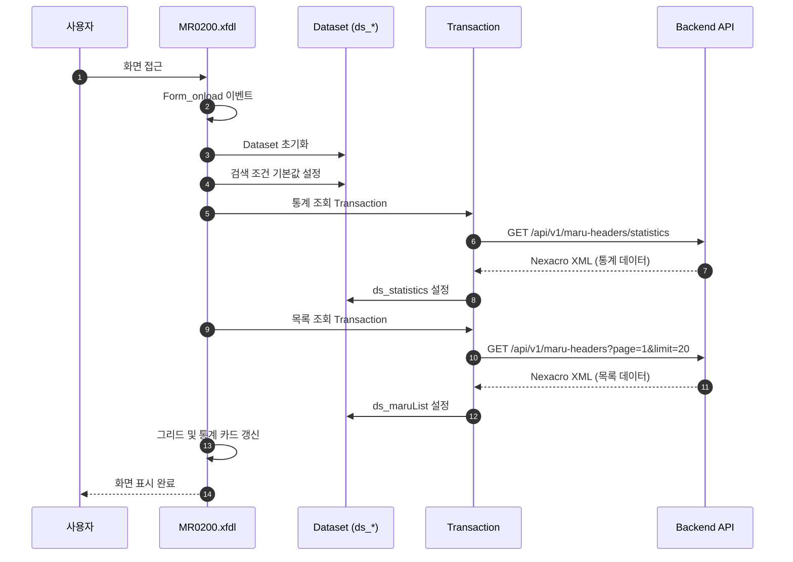
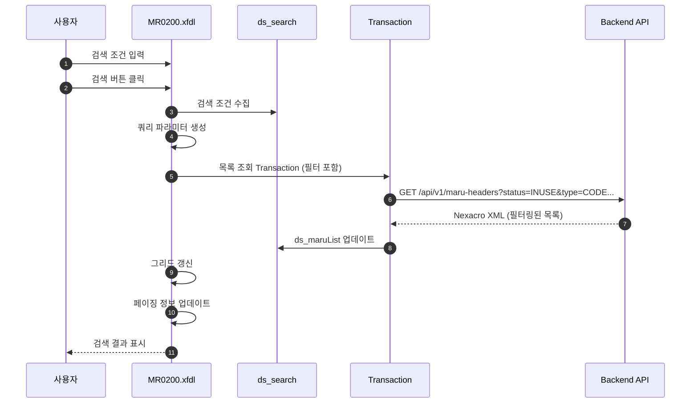
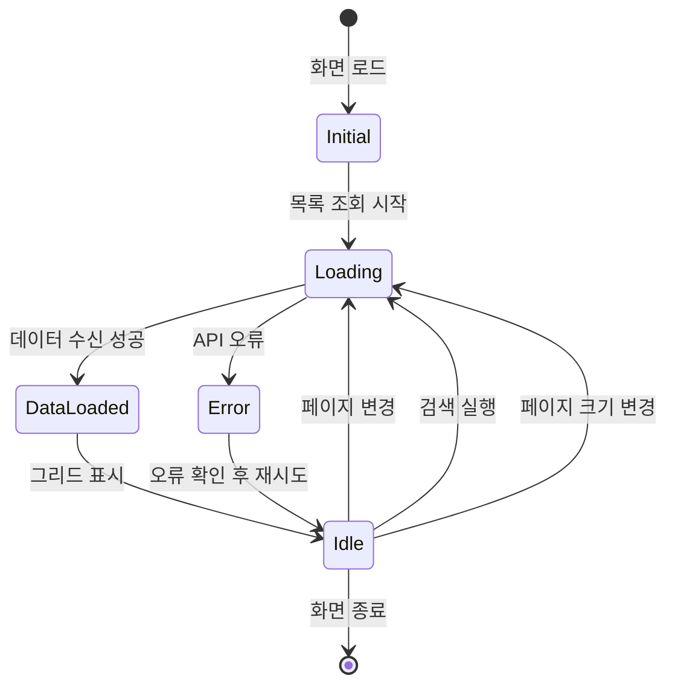
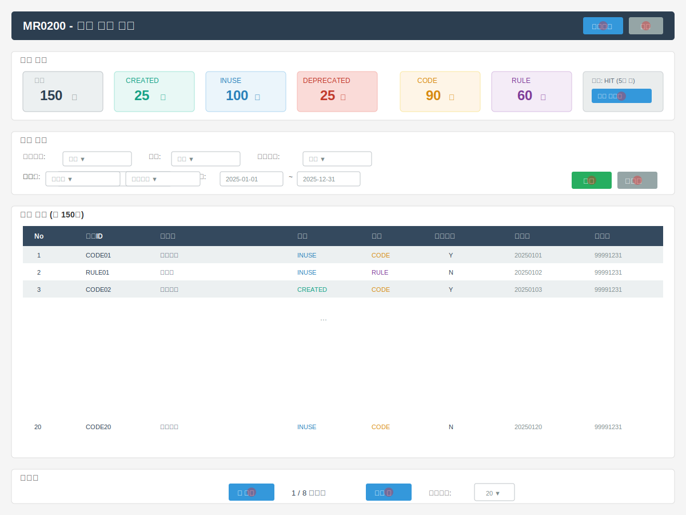

# 📄 상세설계서 - Task 4.2 MR0200 Frontend UI 구현

**Template Version:** 1.3.0 — **Last Updated:** 2025-10-05

---

## 0. 문서 메타데이터

* 문서명: `Task 4.2 MR0200 Frontend UI 구현(상세설계-v3).md`
* 버전/작성일/작성자: v3.0 / 2025-10-05 / Claude Code
* 참조 문서:
  - `./docs/project/maru/00.foundation/01.project-charter/business-requirements.md`
  - `./docs/project/maru/10.design/12.detail-design/Task-4-1.MR0200-Backend-API-구현(상세설계).md`
  - `./docs/common/06.guide/LLM_Nexacro_Development_Guide.md`
  - `./docs/common/06.guide/Nexacro_N_V24_Components.md`
* 위치: `./docs/project/maru/10.design/12.detail-design/`
* 관련 이슈/티켓: Task 4.2
* 상위 요구사항 문서/ID: BRD - 마루 현황 조회, Task 4.1 Backend API
* 요구사항 추적 담당자: UI/UX 디자이너, Frontend 개발자
* 추적성 관리 도구: tasks.md

---

## 1. 목적 및 범위

### 목적
MR0200 마루 현황 조회 화면의 Frontend UI를 Nexacro N V24 프레임워크로 구현하여 사용자가 마루 헤더 목록을 조회하고, 검색/필터링하며, 현황 통계를 확인할 수 있도록 한다.

### 범위
**포함**:
- Nexacro Form 설계 및 구현 (MR0200.xfdl)
- Dataset 구조 정의 (목록, 통계, 검색 조건)
- Backend API 연동 (Task 4.1의 MH001, MH008, MH009)
- 검색/필터 UI 구현 (11개 조건)
- 그리드 목록 표시 (페이징 지원)
- 현황 요약 카드 표시 (통계 정보)
- UI 테스트케이스 작성

**제외**:
- Backend API 구현 (Task 4.1에서 완료)
- 상세 조회 및 수정 기능 (MR0100에서 처리)
- 이력 조회 기능 (MR0300에서 처리)

---

## 2. 요구사항 & 승인 기준 (Acceptance Criteria)

### 2.1. 요구사항
* 요구사항 원본 링크: `business-requirements.md` - 마루 현황 조회, `Task-4-1.MR0200-Backend-API-구현(상세설계).md`

**기능 요구사항**:

* **[REQ-UI-001]** 마루 헤더 목록을 그리드로 표시해야 한다
  - 10개 컬럼 표시 (마루ID, 버전, 마루명, 상태, 타입, 우선순위, 시작일, 종료일 등)
  - 페이징 처리 (페이지당 20건 기본)
  - 행 선택 시 상세 정보 확인 가능

* **[REQ-UI-002]** 다양한 검색 조건을 제공해야 한다
  - 마루 타입 필터 (Combo)
  - 마루 상태 필터 (Combo)
  - 우선순위 사용 여부 (Combo)
  - 마루명 검색 (Edit)
  - 생성일 기간 검색 (Calendar)
  - 정렬 기준 선택 (Combo)
  - 검색 버튼 및 초기화 버튼

* **[REQ-UI-003]** 현황 요약 정보를 카드 형태로 표시해야 한다
  - 전체 마루 수
  - 상태별 마루 수 (CREATED/INUSE/DEPRECATED)
  - 타입별 마루 수 (CODE/RULE)
  - 캐시 상태 표시

* **[REQ-UI-004]** 페이징 네비게이션을 제공해야 한다
  - 이전/다음 페이지 이동 버튼
  - 페이지 번호 직접 입력
  - 페이지 크기 변경 (10/20/50/100)
  - 전체 건수 및 페이지 정보 표시

* **[REQ-UI-005]** Backend API와 연동하여 데이터를 조회해야 한다
  - GET /api/v1/maru-headers (목록 조회)
  - GET /api/v1/maru-headers/statistics (통계 조회)
  - POST /api/v1/maru-headers/clear-cache (캐시 초기화)

**비기능 요구사항**:
* **[NFR-UI-001]** 화면 로딩 시간: 초기 렌더링 < 2초
* **[NFR-UI-002]** 검색 응답 시간: 검색 버튼 클릭 후 결과 표시 < 1.5초
* **[NFR-UI-003]** 사용성: 최소한의 교육으로 사용 가능한 직관적 UI
* **[NFR-UI-004]** 접근성: 키보드 네비게이션 지원, Tab 순서 논리적 배치

**승인 기준**:
* [ ] 모든 검색 조건이 정상 동작하는지 검증
* [ ] 그리드에 데이터가 올바르게 표시되는지 검증
* [ ] 페이징이 정확하게 동작하는지 검증
* [ ] 통계 정보가 실시간으로 업데이트되는지 검증
* [ ] Backend API와 정상 연동되는지 검증

### 2.2. 요구사항-설계 추적 매트릭스

| 요구사항 ID | 요구사항 설명 | 설계 섹션/아티팩트 | 테스트 케이스 ID | 상태 | 비고 |
|-------------|---------------|--------------------|------------------|------|------|
| REQ-UI-001 | 목록 그리드 표시 | §6 UI 설계, §7 Dataset 구조 | TC-UI-001 | 설계 완료 | |
| REQ-UI-002 | 검색 조건 제공 | §6 UI 설계 | TC-UI-002 | 설계 완료 | |
| REQ-UI-003 | 현황 요약 카드 | §6 UI 설계 | TC-UI-003 | 설계 완료 | |
| REQ-UI-004 | 페이징 네비게이션 | §6 UI 설계, §5.1 프로세스 | TC-UI-004 | 설계 완료 | |
| REQ-UI-005 | Backend API 연동 | §8 인터페이스 계약 | TC-SCENARIO-001 | 설계 완료 | |
| NFR-UI-001 | 화면 로딩 시간 | §11 성능 및 확장성 | TC-PERF-001 | 설계 완료 | |
| NFR-UI-002 | 검색 응답 시간 | §11 성능 및 확장성 | TC-PERF-002 | 설계 완료 | |
| NFR-UI-003 | 사용성 | §6.3 상호작용 가이드 | TC-USABILITY-001 | 설계 완료 | |
| NFR-UI-004 | 접근성 | §6.3 접근성 가이드 | TC-A11Y-001 | 설계 완료 | |

---

## 3. 용어/가정/제약

### 용어 정의
- **Nexacro Dataset**: Nexacro Platform에서 데이터를 관리하는 객체 (Row/Column 구조)
- **Transaction**: Backend API 호출을 통해 데이터를 송수신하는 작업
- **Grid Component**: Nexacro에서 제공하는 표 형태의 데이터 표시 컴포넌트

### 가정
- Backend API (Task 4.1)가 정상적으로 구현되어 있다
- Nexacro N V24 개발 환경이 구성되어 있다
- Backend 서버가 `http://localhost:3000`에서 실행 중이다
- 사용자는 관리자 권한을 가지고 있다 (PoC 단계로 인증 생략)

### 제약
- Nexacro N V24 프레임워크의 컴포넌트만 사용
- Internet Explorer 11 이상 브라우저 지원 불필요 (Chrome, Edge 중심)
- 모바일 환경 최적화는 제외 (Desktop 환경 중심)

---

## 4. 시스템/모듈 개요

### 역할 및 책임
- **Form (MR0200.xfdl)**: UI 레이아웃 및 사용자 이벤트 처리
- **Dataset (ds_*)**: 데이터 저장 및 관리
  - `ds_search`: 검색 조건
  - `ds_maruList`: 마루 목록 데이터
  - `ds_statistics`: 통계 정보
- **Transaction**: Backend API와 HTTP 통신
- **Event Handlers**: 버튼 클릭, 그리드 선택 등 사용자 액션 처리

### 외부 의존성
- **Backend API**: Node.js + Express (Task 4.1)
- **Nexacro Runtime**: Nexacro N V24 브라우저 플러그인

### 상호작용 개요
```
사용자 (Browser)
  ↓ 이벤트 (버튼 클릭, 입력)
MR0200.xfdl (Nexacro Form)
  ↓ Transaction 호출
Backend API (Node.js)
  ↓ 쿼리 실행
Oracle Database
  ↓ 결과 반환
Backend API → Nexacro XML
  ↓ Dataset 바인딩
Grid/Static 컴포넌트
  ↓ 화면 표시
사용자 확인
```

---

## 5. 프로세스 흐름

### 5.1 프로세스 설명

#### 화면 초기화 프로세스 [REQ-UI-001, REQ-UI-003]
1. Form_onload 이벤트 발생
2. Dataset 초기화 (ds_search, ds_maruList, ds_statistics)
3. 검색 조건 기본값 설정 (페이지=1, 페이지크기=20)
4. 통계 정보 조회 Transaction 실행 (GET /api/v1/maru-headers/statistics)
5. 목록 조회 Transaction 실행 (GET /api/v1/maru-headers?page=1&limit=20)
6. 그리드 및 통계 카드에 데이터 바인딩

#### 검색 실행 프로세스 [REQ-UI-002, REQ-UI-005]
1. 사용자가 검색 조건 입력
2. 검색 버튼 클릭 이벤트 발생
3. ds_search Dataset에서 조건 수집
4. 쿼리 파라미터 생성 (type, status, search, fromDate, toDate 등)
5. 목록 조회 Transaction 실행 (필터 조건 포함)
6. 응답 데이터를 ds_maruList에 설정
7. 그리드 갱신 및 페이징 정보 업데이트

#### 페이징 처리 프로세스 [REQ-UI-004]
1. 사용자가 페이지 이동 버튼 클릭 (이전/다음/페이지 번호)
2. 현재 페이지 번호 업데이트
3. 목록 조회 Transaction 재실행 (새로운 page 파라미터)
4. 그리드 데이터 갱신
5. 페이징 네비게이션 UI 업데이트

#### 통계 갱신 프로세스 [REQ-UI-003]
1. 목록 조회 성공 시 통계 조회 Transaction 자동 실행
2. 통계 API 호출 (GET /api/v1/maru-headers/statistics)
3. ds_statistics Dataset에 결과 설정
4. 통계 카드 UI 업데이트 (전체/상태별/타입별)

### 5.2. 프로세스 설계 개념도 (Mermaid)

#### 화면 초기화 Sequence Diagram



#### 검색 실행 Sequence Diagram



#### 페이징 상태 전이 다이어그램



---

## 6. UI 레이아웃 설계 (Text Art + SVG)

### 6.1. UI 설계

```
┌──────────────────────────────────────────────────────────────────┐
│  MR0200 - 마루 현황 조회                        [새로고침] [닫기] │
├──────────────────────────────────────────────────────────────────┤
│                                                                  │
│  ┌─ 현황 요약 ─────────────────────────────────────────────┐    │
│  │ ┌─────────┐ ┌─────────┐ ┌─────────┐ ┌─────────┐        │    │
│  │ │ 전체    │ │ CREATED │ │ INUSE   │ │DEPRECATED│       │    │
│  │ │  150건  │ │  25건   │ │ 100건   │ │  25건   │        │    │
│  │ └─────────┘ └─────────┘ └─────────┘ └─────────┘        │    │
│  │ ┌─────────┐ ┌─────────┐ ┌──────────────────────┐       │    │
│  │ │ CODE    │ │ RULE    │ │ 캐시: HIT (5분 전)  │       │    │
│  │ │  90건   │ │  60건   │ │ [캐시 초기화]       │       │    │
│  │ └─────────┘ └─────────┘ └──────────────────────┘       │    │
│  └──────────────────────────────────────────────────────────┘    │
│                                                                  │
│  ┌─ 검색 조건 ─────────────────────────────────────────────┐    │
│  │ 마루타입: [전체▼]  상태: [전체▼]  우선순위: [전체▼]    │    │
│  │ 마루명: [________] 생성일: [2025-01-01] ~ [2025-12-31] │    │
│  │ 정렬: [생성일▼] [내림차순▼]      [검색] [초기화]       │    │
│  └──────────────────────────────────────────────────────────┘    │
│                                                                  │
│  ┌─ 마루 목록 (총 150건) ──────────────────────────────────┐    │
│  │┌────┬─────┬────────┬────────┬──────┬────────┬─────────┐│    │
│  ││ No │마루ID│ 마루명  │  상태  │ 타입 │우선순위│ 생성일  ││    │
│  │├────┼─────┼────────┼────────┼──────┼────────┼─────────┤│    │
│  ││ 1  │CODE01│부서코드 │ INUSE  │ CODE │   Y    │20250101 ││    │
│  ││ 2  │RULE01│직급룰   │ INUSE  │ RULE │   N    │20250102 ││    │
│  ││ 3  │CODE02│직책코드 │CREATED │ CODE │   Y    │20250103 ││    │
│  ││... │      │        │        │      │        │         ││    │
│  ││ 20 │CODE20│위치코드 │ INUSE  │ CODE │   N    │20250120 ││    │
│  │└────┴─────┴────────┴────────┴──────┴────────┴─────────┘│    │
│  └──────────────────────────────────────────────────────────┘    │
│                                                                  │
│  ┌─ 페이징 ───────────────────────────────────────────────┐    │
│  │    [◀ 이전]  1 / 8 페이지  [다음 ▶]  페이지당: [20▼]  │    │
│  └──────────────────────────────────────────────────────────┘    │
│                                                                  │
└──────────────────────────────────────────────────────────────────┘
```

### 6.2. UI 설계(SVG) **[필수 생성]**

> SVG 파일은 이 문서 작성 후 별도로 생성합니다.



### 6.3. 반응형/접근성/상호작용 가이드(텍스트)

**반응형**:
* Desktop (≥ 1024px): 전체 레이아웃 표시
* Nexacro는 기본적으로 Desktop 환경 중심이므로 모바일 반응형은 고려하지 않음

**접근성**:
* **포커스 순서**: 검색 조건 → 검색 버튼 → 그리드 → 페이징 버튼
* **키보드 네비게이션**: Tab 키로 모든 interactive 요소 접근, Enter로 버튼 실행
* **스크린리더**: 각 컴포넌트에 명확한 라벨 제공 (accessibilityLabel 속성)

**상호작용**:
* **검색 조건 변경**: 사용자가 조건 변경 시 자동으로 ds_search Dataset 업데이트
* **검색 버튼 클릭**: 목록 조회 Transaction 실행
* **그리드 행 선택**: 상세 조회 화면으로 이동 (MR0100 연계)
* **페이징 버튼**: 이전/다음 페이지 이동, 페이지 번호 직접 입력 가능
* **캐시 초기화 버튼**: 통계 캐시 삭제 후 통계 재조회

---

## 7. 데이터/메시지 구조 (개념 수준)

### 7.1. Dataset 구조

#### ds_search (검색 조건)
| 컬럼명 | 타입 | 기본값 | 설명 |
|--------|------|--------|------|
| page | INT | 1 | 페이지 번호 |
| limit | INT | 20 | 페이지 크기 |
| type | STRING | "" | 마루 타입 (CODE/RULE) |
| status | STRING | "" | 상태 (CREATED/INUSE/DEPRECATED) |
| priorityUse | STRING | "" | 우선순위 사용 여부 (Y/N) |
| search | STRING | "" | 마루명 검색어 |
| fromDate | STRING | "" | 시작일 (YYYY-MM-DD) |
| toDate | STRING | "" | 종료일 (YYYY-MM-DD) |
| sortBy | STRING | "START_DATE" | 정렬 기준 |
| sortOrder | STRING | "DESC" | 정렬 순서 (ASC/DESC) |

#### ds_maruList (마루 목록)
| 컬럼명 | 타입 | 설명 |
|--------|------|------|
| MARU_ID | STRING | 마루 ID |
| VERSION | INT | 버전 |
| MARU_NAME | STRING | 마루명 |
| MARU_STATUS | STRING | 상태 |
| MARU_TYPE | STRING | 타입 |
| PRIORITY_USE_YN | STRING | 우선순위 사용 여부 |
| START_DATE | STRING | 시작일시 (YYYYMMDDHHMMSS) |
| END_DATE | STRING | 종료일시 (YYYYMMDDHHMMSS) |

#### ds_statistics (통계 정보)
| 컬럼명 | 타입 | 설명 |
|--------|------|------|
| TOTAL_COUNT | INT | 전체 마루 수 |
| STATUS_CREATED | INT | CREATED 상태 수 |
| STATUS_INUSE | INT | INUSE 상태 수 |
| STATUS_DEPRECATED | INT | DEPRECATED 상태 수 |
| TYPE_CODE | INT | CODE 타입 수 |
| TYPE_RULE | INT | RULE 타입 수 |
| CACHE_STATUS | STRING | 캐시 상태 (HIT/MISS) |

### 7.2. Transaction 파라미터

#### 목록 조회 (tran_maruList)
* URL: `http://localhost:3000/api/v1/maru-headers`
* Method: GET
* Input Dataset: ds_search
* Output Dataset: ds_maruList
* 응답 추가 정보: TotalCount, CurrentPage, TotalPages

#### 통계 조회 (tran_statistics)
* URL: `http://localhost:3000/api/v1/maru-headers/statistics`
* Method: GET
* Input Dataset: 없음
* Output Dataset: ds_statistics

#### 캐시 초기화 (tran_clearCache)
* URL: `http://localhost:3000/api/v1/maru-headers/clear-cache`
* Method: POST
* Input Dataset: 없음
* Output Dataset: 없음 (성공/실패만 확인)

---

## 8. 인터페이스 계약 (Contract)

### 8.1. Transaction: tran_maruList [REQ-UI-001, REQ-UI-002]

**목적**: 마루 헤더 목록을 조회하고 그리드에 표시

**입력**:
- Dataset: ds_search
- 파라미터: page, limit, type, status, priorityUse, search, fromDate, toDate, sortBy, sortOrder

**출력**:
- Dataset: ds_maruList
- 추가 정보: TotalCount, CurrentPage, TotalPages (전역 변수에 저장)

**성공 조건**:
- ErrorCode = 0
- SuccessRowCount ≥ 0

**오류 조건**:
- ErrorCode < 0
- ErrorMsg에 오류 메시지 포함

**검증 케이스**:
- [ ] 페이징 파라미터가 올바르게 전달되는지
- [ ] 필터 조건이 AND 조건으로 적용되는지
- [ ] 빈 결과 시 빈 그리드 표시되는지

---

### 8.2. Transaction: tran_statistics [REQ-UI-003]

**목적**: 마루 현황 통계 정보를 조회하여 카드에 표시

**입력**: 없음

**출력**:
- Dataset: ds_statistics

**성공 조건**:
- ErrorCode = 0
- SuccessRowCount = 1

**검증 케이스**:
- [ ] 통계 정보가 실시간 데이터와 일치하는지
- [ ] 캐시 상태가 올바르게 표시되는지

---

### 8.3. Transaction: tran_clearCache [REQ-UI-003]

**목적**: 통계 캐시를 초기화하고 최신 데이터 반영

**입력**: 없음

**출력**: 없음 (성공/실패만 확인)

**성공 조건**:
- ErrorCode = 0

**후속 처리**:
- 캐시 초기화 성공 시 tran_statistics 재실행

---

## 9. 오류/예외/경계조건

### 9.1. 예상 오류 상황 및 처리 방안

| 오류 상황 | 처리 방안 |
|-----------|-----------|
| Backend API 연결 실패 | alert로 오류 메시지 표시 후 재시도 안내 |
| 잘못된 검색 조건 입력 | 입력 검증 후 경고 메시지 표시 |
| 페이지 범위 초과 | 마지막 페이지로 자동 이동 |
| 빈 결과 집합 | "조회된 데이터가 없습니다" 메시지 표시 |
| 통계 조회 실패 | 통계 카드에 "조회 실패" 표시, 목록은 정상 표시 |

### 9.2. 복구 전략 및 사용자 메시지

**Backend API 오류**:
- 복구 전략: 사용자에게 재시도 유도, 지속 시 관리자 문의 안내
- 사용자 메시지: "서버와의 연결에 실패했습니다. 잠시 후 다시 시도해주세요."

**입력 검증 오류**:
- 복구 전략: 잘못된 입력 필드 포커스 이동
- 사용자 메시지: "날짜 형식이 올바르지 않습니다. (YYYY-MM-DD)"

**빈 결과**:
- 복구 전략: 검색 조건 완화 제안
- 사용자 메시지: "조회된 데이터가 없습니다. 검색 조건을 확인해주세요."

---

## 10. 보안/품질 고려

### 보안 고려사항
- **입력 검증**: 특수문자 필터링 (XSS 방지)
- **민감 정보 보호**: 로그에 검색 조건 미기록 (개인정보 포함 가능)
- **인증**: PoC 단계로 생략, 향후 세션 체크 추가 필요

### 품질 고려사항
- **로깅**: Transaction 오류 발생 시 콘솔 로그 기록
- **에러 핸들링**: 모든 Transaction에 onerror, onsuccess 핸들러 등록
- **테스트**: 단위 테스트 및 E2E 테스트 수행

### i18n/l10n 고려사항
- 현재 PoC 단계에서는 한국어만 지원
- 향후 확장 시 메시지 다국어화 준비 (메시지 리소스 분리)

---

## 11. 성능 및 확장성

### 목표/지표
- **화면 로딩 시간**: 초기 렌더링 < 2초
- **검색 응답 시간**: 검색 버튼 클릭 후 결과 표시 < 1.5초
- **그리드 렌더링**: 1000건 데이터 < 3초

### 병목 예상 지점과 완화 전략

| 병목 지점 | 완화 전략 |
|-----------|-----------|
| 대량 데이터 그리드 렌더링 | 페이징 강제 (최대 100건), Virtual Scrolling 고려 |
| Backend API 응답 지연 | 로딩 인디케이터 표시, 타임아웃 설정 (10초) |
| 통계 조회 지연 | Backend 캐시 활용 (5분 TTL) |

### 부하/장애 시나리오 대응

**고부하 시나리오**:
- 증상: 검색 응답 시간 > 3초
- 대응: 페이지 크기 제한 축소 (최대 50건), 캐시 활용

**Backend 장애 시나리오**:
- 증상: API 연결 실패
- 대응: 오류 메시지 표시, 재시도 버튼 제공

---

## 12. 테스트 전략 (TDD 계획)

### 실패 테스트 시나리오
1. **입력 검증 실패 테스트**
   - 잘못된 날짜 형식 입력 시 경고 메시지 표시
   - 페이지 번호 0 또는 음수 입력 시 1로 자동 보정

2. **Backend API 오류 테스트**
   - API 연결 실패 시 오류 메시지 표시
   - 타임아웃 시 재시도 안내

3. **빈 결과 테스트**
   - 조회 결과 0건 시 안내 메시지 표시

### 최소 구현 전략
1. **1단계**: 기본 목록 조회 (필터 없음)
2. **2단계**: 단일 필터 조건 추가 (status)
3. **3단계**: 모든 필터 조건 추가
4. **4단계**: 페이징 처리 추가
5. **5단계**: 통계 카드 추가

### 리팩터링 포인트
- Transaction 공통 오류 핸들러 함수로 분리
- 쿼리 파라미터 생성 로직 재사용 함수화
- 날짜 포맷 변환 유틸 함수 작성

---

## 13. UI 테스트케이스

### 13-1. UI 컴포넌트 테스트케이스

| 테스트 ID | 컴포넌트 | 테스트 시나리오 | 실행 단계 | 예상 결과 | 검증 기준 | 요구사항 | 우선순위 |
|-----------|----------|-----------------|-----------|-----------|-----------|----------|----------|
| TC-UI-001 | Grid (마루 목록) | 목록 데이터 표시 | 1. 화면 로드<br>2. 그리드 확인 | 20건 데이터 표시 | 모든 컬럼 정상 표시 | [REQ-UI-001] | High |
| TC-UI-002 | Combo (마루 타입) | 타입 필터 선택 | 1. 콤보박스 클릭<br>2. "CODE" 선택<br>3. 검색 버튼 클릭 | CODE 타입만 표시 | 모든 행의 타입이 CODE | [REQ-UI-002] | High |
| TC-UI-003 | Combo (상태) | 상태 필터 선택 | 1. 상태 콤보박스 클릭<br>2. "INUSE" 선택<br>3. 검색 버튼 클릭 | INUSE 상태만 표시 | 모든 행의 상태가 INUSE | [REQ-UI-002] | High |
| TC-UI-004 | Edit (마루명 검색) | 검색어 입력 | 1. 검색 입력 필드에 "부서" 입력<br>2. 검색 버튼 클릭 | "부서" 포함 목록 표시 | 모든 행의 마루명에 "부서" 포함 | [REQ-UI-002] | Medium |
| TC-UI-005 | Calendar (기간 검색) | 날짜 범위 선택 | 1. 시작일 선택<br>2. 종료일 선택<br>3. 검색 버튼 클릭 | 기간 내 데이터만 표시 | 모든 행의 생성일이 범위 내 | [REQ-UI-002] | Medium |
| TC-UI-006 | Button (검색) | 검색 실행 | 1. 조건 입력<br>2. 검색 버튼 클릭 | 목록 갱신 | 조건에 맞는 데이터 표시 | [REQ-UI-002] | High |
| TC-UI-007 | Button (초기화) | 검색 조건 초기화 | 1. 조건 입력<br>2. 초기화 버튼 클릭 | 모든 조건 초기화 | 기본값으로 복원 | [REQ-UI-002] | Medium |
| TC-UI-008 | Static (통계 카드) | 통계 정보 표시 | 1. 화면 로드<br>2. 통계 카드 확인 | 통계 정보 표시 | 전체/상태별/타입별 수 표시 | [REQ-UI-003] | High |
| TC-UI-009 | Button (캐시 초기화) | 캐시 삭제 | 1. 캐시 초기화 버튼 클릭<br>2. 통계 재조회 확인 | CACHE_STATUS=MISS | 캐시 상태 변경 확인 | [REQ-UI-003] | Low |
| TC-UI-010 | Button (페이징) | 페이지 이동 | 1. 다음 페이지 버튼 클릭<br>2. 데이터 확인 | 2페이지 데이터 표시 | CurrentPage=2 | [REQ-UI-004] | High |

### 13-2. 사용자 시나리오 테스트케이스

| 시나리오 ID | 시나리오 명 | 사전 조건 | 실행 단계 | 예상 결과 | 후처리 | 요구사항 | 실행 방법 |
|-------------|-------------|-----------|-----------|-----------|--------|----------|-----------|
| TS-001 | 기본 목록 조회 플로우 | Backend API 정상 | 1. MR0200 화면 접근<br>2. 자동 목록 조회 확인<br>3. 통계 정보 확인 | 목록 20건 표시<br>통계 정보 표시 | - | [REQ-UI-001, REQ-UI-003] | Manual/MCP |
| TS-002 | 복합 검색 플로우 | Backend API 정상 | 1. 타입=CODE 선택<br>2. 상태=INUSE 선택<br>3. 검색어="부서" 입력<br>4. 검색 버튼 클릭 | 조건 만족 데이터만 표시 | 초기화 버튼 클릭 | [REQ-UI-002] | MCP 권장 |
| TS-003 | 페이징 네비게이션 플로우 | 목록 100건 이상 | 1. 기본 목록 조회 (1페이지)<br>2. 다음 페이지 클릭<br>3. 이전 페이지 클릭<br>4. 페이지 크기 50으로 변경 | 각 페이지 데이터 정확<br>페이지 크기 변경 반영 | - | [REQ-UI-004] | MCP 권장 |
| TS-004 | 통계 갱신 플로우 | Backend API 정상 | 1. 통계 조회 (캐시 HIT)<br>2. 캐시 초기화 버튼 클릭<br>3. 통계 재조회 확인 (캐시 MISS) | 캐시 상태 변경 확인<br>통계 데이터 최신화 | - | [REQ-UI-003] | Manual |
| TS-005 | 오류 처리 플로우 | Backend API 중단 | 1. 검색 버튼 클릭<br>2. 오류 메시지 확인<br>3. Backend API 재시작<br>4. 재시도 | 오류 메시지 표시<br>재시도 시 정상 조회 | Backend 재시작 | [NFR-UI-001] | Manual |

### 13-3. 접근성 테스트케이스

| 테스트 ID | 테스트 대상 | 테스트 조건 | 검증 방법 | 합격 기준 | 도구/방법 |
|-----------|-------------|-------------|-----------|-----------|-----------|
| TC-A11Y-001 | 키보드 네비게이션 | Tab 키 순차 이동 | 포커스 순서 확인 | 검색 조건 → 버튼 → 그리드 순서 | 수동 테스트 |
| TC-A11Y-002 | 포커스 표시 | Tab 키로 요소 이동 | 포커스 테두리 확인 | 모든 요소에 명확한 포커스 표시 | 수동 테스트 |
| TC-A11Y-003 | 버튼 라벨 | 모든 버튼 확인 | 라벨 텍스트 확인 | 명확한 설명 제공 | 수동 테스트 |

### 13-4. 성능 테스트케이스

| 테스트 ID | 성능 지표 | 측정 방법 | 목표 기준 | 측정 도구 | 실행 조건 |
|-----------|-----------|-----------|-----------|-----------|-----------|
| TC-PERF-001 | 화면 로딩 시간 | 화면 접근부터 데이터 표시까지 | < 2초 | 브라우저 DevTools | 표준 네트워크 |
| TC-PERF-002 | 검색 응답 시간 | 검색 버튼 클릭부터 결과 표시까지 | < 1.5초 | 브라우저 DevTools | 표준 네트워크 |
| TC-PERF-003 | 그리드 렌더링 | 1000건 데이터 렌더링 시간 | < 3초 | 브라우저 Performance API | 최대 페이지 크기 |

### 13-5. MCP Playwright 자동화 스크립트 가이드

> **주의**: Nexacro 애플리케이션은 일반적인 웹 애플리케이션과 다르므로, Playwright를 사용한 자동화 테스트는 제한적일 수 있습니다.
> 대신 Nexacro의 자체 테스트 도구나 수동 테스트를 권장합니다.

**기본 실행 패턴** (개념):
```javascript
// 1. Nexacro 애플리케이션 로드
await page.goto('http://localhost:8080/nexacro/MR0200.html');
await page.waitForLoadState('networkidle');

// 2. 검색 조건 입력 (Nexacro 컴포넌트 ID 기반)
// 실제로는 Nexacro의 DOM 구조에 따라 셀렉터가 달라질 수 있음

// 3. 결과 검증
// Nexacro Grid의 데이터 확인은 일반적인 테이블과 다를 수 있음

// 4. 스크린샷 캡처
await page.screenshot({ path: 'MR0200-search-result.png' });
```

### 13-6. 수동 테스트 체크리스트

**일반 UI 검증**:
- [ ] 모든 버튼이 클릭 가능하고 적절한 피드백 제공
- [ ] 검색 조건 입력 시 즉시 반영
- [ ] 그리드 데이터가 올바르게 표시
- [ ] 페이징 네비게이션이 정확하게 동작
- [ ] 통계 카드가 실시간으로 업데이트

**접근성 검증**:
- [ ] Tab 키로 모든 interactive 요소 접근 가능
- [ ] Enter 키로 버튼 실행 가능
- [ ] 포커스 표시가 명확하고 일관됨

**오류 처리 검증**:
- [ ] Backend API 오류 시 적절한 메시지 표시
- [ ] 빈 결과 시 안내 메시지 표시
- [ ] 잘못된 입력 시 경고 메시지 표시

---

**문서 승인**

| 역할 | 이름 | 서명 | 날짜 |
|------|------|------|------|
| UI/UX 디자이너 | | | 2025-10-05 |
| Frontend 개발자 | | | 2025-10-05 |
| QA 엔지니어 | | | 2025-10-05 |
