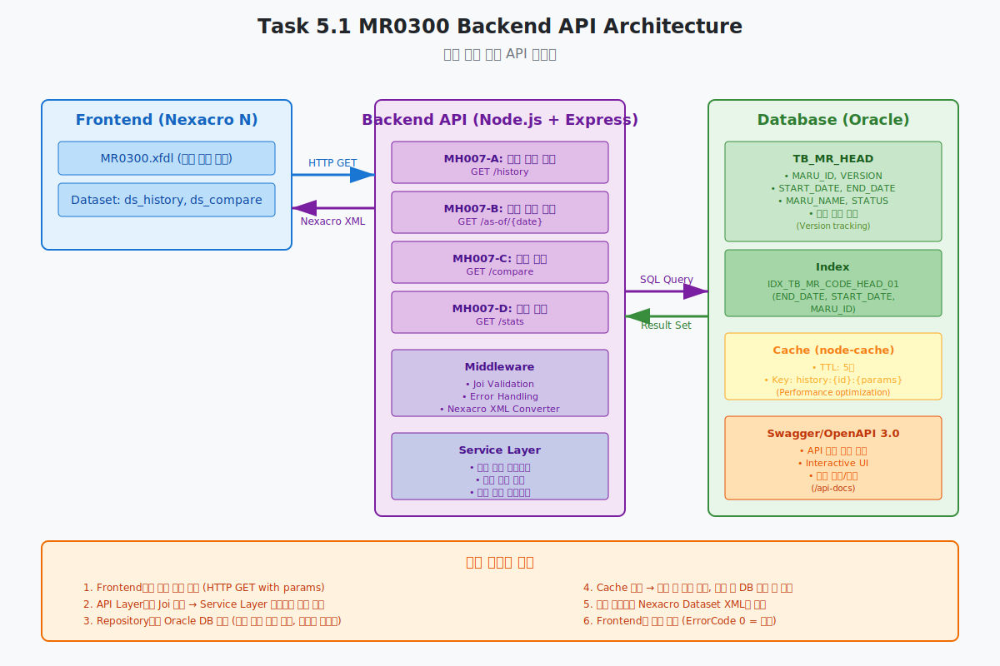
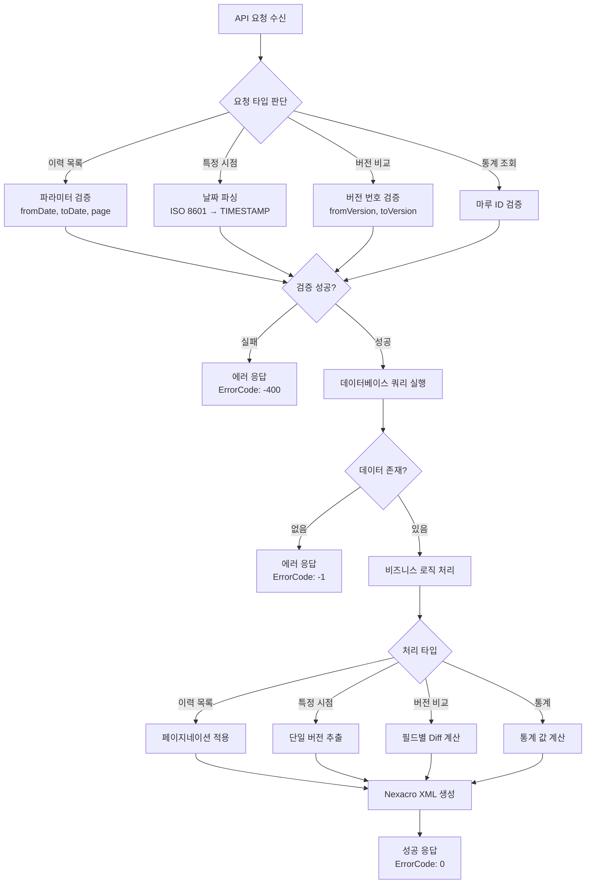
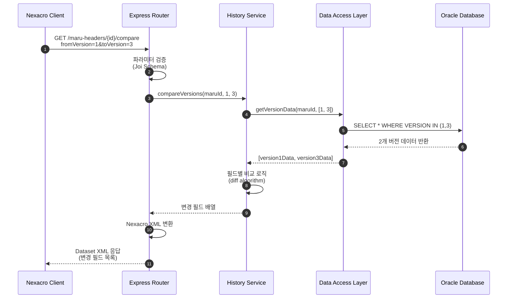
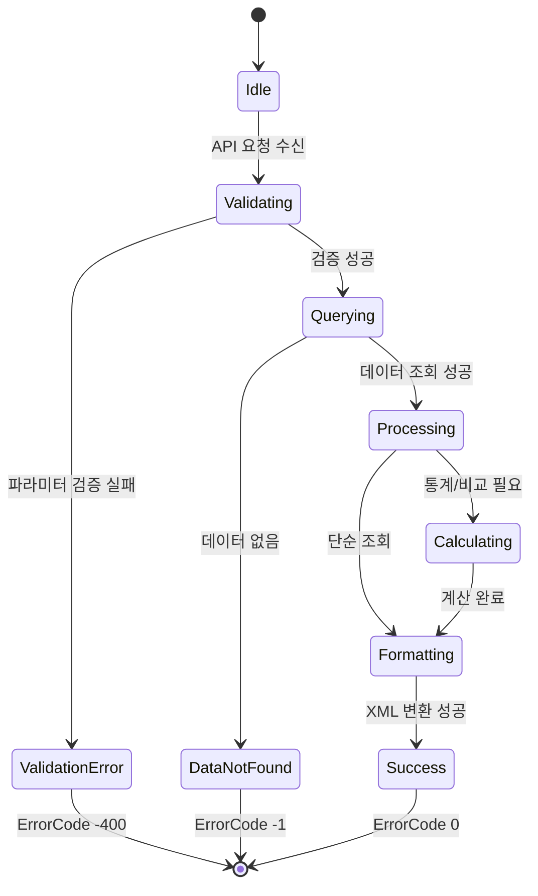

# 📄 Task 5.1 MR0300 Backend API 구현 - 상세설계서

**Template Version:** 1.3.0 — **Last Updated:** 2025-10-02

---

## 0. 문서 메타데이터

* **문서명**: Task-5-1.MR0300-Backend-API-구현(상세설계).md
* **버전**: 1.0
* **작성일**: 2025-10-02
* **작성자**: Claude (Sonnet 4.5)
* **참조 문서**:
  - `./docs/project/maru/00.foundation/02.design-baseline/2. database-design.md`
  - `./docs/project/maru/00.foundation/02.design-baseline/3. api-design.md`
  - `./docs/project/maru/00.foundation/01.project-charter/business-requirements.md`
* **위치**: `./docs/project/maru/10.design/12.detail-design/`
* **관련 이슈/티켓**: Task 5.1
* **상위 요구사항 문서**: BRD - UC-006 이력 관리
* **요구사항 추적 담당자**: 시스템 아키텍트
* **추적성 관리 도구**: tasks.md (프로젝트 태스크 관리)

---

## 1. 목적 및 범위

### 1.1 목적
마루 이력 조회 화면(MR0300)의 Backend API를 구현하여 선분 이력 모델 기반의 버전 관리, 특정 시점 데이터 조회, 버전 간 비교 기능을 제공한다.

### 1.2 범위

**포함**:
- 마루 이력 목록 조회 API (MH007-A)
- 특정 시점 데이터 조회 API (MH007-B)
- 버전 간 차이 비교 API (MH007-C)
- 이력 통계 정보 API (MH007-D)
- Nexacro Dataset XML 응답 형식
- Swagger/OpenAPI 3.0 문서화

**제외**:
- Frontend UI 구현 (Task 5.2)
- 복잡한 이력 시각화 로직
- 외부 시스템 이력 연동
- 실시간 변경 알림

---

## 2. 요구사항 & 승인 기준 (Acceptance Criteria)

> **작성 규칙**: 각 요구사항 항목마다 고유 ID(예: REQ-5.1-001)를 명시하고, 이후 설계 섹션에서 `[REQ-5.1-001]` 형태로 참조합니다.

* **요구사항 원본 링크**: [tasks.md - Task 5.1](../../00.foundation/01.project-charter/tasks.md)

### 2.1 기능 요구사항

**[REQ-5.1-001] 마루 이력 목록 조회**
- 특정 마루의 전체 버전 이력을 시간순으로 조회
- 버전별 변경 정보 (버전 번호, 마루명, 상태, 시작/종료일시)
- 페이지네이션 지원 (기본 50건, 최대 200건)
- 날짜 범위 필터링 (fromDate, toDate)

**[REQ-5.1-002] 특정 시점 데이터 조회**
- as-of-date 파라미터로 특정 시점의 마루 상태 조회
- 해당 시점에 유효했던 버전 데이터 반환
- START_DATE <= asOfDate <= END_DATE 조건 활용

**[REQ-5.1-003] 버전 간 차이 비교**
- 두 버전(fromVersion, toVersion) 간 변경된 필드 식별
- 변경 전/후 값 비교 결과 반환
- 필드명, 이전 값, 신규 값, 변경 타입(추가/수정/삭제) 포함

**[REQ-5.1-004] 이력 통계 정보**
- 총 버전 수, 최초/최종 변경일시
- 상태별 기간 (CREATED, INUSE, DEPRECATED 각각 유지 기간)
- 평균 변경 주기 계산

**[REQ-5.1-005] Swagger API 문서화**
- OpenAPI 3.0 스펙 준수
- 모든 엔드포인트, 파라미터, 응답 형식 문서화
- 예제 요청/응답 포함

### 2.2 비기능 요구사항

**성능**:
- 이력 조회 응답 시간 < 2초 (100개 버전 기준)
- 버전 비교 응답 시간 < 1초
- 페이지네이션으로 메모리 사용 최적화

**안정성**:
- 존재하지 않는 마루 ID에 대한 명확한 에러 메시지
- 잘못된 날짜 형식에 대한 유효성 검증
- 데이터베이스 연결 실패 시 재시도 로직

**보안**:
- SQL Injection 방지 (Parameterized Query)
- 입력 데이터 검증 (Joi 스키마)

### 2.3 승인 기준

- [ ] 4개 API 엔드포인트 정상 동작 (이력 조회, 시점 조회, 비교, 통계)
- [ ] Nexacro Dataset XML 응답 형식 준수
- [ ] 선분 이력 모델 정확한 구현 검증
- [ ] 버전 비교 기능 정확도 100%
- [ ] Swagger UI에서 모든 API 테스트 가능
- [ ] 에러 시나리오 완전한 처리

### 2-1. 요구사항-설계 추적 매트릭스

| 요구사항 ID | 요구사항 설명 | 설계 섹션/아티팩트 | 테스트 케이스 ID | 상태 | 비고 |
|-------------|---------------|--------------------|------------------|------|------|
| REQ-5.1-001 | 마루 이력 목록 조회 | §5 프로세스 흐름 / §8 API MH007-A | TC-5.1-001~003 | 초안 | 페이지네이션 포함 |
| REQ-5.1-002 | 특정 시점 데이터 조회 | §5 프로세스 흐름 / §8 API MH007-B | TC-5.1-004~005 | 초안 | 선분 이력 모델 활용 |
| REQ-5.1-003 | 버전 간 차이 비교 | §5 프로세스 흐름 / §8 API MH007-C | TC-5.1-006~007 | 초안 | 필드별 diff 알고리즘 |
| REQ-5.1-004 | 이력 통계 정보 | §5 프로세스 흐름 / §8 API MH007-D | TC-5.1-008 | 초안 | 통계 계산 로직 |
| REQ-5.1-005 | Swagger API 문서화 | §8 인터페이스 계약 | TC-5.1-009 | 초안 | OpenAPI 3.0 스펙 |

---

## 3. 용어/가정/제약

### 3.1 용어 정의

| 용어 | 정의 |
|------|------|
| 선분 이력 모델 | START_DATE와 END_DATE로 데이터 유효 기간을 표현하는 이력 관리 방식 |
| as-of-date | 특정 시점을 나타내는 날짜/시간 (ISO 8601 형식) |
| VERSION | 마루 헤더의 버전 번호 (0부터 시작하는 정수) |
| MH007 | 마루 이력 조회 API 그룹 식별자 |
| Diff | 두 버전 간 차이점 (Difference) |

### 3.2 가정 (Assumptions)

- TB_MR_HEAD 테이블의 선분 이력 모델이 정확히 구현되어 있음
- 모든 버전은 연속적이며 겹치지 않는 시간 범위를 가짐
- 클라이언트는 ISO 8601 날짜 형식을 지원함
- 단일 마루의 버전 수는 1000개 이하 (PoC 환경)

### 3.3 제약 (Constraints)

- **기술 제약**: Oracle Database, Node.js v20.x, Express 5.x 필수 사용
- **성능 제약**: 단일 요청 처리 시간 3초 이내
- **데이터 제약**: 이력 데이터는 삭제 불가 (논리적 삭제만 허용)
- **호환성 제약**: Nexacro Dataset XML 형식 준수 필수

---

## 4. 시스템/모듈 개요
  

### 4.1 역할 및 책임

**API Layer (Express Router)**:
- HTTP 요청 수신 및 라우팅
- 요청 파라미터 검증 (Joi)
- 응답 형식 변환 (JSON → Nexacro XML)

**Service Layer**:
- 비즈니스 로직 처리
- 버전 비교 알고리즘 구현
- 통계 계산 로직

**Data Access Layer (Knex.js)**:
- 데이터베이스 쿼리 실행
- 선분 이력 조회 최적화
- 트랜잭션 관리

### 4.2 외부 의존성

- **Oracle Database**: 이력 데이터 저장소
- **node-cache**: 이력 조회 결과 캐싱 (TTL: 5분)
- **Joi**: 입력 데이터 검증
- **swagger-jsdoc**: API 문서 자동 생성
- **date-fns**: 날짜 처리 및 검증

### 4.3 상호작용 개요

```
Frontend (Nexacro)
    ↓ HTTP GET /api/v1/maru-headers/{maruId}/history
API Router (Express)
    ↓ 파라미터 검증 (Joi)
Service Layer
    ↓ 비즈니스 로직 처리
Data Access Layer (Knex)
    ↓ SQL 쿼리 실행
Oracle Database
    ↓ 이력 데이터 반환
Service Layer
    ↓ 데이터 변환 및 통계 계산
API Router
    ↓ Nexacro Dataset XML 생성
Frontend (Nexacro)
```

---

## 5. 프로세스 흐름 (자연어 설명)

> **추적 메모**: 각 단계와 시나리오 제목에 관련 요구사항 태그(`[REQ-###]`)와 연계 테스트 ID를 병기합니다.

### 5.1 마루 이력 목록 조회 프로세스 [REQ-5.1-001]

1. **요청 수신**: `GET /api/v1/maru-headers/{maruId}/history?fromDate=2025-01-01&toDate=2025-12-31&page=1&limit=50`
2. **파라미터 검증**: maruId 존재 여부, 날짜 형식, 페이지 범위 검증
3. **데이터베이스 조회**:
   - START_DATE, END_DATE가 날짜 범위 내에 있는 모든 버전 조회
   - VERSION DESC 정렬 (최신 버전 우선)
   - OFFSET/LIMIT으로 페이지네이션 적용
4. **응답 생성**: Nexacro Dataset XML 형식으로 변환 및 반환

### 5.2 특정 시점 데이터 조회 프로세스 [REQ-5.1-002]

1. **요청 수신**: `GET /api/v1/maru-headers/{maruId}/as-of/2025-06-15T10:00:00Z`
2. **날짜 파싱**: ISO 8601 형식을 Oracle TIMESTAMP로 변환
3. **선분 이력 쿼리**:
   ```sql
   WHERE MARU_ID = :maruId
     AND START_DATE <= :asOfDate
     AND END_DATE >= :asOfDate
   ```
4. **결과 검증**:
   - 데이터가 없으면 "해당 시점에 마루가 존재하지 않음" 에러
   - 정확히 1개 버전만 반환되어야 함
5. **응답 생성**: 해당 시점의 마루 전체 정보 반환

### 5.3 버전 간 차이 비교 프로세스 [REQ-5.1-003]

1. **요청 수신**: `GET /api/v1/maru-headers/{maruId}/compare?fromVersion=1&toVersion=3`
2. **버전 데이터 조회**: 두 버전의 전체 데이터 조회
3. **필드별 비교**:
   - MARU_NAME, MARU_STATUS, PRIORITY_USE_YN 비교
   - 변경된 필드만 식별
4. **Diff 결과 생성**:
   - 필드명, 이전 값, 신규 값, 변경 타입 배열 생성
5. **응답 생성**: 변경 필드 목록을 Nexacro Dataset XML로 반환

### 5.4 이력 통계 정보 조회 프로세스 [REQ-5.1-004]

1. **요청 수신**: `GET /api/v1/maru-headers/{maruId}/history/stats`
2. **통계 계산**:
   - 총 버전 수: `COUNT(DISTINCT VERSION)`
   - 최초 생성일: `MIN(START_DATE)`
   - 최종 수정일: `MAX(START_DATE)`
   - 상태별 기간: 각 상태의 START_DATE ~ END_DATE 합산
   - 평균 변경 주기: 전체 기간 / (버전 수 - 1)
3. **응답 생성**: 통계 정보를 Nexacro Dataset XML로 반환

### 5-1. 프로세스 설계 개념도 (Mermaid)

#### (선택 1) Flowchart – 이력 조회 흐름 개념




#### (선택 2) Sequence – 버전 비교 상호작용 개념



#### (선택 3) State – 이력 조회 상태 전이 개념



---

## 6. UI 레이아웃 설계 (Text Art + SVG)

> **주의**: Task 5.1은 Backend API 구현이므로 UI 설계는 Task 5.2에서 수행됩니다.
> 본 섹션에서는 API 응답이 Frontend에서 어떻게 표현될지 개념적으로만 기술합니다.

### 6.1 UI 설계 (개념)

```
┌─────────────────────────────────────────────────────────┐
│  MR0300 - 마루 이력 조회                    [검색] [초기화] │
├─────────────────────────────────────────────────────────┤
│  마루 ID: [DEPT_CODE_001▼]  기간: [2025-01-01] ~ [2025-12-31] │
│  변경 타입: [전체▼]                                      │
├─────────────────────────────────────────────────────────┤
│  총 버전: 15개  │  최초 생성: 2025-01-01  │  최종 수정: 2025-09-15 │
├─────────────────────────────────────────────────────────┤
│  버전 │ 마루명          │ 상태       │ 시작일시         │ 종료일시         │
│  ─────┼────────────────┼───────────┼─────────────────┼─────────────────│
│  [3]  │ 부서코드(수정)   │ INUSE      │ 2025-09-15 10:00 │ 9999-12-31 23:59 │
│  [2]  │ 부서코드(변경)   │ INUSE      │ 2025-06-01 09:00 │ 2025-09-15 09:59 │
│  [1]  │ 부서코드(최초)   │ CREATED    │ 2025-01-01 08:00 │ 2025-06-01 08:59 │
│       │                │            │                 │                 │
│  [ 버전 비교 ] [ 특정 시점 조회 ] [ 변경 통계 ]            │
└─────────────────────────────────────────────────────────┘
```

### 6.2 반응형/접근성/상호작용 가이드 (텍스트)

* **반응형**: Task 5.2 Frontend 구현 시 적용
* **접근성**: API 응답 데이터는 접근성 고려 불필요 (UI 레벨에서 처리)
* **상호작용**:
  - 이력 목록 클릭 → 상세 정보 팝업
  - 버전 비교 버튼 → 두 버전 선택 후 차이점 표시
  - 특정 시점 조회 → 날짜 입력 후 해당 시점 데이터 조회

---

## 7. 데이터/메시지 구조 (개념 수준)

### 7.1 입력 데이터 구조

#### 이력 목록 조회 요청
```javascript
// Query Parameters
{
  fromDate: "2025-01-01T00:00:00Z",  // ISO 8601 (선택)
  toDate: "2025-12-31T23:59:59Z",    // ISO 8601 (선택)
  page: 1,                            // 페이지 번호 (기본값: 1)
  limit: 50                           // 페이지 크기 (기본값: 50, 최대: 200)
}
```

#### 특정 시점 조회 요청
```javascript
// Path Parameter
asOfDate: "2025-06-15T10:00:00Z"  // ISO 8601 필수
```

#### 버전 비교 요청
```javascript
// Query Parameters
{
  fromVersion: 1,  // 비교 시작 버전 (필수)
  toVersion: 3     // 비교 종료 버전 (필수)
}
```

### 7.2 출력 데이터 구조 (Nexacro Dataset XML)

#### 이력 목록 조회 응답
```xml
<?xml version="1.0" encoding="UTF-8"?>
<Dataset>
  <ErrorCode>0</ErrorCode>
  <ErrorMsg></ErrorMsg>
  <SuccessRowCount>3</SuccessRowCount>

  <ColumnInfo>
    <Column id="VERSION" type="INT" size="4"/>
    <Column id="MARU_NAME" type="STRING" size="200"/>
    <Column id="MARU_STATUS" type="STRING" size="20"/>
    <Column id="START_DATE" type="STRING" size="14"/>
    <Column id="END_DATE" type="STRING" size="14"/>
    <Column id="CHANGE_DESCRIPTION" type="STRING" size="500"/>
  </ColumnInfo>

  <Rows>
    <Row>
      <Col id="VERSION">3</Col>
      <Col id="MARU_NAME">부서코드(수정)</Col>
      <Col id="MARU_STATUS">INUSE</Col>
      <Col id="START_DATE">20250915100000</Col>
      <Col id="END_DATE">99991231235959</Col>
      <Col id="CHANGE_DESCRIPTION">마루명 변경</Col>
    </Row>
    <!-- 추가 행 생략 -->
  </Rows>
</Dataset>
```

#### 버전 비교 응답
```xml
<?xml version="1.0" encoding="UTF-8"?>
<Dataset>
  <ErrorCode>0</ErrorCode>
  <ErrorMsg></ErrorMsg>
  <SuccessRowCount>2</SuccessRowCount>

  <ColumnInfo>
    <Column id="FIELD_NAME" type="STRING" size="50"/>
    <Column id="OLD_VALUE" type="STRING" size="500"/>
    <Column id="NEW_VALUE" type="STRING" size="500"/>
    <Column id="CHANGE_TYPE" type="STRING" size="20"/>
  </ColumnInfo>

  <Rows>
    <Row>
      <Col id="FIELD_NAME">MARU_NAME</Col>
      <Col id="OLD_VALUE">부서코드</Col>
      <Col id="NEW_VALUE">부서코드(수정)</Col>
      <Col id="CHANGE_TYPE">MODIFIED</Col>
    </Row>
    <Row>
      <Col id="FIELD_NAME">MARU_STATUS</Col>
      <Col id="OLD_VALUE">CREATED</Col>
      <Col id="NEW_VALUE">INUSE</Col>
      <Col id="CHANGE_TYPE">MODIFIED</Col>
    </Row>
  </Rows>
</Dataset>
```

### 7.3 저장/전달 고려사항

- **날짜 형식 변환**: ISO 8601 (입력) ↔ Oracle TIMESTAMP ↔ YYYYMMDDHHMMSS (출력)
- **버전 일관성**: VERSION은 항상 연속적이며 0부터 시작
- **NULL 처리**: 선택적 필드는 빈 문자열로 전달
- **대용량 데이터**: 페이지네이션으로 메모리 효율성 보장

---

## 8. 인터페이스 계약 (Contract)

> **추적 메모**: 각 API/데이터 계약마다 참조 요구사항 ID와 검증 케이스를 명시합니다.

### 8.1 API MH007-A: 마루 이력 목록 조회 [REQ-5.1-001]

**엔드포인트**: `GET /api/v1/maru-headers/{maruId}/history`

**경로 파라미터**:
- `maruId` (string, 필수): 조회할 마루 고유 식별자

**쿼리 파라미터**:
- `fromDate` (string, 선택): 조회 시작 날짜 (ISO 8601, 기본값: 전체)
- `toDate` (string, 선택): 조회 종료 날짜 (ISO 8601, 기본값: 전체)
- `page` (number, 선택): 페이지 번호 (기본값: 1, 최소: 1)
- `limit` (number, 선택): 페이지 크기 (기본값: 50, 최소: 10, 최대: 200)

**성공 응답** (HTTP 200):
- Nexacro Dataset XML
- ErrorCode: 0
- 컬럼: VERSION, MARU_NAME, MARU_STATUS, START_DATE, END_DATE, CHANGE_DESCRIPTION

**오류 응답**:
- `MARU_NOT_FOUND` (ErrorCode: -100): 마루가 존재하지 않음
- `INVALID_DATE_FORMAT` (ErrorCode: -400): 날짜 형식 오류
- `INVALID_DATE_RANGE` (ErrorCode: -400): fromDate > toDate

**검증 케이스**: TC-5.1-001, TC-5.1-002, TC-5.1-003

---

### 8.2 API MH007-B: 특정 시점 데이터 조회 [REQ-5.1-002]

**엔드포인트**: `GET /api/v1/maru-headers/{maruId}/as-of/{asOfDate}`

**경로 파라미터**:
- `maruId` (string, 필수): 조회할 마루 고유 식별자
- `asOfDate` (string, 필수): 조회 시점 (ISO 8601 형식)

**성공 응답** (HTTP 200):
- Nexacro Dataset XML
- ErrorCode: 0
- 컬럼: MARU_ID, VERSION, MARU_NAME, MARU_STATUS, PRIORITY_USE_YN, START_DATE, END_DATE

**오류 응답**:
- `MARU_NOT_FOUND` (ErrorCode: -100): 마루가 존재하지 않음
- `DATA_NOT_FOUND_AT_DATE` (ErrorCode: -1): 해당 시점에 데이터 없음
- `INVALID_DATE_FORMAT` (ErrorCode: -400): 날짜 형식 오류

**검증 케이스**: TC-5.1-004, TC-5.1-005

---

### 8.3 API MH007-C: 버전 간 차이 비교 [REQ-5.1-003]

**엔드포인트**: `GET /api/v1/maru-headers/{maruId}/compare`

**경로 파라미터**:
- `maruId` (string, 필수): 조회할 마루 고유 식별자

**쿼리 파라미터**:
- `fromVersion` (number, 필수): 비교 시작 버전
- `toVersion` (number, 필수): 비교 종료 버전

**성공 응답** (HTTP 200):
- Nexacro Dataset XML
- ErrorCode: 0
- 컬럼: FIELD_NAME, OLD_VALUE, NEW_VALUE, CHANGE_TYPE

**오류 응답**:
- `MARU_NOT_FOUND` (ErrorCode: -100): 마루가 존재하지 않음
- `VERSION_NOT_FOUND` (ErrorCode: -100): 버전이 존재하지 않음
- `SAME_VERSION_COMPARISON` (ErrorCode: -400): 동일 버전 비교 시도
- `INVALID_VERSION` (ErrorCode: -400): 잘못된 버전 번호

**검증 케이스**: TC-5.1-006, TC-5.1-007

---

### 8.4 API MH007-D: 이력 통계 정보 [REQ-5.1-004]

**엔드포인트**: `GET /api/v1/maru-headers/{maruId}/history/stats`

**경로 파라미터**:
- `maruId` (string, 필수): 조회할 마루 고유 식별자

**성공 응답** (HTTP 200):
- Nexacro Dataset XML
- ErrorCode: 0
- 컬럼: STAT_NAME, STAT_VALUE, UNIT

**응답 예시**:
```xml
<Rows>
  <Row>
    <Col id="STAT_NAME">총 버전 수</Col>
    <Col id="STAT_VALUE">15</Col>
    <Col id="UNIT">개</Col>
  </Row>
  <Row>
    <Col id="STAT_NAME">최초 생성일</Col>
    <Col id="STAT_VALUE">2025-01-01 08:00:00</Col>
    <Col id="UNIT"></Col>
  </Row>
  <Row>
    <Col id="STAT_NAME">평균 변경 주기</Col>
    <Col id="STAT_VALUE">18.5</Col>
    <Col id="UNIT">일</Col>
  </Row>
</Rows>
```

**오류 응답**:
- `MARU_NOT_FOUND` (ErrorCode: -100): 마루가 존재하지 않음

**검증 케이스**: TC-5.1-008

---

### 8.5 Swagger/OpenAPI 문서화 [REQ-5.1-005]

**문서 위치**: `/api-docs` (Swagger UI)

**문서 내용**:
- 모든 엔드포인트 상세 설명
- 요청/응답 스키마 정의
- 예제 요청/응답
- 에러 코드 정의

**검증 케이스**: TC-5.1-009

---

## 9. 오류/예외/경계조건

### 9.1 예상 오류 상황 및 처리 방안

| 오류 상황 | 에러 코드 | 처리 방안 |
|-----------|----------|-----------|
| 마루가 존재하지 않음 | MARU_NOT_FOUND (-100) | "마루를 찾을 수 없습니다" 메시지 반환 |
| 잘못된 날짜 형식 | INVALID_DATE_FORMAT (-400) | "날짜 형식이 올바르지 않습니다 (ISO 8601 형식 필요)" 반환 |
| fromDate > toDate | INVALID_DATE_RANGE (-400) | "시작일이 종료일보다 클 수 없습니다" 반환 |
| 버전이 존재하지 않음 | VERSION_NOT_FOUND (-100) | "해당 버전을 찾을 수 없습니다" 반환 |
| 동일 버전 비교 | SAME_VERSION_COMPARISON (-400) | "동일한 버전을 비교할 수 없습니다" 반환 |
| 특정 시점에 데이터 없음 | DATA_NOT_FOUND_AT_DATE (-1) | "해당 시점에 마루가 존재하지 않습니다" 반환 |
| 데이터베이스 연결 실패 | INTERNAL_ERROR (-200) | 재시도 후 "시스템 오류가 발생했습니다" 반환 |
| 페이지 번호 범위 초과 | INVALID_PAGE (-400) | "페이지 번호가 범위를 벗어났습니다" 반환 |

### 9.2 복구 전략 및 사용자 메시지

**데이터베이스 일시적 오류**:
- 전략: 3회 재시도 (간격: 100ms, 200ms, 500ms)
- 메시지: "일시적인 오류가 발생했습니다. 잠시 후 다시 시도해주세요."

**대용량 이력 조회**:
- 전략: 페이지네이션 강제 (최대 200건)
- 메시지: "조회 결과가 많습니다. 페이지를 나누어 조회합니다."

**캐시 실패**:
- 전략: 캐시 무시하고 직접 DB 조회
- 메시지: 사용자에게 투명하게 처리 (메시지 없음)

### 9.3 경계 조건

- **최소 버전**: 0 (최초 생성 버전)
- **최대 버전**: INTEGER 최대값 (이론상 무제한, PoC는 1000개 이하)
- **최소 페이지 크기**: 10건
- **최대 페이지 크기**: 200건
- **날짜 범위**: 1900-01-01 ~ 9999-12-31
- **동시 요청**: 단일 마루당 10개 이하 권장

---

## 10. 보안/품질 고려

### 10.1 보안 고려사항

**SQL Injection 방지**:
- Knex.js Parameterized Query 사용
- 모든 사용자 입력은 바인딩 변수로 처리
- 예: `knex('TB_MR_HEAD').where('MARU_ID', maruId)`

**입력 검증**:
- Joi 스키마로 모든 입력 데이터 검증
- 날짜 형식: ISO 8601 정규식 검증
- 버전 번호: 양의 정수만 허용
- 페이지 파라미터: 범위 제한 (1~10000)

**XSS 방지**:
- XML 특수문자 이스케이프
- `<`, `>`, `&`, `"`, `'` → `&lt;`, `&gt;`, `&amp;`, `&quot;`, `&apos;`

**인증/인가 (PoC 제외)**:
- 향후 JWT 토큰 기반 인증 적용 예정
- 역할 기반 접근 제어 (읽기 전용 사용자 등)

### 10.2 품질 고려사항

**데이터 정확성**:
- 버전 비교 알고리즘 단위 테스트 (100% 커버리지)
- 날짜 계산 로직 검증 (윤년, 타임존 고려)
- 통계 계산 정확도 검증

**로깅 및 감사**:
- 모든 API 요청/응답 로깅 (Winston)
- 에러 발생 시 스택 트레이스 저장
- 성능 메트릭 수집 (응답 시간, 쿼리 수)

**i18n/l10n (PoC 제외)**:
- 에러 메시지는 한국어로 고정
- 향후 다국어 지원 시 메시지 코드 기반 처리 예정

---

## 11. 성능 및 확장성 (개념)

### 11.1 목표 지표

| 지표 | 목표 값 | 측정 방법 |
|------|---------|-----------|
| 이력 목록 조회 응답 시간 | < 2초 (100개 버전) | Postman Performance Test |
| 특정 시점 조회 응답 시간 | < 1초 | Postman Performance Test |
| 버전 비교 응답 시간 | < 1초 | Postman Performance Test |
| 통계 조회 응답 시간 | < 1초 | Postman Performance Test |
| 동시 사용자 | 5명 (PoC) | JMeter Load Test |

### 11.2 병목 예상 지점 및 완화 전략

**데이터베이스 쿼리 성능**:
- 병목: 대량 이력 조회 시 FULL TABLE SCAN
- 완화:
  - IDX_TB_MR_CODE_HEAD_01 인덱스 활용
  - 페이지네이션으로 데이터 분할
  - 쿼리 실행 계획 분석 및 최적화

**메모리 사용**:
- 병목: 대량 이력 데이터를 메모리에 로드
- 완화:
  - 스트리밍 방식 쿼리 결과 처리
  - 페이지 크기 제한 (최대 200건)

**네트워크 대역폭**:
- 병목: Nexacro XML 응답 크기
- 완화:
  - gzip 압축 적용 (Express middleware)
  - 불필요한 컬럼 제외

**캐시 히트율**:
- 병목: 동일 이력 반복 조회
- 완화:
  - node-cache로 조회 결과 캐싱 (TTL: 5분)
  - 캐시 키: `history:${maruId}:${fromDate}:${toDate}:${page}`

### 11.3 부하/장애 시나리오 대응

**데이터베이스 연결 풀 고갈**:
- 대응: 연결 풀 크기 모니터링 및 동적 확장
- 설정: min: 2, max: 10 (PoC)

**응답 시간 초과**:
- 대응: 타임아웃 설정 (10초)
- 메시지: "요청 처리 시간이 초과되었습니다"

**대량 요청 (DDoS)**:
- 대응: Rate Limiting (IP당 분당 60회)
- 메시지: "요청이 너무 많습니다. 잠시 후 시도해주세요."

---

## 12. 테스트 전략 (TDD 계획)

> **추적 메모**: 테스트 케이스 ID를 추적 매트릭스와 동기화하고 요구사항(`[REQ-###]`) 기준으로 커버리지를 관리합니다.

### 12.1 단위 테스트 전략 (Jest)

**테스트 대상**:
- 버전 비교 알고리즘 (compareVersions)
- 날짜 파싱 및 검증 (parseDateISO8601)
- 통계 계산 로직 (calculateHistoryStats)
- Nexacro XML 변환 함수 (createNexacroResponse)

**실패 시나리오**:
- 동일 버전 비교 시 빈 배열 반환
- 잘못된 ISO 8601 형식 시 에러 발생
- NULL 값 포함 데이터 처리

**최소 구현 전략**:
1. Red: 테스트 작성 (실패)
2. Green: 최소 코드로 통과
3. Refactor: 코드 정리 및 최적화

### 12.2 통합 테스트 전략 (Supertest)

**테스트 대상**:
- 4개 API 엔드포인트 E2E 테스트
- 데이터베이스 연동 검증
- 에러 응답 시나리오

**테스트 케이스**:
- TC-5.1-001: 정상 이력 목록 조회 (200 OK)
- TC-5.1-002: 페이지네이션 동작 검증
- TC-5.1-003: 날짜 범위 필터링 검증
- TC-5.1-004: 특정 시점 조회 (유효한 날짜)
- TC-5.1-005: 특정 시점 조회 (데이터 없음, -1 에러)
- TC-5.1-006: 버전 비교 (정상)
- TC-5.1-007: 버전 비교 (동일 버전 에러)
- TC-5.1-008: 통계 조회 (정상)
- TC-5.1-009: Swagger 문서 접근 가능 여부

**커버리지 목표**: 80% 이상 (Statement, Branch, Function)

### 12.3 리팩터링 포인트

- 중복 SQL 쿼리 로직 → 공통 함수화
- 날짜 변환 로직 → 유틸리티 모듈 분리
- 에러 처리 → 중앙 집중식 에러 핸들러

---

## 13. UI 테스트케이스

> **주의**: Task 5.1은 Backend API 구현이므로 UI 테스트케이스는 Task 5.2에서 작성됩니다.
> 본 섹션에서는 API 레벨 테스트케이스만 포함합니다.

### 13-1. API 기능 테스트케이스

| 테스트 ID | API 엔드포인트 | 테스트 시나리오 | 실행 단계 | 예상 결과 | 검증 기준 | 요구사항 | 우선순위 |
|-----------|----------------|-----------------|-----------|-----------|-----------|----------|----------|
| TC-5.1-001 | GET /history | 정상 이력 목록 조회 | 1. maruId 설정<br>2. API 호출 | ErrorCode: 0<br>버전 목록 반환 | SuccessRowCount > 0 | [REQ-5.1-001] | High |
| TC-5.1-002 | GET /history | 페이지네이션 동작 | 1. page=2, limit=10<br>2. API 호출 | 11~20번째 데이터 반환 | 데이터 순서 검증 | [REQ-5.1-001] | High |
| TC-5.1-003 | GET /history | 날짜 범위 필터링 | 1. fromDate, toDate 설정<br>2. API 호출 | 해당 기간 데이터만 반환 | 날짜 범위 검증 | [REQ-5.1-001] | High |
| TC-5.1-004 | GET /as-of/{date} | 특정 시점 조회 (정상) | 1. 유효한 날짜 설정<br>2. API 호출 | 해당 시점 버전 반환 | 단일 버전 검증 | [REQ-5.1-002] | High |
| TC-5.1-005 | GET /as-of/{date} | 특정 시점 조회 (데이터 없음) | 1. 데이터 없는 날짜<br>2. API 호출 | ErrorCode: -1 | 에러 메시지 검증 | [REQ-5.1-002] | Medium |
| TC-5.1-006 | GET /compare | 버전 비교 (정상) | 1. fromVersion=1, toVersion=3<br>2. API 호출 | 변경 필드 배열 반환 | 필드별 차이 검증 | [REQ-5.1-003] | High |
| TC-5.1-007 | GET /compare | 버전 비교 (동일 버전) | 1. fromVersion=2, toVersion=2<br>2. API 호출 | ErrorCode: -400 | 에러 메시지 검증 | [REQ-5.1-003] | Medium |
| TC-5.1-008 | GET /stats | 이력 통계 조회 | 1. maruId 설정<br>2. API 호출 | 통계 데이터 반환 | 통계 값 정확도 검증 | [REQ-5.1-004] | Medium |
| TC-5.1-009 | GET /api-docs | Swagger 문서 접근 | 1. /api-docs URL 접근 | Swagger UI 표시 | UI 렌더링 확인 | [REQ-5.1-005] | Low |

### 13-2. 에러 처리 테스트케이스

| 테스트 ID | 에러 시나리오 | 실행 단계 | 예상 ErrorCode | 예상 메시지 | 우선순위 |
|-----------|---------------|-----------|----------------|-------------|----------|
| TC-5.1-E01 | 존재하지 않는 마루 | maruId='INVALID' 조회 | -100 | "마루를 찾을 수 없습니다" | High |
| TC-5.1-E02 | 잘못된 날짜 형식 | fromDate='2025/01/01' | -400 | "날짜 형식이 올바르지 않습니다" | High |
| TC-5.1-E03 | 잘못된 날짜 범위 | fromDate > toDate | -400 | "시작일이 종료일보다 클 수 없습니다" | High |
| TC-5.1-E04 | 존재하지 않는 버전 | version=999 | -100 | "해당 버전을 찾을 수 없습니다" | High |
| TC-5.1-E05 | 잘못된 페이지 번호 | page=-1 | -400 | "페이지 번호가 범위를 벗어났습니다" | Medium |
| TC-5.1-E06 | 데이터베이스 연결 실패 | DB 중단 후 요청 | -200 | "시스템 오류가 발생했습니다" | Low |

### 13-3. 성능 테스트케이스

| 테스트 ID | 성능 지표 | 측정 방법 | 목표 기준 | 측정 도구 | 실행 조건 |
|-----------|-----------|-----------|-----------|-----------|-----------|
| TC-5.1-P01 | 이력 목록 조회 응답 시간 | API 호출 후 측정 | 2초 이내 (100개 버전) | Postman/JMeter | 단일 요청 |
| TC-5.1-P02 | 특정 시점 조회 응답 시간 | API 호출 후 측정 | 1초 이내 | Postman/JMeter | 단일 요청 |
| TC-5.1-P03 | 버전 비교 응답 시간 | API 호출 후 측정 | 1초 이내 | Postman/JMeter | 단일 요청 |
| TC-5.1-P04 | 동시 사용자 처리 | 5명 동시 요청 | 응답 시간 3초 이내 | JMeter | 동시 부하 |
| TC-5.1-P05 | 캐시 히트율 | 동일 요청 반복 | 2차 요청부터 0.5초 이내 | node-cache 로그 | 반복 요청 |

### 13-4. Postman/Swagger 테스트 가이드

**Postman Collection 구성**:
```json
{
  "info": { "name": "MR0300 History API Tests" },
  "item": [
    {
      "name": "Get History List",
      "request": {
        "method": "GET",
        "url": "{{baseUrl}}/api/v1/maru-headers/{{maruId}}/history?page=1&limit=50"
      },
      "tests": [
        "pm.test('Status code is 200', function() { pm.response.to.have.status(200); })",
        "pm.test('ErrorCode is 0', function() { /* XML 파싱 및 검증 */ })"
      ]
    },
    // 추가 테스트 케이스
  ]
}
```

**Swagger 실행 방법**:
1. 서버 시작: `npm start`
2. 브라우저에서 `http://localhost:3000/api-docs` 접근
3. "Try it out" 버튼으로 각 API 테스트
4. 응답 검증 (ErrorCode, 데이터 구조)

### 13-5. 테스트 자동화 스크립트 (Jest)

```javascript
// 예제: 버전 비교 단위 테스트
describe('compareVersions', () => {
  test('두 버전 간 변경 필드 식별', () => {
    const version1 = { MARU_NAME: '부서코드', MARU_STATUS: 'CREATED' };
    const version2 = { MARU_NAME: '부서코드(수정)', MARU_STATUS: 'INUSE' };

    const result = compareVersions(version1, version2);

    expect(result).toHaveLength(2);
    expect(result[0]).toMatchObject({
      FIELD_NAME: 'MARU_NAME',
      OLD_VALUE: '부서코드',
      NEW_VALUE: '부서코드(수정)',
      CHANGE_TYPE: 'MODIFIED'
    });
  });

  test('동일 버전 비교 시 빈 배열 반환', () => {
    const version1 = { MARU_NAME: '부서코드', MARU_STATUS: 'CREATED' };

    const result = compareVersions(version1, version1);

    expect(result).toEqual([]);
  });
});
```

**실행 명령어**:
- 전체 테스트: `npm test`
- 단일 파일: `npm test history.service.test.js`
- 커버리지: `npm run test:coverage`

---

## 14. 추적성 매트릭스 (Traceability Matrix)

| 요구사항 ID | BRD 참조 | 설계 섹션 | API 엔드포인트 | 테스트 케이스 | 구현 상태 |
|-------------|----------|-----------|----------------|---------------|-----------|
| REQ-5.1-001 | UC-006 | §5.1, §8.1 | GET /history | TC-5.1-001~003 | 대기 |
| REQ-5.1-002 | UC-006 | §5.2, §8.2 | GET /as-of/{date} | TC-5.1-004~005 | 대기 |
| REQ-5.1-003 | UC-006 | §5.3, §8.3 | GET /compare | TC-5.1-006~007 | 대기 |
| REQ-5.1-004 | UC-006 | §5.4, §8.4 | GET /stats | TC-5.1-008 | 대기 |
| REQ-5.1-005 | - | §8.5 | /api-docs | TC-5.1-009 | 대기 |

**변경 추적**:
- 요구사항 변경 시 해당 행의 모든 컬럼 업데이트
- 설계 변경 시 관련 테스트 케이스 동기화
- 구현 완료 시 "구현 상태"를 "완료"로 업데이트

---

## 15. 구현 가이드라인

### 15.1 프로젝트 구조
```
backend/
├── src/ 
│   ├── routes/
│   │   └── maru-history.routes.js      # API 라우팅
│   ├── controllers/
│   │   └── maru-history.controller.js  # 요청 처리
│   ├── services/
│   │   └── maru-history.service.js     # 비즈니스 로직
│   ├── repositories/
│   │   └── maru-history.repository.js  # DB 접근
│   ├── utils/
│   │   ├── date-utils.js               # 날짜 처리
│   │   ├── diff-utils.js               # 버전 비교
│   │   └── nexacro-utils.js            # XML 변환
│   └── middlewares/
│       └── validation.middleware.js    # Joi 검증
├── tests/
│   ├── unit/
│   │   └── maru-history.service.test.js
│   └── integration/
│       └── maru-history.api.test.js
└── swagger/
    └── maru-history.yaml               # OpenAPI 스펙
```

### 15.2 구현 순서
1. **데이터 계층**: Repository 구현 (SQL 쿼리)
2. **비즈니스 계층**: Service 구현 (비교, 통계 로직)
3. **API 계층**: Controller 및 Routes 구현
4. **검증**: Joi 스키마 정의
5. **문서화**: Swagger 스펙 작성
6. **테스트**: 단위/통합 테스트 작성

### 15.3 코드 품질 기준
- ESLint 규칙 준수 (Airbnb Style Guide)
- 모든 함수에 JSDoc 주석
- 단위 테스트 커버리지 80% 이상
- 순환 복잡도 (Cyclomatic Complexity) 10 이하

---

## 16. 참고 자료

### 16.1 관련 문서
- [데이터베이스 기본설계서](../../00.foundation/02.design-baseline/2.%20database-design.md)
- [API 기본설계서](../../00.foundation/02.design-baseline/3.%20api-design.md)
- [비즈니스 요구사항](../../00.foundation/01.project-charter/business-requirements.md)
- [Task 3.1 구현 보고서](../../20.implementation/Task-3-1.MR0100-Backend-API-구현.md)
- [Task 4.1 구현 보고서](../../20.implementation/Task-4-1.MR0200-Backend-API-구현(implementation).md)

### 16.2 기술 스택 문서
- [Node.js v20.x Documentation](https://nodejs.org/docs/latest-v20.x/api/)
- [Express 5.x Guide](https://expressjs.com/en/5x/api.html)
- [Knex.js Query Builder](https://knexjs.org/guide/)
- [Oracle Database 21c SQL Reference](https://docs.oracle.com/en/database/oracle/oracle-database/21/sqlrf/)
- [Joi Validation](https://joi.dev/api/)
- [Swagger/OpenAPI 3.0](https://swagger.io/specification/)

---

**문서 승인**

| 역할 | 이름 | 서명 | 날짜 |
|------|------|------|------|
| 시스템 아키텍트 | | | |
| Backend 개발자 | | | |
| QA 엔지니어 | | | |
| 프로젝트 매니저 | | | |

---

**변경 이력**

| 버전 | 날짜 | 변경 내용 | 작성자 |
|------|------|-----------|--------|
| 1.0 | 2025-10-02 | 초안 작성 | Claude (Sonnet 4.5) |

---

**다음 단계**: `/dev:implement Task 5.1` - TDD 기반 Backend API 구현 수행
