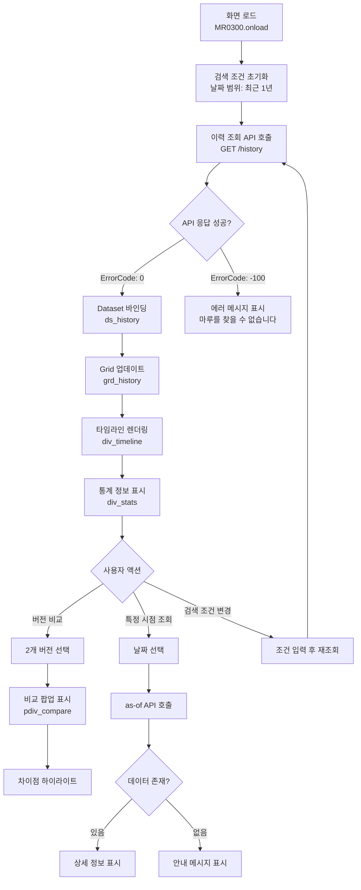
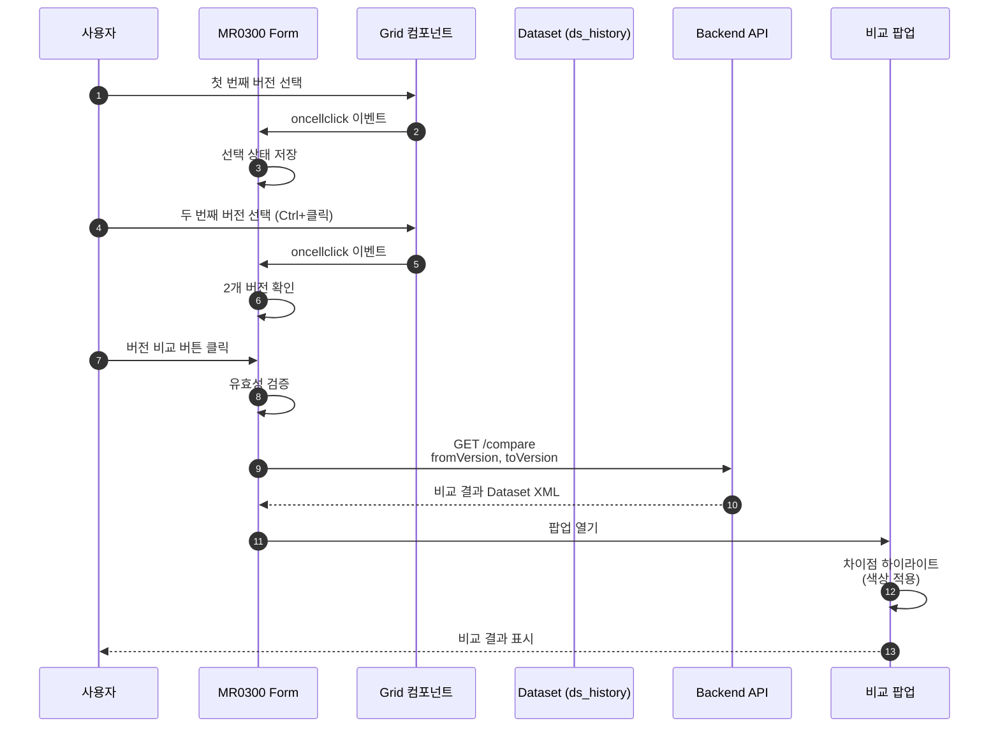
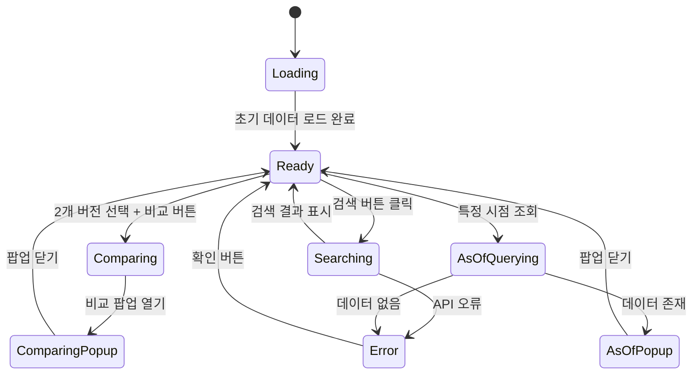
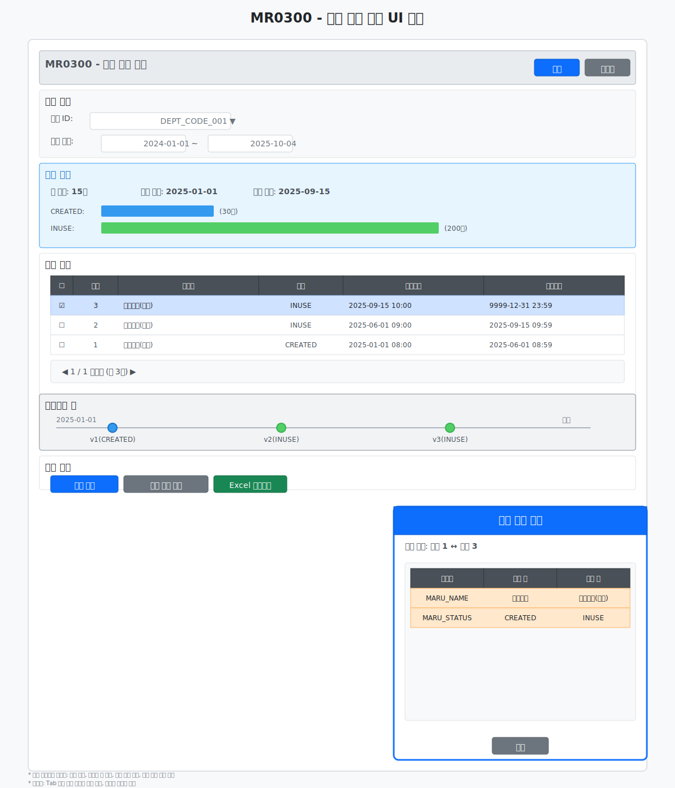

# 📄 Task 5.2 MR0300 Frontend UI 구현 - 상세설계서

**Template Version:** 1.3.0 — **Last Updated:** 2025-10-04

---

## 0. 문서 메타데이터

* **문서명**: Task-5-2.MR0300-Frontend-UI-구현(상세설계).md
* **버전**: 1.0
* **작성일**: 2025-10-04
* **작성자**: Claude (Sonnet 4.5)
* **참조 문서**:
  - `./docs/project/maru/10.design/12.detail-design/Task-5-1.MR0300-Backend-API-구현(상세설계).md`
  - `./docs/project/maru/00.foundation/02.design-baseline/4. ui-design.md`
  - `./docs/project/maru/00.foundation/02.design-baseline/5. program-list.md`
* **위치**: `./docs/project/maru/10.design/12.detail-design/`
* **관련 이슈/티켓**: Task 5.2
* **상위 요구사항 문서**: BRD - UC-006 이력 관리
* **요구사항 추적 담당자**: Frontend 개발자
* **추적성 관리 도구**: tasks.md (프로젝트 태스크 관리)

---

## 1. 목적 및 범위

### 1.1 목적
마루 이력 조회 화면(MR0300)의 Frontend UI를 Nexacro N v24 플랫폼으로 구현하여 선분 이력 모델 기반의 버전 관리, 특정 시점 데이터 조회, 버전 간 비교 기능을 직관적인 사용자 인터페이스로 제공한다.

### 1.2 범위

**포함**:
- Nexacro Form 생성 (MR0300.xfdl)
- 이력 그리드 및 타임라인 표시 UI
- 버전 비교 기능 UI (팝업)
- 특정 시점 조회 UI (날짜 선택기)
- 변경사항 하이라이트 표시
- Dataset 연동 및 Backend API 호출
- 검색 조건 및 필터 UI

**제외**:
- Backend API 구현 (Task 5.1 완료)
- 복잡한 데이터 분석 기능
- 대시보드 차트 및 시각화
- 외부 시스템 연동

---

## 2. 요구사항 & 승인 기준 (Acceptance Criteria)

> **작성 규칙**: 각 요구사항 항목마다 고유 ID(예: REQ-5.2-001)를 명시하고, 이후 설계 섹션에서 `[REQ-5.2-001]` 형태로 참조합니다.

* **요구사항 원본 링크**: [tasks.md - Task 5.2](../../00.foundation/01.project-charter/tasks.md)

### 2.1 기능 요구사항

**[REQ-5.2-001] 이력 그리드 표시**
- 마루 이력 목록을 Grid 컴포넌트로 표시
- 컬럼: 버전, 마루명, 상태, 시작일시, 종료일시, 변경 설명
- 정렬 기능 (버전 기준 오름차순/내림차순)
- 페이지네이션 지원 (50건 단위)

**[REQ-5.2-002] 이력 타임라인 표시**
- 시간 흐름에 따른 버전 변화를 타임라인으로 시각화
- 각 버전별 변경 시점 및 상태 표시
- 타임라인 항목 클릭 시 해당 버전 상세 정보 표시

**[REQ-5.2-003] 버전 비교 기능**
- 두 버전을 선택하여 차이점 비교
- 비교 결과를 팝업 창으로 표시
- 변경된 필드 하이라이트 (추가: 녹색, 수정: 주황색, 삭제: 빨간색)

**[REQ-5.2-004] 특정 시점 조회**
- Calendar 컴포넌트로 날짜 선택
- 선택한 시점의 마루 상태 조회 및 표시
- 해당 시점에 데이터가 없으면 안내 메시지 표시

**[REQ-5.2-005] 검색 및 필터링**
- 날짜 범위 검색 (fromDate ~ toDate)
- 변경 타입 필터 (전체/마루명 변경/상태 변경)
- 검색 조건 초기화 기능

**[REQ-5.2-006] 이력 통계 정보 표시**
- 총 버전 수, 최초 생성일, 최종 수정일
- 상태별 유지 기간 (막대 그래프 형태)
- 평균 변경 주기

### 2.2 비기능 요구사항

**사용성**:
- 화면 로딩 시간 < 2초
- 직관적인 UI 레이아웃
- 일관된 상호작용 패턴

**접근성**:
- 키보드 네비게이션 지원
- Tab 키로 모든 컨트롤 접근 가능
- 명확한 포커스 표시

**성능**:
- 그리드 렌더링 시간 < 1초 (100개 행 기준)
- 버전 비교 팝업 표시 < 500ms
- 부드러운 스크롤 및 애니메이션

### 2.3 승인 기준

- [ ] MR0300.xfdl Form 완전 구현
- [ ] Backend API와 완벽한 연동
- [ ] 4개 주요 기능 정상 동작 (이력 조회, 시점 조회, 비교, 통계)
- [ ] Dataset 바인딩 정확성 100%
- [ ] UI/UX 가이드라인 준수
- [ ] 에러 시나리오 완전한 처리

### 2-1. 요구사항-설계 추적 매트릭스

| 요구사항 ID | 요구사항 설명 | 설계 섹션/아티팩트 | 테스트 케이스 ID | 상태 | 비고 |
|-------------|---------------|--------------------|------------------|------|------|
| REQ-5.2-001 | 이력 그리드 표시 | §5.1, §6 UI 설계 | TC-5.2-001~003 | 초안 | Grid 컴포넌트 |
| REQ-5.2-002 | 이력 타임라인 표시 | §5.2, §6 UI 설계 | TC-5.2-004 | 초안 | Div 기반 구현 |
| REQ-5.2-003 | 버전 비교 기능 | §5.3, §6 UI 설계 | TC-5.2-005~006 | 초안 | 팝업 구현 |
| REQ-5.2-004 | 특정 시점 조회 | §5.4, §6 UI 설계 | TC-5.2-007 | 초안 | Calendar |
| REQ-5.2-005 | 검색 및 필터링 | §5.5, §6 UI 설계 | TC-5.2-008~009 | 초안 | 조건 컴포넌트 |
| REQ-5.2-006 | 이력 통계 정보 | §5.6, §6 UI 설계 | TC-5.2-010 | 초안 | 통계 영역 |

---

## 3. 용어/가정/제약

### 3.1 용어 정의

| 용어 | 정의 |
|------|------|
| MR0300 | 마루 이력 조회 화면 프로그램 ID |
| Dataset | Nexacro에서 데이터를 저장하고 관리하는 객체 |
| Grid | Nexacro의 테이블 형태 데이터 표시 컴포넌트 |
| PopupDiv | Nexacro의 팝업 창 컴포넌트 |
| Calendar | Nexacro의 날짜 선택 컴포넌트 |
| 타임라인 | 시간 순서에 따른 이벤트 시각화 |

### 3.2 가정 (Assumptions)

- Task 5.1 Backend API가 정상적으로 구현되어 있음
- Nexacro N v24 플랫폼 개발 환경이 구성되어 있음
- Backend API는 Nexacro Dataset XML 형식을 반환함
- 사용자 브라우저는 최신 버전의 Chrome, Edge, Firefox를 지원함

### 3.3 제약 (Constraints)

- **기술 제약**: Nexacro N v24 플랫폼 필수 사용
- **성능 제약**: 단일 화면 로딩 시간 3초 이내
- **데이터 제약**: 최대 200개 버전까지 한 번에 표시
- **호환성 제약**: Internet Explorer 11 이하 미지원

---

## 4. 시스템/모듈 개요

### 4.1 역할 및 책임

**Form Layer (MR0300.xfdl)**:
- 사용자 인터페이스 렌더링
- 이벤트 처리 및 사용자 입력 검증
- Dataset 바인딩 및 UI 업데이트

**Dataset Layer**:
- ds_history: 이력 목록 데이터
- ds_compare: 버전 비교 결과 데이터
- ds_stats: 통계 정보 데이터
- ds_search: 검색 조건 데이터

**Service Communication Layer**:
- Backend API 호출 (XPlatform.httpRequest)
- XML 응답 파싱 및 Dataset 변환
- 에러 처리 및 사용자 알림

### 4.2 외부 의존성

- **Backend API**: Task 5.1에서 구현한 4개 API
  - GET /api/v1/maru-headers/{maruId}/history
  - GET /api/v1/maru-headers/{maruId}/as-of/{asOfDate}
  - GET /api/v1/maru-headers/{maruId}/compare
  - GET /api/v1/maru-headers/{maruId}/history/stats
- **Nexacro Runtime**: v24 엔진
- **공통 라이브러리**: 날짜 변환, XML 파싱 유틸리티

### 4.3 상호작용 개요

```
사용자
  ↓ 화면 로드
MR0300.xfdl (Form)
  ↓ onload 이벤트
검색 조건 초기화
  ↓ 이력 조회 버튼 클릭
Backend API 호출 (GET /history)
  ↓ Dataset XML 응답
ds_history Dataset에 바인딩
  ↓ Grid 자동 업데이트
이력 목록 표시
  ↓ 버전 비교 버튼 클릭
비교 팝업 표시 및 API 호출
  ↓ 비교 결과 표시
사용자에게 차이점 하이라이트
```

---

## 5. 프로세스 흐름

> **추적 메모**: 각 단계와 시나리오 제목에 관련 요구사항 태그(`[REQ-###]`)와 연계 테스트 ID를 병기합니다.

### 5.1 이력 그리드 표시 프로세스 [REQ-5.2-001]

1. **화면 로드**: Form의 onload 이벤트 발생
2. **검색 조건 초기화**: 날짜 범위를 최근 1년으로 설정
3. **API 호출**: GET /api/v1/maru-headers/{maruId}/history?page=1&limit=50
4. **응답 처리**: Dataset XML을 ds_history Dataset에 바인딩
5. **Grid 표시**: grd_history Grid 자동 업데이트
6. **페이지네이션**: 다음/이전 페이지 버튼 활성화

### 5.2 이력 타임라인 표시 프로세스 [REQ-5.2-002]

1. **타임라인 영역 초기화**: div_timeline Div 컴포넌트 준비
2. **Dataset 순회**: ds_history Dataset의 각 행을 처리
3. **타임라인 항목 생성**: 각 버전별 Div 컴포넌트 동적 생성
4. **스타일 적용**: 상태별 색상 및 아이콘 설정
   - CREATED: 파란색, 생성 아이콘
   - INUSE: 녹색, 사용 중 아이콘
   - DEPRECATED: 회색, 중단 아이콘
5. **이벤트 바인딩**: 타임라인 항목 클릭 시 상세 정보 표시

### 5.3 버전 비교 기능 프로세스 [REQ-5.2-003]

1. **버전 선택**: 그리드에서 두 행 선택 (Ctrl+클릭)
2. **유효성 검증**:
   - 정확히 2개 버전이 선택되었는지 확인
   - 동일 버전 선택 시 에러 메시지 표시
3. **비교 팝업 표시**: pdiv_compare PopupDiv 열기
4. **API 호출**: GET /compare?fromVersion={v1}&toVersion={v2}
5. **결과 파싱**: 변경 필드 배열을 ds_compare Dataset에 바인딩
6. **하이라이트 표시**:
   - MODIFIED: 주황색 배경
   - ADDED: 녹색 배경 (향후 확장)
   - DELETED: 빨간색 배경 (향후 확장)

### 5.4 특정 시점 조회 프로세스 [REQ-5.2-004]

1. **날짜 선택**: cal_asOfDate Calendar 컴포넌트에서 날짜 선택
2. **날짜 형식 변환**: YYYYMMDD → ISO 8601 (YYYY-MM-DDTHH:MM:SSZ)
3. **API 호출**: GET /as-of/{asOfDate}
4. **응답 처리**:
   - 성공: 해당 시점 데이터를 팝업으로 표시
   - 실패 (ErrorCode -1): "해당 시점에 마루가 존재하지 않습니다" 메시지
5. **결과 표시**: 단일 버전 정보를 상세 조회 팝업에 표시

### 5.5 검색 및 필터링 프로세스 [REQ-5.2-005]

1. **검색 조건 입력**:
   - 시작일: cal_fromDate Calendar
   - 종료일: cal_toDate Calendar
   - 변경 타입: cmb_changeType Combo (전체/마루명 변경/상태 변경)
2. **조건 검증**:
   - 시작일 ≤ 종료일 검증
   - 날짜 형식 유효성 검증
3. **검색 버튼 클릭**: btn_search 버튼 onclick 이벤트
4. **API 호출**: 검색 조건을 Query Parameter로 전달
5. **결과 표시**: ds_history Dataset 업데이트 및 Grid 갱신
6. **초기화**: btn_reset 버튼 클릭 시 모든 검색 조건 초기화

### 5.6 이력 통계 정보 표시 프로세스 [REQ-5.2-006]

1. **통계 영역 초기화**: div_stats Div 컴포넌트 준비
2. **API 호출**: GET /history/stats
3. **통계 데이터 바인딩**: ds_stats Dataset에 저장
4. **통계 항목 표시**:
   - 총 버전 수: Static 컴포넌트로 표시
   - 최초 생성일/최종 수정일: Static 컴포넌트로 표시
   - 평균 변경 주기: Static 컴포넌트로 표시
5. **상태별 기간 막대 그래프**:
   - Div 컴포넌트 width 속성을 비율로 조정
   - 색상: CREATED(파란색), INUSE(녹색), DEPRECATED(회색)

### 5-1. 프로세스 설계 개념도 (Mermaid)

#### (선택 1) Flowchart – 이력 조회 흐름 개념



#### (선택 2) Sequence – 버전 비교 상호작용 개념



#### (선택 3) State – 화면 상태 전이 개념



---

## 6. UI 레이아웃 설계 (Text Art + SVG)

> **추적 메모**: UI 요소 설명 옆에 대응 요구사항(`[REQ-###]`)과 사용자 스토리/테스트 ID를 표기합니다.

### 6.1. UI 설계

```
┌─────────────────────────────────────────────────────────────────────┐
│  MR0300 - 마루 이력 조회                        [검색] [초기화] [닫기] │
├─────────────────────────────────────────────────────────────────────┤
│  검색 조건                                                          │
│  ┌───────────────────────────────────────────────────────────────┐ │
│  │ 마루 ID: [DEPT_CODE_001▼]                                      │ │
│  │ 조회 기간: [2024-01-01] ~ [2025-10-04]                         │ │
│  │ 변경 타입: [전체▼]                                              │ │
│  └───────────────────────────────────────────────────────────────┘ │
├─────────────────────────────────────────────────────────────────────┤
│  이력 통계 [REQ-5.2-006]                                            │
│  ┌───────────────────────────────────────────────────────────────┐ │
│  │ 총 버전: 15개 │ 최초 생성: 2025-01-01 │ 최종 수정: 2025-09-15   │ │
│  │ ────────────────────────────────────────────────────────────   │ │
│  │ CREATED: ████░░░░░░░░░░░░░░░░ (30일)                          │ │
│  │ INUSE:   ░░░░████████████░░░░ (200일)                         │ │
│  │ DEPRECATED: ░░░░░░░░░░░░░░░░░░ (0일)                          │ │
│  └───────────────────────────────────────────────────────────────┘ │
├─────────────────────────────────────────────────────────────────────┤
│  이력 목록 [REQ-5.2-001]                                            │
│  ┌───────────────────────────────────────────────────────────────┐ │
│  │ □ │버전│ 마루명          │ 상태       │ 시작일시         │ 종료일시        │ │
│  │ ─┼───┼────────────────┼───────────┼─────────────────┼─────────────────│ │
│  │ ☑ │ 3 │ 부서코드(수정)   │ INUSE      │ 2025-09-15 10:00 │ 9999-12-31 23:59 │ │
│  │ □ │ 2 │ 부서코드(변경)   │ INUSE      │ 2025-06-01 09:00 │ 2025-09-15 09:59 │ │
│  │ □ │ 1 │ 부서코드(최초)   │ CREATED    │ 2025-01-01 08:00 │ 2025-06-01 08:59 │ │
│  │   │   │                │            │                 │                 │ │
│  │ ◀ 1 / 1 페이지 (총 3건) ▶                                         │ │
│  └───────────────────────────────────────────────────────────────┘ │
├─────────────────────────────────────────────────────────────────────┤
│  타임라인 뷰 [REQ-5.2-002]                                          │
│  ┌───────────────────────────────────────────────────────────────┐ │
│  │ 2025-01-01 ●────────────────●────────────────●─────────▶ 현재  │ │
│  │           v1(CREATED)      v2(INUSE)       v3(INUSE)           │ │
│  └───────────────────────────────────────────────────────────────┘ │
├─────────────────────────────────────────────────────────────────────┤
│  기능 버튼                                                          │
│  [ 버전 비교 ] [ 특정 시점 조회 ] [ Excel 다운로드 ]                 │
└─────────────────────────────────────────────────────────────────────┘

┌─────────────────────────────────────────┐
│ 버전 비교 팝업 [REQ-5.2-003]             │
├─────────────────────────────────────────┤
│ 비교 대상: 버전 1 ↔ 버전 3              │
│                                         │
│ ┌─────────────────────────────────────┐ │
│ │ 필드명    │ 이전 값      │ 신규 값     │ │
│ │──────────┼─────────────┼────────────│ │
│ │ MARU_NAME │ 부서코드     │ 부서코드(수정)│ │ [🟧 주황색]
│ │ MARU_STATUS│ CREATED    │ INUSE       │ │ [🟧 주황색]
│ └─────────────────────────────────────┘ │
│                                         │
│                [ 닫기 ]                 │
└─────────────────────────────────────────┘

┌─────────────────────────────────────────┐
│ 특정 시점 조회 팝업 [REQ-5.2-004]        │
├─────────────────────────────────────────┤
│ 조회 시점: [2025-06-15] [10:00]        │
│                                         │
│ ┌─────────────────────────────────────┐ │
│ │ 버전: 2                              │ │
│ │ 마루명: 부서코드(변경)                │ │
│ │ 상태: INUSE                          │ │
│ │ 시작일시: 2025-06-01 09:00           │ │
│ │ 종료일시: 2025-09-15 09:59           │ │
│ └─────────────────────────────────────┘ │
│                                         │
│                [ 닫기 ]                 │
└─────────────────────────────────────────┘
```

### 6-2. UI 설계(SVG) **[필수 생성]**



> **SVG 생성 체크리스트**:
> - [x] 모든 UI 컴포넌트가 식별 가능하게 라벨링
> - [x] 사용자 상호작용 포인트 표시 (버튼, 입력필드, 링크 등)
> - [x] 테스트 자동화를 위한 요소 식별자 개념 포함
> - [x] 반응형 레이아웃 주요 변화점 표시
> - [x] 접근성 고려사항 (포커스 순서, 스크린리더 고려) 표시

### 6.3. 반응형/접근성/상호작용 가이드(텍스트)

* **반응형**:
  * `≥ 1200px (Desktop)`: 전체 레이아웃 표시, 그리드 및 타임라인 병렬 배치
  * `768px ~ 1199px (Tablet)`: 타임라인을 접을 수 있는 아코디언으로 변경
  * `< 768px (Mobile)`: 그리드만 표시, 타임라인은 별도 탭으로 분리

* **접근성**:
  - 포커스 순서: 검색 조건 → 검색 버튼 → 그리드 → 기능 버튼 → 타임라인
  - 키보드 네비게이션: Tab/Shift+Tab으로 모든 컨트롤 접근
  - 스크린리더: 모든 버튼과 입력 필드에 적절한 라벨 제공
  - 색상 대비: WCAG 2.1 AA 기준 (4.5:1 이상)

* **상호작용**:
  - 검색 버튼 클릭 → API 호출 → 로딩 표시 → 결과 표시
  - 그리드 행 더블클릭 → 상세 정보 팝업
  - 타임라인 항목 클릭 → 해당 버전 하이라이트
  - 버전 비교: Ctrl+클릭으로 2개 선택 → 비교 버튼 활성화

---

## 7. 데이터/메시지 구조 (개념 수준)

### 7.1. 입력 데이터 구조

#### 검색 조건 (ds_search Dataset)
```javascript
{
  MARU_ID: "DEPT_CODE_001",        // 마루 ID (필수)
  FROM_DATE: "20240101",            // 조회 시작일 (YYYYMMDD, 선택)
  TO_DATE: "20251004",              // 조회 종료일 (YYYYMMDD, 선택)
  CHANGE_TYPE: "ALL",               // 변경 타입 (ALL/NAME/STATUS, 선택)
  PAGE: 1,                          // 페이지 번호 (기본값: 1)
  LIMIT: 50                         // 페이지 크기 (기본값: 50)
}
```

#### 버전 비교 요청
```javascript
{
  MARU_ID: "DEPT_CODE_001",        // 마루 ID (필수)
  FROM_VERSION: 1,                  // 비교 시작 버전 (필수)
  TO_VERSION: 3                     // 비교 종료 버전 (필수)
}
```

#### 특정 시점 조회 요청
```javascript
{
  MARU_ID: "DEPT_CODE_001",        // 마루 ID (필수)
  AS_OF_DATE: "2025-06-15T10:00:00Z" // 조회 시점 (ISO 8601, 필수)
}
```

### 7.2. 출력 데이터 구조

#### 이력 목록 (ds_history Dataset)
```javascript
// Backend API 응답 (Nexacro Dataset XML)
{
  ErrorCode: 0,
  ErrorMsg: "",
  SuccessRowCount: 3,
  ColumnInfo: [
    { id: "VERSION", type: "INT" },
    { id: "MARU_NAME", type: "STRING" },
    { id: "MARU_STATUS", type: "STRING" },
    { id: "START_DATE", type: "STRING" },    // YYYYMMDDHHMMSS
    { id: "END_DATE", type: "STRING" },      // YYYYMMDDHHMMSS
    { id: "CHANGE_DESCRIPTION", type: "STRING" }
  ],
  Rows: [
    {
      VERSION: 3,
      MARU_NAME: "부서코드(수정)",
      MARU_STATUS: "INUSE",
      START_DATE: "20250915100000",
      END_DATE: "99991231235959",
      CHANGE_DESCRIPTION: "마루명 변경"
    },
    // 추가 행...
  ]
}
```

#### 버전 비교 결과 (ds_compare Dataset)
```javascript
{
  ErrorCode: 0,
  ErrorMsg: "",
  SuccessRowCount: 2,
  ColumnInfo: [
    { id: "FIELD_NAME", type: "STRING" },
    { id: "OLD_VALUE", type: "STRING" },
    { id: "NEW_VALUE", type: "STRING" },
    { id: "CHANGE_TYPE", type: "STRING" }    // MODIFIED/ADDED/DELETED
  ],
  Rows: [
    {
      FIELD_NAME: "MARU_NAME",
      OLD_VALUE: "부서코드",
      NEW_VALUE: "부서코드(수정)",
      CHANGE_TYPE: "MODIFIED"
    },
    {
      FIELD_NAME: "MARU_STATUS",
      OLD_VALUE: "CREATED",
      NEW_VALUE: "INUSE",
      CHANGE_TYPE: "MODIFIED"
    }
  ]
}
```

#### 통계 정보 (ds_stats Dataset)
```javascript
{
  ErrorCode: 0,
  ErrorMsg: "",
  SuccessRowCount: 5,
  ColumnInfo: [
    { id: "STAT_NAME", type: "STRING" },
    { id: "STAT_VALUE", type: "STRING" },
    { id: "UNIT", type: "STRING" }
  ],
  Rows: [
    { STAT_NAME: "총 버전 수", STAT_VALUE: "15", UNIT: "개" },
    { STAT_NAME: "최초 생성일", STAT_VALUE: "2025-01-01 08:00:00", UNIT: "" },
    { STAT_NAME: "최종 수정일", STAT_VALUE: "2025-09-15 10:00:00", UNIT: "" },
    { STAT_NAME: "평균 변경 주기", STAT_VALUE: "18.5", UNIT: "일" },
    { STAT_NAME: "CREATED 기간", STAT_VALUE: "30", UNIT: "일" }
  ]
}
```

### 7.3. 저장/전달 고려사항

- **날짜 형식 변환**:
  - 입력: YYYYMMDD (Nexacro Calendar)
  - Backend 전송: ISO 8601 (YYYY-MM-DDTHH:MM:SSZ)
  - Backend 응답: YYYYMMDDHHMMSS
  - 표시: YYYY-MM-DD HH:MM (사용자 친화적)

- **Dataset 바인딩**:
  - Backend XML 응답을 Nexacro Dataset으로 자동 변환
  - Grid 컴포넌트는 Dataset과 자동 동기화

- **에러 처리**:
  - ErrorCode: 0 (성공), -1 (데이터 없음), -100 (마루 없음), -400 (잘못된 요청)
  - ErrorMsg를 사용자에게 alert 또는 토스트 메시지로 표시

---

## 8. 인터페이스 계약 (Contract)

> **추적 메모**: 각 API/데이터 계약마다 참조 요구사항 ID와 검증 케이스를 명시합니다.

### 8.1 이력 목록 조회 API 연동 [REQ-5.2-001]

**API 엔드포인트**: `GET /api/v1/maru-headers/{maruId}/history`

**호출 방법** (Nexacro):
```javascript
// Form의 fn_searchHistory 함수
var sUrl = "http://localhost:3000/api/v1/maru-headers/" + this.ds_search.getColumn(0, "MARU_ID") + "/history";
var sInDs = "";
var sOutDs = "ds_history=ds_history";
var sParam = "fromDate=" + this.fn_convertToISO(this.ds_search.getColumn(0, "FROM_DATE")) +
             "&toDate=" + this.fn_convertToISO(this.ds_search.getColumn(0, "TO_DATE")) +
             "&page=" + this.ds_search.getColumn(0, "PAGE") +
             "&limit=" + this.ds_search.getColumn(0, "LIMIT");

this.transaction("searchHistory", sUrl, sInDs, sOutDs, sParam, "fn_callbackSearchHistory");
```

**성공 응답 처리**:
- ErrorCode: 0 → ds_history Dataset 자동 바인딩 → Grid 업데이트
- SuccessRowCount > 0 → 페이지네이션 버튼 활성화

**오류 응답 처리**:
- ErrorCode: -100 → alert("마루를 찾을 수 없습니다")
- ErrorCode: -400 → alert(ErrorMsg) (날짜 형식 오류 등)

**검증 케이스**: TC-5.2-001, TC-5.2-002, TC-5.2-003

---

### 8.2 특정 시점 조회 API 연동 [REQ-5.2-004]

**API 엔드포인트**: `GET /api/v1/maru-headers/{maruId}/as-of/{asOfDate}`

**호출 방법** (Nexacro):
```javascript
// Calendar의 onchanged 이벤트
var sAsOfDate = this.fn_convertToISO(this.cal_asOfDate.value);
var sUrl = "http://localhost:3000/api/v1/maru-headers/" + this.ds_search.getColumn(0, "MARU_ID") +
           "/as-of/" + sAsOfDate;
var sOutDs = "ds_asOf=ds_asOf";

this.transaction("asOfQuery", sUrl, "", sOutDs, "", "fn_callbackAsOf");
```

**성공 응답 처리**:
- ErrorCode: 0 → 팝업 열기 및 데이터 표시
- 단일 버전 정보를 pdiv_asOf PopupDiv에 바인딩

**오류 응답 처리**:
- ErrorCode: -1 → alert("해당 시점에 마루가 존재하지 않습니다")

**검증 케이스**: TC-5.2-007

---

### 8.3 버전 비교 API 연동 [REQ-5.2-003]

**API 엔드포인트**: `GET /api/v1/maru-headers/{maruId}/compare`

**호출 방법** (Nexacro):
```javascript
// 버전 비교 버튼 onclick 이벤트
var nFromVer = this.grd_history.getCellValue(this.nSelectedRow1, "VERSION");
var nToVer = this.grd_history.getCellValue(this.nSelectedRow2, "VERSION");

var sUrl = "http://localhost:3000/api/v1/maru-headers/" + this.ds_search.getColumn(0, "MARU_ID") + "/compare";
var sParam = "fromVersion=" + nFromVer + "&toVersion=" + nToVer;
var sOutDs = "ds_compare=ds_compare";

this.transaction("compareVersions", sUrl, "", sOutDs, sParam, "fn_callbackCompare");
```

**성공 응답 처리**:
- ErrorCode: 0 → pdiv_compare PopupDiv 열기
- ds_compare Dataset 바인딩 → 변경 필드 하이라이트

**오류 응답 처리**:
- ErrorCode: -400 → alert("동일한 버전을 비교할 수 없습니다")

**검증 케이스**: TC-5.2-005, TC-5.2-006

---

### 8.4 통계 정보 조회 API 연동 [REQ-5.2-006]

**API 엔드포인트**: `GET /api/v1/maru-headers/{maruId}/history/stats`

**호출 방법** (Nexacro):
```javascript
// Form onload 시 자동 호출
var sUrl = "http://localhost:3000/api/v1/maru-headers/" + this.ds_search.getColumn(0, "MARU_ID") + "/history/stats";
var sOutDs = "ds_stats=ds_stats";

this.transaction("getStats", sUrl, "", sOutDs, "", "fn_callbackStats");
```

**성공 응답 처리**:
- ErrorCode: 0 → ds_stats Dataset 바인딩
- 통계 영역 (div_stats) 업데이트
- 상태별 막대 그래프 비율 계산 및 표시

**검증 케이스**: TC-5.2-010

---

## 9. 오류/예외/경계조건

### 9.1 예상 오류 상황 및 처리 방안

| 오류 상황 | 에러 코드 | 처리 방안 |
|-----------|----------|-----------|
| 마루가 존재하지 않음 | -100 | alert("마루를 찾을 수 없습니다") |
| 잘못된 날짜 형식 | -400 | alert("날짜 형식이 올바르지 않습니다") |
| 시작일 > 종료일 | (클라이언트 검증) | alert("시작일이 종료일보다 클 수 없습니다") |
| 버전 선택 개수 오류 | (클라이언트 검증) | alert("정확히 2개의 버전을 선택해주세요") |
| 동일 버전 비교 | -400 | alert("동일한 버전을 비교할 수 없습니다") |
| 특정 시점 데이터 없음 | -1 | alert("해당 시점에 마루가 존재하지 않습니다") |
| API 연결 실패 | (네트워크 오류) | alert("서버와 통신할 수 없습니다. 네트워크를 확인해주세요") |
| 페이지 번호 범위 초과 | -400 | alert("페이지 번호가 범위를 벗어났습니다") |

### 9.2 복구 전략 및 사용자 메시지

**API 일시적 오류**:
- 전략: 3초 후 자동 재시도 1회
- 메시지: "일시적인 오류가 발생했습니다. 자동으로 재시도합니다..."

**대용량 이력 조회**:
- 전략: 페이지네이션 강제 (50건 단위)
- 메시지: "조회 결과가 많습니다. 페이지를 나누어 조회합니다."

**날짜 범위 초과**:
- 전략: 최근 1년으로 자동 조정
- 메시지: "조회 기간이 너무 깁니다. 최근 1년으로 조정되었습니다."

**빈 결과**:
- 전략: 안내 메시지 표시
- 메시지: "조회 결과가 없습니다. 검색 조건을 변경해주세요."

### 9.3 경계 조건

- **최소 조회 기간**: 1일
- **최대 조회 기간**: 5년
- **최대 표시 버전 수**: 200개 (페이지네이션 적용)
- **최소 페이지 크기**: 10건
- **최대 페이지 크기**: 200건
- **타임라인 표시**: 최대 50개 버전까지 시각화

---

## 10. 보안/품질 고려

### 10.1 보안 고려사항

**입력 검증**:
- 날짜 형식 정규식 검증 (YYYYMMDD)
- 버전 번호 양의 정수 검증
- 특수문자 필터링 (XSS 방지)

**API 통신 보안**:
- HTTPS 프로토콜 사용 (프로덕션 환경)
- API 호출 시 타임아웃 설정 (10초)
- CORS 정책 준수

**데이터 보호**:
- 민감한 정보 로컬 저장 금지
- 세션 타임아웃 시 자동 로그아웃 (향후 적용)

### 10.2 품질 고려사항

**사용성**:
- 일관된 UI 패턴 (MR0100, MR0200과 동일한 스타일)
- 명확한 에러 메시지
- 적절한 로딩 인디케이터

**성능**:
- Dataset 바인딩 최적화
- Grid 가상 스크롤링 (대용량 데이터)
- 타임라인 동적 렌더링 (필요한 항목만 생성)

**접근성**:
- 키보드 네비게이션 완전 지원
- 스크린리더 호환성
- 색상 대비 WCAG 2.1 AA 준수

**i18n/l10n** (PoC 제외):
- 한국어로 고정
- 향후 다국어 지원 시 메시지 코드 기반 처리

---

## 11. 성능 및 확장성 (개념)

### 11.1 목표 지표

| 지표 | 목표 값 | 측정 방법 |
|------|---------|-----------|
| 화면 로딩 시간 | < 2초 | Chrome DevTools Performance |
| 그리드 렌더링 시간 | < 1초 (100행) | 코드 내 성능 측정 |
| 버전 비교 팝업 표시 | < 500ms | 코드 내 성능 측정 |
| 타임라인 렌더링 | < 1초 (50개 항목) | Chrome DevTools Performance |
| API 응답 대기 시간 | < 3초 | 네트워크 탭 측정 |

### 11.2 병목 예상 지점 및 완화 전략

**Grid 렌더링**:
- 병목: 대량 행 렌더링 시 UI 프리징
- 완화:
  - 가상 스크롤링 적용 (표시 영역만 렌더링)
  - 페이지네이션으로 데이터 분할
  - 불필요한 컬럼 숨김 처리

**타임라인 동적 생성**:
- 병목: 다수의 Div 컴포넌트 동적 생성
- 완화:
  - 최대 50개까지만 표시
  - Canvas 또는 SVG 기반 렌더링 검토 (향후)

**API 응답 지연**:
- 병목: Backend API 응답 지연
- 완화:
  - 로딩 인디케이터 표시
  - 타임아웃 설정 (10초)
  - 캐시 활용 (동일 조건 재조회 시)

**날짜 형식 변환**:
- 병목: 반복적인 날짜 변환 로직
- 완화:
  - 공통 함수로 모듈화
  - 변환 결과 임시 저장

### 11.3 부하/장애 시나리오 대응

**API 서버 다운**:
- 대응: 에러 메시지 표시 및 재시도 옵션 제공
- 메시지: "서버에 연결할 수 없습니다. 잠시 후 다시 시도해주세요."

**네트워크 지연**:
- 대응: 로딩 인디케이터 표시 및 타임아웃 처리
- 메시지: "요청 처리 시간이 초과되었습니다."

**대용량 데이터 조회**:
- 대응: 페이지네이션 강제 및 경고 메시지
- 메시지: "조회 결과가 많습니다. 검색 조건을 좁혀주세요."

---

## 12. 테스트 전략 (TDD 계획)

> **추적 메모**: 테스트 케이스 ID를 추적 매트릭스와 동기화하고 요구사항(`[REQ-###]`) 기준으로 커버리지를 관리합니다.

### 12.1 단위 테스트 전략

**테스트 대상**:
- 날짜 형식 변환 함수 (fn_convertToISO, fn_formatDate)
- 버전 선택 유효성 검증 (fn_validateVersionSelection)
- Dataset 바인딩 로직
- 타임라인 렌더링 함수

**실패 시나리오**:
- 잘못된 날짜 형식 입력
- 동일 버전 선택
- 빈 Dataset 처리
- NULL 값 포함 데이터

**최소 구현 전략**:
1. Red: 테스트 시나리오 작성 (실패)
2. Green: 최소 코드로 통과
3. Refactor: 코드 정리 및 최적화

### 12.2 통합 테스트 전략

**테스트 대상**:
- Form 로딩 및 초기화
- API 연동 및 Dataset 바인딩
- Grid 및 타임라인 렌더링
- 팝업 동작

**테스트 시나리오**:
- 정상 플로우: 검색 → 결과 표시 → 버전 비교 → 팝업 표시
- 에러 플로우: 잘못된 조건 → 에러 메시지 → 재시도
- 경계 조건: 최대/최소 데이터 처리

### 12.3 리팩터링 포인트

- 중복 API 호출 로직 → 공통 함수화
- 날짜 변환 로직 → 유틸리티 모듈 분리
- 에러 처리 → 중앙 집중식 에러 핸들러
- 타임라인 렌더링 → 재사용 가능한 컴포넌트화

---

## 13. UI 테스트케이스 **[UI 설계 시 필수]**

> **추적 메모**: UI 테스트케이스는 요구사항 ID(`[REQ-###]`)와 연결하고, SVG 설계도의 상호작용 포인트와 매핑합니다.

### 13-1. UI 컴포넌트 테스트케이스

| 테스트 ID | 컴포넌트 | 테스트 시나리오 | 실행 단계 | 예상 결과 | 검증 기준 | 요구사항 | 우선순위 |
|-----------|----------|-----------------|-----------|-----------|-----------|----------|----------|
| TC-5.2-001 | 이력 그리드 | 정상 데이터 표시 | 1. 화면 로드<br>2. 검색 버튼 클릭 | 그리드에 데이터 표시 | SuccessRowCount > 0 | [REQ-5.2-001] | High |
| TC-5.2-002 | 페이지네이션 | 다음 페이지 이동 | 1. 다음 버튼 클릭<br>2. 데이터 확인 | 2페이지 데이터 표시 | 페이지 번호 = 2 | [REQ-5.2-001] | High |
| TC-5.2-003 | 그리드 정렬 | 버전 정렬 | 1. 버전 컬럼 헤더 클릭<br>2. 데이터 순서 확인 | 오름차순/내림차순 정렬 | 첫 행 버전 확인 | [REQ-5.2-001] | Medium |
| TC-5.2-004 | 타임라인 | 타임라인 표시 | 1. 화면 로드<br>2. 타임라인 영역 확인 | 버전별 항목 표시 | 항목 수 = 버전 수 | [REQ-5.2-002] | Medium |
| TC-5.2-005 | 버전 비교 버튼 | 비교 버튼 활성화 | 1. 2개 행 선택<br>2. 비교 버튼 확인 | 버튼 활성화 | enabled = true | [REQ-5.2-003] | High |
| TC-5.2-006 | 버전 비교 팝업 | 차이점 표시 | 1. 비교 버튼 클릭<br>2. 팝업 확인 | 변경 필드 하이라이트 | 주황색 배경 표시 | [REQ-5.2-003] | High |
| TC-5.2-007 | 특정 시점 조회 | 날짜 선택 조회 | 1. 날짜 선택<br>2. 조회 버튼 클릭 | 해당 시점 데이터 표시 | 버전 정보 팝업 | [REQ-5.2-004] | High |
| TC-5.2-008 | 검색 필터 | 날짜 범위 검색 | 1. 날짜 범위 입력<br>2. 검색 버튼 클릭 | 해당 기간 데이터만 표시 | 날짜 범위 검증 | [REQ-5.2-005] | High |
| TC-5.2-009 | 검색 초기화 | 조건 초기화 | 1. 검색 조건 입력<br>2. 초기화 버튼 클릭 | 모든 조건 초기화 | 기본값으로 복원 | [REQ-5.2-005] | Medium |
| TC-5.2-010 | 통계 영역 | 통계 정보 표시 | 1. 화면 로드<br>2. 통계 영역 확인 | 총 버전 수 등 표시 | 통계 값 정확도 | [REQ-5.2-006] | Medium |

### 13-2. 사용자 시나리오 테스트케이스

| 시나리오 ID | 시나리오 명 | 사전 조건 | 실행 단계 | 예상 결과 | 후처리 | 요구사항 | 실행 방법 |
|-------------|-------------|-----------|-----------|-----------|--------|----------|-----------|
| TS-5.2-001 | 이력 조회 플로우 | 화면 로드 완료 | 1. 마루 선택<br>2. 날짜 범위 설정<br>3. 검색 버튼 클릭 | 이력 목록 및 통계 표시 | - | [REQ-5.2-001, 5.2-006] | Manual/MCP |
| TS-5.2-002 | 버전 비교 플로우 | 이력 조회 완료 | 1. 2개 버전 선택<br>2. 비교 버튼 클릭<br>3. 차이점 확인 | 비교 팝업 표시 및 하이라이트 | 팝업 닫기 | [REQ-5.2-003] | Manual/MCP |
| TS-5.2-003 | 특정 시점 조회 플로우 | 화면 로드 완료 | 1. 날짜 선택<br>2. 조회 버튼 클릭<br>3. 결과 확인 | 해당 시점 버전 표시 또는 안내 메시지 | 팝업 닫기 | [REQ-5.2-004] | Manual/MCP |
| TS-5.2-004 | 페이지네이션 플로우 | 50개 이상 데이터 | 1. 이력 조회<br>2. 다음 페이지 클릭<br>3. 이전 페이지 클릭 | 페이지별 데이터 표시 | - | [REQ-5.2-001] | MCP 권장 |
| TS-5.2-005 | 에러 처리 플로우 | 화면 로드 완료 | 1. 잘못된 조건 입력<br>2. 검색 버튼 클릭 | 에러 메시지 표시 | 조건 수정 | [REQ-5.2-005] | Manual |

### 13-3. 반응형 및 접근성 테스트케이스

| 테스트 ID | 테스트 대상 | 테스트 조건 | 검증 방법 | 합격 기준 | 도구/방법 |
|-----------|-------------|-------------|-----------|-----------|-----------|
| TC-5.2-RWD-001 | 반응형 레이아웃 | Desktop(1920px) | 화면 캡처 비교 | 그리드 및 타임라인 병렬 표시 | Nexacro 브라우저 리사이즈 |
| TC-5.2-RWD-002 | 반응형 레이아웃 | Tablet(768px) | 화면 캡처 비교 | 타임라인 아코디언 전환 | Nexacro 브라우저 리사이즈 |
| TC-5.2-RWD-003 | 반응형 레이아웃 | Mobile(375px) | 화면 캡처 비교 | 그리드만 표시, 타임라인 탭 분리 | Nexacro 브라우저 리사이즈 |
| TC-5.2-A11Y-001 | 키보드 네비게이션 | Tab 키 순차 이동 | 포커스 순서 확인 | 검색 조건 → 버튼 → 그리드 순서 | 수동 테스트 |
| TC-5.2-A11Y-002 | 색상 대비 | 모든 텍스트 | 대비 측정 도구 | WCAG 2.1 AA (4.5:1) | WebAIM Contrast Checker |
| TC-5.2-A11Y-003 | 포커스 표시 | 모든 interactive 요소 | 시각적 확인 | 명확한 포커스 테두리 | 수동 테스트 |

### 13-4. 성능 및 로드 테스트케이스

| 테스트 ID | 성능 지표 | 측정 방법 | 목표 기준 | 측정 도구 | 실행 조건 |
|-----------|-----------|-----------|-----------|-----------|-----------|
| TC-5.2-PERF-001 | 화면 로딩 시간 | 초기 렌더링 완료 | 2초 이내 | Chrome DevTools | 표준 네트워크 |
| TC-5.2-PERF-002 | 그리드 렌더링 시간 | 데이터 바인딩 후 | 1초 이내 (100행) | 코드 내 성능 측정 | 100개 데이터 |
| TC-5.2-PERF-003 | 버전 비교 팝업 | 팝업 표시 시간 | 500ms 이내 | 코드 내 성능 측정 | 일반 사용 패턴 |
| TC-5.2-PERF-004 | 타임라인 렌더링 | 동적 생성 완료 | 1초 이내 (50개) | Chrome DevTools | 50개 버전 |
| TC-5.2-PERF-005 | API 응답 대기 | 요청부터 표시까지 | 3초 이내 | 네트워크 탭 | Backend 정상 동작 |

### 13-5. MCP Playwright 자동화 스크립트 가이드

> **MCP 활용 가이드**: Playwright MCP를 사용한 자동화 테스트 실행 방법

**기본 실행 패턴**:
```javascript
// 1. Nexacro 화면 로드
await page.goto('http://localhost:8080/nexacro/MR0300.xfdl');
await page.waitForLoadState('networkidle');

// 2. 검색 조건 입력
await page.fill('[id="cal_fromDate"]', '20240101');
await page.fill('[id="cal_toDate"]', '20251004');

// 3. 검색 버튼 클릭
await page.click('[id="btn_search"]');
await page.waitForSelector('[id="grd_history"]');

// 4. 그리드 데이터 검증
const rowCount = await page.locator('[id="grd_history"] .nexacro-gridrow').count();
expect(rowCount).toBeGreaterThan(0);

// 5. 버전 비교 테스트
await page.click('[id="grd_history"] .nexacro-gridrow:nth-child(1)');
await page.keyboard.down('Control');
await page.click('[id="grd_history"] .nexacro-gridrow:nth-child(3)');
await page.keyboard.up('Control');
await page.click('[id="btn_compare"]');

// 6. 팝업 검증
await page.waitForSelector('[id="pdiv_compare"]');
await expect(page.locator('[id="pdiv_compare"]')).toBeVisible();

// 7. 스크린샷 캡처
await page.screenshot({ path: 'mr0300-compare-popup.png' });
```

**추천 MCP 명령어**:
- `mcp__playwright__browser_navigate`: Nexacro 화면 이동
- `mcp__playwright__browser_click`: 버튼 및 그리드 셀 클릭
- `mcp__playwright__browser_type`: 입력 필드 데이터 입력
- `mcp__playwright__browser_take_screenshot`: 화면 캡처
- `mcp__playwright__browser_snapshot`: 접근성 스냅샷

### 13-6. 수동 테스트 체크리스트

> **수동 테스트 가이드**: 사람이 직접 실행하는 테스트 절차

**일반 UI 검증**:
- [ ] 모든 버튼이 클릭 가능하고 적절한 피드백 제공
- [ ] 입력 필드 포커스 및 유효성 검증 메시지 표시
- [ ] 로딩 상태 (Loading...) 표시
- [ ] 에러 메시지 명확하고 이해 가능
- [ ] 그리드 정렬 및 페이지네이션 정상 동작

**접근성 검증**:
- [ ] Tab 키로 모든 컨트롤 접근 가능
- [ ] 포커스 표시가 명확하고 일관됨
- [ ] 색상 대비가 WCAG 2.1 AA 기준 충족
- [ ] 버튼 및 입력 필드에 적절한 라벨 제공

**기능 검증**:
- [ ] 이력 조회 기능 정상 동작
- [ ] 버전 비교 기능 정상 동작
- [ ] 특정 시점 조회 기능 정상 동작
- [ ] 검색 및 필터링 기능 정상 동작
- [ ] 통계 정보 정확하게 표시

**크로스 브라우저 검증** (Nexacro 지원 브라우저):
- [ ] Chrome 최신 버전에서 정상 동작
- [ ] Firefox 최신 버전에서 정상 동작
- [ ] Edge 최신 버전에서 정상 동작

---

## 14. 추적성 매트릭스 (Traceability Matrix)

| 요구사항 ID | BRD 참조 | 설계 섹션 | UI 컴포넌트 | 테스트 케이스 | 구현 상태 |
|-------------|----------|-----------|-------------|---------------|-----------|
| REQ-5.2-001 | UC-006 | §5.1, §6 | grd_history, 페이지네이션 | TC-5.2-001~003 | 대기 |
| REQ-5.2-002 | UC-006 | §5.2, §6 | div_timeline | TC-5.2-004 | 대기 |
| REQ-5.2-003 | UC-006 | §5.3, §6 | pdiv_compare, 하이라이트 | TC-5.2-005~006 | 대기 |
| REQ-5.2-004 | UC-006 | §5.4, §6 | cal_asOfDate, pdiv_asOf | TC-5.2-007 | 대기 |
| REQ-5.2-005 | UC-006 | §5.5, §6 | 검색 조건 영역 | TC-5.2-008~009 | 대기 |
| REQ-5.2-006 | UC-006 | §5.6, §6 | div_stats | TC-5.2-010 | 대기 |

**변경 추적**:
- 요구사항 변경 시 해당 행의 모든 컬럼 업데이트
- 설계 변경 시 관련 UI 컴포넌트 및 테스트 케이스 동기화
- 구현 완료 시 "구현 상태"를 "완료"로 업데이트

---

## 15. 구현 가이드라인

### 15.1 프로젝트 구조
```
nexacro/
├── MR/                        # 마루 관리
│   ├── MR03/                  # 이력 조회
│   │   ├── MR0300.xfdl        # 메인 Form
│   │   ├── MR0300_popup.xfdl  # 비교/시점 조회 팝업
│   │   └── MR0300_script.xjs  # 공통 스크립트
├── Common/                    # 공통 모듈
│   ├── Lib/
│   │   ├── date_utils.xjs     # 날짜 유틸리티
│   │   ├── api_utils.xjs      # API 호출 유틸리티
│   │   └── xml_utils.xjs      # XML 파싱 유틸리티
│   └── Component/
│       └── Timeline.xfdl      # 타임라인 재사용 컴포넌트
```

### 15.2 구현 순서
1. **Dataset 정의**: ds_history, ds_compare, ds_stats, ds_search
2. **UI 컴포넌트 배치**: Grid, Calendar, Button, Div 등
3. **이벤트 바인딩**: onclick, onchanged, transaction callback
4. **API 연동**: Backend API 호출 및 응답 처리
5. **데이터 바인딩**: Dataset과 UI 컴포넌트 연결
6. **스타일 적용**: CSS 및 테마 적용
7. **테스트**: 단위 테스트 및 통합 테스트

### 15.3 코드 품질 기준
- Nexacro 코딩 컨벤션 준수
- 모든 함수에 주석 (목적, 파라미터, 반환값)
- 에러 처리 표준화 (try-catch, 에러 메시지 일관성)
- 재사용 가능한 컴포넌트 모듈화

---

## 16. 참고 자료

### 16.1 관련 문서
- [Task 5.1 상세설계서](./Task-5-1.MR0300-Backend-API-구현(상세설계).md)
- [UI 기본설계서](../../00.foundation/02.design-baseline/4.%20ui-design.md)
- [프로그램 리스트](../../00.foundation/02.design-baseline/5.%20program-list.md)
- [비즈니스 요구사항](../../00.foundation/01.project-charter/business-requirements.md)

### 16.2 기술 스택 문서
- [Nexacro N v24 가이드](./docs/common/06.guide/LLM_Nexacro_Development_Guide.md)
- [Nexacro 컴포넌트 레퍼런스](./docs/common/06.guide/Nexacro_N_V24_Components.md)
- [Nexacro 예제 코드](./docs/common/06.guide/Nexacro_Examples.md)

---

**문서 승인**

| 역할 | 이름 | 서명 | 날짜 |
|------|------|------|------|
| Frontend 개발자 | | | |
| UI/UX 디자이너 | | | |
| QA 엔지니어 | | | |
| 프로젝트 매니저 | | | |

---

**변경 이력**

| 버전 | 날짜 | 변경 내용 | 작성자 |
|------|------|-----------|--------|
| 1.0 | 2025-10-04 | 초안 작성 | Claude (Sonnet 4.5) |

---

**다음 단계**: `/dev:implement Task 5.2` - Nexacro N v24 기반 Frontend UI 구현 수행
