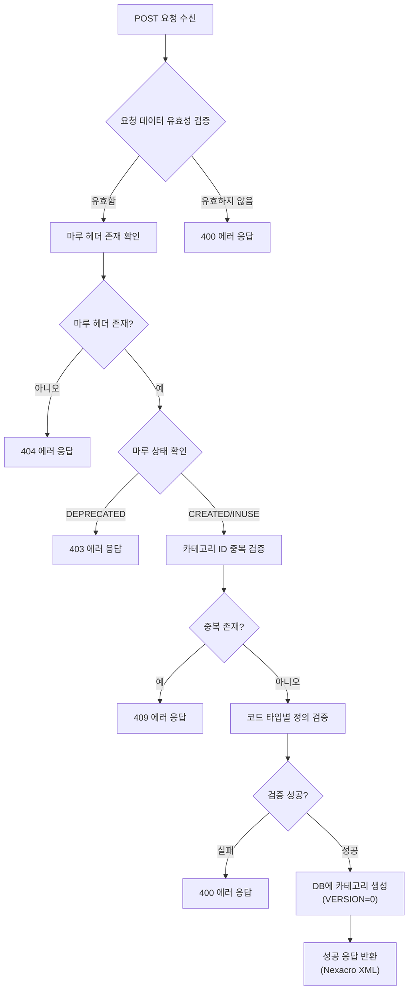
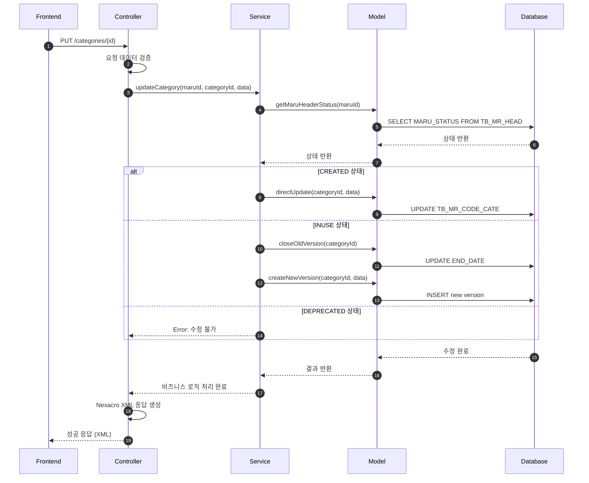
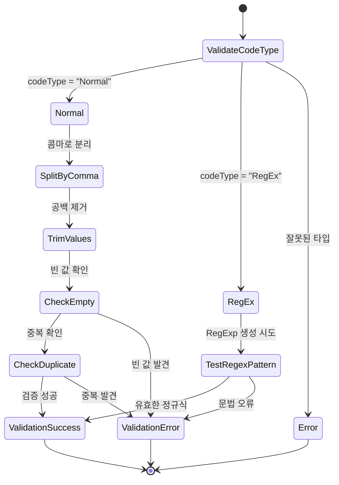

# 📄 Task 6.1 - CD0100 코드카테고리관리 Backend API 구현 상세설계서

**Template Version:** 1.3.0 — **Last Updated:** 2025-10-04

---

## 0. 문서 메타데이터

* 문서명: `Task-6-1.CD0100-Backend-API-구현(상세설계).md`
* 버전: 1.0
* 작성일: 2025-10-04
* 작성자: MARU Development Team
* 참조 문서:
  - `./docs/project/maru/00.foundation/01.project-charter/business-requirements.md`
  - `./docs/project/maru/00.foundation/02.design-baseline/2. database-design.md`
  - `./docs/project/maru/00.foundation/02.design-baseline/3. api-design.md`
  - `./docs/project/maru/00.foundation/02.design-baseline/5. program-list.md`
* 위치: `./docs/project/maru/10.design/12.detail-design/`
* 관련 이슈/티켓: Task 6.1
* 상위 요구사항 문서/ID: BRD UC-002 코드 카테고리 관리
* 요구사항 추적 담당자: MARU Project Manager
* 추적성 관리 도구: tasks.md

---

## 1. 목적 및 범위

### 1.1 목적
CD0100 코드카테고리관리 화면의 Backend API를 구현하여 코드 카테고리의 생성, 조회, 수정, 삭제 및 검증 기능을 제공한다.

### 1.2 범위

**포함 범위**:
- 코드 카테고리 CRUD API 구현 (CC001-CC005)
- 코드 타입 검증 (Normal: 콤마구분, RegEx: 정규식)
- 부모-자식 관계 검증 (마루 헤더와의 연관성)
- 선분 이력 기반 수정 로직 구현
- Swagger API 문서화
- Nexacro Dataset XML 응답 형식 지원

**제외 범위**:
- Frontend UI 구현 (Task 6.2에서 처리)
- 복잡한 인증/권한 관리 (PoC 제외)
- 캐시 레이어 구현 (향후 구현)

---

## 2. 요구사항 & 승인 기준 (Acceptance Criteria)

### 2.1. 요구사항
* 요구사항 원본 링크: `./docs/project/maru/00.foundation/01.project-charter/business-requirements.md` - UC-002

#### 기능 요구사항:

**[CD0100-REQ-001] 코드 카테고리 목록 조회**
- 특정 마루 헤더에 속한 모든 코드 카테고리를 조회할 수 있어야 한다
- 최신 버전의 카테고리 정보를 반환해야 한다
- 페이징 및 정렬을 지원해야 한다

**[CD0100-REQ-002] 코드 카테고리 상세 조회**
- 특정 카테고리의 상세 정보를 조회할 수 있어야 한다
- 특정 버전 또는 특정 시점의 데이터 조회를 지원해야 한다

**[CD0100-REQ-003] 코드 카테고리 생성**
- 새로운 코드 카테고리를 생성할 수 있어야 한다
- 카테고리 ID 중복 검증을 수행해야 한다
- 마루 헤더의 상태에 따라 생성 가능 여부를 확인해야 한다
- 코드 타입(Normal/RegEx)과 코드 정의를 설정할 수 있어야 한다

**[CD0100-REQ-004] 코드 카테고리 수정**
- 기존 코드 카테고리를 수정할 수 있어야 한다
- 마루 헤더 상태에 따른 수정 정책을 적용해야 한다:
  - CREATED: 직접 수정 가능
  - INUSE: 새 버전 생성을 통한 수정
  - DEPRECATED: 수정 불가
- 선분 이력 모델을 통한 변경 추적이 이루어져야 한다

**[CD0100-REQ-005] 코드 카테고리 삭제**
- 코드 카테고리를 논리적으로 삭제할 수 있어야 한다
- 삭제 시 관련 코드 기본값 존재 여부를 확인해야 한다
- 마루 헤더 상태에 따른 삭제 정책을 적용해야 한다

**[CD0100-REQ-006] 코드 타입 검증**
- Normal 타입: 콤마로 구분된 값 목록 검증
- RegEx 타입: 유효한 정규식 패턴 검증
- 코드 정의 형식 오류 시 명확한 에러 메시지 반환

#### 비기능 요구사항:

**[CD0100-REQ-007] 성능**
- API 응답시간 < 1초 (일반 조회)
- 복잡한 조회(이력 포함) < 3초

**[CD0100-REQ-008] 안정성**
- 데이터 무결성 보장
- 트랜잭션 롤백 처리
- 적절한 에러 핸들링

**[CD0100-REQ-009] 보안**
- SQL Injection 방지 (Parameterized Query)
- XSS 방지 (입력값 이스케이프)

#### 승인 기준:

- [ ] 모든 CRUD API가 정상 동작
- [ ] 코드 타입별 검증 로직이 정확히 동작
- [ ] 마루 헤더 상태별 수정 정책이 올바르게 적용
- [ ] 선분 이력 모델이 정확히 구현
- [ ] Swagger 문서화 완료
- [ ] 단위 테스트 커버리지 80% 이상
- [ ] 통합 테스트 통과

### 2.2. 요구사항-설계 추적 매트릭스

| 요구사항 ID | 요구사항 설명 | 설계 섹션/아티팩트 | 테스트 케이스 ID | 상태 | 비고 |
|-------------|---------------|--------------------|------------------|------|------|
| CD0100-REQ-001 | 코드 카테고리 목록 조회 | §5.1, §8.1 | TC-API-001 | 초안 | |
| CD0100-REQ-002 | 코드 카테고리 상세 조회 | §5.2, §8.2 | TC-API-002 | 초안 | |
| CD0100-REQ-003 | 코드 카테고리 생성 | §5.3, §8.3 | TC-API-003 | 초안 | |
| CD0100-REQ-004 | 코드 카테고리 수정 | §5.4, §8.4 | TC-API-004 | 초안 | |
| CD0100-REQ-005 | 코드 카테고리 삭제 | §5.5, §8.5 | TC-API-005 | 초안 | |
| CD0100-REQ-006 | 코드 타입 검증 | §5.6, §9 | TC-VAL-001~002 | 초안 | |
| CD0100-REQ-007 | 성능 요구사항 | §11 | TC-PERF-001~002 | 초안 | |
| CD0100-REQ-008 | 안정성 요구사항 | §9 | TC-ERR-001~003 | 초안 | |
| CD0100-REQ-009 | 보안 요구사항 | §10 | TC-SEC-001~002 | 초안 | |

---

## 3. 용어/가정/제약

### 3.1 용어 정의

| 용어 | 정의 |
|------|------|
| 코드 카테고리 | 코드를 분류하는 단위로, 코드 타입과 검증 규칙을 정의 |
| 코드 타입 | Normal(콤마구분) 또는 RegEx(정규식) 중 하나 |
| 코드 정의 | 해당 카테고리에서 허용하는 코드값의 범위 또는 패턴 |
| 선분 이력 모델 | START_DATE와 END_DATE를 사용한 시간 기반 버전 관리 |
| 마루 헤더 | 코드/룰 집합의 최상위 개념 |

### 3.2 가정 (Assumptions)

- 마루 헤더가 먼저 생성되어 있어야 카테고리 생성 가능
- 데이터베이스는 Oracle 또는 SQLite 사용
- Nexacro Dataset XML 응답 형식 지원
- PoC 단계로 인증/권한 검증은 제외

### 3.3 제약 (Constraints)

- 하나의 마루 헤더에 최대 100개의 카테고리 생성 가능
- 카테고리 ID는 마루 내에서 유일해야 함
- 코드 정의 최대 길이: 4000자
- DEPRECATED 상태의 마루에는 카테고리 추가/수정 불가

---

## 4. 시스템/모듈 개요

### 4.1 역할 및 책임

**CodeCategory Controller**:
- HTTP 요청 수신 및 응답 처리
- 요청 파라미터 검증
- Nexacro Dataset XML 형식 응답 생성

**CodeCategory Service**:
- 비즈니스 로직 처리
- 코드 타입별 검증 로직
- 마루 헤더 상태 확인 및 정책 적용
- 선분 이력 관리

**CodeCategory Model**:
- 데이터베이스 접근 레이어
- TB_MR_CODE_CATE 테이블 CRUD
- 트랜잭션 관리

### 4.2 외부 의존성

- **Express 5.x**: HTTP 서버 프레임워크
- **knex.js**: SQL Query Builder
- **Joi**: 요청 데이터 검증
- **node-cache**: 캐싱 (향후 구현)
- **swagger-jsdoc**: API 문서화

### 4.3 상호작용 개요

```
[Nexacro Frontend]
    ↓ HTTP/JSON
[Express Router]
    ↓
[CodeCategory Controller]
    ↓
[CodeCategory Service]
    ↓
[CodeCategory Model]
    ↓
[Database: TB_MR_CODE_CATE]
```

---

## 5. 프로세스 흐름

### 5.1 코드 카테고리 목록 조회 프로세스 [CD0100-REQ-001]

**단계**:
1. Frontend에서 `GET /api/v1/maru-headers/{maruId}/categories` 요청
2. Controller에서 요청 파라미터(page, limit, sort) 검증
3. Service에서 마루 헤더 존재 여부 확인
4. Model에서 최신 버전의 카테고리 목록 조회
5. Service에서 비즈니스 규칙 적용 (필터링, 정렬)
6. Controller에서 Nexacro Dataset XML 형식으로 응답 생성
7. Frontend에 성공 응답 반환

### 5.2 코드 카테고리 상세 조회 프로세스 [CD0100-REQ-002]

**단계**:
1. Frontend에서 `GET /api/v1/maru-headers/{maruId}/categories/{categoryId}` 요청
2. Controller에서 경로 파라미터 및 쿼리 파라미터(version, asOfDate) 검증
3. Service에서 마루 헤더 및 카테고리 존재 여부 확인
4. Model에서 특정 버전 또는 시점의 카테고리 정보 조회
5. Controller에서 Nexacro Dataset XML 형식으로 응답 생성
6. Frontend에 성공 응답 반환

### 5.3 코드 카테고리 생성 프로세스 [CD0100-REQ-003]

**단계**:
1. Frontend에서 `POST /api/v1/maru-headers/{maruId}/categories` 요청
2. Controller에서 요청 본문(categoryId, categoryName, codeType, codeDefinition) 검증
3. Service에서 마루 헤더 존재 및 상태 확인
4. Service에서 카테고리 ID 중복 검증
5. Service에서 코드 타입별 코드 정의 검증
6. Model에서 새 카테고리 레코드 삽입 (VERSION=0, START_DATE=현재, END_DATE=9999-12-31)
7. Controller에서 성공 응답 생성
8. Frontend에 생성 결과 반환

### 5.4 코드 카테고리 수정 프로세스 [CD0100-REQ-004]

**단계**:
1. Frontend에서 `PUT /api/v1/maru-headers/{maruId}/categories/{categoryId}` 요청
2. Controller에서 요청 본문 검증
3. Service에서 마루 헤더 상태 확인
4. **상태별 처리**:
   - **CREATED**: 기존 레코드 직접 UPDATE
   - **INUSE**:
     - 기존 레코드의 END_DATE를 현재 시간으로 UPDATE
     - 새 버전 레코드 INSERT (VERSION+1, START_DATE=현재)
   - **DEPRECATED**: 에러 반환
5. Service에서 코드 타입별 코드 정의 검증
6. Model에서 트랜잭션 내에서 수정 처리
7. Controller에서 성공 응답 생성
8. Frontend에 수정 결과 반환

### 5.5 코드 카테고리 삭제 프로세스 [CD0100-REQ-005]

**단계**:
1. Frontend에서 `DELETE /api/v1/maru-headers/{maruId}/categories/{categoryId}` 요청
2. Controller에서 경로 파라미터 검증
3. Service에서 마루 헤더 상태 확인
4. Service에서 관련 코드 기본값 존재 여부 확인
5. **삭제 처리**:
   - CREATED 상태: 물리적 삭제 (DELETE)
   - INUSE 상태: 논리적 삭제 (END_DATE를 현재 시간으로 UPDATE)
   - DEPRECATED 상태: 에러 반환
6. Model에서 트랜잭션 내에서 삭제 처리
7. Controller에서 성공 응답 생성
8. Frontend에 삭제 결과 반환

### 5.6 코드 타입 검증 프로세스 [CD0100-REQ-006]

**Normal 타입 검증**:
1. 코드 정의를 콤마(,)로 분리
2. 각 값의 앞뒤 공백 제거
3. 빈 값 또는 중복 값 확인
4. 검증 실패 시 에러 메시지 반환

**RegEx 타입 검증**:
1. JavaScript RegExp 생성 시도
2. 정규식 문법 오류 확인
3. 검증 실패 시 에러 메시지 반환

### 5.2. 프로세스 설계 개념도 (Mermaid)

#### 카테고리 생성 흐름도



#### 카테고리 수정 시퀀스 다이어그램



#### 코드 타입별 검증 상태 다이어그램



---

## 6. UI 레이아웃 설계 (Text Art + SVG)

> **참고**: 본 Task는 Backend API 구현이므로 UI 레이아웃 설계는 Task 6.2 (Frontend UI 구현)에서 상세히 다룹니다.

**API 테스트를 위한 Swagger UI 레이아웃**:

```
┌─────────────────────────────────────────────────────────┐
│  Swagger UI - MARU API Documentation                   │
│  http://localhost:3000/api-docs                         │
├─────────────────────────────────────────────────────────┤
│                                                         │
│  Code Category Management APIs                          │
│                                                         │
│  ▼ CC001 GET  /api/v1/maru-headers/{maruId}/categories │
│     코드 카테고리 목록 조회                               │
│     [Try it out] [Parameters] [Responses]               │
│                                                         │
│  ▼ CC002 GET  /api/v1/maru-headers/{maruId}/categories/│
│              {categoryId}                               │
│     코드 카테고리 상세 조회                               │
│                                                         │
│  ▼ CC003 POST /api/v1/maru-headers/{maruId}/categories │
│     코드 카테고리 생성                                    │
│                                                         │
│  ▼ CC004 PUT  /api/v1/maru-headers/{maruId}/categories/│
│              {categoryId}                               │
│     코드 카테고리 수정                                    │
│                                                         │
│  ▼ CC005 DELETE /api/v1/maru-headers/{maruId}/categories/│
│                {categoryId}                             │
│     코드 카테고리 삭제                                    │
│                                                         │
└─────────────────────────────────────────────────────────┘
```

---

## 7. 데이터/메시지 구조 (개념 수준)

### 7.1. 입력 데이터 구조

**카테고리 생성 요청 (POST)**:
```json
{
  "categoryId": "DEPT_LEVEL",
  "categoryName": "부서레벨",
  "codeType": "Normal",
  "codeDefinition": "1,2,3,4,5"
}
```

**카테고리 수정 요청 (PUT)**:
```json
{
  "categoryName": "부서레벨 (수정)",
  "codeType": "Normal",
  "codeDefinition": "1,2,3,4,5,6"
}
```

**필드 제약**:
- `categoryId`: 필수, 영문/숫자/언더스코어, 최대 50자
- `categoryName`: 필수, 최대 200자
- `codeType`: 필수, "Normal" 또는 "RegEx"
- `codeDefinition`: 필수, 최대 4000자

### 7.2. 출력 데이터 구조

**성공 응답 (Nexacro Dataset XML)**:
```xml
<?xml version="1.0" encoding="UTF-8"?>
<Dataset>
  <ErrorCode>0</ErrorCode>
  <ErrorMsg></ErrorMsg>
  <SuccessRowCount>2</SuccessRowCount>

  <ColumnInfo>
    <Column id="CATEGORY_ID" type="STRING" size="20"/>
    <Column id="CATEGORY_NAME" type="STRING" size="100"/>
    <Column id="CODE_TYPE" type="STRING" size="20"/>
    <Column id="CODE_DEFINITION" type="STRING" size="500"/>
    <Column id="SORT_ORDER" type="INT" size="4"/>
  </ColumnInfo>

  <Rows>
    <Row>
      <Col id="CATEGORY_ID">DEPT_LEVEL</Col>
      <Col id="CATEGORY_NAME">부서레벨</Col>
      <Col id="CODE_TYPE">Normal</Col>
      <Col id="CODE_DEFINITION">1,2,3,4,5</Col>
      <Col id="SORT_ORDER">1</Col>
    </Row>
    <Row>
      <Col id="CATEGORY_ID">DEPT_TYPE</Col>
      <Col id="CATEGORY_NAME">부서유형</Col>
      <Col id="CODE_TYPE">Normal</Col>
      <Col id="CODE_DEFINITION">사업부,지원부,연구소</Col>
      <Col id="SORT_ORDER">2</Col>
    </Row>
  </Rows>
</Dataset>
```

**에러 응답 (Nexacro Dataset XML)**:
```xml
<?xml version="1.0" encoding="UTF-8"?>
<Dataset>
  <ErrorCode>-100</ErrorCode>
  <ErrorMsg>중복된 카테고리 ID가 이미 존재합니다.</ErrorMsg>
  <SuccessRowCount>0</SuccessRowCount>

  <ColumnInfo>
    <Column id="ERROR_FIELD" type="STRING" size="50"/>
    <Column id="ERROR_VALUE" type="STRING" size="100"/>
  </ColumnInfo>

  <Rows>
    <Row>
      <Col id="ERROR_FIELD">categoryId</Col>
      <Col id="ERROR_VALUE">DEPT_LEVEL</Col>
    </Row>
  </Rows>
</Dataset>
```

### 7.3. 시스템간 I/F 데이터 구조

**데이터베이스 레코드 구조 (TB_MR_CODE_CATE)**:
```sql
{
  MARU_ID: 'DEPT_CODE_001',
  CATEGORY_ID: 'DEPT_LEVEL',
  VERSION: 0,
  CATEGORY_NAME: '부서레벨',
  CODE_TYPE: 'Normal',
  CODE_DEFINITION: '1,2,3,4,5',
  START_DATE: '2025-10-04 10:00:00',
  END_DATE: '9999-12-31 23:59:59'
}
```

---

## 8. 인터페이스 계약(Contract)

### 8.1. API CC001: 코드 카테고리 목록 조회 [CD0100-REQ-001]

**엔드포인트**: `GET /api/v1/maru-headers/{maruId}/categories`

**경로 파라미터**:
- `maruId` (string, 필수): 마루 고유 식별자

**쿼리 파라미터**:
- `page` (number, 선택): 페이지 번호 (기본값: 1)
- `limit` (number, 선택): 페이지 크기 (기본값: 20)
- `sort` (string, 선택): 정렬 기준 (기본값: "SORT_ORDER")

**성공 응답** (200 OK):
- Nexacro Dataset XML 형식
- ColumnInfo: CATEGORY_ID, CATEGORY_NAME, CODE_TYPE, CODE_DEFINITION, SORT_ORDER
- ErrorCode: 0

**오류 응답**:
- 404: 마루 헤더를 찾을 수 없음 (ErrorCode: -1)
- 500: 서버 내부 오류 (ErrorCode: -200)

**검증 케이스**: TC-API-001

**Swagger 주소**: `http://localhost:3000/api-docs#/Code%20Category/get_api_v1_maru_headers__maruId__categories`

---

### 8.2. API CC002: 코드 카테고리 상세 조회 [CD0100-REQ-002]

**엔드포인트**: `GET /api/v1/maru-headers/{maruId}/categories/{categoryId}`

**경로 파라미터**:
- `maruId` (string, 필수): 마루 고유 식별자
- `categoryId` (string, 필수): 카테고리 고유 식별자

**쿼리 파라미터**:
- `version` (number, 선택): 특정 버전 조회
- `asOfDate` (string, 선택): 특정 시점 조회 (ISO 8601 형식)

**성공 응답** (200 OK):
- Nexacro Dataset XML 형식
- 단일 카테고리 정보 반환

**오류 응답**:
- 404: 카테고리를 찾을 수 없음 (ErrorCode: -1)

**검증 케이스**: TC-API-002

**Swagger 주소**: `http://localhost:3000/api-docs#/Code%20Category/get_api_v1_maru_headers__maruId__categories__categoryId_`

---

### 8.3. API CC003: 코드 카테고리 생성 [CD0100-REQ-003]

**엔드포인트**: `POST /api/v1/maru-headers/{maruId}/categories`

**경로 파라미터**:
- `maruId` (string, 필수): 마루 고유 식별자

**요청 본문** (JSON):
```json
{
  "categoryId": "string (필수, 최대 50자)",
  "categoryName": "string (필수, 최대 200자)",
  "codeType": "Normal | RegEx (필수)",
  "codeDefinition": "string (필수, 최대 4000자)"
}
```

**성공 응답** (201 Created):
```xml
<Dataset>
  <ErrorCode>0</ErrorCode>
  <ErrorMsg></ErrorMsg>
  <SuccessRowCount>1</SuccessRowCount>
  <ColumnInfo>
    <Column id="RESULT" type="STRING" size="10"/>
    <Column id="MESSAGE" type="STRING" size="200"/>
    <Column id="NEW_CATEGORY_ID" type="STRING" size="50"/>
  </ColumnInfo>
  <Rows>
    <Row>
      <Col id="RESULT">SUCCESS</Col>
      <Col id="MESSAGE">카테고리가 정상적으로 생성되었습니다.</Col>
      <Col id="NEW_CATEGORY_ID">DEPT_LEVEL</Col>
    </Row>
  </Rows>
</Dataset>
```

**오류 응답**:
- 400: 잘못된 요청 (ErrorCode: -400)
- 404: 마루 헤더를 찾을 수 없음 (ErrorCode: -1)
- 409: 중복된 카테고리 ID (ErrorCode: -100)
- 403: DEPRECATED 상태 마루 (ErrorCode: -300)

**검증 케이스**: TC-API-003

**Swagger 주소**: `http://localhost:3000/api-docs#/Code%20Category/post_api_v1_maru_headers__maruId__categories`

---

### 8.4. API CC004: 코드 카테고리 수정 [CD0100-REQ-004]

**엔드포인트**: `PUT /api/v1/maru-headers/{maruId}/categories/{categoryId}`

**경로 파라미터**:
- `maruId` (string, 필수): 마루 고유 식별자
- `categoryId` (string, 필수): 카테고리 고유 식별자

**요청 본문** (JSON):
```json
{
  "categoryName": "string (선택, 최대 200자)",
  "codeType": "Normal | RegEx (선택)",
  "codeDefinition": "string (선택, 최대 4000자)"
}
```

**성공 응답** (200 OK):
```xml
<Dataset>
  <ErrorCode>0</ErrorCode>
  <ErrorMsg></ErrorMsg>
  <SuccessRowCount>1</SuccessRowCount>
  <ColumnInfo>
    <Column id="RESULT" type="STRING" size="10"/>
    <Column id="MESSAGE" type="STRING" size="200"/>
    <Column id="UPDATED_VERSION" type="INT" size="4"/>
  </ColumnInfo>
  <Rows>
    <Row>
      <Col id="RESULT">SUCCESS</Col>
      <Col id="MESSAGE">카테고리가 정상적으로 수정되었습니다.</Col>
      <Col id="UPDATED_VERSION">1</Col>
    </Row>
  </Rows>
</Dataset>
```

**오류 응답**:
- 400: 잘못된 요청 (ErrorCode: -400)
- 404: 카테고리를 찾을 수 없음 (ErrorCode: -1)
- 403: 수정 불가 상태 (ErrorCode: -300)

**검증 케이스**: TC-API-004

**Swagger 주소**: `http://localhost:3000/api-docs#/Code%20Category/put_api_v1_maru_headers__maruId__categories__categoryId_`

---

### 8.5. API CC005: 코드 카테고리 삭제 [CD0100-REQ-005]

**엔드포인트**: `DELETE /api/v1/maru-headers/{maruId}/categories/{categoryId}`

**경로 파라미터**:
- `maruId` (string, 필수): 마루 고유 식별자
- `categoryId` (string, 필수): 카테고리 고유 식별자

**성공 응답** (200 OK):
```xml
<Dataset>
  <ErrorCode>0</ErrorCode>
  <ErrorMsg></ErrorMsg>
  <SuccessRowCount>1</SuccessRowCount>
  <ColumnInfo>
    <Column id="RESULT" type="STRING" size="10"/>
    <Column id="MESSAGE" type="STRING" size="200"/>
  </ColumnInfo>
  <Rows>
    <Row>
      <Col id="RESULT">SUCCESS</Col>
      <Col id="MESSAGE">카테고리가 정상적으로 삭제되었습니다.</Col>
    </Row>
  </Rows>
</Dataset>
```

**오류 응답**:
- 404: 카테고리를 찾을 수 없음 (ErrorCode: -1)
- 409: 관련 코드 기본값 존재 (ErrorCode: -100)
- 403: 삭제 불가 상태 (ErrorCode: -300)

**검증 케이스**: TC-API-005

**Swagger 주소**: `http://localhost:3000/api-docs#/Code%20Category/delete_api_v1_maru_headers__maruId__categories__categoryId_`

---

## 9. 오류/예외/경계조건

### 9.1. 예상 오류 상황 및 처리 방안

**데이터 검증 오류**:
- **상황**: 필수 필드 누락, 형식 오류, 범위 초과
- **처리**: Joi 스키마 검증 → 400 에러 + 상세 필드 오류 정보 반환
- **메시지**: "categoryName은 필수 항목입니다." / "codeType은 Normal 또는 RegEx여야 합니다."

**비즈니스 로직 오류**:
- **상황**: 중복 카테고리 ID, DEPRECATED 상태 마루 수정 시도
- **처리**: Service Layer에서 검증 → 409/403 에러 반환
- **메시지**: "중복된 카테고리 ID가 이미 존재합니다." / "폐기된 마루는 수정할 수 없습니다."

**데이터베이스 오류**:
- **상황**: DB 연결 실패, 쿼리 타임아웃, 제약조건 위반
- **처리**: try-catch로 포착 → 500 에러 반환, 에러 로깅
- **메시지**: "데이터베이스 오류가 발생했습니다. 관리자에게 문의하세요."

**코드 정의 검증 오류**:
- **Normal 타입**: 빈 값, 중복 값 → "코드 정의에 빈 값이 포함되어 있습니다."
- **RegEx 타입**: 정규식 문법 오류 → "유효하지 않은 정규식 패턴입니다: {오류 상세}"

### 9.2. 복구 전략 및 사용자 메시지

**트랜잭션 롤백**:
- 수정/삭제 시 오류 발생 → 자동 롤백
- 사용자 메시지: "작업 중 오류가 발생하여 변경사항이 취소되었습니다."

**재시도 전략**:
- DB 일시적 연결 오류 → 최대 3회 재시도 (exponential backoff)
- 재시도 실패 시: "서버가 일시적으로 응답하지 않습니다. 잠시 후 다시 시도해주세요."

**데이터 복구**:
- 선분 이력 모델 활용 → 이전 버전 데이터 조회 가능
- 사용자 메시지: "변경 전 데이터를 조회하려면 이력 조회 기능을 이용하세요."

---

## 10. 보안/품질 고려

### 10.1 보안 고려사항

**SQL Injection 방지**:
- knex.js의 Parameterized Query 사용
- 사용자 입력값을 직접 SQL에 삽입하지 않음
- 예시: `knex('TB_MR_CODE_CATE').where('MARU_ID', maruId)`

**XSS 방지**:
- 입력값 이스케이프 처리
- Joi 스키마를 통한 입력 형식 강제
- HTML 태그 허용하지 않음

**인증/인가** (PoC 제외):
- 향후 JWT 기반 인증 적용 예정
- API 별 권한 관리 (역할 기반 접근 제어)

**비밀/키 관리**:
- 데이터베이스 연결 정보를 환경 변수(.env)로 관리
- 민감 정보 로깅 금지

### 10.2 품질 고려사항

**코드 품질**:
- ESLint를 통한 코드 스타일 검증
- Prettier를 통한 코드 포맷팅
- 함수당 최대 50줄 이하 유지

**테스트 커버리지**:
- 단위 테스트 커버리지 80% 이상
- 통합 테스트를 통한 E2E 검증
- 경계값 테스트 포함

**로깅/감사**:
- Winston을 사용한 구조화된 로깅
- 모든 API 요청/응답 로깅
- 에러 스택 트레이스 기록

**국제화(i18n)**:
- 에러 메시지 다국어 지원 준비 (향후)
- 현재는 한국어 메시지만 지원

---

## 11. 성능 및 확장성(개념)

### 11.1 목표/지표

**응답시간 목표**:
- 목록 조회(CC001): < 500ms (20건 기준)
- 상세 조회(CC002): < 300ms
- 생성/수정/삭제(CC003-CC005): < 1초

**동시 사용자**:
- PoC 단계: 5명
- 향후 확장: 50명 이상

**데이터 볼륨**:
- 마루당 평균 카테고리 수: 5-10개
- 전체 시스템: 최대 500개 카테고리

### 11.2 병목 예상 지점과 완화 전략

**데이터베이스 조회**:
- **병목**: 대량 카테고리 조회 시 성능 저하
- **완화**:
  - 인덱스 활용 (MARU_ID, END_DATE, START_DATE)
  - 페이징 처리 (limit, offset)
  - 캐싱 레이어 추가 (향후)

**선분 이력 조회**:
- **병목**: 특정 시점 데이터 조회 시 복잡한 쿼리
- **완화**:
  - 인덱스 최적화
  - Materialized View 활용 (향후)

**트랜잭션 처리**:
- **병목**: INUSE 상태 수정 시 다중 쿼리 실행
- **완화**:
  - 트랜잭션 범위 최소화
  - 배치 처리 고려 (향후)

### 11.3 부하/장애 시나리오 대응

**높은 부하**:
- 연결 풀 크기 조정 (최대 20개 연결)
- 요청 큐잉 및 Rate Limiting
- 캐시 히트율 90% 이상 유지 (향후)

**데이터베이스 장애**:
- Health Check 엔드포인트 제공
- Circuit Breaker 패턴 적용 (향후)
- 읽기 전용 복제본 활용 (향후)

---

## 12. 테스트 전략 (TDD 계획)

### 12.1 단위 테스트

**Service Layer 테스트**:
- 코드 타입별 검증 로직 테스트
- 마루 상태별 수정 정책 테스트
- 선분 이력 생성 로직 테스트

**실패 테스트 시나리오**:
1. Normal 타입에 빈 값 포함 → 검증 실패
2. RegEx 타입에 잘못된 정규식 → 검증 실패
3. DEPRECATED 마루에 생성 시도 → 403 에러
4. 중복 카테고리 ID 생성 시도 → 409 에러

**최소 구현 전략**:
1. 기본 CRUD 구현
2. 코드 타입 검증 추가
3. 선분 이력 로직 추가
4. 에러 핸들링 강화

### 12.2 통합 테스트

**API 통합 테스트**:
- Supertest를 사용한 HTTP 요청 테스트
- 실제 데이터베이스 연동 테스트
- 트랜잭션 롤백 검증

**테스트 데이터**:
- 테스트용 마루 헤더 사전 생성
- 각 테스트 후 데이터 정리 (afterEach)

### 12.3 리팩터링 포인트

**코드 중복 제거**:
- Nexacro XML 응답 생성 헬퍼 함수 공통화
- 마루 헤더 상태 확인 로직 공통화

**성능 최적화**:
- N+1 쿼리 문제 해결
- 불필요한 데이터베이스 조회 제거

**가독성 향상**:
- 복잡한 조건문을 Guard Clause로 변경
- Magic Number를 상수로 정의

---

## 13. 구현 체크리스트

### 13.1 Backend 구현

- [ ] Express 라우터 설정 (routes/codeCategory.js)
- [ ] Controller 구현 (controllers/codeCategory.controller.js)
- [ ] Service 구현 (services/codeCategory.service.js)
- [ ] Model 구현 (models/codeCategory.model.js)
- [ ] Joi 검증 스키마 정의
- [ ] Nexacro XML 응답 헬퍼 함수 구현
- [ ] 코드 타입별 검증 로직 구현
- [ ] 선분 이력 관리 로직 구현
- [ ] 마루 상태별 수정 정책 구현
- [ ] 에러 핸들링 미들웨어 적용

### 13.2 테스트

- [ ] 단위 테스트 작성 (Service Layer)
- [ ] 통합 테스트 작성 (API Layer)
- [ ] 경계값 테스트 작성
- [ ] 에러 시나리오 테스트 작성
- [ ] 성능 테스트 작성
- [ ] 테스트 커버리지 80% 이상 달성

### 13.3 문서화

- [ ] Swagger API 문서화 (@swagger 주석)
- [ ] README 업데이트 (API 사용법)
- [ ] 에러 코드 문서 작성
- [ ] 데이터베이스 스키마 문서 업데이트
- [ ] 상세설계서 최종 검토

### 13.4 배포 준비

- [ ] 환경 변수 설정 (.env.example)
- [ ] 데이터베이스 마이그레이션 스크립트
- [ ] 초기 데이터 Seed 스크립트
- [ ] Health Check 엔드포인트 추가
- [ ] 로깅 설정 완료

---

## 14. 승인 및 검토

### 14.1 설계 검토 체크리스트

- [ ] 요구사항 추적성 매트릭스 완성
- [ ] 모든 API 계약이 명확히 정의됨
- [ ] 에러 처리 시나리오가 완전함
- [ ] 보안 고려사항이 충분함
- [ ] 성능 목표가 달성 가능함
- [ ] 테스트 전략이 적절함

### 14.2 승인

| 역할 | 이름 | 서명 | 날짜 |
|------|------|------|------|
| Backend 개발자 | | | |
| 시스템 아키텍트 | | | |
| 프로젝트 매니저 | | | |
| QA 엔지니어 | | | |

---

## 15. UI 테스트케이스 **[API 테스트 중심]**

> **참고**: 본 Task는 Backend API 구현이므로 Swagger UI를 통한 API 테스트케이스를 중심으로 작성합니다.

### 15-1. API 엔드포인트 테스트케이스

| 테스트 ID | API | 테스트 시나리오 | 실행 단계 | 예상 결과 | 검증 기준 | 요구사항 | 우선순위 |
|-----------|-----|-----------------|-----------|-----------|-----------|----------|----------|
| TC-API-001 | CC001 | 카테고리 목록 조회 성공 | 1. Swagger UI에서 CC001 선택<br>2. maruId 입력<br>3. Execute 클릭 | 200 OK + 카테고리 목록 | ErrorCode=0, SuccessRowCount>0 | [CD0100-REQ-001] | High |
| TC-API-002 | CC002 | 카테고리 상세 조회 성공 | 1. CC002 선택<br>2. maruId, categoryId 입력<br>3. Execute 클릭 | 200 OK + 상세 정보 | ErrorCode=0, 단일 레코드 | [CD0100-REQ-002] | High |
| TC-API-003 | CC003 | Normal 타입 카테고리 생성 | 1. CC003 선택<br>2. Request Body 입력<br>3. Execute 클릭 | 201 Created + 생성 성공 | ErrorCode=0, NEW_CATEGORY_ID 반환 | [CD0100-REQ-003] | High |
| TC-API-004 | CC003 | RegEx 타입 카테고리 생성 | 1. CC003 선택<br>2. codeType=RegEx 입력<br>3. Execute 클릭 | 201 Created + 생성 성공 | ErrorCode=0, 정규식 검증 성공 | [CD0100-REQ-006] | High |
| TC-API-005 | CC004 | CREATED 상태 카테고리 수정 | 1. CC004 선택<br>2. 수정 데이터 입력<br>3. Execute 클릭 | 200 OK + 직접 수정 | ErrorCode=0, VERSION 변경 없음 | [CD0100-REQ-004] | High |
| TC-API-006 | CC004 | INUSE 상태 카테고리 수정 | 1. CC004 선택<br>2. 수정 데이터 입력<br>3. Execute 클릭 | 200 OK + 버전 증가 | ErrorCode=0, UPDATED_VERSION=1 | [CD0100-REQ-004] | High |
| TC-API-007 | CC005 | 카테고리 삭제 성공 | 1. CC005 선택<br>2. maruId, categoryId 입력<br>3. Execute 클릭 | 200 OK + 삭제 성공 | ErrorCode=0, 삭제 메시지 | [CD0100-REQ-005] | High |
| TC-API-008 | CC001 | 존재하지 않는 마루 조회 | 1. CC001 선택<br>2. 잘못된 maruId 입력<br>3. Execute 클릭 | 200 OK + 에러 | ErrorCode=-1, 에러 메시지 | [CD0100-REQ-001] | Medium |

### 15-2. 데이터 검증 테스트케이스

| 테스트 ID | 검증 대상 | 테스트 조건 | 실행 방법 | 예상 결과 | 합격 기준 | 도구/방법 |
|-----------|-----------|-------------|-----------|-----------|-----------|-----------|
| TC-VAL-001 | Normal 타입 검증 | codeDefinition: "1,2,3" | Postman/Swagger | 검증 성공 | 콤마 구분 파싱 성공 | Swagger UI |
| TC-VAL-002 | Normal 타입 빈 값 | codeDefinition: "1,,3" | Postman/Swagger | 400 에러 | ErrorCode=-400, 빈 값 에러 메시지 | Swagger UI |
| TC-VAL-003 | Normal 타입 중복 값 | codeDefinition: "1,2,1" | Postman/Swagger | 400 에러 | ErrorCode=-400, 중복 값 에러 메시지 | Swagger UI |
| TC-VAL-004 | RegEx 타입 검증 | codeDefinition: "^[A-Z]{3}$" | Postman/Swagger | 검증 성공 | 정규식 검증 성공 | Swagger UI |
| TC-VAL-005 | RegEx 타입 오류 | codeDefinition: "^[A-Z" | Postman/Swagger | 400 에러 | ErrorCode=-400, 정규식 오류 메시지 | Swagger UI |
| TC-VAL-006 | 필수 필드 누락 | categoryName 없음 | Postman/Swagger | 400 에러 | ErrorCode=-400, 필수 필드 오류 | Swagger UI |
| TC-VAL-007 | 최대 길이 초과 | codeDefinition: 4001자 | Postman/Swagger | 400 에러 | ErrorCode=-400, 길이 초과 오류 | Swagger UI |

### 15-3. 상태별 정책 테스트케이스

| 시나리오 ID | 시나리오 명 | 사전 조건 | 실행 단계 | 예상 결과 | 후처리 | 요구사항 | 실행 방법 |
|-------------|-------------|-----------|-----------|-----------|--------|----------|-----------|
| TS-001 | CREATED 상태 생성 허용 | 마루 상태: CREATED | 1. CC003 호출<br>2. 카테고리 생성 | 201 Created | - | [CD0100-REQ-003] | Swagger UI |
| TS-002 | INUSE 상태 생성 허용 | 마루 상태: INUSE | 1. CC003 호출<br>2. 카테고리 생성 | 201 Created | - | [CD0100-REQ-003] | Swagger UI |
| TS-003 | DEPRECATED 상태 생성 금지 | 마루 상태: DEPRECATED | 1. CC003 호출<br>2. 카테고리 생성 시도 | 403 Forbidden | - | [CD0100-REQ-003] | Swagger UI |
| TS-004 | CREATED 상태 직접 수정 | 마루 상태: CREATED | 1. CC004 호출<br>2. 카테고리 수정 | VERSION 유지 | - | [CD0100-REQ-004] | Swagger UI |
| TS-005 | INUSE 상태 버전 증가 수정 | 마루 상태: INUSE | 1. CC004 호출<br>2. 카테고리 수정 | VERSION+1 | 이전 버전 END_DATE 확인 | [CD0100-REQ-004] | Swagger UI |
| TS-006 | DEPRECATED 상태 수정 금지 | 마루 상태: DEPRECATED | 1. CC004 호출<br>2. 카테고리 수정 시도 | 403 Forbidden | - | [CD0100-REQ-004] | Swagger UI |

### 15-4. 성능 및 에러 처리 테스트케이스

| 테스트 ID | 성능 지표 | 측정 방법 | 목표 기준 | 측정 도구 | 실행 조건 |
|-----------|-----------|-----------|-----------|-----------|-----------|
| TC-PERF-001 | 목록 조회 응답시간 | API 호출 후 시간 측정 | < 500ms | Postman/JMeter | 20건 데이터 |
| TC-PERF-002 | 생성 응답시간 | API 호출 후 시간 측정 | < 1초 | Postman/JMeter | 표준 요청 |
| TC-PERF-003 | 동시 요청 처리 | 5개 동시 요청 | 모두 성공 | JMeter | 동시성 테스트 |
| TC-ERR-001 | 데이터베이스 오류 | DB 연결 끊기 | 500 에러 + 에러 메시지 | 수동 테스트 | DB 중단 시나리오 |
| TC-ERR-002 | 트랜잭션 롤백 | 수정 중 에러 발생 | 데이터 원상복구 | 수동 테스트 | DB 제약조건 위반 |
| TC-ERR-003 | 잘못된 JSON 형식 | 불완전한 JSON 전송 | 400 에러 | Postman | JSON 문법 오류 |

### 15-5. Postman/Swagger 자동화 테스트 가이드

**Swagger UI 사용 방법**:
1. `http://localhost:3000/api-docs` 접속
2. 원하는 API 엔드포인트 확장
3. "Try it out" 버튼 클릭
4. 파라미터/Request Body 입력
5. "Execute" 버튼 클릭
6. Response 확인

**Postman Collection 구성**:
```json
{
  "info": {
    "name": "CD0100 Code Category API Tests",
    "schema": "https://schema.getpostman.com/json/collection/v2.1.0/collection.json"
  },
  "item": [
    {
      "name": "CC001 - List Categories",
      "request": {
        "method": "GET",
        "url": "{{baseUrl}}/api/v1/maru-headers/{{maruId}}/categories"
      }
    },
    {
      "name": "CC003 - Create Category",
      "request": {
        "method": "POST",
        "url": "{{baseUrl}}/api/v1/maru-headers/{{maruId}}/categories",
        "body": {
          "mode": "raw",
          "raw": "{\"categoryId\":\"TEST_CAT\",\"categoryName\":\"테스트 카테고리\",\"codeType\":\"Normal\",\"codeDefinition\":\"1,2,3\"}"
        }
      }
    }
  ]
}
```

**환경 변수 설정**:
- `baseUrl`: http://localhost:3000
- `maruId`: DEPT_CODE_001 (테스트용 마루 ID)

### 15-6. 수동 테스트 체크리스트

**기본 CRUD 검증**:
- [ ] 모든 API 엔드포인트가 Swagger UI에 표시됨
- [ ] 각 API의 파라미터 설명이 명확함
- [ ] Request/Response 스키마가 정확함
- [ ] 에러 응답이 Nexacro XML 형식을 따름

**데이터 무결성 검증**:
- [ ] 카테고리 ID 중복 시 적절한 에러 반환
- [ ] 존재하지 않는 마루 참조 시 404 에러
- [ ] 코드 타입별 검증이 정확히 동작
- [ ] 트랜잭션 롤백이 올바르게 처리됨

**선분 이력 검증**:
- [ ] CREATED 상태 수정 시 VERSION 유지
- [ ] INUSE 상태 수정 시 VERSION 증가
- [ ] 이전 버전의 END_DATE가 현재 시간으로 설정됨
- [ ] 특정 시점 데이터 조회가 정확함

**보안 검증**:
- [ ] SQL Injection 시도 시 정상 차단
- [ ] XSS 공격 시도 시 입력값 이스케이프
- [ ] 민감 정보가 로그에 노출되지 않음

---

**문서 이력**:
- v1.0 (2025-10-04): 초안 작성
