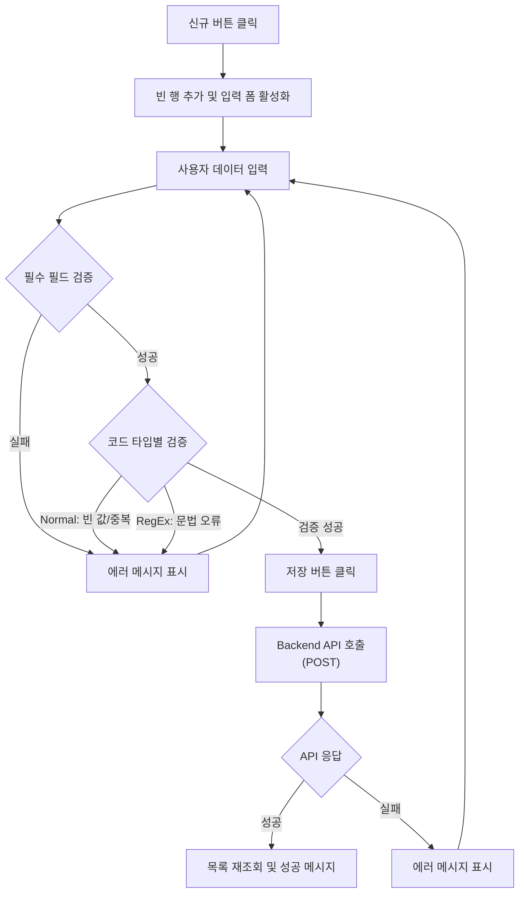
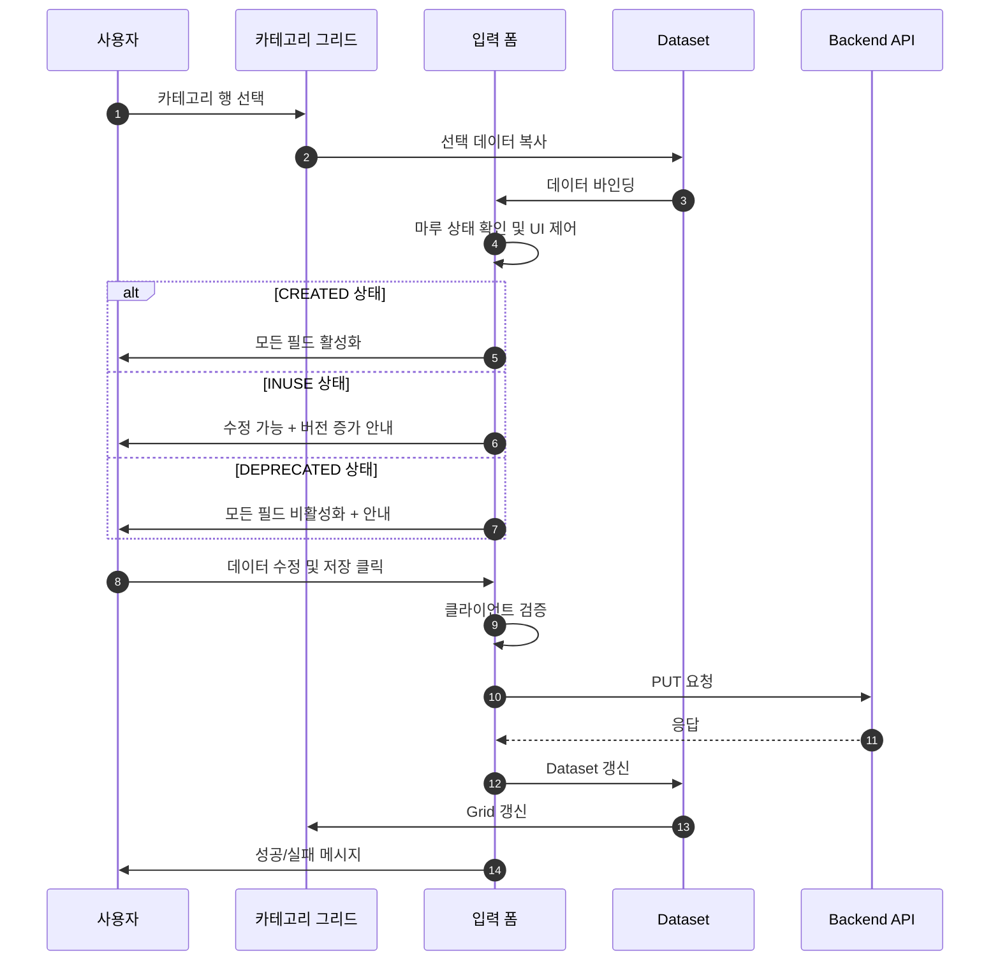
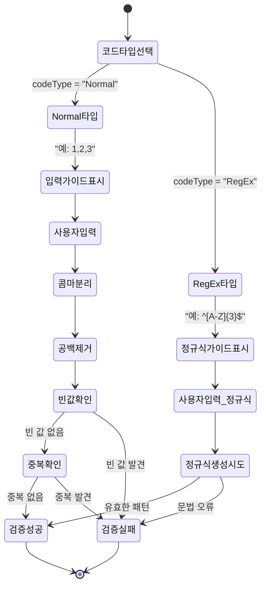
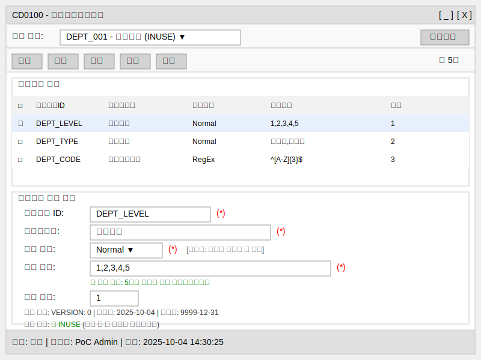

# 📄 Task 6.2 - CD0100 코드카테고리관리 Frontend UI 구현 상세설계서

**Template Version:** 1.3.0 — **Last Updated:** 2025-10-04

---

## 0. 문서 메타데이터

* 문서명: `Task-6-2.CD0100-Frontend-UI-구현(상세설계).md`
* 버전: 1.0
* 작성일: 2025-10-04
* 작성자: MARU Development Team
* 참조 문서:
  - `./docs/project/maru/00.foundation/01.project-charter/business-requirements.md`
  - `./docs/project/maru/00.foundation/02.design-baseline/4. ui-design.md`
  - `./docs/project/maru/00.foundation/02.design-baseline/5. program-list.md`
  - `./docs/project/maru/10.design/12.detail-design/Task-6-1.CD0100-Backend-API-구현(상세설계).md`
* 위치: `./docs/project/maru/10.design/12.detail-design/`
* 관련 이슈/티켓: Task 6.2
* 상위 요구사항 문서/ID: BRD UC-002 코드 카테고리 관리
* 요구사항 추적 담당자: MARU Project Manager
* 추적성 관리 도구: tasks.md

---

## 1. 목적 및 범위

### 1.1 목적
CD0100 코드카테고리관리 화면의 Frontend UI를 Nexacro N V24 기반으로 구현하여 사용자가 직관적으로 코드 카테고리를 관리할 수 있도록 한다.

### 1.2 범위

**포함 범위**:
- Nexacro N V24 Form 구현 (frmCD0100.xfdl)
- 코드 카테고리 CRUD UI 구현
- Backend API 연동 (CC001-CC005)
- Dataset 기반 데이터 바인딩
- 사용자 입력 검증 및 에러 처리
- 코드 타입별 검증 UI (Normal/RegEx)
- 마루 헤더 상태별 UI 제어
- 선분 이력 표시 및 버전 관리 UI

**제외 범위**:
- Backend API 구현 (Task 6.1에서 처리)
- 복잡한 인증/권한 UI (PoC 제외)
- 다국어 지원 (향후 구현)
- 고급 정렬 및 필터링 (기본 기능만 제공)

---

## 2. 요구사항 & 승인 기준 (Acceptance Criteria)

### 2.1. 요구사항
* 요구사항 원본 링크: `./docs/project/maru/00.foundation/01.project-charter/business-requirements.md` - UC-002

#### 기능 요구사항:

**[CD0100-UI-REQ-001] 코드 카테고리 목록 조회 UI**
- 특정 마루 헤더를 선택하면 해당 카테고리 목록을 그리드에 표시해야 한다
- 그리드에는 카테고리ID, 카테고리명, 코드타입, 코드정의, 정렬순서가 표시되어야 한다
- 페이징 기능을 제공해야 한다 (기본 20건)

**[CD0100-UI-REQ-002] 코드 카테고리 생성 UI**
- 신규 버튼 클릭 시 입력 폼이 활성화되어야 한다
- 카테고리 ID, 카테고리명, 코드 타입(Normal/RegEx), 코드 정의 입력이 가능해야 한다
- 필수 필드 미입력 시 사용자에게 안내 메시지를 표시해야 한다
- 코드 타입별 입력 가이드를 제공해야 한다

**[CD0100-UI-REQ-003] 코드 카테고리 수정 UI**
- 그리드에서 행 선택 시 상세 정보가 하단 폼에 표시되어야 한다
- 마루 헤더 상태에 따라 수정 가능 여부를 UI로 제어해야 한다
  - CREATED: 모든 필드 수정 가능
  - INUSE: 수정 가능하나 버전 증가 안내 표시
  - DEPRECATED: 수정 불가 및 안내 메시지 표시
- 저장 버튼 클릭 시 변경사항을 Backend로 전송해야 한다

**[CD0100-UI-REQ-004] 코드 카테고리 삭제 UI**
- 그리드에서 행 선택 후 삭제 버튼 클릭 시 확인 다이얼로그를 표시해야 한다
- 마루 헤더 상태에 따라 삭제 가능 여부를 제어해야 한다
- 삭제 성공/실패 시 사용자에게 결과 메시지를 표시해야 한다

**[CD0100-UI-REQ-005] 코드 타입별 검증 UI**
- Normal 타입 선택 시 콤마 구분 입력 가이드를 표시해야 한다
- RegEx 타입 선택 시 정규식 패턴 입력 가이드를 표시해야 한다
- 실시간 입력 검증 피드백을 제공해야 한다
- 검증 오류 시 구체적인 오류 메시지를 표시해야 한다

**[CD0100-UI-REQ-006] 마루 헤더 선택 UI**
- 화면 상단에 마루 헤더 선택 Combo를 배치해야 한다
- 마루 선택 시 해당 마루의 카테고리 목록을 자동 조회해야 한다
- 마루 상태 정보를 시각적으로 표시해야 한다 (색상 또는 아이콘)

**[CD0100-UI-REQ-007] 선분 이력 표시 UI**
- 카테고리 상세 조회 시 버전 정보를 표시해야 한다
- 시작일/종료일 정보를 표시해야 한다
- 이전 버전 조회 기능을 제공해야 한다 (선택 사항)

#### 비기능 요구사항:

**[CD0100-UI-REQ-008] 성능**
- 화면 초기 로딩 시간 < 2초
- 그리드 렌더링 시간 < 500ms (20건 기준)
- 사용자 입력 후 검증 피드백 < 300ms

**[CD0100-UI-REQ-009] 사용성**
- 직관적인 레이아웃으로 최소 학습으로 사용 가능
- 키보드 단축키 지원 (F2: 편집, F5: 새로고침, Ctrl+S: 저장)
- 명확한 에러 메시지 제공

**[CD0100-UI-REQ-010] 접근성**
- Tab 키로 모든 입력 요소 접근 가능
- 포커스 표시 명확
- 색상에만 의존하지 않는 정보 전달

#### 승인 기준:

- [ ] 모든 CRUD 기능이 UI에서 정상 동작
- [ ] Backend API 연동이 완전히 구현
- [ ] 코드 타입별 검증 UI가 정확히 동작
- [ ] 마루 헤더 상태별 UI 제어가 올바르게 적용
- [ ] Dataset 바인딩이 정확히 구현
- [ ] E2E 테스트 시나리오 통과
- [ ] 사용성 테스트 통과

### 2.2. 요구사항-설계 추적 매트릭스

| 요구사항 ID | 요구사항 설명 | 설계 섹션/아티팩트 | 테스트 케이스 ID | 상태 | 비고 |
|-------------|---------------|--------------------|------------------|------|------|
| CD0100-UI-REQ-001 | 카테고리 목록 조회 UI | §5.1, §6.1 | TC-UI-001 | 초안 | |
| CD0100-UI-REQ-002 | 카테고리 생성 UI | §5.2, §6.1 | TC-UI-002 | 초안 | |
| CD0100-UI-REQ-003 | 카테고리 수정 UI | §5.3, §6.1 | TC-UI-003 | 초안 | |
| CD0100-UI-REQ-004 | 카테고리 삭제 UI | §5.4, §6.1 | TC-UI-004 | 초안 | |
| CD0100-UI-REQ-005 | 코드 타입별 검증 UI | §5.5, §6.1 | TC-UI-005 | 초안 | |
| CD0100-UI-REQ-006 | 마루 헤더 선택 UI | §5.6, §6.1 | TC-UI-006 | 초안 | |
| CD0100-UI-REQ-007 | 선분 이력 표시 UI | §6.1 | TC-UI-007 | 초안 | |
| CD0100-UI-REQ-008 | 성능 요구사항 | §11 | TC-PERF-001~003 | 초안 | |
| CD0100-UI-REQ-009 | 사용성 요구사항 | §6.3 | TS-UX-001~003 | 초안 | |
| CD0100-UI-REQ-010 | 접근성 요구사항 | §6.3 | TC-A11Y-001~003 | 초안 | |

---

## 3. 용어/가정/제약

### 3.1 용어 정의

| 용어 | 정의 |
|------|------|
| Nexacro N V24 | TOBESOFT의 RIA 플랫폼 최신 버전 |
| Form | Nexacro의 화면 단위 (XFDL 파일) |
| Dataset | Nexacro의 데이터 저장 및 바인딩 객체 |
| Grid | Nexacro의 표 형태 데이터 표시 컴포넌트 |
| Div | Nexacro의 영역 구분 컴포넌트 |
| 선분 이력 모델 | START_DATE와 END_DATE를 사용한 시간 기반 버전 관리 |

### 3.2 가정 (Assumptions)

- Nexacro N V24 개발 환경이 구성되어 있음
- Backend API (CC001-CC005)가 정상 동작함
- 마루 헤더가 먼저 생성되어 있어야 카테고리 관리 가능
- 네트워크 연결이 안정적임
- 사용자는 기본적인 웹 애플리케이션 사용 경험이 있음

### 3.3 제약 (Constraints)

- Nexacro N V24 프레임워크의 제약사항 준수
- 브라우저: Chrome, Edge 최신 버전만 지원 (PoC)
- 해상도: 최소 1024x768 이상
- Dataset 크기: 한 번에 최대 1000건까지 처리
- PoC 단계로 인증/권한 UI 제외

---

## 4. 시스템/모듈 개요

### 4.1 역할 및 책임

**CD0100 Form (frmCD0100.xfdl)**:
- 사용자 인터페이스 제공
- 사용자 입력 수집 및 검증
- Dataset을 통한 데이터 관리
- Backend API 호출 및 응답 처리

**Dataset 관리**:
- ds_maruList: 마루 헤더 목록
- ds_categoryList: 코드 카테고리 목록
- ds_categoryDetail: 선택된 카테고리 상세 정보
- ds_search: 검색 조건

**Transaction 관리**:
- 서버 통신 처리
- 응답 데이터 파싱
- 에러 핸들링

### 4.2 외부 의존성

- **Nexacro N V24**: RIA 플랫폼 프레임워크
- **Backend API**: REST API 서버 (Node.js + Express)
- **공통 컴포넌트**: comp_maruCombo (마루 선택 Combo)

### 4.3 상호작용 개요

```
[사용자]
    ↓ 입력/클릭
[CD0100 Form]
    ↓ Dataset 조작
[Dataset Layer]
    ↓ Transaction
[Backend API]
    ↓ Response
[Dataset 업데이트]
    ↓ 데이터 바인딩
[UI 갱신]
```

---

## 5. 프로세스 흐름

### 5.1 카테고리 목록 조회 프로세스 [CD0100-UI-REQ-001]

**단계**:
1. 사용자가 마루 헤더 Combo에서 마루 선택
2. Form의 onMaruSelected 이벤트 발생
3. ds_search Dataset에 선택된 마루ID 설정
4. Backend API 호출 (GET /api/v1/maru-headers/{maruId}/categories)
5. 응답 데이터를 ds_categoryList Dataset에 로드
6. Grid에 자동으로 바인딩되어 목록 표시
7. 상태바에 조회 결과 건수 표시

### 5.2 카테고리 생성 프로세스 [CD0100-UI-REQ-002]

**단계**:
1. 사용자가 신규 버튼 클릭
2. ds_categoryDetail Dataset에 빈 행 추가
3. 입력 폼 활성화 및 포커스 이동
4. 사용자가 필수 필드 입력 (카테고리ID, 카테고리명, 코드타입, 코드정의)
5. 코드 타입 선택 시 입력 가이드 표시
6. 저장 버튼 클릭 시 클라이언트 검증 수행
7. 검증 통과 시 Backend API 호출 (POST /api/v1/maru-headers/{maruId}/categories)
8. 성공 응답 시 목록 재조회 및 성공 메시지 표시
9. 실패 시 에러 메시지 표시

### 5.3 카테고리 수정 프로세스 [CD0100-UI-REQ-003]

**단계**:
1. 사용자가 그리드에서 카테고리 행 선택
2. 선택된 데이터를 ds_categoryDetail Dataset에 복사
3. 하단 입력 폼에 데이터 바인딩
4. 마루 헤더 상태 확인
5. **상태별 UI 제어**:
   - CREATED: 모든 필드 수정 가능
   - INUSE: 수정 가능, 버전 증가 안내 표시
   - DEPRECATED: 모든 필드 비활성화, 안내 메시지 표시
6. 사용자가 데이터 수정
7. 저장 버튼 클릭 시 클라이언트 검증 수행
8. 검증 통과 시 Backend API 호출 (PUT /api/v1/maru-headers/{maruId}/categories/{categoryId})
9. 성공 응답 시 목록 재조회 및 성공 메시지 표시

### 5.4 카테고리 삭제 프로세스 [CD0100-UI-REQ-004]

**단계**:
1. 사용자가 그리드에서 카테고리 행 선택
2. 삭제 버튼 클릭
3. 확인 다이얼로그 표시 ("정말 삭제하시겠습니까?")
4. 확인 선택 시 Backend API 호출 (DELETE /api/v1/maru-headers/{maruId}/categories/{categoryId})
5. 성공 응답 시 ds_categoryList에서 행 삭제
6. Grid 갱신 및 성공 메시지 표시
7. 실패 시 에러 메시지 표시 (예: 관련 코드 기본값 존재)

### 5.5 코드 타입별 검증 프로세스 [CD0100-UI-REQ-005]

**Normal 타입 검증**:
1. 사용자가 코드 타입 Combo에서 "Normal" 선택
2. 코드 정의 입력란 옆에 가이드 메시지 표시: "예: 1,2,3,4,5"
3. 사용자가 코드 정의 입력
4. onChange 이벤트에서 실시간 검증
5. 콤마로 분리 → 공백 제거 → 빈 값 확인 → 중복 확인
6. 검증 결과를 입력란 아래에 표시 (성공: 녹색, 실패: 빨간색)

**RegEx 타입 검증**:
1. 사용자가 코드 타입 Combo에서 "RegEx" 선택
2. 코드 정의 입력란 옆에 가이드 메시지 표시: "예: ^[A-Z]{3}$"
3. 사용자가 정규식 패턴 입력
4. onChange 이벤트에서 실시간 검증
5. JavaScript RegExp 생성 시도
6. 검증 결과를 입력란 아래에 표시

### 5.6 마루 헤더 선택 프로세스 [CD0100-UI-REQ-006]

**단계**:
1. 화면 로드 시 마루 헤더 목록 조회 (GET /api/v1/maru-headers)
2. ds_maruList Dataset에 데이터 로드
3. 마루 선택 Combo에 바인딩
4. 사용자가 마루 선택
5. 마루 상태 정보를 색상으로 표시:
   - CREATED: 파란색
   - INUSE: 녹색
   - DEPRECATED: 회색
6. 선택된 마루의 카테고리 목록 자동 조회

### 5.2. 프로세스 설계 개념도 (Mermaid)

#### 카테고리 생성 플로우차트



#### 카테고리 수정 시퀀스 다이어그램



#### 코드 타입 검증 상태 다이어그램



---

## 6. UI 레이아웃 설계 (Text Art + SVG)

### 6.1. UI 설계

```
┌─────────────────────────────────────────────────────────────────────┐
│  CD0100 - 코드카테고리관리                                  [최소화][닫기]│
├─────────────────────────────────────────────────────────────────────┤
│  마루 선택: [DEPT_001 - 부서코드 (INUSE) ▼]                 [새로고침] │
├─────────────────────────────────────────────────────────────────────┤
│  [신규] [수정] [삭제] [저장] [취소]                        총 5건     │
├─────────────────────────────────────────────────────────────────────┤
│  ┌─ 카테고리 목록 ────────────────────────────────────────────────┐ │
│  │ □ │카테고리ID    │카테고리명      │코드타입│코드정의      │순번│ │
│  │ ☑ │DEPT_LEVEL    │부서레벨        │Normal  │1,2,3,4,5    │ 1 │ │
│  │ □ │DEPT_TYPE     │부서유형        │Normal  │사업부,지원부│ 2 │ │
│  │ □ │DEPT_CODE     │부서코드패턴    │RegEx   │^[A-Z]{3}$   │ 3 │ │
│  │ ...                                                              │ │
│  └─────────────────────────────────────────────────────────────────┘ │
├─────────────────────────────────────────────────────────────────────┤
│  ┌─ 카테고리 상세 정보 ────────────────────────────────────────────┐ │
│  │  카테고리 ID: [DEPT_LEVEL____]  (*)                             │ │
│  │  카테고리명:   [부서레벨_____________________________]  (*)      │ │
│  │  코드 타입:    [Normal ▼]  (*)  [가이드: 콤마로 구분된 값 목록]  │ │
│  │  코드 정의:    [1,2,3,4,5_________________________________]  (*) │ │
│  │                ✓ 검증 성공: 5개의 유효한 값이 정의되었습니다      │ │
│  │  정렬 순서:    [1___]                                           │ │
│  │  버전 정보:    VERSION: 0  |  시작일: 2025-10-04 | 종료일: 9999-12-31 │
│  │  마루 상태:    🟢 INUSE (수정 시 새 버전이 생성됩니다)            │ │
│  └─────────────────────────────────────────────────────────────────┘ │
├─────────────────────────────────────────────────────────────────────┤
│  상태: 준비 | 사용자: PoC Admin | 시간: 2025-10-04 14:30:25         │
└─────────────────────────────────────────────────────────────────────┘

(*) 필수 입력 항목
```

### 6-2. UI 설계(SVG) **[필수 생성]**

> UI 설계 SVG 파일은 다음 단계에서 생성됩니다.



### 6.3. 반응형/접근성/상호작용 가이드(텍스트)

**반응형**:
- `≥ Desktop (1920x1080)`: 전체 레이아웃 표시, 그리드 8개 컬럼
- `Tablet (1024x768)`: 그리드 6개 컬럼, 코드 정의 줄바꿈
- `Mobile`: 지원 안 함 (PoC 제외)

**접근성**:
- **포커스 순서**: 마루 선택 → 버튼 그룹 → 그리드 → 상세 입력 폼
- **키보드 내비게이션**:
  - Tab: 다음 요소로 이동
  - Shift+Tab: 이전 요소로 이동
  - Enter: 그리드 행 선택, 버튼 실행
  - F2: 편집 모드 활성화
  - F5: 새로고침
  - Ctrl+S: 저장
  - ESC: 취소
- **스크린리더**: 모든 입력 요소에 label 속성 설정
- **색상 대비**: 4.5:1 이상 유지

**상호작용**:
- **마루 선택**: Combo 변경 → 카테고리 목록 자동 조회 → 그리드 갱신
- **그리드 행 선택**: 클릭 → 상세 정보 폼에 데이터 로드 → 마루 상태별 UI 제어
- **신규 버튼**: 클릭 → 빈 행 추가 → 입력 폼 활성화 → 카테고리 ID 포커스
- **코드 타입 변경**: 선택 → 입력 가이드 표시 → 실시간 검증 활성화
- **저장 버튼**: 클릭 → 클라이언트 검증 → API 호출 → 결과 피드백
- **삭제 버튼**: 클릭 → 확인 다이얼로그 → API 호출 → 목록 갱신

---

## 7. 데이터/메시지 구조 (개념 수준)

### 7.1. 입력 데이터 구조

**ds_maruList (마루 헤더 목록)**:
```javascript
{
  columns: [
    "MARU_ID",        // string, PK
    "MARU_NAME",      // string
    "MARU_STATUS",    // string: CREATED, INUSE, DEPRECATED
    "MARU_TYPE"       // string: CODE, RULE
  ]
}
```

**ds_categoryDetail (카테고리 입력)**:
```javascript
{
  columns: [
    "CATEGORY_ID",      // string, 필수, 최대 50자
    "CATEGORY_NAME",    // string, 필수, 최대 200자
    "CODE_TYPE",        // string, 필수: Normal, RegEx
    "CODE_DEFINITION",  // string, 필수, 최대 4000자
    "SORT_ORDER"        // number, 선택, 기본값 0
  ]
}
```

**ds_search (검색 조건)**:
```javascript
{
  columns: [
    "MARU_ID",    // string, 선택된 마루 ID
    "PAGE",       // number, 페이지 번호 (기본 1)
    "LIMIT"       // number, 페이지 크기 (기본 20)
  ]
}
```

### 7.2. 출력 데이터 구조

**ds_categoryList (카테고리 목록)**:
```javascript
{
  columns: [
    "MARU_ID",
    "CATEGORY_ID",
    "VERSION",
    "CATEGORY_NAME",
    "CODE_TYPE",
    "CODE_DEFINITION",
    "SORT_ORDER",
    "START_DATE",
    "END_DATE"
  ]
}
```

**API 응답 (Nexacro Dataset XML)**:
```xml
<?xml version="1.0" encoding="UTF-8"?>
<Dataset>
  <ErrorCode>0</ErrorCode>
  <ErrorMsg></ErrorMsg>
  <SuccessRowCount>3</SuccessRowCount>

  <ColumnInfo>
    <Column id="CATEGORY_ID" type="STRING" size="50"/>
    <Column id="CATEGORY_NAME" type="STRING" size="200"/>
    <Column id="CODE_TYPE" type="STRING" size="20"/>
    <Column id="CODE_DEFINITION" type="STRING" size="4000"/>
    <Column id="SORT_ORDER" type="INT" size="4"/>
  </ColumnInfo>

  <Rows>
    <Row>
      <Col id="CATEGORY_ID">DEPT_LEVEL</Col>
      <Col id="CATEGORY_NAME">부서레벨</Col>
      <Col id="CODE_TYPE">Normal</Col>
      <Col id="CODE_DEFINITION">1,2,3,4,5</Col>
      <Col id="SORT_ORDER">1</Col>
    </Row>
  </Rows>
</Dataset>
```

### 7.3. 시스템간 I/F 데이터 구조

**Transaction 요청**:
```javascript
// 목록 조회
{
  url: "/api/v1/maru-headers/{maruId}/categories",
  method: "GET",
  params: { page: 1, limit: 20 }
}

// 생성
{
  url: "/api/v1/maru-headers/{maruId}/categories",
  method: "POST",
  data: {
    categoryId: "DEPT_LEVEL",
    categoryName: "부서레벨",
    codeType: "Normal",
    codeDefinition: "1,2,3,4,5"
  }
}

// 수정
{
  url: "/api/v1/maru-headers/{maruId}/categories/{categoryId}",
  method: "PUT",
  data: {
    categoryName: "부서레벨 (수정)",
    codeDefinition: "1,2,3,4,5,6"
  }
}

// 삭제
{
  url: "/api/v1/maru-headers/{maruId}/categories/{categoryId}",
  method: "DELETE"
}
```

---

## 8. 인터페이스 계약(Contract)

### 8.1. Form 초기화 이벤트 [CD0100-UI-REQ-001, CD0100-UI-REQ-006]

**이벤트**: `form_onload`

**처리 로직**:
1. 마루 헤더 목록 조회 API 호출
2. ds_maruList Dataset에 데이터 로드
3. 마루 선택 Combo 바인딩
4. 첫 번째 마루 자동 선택 (있는 경우)
5. 초기 화면 상태 설정

**성공 조건**: 마루 목록이 Combo에 표시됨

**오류 조건**: API 호출 실패 시 에러 메시지 표시

---

### 8.2. 마루 선택 이벤트 [CD0100-UI-REQ-001]

**이벤트**: `combo_maru_onitemchanged`

**처리 로직**:
1. 선택된 마루 ID를 ds_search에 설정
2. 카테고리 목록 조회 API 호출
3. ds_categoryList Dataset에 데이터 로드
4. 그리드 갱신
5. 마루 상태 정보 표시

**성공 조건**: 선택된 마루의 카테고리 목록이 그리드에 표시됨

**오류 조건**: 마루를 찾을 수 없음 (404), API 오류 (500)

---

### 8.3. 신규 버튼 클릭 이벤트 [CD0100-UI-REQ-002]

**이벤트**: `btn_new_onclick`

**처리 로직**:
1. 마루 선택 여부 확인
2. ds_categoryDetail Dataset 초기화
3. 빈 행 추가
4. 입력 폼 활성화
5. 카테고리 ID 입력란에 포커스
6. 버튼 상태 변경 (저장/취소 활성화)

**성공 조건**: 입력 폼이 활성화되고 카테고리 ID 입력란에 포커스

**오류 조건**: 마루 미선택 시 안내 메시지 표시

---

### 8.4. 저장 버튼 클릭 이벤트 [CD0100-UI-REQ-002, CD0100-UI-REQ-003]

**이벤트**: `btn_save_onclick`

**처리 로직**:
1. 필수 필드 검증 (카테고리ID, 카테고리명, 코드타입, 코드정의)
2. 코드 타입별 검증 수행
3. 신규/수정 구분
4. 해당 API 호출 (POST 또는 PUT)
5. 성공 시 목록 재조회 및 메시지 표시
6. 실패 시 에러 메시지 표시

**성공 조건**: 데이터 저장 완료 및 목록 갱신

**오류 조건**:
- 필수 필드 누락 (400)
- 중복 카테고리 ID (409)
- 검증 오류 (400)
- API 오류 (500)

---

### 8.5. 삭제 버튼 클릭 이벤트 [CD0100-UI-REQ-004]

**이벤트**: `btn_delete_onclick`

**처리 로직**:
1. 그리드 행 선택 여부 확인
2. 마루 상태 확인 (DEPRECATED 시 삭제 불가)
3. 확인 다이얼로그 표시
4. 확인 선택 시 삭제 API 호출
5. 성공 시 목록 재조회 및 메시지 표시
6. 실패 시 에러 메시지 표시

**성공 조건**: 데이터 삭제 완료 및 목록 갱신

**오류 조건**:
- 행 미선택 시 안내 메시지
- 관련 코드 기본값 존재 (409)
- 삭제 불가 상태 (403)
- API 오류 (500)

---

### 8.6. 코드 타입 변경 이벤트 [CD0100-UI-REQ-005]

**이벤트**: `combo_codeType_onitemchanged`

**처리 로직**:
1. 선택된 코드 타입 확인 (Normal / RegEx)
2. 해당 타입별 입력 가이드 표시
3. 실시간 검증 이벤트 활성화
4. 코드 정의 입력란 포커스

**성공 조건**: 입력 가이드가 표시되고 검증 준비 완료

---

### 8.7. 코드 정의 입력 이벤트 [CD0100-UI-REQ-005]

**이벤트**: `edit_codeDefinition_onchanged`

**처리 로직**:
1. 현재 코드 타입 확인
2. **Normal 타입**: 콤마 분리 → 공백 제거 → 빈 값/중복 확인
3. **RegEx 타입**: JavaScript RegExp 생성 시도
4. 검증 결과 메시지 표시 (성공: 녹색, 실패: 빨간색)
5. 저장 버튼 활성화/비활성화

**성공 조건**: 검증 성공 메시지 표시 및 저장 버튼 활성화

**오류 조건**: 검증 실패 메시지 표시 및 저장 버튼 비활성화

---

## 9. 오류/예외/경계조건

### 9.1. 예상 오류 상황 및 처리 방안

**사용자 입력 오류**:
- **상황**: 필수 필드 미입력, 형식 오류, 범위 초과
- **처리**: 클라이언트 검증으로 즉시 피드백, 빨간색 테두리 + 에러 메시지 표시
- **메시지 예시**:
  - "카테고리 ID는 필수 입력 항목입니다."
  - "카테고리 ID는 최대 50자까지 입력 가능합니다."
  - "코드 정의에 빈 값이 포함되어 있습니다."

**네트워크 오류**:
- **상황**: API 서버 연결 실패, 타임아웃
- **처리**: 로딩 인디케이터 표시 → 타임아웃(10초) 후 에러 메시지
- **메시지**: "서버에 연결할 수 없습니다. 네트워크 상태를 확인해주세요."

**Backend API 오류**:
- **상황**: 400 Bad Request, 404 Not Found, 409 Conflict, 500 Server Error
- **처리**:
  - ErrorCode와 ErrorMsg 파싱
  - 사용자 친화적 메시지로 변환
  - 에러 다이얼로그 표시
- **메시지 예시**:
  - 409: "이미 동일한 카테고리 ID가 존재합니다."
  - 403: "폐기된 마루는 수정할 수 없습니다."

**데이터 동기화 오류**:
- **상황**: 다른 사용자가 동시에 같은 데이터 수정
- **처리**: 버전 충돌 감지 → 최신 데이터 재조회 → 사용자에게 안내
- **메시지**: "데이터가 다른 사용자에 의해 변경되었습니다. 최신 데이터를 다시 조회합니다."

**코드 검증 오류**:
- **Normal 타입**:
  - 빈 값: "코드 정의에 빈 값이 포함되어 있습니다."
  - 중복: "코드 정의에 중복된 값이 있습니다: [값]"
- **RegEx 타입**:
  - 문법 오류: "유효하지 않은 정규식 패턴입니다: [오류 상세]"

### 9.2. 복구 전략 및 사용자 메시지

**자동 복구**:
- 네트워크 일시 오류 → 3회 재시도 (exponential backoff)
- 세션 만료 → 자동 재로그인 시도 (향후)

**수동 복구 가이드**:
- API 오류 → "새로고침 버튼을 클릭하거나 F5 키를 눌러주세요."
- 데이터 충돌 → "최신 데이터를 확인하고 다시 수정해주세요."
- 검증 오류 → "입력 형식을 확인하고 다시 입력해주세요."

**에러 로깅**:
- 모든 API 오류를 콘솔에 로깅
- 사용자에게는 간결한 메시지, 개발자에게는 상세 정보

---

## 10. 보안/품질 고려

### 10.1 보안 고려사항

**입력 검증**:
- 모든 사용자 입력에 대해 클라이언트 검증 수행
- XSS 방지: HTML 태그 입력 차단
- SQL Injection 방지: Backend에서 처리 (클라이언트는 검증만)

**데이터 보호**:
- HTTPS 통신만 허용 (Production)
- 민감 정보 로컬 저장 금지
- 세션 타임아웃 관리 (향후)

**인증/인가** (PoC 제외, 향후):
- JWT 토큰 기반 인증
- API 호출 시 토큰 헤더 포함
- 권한별 버튼 활성화/비활성화

### 10.2 품질 고려사항

**코드 품질**:
- Nexacro 코딩 컨벤션 준수
- 함수당 최대 50줄 이하 유지
- 주석으로 복잡한 로직 설명

**UI/UX 품질**:
- 일관된 UI 패턴 적용
- 명확한 피드백 제공
- 로딩 상태 표시

**테스트 품질**:
- 주요 시나리오 E2E 테스트
- 경계값 테스트
- 에러 시나리오 테스트

**다국어 지원 준비** (향후):
- 모든 메시지를 상수로 관리
- 메시지 리소스 파일 분리

---

## 11. 성능 및 확장성(개념)

### 11.1 목표/지표

**응답시간 목표**:
- 화면 초기 로딩: < 2초
- 그리드 렌더링 (20건): < 500ms
- 사용자 입력 검증 피드백: < 300ms
- API 호출 응답: < 1초

**사용자 경험**:
- 모든 버튼 클릭 시 즉각 반응 (< 100ms)
- 로딩 인디케이터 표시 (> 500ms 작업)
- 부드러운 화면 전환 (애니메이션 활용)

**데이터 처리**:
- 그리드 최대 1000건 표시
- 페이징으로 대량 데이터 처리
- 가상 스크롤 적용 (향후)

### 11.2 병목 예상 지점과 완화 전략

**그리드 렌더링**:
- **병목**: 대량 데이터 표시 시 성능 저하
- **완화**:
  - 페이징 처리 (기본 20건)
  - 가상 스크롤 적용 (향후)
  - 컬럼 수 최소화

**API 호출 지연**:
- **병목**: 네트워크 지연으로 사용자 대기
- **완화**:
  - 로딩 인디케이터 표시
  - 낙관적 UI 업데이트 (일부 작업)
  - 캐시 활용 (마루 목록 등)

**실시간 검증**:
- **병목**: 입력마다 검증 수행 시 성능 저하
- **완화**:
  - 디바운싱 적용 (300ms)
  - 클라이언트 검증 우선
  - 백엔드 검증은 저장 시에만

### 11.3 부하/장애 시나리오 대응

**높은 부하**:
- 동시 사용자 증가 → Backend 부하 증가
- 대응: 페이징 크기 조정, 캐시 활용, API 호출 최소화

**네트워크 장애**:
- API 서버 다운 → 모든 기능 사용 불가
- 대응: 에러 메시지 표시, 재시도 유도, 오프라인 모드 안내 (향후)

**브라우저 제약**:
- 메모리 부족 → 화면 느려짐
- 대응: Dataset 크기 제한, 사용하지 않는 데이터 정리

---

## 12. 테스트 전략 (TDD 계획)

### 12.1 단위 테스트 (함수 레벨)

**검증 함수 테스트**:
- Normal 타입 검증: 빈 값, 중복 값 감지
- RegEx 타입 검증: 정규식 문법 오류 감지
- 필수 필드 검증: 누락 필드 감지

**실패 테스트 시나리오**:
1. Normal 타입에 빈 값 ("1,,3") → 검증 실패
2. Normal 타입에 중복 값 ("1,2,1") → 검증 실패
3. RegEx 타입에 잘못된 패턴 ("^[A-Z") → 검증 실패
4. 필수 필드 누락 (카테고리명 없음) → 검증 실패

**최소 구현 전략**:
1. 기본 UI 레이아웃 구성
2. Dataset 정의 및 바인딩
3. API 연동 및 CRUD 구현
4. 검증 로직 추가
5. 에러 핸들링 강화

### 12.2 통합 테스트 (Form 레벨)

**Form-Backend 통합 테스트**:
- 마루 선택 → 카테고리 목록 조회 → 그리드 표시
- 카테고리 생성 → API 호출 → 목록 갱신
- 카테고리 수정 → API 호출 → 목록 갱신
- 카테고리 삭제 → API 호출 → 목록 갱신

**Dataset 동기화 테스트**:
- API 응답 데이터 → Dataset 로드 → UI 갱신
- 사용자 입력 → Dataset 변경 → API 전송

### 12.3 E2E 테스트 (사용자 시나리오)

**주요 시나리오**:
1. 마루 선택 → 카테고리 조회 → 신규 생성 → 저장 → 목록 확인
2. 카테고리 선택 → 수정 → 저장 → 목록 확인
3. 카테고리 선택 → 삭제 확인 → 삭제 → 목록 확인
4. Normal 타입 카테고리 생성 → 검증 → 저장
5. RegEx 타입 카테고리 생성 → 검증 → 저장

**에러 시나리오**:
1. 필수 필드 미입력 → 에러 메시지 확인
2. 중복 카테고리 ID 생성 시도 → 409 에러 확인
3. DEPRECATED 마루 수정 시도 → 403 에러 확인

### 12.4 리팩터링 포인트

**코드 중복 제거**:
- API 호출 공통 함수 작성
- 에러 메시지 표시 공통 함수 작성
- 검증 로직 공통 모듈화

**성능 최적화**:
- 불필요한 Dataset 바인딩 제거
- API 호출 최소화 (캐시 활용)
- 이벤트 핸들러 최적화

**가독성 향상**:
- 복잡한 조건문을 함수로 분리
- 매직 넘버/문자열을 상수로 정의
- 주석으로 복잡한 로직 설명

---

## 13. 구현 체크리스트

### 13.1 Nexacro Form 구현

- [ ] Form 생성 (frmCD0100.xfdl)
- [ ] Dataset 정의 (ds_maruList, ds_categoryList, ds_categoryDetail, ds_search)
- [ ] 마루 선택 Combo 구현
- [ ] 카테고리 목록 Grid 구현
- [ ] 카테고리 상세 입력 Div 구현
- [ ] 버튼 그룹 구현 (신규, 수정, 삭제, 저장, 취소)
- [ ] 상태바 구현

### 13.2 이벤트 구현

- [ ] form_onload: 초기화 로직
- [ ] combo_maru_onitemchanged: 마루 선택 이벤트
- [ ] grid_categoryList_oncellclick: 그리드 행 선택 이벤트
- [ ] btn_new_onclick: 신규 버튼 클릭 이벤트
- [ ] btn_save_onclick: 저장 버튼 클릭 이벤트
- [ ] btn_delete_onclick: 삭제 버튼 클릭 이벤트
- [ ] combo_codeType_onitemchanged: 코드 타입 변경 이벤트
- [ ] edit_codeDefinition_onchanged: 코드 정의 입력 이벤트

### 13.3 API 연동

- [ ] 마루 목록 조회 API 연동 (GET /api/v1/maru-headers)
- [ ] 카테고리 목록 조회 API 연동 (CC001)
- [ ] 카테고리 상세 조회 API 연동 (CC002)
- [ ] 카테고리 생성 API 연동 (CC003)
- [ ] 카테고리 수정 API 연동 (CC004)
- [ ] 카테고리 삭제 API 연동 (CC005)
- [ ] Transaction 콜백 처리 (성공/실패)
- [ ] Nexacro Dataset XML 파싱

### 13.4 검증 및 에러 처리

- [ ] 필수 필드 검증 로직 구현
- [ ] Normal 타입 코드 정의 검증 구현
- [ ] RegEx 타입 코드 정의 검증 구현
- [ ] 마루 상태별 UI 제어 로직 구현
- [ ] 에러 메시지 표시 로직 구현
- [ ] 네트워크 오류 처리 구현

### 13.5 테스트

- [ ] 단위 테스트 작성 (검증 함수)
- [ ] 통합 테스트 작성 (Form-Backend)
- [ ] E2E 테스트 작성 (사용자 시나리오)
- [ ] 에러 시나리오 테스트 작성
- [ ] 성능 테스트 작성

### 13.6 문서화

- [ ] 주석 작성 (복잡한 로직)
- [ ] 사용자 매뉴얼 작성 (간단)
- [ ] 개발자 가이드 작성 (Form 구조)
- [ ] 상세설계서 최종 검토

---

## 14. 승인 및 검토

### 14.1 설계 검토 체크리스트

- [ ] 요구사항 추적성 매트릭스 완성
- [ ] 모든 UI 요소가 명확히 정의됨
- [ ] Backend API 연동 계획이 완전함
- [ ] 에러 처리 시나리오가 완전함
- [ ] 사용성 고려사항이 충분함
- [ ] 테스트 전략이 적절함

### 14.2 승인

| 역할 | 이름 | 서명 | 날짜 |
|------|------|------|------|
| Frontend 개발자 | | | |
| UI/UX 설계자 | | | |
| 프로젝트 매니저 | | | |
| QA 엔지니어 | | | |

---

## 15. UI 테스트케이스

### 15-1. UI 컴포넌트 테스트케이스

| 테스트 ID | 컴포넌트 | 테스트 시나리오 | 실행 단계 | 예상 결과 | 검증 기준 | 요구사항 | 우선순위 |
|-----------|----------|-----------------|-----------|-----------|-----------|----------|----------|
| TC-UI-001 | 마루 선택 Combo | 마루 목록 표시 및 선택 | 1. 화면 로드<br>2. Combo 클릭<br>3. 마루 선택 | Combo에 마루 목록 표시<br>선택 시 카테고리 목록 조회 | 마루 상태별 색상 표시<br>카테고리 목록 갱신 | [CD0100-UI-REQ-001, 006] | High |
| TC-UI-002 | 카테고리 그리드 | 카테고리 목록 표시 | 1. 마루 선택<br>2. 그리드 확인 | 선택된 마루의 카테고리 목록 표시 | 5개 컬럼 정상 표시<br>페이징 정보 표시 | [CD0100-UI-REQ-001] | High |
| TC-UI-003 | 신규 버튼 | 신규 카테고리 입력 폼 활성화 | 1. 신규 버튼 클릭<br>2. 입력 폼 확인 | 입력 폼 활성화<br>빈 데이터 표시<br>카테고리 ID 포커스 | 모든 필드 입력 가능<br>필수 표시(*) | [CD0100-UI-REQ-002] | High |
| TC-UI-004 | 코드 타입 Combo | 타입별 입력 가이드 표시 | 1. Normal 선택<br>2. 가이드 확인<br>3. RegEx 선택<br>4. 가이드 확인 | Normal: "콤마로 구분된 값 목록"<br>RegEx: "정규식 패턴 예시" | 가이드 메시지 정상 표시 | [CD0100-UI-REQ-005] | High |
| TC-UI-005 | 코드 정의 입력 | 실시간 검증 피드백 | 1. Normal 선택<br>2. "1,2,3" 입력<br>3. 검증 결과 확인 | 녹색 체크: "3개의 유효한 값" | 검증 메시지 300ms 이내 표시 | [CD0100-UI-REQ-005] | High |
| TC-UI-006 | 저장 버튼 | 카테고리 저장 처리 | 1. 데이터 입력<br>2. 저장 버튼 클릭<br>3. 결과 확인 | API 호출 성공<br>목록 재조회<br>성공 메시지 표시 | 새 카테고리가 목록에 추가됨 | [CD0100-UI-REQ-002] | High |
| TC-UI-007 | 수정 처리 | INUSE 상태 수정 시 버전 증가 안내 | 1. INUSE 마루 선택<br>2. 카테고리 선택<br>3. 수정 후 저장 | "수정 시 새 버전이 생성됩니다" 메시지<br>VERSION 증가 확인 | 이전 버전 END_DATE 갱신 | [CD0100-UI-REQ-003] | High |
| TC-UI-008 | 삭제 버튼 | 삭제 확인 다이얼로그 | 1. 카테고리 선택<br>2. 삭제 버튼 클릭<br>3. 확인 다이얼로그 확인 | "정말 삭제하시겠습니까?" 다이얼로그<br>확인/취소 버튼 | 확인 선택 시 삭제 진행 | [CD0100-UI-REQ-004] | High |

### 15-2. 사용자 시나리오 테스트케이스

| 시나리오 ID | 시나리오 명 | 사전 조건 | 실행 단계 | 예상 결과 | 후처리 | 요구사항 | 실행 방법 |
|-------------|-------------|-----------|-----------|-----------|--------|----------|-----------|
| TS-001 | Normal 타입 카테고리 생성 플로우 | 마루 CREATED 상태 | 1. 마루 선택<br>2. 신규 버튼 클릭<br>3. 카테고리 정보 입력<br>4. Normal 타입 선택<br>5. "1,2,3,4,5" 입력<br>6. 저장 클릭 | 검증 성공 메시지<br>카테고리 생성 완료<br>목록에 추가됨 | - | [CD0100-UI-REQ-002, 005] | Manual/MCP |
| TS-002 | RegEx 타입 카테고리 생성 플로우 | 마루 CREATED 상태 | 1. 마루 선택<br>2. 신규 버튼 클릭<br>3. 카테고리 정보 입력<br>4. RegEx 타입 선택<br>5. "^[A-Z]{3}$" 입력<br>6. 저장 클릭 | 정규식 검증 성공<br>카테고리 생성 완료<br>목록에 추가됨 | - | [CD0100-UI-REQ-002, 005] | Manual/MCP |
| TS-003 | INUSE 상태 카테고리 수정 플로우 | 마루 INUSE 상태<br>카테고리 존재 | 1. 마루 선택<br>2. 카테고리 선택<br>3. 데이터 수정<br>4. 저장 클릭 | 버전 증가 안내 메시지<br>새 버전 생성<br>이전 버전 종료 | 버전 확인 | [CD0100-UI-REQ-003] | MCP 권장 |
| TS-004 | DEPRECATED 마루 수정 시도 | 마루 DEPRECATED 상태<br>카테고리 존재 | 1. 마루 선택<br>2. 카테고리 선택<br>3. 수정 시도 | 모든 입력 필드 비활성화<br>"폐기된 마루는 수정할 수 없습니다" 메시지 | - | [CD0100-UI-REQ-003] | Manual |
| TS-005 | 카테고리 삭제 플로우 | 마루 CREATED 상태<br>카테고리 존재<br>관련 코드 없음 | 1. 마루 선택<br>2. 카테고리 선택<br>3. 삭제 버튼 클릭<br>4. 확인 다이얼로그에서 확인 | 삭제 성공 메시지<br>목록에서 제거됨 | - | [CD0100-UI-REQ-004] | Manual/MCP |
| TS-006 | 검증 오류 처리 플로우 | 마루 선택됨 | 1. 신규 버튼 클릭<br>2. Normal 선택<br>3. "1,,3" 입력<br>4. 저장 클릭 | 빨간색 에러 메시지<br>"빈 값이 포함되어 있습니다"<br>저장 불가 | - | [CD0100-UI-REQ-005] | Manual |

### 15-3. 반응형 및 접근성 테스트케이스

| 테스트 ID | 테스트 대상 | 테스트 조건 | 검증 방법 | 합격 기준 | 도구/방법 |
|-----------|-------------|-------------|-----------|-----------|-----------|
| TC-A11Y-001 | 키보드 네비게이션 | Tab/Shift+Tab 사용 | 모든 입력 요소 순차 접근 | 논리적 순서로 포커스 이동 | Manual |
| TC-A11Y-002 | 단축키 기능 | F2, F5, Ctrl+S, ESC | 각 단축키 실행 | 해당 기능 정상 동작 | Manual |
| TC-A11Y-003 | 포커스 표시 | Tab 키로 이동 | 포커스된 요소 확인 | 명확한 포커스 테두리 | Manual |
| TC-A11Y-004 | 색상 대비 | 화면 전체 요소 | 색상 대비 측정 도구 | 4.5:1 이상 대비 | 접근성 도구 |
| TC-RESP-001 | Desktop 레이아웃 | 1920x1080 해상도 | 화면 표시 확인 | 모든 요소 정상 표시 | 브라우저 개발자 도구 |
| TC-RESP-002 | Tablet 레이아웃 | 1024x768 해상도 | 화면 표시 확인 | 6개 컬럼 표시<br>줄바꿈 정상 | 브라우저 개발자 도구 |

### 15-4. 성능 테스트케이스

| 테스트 ID | 성능 지표 | 측정 방법 | 목표 기준 | 측정 도구 | 실행 조건 |
|-----------|-----------|-----------|-----------|-----------|-----------|
| TC-PERF-001 | 화면 초기 로딩 시간 | 화면 로드부터 렌더링 완료까지 | < 2초 | 브라우저 Performance 탭 | 마루 5개, 카테고리 20개 |
| TC-PERF-002 | 그리드 렌더링 시간 | API 응답부터 그리드 표시까지 | < 500ms | 브라우저 Performance 탭 | 20건 데이터 |
| TC-PERF-003 | 실시간 검증 응답시간 | 입력부터 검증 메시지 표시까지 | < 300ms | 브라우저 Console 타이머 | 정상 입력 |
| TC-PERF-004 | API 호출 응답시간 | 요청 전송부터 응답 수신까지 | < 1초 | Network 탭 | 표준 네트워크 |

### 15-5. 에러 처리 테스트케이스

| 테스트 ID | 에러 시나리오 | 발생 방법 | 예상 결과 | 검증 기준 | 실행 방법 |
|-----------|---------------|-----------|-----------|-----------|-----------|
| TC-ERR-001 | 필수 필드 누락 | 카테고리명 미입력 후 저장 | "카테고리명은 필수입니다" 메시지 | 빨간색 테두리 + 메시지 | Manual |
| TC-ERR-002 | 중복 카테고리 ID | 기존 ID로 생성 시도 | 409 에러 + "이미 존재합니다" 메시지 | 에러 다이얼로그 표시 | Manual |
| TC-ERR-003 | 네트워크 오류 | API 서버 중단 후 조회 | "서버에 연결할 수 없습니다" 메시지 | 에러 메시지 + 재시도 유도 | Manual |
| TC-ERR-004 | Normal 타입 빈 값 | "1,,3" 입력 후 저장 | "빈 값이 포함되어 있습니다" 메시지 | 검증 실패 메시지 | Manual |
| TC-ERR-005 | RegEx 문법 오류 | "^[A-Z" 입력 후 저장 | "유효하지 않은 정규식" 메시지 | 검증 실패 메시지 | Manual |
| TC-ERR-006 | 관련 코드 존재 시 삭제 | 코드 기본값이 있는 카테고리 삭제 | 409 에러 + "관련 코드가 존재합니다" 메시지 | 삭제 불가 안내 | Manual |

### 15-6. Nexacro 테스트 가이드

**Nexacro Form 테스트 방법**:
1. Nexacro Studio에서 Form 실행 (Ctrl+F5)
2. 브라우저 개발자 도구 활성화 (F12)
3. Console 탭에서 에러 확인
4. Network 탭에서 API 호출 확인
5. Performance 탭에서 성능 측정

**Dataset 확인 방법**:
1. Nexacro Studio의 Dataset 탭 활용
2. `trace(ds_categoryList.saveXML())` 로 XML 출력
3. `trace(ds_categoryDetail.getColumn(0, "CATEGORY_ID"))` 로 값 확인

**디버깅 방법**:
1. `trace()` 함수로 콘솔 로깅
2. `debugger;` 로 중단점 설정
3. Browser Console에서 변수 값 확인

### 15-7. 수동 테스트 체크리스트

**기본 CRUD 검증**:
- [ ] 마루 선택 시 카테고리 목록 표시
- [ ] 신규 버튼으로 카테고리 생성
- [ ] 그리드 행 선택 시 상세 정보 표시
- [ ] 수정 후 저장 시 목록 갱신
- [ ] 삭제 시 확인 다이얼로그 표시

**데이터 무결성 검증**:
- [ ] Normal 타입 빈 값 검증
- [ ] Normal 타입 중복 값 검증
- [ ] RegEx 타입 문법 검증
- [ ] 필수 필드 누락 검증
- [ ] 마루 상태별 수정 제한

**선분 이력 검증**:
- [ ] CREATED 상태 수정 시 VERSION 유지
- [ ] INUSE 상태 수정 시 VERSION 증가
- [ ] 이전 버전의 END_DATE 갱신
- [ ] 버전 정보 UI 표시

**사용성 검증**:
- [ ] 키보드 단축키 동작
- [ ] 포커스 순서 논리적
- [ ] 에러 메시지 명확
- [ ] 로딩 인디케이터 표시

---

**문서 이력**:
- v1.0 (2025-10-04): 초안 작성
