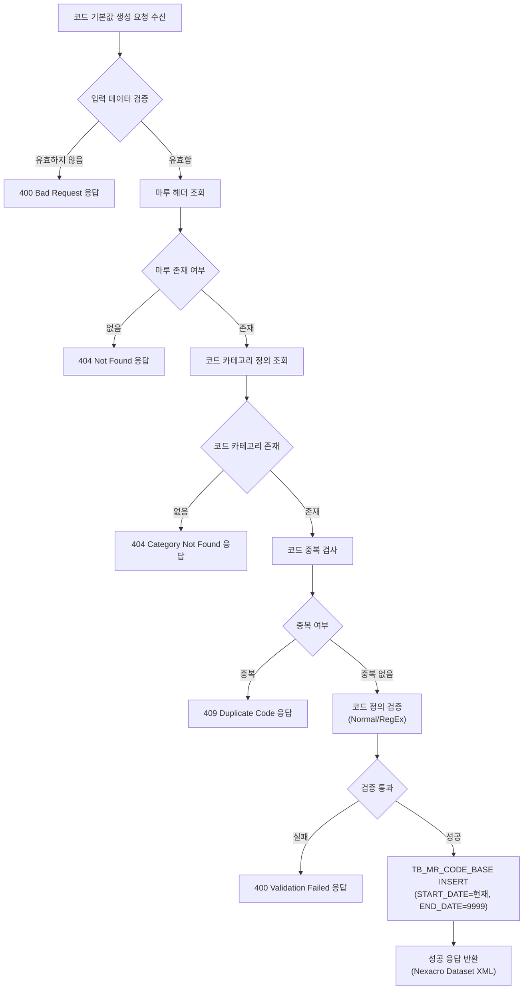
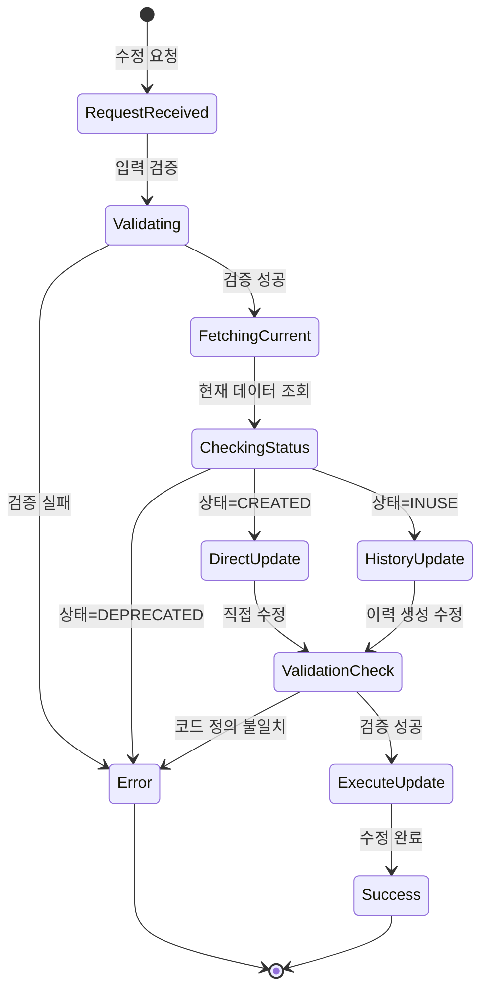

# 📄 Task-7-1.CD0200-Backend-API-구현 상세설계서

**Template Version:** 1.3.0 — **Last Updated:** 2025-10-04

---

## 0. 문서 메타데이터

* **문서명**: `Task-7-1.CD0200-Backend-API-구현(상세설계).md`
* **버전**: 1.0
* **작성일**: 2025-10-04
* **작성자**: Claude Code (AI Assistant)
* **참조 문서**:
  - `./docs/project/maru/00.foundation/01.project-charter/business-requirements.md`
  - `./docs/project/maru/00.foundation/02.design-baseline/3. api-design.md`
  - `./docs/project/maru/00.foundation/02.design-baseline/5. program-list.md`
  - `./docs/project/maru/00.foundation/02.design-baseline/2. database-design.md`
* **위치**: `./docs/project/maru/10.design/12.detail-design/`
* **관련 이슈/티켓**: Task 7.1
* **상위 요구사항 문서/ID**: BRD UC-003 코드 기본값 관리
* **요구사항 추적 담당자**: 프로젝트 매니저
* **추적성 관리 도구**: tasks.md (Markdown 체크리스트)

---

## 1. 목적 및 범위

### 1.1 목적
CD0200 코드기본값관리 화면의 Backend API를 구현하여 코드 기본값의 생성, 조회, 수정, 삭제(CRUD) 기능을 제공합니다.

### 1.2 범위

**포함**:
- 코드 기본값 CRUD API 구현 (CB001-CB005)
- 다국어 지원 (대체 코드명 1~5)
- 정렬 순서 관리 기능
- 선분 이력 모델 기반 버전 관리
- 코드 카테고리 정의와의 일치성 검증
- Swagger API 문서화
- Nexacro Dataset XML 응답 형식

**제외**:
- Frontend UI 구현 (Task 7.2)
- 복잡한 인증/권한 관리 (PoC 범위 제외)
- 실시간 동기화 기능
- 대용량 데이터 최적화 (PoC 범위)

---

## 2. 요구사항 & 승인 기준 (Acceptance Criteria)

### 2.1. 요구사항

**요구사항 원본 링크**: [BRD UC-003 코드 기본값 관리](./docs/project/maru/00.foundation/01.project-charter/business-requirements.md#uc-003-코드-기본값-관리)

**기능 요구사항**:

- **[REQ-001]** 코드 기본값 목록 조회: 특정 마루 ID에 속한 모든 코드 기본값을 조회할 수 있어야 한다.
- **[REQ-002]** 코드 기본값 상세 조회: 특정 코드의 상세 정보를 조회할 수 있어야 한다.
- **[REQ-003]** 코드 기본값 생성: 새로운 코드 기본값을 생성할 수 있어야 한다.
- **[REQ-004]** 코드 기본값 수정: 기존 코드 기본값을 수정할 수 있으며, 선분 이력 모델을 통해 변경 이력을 관리해야 한다.
- **[REQ-005]** 코드 기본값 삭제: 코드 기본값을 논리적으로 삭제(종료일시 설정)할 수 있어야 한다.
- **[REQ-006]** 다국어 지원: 대체 코드명 1~5를 통해 다국어를 지원해야 한다.
- **[REQ-007]** 정렬 순서 관리: SORT_ORDER 필드를 통해 코드 표시 순서를 관리할 수 있어야 한다.
- **[REQ-008]** 코드 정의 검증: 코드 카테고리 정의(Normal/RegEx)와 실제 코드값의 일치성을 검증해야 한다.

**비기능 요구사항**:

- **[NFR-001]** 성능: 코드 목록 조회 응답 시간 < 1초 (100건 이하)
- **[NFR-002]** 보안: SQL Injection 방지를 위한 Parameterized Query 사용
- **[NFR-003]** 가용성: API 응답률 95% 이상 (PoC)
- **[NFR-004]** 데이터 무결성: 선분 이력 모델을 통한 완전한 변경 이력 보존

**승인 기준**:

- [ ] 모든 API 엔드포인트(CB001-CB005)가 정상 동작
- [ ] Swagger 문서화 완료
- [ ] 선분 이력 모델 정상 동작 (START_DATE/END_DATE)
- [ ] 코드 정의 검증 로직 정상 동작
- [ ] Nexacro Dataset XML 형식 응답 정상 출력
- [ ] 단위 테스트 커버리지 80% 이상
- [ ] 통합 테스트 통과 (Frontend 연동 테스트)

### 2.2. 요구사항-설계 추적 매트릭스

| 요구사항 ID | 요구사항 설명 | 설계 섹션/아티팩트 | 테스트 케이스 ID | 상태 | 비고 |
|-------------|---------------|--------------------|------------------|------|------|
| REQ-001 | 코드 기본값 목록 조회 | §8.1 API CB001 | TC-API-001 | 초안 | |
| REQ-002 | 코드 기본값 상세 조회 | §8.2 API CB002 | TC-API-002 | 초안 | |
| REQ-003 | 코드 기본값 생성 | §8.3 API CB003 | TC-API-003 | 초안 | |
| REQ-004 | 코드 기본값 수정 | §8.4 API CB004 | TC-API-004 | 초안 | 선분 이력 포함 |
| REQ-005 | 코드 기본값 삭제 | §8.5 API CB005 | TC-API-005 | 초안 | 논리적 삭제 |
| REQ-006 | 다국어 지원 | §7 데이터 구조 | TC-FUNC-001 | 초안 | ALTER_CODE_NAME 1~5 |
| REQ-007 | 정렬 순서 관리 | §7 데이터 구조 | TC-FUNC-002 | 초안 | SORT_ORDER |
| REQ-008 | 코드 정의 검증 | §5.1 프로세스 단계 6 | TC-VAL-001 | 초안 | Normal/RegEx |
| NFR-001 | 성능 요구사항 | §11 성능 및 확장성 | TC-PERF-001 | 초안 | < 1초 |
| NFR-002 | 보안 요구사항 | §10 보안 고려 | TC-SEC-001 | 초안 | Parameterized Query |

---

## 3. 용어/가정/제약

### 3.1 용어 정의

- **마루(MARU)**: 마스터 코드 또는 룰의 집합 단위
- **코드 기본값(Code Base)**: 실제 사용되는 코드 데이터
- **선분 이력 모델**: START_DATE와 END_DATE를 사용한 시간 기반 버전 관리 방식
- **코드 카테고리(Code Category)**: 코드의 분류 및 검증 규칙 정의
- **Normal 타입**: 콤마(,)로 구분된 허용 값 목록 (예: "1,2,3,4,5")
- **RegEx 타입**: 정규식 패턴 검증 (예: "^[A-Z]{3}[0-9]{3}$")
- **Nexacro Dataset XML**: Nexacro N V24 Frontend와 통신하는 XML 응답 형식

### 3.2 가정(Assumptions)

- Oracle Database 연동이 정상적으로 구성되어 있음
- knex.js를 통한 Query Builder 사용
- 단일 관리자 사용 (PoC 단계)
- 코드 카테고리가 사전에 정의되어 있음

### 3.3 제약(Constraints)

- PoC 단계로 복잡한 인증/권한 관리 제외
- 동시 사용자 5명 이하 (PoC)
- 총 데이터 건수 10,000건 이하 (PoC)
- Nexacro Dataset XML 형식 필수 사용

---

## 4. 시스템/모듈 개요

### 4.1 역할 및 책임

**Backend API 서버**:
- RESTful API 엔드포인트 제공
- 비즈니스 로직 처리 (검증, 선분 이력 관리)
- Database 연동 및 트랜잭션 관리
- Nexacro Dataset XML 응답 생성

**Database (Oracle)**:
- 코드 기본값 데이터 영구 저장
- 선분 이력 데이터 관리
- 코드 카테고리와의 참조 무결성 보장

### 4.2 외부 의존성

- **Node.js** v20.x: 런타임 환경
- **Express** 5.x: 웹 프레임워크
- **knex.js**: SQL Query Builder
- **oracledb**: Oracle Database 드라이버
- **Joi**: 요청 데이터 검증
- **Swagger**: API 문서화

### 4.3 상호작용 개요

```
[Frontend (Nexacro)]
    ↓ HTTP Request (JSON)
[Express API Server]
    ↓ SQL Query (knex)
[Oracle Database (TB_MR_CODE_BASE)]
    ↓ Result Set
[Express API Server]
    ↓ HTTP Response (Nexacro Dataset XML)
[Frontend (Nexacro)]
```

---

## 5. 프로세스 흐름

### 5.1 프로세스 설명

**코드 기본값 생성 프로세스** [REQ-003]:

1. **요청 수신**: Frontend에서 코드 기본값 생성 요청 (JSON)
2. **입력 검증**: Joi 스키마를 통한 필수 필드 및 형식 검증
3. **마루 헤더 조회**: 해당 마루 ID의 현재 상태 확인 (CREATED/INUSE/DEPRECATED)
4. **코드 카테고리 조회**: 해당 마루의 코드 카테고리 정의 조회
5. **중복 검사**: 동일 마루 내 코드 중복 여부 확인
6. **코드 정의 검증** [REQ-008]: 코드 카테고리 타입(Normal/RegEx)에 따른 검증
   - Normal: 허용 값 목록에 포함되는지 확인
   - RegEx: 정규식 패턴 매칭 확인
7. **데이터 생성**: TB_MR_CODE_BASE에 새 레코드 삽입 (START_DATE=현재, END_DATE=9999-12-31)
8. **응답 반환**: 성공 결과를 Nexacro Dataset XML 형식으로 반환

**코드 기본값 수정 프로세스** [REQ-004]:

1. **요청 수신**: 코드 수정 요청 (마루 ID, 코드, 수정 데이터)
2. **입력 검증**: 수정 데이터 형식 검증
3. **현재 데이터 조회**: 수정 대상 코드의 최신 버전 조회 (END_DATE=9999-12-31)
4. **마루 상태 확인**:
   - CREATED: 직접 수정 허용
   - INUSE: 선분 이력 생성 (기존 종료 + 신규 생성)
   - DEPRECATED: 수정 불가 오류 반환
5. **코드 정의 검증**: 수정된 코드값이 카테고리 정의에 부합하는지 검증
6. **이력 처리**:
   - CREATED 상태: UPDATE 실행
   - INUSE 상태:
     - 기존 레코드 END_DATE를 현재 시각으로 UPDATE
     - 새 레코드 INSERT (VERSION+1, START_DATE=현재)
7. **응답 반환**: 수정 결과 및 새 버전 정보 반환

### 5.2. 프로세스 설계 개념도 (Mermaid)

#### 코드 기본값 생성 Flowchart



#### 코드 기본값 수정 State Diagram



---

## 6. UI 레이아웃 설계 (Text Art + SVG)

> **참고**: 본 Task는 Backend API 구현으로 UI 설계는 Task 7.2에서 진행됩니다.

---

## 7. 데이터/메시지 구조 (개념 수준)

### 7.1. 입력 데이터 구조

#### 코드 기본값 생성 요청 (JSON)
```json
{
  "code": "DEPT001",                    // 필수, 코드값, 20자 이내
  "codeName": "경영지원팀",              // 필수, 코드명, 100자 이내
  "sortOrder": 1,                       // 필수, 정렬 순서, 1~9999
  "useYn": "Y",                         // 선택, 사용 여부 (기본값: Y)
  "alterCodeName1": "Management Support Team",  // 선택, 대체 코드명 1 (영문)
  "alterCodeName2": "",                 // 선택, 대체 코드명 2
  "alterCodeName3": "",                 // 선택, 대체 코드명 3
  "alterCodeName4": "",                 // 선택, 대체 코드명 4
  "alterCodeName5": ""                  // 선택, 대체 코드명 5
}
```

#### 코드 기본값 수정 요청 (JSON)
```json
{
  "codeName": "경영지원팀 (수정)",        // 선택, 수정할 코드명
  "sortOrder": 2,                       // 선택, 수정할 정렬 순서
  "useYn": "N",                         // 선택, 수정할 사용 여부
  "alterCodeName1": "Management Team"   // 선택, 수정할 대체 코드명
}
```

### 7.2. 출력 데이터 구조

#### 코드 기본값 목록 조회 응답 (Nexacro Dataset XML)
```xml
<?xml version="1.0" encoding="UTF-8"?>
<Dataset>
  <ErrorCode>0</ErrorCode>
  <ErrorMsg></ErrorMsg>
  <SuccessRowCount>3</SuccessRowCount>

  <ColumnInfo>
    <Column id="CODE" type="STRING" size="20"/>
    <Column id="CODE_NAME" type="STRING" size="100"/>
    <Column id="SORT_ORDER" type="INT" size="4"/>
    <Column id="USE_YN" type="STRING" size="1"/>
    <Column id="ALTER_CODE_NAME1" type="STRING" size="100"/>
    <Column id="ALTER_CODE_NAME2" type="STRING" size="100"/>
    <Column id="START_DATE" type="STRING" size="14"/>
    <Column id="END_DATE" type="STRING" size="14"/>
    <Column id="VERSION" type="INT" size="4"/>
  </ColumnInfo>

  <Rows>
    <Row>
      <Col id="CODE">DEPT001</Col>
      <Col id="CODE_NAME">경영지원팀</Col>
      <Col id="SORT_ORDER">1</Col>
      <Col id="USE_YN">Y</Col>
      <Col id="ALTER_CODE_NAME1">Management Support Team</Col>
      <Col id="ALTER_CODE_NAME2"></Col>
      <Col id="START_DATE">20250101000000</Col>
      <Col id="END_DATE">99991231235959</Col>
      <Col id="VERSION">1</Col>
    </Row>
    <!-- 추가 행 -->
  </Rows>
</Dataset>
```

#### 코드 생성/수정/삭제 성공 응답 (Nexacro Dataset XML)
```xml
<?xml version="1.0" encoding="UTF-8"?>
<Dataset>
  <ErrorCode>0</ErrorCode>
  <ErrorMsg></ErrorMsg>
  <SuccessRowCount>1</SuccessRowCount>

  <ColumnInfo>
    <Column id="RESULT" type="STRING" size="10"/>
    <Column id="MESSAGE" type="STRING" size="200"/>
    <Column id="CODE" type="STRING" size="20"/>
    <Column id="VERSION" type="INT" size="4"/>
  </ColumnInfo>

  <Rows>
    <Row>
      <Col id="RESULT">SUCCESS</Col>
      <Col id="MESSAGE">코드 기본값이 정상적으로 생성되었습니다.</Col>
      <Col id="CODE">DEPT001</Col>
      <Col id="VERSION">1</Col>
    </Row>
  </Rows>
</Dataset>
```

### 7.3. 시스템간 I/F 데이터 구조

#### Database 테이블 (TB_MR_CODE_BASE)
```sql
CREATE TABLE TB_MR_CODE_BASE (
  MARU_ID         VARCHAR2(20)  NOT NULL,  -- 마루 ID
  CODE            VARCHAR2(20)  NOT NULL,  -- 코드값
  VERSION         NUMBER(10)    NOT NULL,  -- 버전
  CODE_NAME       VARCHAR2(100) NOT NULL,  -- 코드명
  SORT_ORDER      NUMBER(10)    NOT NULL,  -- 정렬 순서
  USE_YN          CHAR(1)       DEFAULT 'Y' NOT NULL,  -- 사용 여부
  ALTER_CODE_NAME1 VARCHAR2(100),          -- 대체 코드명 1
  ALTER_CODE_NAME2 VARCHAR2(100),          -- 대체 코드명 2
  ALTER_CODE_NAME3 VARCHAR2(100),          -- 대체 코드명 3
  ALTER_CODE_NAME4 VARCHAR2(100),          -- 대체 코드명 4
  ALTER_CODE_NAME5 VARCHAR2(100),          -- 대체 코드명 5
  START_DATE      VARCHAR2(14)  NOT NULL,  -- 시작일시 (YYYYMMDDHHMMSS)
  END_DATE        VARCHAR2(14)  NOT NULL,  -- 종료일시 (YYYYMMDDHHMMSS)
  CREATE_DATE     VARCHAR2(14)  NOT NULL,  -- 생성일시
  CREATE_USER     VARCHAR2(50),            -- 생성자
  UPDATE_DATE     VARCHAR2(14),            -- 수정일시
  UPDATE_USER     VARCHAR2(50),            -- 수정자
  PRIMARY KEY (MARU_ID, CODE, VERSION)
);
```

---

## 8. 인터페이스 계약(Contract)

### 8.1. API CB001: 코드 기본값 목록 조회 [REQ-001]

**엔드포인트**: `GET /api/v1/maru-headers/{maruId}/codes`

**경로 파라미터**:
- `maruId` (string, 필수): 마루 고유 식별자

**쿼리 파라미터**:
- `version` (number, 선택): 특정 버전 조회 (기본값: 최신 버전)
- `asOfDate` (string, 선택): 특정 시점 조회 (ISO 8601 형식, 예: 2025-01-01T00:00:00Z)
- `useYn` (string, 선택): 사용 여부 필터 (Y/N)
- `sort` (string, 선택): 정렬 기준 (sortOrder/code/codeName, 기본값: sortOrder)
- `order` (string, 선택): 정렬 방향 (asc/desc, 기본값: asc)

**성공 응답 (200 OK)**:
- Content-Type: `text/xml; charset=utf-8`
- Body: Nexacro Dataset XML (§7.2 참조)
- ErrorCode: 0
- SuccessRowCount: 조회된 행 개수

**오류 응답**:
- **404 Not Found**: 마루 ID가 존재하지 않음
  ```xml
  <Dataset>
    <ErrorCode>-1</ErrorCode>
    <ErrorMsg>해당 마루를 찾을 수 없습니다.</ErrorMsg>
    <SuccessRowCount>0</SuccessRowCount>
  </Dataset>
  ```
- **500 Internal Server Error**: 서버 내부 오류
  ```xml
  <Dataset>
    <ErrorCode>-200</ErrorCode>
    <ErrorMsg>시스템 오류가 발생했습니다.</ErrorMsg>
    <SuccessRowCount>0</SuccessRowCount>
  </Dataset>
  ```

**검증 케이스**:
- TC-API-001-1: 정상 목록 조회 (기본 정렬)
- TC-API-001-2: 특정 버전 조회
- TC-API-001-3: 특정 시점 조회 (asOfDate)
- TC-API-001-4: 사용 여부 필터링 (useYn=Y)
- TC-API-001-5: 정렬 옵션 테스트 (code asc/desc)

**Swagger 주소**: `http://localhost:3000/api-docs/#/Code%20Base/get_api_v1_maru_headers__maruId__codes`

---

### 8.2. API CB002: 코드 기본값 상세 조회 [REQ-002]

**엔드포인트**: `GET /api/v1/maru-headers/{maruId}/codes/{code}`

**경로 파라미터**:
- `maruId` (string, 필수): 마루 고유 식별자
- `code` (string, 필수): 조회할 코드값

**쿼리 파라미터**:
- `version` (number, 선택): 특정 버전 조회 (기본값: 최신)
- `asOfDate` (string, 선택): 특정 시점 조회 (ISO 8601)

**성공 응답 (200 OK)**:
- Content-Type: `text/xml; charset=utf-8`
- Body: 단일 코드 정보 (Nexacro Dataset XML)

**오류 응답**:
- **404 Not Found**: 코드가 존재하지 않음

**검증 케이스**:
- TC-API-002-1: 최신 버전 조회
- TC-API-002-2: 특정 버전 조회
- TC-API-002-3: 존재하지 않는 코드 조회 (404)

**Swagger 주소**: `http://localhost:3000/api-docs/#/Code%20Base/get_api_v1_maru_headers__maruId__codes__code_`

---

### 8.3. API CB003: 코드 기본값 생성 [REQ-003]

**엔드포인트**: `POST /api/v1/maru-headers/{maruId}/codes`

**경로 파라미터**:
- `maruId` (string, 필수): 마루 고유 식별자

**요청 본문 (JSON)**:
```json
{
  "code": "DEPT001",
  "codeName": "경영지원팀",
  "sortOrder": 1,
  "useYn": "Y",
  "alterCodeName1": "Management Support Team"
}
```

**검증 규칙**:
- `code`: 필수, 1~20자, 영숫자 및 언더스코어(_)만 허용
- `codeName`: 필수, 1~100자
- `sortOrder`: 필수, 1~9999 범위
- `useYn`: 선택, 'Y' 또는 'N' (기본값: 'Y')
- `alterCodeName1~5`: 선택, 각 100자 이내

**성공 응답 (201 Created)**:
- Body: 생성 결과 (§7.2 성공 응답 참조)
- ErrorCode: 0
- MESSAGE: "코드 기본값이 정상적으로 생성되었습니다."

**오류 응답**:
- **400 Bad Request**: 입력 검증 실패
- **404 Not Found**: 마루 또는 코드 카테고리 미존재
- **409 Conflict**: 중복 코드
- **422 Unprocessable Entity**: 코드 정의 검증 실패 (Normal/RegEx)

**검증 케이스**:
- TC-API-003-1: 정상 코드 생성
- TC-API-003-2: 필수 필드 누락 (400)
- TC-API-003-3: 중복 코드 생성 시도 (409)
- TC-API-003-4: Normal 타입 검증 실패 (422)
- TC-API-003-5: RegEx 타입 검증 실패 (422)

**Swagger 주소**: `http://localhost:3000/api-docs/#/Code%20Base/post_api_v1_maru_headers__maruId__codes`

---

### 8.4. API CB004: 코드 기본값 수정 [REQ-004]

**엔드포인트**: `PUT /api/v1/maru-headers/{maruId}/codes/{code}`

**경로 파라미터**:
- `maruId` (string, 필수): 마루 고유 식별자
- `code` (string, 필수): 수정할 코드값

**요청 본문 (JSON)**:
```json
{
  "codeName": "경영지원팀 (수정)",
  "sortOrder": 2,
  "useYn": "N",
  "alterCodeName1": "Management Team"
}
```

**선분 이력 처리 로직**:
1. **CREATED 상태**: 직접 UPDATE 실행
2. **INUSE 상태**:
   - 기존 레코드 END_DATE를 현재 시각으로 UPDATE
   - 새 레코드 INSERT (VERSION+1, START_DATE=현재, END_DATE=9999-12-31)
3. **DEPRECATED 상태**: 403 Forbidden 반환

**성공 응답 (200 OK)**:
- Body: 수정 결과 및 새 버전 정보
- MESSAGE: "코드 기본값이 정상적으로 수정되었습니다."
- VERSION: 업데이트된 버전 번호

**오류 응답**:
- **403 Forbidden**: DEPRECATED 상태 수정 시도
- **404 Not Found**: 코드 미존재
- **422 Unprocessable Entity**: 코드 정의 검증 실패

**검증 케이스**:
- TC-API-004-1: CREATED 상태 직접 수정
- TC-API-004-2: INUSE 상태 이력 생성 수정
- TC-API-004-3: DEPRECATED 상태 수정 거부 (403)
- TC-API-004-4: 버전 증가 확인

**Swagger 주소**: `http://localhost:3000/api-docs/#/Code%20Base/put_api_v1_maru_headers__maruId__codes__code_`

---

### 8.5. API CB005: 코드 기본값 삭제 [REQ-005]

**엔드포인트**: `DELETE /api/v1/maru-headers/{maruId}/codes/{code}`

**경로 파라미터**:
- `maruId` (string, 필수): 마루 고유 식별자
- `code` (string, 필수): 삭제할 코드값

**삭제 방식**: 논리적 삭제 (END_DATE를 현재 시각으로 UPDATE)

**성공 응답 (200 OK)**:
- MESSAGE: "코드 기본값이 정상적으로 삭제되었습니다."

**오류 응답**:
- **404 Not Found**: 코드 미존재
- **409 Conflict**: 다른 데이터에서 참조 중인 코드 (외래키 제약)

**검증 케이스**:
- TC-API-005-1: 정상 삭제 (END_DATE 업데이트)
- TC-API-005-2: 존재하지 않는 코드 삭제 (404)
- TC-API-005-3: 참조 중인 코드 삭제 시도 (409)

**Swagger 주소**: `http://localhost:3000/api-docs/#/Code%20Base/delete_api_v1_maru_headers__maruId__codes__code_`

---

## 9. 오류/예외/경계조건

### 9.1. 예상 오류 상황 및 처리 방안

| 오류 상황 | 원인 | 처리 방안 | HTTP 상태 | ErrorCode |
|-----------|------|-----------|-----------|-----------|
| 필수 필드 누락 | 요청 데이터 불완전 | Joi 검증으로 사전 차단, 상세 오류 메시지 반환 | 400 | -400 |
| 코드 중복 | 동일 마루 내 동일 코드 존재 | DB Unique 제약 + 사전 검증, "이미 존재하는 코드입니다" 메시지 | 409 | -100 |
| 마루 미존재 | 잘못된 마루 ID | 사전 마루 존재 여부 확인, "해당 마루를 찾을 수 없습니다" 메시지 | 404 | -1 |
| 코드 정의 불일치 | Normal/RegEx 검증 실패 | 코드 카테고리 정의 조회 후 검증, 상세 검증 오류 메시지 | 422 | -100 |
| DEPRECATED 수정 시도 | 폐기된 마루 수정 | 마루 상태 확인 후 거부, "폐기된 마루는 수정할 수 없습니다" 메시지 | 403 | -300 |
| DB 연결 실패 | 네트워크/DB 오류 | try-catch로 포착, 일반 오류 메시지 반환, 서버 로그 기록 | 500 | -200 |
| SQL Injection 시도 | 악의적인 입력 | Parameterized Query 사용, 입력 검증으로 차단 | 400 | -400 |

### 9.2. 복구 전략 및 사용자 메시지

**복구 전략**:
- **Transactional Rollback**: 모든 DB 작업을 트랜잭션으로 처리, 오류 시 자동 롤백
- **Graceful Degradation**: DB 연결 실패 시 캐시된 데이터 반환 (조회 API만 해당)
- **Retry Logic**: 일시적 DB 오류 시 최대 3회 재시도 (지수 백오프)
- **Circuit Breaker**: 연속 5회 실패 시 DB 연결 차단, 1분 후 재시도

**사용자 메시지 가이드라인**:
- **명확성**: 오류 원인을 명확히 전달 (예: "코드 DEPT001이 이미 존재합니다")
- **실행 가능성**: 해결 방법 제시 (예: "다른 코드를 사용하거나 기존 코드를 수정하세요")
- **친절함**: 기술 용어 최소화, 사용자 친화적 표현 사용

---

## 10. 보안/품질 고려

### 10.1 보안 고려사항

**입력 검증** [NFR-002]:
- Joi 스키마를 통한 모든 입력 데이터 검증
- SQL Injection 방지를 위한 Parameterized Query 사용 (knex.js)
- XSS 방지를 위한 입력값 이스케이프 처리

**인증/인가** (PoC 제외):
- 향후 JWT 기반 인증 적용 예정
- 역할 기반 접근 제어 (RBAC) 적용 예정

**데이터 보안**:
- 민감 데이터 암호화 (향후)
- 로그에 민감 정보 노출 방지
- HTTPS 통신 강제 (프로덕션)

### 10.2 품질 고려사항

**코드 품질**:
- ESLint를 통한 코드 스타일 일관성 유지
- 함수 복잡도(Cyclomatic Complexity) < 10 유지
- 단위 테스트 커버리지 80% 이상

**로깅 및 모니터링**:
- 구조화된 로그 형식 (JSON) 사용
- 요청/응답 로그 기록 (성능 분석)
- 에러 발생 시 스택 트레이스 기록

**국제화(i18n) 고려** [REQ-006]:
- 다국어 지원을 위한 ALTER_CODE_NAME 1~5 활용
- 향후 i18next 라이브러리 도입 검토

---

## 11. 성능 및 확장성

### 11.1 목표/지표 [NFR-001]

- **응답 시간**: 코드 목록 조회 < 1초 (100건 이하)
- **처리량**: 초당 50건 이상 처리 (PoC 기준)
- **동시 사용자**: 5명 (PoC), 향후 100명까지 확장

### 11.2 병목 예상 지점과 완화 전략

**병목 지점**:
1. **DB 조회 성능**: 복잡한 JOIN 및 선분 이력 조회
2. **XML 변환 오버헤드**: JSON → XML 변환 시간
3. **코드 정의 검증**: RegEx 패턴 매칭 성능

**완화 전략**:
- **인덱싱**: (MARU_ID, END_DATE, START_DATE, CODE) 복합 인덱스 생성
- **캐싱**: node-cache를 활용한 코드 카테고리 정의 캐싱 (TTL: 5분)
- **쿼리 최적화**: knex.js를 통한 효율적인 쿼리 생성
- **XML 생성 최적화**: 템플릿 리터럴 대신 빌더 패턴 사용

### 11.3 부하/장애 시나리오 대응

**부하 시나리오**:
- **동시 다발적 조회**: Connection Pool 크기 조정 (max: 20)
- **대용량 데이터 조회**: 페이징 강제 적용 (최대 100건)

**장애 시나리오**:
- **DB 연결 실패**: Circuit Breaker 패턴 적용, 캐시 데이터 반환
- **API 서버 다운**: 헬스체크 엔드포인트 제공 (/health)

---

## 12. 테스트 전략 (TDD 계획)

### 12.1 실패 테스트 시나리오

**단위 테스트**:
- **TC-UNIT-001**: 유효하지 않은 입력 데이터 → Joi 검증 실패
- **TC-UNIT-002**: 중복 코드 생성 시도 → 409 Conflict 반환
- **TC-UNIT-003**: Normal 타입 코드 정의 검증 실패 → 422 반환
- **TC-UNIT-004**: RegEx 타입 코드 정의 검증 실패 → 422 반환
- **TC-UNIT-005**: DEPRECATED 상태 수정 시도 → 403 Forbidden 반환

**통합 테스트**:
- **TC-INT-001**: 코드 생성 → 조회 → 수정 → 삭제 전체 플로우
- **TC-INT-002**: 선분 이력 생성 확인 (INUSE 상태 수정)
- **TC-INT-003**: Frontend (Nexacro) 연동 테스트

### 12.2 최소 구현 전략

1. **Red**: 실패 테스트 작성
2. **Green**: 최소 코드로 테스트 통과
3. **Refactor**: 코드 품질 개선

**구현 순서**:
1. 코드 목록 조회 API (CB001) - 가장 단순
2. 코드 상세 조회 API (CB002)
3. 코드 생성 API (CB003) - 검증 로직 포함
4. 코드 수정 API (CB004) - 선분 이력 로직 포함
5. 코드 삭제 API (CB005) - 논리적 삭제

### 12.3 리팩터링 포인트

- **공통 로직 추출**: Nexacro XML 생성 헬퍼 함수
- **검증 로직 모듈화**: 코드 정의 검증 함수 분리
- **선분 이력 유틸리티**: 이력 생성/조회 공통 함수
- **에러 핸들링**: 중앙 집중식 에러 미들웨어

---

## 13. 배포 및 운영 계획

### 13.1 배포 전 체크리스트

- [ ] 모든 단위 테스트 통과 (커버리지 80% 이상)
- [ ] 통합 테스트 통과 (Frontend 연동 확인)
- [ ] Swagger 문서 최신화
- [ ] 환경 변수 설정 (.env 파일 검증)
- [ ] 데이터베이스 마이그레이션 실행
- [ ] 로그 레벨 설정 (프로덕션: info, 개발: debug)

### 13.2 모니터링 및 알림

**헬스체크 엔드포인트**:
- `GET /health`: API 서버 상태 확인
- `GET /health/db`: Database 연결 상태 확인

**모니터링 지표**:
- API 응답 시간 (평균/P95/P99)
- 에러 발생률 (5xx 응답 비율)
- DB 연결 풀 사용률
- 메모리 사용량

**알림 조건**:
- 5분간 에러율 10% 이상
- 응답 시간 P95 > 3초
- DB 연결 실패 3회 연속

---

**승인**

| 역할 | 이름 | 서명 | 날짜 |
|------|------|------|------|
| 프로젝트 매니저 | | | |
| 시스템 아키텍트 | | | |
| 백엔드 개발자 | | | |
| QA 엔지니어 | | | |
