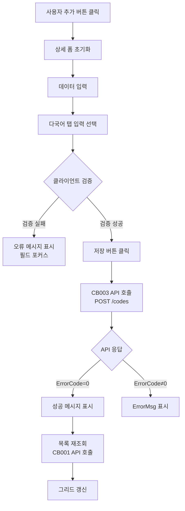
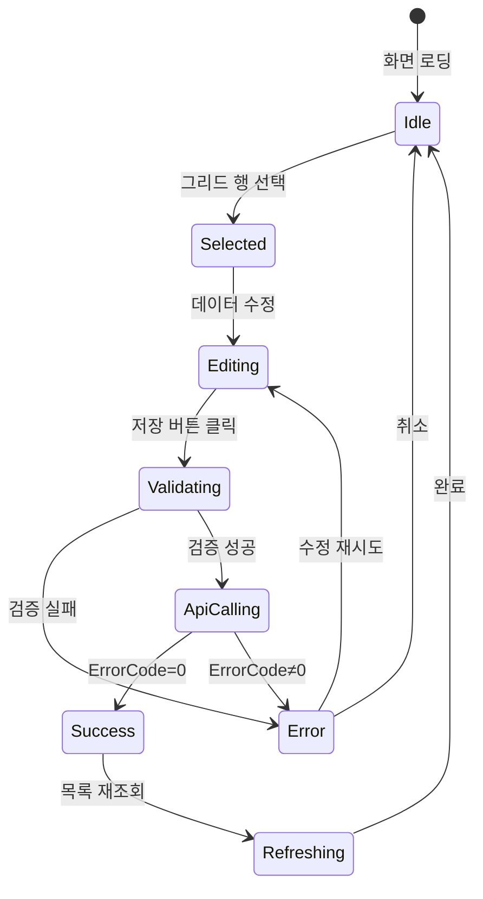
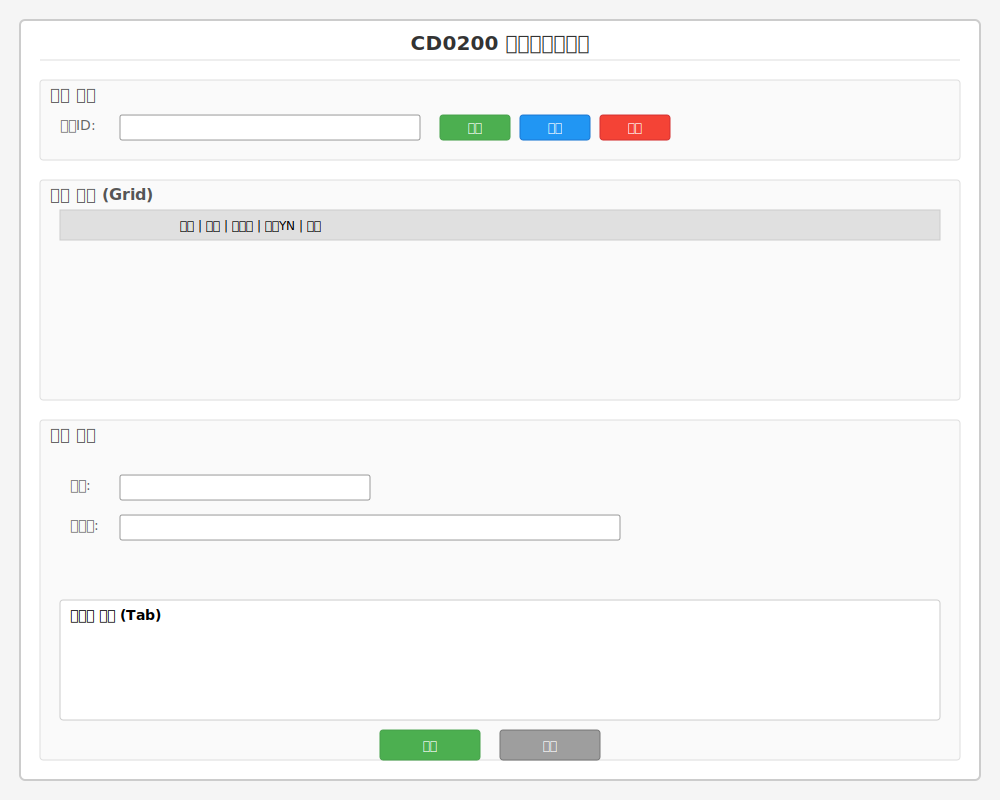

# 📄 Task-7-2.CD0200-Frontend-UI-구현 상세설계서

**Template Version:** 1.3.0 — **Last Updated:** 2025-10-06
**Document Version:** 2.0 (기존 설계 무시, 신규 작성)

---

## 0. 문서 메타데이터

* **문서명**: `Task-7-2.CD0200-Frontend-UI-구현(상세설계).md`
* **버전**: 2.0
* **작성일**: 2025-10-06
* **작성자**: Claude Code (AI Assistant)
* **참조 문서**:
  - `./docs/project/maru/00.foundation/01.project-charter/business-requirements.md`
  - `./docs/project/maru/10.design/12.detail-design/Task-7-1.CD0200-Backend-API-구현(상세설계).md`
  - `./docs/project/maru/00.foundation/02.design-baseline/4. ui-design.md`
  - `./docs/project/maru/00.foundation/02.design-baseline/5. program-list.md`
* **위치**: `./docs/project/maru/10.design/12.detail-design/`
* **관련 이슈/티켓**: Task 7.2
* **상위 요구사항 문서/ID**: BRD UC-003 코드 기본값 관리
* **요구사항 추적 담당자**: 프로젝트 매니저
* **추적성 관리 도구**: tasks.md (Markdown 체크리스트)

---

## 1. 목적 및 범위

### 1.1 목적
CD0200 코드기본값관리 화면의 Nexacro N V24 기반 Frontend UI를 구현하여 사용자가 직관적으로 코드 기본값을 관리할 수 있도록 합니다.

### 1.2 범위

**포함**:
- Nexacro Form 구현 (CD0200.xfdl)
- Dataset 구조 정의 및 바인딩
- Backend API 연동 (Task 7.1 API 사용)
- 사용자 인터랙션 처리 (조회/추가/수정/삭제)
- 다국어 입력 UI (대체 코드명 1~5)
- 정렬 순서 관리 UI
- 입력 검증 및 오류 메시지 표시
- Nexacro Dataset XML 형식 통신

**제외**:
- Backend API 구현 (Task 7.1에서 완료)
- 복잡한 인증/권한 UI (PoC 범위)
- 드래그앤드롭 정렬 (PoC v1 제외, 향후 추가)
- 모바일 반응형 UI (Desktop 중심)

---

## 2. 요구사항 & 승인 기준 (Acceptance Criteria)

### 2.1. 요구사항

**요구사항 원본 링크**: [BRD UC-003 코드 기본값 관리](./docs/project/maru/00.foundation/01.project-charter/business-requirements.md#uc-003-코드-기본값-관리)

**기능 요구사항**:

- **[UI-REQ-001]** 코드 목록 조회: 특정 마루 ID에 속한 코드 목록을 그리드로 표시해야 한다.
- **[UI-REQ-002]** 코드 상세 조회: 그리드에서 선택한 코드의 상세 정보를 하단 폼에 표시해야 한다.
- **[UI-REQ-003]** 코드 생성: 새로운 코드 기본값을 입력하고 저장할 수 있어야 한다.
- **[UI-REQ-004]** 코드 수정: 기존 코드 기본값을 수정하고 저장할 수 있어야 한다.
- **[UI-REQ-005]** 코드 삭제: 선택한 코드를 삭제할 수 있어야 하며 확인 메시지를 표시해야 한다.
- **[UI-REQ-006]** 다국어 지원: 대체 코드명 1~5를 탭 형태로 입력할 수 있어야 한다.
- **[UI-REQ-007]** 정렬 순서 관리: SORT_ORDER 필드를 통해 코드 표시 순서를 지정할 수 있어야 한다.
- **[UI-REQ-008]** 입력 검증: 필수 필드 누락 시 오류 메시지를 표시하고 저장을 차단해야 한다.
- **[UI-REQ-009]** Backend API 연동: Task 7.1의 CB001-CB005 API를 호출하여 데이터를 처리해야 한다.

**비기능 요구사항**:

- **[UI-NFR-001]** 성능: 초기 화면 로딩 시간 < 2초 (100건 이하)
- **[UI-NFR-002]** 사용성: 사용자 입력 응답 시간 < 200ms
- **[UI-NFR-003]** 접근성: Tab 키 순서가 논리적이고 Enter/Esc 단축키 지원
- **[UI-NFR-004]** 호환성: Nexacro N V24 표준 준수

**승인 기준**:

- [ ] 모든 기능 요구사항(UI-REQ-001~009) 정상 동작
- [ ] Backend API(CB001-CB005) 정상 연동
- [ ] 입력 검증 및 오류 처리 정상 동작
- [ ] UI 테스트케이스 모두 통과
- [ ] 코드 리뷰 완료 및 승인

### 2.2. 요구사항-설계 추적 매트릭스

| 요구사항 ID | 요구사항 설명 | 설계 섹션/아티팩트 | 테스트 케이스 ID | 상태 | 비고 |
|-------------|---------------|--------------------|------------------|------|------|
| UI-REQ-001 | 코드 목록 조회 | §6 UI 설계 (Grid) | TC-UI-001 | 초안 | |
| UI-REQ-002 | 코드 상세 조회 | §6 UI 설계 (상세 폼) | TC-UI-002 | 초안 | |
| UI-REQ-003 | 코드 생성 | §5.1, §8.3 | TC-UI-003 | 초안 | |
| UI-REQ-004 | 코드 수정 | §5.2, §8.4 | TC-UI-004 | 초안 | |
| UI-REQ-005 | 코드 삭제 | §5.3, §8.5 | TC-UI-005 | 초안 | |
| UI-REQ-006 | 다국어 지원 | §6 UI 설계 (Tab) | TC-UI-006 | 초안 | |
| UI-REQ-007 | 정렬 순서 관리 | §6 UI 설계 (입력 폼) | TC-UI-007 | 초안 | |
| UI-REQ-008 | 입력 검증 | §9 오류 처리 | TC-UI-008 | 초안 | |
| UI-REQ-009 | Backend API 연동 | §8 인터페이스 계약 | TC-INT-001 | 초안 | |
| UI-NFR-001 | 성능 요구사항 | §11 성능 | TC-PERF-001 | 초안 | |
| UI-NFR-003 | 접근성 | §6.3 접근성 가이드 | TC-A11Y-001 | 초안 | |

---

## 3. 용어/가정/제약

### 3.1 용어 정의

- **Nexacro Form**: Nexacro N V24에서 화면을 구성하는 기본 단위 (.xfdl 파일)
- **Dataset**: Nexacro의 데이터 컨테이너 객체, Backend와 데이터 교환에 사용
- **Grid**: 테이블 형식으로 데이터를 표시하는 Nexacro 컴포넌트
- **Tab**: 다국어 입력을 위한 탭 컨테이너 컴포넌트
- **Transaction**: Nexacro에서 Backend API 호출 단위
- **대체 코드명**: 다국어 지원을 위한 추가 코드 설명 (ALTER_CODE_NAME1~5)

### 3.2 가정(Assumptions)

- Nexacro N V24 개발 환경이 정상적으로 구성되어 있음
- Task 7.1 Backend API가 정상 동작함
- Backend API는 Nexacro Dataset XML 형식 응답 제공
- 사용자는 Desktop 환경에서 사용 (최소 1024px 이상)

### 3.3 제약(Constraints)

- PoC 단계로 복잡한 UI/UX 기능 제외
- Desktop 전용 (모바일/태블릿 미지원)
- 드래그앤드롭 정렬 제외 (수동 입력)
- 페이징 미구현 (전체 데이터 로딩)

---

## 4. 시스템/모듈 개요

### 4.1 역할 및 책임

**Nexacro Frontend (CD0200.xfdl)**:
- 사용자 인터페이스 제공
- 사용자 입력 수집 및 검증
- Backend API 호출 및 응답 처리
- 데이터 표시 및 상태 관리

**Dataset**:
- 서버와 클라이언트 간 데이터 전달 매개체
- 데이터 바인딩 및 상태 관리 (추가/수정/삭제)

**Transaction**:
- HTTP 통신 처리
- XML 데이터 변환 및 전송

### 4.2 외부 의존성

- **Nexacro Runtime**: Nexacro N V24
- **Backend API**: Task 7.1 (CB001-CB005)
- **Nexacro 표준 컴포넌트**: Grid, Edit, Button, Tab, Div, Static

### 4.3 상호작용 개요

```
[사용자]
    ↓ UI 인터랙션
[CD0200.xfdl (Form)]
    ↓ Event Handler
[Dataset (ds_codeList, ds_codeDetail)]
    ↓ Transaction
[Backend API (CB001-CB005)]
    ↓ Nexacro Dataset XML
[Dataset 업데이트]
    ↓ Data Binding
[UI 자동 갱신]
```

---

## 5. 프로세스 흐름

### 5.1 코드 생성 프로세스 [UI-REQ-003]

1. **사용자 "추가" 버튼 클릭**
2. **상세 폼 초기화**: 모든 입력 필드를 공백으로 설정
3. **데이터 입력**: 코드, 코드명, 정렬순서, 사용여부 입력
4. **다국어 탭 입력** (선택): 대체 코드명 1~5 입력
5. **클라이언트 검증**:
   - 필수 필드 (코드, 코드명, 정렬순서) 존재 확인
   - 정렬순서가 숫자인지 확인
   - 사용여부가 Y/N인지 확인
6. **"저장" 버튼 클릭**
7. **Backend API 호출**: `POST /api/v1/maru-headers/{maruId}/codes` (CB003)
8. **응답 처리**:
   - 성공 (ErrorCode=0): "코드가 생성되었습니다" 메시지 표시 → 목록 재조회
   - 실패 (ErrorCode≠0): ErrorMsg 내용을 alert로 표시
9. **그리드 갱신**: 새로 생성된 코드가 목록에 표시됨

### 5.2 코드 수정 프로세스 [UI-REQ-004]

1. **그리드에서 코드 행 선택**
2. **상세 폼에 데이터 로드**: Dataset 바인딩으로 자동 표시
3. **데이터 수정**: 코드명, 정렬순서, 사용여부, 대체 코드명 등 변경
4. **클라이언트 검증**: 생성 프로세스와 동일한 검증 수행
5. **"저장" 버튼 클릭**
6. **Backend API 호출**: `PUT /api/v1/maru-headers/{maruId}/codes/{code}` (CB004)
7. **응답 처리**:
   - 성공: "코드가 수정되었습니다 (버전: {VERSION})" 메시지 표시 → 목록 재조회
   - 실패: ErrorMsg 표시
8. **그리드 갱신**: 수정된 데이터 반영

### 5.3 코드 삭제 프로세스 [UI-REQ-005]

1. **그리드에서 코드 행 선택**
2. **"삭제" 버튼 클릭**
3. **확인 메시지**: "선택한 코드({CODE})를 삭제하시겠습니까?" confirm 표시
4. **사용자 확인** (예/아니오)
5. **Backend API 호출**: `DELETE /api/v1/maru-headers/{maruId}/codes/{code}` (CB005)
6. **응답 처리**:
   - 성공: "코드가 삭제되었습니다" 메시지 표시 → 목록 재조회
   - 실패: ErrorMsg 표시
7. **그리드 갱신**: 삭제된 코드가 목록에서 제거됨

### 5.4. 프로세스 설계 개념도 (Mermaid)

#### 코드 생성 Flowchart



#### 코드 수정 State Diagram



---

## 6. UI 레이아웃 설계 (Text Art + SVG)

### 6.1. UI 설계 (Text Art)

```
┌──────────────────────────────────────────────────────────────────┐
│                     CD0200 코드기본값관리                        │
├──────────────────────────────────────────────────────────────────┤
│ 📋 검색 조건                                                      │
│ ┌────────────────────────────────────────────────────────────┐  │
│ │ 마루ID: [____________________] [조회] [신규] [삭제]        │  │
│ └────────────────────────────────────────────────────────────┘  │
├──────────────────────────────────────────────────────────────────┤
│ 📊 코드 목록                                                      │
│ ┌────────────────────────────────────────────────────────────┐  │
│ │ ┌──────┬────────────┬──────┬────────┬────────┬──────┐    │  │
│ │ │ 선택 │    코드    │ 순서 │ 코드명 │ 사용YN │ 버전 │    │  │
│ │ ├──────┼────────────┼──────┼────────┼────────┼──────┤    │  │
│ │ │  ○  │ DEPT001    │  1   │ 경영팀 │   Y    │  1   │    │  │
│ │ │  ○  │ DEPT002    │  2   │ 개발팀 │   Y    │  1   │    │  │
│ │ │  ○  │ DEPT003    │  3   │ 인사팀 │   Y    │  2   │    │  │
│ │ └──────┴────────────┴──────┴────────┴────────┴──────┘    │  │
│ └────────────────────────────────────────────────────────────┘  │
├──────────────────────────────────────────────────────────────────┤
│ 📝 상세 정보                                                      │
│ ┌────────────────────────────────────────────────────────────┐  │
│ │ 기본 정보                                                   │  │
│ │ 코드: [____________________]    순서: [_____]              │  │
│ │ 코드명: [__________________________________________]        │  │
│ │ 사용여부: (●)Y (○)N                                        │  │
│ │                                                             │  │
│ │ ┌─ 다국어 정보 ────────────────────────────────────────┐  │  │
│ │ │ [한국어] [영문] [일본어] [중국어] [기타]              │  │  │
│ │ │ ┌───────────────────────────────────────────────┐   │  │  │
│ │ │ │ 대체코드명: [________________________________] │   │  │  │
│ │ │ │ (선택한 탭에 따라 ALTER_CODE_NAME1~5 매핑)   │   │  │  │
│ │ │ └───────────────────────────────────────────────┘   │  │  │
│ │ └───────────────────────────────────────────────────────┘  │  │
│ │                                                             │  │
│ │                        [저장] [취소]                        │  │
│ └────────────────────────────────────────────────────────────┘  │
└──────────────────────────────────────────────────────────────────┘
```

### 6.2. UI 설계 (SVG) **[필수 생성]**



> **SVG 파일 생성 체크리스트**:
> - [x] 모든 UI 컴포넌트 식별 가능하게 라벨링
> - [x] 사용자 상호작용 포인트 표시 (버튼, 입력필드, 탭)
> - [x] 테스트 자동화를 위한 요소 식별자 개념 포함
> - [x] 주요 UI 흐름 표시 (검색→목록→상세)
> - [x] 접근성 고려사항 (Tab 순서) 표시

### 6.3. 반응형/접근성/상호작용 가이드

**반응형**:
- PoC 단계로 Desktop 전용 (최소 1024px)
- 향후: Tablet(768px) 시 2단 레이아웃, Mobile(375px) 시 단일 컬럼

**접근성**:
- **포커스 순서**: 마루ID 입력 → 조회 버튼 → 신규 버튼 → 삭제 버튼 → 그리드 → 상세 폼 (코드 → 코드명 → 순서 → 사용여부 → 탭 → 대체코드명 → 저장 → 취소)
- **키보드 단축키**:
  - Enter: 저장 실행
  - Esc: 취소 (폼 초기화)
  - F5: 조회 새로고침
  - Ctrl+N: 신규 추가
- **스크린리더**: 모든 입력 필드에 label 연결, 오류 메시지 aria-live 영역 사용

**상호작용**:
1. **마루ID 입력 → 조회**: 목록 그리드 데이터 로딩
2. **그리드 행 선택**: 상세 폼에 데이터 자동 바인딩
3. **신규 버튼**: 상세 폼 초기화, 코드 입력 필드 포커스
4. **다국어 탭 클릭**: 해당 탭의 대체 코드명 입력 필드 표시
5. **저장**: 검증 → API 호출 → 성공/실패 메시지 → 목록 재조회
6. **삭제**: 확인 메시지 → API 호출 → 목록 재조회

---

## 7. 데이터/메시지 구조 (개념 수준)

### 7.1. 입력 데이터 구조

#### Dataset: ds_search (검색 조건)
```xml
<ColumnInfo>
  <Column id="MARU_ID" type="STRING" size="20"/>
</ColumnInfo>
```

#### Dataset: ds_codeDetail (상세 입력)
```xml
<ColumnInfo>
  <Column id="CODE" type="STRING" size="20"/>
  <Column id="CODE_NAME" type="STRING" size="100"/>
  <Column id="SORT_ORDER" type="INT"/>
  <Column id="USE_YN" type="STRING" size="1"/>
  <Column id="ALTER_CODE_NAME1" type="STRING" size="100"/>
  <Column id="ALTER_CODE_NAME2" type="STRING" size="100"/>
  <Column id="ALTER_CODE_NAME3" type="STRING" size="100"/>
  <Column id="ALTER_CODE_NAME4" type="STRING" size="100"/>
  <Column id="ALTER_CODE_NAME5" type="STRING" size="100"/>
</ColumnInfo>
```

### 7.2. 출력 데이터 구조

#### Dataset: ds_codeList (목록 조회 결과)
```xml
<ColumnInfo>
  <Column id="CODE" type="STRING" size="20"/>
  <Column id="CODE_NAME" type="STRING" size="100"/>
  <Column id="SORT_ORDER" type="INT"/>
  <Column id="USE_YN" type="STRING" size="1"/>
  <Column id="ALTER_CODE_NAME1" type="STRING" size="100"/>
  <Column id="VERSION" type="INT"/>
  <Column id="START_DATE" type="STRING" size="14"/>
  <Column id="END_DATE" type="STRING" size="14"/>
</ColumnInfo>
```

### 7.3. 시스템간 I/F 데이터 구조

**Transaction 정의**:

```javascript
// tran_selectCodeList: 코드 목록 조회 (CB001)
{
  url: "/api/v1/maru-headers/{maruId}/codes",
  inDatasets: "",
  outDatasets: "ds_codeList=Dataset",
  method: "GET"
}

// tran_insertCode: 코드 생성 (CB003)
{
  url: "/api/v1/maru-headers/{maruId}/codes",
  inDatasets: "ds_codeDetail=Dataset",
  outDatasets: "ds_result=Dataset",
  method: "POST"
}

// tran_updateCode: 코드 수정 (CB004)
{
  url: "/api/v1/maru-headers/{maruId}/codes/{code}",
  inDatasets: "ds_codeDetail=Dataset",
  outDatasets: "ds_result=Dataset",
  method: "PUT"
}

// tran_deleteCode: 코드 삭제 (CB005)
{
  url: "/api/v1/maru-headers/{maruId}/codes/{code}",
  inDatasets: "",
  outDatasets: "ds_result=Dataset",
  method: "DELETE"
}
```

---

## 8. 인터페이스 계약(Contract)

### 8.1. 코드 목록 조회 [UI-REQ-001]

**Transaction**: `tran_selectCodeList`
**Event**: `btn_search_onclick()`
**Backend API**: CB001 - `GET /api/v1/maru-headers/{maruId}/codes`

**요청**:
- **Input Dataset**: 없음 (URL 파라미터로 maruId 전달)
- **URL**: `application.gv_contextPath + "/api/v1/maru-headers/" + ds_search.getColumn(0, "MARU_ID") + "/codes"`

**응답**:
- **Output Dataset**: `ds_codeList`
- **성공 조건**: ErrorCode = 0, SuccessRowCount > 0
- **실패 처리**: ErrorMsg를 alert로 표시

**검증 케이스**: TC-UI-001

### 8.2. 코드 생성 [UI-REQ-003]

**Transaction**: `tran_insertCode`
**Event**: `btn_save_onclick()` (신규 모드)
**Backend API**: CB003 - `POST /api/v1/maru-headers/{maruId}/codes`

**요청**:
- **Input Dataset**: `ds_codeDetail` (1행)
- **필수 검증**:
  - CODE: 1~20자, 영숫자 및 언더스코어
  - CODE_NAME: 1~100자
  - SORT_ORDER: 1~9999 범위 숫자
  - USE_YN: 'Y' 또는 'N'

**응답**:
- **Output Dataset**: `ds_result`
- **성공 조건**: ErrorCode = 0
- **후처리**: 목록 재조회 (`fn_search()`)

**검증 케이스**: TC-UI-003

---

## 9. 오류/예외/경계조건

### 9.1. 예상 오류 상황 및 처리 방안

| 오류 상황 | 원인 | 처리 방안 | UI 동작 |
|-----------|------|-----------|---------|
| 필수 필드 누락 | 사용자 입력 누락 | 클라이언트 검증으로 사전 차단 | 해당 필드 포커스 + "필수 입력 항목입니다" 메시지 |
| 정렬순서 비숫자 | 잘못된 입력 | `isNaN()` 검증 | "정렬순서는 숫자만 입력 가능합니다" alert |
| API 호출 실패 | 네트워크 오류 | Transaction onError 이벤트 처리 | "서버 연결에 실패했습니다" alert |
| 중복 코드 생성 | 동일 코드 존재 | Backend 409 응답 처리 | Backend ErrorMsg 표시 |

### 9.2. 복구 전략 및 사용자 메시지

**복구 전략**:
- **입력 오류**: 포커스 이동 + 오류 메시지로 즉시 피드백
- **네트워크 오류**: 재시도 버튼 제공
- **데이터 손실 방지**: 저장 실패 시 입력 데이터 유지

---

## 10. 보안/품질 고려

**입력 검증**:
- 클라이언트 검증: 필수 필드, 데이터 타입, 길이 제한
- XSS 방지: 사용자 입력값 이스케이프 처리

**코드 품질**:
- Nexacro 코딩 표준 준수
- 함수 모듈화

---

## 11. 성능 및 확장성

### 11.1 목표/지표

- **초기 로딩**: < 2초 (100건)
- **사용자 입력 응답**: < 200ms
- **API 호출**: 조회 < 1초, 저장 < 2초

### 11.2 완화 전략

- **가상 스크롤**: Grid 가상 스크롤 활성화
- **로딩 인디케이터**: API 호출 중 스피너 표시

---

## 12. 테스트 전략

**구현 순서**:
1. 화면 레이아웃 구성
2. Dataset 정의 및 바인딩
3. 조회 기능 (CB001)
4. 생성 기능 (CB003)
5. 수정 기능 (CB004)
6. 삭제 기능 (CB005)
7. 입력 검증 추가

---

## 13. UI 테스트케이스

### 13.1 UI 컴포넌트 테스트케이스

| 테스트 ID | 컴포넌트 | 테스트 시나리오 | 실행 단계 | 예상 결과 | 요구사항 | 우선순위 |
|-----------|----------|-----------------|-----------|-----------|----------|----------|
| TC-UI-001 | 조회 버튼 | 코드 목록 조회 | 1. 마루ID 입력<br>2. 조회 클릭 | 그리드에 코드 목록 표시 | UI-REQ-001 | High |
| TC-UI-002 | 코드 그리드 | 상세 조회 | 1. 그리드 행 더블클릭 | 하단 폼에 데이터 로드 | UI-REQ-002 | High |
| TC-UI-003 | 신규 버튼 | 신규 코드 생성 폼 초기화 | 1. 신규 버튼 클릭 | 상세 폼 모든 필드 공백 | UI-REQ-003 | High |
| TC-UI-004 | 저장 버튼 | 코드 생성 | 1. 신규<br>2. 데이터 입력<br>3. 저장 | "코드가 생성되었습니다" 메시지 | UI-REQ-003 | High |
| TC-UI-005 | 저장 버튼 | 코드 수정 | 1. 그리드 선택<br>2. 수정<br>3. 저장 | "코드가 수정되었습니다" 메시지 | UI-REQ-004 | High |
| TC-UI-006 | 삭제 버튼 | 코드 삭제 | 1. 선택<br>2. 삭제<br>3. 확인 | "코드가 삭제되었습니다" 메시지 | UI-REQ-005 | High |
| TC-UI-007 | 다국어 탭 | 대체 코드명 입력 | 1. 영문 탭 클릭<br>2. 입력 | ALTER_CODE_NAME1 저장 | UI-REQ-006 | Medium |
| TC-UI-008 | 정렬순서 입력 | 숫자 검증 | 1. "abc" 입력<br>2. 저장 | "숫자만 입력 가능" 오류 | UI-REQ-007 | Medium |
| TC-UI-009 | 필수 필드 검증 | 코드 미입력 차단 | 1. 신규<br>2. 코드 공백<br>3. 저장 | "필수 입력" 오류 + 포커스 | UI-REQ-008 | High |
| TC-UI-010 | 취소 버튼 | 입력 취소 | 1. 데이터 입력<br>2. 취소 | 상세 폼 초기화 | UI-REQ-003 | Low |

### 13.2 사용자 시나리오 테스트케이스

| 시나리오 ID | 시나리오 명 | 실행 단계 | 예상 결과 | 요구사항 |
|-------------|-------------|-----------|-----------|----------|
| TS-001 | 신규 코드 등록 전체 플로우 | 1. 마루ID 입력→조회→신규→입력→저장 | "코드가 생성되었습니다" + 목록 갱신 | UI-REQ-001~009 |
| TS-002 | 코드 수정 플로우 | 1. 목록 선택→수정→저장 | "코드가 수정되었습니다" + 버전 증가 | UI-REQ-004 |
| TS-003 | 코드 삭제 플로우 | 1. 선택→삭제→확인 | "코드가 삭제되었습니다" + 목록 갱신 | UI-REQ-005 |
| TS-004 | 필수 필드 검증 플로우 | 1. 신규→코드 공백→저장 | 오류 메시지 + 저장 차단 | UI-REQ-008 |

### 13.3 접근성 테스트케이스

| 테스트 ID | 테스트 대상 | 테스트 조건 | 합격 기준 |
|-----------|-------------|-------------|-----------|
| TC-A11Y-001 | 키보드 네비게이션 | Tab 키 이동 | 논리적 순서 유지 |
| TC-A11Y-002 | Enter 단축키 | Enter 키 | 저장 동작 실행 |
| TC-A11Y-003 | Esc 단축키 | Esc 키 | 취소 동작 실행 |

### 13.4 성능 테스트케이스

| 테스트 ID | 성능 지표 | 목표 기준 |
|-----------|-----------|-----------|
| TC-PERF-001 | 초기 화면 로딩 | 2초 이내 |
| TC-PERF-002 | 조회 응답 시간 | 1초 이내 |
| TC-PERF-003 | 사용자 입력 응답 | 200ms 이내 |

---

**승인**

| 역할 | 이름 | 날짜 |
|------|------|------|
| 프로젝트 매니저 | | |
| Frontend 개발자 | | |
| QA 엔지니어 | | |
