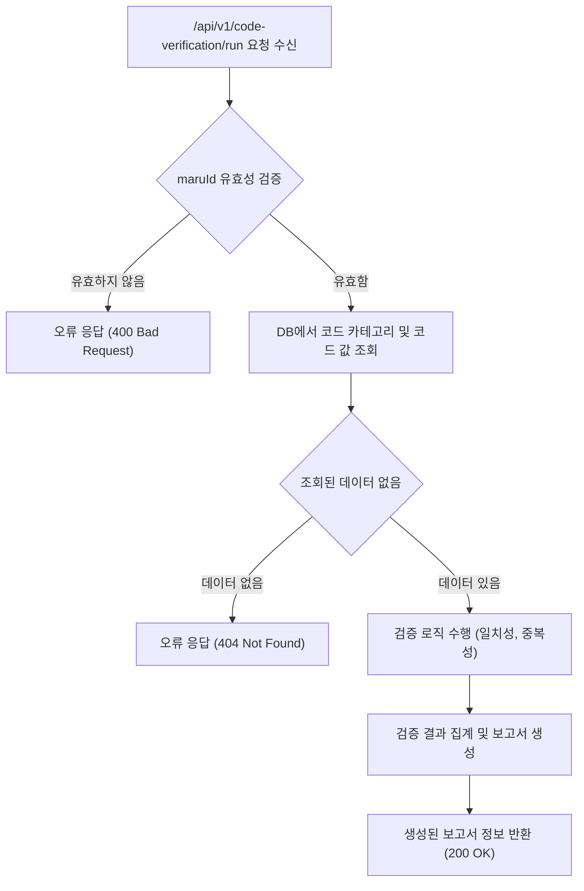

# 📄 상세설계서: Task 8.1 CD0300 Backend API 구현

---

## 0. 문서 메타데이터

*   **문서명**: `Task-8-1.CD0300-Backend-API-구현(상세설계).md`
*   **버전/작성일/작성자**: v1.0 / 2025-10-04 / Gemini
*   **참조 문서**: `tasks.md`
*   **위치**: `./docs/project/maru/10.design/12.detail-design/`
*   **관련 이슈/티켓**: Task 8.1
*   **상위 요구사항 문서/ID**: BRD UC-007 데이터 검증

---

## 1. 목적 및 범위

*   **목적**: 코드 데이터의 일관성, 중복성, 무결성을 검증하는 백엔드 API의 상세 기능을 설계한다.
*   **범위 (포함)**:
    *   코드 카테고리 정의와 값의 일치성 검증 API
    *   중복 코드 검증 API
    *   데이터 무결성 체크 리포트 생성 기능
*   **범위 (제외)**:
    *   Frontend UI 구현
    *   검증 로직 실행을 위한 스케줄링 기능

---

## 2. 요구사항 & 승인 기준

### 2.1. 요구사항

*   **[REQ-CD0300-001]**: API는 코드 값이 해당 카테고리의 정의(타입, 정규식 등)와 일치하는지 검증해야 한다.
*   **[REQ-CD0300-002]**: API는 동일 카테고리 내에서 중복된 코드 값이 있는지 검증해야 한다.
*   **[REQ-CD0300-003]**: API는 모든 검증 결과를 종합한 데이터 무결성 보고서를 생성하고 요약 정보를 제공해야 한다.
*   **[REQ-CD0300-004]**: 구현된 모든 API 엔드포인트는 Swagger를 통해 문서화되어야 한다.

### 2.2. 요구사항-설계 추적 매트릭스

| 요구사항 ID | 요구사항 설명 | 설계 섹션/아티팩트 | 테스트 케이스 ID | 상태 | 비고 |
|---|---|---|---|---|---|
| REQ-CD0300-001 | 코드 값-카테고리 정의 일치성 검증 | §5, §8 | TC-API-CD0300-001 | 초안 | |
| REQ-CD0300-002 | 중복 코드 값 검증 | §5, §8 | TC-API-CD0300-002 | 초안 | |
| REQ-CD0300-003 | 무결성 보고서 생성 | §7, §8 | TC-API-CD0300-003 | 초안 | |
| REQ-CD0300-004 | Swagger API 문서화 | §8 | TC-API-CD0300-004 | 초안 | |

---

## 5. 프로세스 흐름

### 5.2. 프로세스 설계 개념도 (Mermaid)



---

## 6. UI 레이아웃 설계

*   해당 없음 (백엔드 API 설계)

---

## 7. 데이터/메시지 구조 (개념 수준)

### 7.1. 입력 데이터 구조
*   **POST /api/v1/code-verification/run**
    ```json
    {
      "maruId": "string",
      "verificationTypes": ["consistency", "duplicate", "integrity"]
    }
    ```

### 7.2. 출력 데이터 구조
*   **성공 (200 OK)**
    ```json
    {
      "reportId": "string",
      "maruId": "string",
      "summary": {
        "totalChecked": "number",
        "consistencyErrors": "number",
        "duplicateErrors": "number"
      },
      "results": [
        {
          "code": "string",
          "errorType": "string",
          "message": "string"
        }
      ]
    }
    ```

---

## 8. 인터페이스 계약(Contract)

*   **API**: `POST /api/v1/code-verification/run`
*   **목적**: 특정 마루(maruId)에 대한 코드 데이터 검증을 실행하고 결과를 반환합니다.
*   **성공 조건**: 요청이 유효하고 서버에서 성공적으로 검증 프로세스를 완료한 경우 `200 OK`와 함께 결과 보고서를 반환합니다.
*   **오류 조건**:
    *   `400 Bad Request`: `maruId`가 누락되거나 형식이 잘못된 경우.
    *   `404 Not Found`: `maruId`에 해당하는 데이터가 없는 경우.
    *   `500 Internal Server Error`: 서버 내부 오류 발생 시.

---

## 9. 오류/예외/경계조건

*   **예상 오류**: `maruId` 없음, DB 연결 실패, 조회 데이터 없음.
*   **처리 방안**: 각 상황에 맞는 HTTP 상태 코드와 명확한 오류 메시지를 반환합니다.

---

## 10. 보안/품질 고려

*   **인가**: 해당 API는 'admin' 권한을 가진 사용자만 호출할 수 있도록 제한합니다.
*   **입력 검증**: `maruId` 등 외부 입력 값에 대해 SQL Injection을 방지하는 로직을 포함합니다.

---

## 11. 성능 및 확장성

*   **성능**: 대량의 코드 검증 시 시간이 오래 걸릴 수 있으므로, 비동기 처리 방식을 고려합니다. 클라이언트는 먼저 작업 요청을 받고, 별도의 API를 통해 진행 상태 및 결과를 조회할 수 있습니다.
*   **확장성**: 새로운 검증 유형(예: `referential_integrity`)이 추가될 수 있도록 `verificationTypes` 배열을 통해 유연한 구조를 가집니다.

---

## 12. 테스트 전략

*   **단위 테스트**: 각 검증 로직(일치성, 중복성)에 대한 순수 함수 테스트를 작성합니다.
*   **통합 테스트**: API 엔드포인트를 실제 DB와 연동하여 요청부터 응답까지 전체 흐름을 테스트합니다. 정상 케이스, 오류 케이스, 경계값 케이스를 모두 포함합니다.

---

## 13. UI 테스트케이스

*   해당 없음 (백엔드 API 설계)
