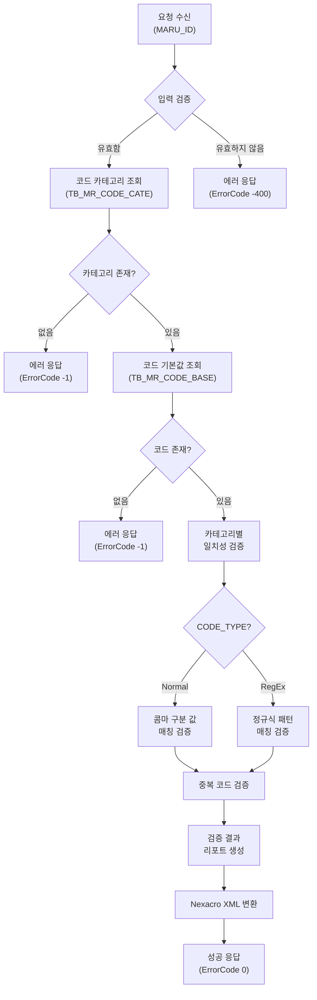
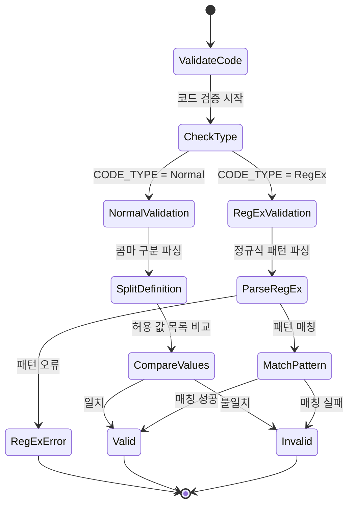

# 📄 Task-8-1.CD0300-Backend-API-구현 상세설계서

**Template Version:** 1.3.0 — **Last Updated:** 2025-10-05

---

## 0. 문서 메타데이터

* **문서명**: `Task-8-1.CD0300-Backend-API-구현(상세설계).md`
* **버전/작성일/작성자**: v1.0 / 2025-10-05 / Claude Code
* **참조 문서**:
  * `./docs/project/maru/00.foundation/02.design-baseline/3. api-design.md`
  * `./docs/project/maru/00.foundation/02.design-baseline/5. program-list.md`
  * `./docs/project/maru/00.foundation/02.design-baseline/2. database-design.md`
* **위치**: `./docs/project/maru/10.design/12.detail-design/`
* **관련 이슈/티켓**: Task 8.1 - CD0300 Backend API 구현
* **상위 요구사항 문서/ID**: BRD UC-007 데이터 검증
* **요구사항 추적 담당자**: System Architect
* **추적성 관리 도구**: tasks.md (Project Charter)

---

## 1. 목적 및 범위

### 1.1 목적
MARU 시스템의 코드 검증 관리 기능을 제공하는 Backend API를 설계하고 구현한다. 코드 카테고리 정의와 실제 코드 기본값 간의 일치성을 자동으로 검증하여 데이터 무결성을 보장한다.

### 1.2 범위

**포함**:
- 코드 카테고리 정의와 일치성 검증 API (CB006)
- 중복 코드 검증 기능
- 데이터 무결성 체크 리포트 생성
- Swagger API 문서화
- Normal 타입 (콤마 구분 값) 검증 로직
- RegEx 타입 (정규식) 검증 로직

**제외**:
- Frontend UI 구현 (Task 8.2에서 처리)
- 자동 수정 기능 (향후 고도화)
- 실시간 검증 기능 (향후 고도화)

---

## 2. 요구사항 & 승인 기준 (Acceptance Criteria)

### 2.1. 요구사항

* **요구사항 원본 링크**: BRD UC-007 데이터 검증, API 기본설계서 섹션 8.1

**기능 요구사항**:

| 요구사항 ID | 요구사항 설명 | 우선순위 |
|-------------|---------------|----------|
| [REQ-001] | 코드 카테고리 정의(Normal/RegEx)와 코드 기본값 일치성 검증 | High |
| [REQ-002] | Normal 타입: 콤마 구분 값 목록과 코드값 일치 검증 | High |
| [REQ-003] | RegEx 타입: 정규식 패턴과 코드값 일치 검증 | High |
| [REQ-004] | 중복 코드 검증 (동일 MARU_ID 내) | High |
| [REQ-005] | 검증 결과 리포트 생성 (유효/무효 코드 목록) | Medium |
| [REQ-006] | Nexacro Dataset XML 형식 응답 | High |
| [REQ-007] | 선분 이력 모델 기반 최신 유효 데이터 검증 | High |

**비기능 요구사항**:

| 요구사항 ID | 요구사항 설명 | 측정 기준 |
|-------------|---------------|-----------|
| [REQ-NF-001] | 성능: 1000개 코드 검증 시 5초 이내 응답 | 응답 시간 < 5초 |
| [REQ-NF-002] | 안정성: 잘못된 정규식 처리 시 에러 복구 | 에러 응답 반환 |
| [REQ-NF-003] | 보안: SQL Injection 방지 (Parameterized Query) | 코드 리뷰 통과 |

**승인 기준**:

- [ ] CB006 API 엔드포인트 정상 동작
- [ ] Normal 타입 검증 로직 정확성 100%
- [ ] RegEx 타입 검증 로직 정확성 100%
- [ ] 중복 코드 검증 정확성 100%
- [ ] 단위 테스트 커버리지 90% 이상
- [ ] Swagger 문서화 완료
- [ ] Nexacro Dataset XML 응답 형식 준수

### 2.2. 요구사항-설계 추적 매트릭스

| 요구사항 ID | 요구사항 설명 | 설계 섹션/아티팩트 | 테스트 케이스 ID | 상태 | 비고 |
|-------------|---------------|--------------------|------------------|------|------|
| [REQ-001] | 코드 카테고리 일치성 검증 | §5 프로세스 흐름 / §8 API 계약 | TC-API-001 | 초안 | |
| [REQ-002] | Normal 타입 검증 | §5.1 검증 로직 / §7 데이터 구조 | TC-API-002 | 초안 | |
| [REQ-003] | RegEx 타입 검증 | §5.1 검증 로직 / §7 데이터 구조 | TC-API-003 | 초안 | |
| [REQ-004] | 중복 코드 검증 | §5.1 검증 로직 | TC-API-004 | 초안 | |
| [REQ-005] | 검증 결과 리포트 | §7.2 출력 데이터 / §8 API 응답 | TC-API-005 | 초안 | |
| [REQ-006] | Nexacro XML 응답 | §7.2 출력 데이터 / §8 API 응답 | TC-API-006 | 초안 | |
| [REQ-007] | 선분 이력 최신 데이터 | §4 시스템 개요 / §5 프로세스 | TC-API-007 | 초안 | |

---

## 3. 용어/가정/제약

### 3.1 용어 정의

| 용어 | 정의 |
|------|------|
| **코드 카테고리** | 코드 분류 및 검증 규칙을 정의하는 메타데이터 (TB_MR_CODE_CATE) |
| **코드 기본값** | 실제 사용되는 코드값과 코드명 (TB_MR_CODE_BASE) |
| **Normal 타입** | 콤마로 구분된 허용 값 목록 (예: "1,2,3,4,5") |
| **RegEx 타입** | 정규식 패턴 (예: "^[A-Z]{2}[0-9]{4}$") |
| **선분 이력 모델** | START_DATE, END_DATE로 시간 구간을 표현하는 데이터 모델 |
| **Nexacro Dataset XML** | Nexacro N Framework 전용 XML 응답 형식 |

### 3.2 가정 (Assumptions)

- 코드 카테고리는 이미 생성되어 있다고 가정
- 코드 기본값은 이미 생성되어 있다고 가정
- 검증 대상은 현재 유효한 데이터 (END_DATE = '9999-12-31 23:59:59')
- 정규식은 JavaScript RegExp 호환 패턴
- 단일 관리자만 사용하는 PoC 환경 (인증/권한 체크 생략)

### 3.3 제약 (Constraints)

- PoC 단계로 대량 데이터 검증은 고려하지 않음 (향후 배치 처리 고려)
- 자동 수정 기능은 제공하지 않음 (수동 수정 필요)
- 코드 카테고리가 없는 경우 검증 불가
- RegEx 패턴이 잘못된 경우 에러 응답 반환

---

## 4. 시스템/모듈 개요

### 4.1 역할 및 책임

**CD0300 Backend API (코드 검증 관리)**:
- 코드 카테고리 정의 조회
- 코드 기본값 목록 조회
- 일치성 검증 로직 실행
- 중복 코드 검증 로직 실행
- 검증 결과 리포트 생성
- Nexacro Dataset XML 응답 변환

### 4.2 외부 의존성

| 의존성 | 용도 | 버전 |
|--------|------|------|
| Express.js | HTTP 라우팅 및 미들웨어 | 5.x |
| knex.js | SQL 쿼리 빌더 | 3.x |
| Oracle Database | 데이터 저장소 | 19c |
| Joi | 요청 데이터 검증 | 17.x |

### 4.3 상호작용 개요

```
Frontend (Nexacro N) → HTTP POST → Express Router → Controller → Service → Database
                                                                      ↓
                                           Nexacro XML Response ← XML Builder
```

---

## 5. 프로세스 흐름

### 5.1 프로세스 설명 [REQ-001]

**코드 검증 프로세스**:

1. **요청 수신**: Frontend에서 검증 요청 수신 (MARU_ID 필수)
2. **입력 검증**: Joi 스키마로 요청 파라미터 검증
3. **코드 카테고리 조회**: TB_MR_CODE_CATE에서 최신 카테고리 정의 조회 [REQ-007]
4. **코드 기본값 조회**: TB_MR_CODE_BASE에서 최신 코드 목록 조회 [REQ-007]
5. **일치성 검증**: [REQ-002, REQ-003]
   - Normal 타입: 콤마 구분 값 목록과 비교
   - RegEx 타입: 정규식 패턴 매칭
6. **중복 코드 검증**: 동일 MARU_ID 내 중복 CODE 검색 [REQ-004]
7. **결과 리포트 생성**: 유효/무효 코드 목록 및 오류 메시지 생성 [REQ-005]
8. **Nexacro XML 응답**: 검증 결과를 Nexacro Dataset XML로 변환 [REQ-006]
9. **응답 반환**: HTTP 200 + ErrorCode 0/-100 응답

### 5.2. 프로세스 설계 개념도 (Mermaid)

#### 코드 검증 프로세스 흐름도



#### 검증 로직 상세 (Normal vs RegEx)



---

## 6. UI 레이아웃 설계 (Text Art + SVG)

> **참고**: 본 Task는 Backend API 구현이므로 UI 설계는 제외합니다.
> UI 설계는 Task 8.2 "CD0300-Frontend-UI-구현"에서 처리됩니다.

---

## 7. 데이터/메시지 구조 (개념 수준)

### 7.1. 입력 데이터 구조

**API 엔드포인트**: `POST /api/v1/maru-headers/{maruId}/validate-codes`

**경로 파라미터**:

| 파라미터 | 타입 | 필수 | 설명 | 검증 규칙 |
|----------|------|------|------|-----------|
| maruId | string | Y | 마루 고유 식별자 | 1-50자, 영숫자/언더스코어 |

**요청 본문 (JSON)** - 선택적:

```json
{
  "categoryIds": ["DEPT_LEVEL", "DEPT_TYPE"],  // 특정 카테고리만 검증 (생략 시 전체)
  "includeValid": false  // 유효한 코드도 결과에 포함 여부 (기본값: false)
}
```

### 7.2. 출력 데이터 구조

**성공 응답 (Nexacro Dataset XML)**:

```xml
<?xml version="1.0" encoding="UTF-8"?>
<Dataset>
  <ErrorCode>0</ErrorCode>
  <ErrorMsg></ErrorMsg>
  <SuccessRowCount>3</SuccessRowCount>

  <ColumnInfo>
    <Column id="CATEGORY_ID" type="STRING" size="50"/>
    <Column id="CATEGORY_NAME" type="STRING" size="200"/>
    <Column id="CODE" type="STRING" size="100"/>
    <Column id="CODE_NAME" type="STRING" size="200"/>
    <Column id="VALIDATION_STATUS" type="STRING" size="20"/>
    <Column id="ERROR_TYPE" type="STRING" size="50"/>
    <Column id="ERROR_MESSAGE" type="STRING" size="500"/>
    <Column id="CODE_DEFINITION" type="STRING" size="4000"/>
  </ColumnInfo>

  <Rows>
    <!-- 유효하지 않은 코드 예시 -->
    <Row>
      <Col id="CATEGORY_ID">DEPT_LEVEL</Col>
      <Col id="CATEGORY_NAME">부서레벨</Col>
      <Col id="CODE">LEVEL99</Col>
      <Col id="CODE_NAME">최고레벨</Col>
      <Col id="VALIDATION_STATUS">INVALID</Col>
      <Col id="ERROR_TYPE">DEFINITION_MISMATCH</Col>
      <Col id="ERROR_MESSAGE">허용된 값이 아닙니다. 허용값: 1,2,3,4,5</Col>
      <Col id="CODE_DEFINITION">1,2,3,4,5</Col>
    </Row>

    <!-- 정규식 불일치 예시 -->
    <Row>
      <Col id="CATEGORY_ID">DEPT_CODE</Col>
      <Col id="CATEGORY_NAME">부서코드</Col>
      <Col id="CODE">dept001</Col>
      <Col id="CODE_NAME">경영지원팀</Col>
      <Col id="VALIDATION_STATUS">INVALID</Col>
      <Col id="ERROR_TYPE">REGEX_MISMATCH</Col>
      <Col id="ERROR_MESSAGE">정규식 패턴과 일치하지 않습니다. 패턴: ^[A-Z]{2}[0-9]{4}$</Col>
      <Col id="CODE_DEFINITION">^[A-Z]{2}[0-9]{4}$</Col>
    </Row>

    <!-- 중복 코드 예시 -->
    <Row>
      <Col id="CATEGORY_ID">DEPT_TYPE</Col>
      <Col id="CATEGORY_NAME">부서유형</Col>
      <Col id="CODE">TYPE001</Col>
      <Col id="CODE_NAME">사업부</Col>
      <Col id="VALIDATION_STATUS">INVALID</Col>
      <Col id="ERROR_TYPE">DUPLICATE_CODE</Col>
      <Col id="ERROR_MESSAGE">중복된 코드입니다. (2개 발견)</Col>
      <Col id="CODE_DEFINITION">사업부,지원부,연구소</Col>
    </Row>
  </Rows>
</Dataset>
```

**에러 응답 (Nexacro Dataset XML)**:

```xml
<?xml version="1.0" encoding="UTF-8"?>
<Dataset>
  <ErrorCode>-1</ErrorCode>
  <ErrorMsg>마루 헤더를 찾을 수 없습니다.</ErrorMsg>
  <SuccessRowCount>0</SuccessRowCount>

  <ColumnInfo>
    <Column id="ERROR_FIELD" type="STRING" size="50"/>
    <Column id="ERROR_VALUE" type="STRING" size="100"/>
  </ColumnInfo>

  <Rows>
    <Row>
      <Col id="ERROR_FIELD">maruId</Col>
      <Col id="ERROR_VALUE">DEPT_CODE_999 (존재하지 않음)</Col>
    </Row>
  </Rows>
</Dataset>
```

### 7.3. 시스템간 I/F 데이터 구조

**데이터베이스 조회 쿼리 (개념)**:

```sql
-- 1. 코드 카테고리 조회 (최신 유효 데이터)
SELECT CATEGORY_ID, CATEGORY_NAME, CODE_TYPE, CODE_DEFINITION
FROM TB_MR_CODE_CATE
WHERE MARU_ID = :maruId
  AND END_DATE = TO_TIMESTAMP('9999-12-31 23:59:59', 'YYYY-MM-DD HH24:MI:SS')
ORDER BY CATEGORY_ID;

-- 2. 코드 기본값 조회 (최신 유효 데이터)
SELECT CODE, CODE_NAME
FROM TB_MR_CODE_BASE
WHERE MARU_ID = :maruId
  AND END_DATE = TO_TIMESTAMP('9999-12-31 23:59:59', 'YYYY-MM-DD HH24:MI:SS')
ORDER BY SORT_ORDER, CODE;

-- 3. 중복 코드 검증
SELECT CODE, COUNT(*) AS DUPLICATE_COUNT
FROM TB_MR_CODE_BASE
WHERE MARU_ID = :maruId
  AND END_DATE = TO_TIMESTAMP('9999-12-31 23:59:59', 'YYYY-MM-DD HH24:MI:SS')
GROUP BY CODE
HAVING COUNT(*) > 1;
```

---

## 8. 인터페이스 계약(Contract)

### 8.1. API CB006: 코드 검증 [REQ-001]

**엔드포인트**: `POST /api/v1/maru-headers/{maruId}/validate-codes`

**경로 파라미터**:

| 파라미터 | 타입 | 필수 | 설명 |
|----------|------|------|------|
| maruId | string | Y | 마루 고유 식별자 |

**쿼리 파라미터**: 없음

**요청 본문 (JSON)** - 선택적:

```json
{
  "categoryIds": ["CATEGORY_ID_1", "CATEGORY_ID_2"],
  "includeValid": false
}
```

**성공 응답 (HTTP 200 + Nexacro XML)**:

- ErrorCode: 0
- ErrorMsg: 빈 문자열
- SuccessRowCount: 검증 결과 건수
- Rows: 검증 결과 상세 (VALIDATION_STATUS, ERROR_TYPE, ERROR_MESSAGE)

**오류 응답**:

| ErrorCode | ErrorMsg | 발생 조건 |
|-----------|----------|-----------|
| -1 | 마루 헤더를 찾을 수 없습니다. | MARU_ID가 존재하지 않음 |
| -1 | 코드 카테고리가 정의되지 않았습니다. | 카테고리가 없음 |
| -1 | 코드 기본값이 등록되지 않았습니다. | 코드가 없음 |
| -100 | 정규식 패턴이 올바르지 않습니다. | RegEx 파싱 오류 |
| -200 | 시스템 오류가 발생했습니다. | 서버 내부 오류 |
| -400 | 입력값이 올바르지 않습니다. | maruId 누락 또는 형식 오류 |

**검증 케이스**:

| 테스트 케이스 ID | 시나리오 | 기대 결과 |
|------------------|----------|-----------|
| TC-API-001 | 정상 검증 (모든 코드 유효) | ErrorCode 0, SuccessRowCount 0 |
| TC-API-002 | Normal 타입 불일치 | VALIDATION_STATUS = INVALID, ERROR_TYPE = DEFINITION_MISMATCH |
| TC-API-003 | RegEx 타입 불일치 | VALIDATION_STATUS = INVALID, ERROR_TYPE = REGEX_MISMATCH |
| TC-API-004 | 중복 코드 검출 | VALIDATION_STATUS = INVALID, ERROR_TYPE = DUPLICATE_CODE |
| TC-API-005 | MARU_ID 없음 | ErrorCode -1, ErrorMsg 적절한 메시지 |
| TC-API-006 | 잘못된 정규식 | ErrorCode -100, ErrorMsg 정규식 오류 |
| TC-API-007 | 선분 이력 최신 데이터 검증 | END_DATE = '9999-12-31 23:59:59' 데이터만 조회 |

**Swagger 주소**: `http://localhost:3000/api-docs` (개발 서버)

---

## 9. 오류/예외/경계조건

### 9.1. 예상 오류 상황 및 처리 방안

| 오류 시나리오 | 원인 | 처리 방안 | ErrorCode |
|---------------|------|-----------|-----------|
| MARU_ID 없음 | 존재하지 않는 마루 ID | "마루 헤더를 찾을 수 없습니다." 메시지 반환 | -1 |
| 코드 카테고리 없음 | 카테고리 미정의 | "코드 카테고리가 정의되지 않았습니다." 메시지 반환 | -1 |
| 코드 기본값 없음 | 코드 미등록 | "코드 기본값이 등록되지 않았습니다." 메시지 반환 | -1 |
| 정규식 패턴 오류 | 잘못된 RegEx | try-catch로 포착, "정규식 패턴이 올바르지 않습니다." 반환 | -100 |
| DB 연결 실패 | 네트워크/서버 오류 | "시스템 오류가 발생했습니다." 메시지 반환 | -200 |
| 입력 검증 실패 | maruId 누락 또는 형식 오류 | Joi 검증 오류 메시지 반환 | -400 |

### 9.2. 복구 전략 및 사용자 메시지

**복구 전략**:

1. **데이터베이스 일시적 오류**: 재시도 로직 (최대 3회, 지수 백오프)
2. **정규식 패턴 오류**: 해당 카테고리만 스킵하고 나머지 검증 계속
3. **대량 데이터 처리 시 타임아웃**: 배치 처리 권장 메시지 표시

**사용자 메시지 (한글)**:

- "검증 완료: {총건수}개 중 {유효건수}개 유효, {무효건수}개 무효"
- "카테고리 '{카테고리명}'의 정규식 패턴이 올바르지 않아 검증을 건너뛰었습니다."
- "대량 데이터 검증은 시간이 오래 걸릴 수 있습니다. 배치 처리를 권장합니다."

---

## 10. 보안/품질 고려

### 10.1 보안

**인증/인가**:
- PoC 단계로 인증/권한 체크 생략
- 향후 JWT 기반 인증 적용 예정

**입력 검증**:
- Joi 스키마로 maruId 형식 검증
- SQL Injection 방지: knex.js Parameterized Query 사용
- 정규식 ReDoS 공격 방지: timeout 설정 (1초)

**비밀/키 관리**:
- 해당 없음 (검증 API는 민감 정보 미처리)

**로깅/감사**:
- 검증 요청 로그 기록 (MARU_ID, 요청 시각, 검증 결과 요약)
- 에러 발생 시 상세 로그 기록

### 10.2 품질

**코드 품질**:
- ESLint 규칙 준수
- 함수 단위 단위 테스트 작성
- 코드 커버리지 90% 이상

**의존성 취약점 관리**:
- npm audit 정기 실행
- 보안 패치 적용

**i18n/l10n**:
- 현재 한글만 지원
- 향후 다국어 메시지 지원 고려 (ALTER_CODE_NAME1~5 활용)

---

## 11. 성능 및 확장성(개념)

### 11.1 목표/지표

| 성능 지표 | 목표 값 | 측정 방법 |
|-----------|---------|-----------|
| 응답 시간 (100개 코드) | < 1초 | 평균 응답 시간 측정 |
| 응답 시간 (1000개 코드) | < 5초 | 평균 응답 시간 측정 |
| 동시 요청 처리 | 10 req/sec | 부하 테스트 |
| 메모리 사용량 | < 100MB | 프로파일링 |

### 11.2 병목 예상 지점과 완화 전략

**병목 지점**:

1. **대량 코드 조회**: TB_MR_CODE_BASE 테이블 풀 스캔
   - **완화**: 인덱스 활용 (MARU_ID, END_DATE), LIMIT 쿼리
2. **정규식 매칭**: 복잡한 RegEx 패턴 시 느림
   - **완화**: timeout 설정 (1초), 캐싱 고려
3. **중복 코드 검증**: GROUP BY 연산 부하
   - **완화**: HAVING 절 최적화, 필요시 인메모리 처리

**캐시 전략**:
- 코드 카테고리 정의는 자주 변경되지 않으므로 node-cache 적용 (TTL 10분)
- 검증 결과는 캐싱하지 않음 (실시간 데이터 보장)

### 11.3 부하/장애 시나리오 대응

**부하 시나리오**:
- 1000개 이상 코드 검증 요청 시 "배치 처리 권장" 메시지 표시
- 동시 요청 급증 시 Queue 방식 처리 고려 (향후)

**장애 시나리오**:
- DB 연결 실패 시 재시도 (3회, 지수 백오프)
- 타임아웃 발생 시 부분 결과 반환 + 경고 메시지

---

## 12. 테스트 전략 (TDD 계획)

### 12.1 단위 테스트 시나리오

**실패 테스트 (Red)**:

| 테스트 ID | 시나리오 | 예상 결과 |
|-----------|----------|-----------|
| UT-001 | MARU_ID 없이 API 호출 | ErrorCode -400, "입력값이 올바르지 않습니다." |
| UT-002 | 존재하지 않는 MARU_ID | ErrorCode -1, "마루 헤더를 찾을 수 없습니다." |
| UT-003 | Normal 타입 불일치 코드 | VALIDATION_STATUS = INVALID, ERROR_TYPE = DEFINITION_MISMATCH |
| UT-004 | RegEx 타입 불일치 코드 | VALIDATION_STATUS = INVALID, ERROR_TYPE = REGEX_MISMATCH |
| UT-005 | 중복 코드 검증 | VALIDATION_STATUS = INVALID, ERROR_TYPE = DUPLICATE_CODE |
| UT-006 | 잘못된 정규식 패턴 | ErrorCode -100, "정규식 패턴이 올바르지 않습니다." |

**최소 구현 (Green)**:

1. **마루 헤더 존재 확인**: TB_MR_HEAD 조회 쿼리
2. **코드 카테고리 조회**: TB_MR_CODE_CATE 조회 (선분 이력 필터)
3. **코드 기본값 조회**: TB_MR_CODE_BASE 조회 (선분 이력 필터)
4. **Normal 타입 검증 함수**: 콤마 구분 파싱 + 배열 비교
5. **RegEx 타입 검증 함수**: new RegExp() + test() 메서드
6. **중복 코드 검증 쿼리**: GROUP BY + HAVING COUNT > 1
7. **Nexacro XML 변환 함수**: createNexacroResponse() 헬퍼

**리팩터링 포인트 (Refactor)**:

- 검증 로직을 별도 서비스 클래스로 분리 (ValidatorService)
- Normal/RegEx 검증을 Strategy 패턴으로 추상화
- 에러 응답 생성 로직 공통 함수화
- 캐싱 로직 추가 (코드 카테고리 정의)

### 12.2 통합 테스트 시나리오

| 테스트 ID | 시나리오 | 검증 항목 |
|-----------|----------|-----------|
| IT-001 | E2E 검증 플로우 (정상) | HTTP 200, ErrorCode 0, 검증 결과 정확성 |
| IT-002 | E2E 검증 플로우 (불일치) | HTTP 200, ErrorCode 0, INVALID 코드 정확히 검출 |
| IT-003 | 선분 이력 최신 데이터 검증 | END_DATE = '9999-12-31 23:59:59' 데이터만 처리 |
| IT-004 | Nexacro XML 응답 형식 | XML 파싱 성공, ColumnInfo 일치 |

---

## 13. UI 테스트케이스

> **참고**: 본 Task는 Backend API 구현이므로 UI 테스트케이스는 제외합니다.
> UI 테스트케이스는 Task 8.2 "CD0300-Frontend-UI-구현"에서 작성됩니다.

---

**승인**

| 역할 | 이름 | 서명 | 날짜 |
|------|------|------|------|
| API 설계자 | Claude Code | ✓ | 2025-10-05 |
| 백엔드 개발자 | | | |
| 품질 관리자 | | | |
