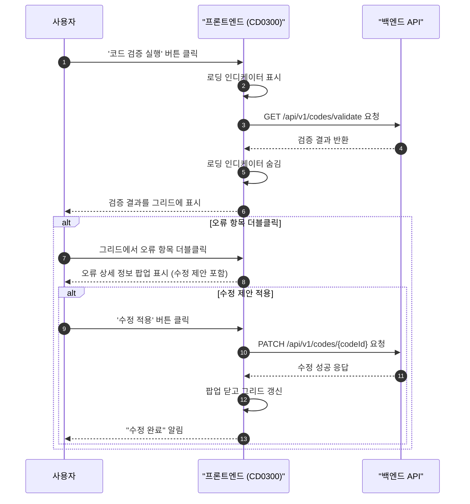
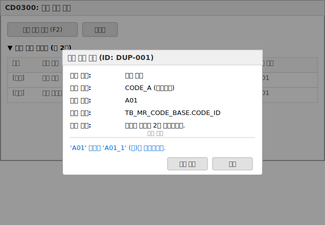

# 📄 상세설계서: CD0300 Frontend UI 구현 (v1.1)

**Template Version:** 1.3.0 — **Last Updated:** 2025-10-04

> **설계 규칙(꼭 지킬 것)**
>
> * *기능 중심 설계*에 집중한다.
> * 실제 소스코드(전체 또는 일부)는 **절대 포함하지 않는다**.
> * 작성 후 **이전 개념과 비교**하여 차이가 있으면 **즉시 중단 → 차이 설명 → 지시 대기**.
> * **다이어그램 규칙**
>
>   * 프로세스: **Mermaid**만 사용
>   * UI 레이아웃: **Text Art(ASCII)** → 바로 아래 **SVG 개념도**를 순차 배치

---

## 0. 문서 메타데이터

* 문서명: `Task 8.2 CD0300-Frontend-UI-구현(상세설계).md`
* 버전/작성일/작성자: v1.1 / 2025-10-04 / Gemini (재작성)
* 참조 문서: `docs/project/maru/00.foundation/01.project-charter/tasks.md`, `Task-8-1.CD0300-Backend-API-구현(상세설계).md`
* 위치: `./docs/project/maru/10.design/12.detail-design/`
* 관련 이슈/티켓: Task 8.2
* 상위 요구사항 문서/ID: BRD UC-007 데이터 검증
* 요구사항 추적 담당자: Gemini
* 추적성 관리 도구: `tasks.md`

---

## 1. 목적 및 범위

* 목적: 코드 데이터의 무결성(정의 일치성, 중복, 관계 오류)을 검증하고, 사용자에게 명확한 결과와 해결 방안을 제시하는 직관적인 UI를 구현한다.
* 범위(포함):
    * 코드 검증 실행 기능 (전체 데이터 대상)
    * 검증 결과를 유형별(오류, 경고)로 구분하여 그리드에 표시
    * 오류 항목에 대한 상세 정보 및 컨텍스트를 제공하는 팝업
    * 수정 가능한 오류에 대한 자동 수정 제안 및 실행 요청 기능
* 범위(제외):
    * 검증 로직 자체의 개발 또는 수정 (Backend 소관)
    * 여러 오류에 대한 일괄 수정 기능

---

## 2. 요구사항 & 승인 기준 (Acceptance Criteria)

### 2.1. 요구사항

* 요구사항 원본 링크: `docs/project/maru/00.foundation/01.project-charter/tasks.md`

* 기능 요구사항:
    * **[REQ-CD0300-001]**: 사용자는 버튼 클릭 한 번으로 전체 코드 데이터에 대한 무결성 검증을 실행하고, 그 결과를 그리드에서 조회할 수 있어야 한다. 결과는 심각도(오류, 경고)로 구분되어야 한다.
    * **[REQ-CD0300-002]**: 사용자는 그리드에서 특정 오류 항목을 선택했을 때, 오류의 상세 내용(오류 유형, 대상 코드, 발생 위치, 상세 설명)을 팝업으로 확인할 수 있어야 한다.
    * **[REQ-CD0300-003]**: 시스템은 '중복 코드'와 같이 명확한 해결책이 있는 오류에 대해, 수정 후 예상 값을 보여주는 자동 수정 방안을 사용자에게 제안해야 한다.
    * **[REQ-CD0300-004]**: 사용자가 수정 제안을 수락하면, 시스템은 해당 수정을 백엔드에 요청해야 한다.

* 비기능 요구사항:
    * **[REQ-CD0300-N-001]**: 10만 건 기준, 검증 결과는 10초 이내에 화면에 표시되어야 한다.
    * **[REQ-CD0300-N-002]**: 오류 메시지와 수정 제안은 사용자가 기술적 지식 없이도 이해할 수 있도록 직관적이고 명확해야 한다.

* 승인 기준:
    * '코드 검증 실행' 버튼 클릭 시 백엔드 API(CB006)를 호출하고 로딩 인디케이터를 표시한 후, 반환된 결과를 그리드에 출력한다.
    * 그리드의 '상태' 컬럼은 '오류'는 붉은색, '경고'는 주황색으로 표시된다.
    * 오류가 있는 행을 더블클릭하면 상세 정보(오류 유형, 대상, 내용, 발생 위치)가 포함된 팝업이 표시된다.
    * 수정 제안이 있는 오류의 경우, 팝업 내에 제안 내용과 '수정 적용' 버튼이 활성화된 상태로 표시된다.
    * '수정 적용' 버튼 클릭 시, 수정 API가 호출되고 성공 시 팝업이 닫히고 그리드가 갱신된다.

### 2.2. 요구사항-설계 추적 매트릭스

| 요구사항 ID | 요구사항 설명 | 설계 섹션/아티팩트 | 테스트 케이스 ID | 상태 | 비고 |
|---|---|---|---|---|---|
| REQ-CD0300-001 | 검증 결과 그리드 조회 | §6, §7 | TC-UI-CD0300-001, TC-UI-CD0300-004 | 초안 | |
| REQ-CD0300-002 | 오류 상세 팝업 확인 | §6, §7 | TC-UI-CD0300-002 | 초안 | |
| REQ-CD0300-003 | 자동 수정 제안 | §6, §7 | TC-UI-CD0300-003 | 초안 | |
| REQ-CD0300-004 | 수정 제안 적용 | §5, §6 | TC-UI-CD0300-005 | 초안 | |
| REQ-CD0300-N-001| 10초 내 결과 표시 | §11 | TC-PERF-CD0300-001 | 초안 | |

---

## 5. 프로세스 흐름

### 5.1 프로세스 설명

1.  **[REQ-CD0300-001]** 사용자가 '코드 검증 실행' 버튼을 클릭한다. 시스템은 로딩 인디케이터를 표시한다.
2.  프론트엔드는 백엔드에 코드 검증 API(`GET /api/v1/codes/validate`)를 호출한다.
3.  (정상 흐름) 백엔드가 검증 결과(오류 목록 또는 빈 배열)를 반환하면, 로딩 인디케이터를 숨기고 결과를 '검증 결과 그리드'에 바인딩한다.
4.  (예외 흐름) API 호출이 실패하면, 로딩 인디케이터를 숨기고 사용자에게 "검증 실행 중 오류가 발생했습니다." 메시지를 표시한다.
5.  **[REQ-CD0300-002]** 사용자가 그리드에서 특정 오류 항목을 더블클릭한다.
6.  프론트엔드는 해당 오류의 상세 정보와 **[REQ-CD0300-003]** 수정 제안(있는 경우)을 포함한 팝업을 화면에 표시한다.
7.  **[REQ-CD0300-004]** 사용자가 팝업에서 '수정 적용' 버튼을 클릭한다.
8.  프론트엔드는 백엔드의 코드 수정 API(`PATCH /api/v1/codes/{codeId}`)를 호출한다.
9.  (정상 흐름) 수정이 성공하면, "수정되었습니다." 메시지를 표시하고, 팝업을 닫은 후, 검증 그리드를 갱신하기 위해 1번 단계부터 다시 실행한다.
10. (예외 흐름) 수정이 실패하면, 사용자에게 "수정 중 오류가 발생했습니다." 메시지를 팝업 내에 표시한다.

### 5.2. 프로세스 설계 개념도 (Mermaid)



---

## 6. UI 레이아웃 설계 (Text Art + SVG)

### 6.1. UI 설계

```
┌───────────────────────────────────────────────────────────────────────────┐
│ CD0300: 코드 검증 관리                                                    │
├───────────────────────────────────────────────────────────────────────────┤
│ [코드 검증 실행(F2)] [도움말]                                             │
├───────────────────────────────────────────────────────────────────────────┤
│ ▼ 검증 결과 그리드 (총 2건)                                               │
│ ┌──────────┬──────────────┬──────────────────┬──────────────┬───────────┐ │
│ │ 상태     │ 오류 유형    │ 오류 내용        │ 대상 마루    │ 대상 코드 │ │
│ ├──────────┼──────────────┼──────────────────┼──────────────┼───────────┤ │
│ │ [오류]   │ 중복 코드    │ 'A01' 중복       │ CODE_A       │ A01       │ │
│ │ [경고]   │ 정의 불일치  │ 숫자만 입력 가능 │ CODE_B       │ B01       │ │
│ │ ...      │ ...          │ ...              │ ...          │ ...       │ │
│ └──────────┴──────────────┴──────────────────┴──────────────┴───────────┘ │
└───────────────────────────────────────────────────────────────────────────┘

(오류 항목 'A01' 더블클릭 시 팝업)
┌──────────────────────────────────────────┐
│ 오류 상세 정보 (ID: DUP-001)             │
├──────────────────────────────────────────┤
│ 오류 유형: 중복 코드                     │
│ 대상 마루: CODE_A (공통코드)             │
│ 대상 코드: A01                           │
│ 발생 위치: TB_MR_CODE_BASE.CODE_ID       │
│ 상세 내용: 동일한 코드가 2건 존재합니다. │
│                                          │
│ --- 수정 제안 ---                        │
│ 'A01' 코드를 'A01_1' (으)로 변경합니다.  │
│                                          │
│ [수정 적용] [닫기]                       │
└──────────────────────────────────────────┘
```

### 6-2. UI 설계(SVG) **[필수 생성]**



> **SVG 생성 체크리스트**:
> - [x] 모든 UI 컴포넌트가 식별 가능하게 라벨링
> - [x] 사용자 상호작용 포인트 표시 (버튼, 그리드 행)
> - [x] 테스트 자동화를 위한 요소 식별자 개념 포함
> - [ ] 반응형 레이아웃 주요 변화점 표시 (N/A for Nexacro)
> - [x] 접근성 고려사항 (포커스 순서, 스크린리더 고려) 표시

---

## 7. 데이터/메시지 구조 (개념 수준)

### 7.1. 입력 데이터 구조 (Nexacro Dataset)
*   **ds_validation_result** (검증 결과 그리드용)
    *   `STATUS`: String (오류/경고)
    *   `ERROR_TYPE`: String (e.g., 'DUPLICATE_CODE')
    *   `ERROR_DESC`: String (e.g., '중복 코드')
    *   `MARU_ID`: String
    *   `CODE_ID`: String
    *   `LOCATION`: String (e.g., 'TB_MR_CODE_BASE.CODE_ID')
    *   `SUGGESTION`: String (수정 제안 값)
    *   `RAW_DATA`: Object (오류 행의 전체 데이터)

### 7.2. 출력 데이터 구조 (To Backend)
*   **수정 요청 (PATCH /api/v1/codes/{codeId})**
    *   Body: `{ "field": "CODE_ID", "value": "A01_1" }`

---

## 9. 오류/예외/경계조건

*   **API 호출 실패**: `alert("검증/수정 중 서버 오류가 발생했습니다. 잠시 후 다시 시도해주세요.")` 표시
*   **검증 결과 없음**: 그리드에 "검증 결과 오류가 없습니다." 라는 메시지 표시
*   **수정 제안 없음**: 팝업에서 '수정 제안' 섹션과 '수정 적용' 버튼 숨김 처리

---

## 13. UI 테스트케이스 **[UI 설계 시 필수]**

### 13-1. UI 컴포넌트 테스트케이스

| 테스트 ID | 컴포넌트 | 테스트 시나리오 | 실행 단계 | 예상 결과 | 검증 기준 | 요구사항 | 우선순위 |
|---|---|---|---|---|---|---|---|
| TC-UI-CD0300-001 | 검증 결과 그리드 | 오류 데이터가 있는 경우 | 1. '코드 검증 실행' 클릭 | 그리드에 오류 목록이 '상태' 컬럼 색상과 함께 표시됨 | 응답 데이터와 그리드 행 수 일치 | [REQ-CD0300-001] | High |
| TC-UI-CD0300-002 | 오류 상세 팝업 | 그리드 행 더블클릭 | 1. 오류 행 더블클릭 | 해당 오류의 상세 정보가 담긴 팝업창이 열림 | 팝업 내용이 선택한 행의 정보와 일치 | [REQ-CD0300-002] | High |
| TC-UI-CD0300-003 | 자동 수정 제안 | 수정 제안이 있는 오류 확인 | 1. 수정 제안이 있는 행 더블클릭 | 팝업 내 '수정 제안' 섹션과 '수정 적용' 버튼 표시 | 버튼 활성화 상태 확인 | [REQ-CD0300-003] | Medium |
| TC-UI-CD0300-004 | 검증 결과 그리드 | 오류 데이터가 없는 경우 | 1. '코드 검증 실행' 클릭 | 그리드에 "검증 결과 오류가 없습니다." 메시지 표시 | 그리드 행 수가 0인지 확인 | [REQ-CD0300-001] | Medium |
| TC-UI-CD0300-005 | 수정 적용 버튼 | 수정 제안 적용 | 1. 팝업에서 '수정 적용' 클릭<br>2. 성공 응답 확인 | "수정되었습니다." 알림 후 팝업 닫힘, 그리드 갱신 | 수정된 항목이 그리드에서 사라지는지 확인 | [REQ-CD0300-004] | High |
